# SDLC E2E Scenario: Feature Implementation via Codex

This document serves as a concrete, end-to-end scenario to test the active SDLC pipeline constraints, integrations, and logic loops. It defines the target feature, expected execution semantics, and handoff points when hooking up our pipeline to a Codex agent.

## The Target Feature
**Objective**: "Add a structured markdown report generator to the `gunbc-review` CLI tool."

Currently, `gunbc-review` outputs a JSON report of findings. We want an additional flag (`--format markdown`) that outputs a clean, markdown-formatted review summary containing the detected issues, their severity, and candidate fixes.

### Intent Definition (`TODO/feature-intent-markdown.yaml`)
- **Objective**: Add markdown formatting support to `gunbc-review`.
- **Constraint**: Must use standard Rust Markdown formatting libraries or raw string generation. Must adhere to the existing `gunbc-review` findings schema.
- **Success Criteria**: CLI accepts `--format markdown`, outputs standard MD format, passes integration test with a mock finding.

---

## 1. Intent Intake & Idea Generation
The user initializes the feature request into the SDLC.

**Action**: User runs:
```bash
gunbc-sdlc intake --intent TODO/feature-intent-markdown.yaml
```

**Expected Pipeline Logic**:
1. The `intake` command maps this to a new GitHub issue (e.g. `issue #42`).
2. Label `stage: idea` is set.
3. The intent is stored in the `intake-ledger.json` with an idempotency `run_key`.
4. The `gunbc-sdlc worker` loop discovers the issue via a GitHub Webhook or cron-tick.

---

## 2. Phase 2A: Idea -> Design
The `SDLC Worker` (stateless executor) acquires a claim for issue #42.

**Action**: Worker executes `design.dag`.

**Expected Pipeline Logic**:
1. It reads the intent criteria and objective.
2. Formats a prompt to the LLM (`Anthropic` or `OpenAI`) via the `tools.design` DSL.
3. The LLM generates the "Software Design Specification":
   - Add `format` enum field to `CliArgs` in `gunbc-dag/src/bin/review.rs`.
   - Add `render_markdown_report` function that iterates through `ReviewFindings`.
4. Saves this generated markdown content to the Artifact Ledger sequentially under a provisional, then canonical marker (`sdlc:artifact:canonical:intent-...`).
5. Updates the issue label: `stage: design`.

---

## 3. Phase 2B: Design -> Design Review
The worker detects the `design` stage label.

**Action**: Worker executes the `review_design` stage.

**Expected Pipeline Logic**:
1. Worker extracts the canonical design document from the ledger.
2. Queries the LLM (acting as Staff Engineer/Reviewer).
3. **Review Criteria Evaluated**:
   - Backward compatibility (JSON must remain default).
   - Testability (Are there acceptance tests defined in the design?) 
4. LLM outputs `approved: true` with a comment summarizing the design review.
5. The issue label is transitioned to `stage: design-review`.
6. Since `review_output.approved` is true, the `accept_design` stage triggers, transitioning the label directly to `stage: accepted`.

---

## 4. Phase 3: Autonomous Implementation Handoff (Codex)
This is where the agent ecosystem takes over from the orchestration pipeline. The pipeline acknowledges the `Accepted` state and yields control.

**Action**: Codex webhook or orchestrator daemon detects `stage: accepted` and spins up the implementation loop.

**Expected Agent Logic (Codex)**:
1. Agent checks out `gunbc` repo locally.
2. Creates branch `feature/intent-md-report`.
3. Pulls down the `design_output.md` from the artifact ledger.
4. **Development Loop**:
   - Edits `gunbc-dag/src/bin/review.rs`.
   - Edits `gunbc-dag/tests/review_cli.rs` to add the `--format markdown` test.
   - Runs `cargo check` and `cargo test`.
   - Loops on errors (if any) until the workspace compiles and passes tests.
5. Commits the changes using `intent_id` and `issue_id` in the commit message.
6. Pushes the branch and opens a GitHub Pull Request linking to Issue #42.

---

## 5. Phase 4: CI/CD & Diff Review Validation
The Pull Request is opened. GitHub Actions triggers the standard DAG verification loop (`ci.dag`).

**Action**: `gunbc-review` diff review is triggered against the PR branch.

**Expected Pipeline Logic**:
1. `gunbc-review` runs using the *real-mode* credentials (`ANTHROPIC_API_KEY`), reviewing the Codex agent's diff.
2. It evaluates standard criteria:
   - Error handling (Are there panics? Are errors mapped gracefully?)
   - Idempotency / Output soundness.
3. If structural code flaws exist, `gunbc-review` comments on the PR, and Codex must iterate.
4. If findings == 0, and the `build_ci_subdag` (clippy, testgen, deps) passes, the PR is marked green.

---

## SDLC E2E Architecture Diagram

```mermaid
sequenceDiagram
    autonumber
    actor Dev as Developer
    participant CL as Intake Ledger
    participant SDLC as gunbc-sdlc (Worker)
    participant GH as GitHub APIs
    participant LLM as LLM Provider
    participant Codex as Codex Agent

    Dev->>SDLC: `intake --intent feature.yaml`
    SDLC->>GH: Map Intent & Ensure Issue (stage:idea)
    SDLC->>CL: Persist Run Key
    
    rect rgb(30, 0, 30)
    Note over SDLC,LLM: Idea -> Design
    SDLC->>GH: Claim Lease
    SDLC->>LLM: Generate Design Prompt
    LLM-->>SDLC: Design Document (Markdown)
    SDLC->>CL: Persist Canonical Design Artifact
    SDLC->>GH: Transition Stage (Idea -> Design)
    end
    
    rect rgb(0, 30, 0)
    Note over SDLC,LLM: Design -> Design Review
    SDLC->>LLM: Evaluate Design vs Criteria
    LLM-->>SDLC: Structured Approval JSON
    SDLC->>GH: Comment findings, Transition Stage (Design -> Accepted)
    end
    
    rect rgb(0, 0, 30)
    Note over Codex,GH: Autonomous Implementation Loop
    GH-->>Codex: Webhook (stage: accepted)
    Codex->>CL: Read Design Artifact
    loop iterative development
        Codex->>Codex: Edit Code + cargo test + cargo clippy
    end
    Codex->>GH: Push Branch & Open PR
    end
    
    rect rgb(40, 40, 40)
    Note over SDLC,GH: Pull Request Validation
    GH-->>SDLC: Trigger CI DAG & Diff Review
    SDLC->>LLM: Diff Review (gunbc-review)
    LLM-->>SDLC: Return Findings
    alt Issues Found
        SDLC->>GH: Post PR Comments
        GH-->>Codex: Address Comments & Repush
    else Passed
        SDLC->>GH: Mark Green / Merge
    end
    end
```


