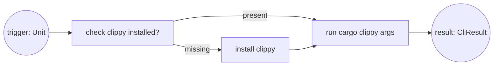
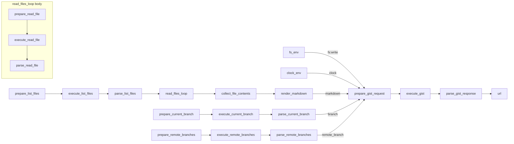

# Traditional vs Graph-First Workflows (Clippy + Gist)

This doc shows two side-by-side comparisons: a minimal tool workflow (clippy upsert) and a real workflow (gist snapshot). Each example is written in three traditional styles and then modeled as a gunbc DAG, with guarantees and generated artifacts called out.

## What Is gunbc (10-second version)

gunbc is a compiler/validator for workflows modeled as **typed DAGs**. You build a graph, validate it, and execute it in `DryRun` (intercept boundaries) or `Real` mode. SubDags let you package reusable subgraphs as a node, and explicit transport boundary nodes isolate I/O.

Example 1 (minimal): clippy upsert
- Goal: ensure clippy is installed, then run it
- Build-time config: `args: [String]` (CLI flags for the run step)
- Runtime input: `trigger: Unit`
- Output: `result: CliResult`

Interface (call shape):

```text
Build-time:  args: [String]
Runtime:     trigger: Unit
Output:      result: CliResult

dag = build_clippy_graph(args)
{result} = execute(dag, {trigger: ()})
```

Example 2 (real): gist snapshot
- Mode: Snapshot (list files, read contents, render code blocks, create gist)
- Input: `repo_path: String`
- Output: `url: String`
- I/O boundaries: git commands and gist creation via explicit transport execution

Interface (call shape):

```text
Build-time:  mode = Snapshot, extensions, public
Runtime:     repo_path: String
Output:      url: String

dag = build_gist_graph(Snapshot, extensions, public)
{url} = execute(dag, {repo_path})
```

## Core Difference: Graph-First Workflows

Traditional code makes workflow structure implicit: ordering, wiring, I/O boundaries, and skip paths live in control flow and conventions.

gunbc makes the workflow itself explicit as a **typed DAG**. The graph is validated and compiled into an artifact you can inspect, execute (`DryRun` or `Real`), and generate mocks/tests from. Wiring, boundaries, and dataflow become first-class objects, not “whatever the code happens to do.”

## Structural Guarantees by Construction (Fewer Hand-Written Tests)

When a DAG validates, the following structural properties are proven by construction:
- The workflow is acyclic.
- All edges are type-compatible.
- All edges are cardinality-compatible.
- SubDag interfaces match their parent usage.
- Entrypoints and boundaries are inferred structurally from connectivity.
- Resource inputs can be validated as fully wired (no dangling resource ports).

These guarantees don’t replace behavioral testing (op semantics and boundary behavior), but they eliminate a large class of manual “wiring correctness” tests.

Boundary definition (used below): boundary nodes are the nodes where data crosses a trust boundary (external I/O, environment acquisition, or workflow terminals). These are the natural interception points in DryRun.

---

## A. Minimal Tool: clippy upsert

### A.1 Imperative (Rust-style)

```rust
fn run_clippy(args: &[&str]) -> Result<()> {
    if !clippy_installed()? {
        install_clippy()?;
    }
    run_clippy_command(args)?;
    Ok(())
}
```

Helper implementations (simple sketch):

```rust
use std::process::Command;

fn clippy_installed() -> Result<bool> {
    // `rustup component list --installed` and check for "clippy".
    let out = Command::new("rustup")
        .args(["component", "list", "--installed"])
        .output()?;
    Ok(String::from_utf8_lossy(&out.stdout).contains("clippy"))
}

fn install_clippy() -> Result<()> {
    // Run `rustup component add clippy` and return error on failure.
    let status = Command::new("rustup")
        .args(["component", "add", "clippy"])
        .status()?;
    if !status.success() {
        return Err("rustup component add clippy failed".into());
    }
    Ok(())
}

fn run_clippy_command(args: &[&str]) -> Result<()> {
    // Execute `cargo clippy {args...}` and return error on non-zero exit.
    let status = Command::new("cargo").arg("clippy").args(args).status()?;
    if !status.success() {
        return Err("cargo clippy failed".into());
    }
    Ok(())
}
```

What you get:
- Straightforward control flow.

What you must ensure manually:
- The check/install/run wiring is consistent and complete.
- The "already installed" fast path is correct.

---

<details>
<summary><strong>A.2 OO (Java-style)</strong></summary>

```java
final class ClippyRunner {
    private final ToolInstaller installer;
    private final ToolRunner runner;

    void run(String[] args) throws IOException {
        if (!installer.isInstalled("clippy")) {
            installer.install("clippy");
        }
        runner.run("clippy", args);
    }
}

final class ToolInstaller {
    boolean isInstalled(String tool) throws IOException {
        // Call `rustup component list --installed` and check for tool.
        return true;
    }

    void install(String tool) throws IOException {
        // Run `rustup component add <tool>`.
    }
}

final class ToolRunner {
    void run(String tool, String[] args) throws IOException {
        // Execute `cargo clippy {args...}`.
    }
}
```

What you get:
- Clear seams for testing and substitution.

What you must ensure manually:
- The upsert pattern stays consistent across call sites.

</details>

---

<details>
<summary><strong>A.3 Functional (Haskell-style)</strong></summary>

```haskell
runClippy :: [String] -> IO ()
runClippy args = do
  installed <- clippyInstalled
  unless installed installClippy
  runClippyCommand args

clippyInstalled :: IO Bool
clippyInstalled = do
  -- Check `rustup component list --installed` for clippy.
  pure True

installClippy :: IO ()
installClippy = do
  -- Run `rustup component add clippy`.
  pure ()

runClippyCommand :: [String] -> IO ()
runClippyCommand _ = do
  -- Execute `cargo clippy {args...}`.
  pure ()
```

What you get:
- Explicit effects and composability.

What you must ensure manually:
- The upsert structure is preserved and tested.

</details>

---

### A.4 gunbc DAG (Clippy Upsert)

Clippy uses the generic CLI upsert pattern. The builder returns a **SubDag node** containing the check → install → run flow (internally, this maps to UpsertBuilder’s check/create/resolve phases).

Mermaid (conceptual flow):



```rust
use gunbc_ir::node::Node;
use gunbc_ir::transport::cli::{self, build_cli_upsert, CliToolOp};

pub fn build_clippy_upsert(args: &[&str]) -> Node<CliToolOp> {
    build_cli_upsert(&cli::CLIPPY, args)
}
```

Shape of the sub-DAG (simplified, actual node IDs):

```text
+------------------------- clippy (SubDag) --------------------------+
| [check]   (is clippy installed?)                                  |
|    | exists = false                                               |
| [create]  (rustup component add clippy)                           |
|    |                                                              |
| [resolve] (cargo clippy {args...})                                |
|    ^                                                              |
|    +-- exists = true: skip create --------------------------------+
+-------------------------------------------------------------------+
```

Actual code (core upsert builder in `core/ir/src/transport/cli.rs`):

```rust
pub fn build_cli_upsert(tool: &'static CliToolDef, args: &[&str]) -> Node<CliToolOp> {
    UpsertBuilder::new(tool.id)
        .with_check(CliToolOp::check(tool))       // check: is clippy installed?
        .with_create(CliToolOp::install(tool))    // create: rustup component add clippy
        .with_resolve(CliToolOp::run(tool, args)) // resolve: cargo clippy {args...}
        .with_input_port("trigger", "Unit")
        .with_output_port("result", "CliResult")
        .build()
}
```

What gunbc compilation proves (beyond Rust/Java compilers):
- The upsert flow is acyclic and structurally complete.
- All edges are type-compatible and cardinality-compatible.
- The SubDag interface matches how the parent graph uses it.

What you still test (on purpose):
- The semantics of each op (e.g., is clippy installed? correct flags?).
- The behavior of the transport boundary (error mapping, retries, auth).

MockSpec (excerpt from `lib/tools/clippy/src/graph_mock.rs`):

<!-- BEGIN GENERATED:clippy_mock_spec -->
```rust
use gunbc_ir::Value;
use gunbc_test::{InputConstraint, MockSpec};
use std::collections::BTreeMap;

fn mock_cli_result() -> Value {
    let mut map = BTreeMap::new();
    map.insert("success".to_string(), Value::Bool(true));
    map.insert("exit_code".to_string(), Value::Int(0));
    map.insert("stdout".to_string(), Value::Str(String::new()));
    map.insert("stderr".to_string(), Value::Str(String::new()));
    Value::Map(map)
}

/// Mock specification for the clippy DAG.
///
/// The check node is mocked to return `exists = true` so the create node
/// is skipped during DryRun. The resolve node returns a mock CliResult.
pub fn clippy_mock_spec() -> MockSpec {
    MockSpec::new("clippy")
        // Mock check.exists so create is skipped.
        .boundary("check", "exists", Value::Bool(true))
        // Mock resolve.result so the DAG has a concrete output.
        .boundary("resolve", "result", mock_cli_result())
        // Entry inputs (unit trigger) for isolated DAG execution.
        .input_mock("check", "trigger", Value::Unit)
        .input_mock("create", "trigger", Value::Unit)
        .input_mock("resolve", "trigger", Value::Unit)
        // Document the expected external input.
        .expects_input("trigger", InputConstraint::Any)
        // Skip node examples (these nodes are exercised via DAG-level tests).
        .skip_node_example("check")
        .skip_node_example("create")
        .skip_node_example("resolve")
}
```
<!-- END GENERATED:clippy_mock_spec -->

Generated Rust (testgen output, excerpt):

<!-- BEGIN GENERATED:clippy_generated_test_excerpt -->
```rust
// Generated by gunbc-testgen (trimmed: guard_test omitted)

/// DryRun execution completes without crash.
/// 
/// This is the minimal smoke test: build the DAG, run it in DryRun
/// with explicit boundary mocks, and verify it completes successfully.
#[test]
fn test_dryrun_completion() {
    let dag = crate::build_clippy_graph_lint_all();
    let log = execute_with_mode(&dag, ExecutionMode::DryRun(mock_spec().to_boundary_mocks())).expect("DryRun execution should complete without crash");
    assert!(!log.entries.is_empty(), "execution should produce log entries");
}
```
<!-- END GENERATED:clippy_generated_test_excerpt -->

Real run (DAG execution):

```rust
use gunbc_exec::{execute_with_mode, ExecutionMode};
use gunbc_clippy::build_clippy_graph_lint_all;

let dag = build_clippy_graph_lint_all();
let _log = execute_with_mode(&dag, ExecutionMode::Real)?;
```

Tests (clippy):
- Generated tests (testgen): `lib/tools/clippy/src/generated_tests.rs` (see Appendix B).
- MockSpec: `lib/tools/clippy/src/graph_mock.rs`.
- Manual unit tests: `lib/tools/clippy/src/*.rs` (see Appendix B).
- Appendix (generated artifacts): `docs/ab-writing-workflows-generated.md`.

---

## B. Real Workflow: gist snapshot

Other gist modes exist (Diff, Recent), but the example below stays on Snapshot to keep the comparison tight.

### B.1 Imperative (Rust-style)

```rust
fn run_gist_snapshot(repo_path: &Path, public: bool) -> Result<String> {
    let files = git_ls_files(repo_path)?;

    let mut contents = BTreeMap::new();
    for file in files {
        let text = std::fs::read_to_string(repo_path.join(&file))?;
        contents.insert(file, text);
    }

    let markdown = render_code_snapshot(&contents);

    let branch = git_current_branch(repo_path)?;
    let remote_branch = git_remote_branches_at_head(repo_path)?;

    let request = prepare_gist_request(markdown, branch, remote_branch, None, public)?;
    let response = execute_transport(request)?;
    let url = parse_gist_response(response)?;

    Ok(url)
}
```

What you get:
- Familiar, direct control over ordering and error handling.
- Full freedom to wire dependencies however you like.

What you must ensure manually:
- The workflow structure is acyclic and complete.
- I/O boundaries are isolated, mocked, and tested correctly.
- Optional inputs and skip paths are handled consistently.

---

<details>
<summary><strong>B.2 OO (Java-style)</strong></summary>

```java
final class GistWorkflow {
    private final GitClient git;
    private final Renderer renderer;
    private final GistClient gist;
    private final FileSystem fs;

    String runSnapshot(Path repoPath, boolean isPublic) throws IOException {
        List<String> files = git.lsFiles(repoPath);
        Map<String, String> contents = new HashMap<>();
        for (String f : files) {
            contents.put(f, fs.readString(repoPath.resolve(f)));
        }
        String markdown = renderer.renderCodeSnapshot(contents);

        String branch = git.currentBranch(repoPath);
        String remoteBranch = git.remoteBranchesAtHead(repoPath);

        GistRequest request = gist.prepare(markdown, branch, remoteBranch, null, isPublic);
        GistResponse response = gist.execute(request);
        return gist.parseUrl(response);
    }
}
```

What you get:
- Dependency injection seams for testing.
- Clear object boundaries.

What you must ensure manually:
- The order and completeness of the workflow wiring.
- Exhaustive tests for success and per-boundary failures.

</details>

---

<details>
<summary><strong>B.3 Functional (Haskell-style)</strong></summary>

```haskell
runSnapshot :: RepoPath -> Bool -> IO Url
runSnapshot repoPath isPublic = do
  files     <- gitLsFiles repoPath
  contents  <- readFiles repoPath files
  markdown  <- renderCodeSnapshot contents
  branch    <- gitCurrentBranch repoPath
  remote    <- gitRemoteBranchesAtHead repoPath
  response  <- executeTransport (prepareGistRequest markdown branch remote Nothing isPublic)
  pure (parseGistResponse response)
```

What you get:
- Explicit effect boundaries and clean composition.

What you must ensure manually:
- The graph structure is well-formed (acyclic, compatible, complete).
- The transport boundary behavior and skip paths are fully tested.

</details>

---

### B.4 gunbc DAG (Gist Snapshot)

#### DAG structure (real nodes, simplified view)

Snapshot mode in `lib/tools/gist/src/graph.rs` builds this structure.

If your markdown supports Mermaid, this renders the graph:



ASCII fallback (simplified, real node names):

```text
+------------------ List + Read ------------------+
| prepare_list_files -> execute_list_files -> parse_list_files |
| parse_list_files -> read_files_loop (SubDag)                 |
| read_files_loop -> collect_file_contents -> render_markdown  |
+--------------------------------------------------------------+

+------------------ Branch Inputs -----------------+
| prepare_current_branch -> execute_current_branch -> parse_current_branch --branch--> prepare_gist_request |
| prepare_remote_branches -> execute_remote_branches -> parse_remote_branches --remote_branch--> prepare_gist_request |
+---------------------------------------------------+

[fs_env] --fs:write--> prepare_gist_request
[clock_env] --clock--> prepare_gist_request
render_markdown --markdown--> prepare_gist_request
prepare_gist_request -> execute_gist -> parse_gist_response -> url

read_files_loop (SubDag):
  prepare_read_file -> execute_read_file -> parse_read_file
```

Real code (excerpt from `lib/tools/gist/src/graph.rs`):

```rust
let prepare_gist_request = builder.add_node_after(
    Node::opaque(
        "prepare_gist_request",
        vec![
            scalar("markdown", "String"),
            optional("branch", "String"),
            optional("remote_branch", "String"),
            optional("base_ref", "String"),
            resource("fs", "FilesystemHandle", AccessMode::Read),
            resource("clock", "Timestamp", AccessMode::Read),
        ],
        vec![scalar("request", "TransportRequest"), scalar("skip", "Bool")],
        GistGraphOp::Gist(GistOps::PrepareRequest { public }),
    ),
    &render_markdown,
)?;

builder.add_edge(
    render_markdown.out("markdown"),
    prepare_gist_request.in_port("markdown"),
)?;
builder.add_edge(
    current_branch.parse.out("branch"),
    prepare_gist_request.in_port("branch"),
)?;
builder.add_edge(
    remote_branches.parse.out("remote_branch"),
    prepare_gist_request.in_port("remote_branch"),
)?;
builder.add_edge(
    fs_env.out("fs:write"),
    prepare_gist_request.in_port("res:fs"),
)?;
builder.add_edge(
    clock_env.out("clock"),
    prepare_gist_request.in_port("res:clock"),
)?;
```

Key points:
- All I/O is concentrated in `TransportOps::Execute` nodes.
- The file read loop is a SubDag with its own transport boundary.
- `fs_env` and `clock_env` provide resource inputs to `prepare_gist_request`.
- `prepare_gist_request` consumes: `markdown`, `branch?`, `remote_branch?`, `base_ref?`, `res:fs`, and `res:clock`.

Note on resource naming: `fs:write` is the handle scope; `AccessMode::Read` describes how the node uses that handle in the resource system.

Real run (DAG execution):

```rust
use gunbc_exec::{execute_with_mode, ExecutionMode};
use gunbc_gist::{build_gist_graph, GistMode};

let dag = build_gist_graph(GistMode::Snapshot, vec![], false)?;
let _log = execute_with_mode(&dag, ExecutionMode::Real)?;
```

#### What gunbc compilation proves (beyond Rust/Java compilers)

These are graph-level guarantees that general-purpose compilers do not provide:
- The workflow is acyclic.
- All edges are type-compatible and cardinality-compatible.
- SubDag interfaces (like the loop body) match their parent usage.
- Entrypoints and boundaries are inferred structurally from connectivity.
- Resource wiring is validated so resource inputs are not left dangling.

What you still test (on purpose):
- The semantics of each op (parse correctness, rendering correctness).
- Boundary behavior (transport errors, auth, retries).
- End-to-end expectations (e.g., gist request payload correctness).

#### Generated artifacts and tests (gist snapshot)

From this DAG, gunbc generates:
- A workflow signature (mode-dependent) that is validated against the DAG.
- A generated CLI runner in `target/codegen/bin/gist/main.rs`.
- A typed MockSpec extracted from the DAG structure in `lib/tools/gist/src/graph_mock.rs`.
- A generated test suite in `lib/tools/gist/src/generated_tests_snapshot.rs`.
- Generated integration tests in `lib/tools/gist/tests/generated_tests.rs`.

Full generated test index (names + descriptions): Appendix B.
Sample generated tests: Appendix A.
Appendix (generated artifacts): `docs/ab-writing-workflows-generated.md`.

Selected generated tests include:
- Signature validation (declared signature matches inferred DAG).
- DryRun completion (smoke test).
- Transport interception for each `execute_*` boundary.
- Per-transport failure scenarios and skip propagation.
- Optional input handling for ports with cardinality `0..1` or `0..*`.
- Window tests that execute contiguous subgraphs derived from the DAG.

Example shape from current output:

```rust
// Generated by gunbc-testgen
// Proven by construction: acyclicity, type compatibility, cardinality satisfaction.

#[test]
fn test_transport_interception() {
    // ... asserts all execute_* nodes are intercepted in DryRun
}
```

---

## Why this matters (short version)

Traditional code makes workflow structure implicit. gunbc makes it explicit, validated, and test-generated. You still write the business logic, but the workflow wiring, I/O boundaries, and many scenario tests become mechanically derived.

What you get:
- The diagram and the code are the same thing.
- Maintenance is zero for structure: change the graph and regenerate tests automatically.
- Failures localize to nodes and boundaries instead of ambiguous control flow.

---

## Appendix A: Sample Tests

### A.1 Clippy (generated test: DryRun completion, excerpt)

<!-- BEGIN GENERATED:appendix_a_clippy -->
```rust
// Generated by gunbc-testgen (trimmed: guard_test omitted)

/// DryRun execution completes without crash.
/// 
/// This is the minimal smoke test: build the DAG, run it in DryRun
/// with explicit boundary mocks, and verify it completes successfully.
#[test]
fn test_dryrun_completion() {
    let dag = crate::build_clippy_graph_lint_all();
    let log = execute_with_mode(&dag, ExecutionMode::DryRun(mock_spec().to_boundary_mocks())).expect("DryRun execution should complete without crash");
    assert!(!log.entries.is_empty(), "execution should produce log entries");
}
```
<!-- END GENERATED:appendix_a_clippy -->

### A.2 Gist (generated test: Transport interception, excerpt)

<!-- BEGIN GENERATED:appendix_a_gist -->
```rust
// Generated by gunbc-testgen (trimmed: guard_test omitted)

/// All transport executors are intercepted in DryRun.
/// 
/// Proves: every transport executor is interceptable; DryRun won't
/// accidentally perform real I/O.
#[test]
fn test_transport_interception() {
    let dag = crate::build_gist_graph(crate::GistMode::Snapshot, vec! [], false).unwrap();
    let result = assert_boundary_mockable(&dag, mock_spec().to_boundary_mocks());
    assert!(result.is_ok(), "All transports should be interceptable: {:?}", result.error);
    assert!(result.boundary_nodes.iter().any(|n| n == "execute_list_files"), "transport executor 'execute_list_files' should be in intercepted list");
    assert!(result.boundary_nodes.iter().any(|n| n == "execute_current_branch"), "transport executor 'execute_current_branch' should be in intercepted list");
    assert!(result.boundary_nodes.iter().any(|n| n == "execute_remote_branches"), "transport executor 'execute_remote_branches' should be in intercepted list");
    assert!(result.boundary_nodes.iter().any(|n| n == "execute_gist"), "transport executor 'execute_gist' should be in intercepted list");
}
```
<!-- END GENERATED:appendix_a_gist -->

## Appendix B: Test Index

<!-- BEGIN GENERATED:appendix_b -->
<details>
<summary><strong>B.1 Clippy Generated Tests (6)</strong></summary>

- test_dryrun_completion — DryRun execution completes without crash.
- test_guard_create_exists_branch_coverage — Guard branch coverage: 'create'.
- test_boundaries_mockable — Test that all boundaries can be mocked.
- test_boundary_resolve_mockable — Test that resolve boundary can be mocked.
- test_mock_spec_self_consistent — Test that this tool's mock spec is self-consistent.
- test_input_expectations_documented — Test that input expectations are documented.

</details>

<details>
<summary><strong>B.2 Clippy Manual Unit Tests (15)</strong></summary>

- test_clippy_check_op — Clippy check op
- test_clippy_config_builder — Clippy config builder
- test_clippy_dag_structure — Clippy dag structure
- test_clippy_lint_all_has_correct_args — Clippy lint all has correct args
- test_clippy_lint_all_op — Clippy lint all op
- test_clippy_upsert_is_subdag — Clippy upsert is subdag
- test_crate_allowance_creation — Crate allowance creation
- test_disallowed_method_creation — Disallowed method creation
- test_generate_clippy_toml — Generate clippy toml
- test_lint_id_allow_name — Lint id allow name
- test_policy_to_allowance — Policy to allowance
- test_policy_without_allowance — Policy without allowance
- test_render_implementation — Render implementation
- test_subdag_contains_upsert_nodes — Subdag contains upsert nodes
- test_transport_pattern_preset — Transport pattern preset

</details>

<details>
<summary><strong>B.3 Gist Snapshot Generated Tests (Long List)</strong></summary>

- test_signature_matches_dag — Declared signature matches the DAG inputs/outputs.
- test_dryrun_completion — DryRun execution completes without crash.
- test_transport_interception — All transport executors are intercepted in DryRun.
- test_optional_missing_collect_file_contents_filenames — Optional input: collect_file_contents.
- test_optional_wrong_type_collect_file_contents_filenames — Optional input: collect_file_contents.
- test_optional_missing_collect_file_contents_contents_list — Optional input: collect_file_contents.
- test_optional_wrong_type_collect_file_contents_contents_list — Optional input: collect_file_contents.
- test_optional_missing_prepare_gist_request_branch — Optional input: prepare_gist_request.
- test_optional_wrong_type_prepare_gist_request_branch — Optional input: prepare_gist_request.
- test_optional_missing_prepare_gist_request_remote_branch — Optional input: prepare_gist_request.
- test_optional_wrong_type_prepare_gist_request_remote_branch — Optional input: prepare_gist_request.
- test_optional_missing_prepare_gist_request_base_ref — Optional input: prepare_gist_request.
- test_optional_wrong_type_prepare_gist_request_base_ref — Optional input: prepare_gist_request.
- test_scenario_all_succeed — Happy path: all transports succeed.
- test_scenario_execute_list_files_fails — Single failure: 'execute_list_files' transport fails.
- test_scenario_execute_current_branch_fails — Single failure: 'execute_current_branch' transport fails.
- test_scenario_execute_remote_branches_fails — Single failure: 'execute_remote_branches' transport fails.
- test_scenario_execute_gist_fails — Single failure: 'execute_gist' transport fails.
- test_skip_propagation_execute_list_files — Skip propagation: 'execute_list_files' returns Skipped → downstream handles it.
- test_skip_propagation_execute_current_branch — Skip propagation: 'execute_current_branch' returns Skipped → downstream handles it.
- test_skip_propagation_execute_remote_branches — Skip propagation: 'execute_remote_branches' returns Skipped → downstream handles it.
- test_skip_propagation_execute_gist — Skip propagation: 'execute_gist' returns Skipped → downstream handles it.
- test_boundaries_mockable — Test that all boundaries can be mocked.
- test_boundary_parse_gist_response_mockable — Test that parse_gist_response boundary can be mocked.
- test_mock_spec_self_consistent — Test that this tool's mock spec is self-consistent.
- test_input_expectations_documented — Test that input expectations are documented.
- test_window_read_files_loop_unpack_through_read_files_loop_pack — Window: read_files_loop/unpack -> read_files_loop/pack
- test_window_read_files_loop_pack_through_collect_file_contents — Window: read_files_loop/pack -> collect_file_contents
- test_window_collect_file_contents_through_render_markdown — Window: collect_file_contents -> render_markdown
- test_window_render_markdown_through_prepare_gist_request — Window: render_markdown -> prepare_gist_request
- test_window_prepare_gist_request_through_execute_gist — Window: prepare_gist_request -> execute_gist
- test_window_execute_gist_through_parse_gist_response — Window: execute_gist -> parse_gist_response
- test_window_read_files_loop_unpack_through_collect_file_contents — Window: read_files_loop/unpack -> collect_file_contents
- test_window_read_files_loop_pack_through_render_markdown — Window: read_files_loop/pack -> render_markdown
- test_window_collect_file_contents_through_prepare_gist_request — Window: collect_file_contents -> prepare_gist_request
- test_window_render_markdown_through_execute_gist — Window: render_markdown -> execute_gist
- test_window_prepare_gist_request_through_parse_gist_response — Window: prepare_gist_request -> parse_gist_response
- test_window_read_files_loop_unpack_through_render_markdown — Window: read_files_loop/unpack -> render_markdown
- test_window_read_files_loop_pack_through_prepare_gist_request — Window: read_files_loop/pack -> prepare_gist_request
- test_window_collect_file_contents_through_execute_gist — Window: collect_file_contents -> execute_gist
- test_window_render_markdown_through_parse_gist_response — Window: render_markdown -> parse_gist_response
- test_window_read_files_loop_unpack_through_prepare_gist_request — Window: read_files_loop/unpack -> prepare_gist_request
- test_window_read_files_loop_pack_through_execute_gist — Window: read_files_loop/pack -> execute_gist
- test_window_collect_file_contents_through_parse_gist_response — Window: collect_file_contents -> parse_gist_response
- test_window_parse_remote_branches_through_prepare_gist_request — Window: parse_remote_branches -> prepare_gist_request
- test_window_read_files_loop_unpack_through_execute_gist — Window: read_files_loop/unpack -> execute_gist
- test_window_read_files_loop_pack_through_parse_gist_response — Window: read_files_loop/pack -> parse_gist_response
- test_window_parse_list_files_through_prepare_gist_request — Window: parse_list_files -> prepare_gist_request
- test_window_parse_remote_branches_through_execute_gist — Window: parse_remote_branches -> execute_gist
- test_window_read_files_loop_unpack_through_parse_gist_response — Window: read_files_loop/unpack -> parse_gist_response
- test_window_parse_current_branch_through_prepare_gist_request — Window: parse_current_branch -> prepare_gist_request
- test_window_parse_list_files_through_execute_gist — Window: parse_list_files -> execute_gist
- test_window_parse_remote_branches_through_parse_gist_response — Window: parse_remote_branches -> parse_gist_response
- test_window_execute_remote_branches_through_prepare_gist_request — Window: execute_remote_branches -> prepare_gist_request
- test_window_parse_current_branch_through_execute_gist — Window: parse_current_branch -> execute_gist
- test_window_parse_list_files_through_parse_gist_response — Window: parse_list_files -> parse_gist_response
- test_window_execute_list_files_through_prepare_gist_request — Window: execute_list_files -> prepare_gist_request
- test_window_execute_remote_branches_through_execute_gist — Window: execute_remote_branches -> execute_gist
- test_window_parse_current_branch_through_parse_gist_response — Window: parse_current_branch -> parse_gist_response
- test_window_execute_current_branch_through_prepare_gist_request — Window: execute_current_branch -> prepare_gist_request
- test_window_execute_list_files_through_execute_gist — Window: execute_list_files -> execute_gist
- test_window_execute_remote_branches_through_parse_gist_response — Window: execute_remote_branches -> parse_gist_response
- test_window_prepare_remote_branches_through_prepare_gist_request — Window: prepare_remote_branches -> prepare_gist_request
- test_window_execute_current_branch_through_execute_gist — Window: execute_current_branch -> execute_gist
- test_window_execute_list_files_through_parse_gist_response — Window: execute_list_files -> parse_gist_response
- test_window_prepare_list_files_through_prepare_gist_request — Window: prepare_list_files -> prepare_gist_request
- test_window_prepare_remote_branches_through_execute_gist — Window: prepare_remote_branches -> execute_gist
- test_window_execute_current_branch_through_parse_gist_response — Window: execute_current_branch -> parse_gist_response
- test_window_prepare_current_branch_through_prepare_gist_request — Window: prepare_current_branch -> prepare_gist_request
- test_window_prepare_list_files_through_execute_gist — Window: prepare_list_files -> execute_gist
- test_window_prepare_remote_branches_through_parse_gist_response — Window: prepare_remote_branches -> parse_gist_response
- test_window_fs_env_through_prepare_gist_request — Window: fs_env -> prepare_gist_request
- test_window_prepare_current_branch_through_execute_gist — Window: prepare_current_branch -> execute_gist
- test_window_prepare_list_files_through_parse_gist_response — Window: prepare_list_files -> parse_gist_response
- test_window_clock_env_through_prepare_gist_request — Window: clock_env -> prepare_gist_request
- test_window_fs_env_through_execute_gist — Window: fs_env -> execute_gist
- test_window_prepare_current_branch_through_parse_gist_response — Window: prepare_current_branch -> parse_gist_response
- test_window_clock_env_through_execute_gist — Window: clock_env -> execute_gist
- test_window_fs_env_through_parse_gist_response — Window: fs_env -> parse_gist_response
- test_window_clock_env_through_parse_gist_response — Window: clock_env -> parse_gist_response
- test_example_fs_env_provides_filesystem_handle_for_gist_filename_generation — Node example: fs_env - Provides filesystem handle for gist filename generation  Tests that node 'fs_env' produces expected outputs for given inputs.
- test_example_clock_env_provides_timestamp_for_gist_filename_generation — Node example: clock_env - Provides timestamp for gist filename generation  Tests that node 'clock_env' produces expected outputs for given inputs.
- test_example_prepare_current_branch_prepares_git_rev_parse_request_for_current_branch — Node example: prepare_current_branch - Prepares git rev-parse request for current branch  Tests that node 'prepare_current_branch' produces expected outputs for given inputs.
- test_example_parse_current_branch_parses_current_branch_name_from_git_output — Node example: parse_current_branch - Parses current branch name from git output  Tests that node 'parse_current_branch' produces expected outputs for given inputs.
- test_example_prepare_remote_branches_prepares_git_branch_r_points_at_head_request — Node example: prepare_remote_branches - Prepares git branch -r --points-at HEAD request  Tests that node 'prepare_remote_branches' produces expected outputs for given inputs.
- test_example_parse_remote_branches_parses_remote_branch_name_from_git_output — Node example: parse_remote_branches - Parses remote branch name from git output  Tests that node 'parse_remote_branches' produces expected outputs for given inputs.
- test_example_prepare_gist_request_builds_gist_creation_request_from_markdown — Node example: prepare_gist_request - Builds gist creation request from markdown  Tests that node 'prepare_gist_request' produces expected outputs for given inputs.
- test_example_parse_gist_response_extracts_gist_url_from_response_json — Node example: parse_gist_response - Extracts gist URL from response JSON  Tests that node 'parse_gist_response' produces expected outputs for given inputs.
- test_example_prepare_list_files_prepares_git_ls_files_request — Node example: prepare_list_files - Prepares git ls-files request  Tests that node 'prepare_list_files' produces expected outputs for given inputs.
- test_example_parse_list_files_parses_git_ls_files_output_into_a_file_list — Node example: parse_list_files - Parses git ls-files output into a file list  Tests that node 'parse_list_files' produces expected outputs for given inputs.
- test_example_collect_file_contents_zips_filenames_contents_into_a_map_skipping_empty_content — Node example: collect_file_contents - Zips filenames + contents into a map, skipping empty content  Tests that node 'collect_file_contents' produces expected outputs for given inputs.
- test_example_render_markdown_renders_markdown_code_snapshot — Node example: render_markdown - Renders markdown code snapshot  Tests that node 'render_markdown' produces expected outputs for given inputs.

</details>

<details>
<summary><strong>B.4 Gist Generated Integration Tests</strong></summary>

- test_boundaries_mockable — Test that all boundaries can be mocked.
- test_boundary_parse_gist_response_mockable — Test that parse_gist_response boundary can be mocked.
- test_prepare_gist_request_not_boundary — Test that prepare_gist_request is NOT a boundary (pure logic).
- test_all_edges_compatible — Test that all edge types are compatible.
- test_edge_prepare_list_to_execute_list — Test edge prepare_list_files.
- test_edge_execute_list_to_parse_list — Test edge execute_list_files.
- test_edge_parse_list_files_to_read_files_loop — Test edge parse_list_files.
- test_edge_parse_list_files_to_collect_file_contents — Test edge parse_list_files.
- test_edge_read_files_loop_to_collect_file_contents — Test edge read_files_loop.
- test_edge_collect_file_contents_to_render_markdown — Test edge collect_file_contents.
- test_edge_render_markdown_markdown_to_prepare_gist_request_markdown — Test edge render_markdown.
- test_edge_prepare_gist_request_to_execute_gist — Test edge prepare_gist_request.
- test_edge_execute_gist_to_parse_gist_response — Test edge execute_gist.
- test_edge_prepare_current_branch_to_execute_current_branch — Test edge prepare_current_branch.
- test_edge_execute_current_branch_to_parse_current_branch — Test edge execute_current_branch.
- test_edge_parse_current_branch_to_prepare_gist_request — Test edge parse_current_branch.
- test_edge_prepare_remote_branches_to_execute_remote_branches — Test edge prepare_remote_branches.
- test_edge_execute_remote_branches_to_parse_remote_branches — Test edge execute_remote_branches.
- test_edge_parse_remote_branches_to_prepare_gist_request — Test edge parse_remote_branches.
- test_edge_prepare_rev_list_to_execute_rev_list — Test edge prepare_rev_list.
- test_edge_execute_rev_list_to_parse_rev_list — Test edge execute_rev_list.
- test_edge_parse_rev_list_to_prepare_diff — Test edge parse_rev_list.
- test_execute_rev_list_not_boundary — Test that execute_rev_list is NOT a boundary node (its output is consumed by parse_rev_list).

</details>
<!-- END GENERATED:appendix_b -->

## Appendix C: Generated Artifact Chain

<!-- BEGIN GENERATED:appendix_c -->
### C.1 Clippy

Generated graph (flattened SubDag):

```text
check -> create -> resolve
```

Generated code (Rust, testgen output):

`lib/tools/clippy/src/generated_tests.rs`

Generated tests:

`lib/tools/clippy/src/generated_tests.rs`

Generated integration tests:

(None yet — add when clippy gets a CLI codegen target or integration harness.)

### C.2 Gist

Generated graph (snapshot, simplified):

```text
prepare_list_files -> execute_list_files -> parse_list_files -> read_files_loop
read_files_loop -> collect_file_contents -> render_markdown -> prepare_gist_request
prepare_gist_request -> execute_gist -> parse_gist_response -> url
```

Generated code (CLI runner, excerpt):

```rust
// target/codegen/bin/gist/main.rs
fn main() {
    // parse CLI args, build graph, run in real or dry-run
}
```

Generated tests (excerpt):

```rust
// lib/tools/gist/src/generated_tests_snapshot.rs
#[test]
fn test_dryrun_completion() { /* ... */ }
```

Generated integration tests (excerpt):

```rust
// lib/tools/gist/tests/generated_tests.rs
#[test]
fn test_boundaries_mockable() { /* ... */ }
```

Appendix (generated artifacts): `docs/ab-writing-workflows-generated.md`.
<!-- END GENERATED:appendix_c -->
