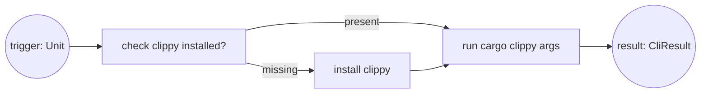
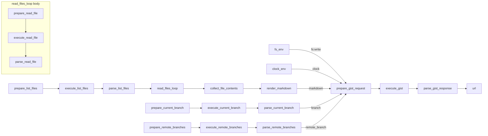

# Traditional vs DSL-First Workflows (Clippy + Gist)

This doc shows two side-by-side comparisons: a minimal tool workflow (clippy upsert) and a real workflow (gist snapshot). Each example is written in three traditional styles and then modeled as a gunbc `.dag` definition, with guarantees and generated artifacts called out. The DSL is the primary authoring surface — the compiler handles lowering to Graph IR, type-checking, and multi-language emission.

## What Is gunbc (10-second version)

gunbc is a **DSL-first workflow compiler** where everything is a DAG. You write `.dag` files, the compiler validates and lowers them to typed Graph IR, and you execute them in:
- `DryRun`: intercept boundary nodes (no real I/O)
- `Real`: run with actual transports

**Why this matters (short version)**
- The `.dag` definition and the runtime graph are the same artifact.
- Workflow wiring stays correct by construction (less hand-written wiring tests).
- Failures localize to nodes and boundaries instead of hidden control flow.
- Adding a new service or tool requires only a `.dag` file — zero hand-written Rust.

## Structural Guarantees by Construction (Fewer Hand-Written Tests)

When a DAG validates, the following structural properties are proven by construction:
- The workflow is acyclic.
- All edges are type-compatible.
- All edges are cardinality-compatible.
- SubDag interfaces match their parent usage.
- Entrypoints and boundaries are inferred structurally from connectivity.
- Resource inputs can be validated as fully wired (no dangling resource ports).

These guarantees don't replace behavioral testing (op semantics and boundary behavior), but they eliminate a large class of manual "wiring correctness" tests.

Boundary definition (used below): boundaries are the only nodes allowed to touch the outside world; DryRun intercepts them so execution can't accidentally do real I/O.

## Core Difference: DSL-First Workflows

Traditional code makes workflow structure implicit: ordering, wiring, I/O boundaries, and skip paths live in control flow and conventions.

gunbc makes the workflow itself explicit as a **typed DAG** authored in `.dag` files. The compiler validates the definition and compiles it into a Graph IR you can inspect, execute (`DryRun` or `Real`), and generate mocks/tests from. Wiring, boundaries, and dataflow become first-class objects, not "whatever the code happens to do."

Example 1 (minimal): clippy upsert
- Clippy = Rust linter distributed as a rustup component.
- Goal: ensure clippy is installed, then run it
- DSL definition: `dsl/tools/clippy.dag`
- Runtime input: `trigger: Unit`
- Output: `{ clean: Bool, findings: String }`

Interface (DSL):

```
func clippy_lint(paths: List<String>?) -> { clean: Bool, findings: String }
```

Example 2 (real): gist snapshot
- Gist snapshot = turn a repo's files into a GitHub gist.
- Mode: Snapshot (list files, read contents, render code blocks, create gist)
- DSL definitions: `dsl/services/github/gist.dag` + `dsl/tools/gist.dag`
- Runtime input: `base_ref: CommitSha?`
- Output: `{ url: Url }`

Interface (DSL):

```
func gist_snapshot(base_ref: CommitSha?) -> { url: Url }
  uses fs: Filesystem(mode: Read)
```

## DAG Model + Typing (Ports, Cardinality, Resources)

gunbc DAGs are explicit about node inputs/outputs, types, and cardinality. Optional/list ports encode `0..1` and `0..*`, and resources are explicit inputs with access modes.

```rust
Node::opaque(
    "prepare_gist_request",
    vec![
        scalar("markdown", "String"),
        optional("branch", "String"), // 0..1
        resource("fs", "FilesystemHandle", AccessMode::Read),
    ],
    vec![scalar("request", "TransportRequest"), scalar("skip", "Bool")],
    GistGraphOp::Gist(GistOps::PrepareRequest { public }),
)
```

---

## A. Minimal Tool: clippy upsert

### A.1 Imperative (Rust-style)

```rust
fn run_clippy(args: &[&str]) -> Result<()> {
    if !clippy_installed()? {
        install_clippy()?;
    }
    run_clippy_command(args)?;
    Ok(())
}
```

Helper implementations (simple sketch):

```rust
use std::process::Command;

fn clippy_installed() -> Result<bool> {
    // `rustup component list --installed` and check for "clippy".
    let out = Command::new("rustup")
        .args(["component", "list", "--installed"])
        .output()?;
    Ok(String::from_utf8_lossy(&out.stdout).contains("clippy"))
}

fn install_clippy() -> Result<()> {
    // Run `rustup component add clippy` and return error on failure.
    let status = Command::new("rustup")
        .args(["component", "add", "clippy"])
        .status()?;
    if !status.success() {
        return Err("rustup component add clippy failed".into());
    }
    Ok(())
}

fn run_clippy_command(args: &[&str]) -> Result<()> {
    // Execute `cargo clippy {args...}` and return error on non-zero exit.
    let status = Command::new("cargo").arg("clippy").args(args).status()?;
    if !status.success() {
        return Err("cargo clippy failed".into());
    }
    Ok(())
}
```

<details>
<summary><strong>A.2 OO (Java-style)</strong></summary>

```java
final class ClippyRunner {
    private final ToolInstaller installer;
    private final ToolRunner runner;

    void run(String[] args) throws IOException {
        if (!installer.isInstalled("clippy")) {
            installer.install("clippy");
        }
        runner.run("clippy", args);
    }
}

final class ToolInstaller {
    boolean isInstalled(String tool) throws IOException {
        // Call `rustup component list --installed` and check for tool.
        return true;
    }

    void install(String tool) throws IOException {
        // Run `rustup component add <tool>`.
    }
}

final class ToolRunner {
    void run(String tool, String[] args) throws IOException {
        // Execute `cargo clippy {args...}`.
    }
}
```

</details>

---

<details>
<summary><strong>A.3 Functional (Haskell-style)</strong></summary>

```haskell
runClippy :: [String] -> IO ()
runClippy args = do
  installed <- clippyInstalled
  unless installed installClippy
  runClippyCommand args

clippyInstalled :: IO Bool
clippyInstalled = do
  -- Check `rustup component list --installed` for clippy.
  pure True

installClippy :: IO ()
installClippy = do
  -- Run `rustup component add clippy`.
  pure ()

runClippyCommand :: [String] -> IO ()
runClippyCommand _ = do
  -- Execute `cargo clippy {args...}`.
  pure ()
```

</details>

Traditional approaches (all styles)

What you get:
- Straightforward control flow and clear seams for testing.

What you must ensure manually:
- The check/install/run wiring is consistent and complete.
- The "already installed" fast path is correct.

---

---

### A.4 gunbc DSL (Clippy Upsert)

Clippy uses the upsert pattern: check if installed, install if missing, then run. The DSL definition in `dsl/tools/clippy.dag` is the primary authoring surface:

```
module tools.clippy

import std.patterns { upsert }
import std.resources { Filesystem }
import services.cargo

resource Clippy {
  kind: Capability
  mode: Read
  lifecycle: Persistent

  capability check {
    input {}
    output { exists: Bool }
    @shell(["cargo", "clippy", "--version"])
    @hermetic @readonly
  }

  capability install {
    input {}
    output { installed: Bool }
    @shell(["rustup", "component", "add", "clippy"])
    @hermetic
  }

  capability resolve {
    input {}
    output { handle: String }
    @shell(["cargo", "clippy", "--version"])
    @hermetic @readonly
  }
}

func clippy_lint(paths: List<String>?) -> { clean: Bool, findings: String }
  uses clippy: Clippy
{
  tool = upsert(
    check: clippy.check(),
    create: clippy.install(),
    resolve: clippy.resolve()
  )
  result = cargo.Build.Clippy() [after tool]
  return { clean: result.success, findings: result.stderr }
}
```

The compiler lowers this to a SubDag node with the upsert pattern:



Shape of the compiled sub-DAG (simplified):

```text
+------------------------- clippy (SubDag) --------------------------+
| [check]   (is clippy installed?)                                  |
|    | exists = false                                               |
| [create]  (rustup component add clippy)                           |
|    |                                                              |
| [resolve] (cargo clippy {args...})                                |
|    ^                                                              |
|    +-- exists = true: skip create --------------------------------+
+-------------------------------------------------------------------+
```

<details>
<summary><strong>Legacy Rust builder (compilation target)</strong></summary>

The compiler generates the equivalent of this Graph IR — you no longer write it by hand:

```rust
pub fn build_cli_upsert(tool: &'static CliToolDef, args: &[&str]) -> Node<CliToolOp> {
    UpsertBuilder::new(tool.id)
        .with_check(CliToolOp::check(tool))       // check: is clippy installed?
        .with_create(CliToolOp::install(tool))    // create: rustup component add clippy
        .with_resolve(CliToolOp::run(tool, args)) // resolve: cargo clippy {args...}
        .with_input_port("trigger", "Unit")
        .with_output_port("result", "CliResult")
        .build()
}
```

</details>

What the DSL compiler proves (beyond Rust/Java compilers):
- The upsert flow is acyclic and structurally complete.
- All edges are type-compatible and cardinality-compatible.
- The SubDag interface matches how the parent graph uses it.
- Service operations have well-typed inputs/outputs matching their annotations.

MockSpec (excerpt from `lib/tools/clippy/src/graph_mock.rs`):

<!-- BEGIN GENERATED:clippy_mock_spec -->
```rust
use gunbc_ir::Value;
use gunbc_test::{InputConstraint, MockSpec};
use std::collections::BTreeMap;

fn mock_cli_result() -> Value {
    let mut map = BTreeMap::new();
    map.insert("success".to_string(), Value::Bool(true));
    map.insert("exit_code".to_string(), Value::Int(0));
    map.insert("stdout".to_string(), Value::Str(String::new()));
    map.insert("stderr".to_string(), Value::Str(String::new()));
    Value::Map(map)
}

/// Mock specification for the clippy DAG.
///
/// The check node is mocked to return `exists = true` so the create node
/// is skipped during DryRun. The resolve node returns a mock CliResult.
#[gunbc_testgen_registry_macros::testgen_target(skip, builder = "crate::build_clippy_graph_lint_all()")]
pub fn clippy_mock_spec() -> MockSpec {
    MockSpec::new("clippy")
        // Mock check.exists so create is skipped.
        .boundary("check", "exists", Value::Bool(true))
        // Mock resolve.result so the DAG has a concrete output.
        .boundary("resolve", "result", mock_cli_result())
        // Entry inputs (unit trigger) for isolated DAG execution.
        .input_mock("check", "trigger", Value::Unit)
        .input_mock("create", "trigger", Value::Unit)
        .input_mock("resolve", "trigger", Value::Unit)
        // Document the expected external input.
        .expects_input("trigger", InputConstraint::Any)
        // Skip node examples (these nodes are exercised via DAG-level tests).
        .skip_node_example("check")
        .skip_node_example("create")
        .skip_node_example("resolve")
}
```
<!-- END GENERATED:clippy_mock_spec -->

Generated Rust (testgen output, excerpt):

<!-- BEGIN GENERATED:clippy_generated_test_excerpt -->
```rust
// Generated by gunbc-testgen (trimmed: guard_test omitted)

/// DryRun execution completes without crash.
/// 
/// This is the minimal smoke test: build the DAG, run it in DryRun
/// with explicit boundary mocks, and verify it completes successfully.
#[test]
fn test_dryrun_completion() {
    let dag = crate::build_clippy_graph_lint_all();
    let log = execute_with_mode(&dag, ExecutionMode::DryRun(mock_spec().to_boundary_mocks())).expect("DryRun execution should complete without crash");
    assert!(!log.entries.is_empty(), "execution should produce log entries");
}
```
<!-- END GENERATED:clippy_generated_test_excerpt -->

Real run (DAG execution):

```rust
use gunbc_exec::{execute_with_mode, ExecutionMode};
use gunbc_clippy::build_clippy_graph_lint_all;

let dag = build_clippy_graph_lint_all();
let _log = execute_with_mode(&dag, ExecutionMode::Real)?;
```

Tests (clippy):
- Generated tests (testgen): `lib/tools/clippy/src/generated_tests.rs` (see Appendix B).
- MockSpec: `lib/tools/clippy/src/graph_mock.rs`.
- Manual unit tests: `lib/tools/clippy/src/*.rs` (see Appendix B).
- Appendix (generated artifacts): see **Appendix D**.

---

## B. Real Workflow: gist snapshot

Other gist modes exist (Diff, Recent), but the example below stays on Snapshot to keep the comparison tight.

### B.1 Imperative (Rust-style)

```rust
fn run_gist_snapshot(repo_path: &Path, public: bool) -> Result<String> {
    let files = git_ls_files(repo_path)?;

    let mut contents = BTreeMap::new();
    for file in files {
        let text = std::fs::read_to_string(repo_path.join(&file))?;
        contents.insert(file, text);
    }

    let markdown = render_code_snapshot(&contents);

    let branch = git_current_branch(repo_path)?;
    let remote_branch = git_remote_branches_at_head(repo_path)?;

    let request = prepare_gist_request(markdown, branch, remote_branch, None, public)?;
    let response = execute_transport(request)?;
    let url = parse_gist_response(response)?;

    Ok(url)
}
```

<details>
<summary><strong>B.2 OO (Java-style)</strong></summary>

```java
final class GistWorkflow {
    private final GitClient git;
    private final Renderer renderer;
    private final GistClient gist;
    private final FileSystem fs;

    String runSnapshot(Path repoPath, boolean isPublic) throws IOException {
        List<String> files = git.lsFiles(repoPath);
        Map<String, String> contents = new HashMap<>();
        for (String f : files) {
            contents.put(f, fs.readString(repoPath.resolve(f)));
        }
        String markdown = renderer.renderCodeSnapshot(contents);

        String branch = git.currentBranch(repoPath);
        String remoteBranch = git.remoteBranchesAtHead(repoPath);

        GistRequest request = gist.prepare(markdown, branch, remoteBranch, null, isPublic);
        GistResponse response = gist.execute(request);
        return gist.parseUrl(response);
    }
}
```

</details>

---

<details>
<summary><strong>B.3 Functional (Haskell-style)</strong></summary>

```haskell
runSnapshot :: RepoPath -> Bool -> IO Url
runSnapshot repoPath isPublic = do
  files     <- gitLsFiles repoPath
  contents  <- readFiles repoPath files
  markdown  <- renderCodeSnapshot contents
  branch    <- gitCurrentBranch repoPath
  remote    <- gitRemoteBranchesAtHead repoPath
  response  <- executeTransport (prepareGistRequest markdown branch remote Nothing isPublic)
  pure (parseGistResponse response)
```

</details>

Traditional approaches (all styles)

What you get:
- Direct control over ordering and error handling.

What you must ensure manually:
- The workflow structure is acyclic and complete.
- I/O boundaries are isolated, mocked, and tested correctly.
- Optional inputs and skip paths are handled consistently.

---

---

### B.4 gunbc DSL (Gist Snapshot)

#### Service definition (`dsl/services/github/gist.dag`)

```
service github.Gist {
  @endpoint("https://api.github.com")
  @auth(BearerToken)

  operation Create {
    input {
      description: String
      files: Map<String, String>
      public: Bool = false
    }
    output {
      url: Url @json("html_url")
      id: GistId
    }
    @rest(POST, "/gists")
    @permissions(["gist"])
    @mock_response(
      status: 201,
      body: { "html_url": "https://gist.github.com/mock/{id}", "id": "{id}" }
    )
  }
}
```

#### Tool workflow (`dsl/tools/gist.dag`)

```
module tools.gist

import services.git
import std.patterns { read_text_files }
import std.resources { Filesystem }
import std.types { CommitSha, Url }
import shared.gist_modes { branch_context, share_content }

fn render_snapshot(files: List<{ path: TextFilePath, content: String }>) -> String {
  let header = "# Code Snapshot\n\n"
  let sections = files
    |> map(f => "## `{f.path}`\n\n```\n{f.content}\n```")
    |> join("\n\n")
  "{header}{sections}"
}

func gist_snapshot(base_ref: CommitSha?) -> { url: Url }
  uses fs: Filesystem(mode: Read)
{
  ctx = branch_context()
  files = git.Core.LsFiles()
  read_result = read_text_files(paths: files.files)
  markdown = render_snapshot(files: read_result.files)
  result = share_content(markdown: markdown, branch: ctx.branch, base_ref: base_ref)
  return { url: result.url }
}
```

The compiler generates the transport triplet (`prepare → execute → parse`) automatically from each service call — `git.Core.LsFiles()`, `github.Gist.Create()`, etc. — no hand-written `PrepareRequest`/`ParseGistResponse` structs needed.

#### Compiled DAG structure

The compiler lowers the DSL to this Graph IR:



ASCII fallback:

```text
+------------------ List + Read ------------------+
| prepare_list_files -> execute_list_files -> parse_list_files |
| parse_list_files -> read_files_loop (SubDag)                 |
| read_files_loop -> collect_file_contents -> render_markdown  |
+--------------------------------------------------------------+

+------------------ Branch Inputs -----------------+
| prepare_current_branch -> execute_current_branch -> parse_current_branch --branch--> prepare_gist_request |
| prepare_remote_branches -> execute_remote_branches -> parse_remote_branches --remote_branch--> prepare_gist_request |
+---------------------------------------------------+

[fs_env] --fs:write--> prepare_gist_request
[clock_env] --clock--> prepare_gist_request
render_markdown --markdown--> prepare_gist_request
prepare_gist_request -> execute_gist -> parse_gist_response -> url
```

Key points:
- The `.dag` file is ~15 lines of intent. The compiler generates all the transport wiring (~60 nodes, hundreds of edges).
- All I/O is concentrated in `TransportOps::Execute` nodes.
- The file read loop is a SubDag with its own transport boundary.
- `@mock_response` on the service operation provides mock data for DryRun and testgen.

<details>
<summary><strong>Legacy Rust builder (compilation target)</strong></summary>

The compiler generates the equivalent of this Graph IR — you no longer write it by hand:

```rust
let prepare_gist_request = builder.add_node_after(
    Node::opaque(
        "prepare_gist_request",
        vec![
            scalar("markdown", "String"),
            optional("branch", "String"),
            optional("remote_branch", "String"),
            optional("base_ref", "String"),
            resource("fs", "FilesystemHandle", AccessMode::Read),
            resource("clock", "Timestamp", AccessMode::Read),
        ],
        vec![scalar("request", "TransportRequest"), scalar("skip", "Bool")],
        GistGraphOp::Gist(GistOps::PrepareRequest { public }),
    ),
    &render_markdown,
)?;

builder.add_edge(render_markdown.out("markdown"), prepare_gist_request.in_port("markdown"))?;
builder.add_edge(current_branch.parse.out("branch"), prepare_gist_request.in_port("branch"))?;
// ... (40+ more edge wiring lines)
```

</details>

Real run (compiled DAG execution):

```rust
use gunbc_exec::{execute_with_mode, ExecutionMode};
use gunbc_gist::{build_gist_graph, GistMode};

// The compiler produces this Graph IR from dsl/tools/gist.dag
let dag = build_gist_graph(GistMode::Snapshot, vec![], false)?;
let _log = execute_with_mode(&dag, ExecutionMode::Real)?;
```

#### What the DSL compiler proves (beyond Rust/Java compilers)

These are graph-level guarantees that general-purpose compilers do not provide:
- The workflow is acyclic.
- All edges are type-compatible and cardinality-compatible.
- SubDag interfaces (like the loop body) match their parent usage.
- Entrypoints and boundaries are inferred structurally from connectivity.
- Resource wiring is validated so resource inputs are not left dangling.
- Service operations are type-checked against their `@rest`/`@shell` annotations.

#### Generated artifacts and tests (gist snapshot)

From this DAG, gunbc generates:
- A workflow signature (mode-dependent) that is validated against the DAG.
- A generated CLI runner in `target/codegen/bin/gist/main.rs`.
- A typed MockSpec extracted from the DAG structure in `lib/tools/gist/src/graph_mock.rs`.
- A generated test suite in `lib/tools/gist/src/generated_tests_snapshot.rs`.
- Generated integration tests in `lib/tools/gist/tests/generated_tests.rs`.

Full generated test index (names + descriptions): Appendix B.
Sample generated tests: Appendix A.
Appendix (generated artifacts): see **Appendix D**.

Selected generated tests include:
- Signature validation (declared signature matches inferred DAG).
- DryRun completion (smoke test).
- Transport interception for each `execute_*` boundary.
- Per-transport failure scenarios and skip propagation.
- Optional input handling for ports with cardinality `0..1` or `0..*`.
- Window tests that execute contiguous subgraphs derived from the DAG.

Example shape from current output:

```rust
// Generated by gunbc-testgen
// Proven by construction: acyclicity, type compatibility, cardinality satisfaction.

#[test]
fn test_transport_interception() {
    // ... asserts all execute_* nodes are intercepted in DryRun
}
```

## Appendix A: Sample Tests

### A.1 Clippy (generated test: DryRun completion, excerpt)

<!-- BEGIN GENERATED:appendix_a_clippy -->
```rust
// Generated by gunbc-testgen (trimmed: guard_test omitted)

/// DryRun execution completes without crash.
/// 
/// This is the minimal smoke test: build the DAG, run it in DryRun
/// with explicit boundary mocks, and verify it completes successfully.
#[test]
fn test_dryrun_completion() {
    let dag = crate::build_clippy_graph_lint_all();
    let log = execute_with_mode(&dag, ExecutionMode::DryRun(mock_spec().to_boundary_mocks())).expect("DryRun execution should complete without crash");
    assert!(!log.entries.is_empty(), "execution should produce log entries");
}
```
<!-- END GENERATED:appendix_a_clippy -->

### A.2 Gist (generated test: Transport interception, excerpt)

<!-- BEGIN GENERATED:appendix_a_gist -->
```rust
// Generated by gunbc-testgen (trimmed: guard_test omitted)

/// All transport executors are intercepted in DryRun.
/// 
/// Proves: every transport executor is interceptable; DryRun won't
/// accidentally perform real I/O.
#[test]
fn test_transport_interception() {
    let dag = crate::build_gist_graph(crate::GistMode::Snapshot, vec! [], false).unwrap();
    let result = assert_boundary_mockable(&dag, mock_spec().to_boundary_mocks());
    assert!(result.is_ok(), "All transports should be interceptable: {:?}", result.error);
    assert!(result.boundary_nodes.iter().any(|n| n == "execute_list_files"), "transport executor 'execute_list_files' should be in intercepted list");
    assert!(result.boundary_nodes.iter().any(|n| n == "execute_current_branch"), "transport executor 'execute_current_branch' should be in intercepted list");
    assert!(result.boundary_nodes.iter().any(|n| n == "execute_remote_branches"), "transport executor 'execute_remote_branches' should be in intercepted list");
    assert!(result.boundary_nodes.iter().any(|n| n == "execute_gist"), "transport executor 'execute_gist' should be in intercepted list");
}
```
<!-- END GENERATED:appendix_a_gist -->

## Appendix B: Test Index

<!-- BEGIN GENERATED:appendix_b -->
<details>
<summary><strong>B.1 Clippy Generated Tests (6)</strong></summary>

- test_dryrun_completion — DryRun execution completes without crash.
- test_guard_create_exists_branch_coverage — Guard branch coverage: 'create'.
- test_boundaries_mockable — Test that all boundaries can be mocked.
- test_boundary_resolve_mockable — Test that resolve boundary can be mocked.
- test_mock_spec_self_consistent — Test that this tool's mock spec is self-consistent.
- test_input_expectations_documented — Test that input expectations are documented.

</details>

<details>
<summary><strong>B.2 Clippy Manual Unit Tests (15)</strong></summary>

- test_clippy_check_op — Clippy check op
- test_clippy_config_builder — Clippy config builder
- test_clippy_dag_structure — Clippy dag structure
- test_clippy_lint_all_has_correct_args — Clippy lint all has correct args
- test_clippy_lint_all_op — Clippy lint all op
- test_clippy_upsert_is_subdag — Clippy upsert is subdag
- test_crate_allowance_creation — Crate allowance creation
- test_disallowed_method_creation — Disallowed method creation
- test_generate_clippy_toml — Generate clippy toml
- test_lint_id_allow_name — Lint id allow name
- test_policy_to_allowance — Policy to allowance
- test_policy_without_allowance — Policy without allowance
- test_render_implementation — Render implementation
- test_subdag_contains_upsert_nodes — Subdag contains upsert nodes
- test_transport_pattern_preset — Transport pattern preset

</details>

<details>
<summary><strong>B.3 Gist Snapshot Generated Tests (Long List)</strong></summary>

- test_signature_matches_dag — Declared signature matches the DAG inputs/outputs.
- test_dryrun_completion — DryRun execution completes without crash.
- test_transport_interception — All transport executors are intercepted in DryRun.
- test_optional_missing_collect_file_contents_filenames — Optional input: collect_file_contents.
- test_optional_wrong_type_collect_file_contents_filenames — Optional input: collect_file_contents.
- test_optional_missing_collect_file_contents_contents_list — Optional input: collect_file_contents.
- test_optional_wrong_type_collect_file_contents_contents_list — Optional input: collect_file_contents.
- test_optional_missing_prepare_gist_request_branch — Optional input: prepare_gist_request.
- test_optional_wrong_type_prepare_gist_request_branch — Optional input: prepare_gist_request.
- test_optional_missing_prepare_gist_request_remote_branch — Optional input: prepare_gist_request.
- test_optional_wrong_type_prepare_gist_request_remote_branch — Optional input: prepare_gist_request.
- test_optional_missing_prepare_gist_request_base_ref — Optional input: prepare_gist_request.
- test_optional_wrong_type_prepare_gist_request_base_ref — Optional input: prepare_gist_request.
- test_scenario_all_succeed — Happy path: all transports succeed.
- test_scenario_execute_list_files_fails — Single failure: 'execute_list_files' transport fails.
- test_scenario_execute_current_branch_fails — Single failure: 'execute_current_branch' transport fails.
- test_scenario_execute_remote_branches_fails — Single failure: 'execute_remote_branches' transport fails.
- test_scenario_execute_gist_fails — Single failure: 'execute_gist' transport fails.
- test_skip_propagation_execute_list_files — Skip propagation: 'execute_list_files' returns Skipped → downstream handles it.
- test_skip_propagation_execute_current_branch — Skip propagation: 'execute_current_branch' returns Skipped → downstream handles it.
- test_skip_propagation_execute_remote_branches — Skip propagation: 'execute_remote_branches' returns Skipped → downstream handles it.
- test_skip_propagation_execute_gist — Skip propagation: 'execute_gist' returns Skipped → downstream handles it.
- test_boundaries_mockable — Test that all boundaries can be mocked.
- test_boundary_parse_gist_response_mockable — Test that parse_gist_response boundary can be mocked.
- test_mock_spec_self_consistent — Test that this tool's mock spec is self-consistent.
- test_input_expectations_documented — Test that input expectations are documented.
- test_window_read_files_loop_unpack_through_read_files_loop_pack — Window: read_files_loop/unpack -> read_files_loop/pack
- test_window_read_files_loop_pack_through_collect_file_contents — Window: read_files_loop/pack -> collect_file_contents
- test_window_collect_file_contents_through_render_markdown — Window: collect_file_contents -> render_markdown
- test_window_render_markdown_through_prepare_gist_request — Window: render_markdown -> prepare_gist_request
- test_window_prepare_gist_request_through_execute_gist — Window: prepare_gist_request -> execute_gist
- test_window_execute_gist_through_parse_gist_response — Window: execute_gist -> parse_gist_response
- test_window_read_files_loop_unpack_through_collect_file_contents — Window: read_files_loop/unpack -> collect_file_contents
- test_window_read_files_loop_pack_through_render_markdown — Window: read_files_loop/pack -> render_markdown
- test_window_collect_file_contents_through_prepare_gist_request — Window: collect_file_contents -> prepare_gist_request
- test_window_render_markdown_through_execute_gist — Window: render_markdown -> execute_gist
- test_window_prepare_gist_request_through_parse_gist_response — Window: prepare_gist_request -> parse_gist_response
- test_window_read_files_loop_unpack_through_render_markdown — Window: read_files_loop/unpack -> render_markdown
- test_window_read_files_loop_pack_through_prepare_gist_request — Window: read_files_loop/pack -> prepare_gist_request
- test_window_collect_file_contents_through_execute_gist — Window: collect_file_contents -> execute_gist
- test_window_render_markdown_through_parse_gist_response — Window: render_markdown -> parse_gist_response
- test_window_read_files_loop_unpack_through_prepare_gist_request — Window: read_files_loop/unpack -> prepare_gist_request
- test_window_read_files_loop_pack_through_execute_gist — Window: read_files_loop/pack -> execute_gist
- test_window_collect_file_contents_through_parse_gist_response — Window: collect_file_contents -> parse_gist_response
- test_window_parse_remote_branches_through_prepare_gist_request — Window: parse_remote_branches -> prepare_gist_request
- test_window_read_files_loop_unpack_through_execute_gist — Window: read_files_loop/unpack -> execute_gist
- test_window_read_files_loop_pack_through_parse_gist_response — Window: read_files_loop/pack -> parse_gist_response
- test_window_parse_list_files_through_prepare_gist_request — Window: parse_list_files -> prepare_gist_request
- test_window_parse_remote_branches_through_execute_gist — Window: parse_remote_branches -> execute_gist
- test_window_read_files_loop_unpack_through_parse_gist_response — Window: read_files_loop/unpack -> parse_gist_response
- test_window_parse_current_branch_through_prepare_gist_request — Window: parse_current_branch -> prepare_gist_request
- test_window_parse_list_files_through_execute_gist — Window: parse_list_files -> execute_gist
- test_window_parse_remote_branches_through_parse_gist_response — Window: parse_remote_branches -> parse_gist_response
- test_window_execute_remote_branches_through_prepare_gist_request — Window: execute_remote_branches -> prepare_gist_request
- test_window_parse_current_branch_through_execute_gist — Window: parse_current_branch -> execute_gist
- test_window_parse_list_files_through_parse_gist_response — Window: parse_list_files -> parse_gist_response
- test_window_execute_list_files_through_prepare_gist_request — Window: execute_list_files -> prepare_gist_request
- test_window_execute_remote_branches_through_execute_gist — Window: execute_remote_branches -> execute_gist
- test_window_parse_current_branch_through_parse_gist_response — Window: parse_current_branch -> parse_gist_response
- test_window_execute_current_branch_through_prepare_gist_request — Window: execute_current_branch -> prepare_gist_request
- test_window_execute_list_files_through_execute_gist — Window: execute_list_files -> execute_gist
- test_window_execute_remote_branches_through_parse_gist_response — Window: execute_remote_branches -> parse_gist_response
- test_window_prepare_remote_branches_through_prepare_gist_request — Window: prepare_remote_branches -> prepare_gist_request
- test_window_execute_current_branch_through_execute_gist — Window: execute_current_branch -> execute_gist
- test_window_execute_list_files_through_parse_gist_response — Window: execute_list_files -> parse_gist_response
- test_window_prepare_list_files_through_prepare_gist_request — Window: prepare_list_files -> prepare_gist_request
- test_window_prepare_remote_branches_through_execute_gist — Window: prepare_remote_branches -> execute_gist
- test_window_execute_current_branch_through_parse_gist_response — Window: execute_current_branch -> parse_gist_response
- test_window_prepare_current_branch_through_prepare_gist_request — Window: prepare_current_branch -> prepare_gist_request
- test_window_prepare_list_files_through_execute_gist — Window: prepare_list_files -> execute_gist
- test_window_prepare_remote_branches_through_parse_gist_response — Window: prepare_remote_branches -> parse_gist_response
- test_window_fs_env_through_prepare_gist_request — Window: fs_env -> prepare_gist_request
- test_window_prepare_current_branch_through_execute_gist — Window: prepare_current_branch -> execute_gist
- test_window_prepare_list_files_through_parse_gist_response — Window: prepare_list_files -> parse_gist_response
- test_window_clock_env_through_prepare_gist_request — Window: clock_env -> prepare_gist_request
- test_window_fs_env_through_execute_gist — Window: fs_env -> execute_gist
- test_window_prepare_current_branch_through_parse_gist_response — Window: prepare_current_branch -> parse_gist_response
- test_window_clock_env_through_execute_gist — Window: clock_env -> execute_gist
- test_window_fs_env_through_parse_gist_response — Window: fs_env -> parse_gist_response
- test_window_clock_env_through_parse_gist_response — Window: clock_env -> parse_gist_response
- test_example_fs_env_provides_filesystem_handle_for_gist_filename_generation — Node example: fs_env - Provides filesystem handle for gist filename generation  Tests that node 'fs_env' produces expected outputs for given inputs.
- test_example_clock_env_provides_timestamp_for_gist_filename_generation — Node example: clock_env - Provides timestamp for gist filename generation  Tests that node 'clock_env' produces expected outputs for given inputs.
- test_example_prepare_current_branch_prepares_git_rev_parse_request_for_current_branch — Node example: prepare_current_branch - Prepares git rev-parse request for current branch  Tests that node 'prepare_current_branch' produces expected outputs for given inputs.
- test_example_parse_current_branch_parses_current_branch_name_from_git_output — Node example: parse_current_branch - Parses current branch name from git output  Tests that node 'parse_current_branch' produces expected outputs for given inputs.
- test_example_prepare_remote_branches_prepares_git_branch_r_points_at_head_request — Node example: prepare_remote_branches - Prepares git branch -r --points-at HEAD request  Tests that node 'prepare_remote_branches' produces expected outputs for given inputs.
- test_example_parse_remote_branches_parses_remote_branch_name_from_git_output — Node example: parse_remote_branches - Parses remote branch name from git output  Tests that node 'parse_remote_branches' produces expected outputs for given inputs.
- test_example_prepare_gist_request_builds_gist_creation_request_from_markdown — Node example: prepare_gist_request - Builds gist creation request from markdown  Tests that node 'prepare_gist_request' produces expected outputs for given inputs.
- test_example_parse_gist_response_extracts_gist_url_from_response_json — Node example: parse_gist_response - Extracts gist URL from response JSON  Tests that node 'parse_gist_response' produces expected outputs for given inputs.
- test_example_prepare_list_files_prepares_git_ls_files_request — Node example: prepare_list_files - Prepares git ls-files request  Tests that node 'prepare_list_files' produces expected outputs for given inputs.
- test_example_parse_list_files_parses_git_ls_files_output_into_a_file_list — Node example: parse_list_files - Parses git ls-files output into a file list  Tests that node 'parse_list_files' produces expected outputs for given inputs.
- test_example_collect_file_contents_zips_filenames_contents_into_a_map_skipping_empty_content — Node example: collect_file_contents - Zips filenames + contents into a map, skipping empty content  Tests that node 'collect_file_contents' produces expected outputs for given inputs.
- test_example_render_markdown_renders_markdown_code_snapshot — Node example: render_markdown - Renders markdown code snapshot  Tests that node 'render_markdown' produces expected outputs for given inputs.
- test_cli_contract_gist — CLI contract: verify gunbc_cli::parse() handles 'gist' arguments.

</details>

<details>
<summary><strong>B.4 Gist Generated Integration Tests</strong></summary>

- test_boundaries_mockable — Test that all boundaries can be mocked.
- test_boundary_parse_gist_response_mockable — Test that parse_gist_response boundary can be mocked.
- test_prepare_gist_request_not_boundary — Test that prepare_gist_request is NOT a boundary (pure logic).
- test_all_edges_compatible — Test that all edge types are compatible.
- test_edge_prepare_list_to_execute_list — Test edge prepare_list_files.
- test_edge_execute_list_to_parse_list — Test edge execute_list_files.
- test_edge_parse_list_files_to_read_files_loop — Test edge parse_list_files.
- test_edge_parse_list_files_to_collect_file_contents — Test edge parse_list_files.
- test_edge_read_files_loop_to_collect_file_contents — Test edge read_files_loop.
- test_edge_collect_file_contents_to_render_markdown — Test edge collect_file_contents.
- test_edge_render_markdown_markdown_to_prepare_gist_request_markdown — Test edge render_markdown.
- test_edge_prepare_gist_request_to_execute_gist — Test edge prepare_gist_request.
- test_edge_execute_gist_to_parse_gist_response — Test edge execute_gist.
- test_edge_prepare_current_branch_to_execute_current_branch — Test edge prepare_current_branch.
- test_edge_execute_current_branch_to_parse_current_branch — Test edge execute_current_branch.
- test_edge_parse_current_branch_to_prepare_gist_request — Test edge parse_current_branch.
- test_edge_prepare_remote_branches_to_execute_remote_branches — Test edge prepare_remote_branches.
- test_edge_execute_remote_branches_to_parse_remote_branches — Test edge execute_remote_branches.
- test_edge_parse_remote_branches_to_prepare_gist_request — Test edge parse_remote_branches.
- test_edge_prepare_rev_list_to_execute_rev_list — Test edge prepare_rev_list.
- test_edge_execute_rev_list_to_parse_rev_list — Test edge execute_rev_list.
- test_edge_parse_rev_list_to_prepare_diff — Test edge parse_rev_list.
- test_execute_rev_list_not_boundary — Test that execute_rev_list is NOT a boundary node (its output is consumed by parse_rev_list).

</details>
<!-- END GENERATED:appendix_b -->

## Appendix C: Generated Artifact Chain

<!-- BEGIN GENERATED:appendix_c -->
### C.1 Clippy

Generated graph (flattened SubDag):

```text
check -> create -> resolve
```

Generated code (Rust, testgen output):

`lib/tools/clippy/src/generated_tests.rs`

Generated tests:

`lib/tools/clippy/src/generated_tests.rs`

Generated integration tests:

(None yet — add when clippy gets a CLI codegen target or integration harness.)

### C.2 Gist

Generated graph (snapshot, simplified):

```text
prepare_list_files -> execute_list_files -> parse_list_files -> read_files_loop
read_files_loop -> collect_file_contents -> render_markdown -> prepare_gist_request
prepare_gist_request -> execute_gist -> parse_gist_response -> url
```

Generated code (CLI runner, excerpt):

```rust
// target/codegen/bin/gist/main.rs
fn main() {
    // parse CLI args, build graph, run in real or dry-run
}
```

Generated tests (excerpt):

```rust
// lib/tools/gist/src/generated_tests_snapshot.rs
#[test]
fn test_dryrun_completion() { /* ... */ }
```

Generated integration tests (excerpt):

```rust
// lib/tools/gist/tests/generated_tests.rs
#[test]
fn test_boundaries_mockable() { /* ... */ }
```

Appendix (generated artifacts): see **Appendix D**.
<!-- END GENERATED:appendix_c -->

<a id="appendix-d-generated-artifacts"></a>
## Appendix D: Generated Artifacts

<!-- BEGIN GENERATED:appendix_d -->
This appendix is generated by gunbc-docgen. Do not edit manually.

Regenerate with:
- `cargo run -p gunbc-dag --bin gunbc-docgen --release`

<details>
<summary><strong>Menu</strong></summary>

- [Clippy MockSpec](#appendix-d-clippy-mockspec)
- [Clippy Generated Tests](#appendix-d-clippy-generated-tests)
- [Gist MockSpec](#appendix-d-gist-mockspec)
- [Gist Generated Tests (Snapshot)](#appendix-d-gist-generated-tests-snapshot)
- [Gist Generated Integration Tests](#appendix-d-gist-generated-integration-tests)
- [Gist Generated CLI (Snapshot)](#appendix-d-gist-generated-cli-snapshot)

</details>


<a id="appendix-d-clippy-mockspec"></a>
### D.1 Clippy MockSpec

Source: `lib/tools/clippy/src/graph_mock.rs`

```rust
//! Mock specification for the clippy tool.
//!
//! This file declares the mocks used by testgen for the clippy DAG.
//! The clippy upsert is represented as a flat DAG: check → create → resolve.

use gunbc_ir::Value;
use gunbc_test::{InputConstraint, MockSpec};
use std::collections::BTreeMap;

fn mock_cli_result() -> Value {
    let mut map = BTreeMap::new();
    map.insert("success".to_string(), Value::Bool(true));
    map.insert("exit_code".to_string(), Value::Int(0));
    map.insert("stdout".to_string(), Value::Str(String::new()));
    map.insert("stderr".to_string(), Value::Str(String::new()));
    Value::Map(map)
}

/// Mock specification for the clippy DAG.
///
/// The check node is mocked to return `exists = true` so the create node
/// is skipped during DryRun. The resolve node returns a mock CliResult.
#[gunbc_testgen_registry_macros::testgen_target(skip, builder = "crate::build_clippy_graph_lint_all()")]
pub fn clippy_mock_spec() -> MockSpec {
    MockSpec::new("clippy")
        // Mock check.exists so create is skipped.
        .boundary("check", "exists", Value::Bool(true))
        // Mock resolve.result so the DAG has a concrete output.
        .boundary("resolve", "result", mock_cli_result())
        // Entry inputs (unit trigger) for isolated DAG execution.
        .input_mock("check", "trigger", Value::Unit)
        .input_mock("create", "trigger", Value::Unit)
        .input_mock("resolve", "trigger", Value::Unit)
        // Document the expected external input.
        .expects_input("trigger", InputConstraint::Any)
        // Skip node examples (these nodes are exercised via DAG-level tests).
        .skip_node_example("check")
        .skip_node_example("create")
        .skip_node_example("resolve")
}
```

[Back to Appendix D](#appendix-d-generated-artifacts)

<a id="appendix-d-clippy-generated-tests"></a>
### D.2 Clippy Generated Tests

Source: `lib/tools/clippy/src/generated_tests.rs`

```rust
// Generated tests for clippy_generated_tests DAG.
// 
// Generated by gunbc-testgen
// DO NOT EDIT - regenerate with: make testgen
// Obligations: 8 obligations (1 discharged, 7 testable: A=4, B=2, C=1, D=0)
// Proven by construction: acyclicity, type compatibility, cardinality satisfaction.
// Content-Hash: b7822e189984c6678913375cd089f332634dfffe783d785f77a8c24a7192e030


use gunbc_exec::{execute_with_mode, ExecutionMode};
use gunbc_ir::{detect_boundaries, Value};
use gunbc_test::{assert_boundary_mockable, guard_test, FermiCost, MockSpec, TestClass};

fn mock_spec() -> MockSpec {
    crate::graph_mock::clippy_mock_spec()
}

// =========================================================================
// Bucket A: Execution Semantics
// =========================================================================

// Proves: executor/boundary model correctness (runtime-only)
// 
// Determinism obligations: 3 pure nodes.
// To enable per-node determinism tests, use `execute_single_node`
// from gunbc_exec with baseline-derived inputs (Tier 1 infra).
// - 'check': same inputs → same outputs
// - 'create': same inputs → same outputs
// - 'resolve': same inputs → same outputs

/// DryRun execution completes without crash.
/// 
/// This is the minimal smoke test: build the DAG, run it in DryRun
/// with explicit boundary mocks, and verify it completes successfully.
#[test]
fn test_dryrun_completion() {
    if !guard_test("test_dryrun_completion", TestClass::Unit, FermiCost::XS, &[], &[]) {
    return;
};
    let dag = crate::build_clippy_graph_lint_all();
    let log = execute_with_mode(&dag, ExecutionMode::DryRun(mock_spec().to_boundary_mocks())).expect("DryRun execution should complete without crash");
    assert!(!log.entries.is_empty(), "execution should produce log entries");
}

// =========================================================================
// Bucket B: Contract Obligations
// =========================================================================

// Tests for semantic compatibility when proof engine returns Unknown.
// 2 node contract compliance obligations.
// Per-node compliance tests use `execute_single_node` (Tier 1 infra).
// - 'check': valid inputs → valid outputs
// - 'resolve': valid inputs → valid outputs

// =========================================================================
// Bucket C: Scenario Coverage
// =========================================================================

// N+1 scenarios: one success + one per-transport failure + guard toggles.

/// Guard branch coverage: 'create'.exists (Bool guard).
/// 
/// Proves: one of {true, false} causes the node to execute,
/// the other causes it to skip (all outputs = Value::Skipped).
#[test]
fn test_guard_create_exists_branch_coverage() {
    if !guard_test("test_guard_create_exists_branch_coverage", TestClass::Unit, FermiCost::XS, &[], &[]) {
    return;
};
    let dag = crate::build_clippy_graph_lint_all();
    // Guard value flows from pure node 'check' — not directly mockable.
    // Structural check: guard port is connected and the node has outputs.
    let node = dag.get_node(&"create".into()).expect("node should exist");
    let port = node.inputs.iter().find(|p| p.name.0 == "exists").expect("port should exist");
    assert!(port.has_guard(), "port should have a guard");
}

// =========================================================================
// Boundary Tests (per-node mockability)
// =========================================================================

/// Test that all boundaries can be mocked.
#[test]
fn test_boundaries_mockable() {
    if !guard_test("test_boundaries_mockable", TestClass::Unit, FermiCost::XS, &[], &[]) {
    return;
};
    let dag = crate::build_clippy_graph_lint_all();
    let result = assert_boundary_mockable(&dag, mock_spec().to_boundary_mocks());
    assert!(result.is_ok(), "Boundaries should be mockable: {:?}", result.error);
}

/// Test that resolve boundary can be mocked.
#[test]
fn test_boundary_resolve_mockable() {
    if !guard_test("test_boundary_resolve_mockable", TestClass::Unit, FermiCost::XS, &[], &[]) {
    return;
};
    let dag = crate::build_clippy_graph_lint_all();
    let boundaries = detect_boundaries(&dag);
    assert!(boundaries.is_boundary_node(&"resolve".into()), "resolve should be a boundary");

    let mut mocks = mock_spec().to_boundary_mocks();
    mocks.set_value("resolve", "result", Value::Map(std::collections::BTreeMap::from([("exit_code".to_string(), Value::Int(0)), ("stderr".to_string(), Value::Str("".to_string())), ("stdout".to_string(), Value::Str("".to_string())), ("success".to_string(), Value::Bool(true))])));

    let log = execute_with_mode(&dag, ExecutionMode::DryRun(mocks)).unwrap();
    let entry = log.get("resolve").expect("node should be in log");
    assert!(entry.was_intercepted, "boundary should be intercepted in dry-run");
}

// =========================================================================
// Chain Validation Tests
// =========================================================================

// These tests verify that mock outputs satisfy downstream input expectations.

/// Test that this tool's mock spec is self-consistent.
#[test]
fn test_mock_spec_self_consistent() {
    if !guard_test("test_mock_spec_self_consistent", TestClass::Unit, FermiCost::XS, &[], &[]) {
    return;
};
    let spec = mock_spec();
    // Verify all boundary mocks are present
    assert!(spec.get_boundary_mock("check", "exists").is_some(), "MockSpec should have boundary mock for check.exists");
    assert!(spec.get_boundary_mock("resolve", "result").is_some(), "MockSpec should have boundary mock for resolve.result");
}

/// Test that input expectations are documented.
#[test]
fn test_input_expectations_documented() {
    if !guard_test("test_input_expectations_documented", TestClass::Unit, FermiCost::XS, &[], &[]) {
    return;
};
    let spec = mock_spec();
    // Port 'trigger' expects: Any
    assert_eq!(spec.input_expectations.len(), 1);
}
```

[Back to Appendix D](#appendix-d-generated-artifacts)

<a id="appendix-d-gist-mockspec"></a>
### D.3 Gist MockSpec

Source: `lib/tools/gist/src/graph_mock.rs`

```rust
//! Mock specification for the gist tool.
//!
//! This file uses the typed mock builder pattern to construct MockSpecs
//! that are "impossible by construction" — the DAG's requirements are
//! extracted and mocks are type-checked at construction time.
//!
//! Used by testgen for:
//! - Dry-run testing with realistic mock values
//! - Chain validation with other tools

use crate::graph::{build_gist_graph, GistMode};
use gunbc_ir::transport::{ShellResponse, TransportResponse};
use gunbc_ir::{Timestamp, Value};
use gunbc_primitives::filename;
use gunbc_test::{extract_mock_requirements, InputConstraint, MockSpec, NodeExample, OutputMatcher};
use std::collections::BTreeMap;
use std::time::SystemTime;

fn mock_fs_handle() -> Value {
    let fs = filename::FilesystemHandle::cross_platform(filename::Scope::Write);
    fs.into()
}

fn mock_clock() -> Value {
    Timestamp::from_system_time(SystemTime::UNIX_EPOCH).into()
}

fn mock_diff_response() -> &'static str {
    "diff --git a/src/main.rs b/src/main.rs\n--- a/src/main.rs\n+++ b/src/main.rs\n@@ -1,3 +1,4 @@\n fn main() {\n+    println!(\"hello\");\n }\n"
}

fn mock_diff_files_value() -> Value {
    let mut map = BTreeMap::new();
    map.insert("src/main.rs".to_string(), mock_diff_response().to_string());
    Value::str_map(map)
}

fn mock_contents_value() -> Value {
    let mut map = BTreeMap::new();
    map.insert("src/main.rs".to_string(), "fn main() {}".to_string());
    map.insert("README.md".to_string(), "# README".to_string());
    Value::str_map(map)
}

fn mock_gist_response_json() -> String {
    serde_json::json!({
        "id": "abc123def456",
        "html_url": "https://gist.github.com/mock/abc123def456",
        "files": {},
        "public": false
    })
    .to_string()
}

/// Build a mock specification for the gist graph.
///
/// Uses the typed mock builder pattern: the DAG is built first, requirements
/// are extracted from its structure, and mocks are type-checked at construction.
///
/// # Boundary Mocks
///
/// **Snapshot mode:**
/// - `execute_list_files`: Lists files via git ls-files
/// - `read_files_loop`: Per-file reads via LoopBuilder (transport inside loop body)
/// - `execute_gist`: Creates the gist (world write)
///
/// **Diff mode:**
/// - `execute_diff`: Runs `git diff base...HEAD`
/// - `execute_gist`: Creates the gist (world write)
///
/// # Input Expectations
///
/// - `repo_path`: String (required)
/// - `base_ref`: Optional string (diff mode only)
fn gist_mock_spec(mode: &GistMode) -> MockSpec {
    // Build the actual DAG to extract requirements
    let dag = build_gist_graph(mode.clone(), vec![], false)
        .expect("gist graph should build");

    // Extract typed requirements from DAG structure
    let mut reqs = extract_mock_requirements(&dag, "gist")
        // Environment: filesystem + clock
        .boundary("fs_env", "fs:write", mock_fs_handle())
        .expect("fs:write mock should match type")
        .boundary("clock_env", "clock", mock_clock())
        .expect("clock mock should match type");

    // Mode-specific transport mocks
    match mode {
        GistMode::Snapshot => {
            reqs = reqs
                // execute_list_files transport response
                .transport_response(
                    "execute_list_files",
                    "response",
                    // Empty list in DryRun to avoid loop-body transport mocks.
                    TransportResponse::Shell(ShellResponse::ok("")),
                )
                .expect("execute_list_files response should match type");
        }
        GistMode::Diff { .. } => {
            reqs = reqs
                // execute_diff transport response
                .transport_response(
                    "execute_diff",
                    "response",
                    TransportResponse::Shell(ShellResponse::ok(mock_diff_response())),
                )
                .expect("execute_diff response should match type");
        }
        GistMode::Recent => {
            reqs = reqs
                // execute_rev_list transport response (SHA of commit 3 days ago)
                .transport_response(
                    "execute_rev_list",
                    "response",
                    TransportResponse::Shell(ShellResponse::ok("abc123def456\n")),
                )
                .expect("execute_rev_list response should match type")
                // execute_diff transport response
                .transport_response(
                    "execute_diff",
                    "response",
                    TransportResponse::Shell(ShellResponse::ok(mock_diff_response())),
                )
                .expect("execute_diff response should match type");
        }
    }

    // Shared: current branch acquisition
    reqs = reqs
        .transport_response(
            "execute_current_branch",
            "response",
            TransportResponse::Shell(ShellResponse::ok("main\n")),
        )
        .expect("execute_current_branch response should match type");

    // Shared: remote branch resolution (for detached HEAD)
    reqs = reqs
        .transport_response(
            "execute_remote_branches",
            "response",
            TransportResponse::Shell(ShellResponse::ok("  origin/main\n")),
        )
        .expect("execute_remote_branches response should match type");

    // Shared: gist creation
    reqs = reqs
        .transport_response(
            "execute_gist",
            "response",
            TransportResponse::Shell(ShellResponse::ok(mock_gist_response_json())),
        )
        .expect("execute_gist response should match type");

    // Terminal boundary: parse_gist_response.url
    reqs = reqs
        .boundary_str(
            "parse_gist_response",
            "url",
            "https://gist.github.com/mock/abc123def456",
        )
        .expect("url mock should match type");

    // Build spec (with input expectations added via legacy API)
    let mut spec = reqs.build_unchecked();

    spec = spec.expects_input("repo_path", InputConstraint::Any);
    // Provide a default repo_path for entrypoint injection in DryRun tests.
    spec = spec
        .input_mock("prepare_current_branch", "repo_path", Value::Str(".".into()))
        .input_mock(
            "prepare_remote_branches",
            "repo_path",
            Value::Str(".".into()),
        );
    match mode {
        GistMode::Snapshot => {
            spec = spec
                .input_mock("prepare_list_files", "repo_path", Value::Str(".".into()))
                .input_mock("read_files_loop", "repo_path", Value::Str(".".into()));
        }
        GistMode::Diff { .. } => {
            spec = spec.input_mock("prepare_diff", "repo_path", Value::Str(".".into()));
        }
        GistMode::Recent => {
            spec = spec
                .input_mock("prepare_rev_list", "repo_path", Value::Str(".".into()))
                .input_mock("prepare_diff", "repo_path", Value::Str(".".into()));
        }
    }
    if matches!(mode, GistMode::Diff { .. }) {
        spec = spec.expects_input("base_ref", InputConstraint::Any);
    }

    // Common node examples (present in all modes)
    spec = spec
        .node_example(
            NodeExample::new("fs_env")
                .output("fs:write", OutputMatcher::Any)
                .description("Provides filesystem handle for gist filename generation"),
        )
        .node_example(
            NodeExample::new("clock_env")
                .output("clock", OutputMatcher::IsInt)
                .description("Provides timestamp for gist filename generation"),
        )
        .node_example(
            NodeExample::new("prepare_current_branch")
                .input("repo_path", Value::Str(".".into()))
                .output("request", OutputMatcher::IsRequest)
                .description("Prepares git rev-parse request for current branch"),
        )
        .node_example(
            NodeExample::new("parse_current_branch")
                .input(
                    "response",
                    Value::Response(ShellResponse::ok("main\n").into()),
                )
                .output("branch", OutputMatcher::exact(Value::Str("main".into())))
                .description("Parses current branch name from git output"),
        )
        .node_example(
            NodeExample::new("prepare_remote_branches")
                .input("repo_path", Value::Str(".".into()))
                .output("request", OutputMatcher::IsRequest)
                .description("Prepares git branch -r --points-at HEAD request"),
        )
        .node_example(
            NodeExample::new("parse_remote_branches")
                .input(
                    "response",
                    Value::Response(ShellResponse::ok("  origin/main\n").into()),
                )
                .output("remote_branch", OutputMatcher::exact(Value::Str("main".into())))
                .description("Parses remote branch name from git output"),
        )
        .node_example(
            NodeExample::new("prepare_gist_request")
                .input("markdown", Value::Str("# Example".into()))
                .input("branch", Value::Str("main".into()))
                .input("res:fs", mock_fs_handle())
                .input("res:clock", mock_clock())
                .output("request", OutputMatcher::IsRequest)
                .description("Builds gist creation request from markdown"),
        )
        .node_example(
            NodeExample::new("parse_gist_response")
                .input(
                    "response",
                    Value::Response(ShellResponse::ok(mock_gist_response_json()).into()),
                )
                .output("url", OutputMatcher::contains("gist.github.com"))
                .description("Extracts gist URL from response JSON"),
        );

    // Mode-specific node examples
    match mode {
        GistMode::Snapshot => {
            spec = spec
                .skip_node_example("read_files_loop")
                .node_example(
                    NodeExample::new("prepare_list_files")
                        .input("repo_path", Value::Str(".".into()))
                        .output("request", OutputMatcher::IsRequest)
                        .description("Prepares git ls-files request"),
                )
                .node_example(
                    NodeExample::new("parse_list_files")
                        .input(
                            "response",
                            Value::Response(ShellResponse::ok("src/main.rs\nREADME.md\n").into()),
                        )
                        .output(
                            "files",
                            OutputMatcher::exact(Value::str_list(vec![
                                "src/main.rs".into(),
                                "README.md".into(),
                            ])),
                        )
                        .description("Parses git ls-files output into a file list"),
                )
                .node_example(
                    NodeExample::new("collect_file_contents")
                        .input(
                            "filenames",
                            Value::str_list(vec!["src/main.rs".into(), "README.md".into()]),
                        )
                        .input(
                            "contents_list",
                            Value::str_list(vec!["fn main() {}".into(), "".into()]),
                        )
                        .output(
                            "contents",
                            OutputMatcher::exact(Value::str_map({
                                let mut map = BTreeMap::new();
                                map.insert("src/main.rs".to_string(), "fn main() {}".to_string());
                                map
                            })),
                        )
                        .description("Zips filenames + contents into a map, skipping empty content"),
                )
                .node_example(
                    NodeExample::new("render_markdown")
                        .input("contents", mock_contents_value())
                        .output("markdown", OutputMatcher::contains("# Code Snapshot"))
                        .description("Renders markdown code snapshot"),
                );
        }
        GistMode::Diff { .. } => {
            spec = spec
                .node_example(
                    NodeExample::new("prepare_diff")
                        .input("repo_path", Value::Str(".".into()))
                        .input("base_ref", Value::Str("main".into()))
                        .output("request", OutputMatcher::IsRequest)
                        .description("Prepares git diff request"),
                )
                .node_example(
                    NodeExample::new("parse_diff")
                        .input(
                            "response",
                            Value::Response(ShellResponse::ok(mock_diff_response()).into()),
                        )
                        .output("diff_files", OutputMatcher::Any)
                        .output("stats", OutputMatcher::contains("+1"))
                        .description("Parses unified diff into per-file chunks and stats"),
                )
                .node_example(
                    NodeExample::new("render_markdown")
                        .input("diff_files", mock_diff_files_value())
                        .input("stats", Value::Str("+1 -0 across 1 files".into()))
                        .output("markdown", OutputMatcher::contains("# Branch Diff"))
                        .description("Renders markdown diff snapshot"),
                );
        }
        GistMode::Recent => {
            spec = spec
                .node_example(
                    NodeExample::new("prepare_rev_list")
                        .input("repo_path", Value::Str(".".into()))
                        .output("request", OutputMatcher::IsRequest)
                        .description("Prepares git rev-list request for recent commit"),
                )
                .node_example(
                    NodeExample::new("parse_rev_list")
                        .input(
                            "response",
                            Value::Response(ShellResponse::ok("abc123def456\n").into()),
                        )
                        .output(
                            "base_ref",
                            OutputMatcher::exact(Value::Str("abc123def456".into())),
                        )
                        .description("Parses rev-list output into base_ref"),
                )
                .node_example(
                    NodeExample::new("prepare_diff")
                        .input("repo_path", Value::Str(".".into()))
                        .input("base_ref", Value::Str("abc123def456".into()))
                        .output("request", OutputMatcher::IsRequest)
                        .description("Prepares git diff request for recent changes"),
                )
                .node_example(
                    NodeExample::new("parse_diff")
                        .input(
                            "response",
                            Value::Response(ShellResponse::ok(mock_diff_response()).into()),
                        )
                        .output("diff_files", OutputMatcher::Any)
                        .output("stats", OutputMatcher::contains("+1"))
                        .description("Parses unified diff into per-file chunks and stats"),
                )
                .node_example(
                    NodeExample::new("render_markdown")
                        .input("diff_files", mock_diff_files_value())
                        .input("stats", Value::Str("+1 -0 across 1 files".into()))
                        .output("markdown", OutputMatcher::contains("# Branch Diff"))
                        .description("Renders markdown diff snapshot"),
                );
        }
    }

    spec
}

/// Mock spec for snapshot mode (default gist).
#[gunbc_testgen_registry_macros::testgen_target(
    name = "gist-snapshot",
    output = "lib/tools/gist/src/generated_tests_snapshot.rs",
    module = "gist_snapshot_generated_tests",
    builder = "crate::build_gist_graph(crate::GistMode::Snapshot, vec![], false).unwrap()",
    signature = "crate::gist_signature(&crate::GistMode::Snapshot)",
    tool = "gist"
)]
pub fn gist_snapshot_mock_spec() -> MockSpec {
    gist_mock_spec(&GistMode::Snapshot)
}

/// Mock spec for diff mode (gist-diff).
#[gunbc_testgen_registry_macros::testgen_target(
    name = "gist-diff",
    output = "lib/tools/gist/src/generated_tests_diff.rs",
    module = "gist_diff_generated_tests",
    builder = r#"crate::build_gist_graph(crate::GistMode::Diff { base_ref: "main".to_string() }, vec![], false).unwrap()"#,
    signature = r#"crate::gist_signature(&crate::GistMode::Diff { base_ref: "main".to_string() })"#,
    tool = "gist-diff"
)]
pub fn gist_diff_mock_spec() -> MockSpec {
    gist_mock_spec(&GistMode::Diff {
        base_ref: "main".to_string(),
    })
}

/// Mock spec for recent mode (gist-recent).
#[gunbc_testgen_registry_macros::testgen_target(
    name = "gist-recent",
    output = "lib/tools/gist/src/generated_tests_recent.rs",
    module = "gist_recent_generated_tests",
    builder = "crate::build_gist_graph(crate::GistMode::Recent, vec![], false).unwrap()",
    signature = "crate::gist_signature(&crate::GistMode::Recent)",
    tool = "gist-recent"
)]
pub fn gist_recent_mock_spec() -> MockSpec {
    gist_mock_spec(&GistMode::Recent)
}

/// Mock spec for testing gist with file system lock simulation.
///
/// Use this when testing tools that acquire file locks before reading.
#[gunbc_testgen_registry_macros::testgen_target(skip)]
pub fn gist_mock_spec_with_fs_lock() -> MockSpec {
    gist_mock_spec(&GistMode::Snapshot).resource_lock("fs:read")
}

/// Mock spec for testing lease expiration scenarios.
#[gunbc_testgen_registry_macros::testgen_target(skip)]
pub fn gist_mock_spec_lease_expires() -> MockSpec {
    gist_mock_spec(&GistMode::Snapshot).resource_lease_expires("github:api_token", 5000)
}

#[cfg(test)]
mod tests {
    use super::*;

    // ========================================================================
    // Mock spec mode behavior tests
    // ========================================================================
    //
    // These tests verify mode-specific boundary setup (Pattern B - mock value
    // properties). They ensure snapshot mode doesn't have diff boundaries and
    // vice versa.
    //
    // Note: Boundary PRESENCE tests (Pattern A), self-chain validation (Pattern C),
    // and resource presence tests (Pattern D) are auto-generated by testgen and
    // have been removed from this file.

    #[test]
    fn test_snapshot_mock_spec_no_diff_boundaries() {
        let spec = gist_mock_spec(&GistMode::Snapshot);

        // execute_diff doesn't exist in snapshot mode, so no mock for it
        assert!(spec.get_transport_mock("execute_diff", "response").is_none());
    }

    #[test]
    fn test_snapshot_mock_spec_url_is_valid() {
        let spec = gist_mock_spec(&GistMode::Snapshot);
        let url = spec.get_boundary_mock("parse_gist_response", "url").unwrap();

        if let Value::Str(s) = url {
            assert!(s.starts_with("https://gist.github.com/"));
        } else {
            panic!("Expected string URL");
        }
    }

    #[test]
    fn test_diff_mock_spec_no_snapshot_boundaries() {
        let mode = GistMode::Diff {
            base_ref: "main".to_string(),
        };
        let spec = gist_mock_spec(&mode);

        // execute_list_files and execute_read_files don't exist in diff mode
        assert!(spec
            .get_transport_mock("execute_list_files", "response")
            .is_none());
        assert!(spec
            .get_transport_mock("execute_read_files", "response")
            .is_none());
    }

    #[test]
    fn test_diff_mock_spec_url_is_valid() {
        let mode = GistMode::Diff {
            base_ref: "main".to_string(),
        };
        let spec = gist_mock_spec(&mode);
        let url = spec.get_boundary_mock("parse_gist_response", "url").unwrap();

        if let Value::Str(s) = url {
            assert!(s.starts_with("https://gist.github.com/"));
        } else {
            panic!("Expected string URL");
        }
    }

    #[test]
    fn test_recent_mock_spec_no_snapshot_boundaries() {
        let spec = gist_mock_spec(&GistMode::Recent);

        // execute_list_files and execute_read_files don't exist in recent mode
        assert!(spec
            .get_transport_mock("execute_list_files", "response")
            .is_none());
        assert!(spec
            .get_transport_mock("execute_read_files", "response")
            .is_none());
    }

    #[test]
    fn test_recent_mock_spec_has_rev_list() {
        let spec = gist_mock_spec(&GistMode::Recent);

        assert!(spec
            .get_transport_mock("execute_rev_list", "response")
            .is_some());
    }

    #[test]
    fn test_recent_mock_spec_url_is_valid() {
        let spec = gist_mock_spec(&GistMode::Recent);
        let url = spec
            .get_boundary_mock("parse_gist_response", "url")
            .unwrap();

        if let Value::Str(s) = url {
            assert!(s.starts_with("https://gist.github.com/"));
        } else {
            panic!("Expected string URL");
        }
    }

    #[test]
    fn test_typed_builder_catches_type_errors() {
        // This test verifies that the typed builder pattern works
        let dag = build_gist_graph(GistMode::Snapshot, vec![], false)
            .expect("graph should build");

        let reqs = extract_mock_requirements(&dag, "gist");

        // Try to set a string where we expect a FilesystemHandle
        let result = reqs.boundary_str("fs_env", "fs:write", "wrong type");

        // This should fail with a type mismatch
        assert!(result.is_err());
    }
}
```

[Back to Appendix D](#appendix-d-generated-artifacts)

<a id="appendix-d-gist-generated-tests-snapshot"></a>
### D.4 Gist Generated Tests (Snapshot)

Source: `lib/tools/gist/src/generated_tests_snapshot.rs`

```rust
// Generated tests for gist_snapshot_generated_tests DAG.
// 
// Generated by gunbc-testgen
// DO NOT EDIT - regenerate with: make testgen
// Obligations: 69 obligations (21 discharged, 48 testable: A=18, B=21, C=9, D=0)
// Proven by construction: acyclicity, type compatibility, cardinality satisfaction.
// Content-Hash: 5925596a6fd7a252b52e512ada244f7239303d178071610995aa7c71d790cd7d


use gunbc_exec::{execute_with_mode, lower, ExecutionMode};
use gunbc_ir::{detect_boundaries, Cardinality, Value};
use gunbc_test::{assert_boundary_mockable, guard_test, FermiCost, MockSpec, TestClass};
use gunbc_test::{apply_window_inputs, assert_window_outputs, window_subdag, Window};
use gunbc_cli::{parse, CliParam};

fn mock_spec() -> MockSpec {
    crate::graph_mock::gist_snapshot_mock_spec()
}

// =========================================================================
// Signature Validation
// =========================================================================

/// Declared signature matches the DAG inputs/outputs.
#[test]
fn test_signature_matches_dag() {
    if !guard_test("test_signature_matches_dag", TestClass::Hermetic, FermiCost::XS, &["shell"], &[]) {
    return;
};
    let dag = crate ::
build_gist_graph(crate :: GistMode :: Snapshot, vec! [], false).unwrap();
    let sig = crate :: gist_signature(& crate :: GistMode :: Snapshot);
    sig.validate(&dag).expect("signature should match DAG");
}

// =========================================================================
// Bucket A: Execution Semantics
// =========================================================================

// Proves: executor/boundary model correctness (runtime-only)
// 
// Determinism obligations: 13 pure nodes.
// To enable per-node determinism tests, use `execute_single_node`
// from gunbc_exec with baseline-derived inputs (Tier 1 infra).
// - 'fs_env': same inputs → same outputs
// - 'clock_env': same inputs → same outputs
// - 'prepare_list_files': same inputs → same outputs
// - 'parse_list_files': same inputs → same outputs
// - 'read_files_loop': same inputs → same outputs
// - 'collect_file_contents': same inputs → same outputs
// - 'render_markdown': same inputs → same outputs
// - 'prepare_current_branch': same inputs → same outputs
// - 'parse_current_branch': same inputs → same outputs
// - 'prepare_remote_branches': same inputs → same outputs
// - 'parse_remote_branches': same inputs → same outputs
// - 'prepare_gist_request': same inputs → same outputs
// - 'parse_gist_response': same inputs → same outputs

/// DryRun execution completes without crash.
/// 
/// This is the minimal smoke test: build the DAG, run it in DryRun
/// with explicit boundary mocks, and verify it completes successfully.
#[test]
fn test_dryrun_completion() {
    if !guard_test("test_dryrun_completion", TestClass::Hermetic, FermiCost::XS, &["shell"], &[]) {
    return;
};
    let dag = crate ::
build_gist_graph(crate :: GistMode :: Snapshot, vec! [], false).unwrap();
    let log = execute_with_mode(&dag, ExecutionMode::DryRun(mock_spec().to_boundary_mocks())).expect("DryRun execution should complete without crash");
    assert!(!log.entries.is_empty(), "execution should produce log entries");
}

/// All transport executors are intercepted in DryRun.
/// 
/// Proves: every transport executor is interceptable; DryRun won't
/// accidentally perform real I/O.
#[test]
fn test_transport_interception() {
    if !guard_test("test_transport_interception", TestClass::Hermetic, FermiCost::XS, &["shell"], &[]) {
    return;
};
    let dag = crate ::
build_gist_graph(crate :: GistMode :: Snapshot, vec! [], false).unwrap();
    let result = assert_boundary_mockable(&dag, mock_spec().to_boundary_mocks());
    assert!(result.is_ok(), "All transports should be interceptable: {:?}", result.error);
    assert!(result.boundary_nodes.iter().any(|n| n == "execute_list_files"), "transport executor 'execute_list_files' should be in intercepted list");
    assert!(result.boundary_nodes.iter().any(|n| n == "execute_current_branch"), "transport executor 'execute_current_branch' should be in intercepted list");
    assert!(result.boundary_nodes.iter().any(|n| n == "execute_remote_branches"), "transport executor 'execute_remote_branches' should be in intercepted list");
    assert!(result.boundary_nodes.iter().any(|n| n == "execute_gist"), "transport executor 'execute_gist' should be in intercepted list");
}

// =========================================================================
// Bucket B: Contract Obligations
// =========================================================================

// Tests for semantic compatibility when proof engine returns Unknown.
// 15 node contract compliance obligations.
// Per-node compliance tests use `execute_single_node` (Tier 1 infra).
// - 'prepare_list_files': valid inputs → valid outputs
// - 'execute_list_files': valid inputs → valid outputs
// - 'parse_list_files': valid inputs → valid outputs
// - 'read_files_loop': valid inputs → valid outputs
// - 'collect_file_contents': valid inputs → valid outputs
// - 'render_markdown': valid inputs → valid outputs
// - 'prepare_current_branch': valid inputs → valid outputs
// - 'execute_current_branch': valid inputs → valid outputs
// - 'parse_current_branch': valid inputs → valid outputs
// - 'prepare_remote_branches': valid inputs → valid outputs
// - 'execute_remote_branches': valid inputs → valid outputs
// - 'parse_remote_branches': valid inputs → valid outputs
// - 'prepare_gist_request': valid inputs → valid outputs
// - 'execute_gist': valid inputs → valid outputs
// - 'parse_gist_response': valid inputs → valid outputs
// 6 optional input handling obligations.
// Optional inputs must accept missing values and reject wrong-typed inputs.

/// Optional input: collect_file_contents.filenames (cardinality: 0..*).
/// 
/// Proves: missing optional input does not crash.
#[test]
fn test_optional_missing_collect_file_contents_filenames() {
    if !guard_test("test_optional_missing_collect_file_contents_filenames", TestClass::Hermetic, FermiCost::XS, &["shell"], &[]) {
    return;
};
    let dag = crate ::
build_gist_graph(crate :: GistMode :: Snapshot, vec! [], false).unwrap();
    let inputs = std::collections::HashMap::new();
    let _outputs = gunbc_exec::execute_single_node(&dag, "collect_file_contents", inputs, gunbc_exec::ExecutionMode::Real).expect("optional input collect_file_contents.filenames missing should not error");
}

/// Optional input: collect_file_contents.filenames (cardinality: 0..*).
/// 
/// Proves: wrong-typed optional input is rejected.
#[test]
fn test_optional_wrong_type_collect_file_contents_filenames() {
    if !guard_test("test_optional_wrong_type_collect_file_contents_filenames", TestClass::Hermetic, FermiCost::XS, &["shell"], &[]) {
    return;
};
    let dag = crate ::
build_gist_graph(crate :: GistMode :: Snapshot, vec! [], false).unwrap();
    let mut inputs = std::collections::HashMap::new();
    inputs.insert("filenames".to_string(), Value::Int(1));
    let result = gunbc_exec::execute_single_node(&dag, "collect_file_contents", inputs, gunbc_exec::ExecutionMode::Real);
    assert!(result.is_err(), "optional input collect_file_contents.filenames wrong type should error");
}

/// Optional input: collect_file_contents.contents_list (cardinality: 0..*).
/// 
/// Proves: missing optional input does not crash.
#[test]
fn test_optional_missing_collect_file_contents_contents_list() {
    if !guard_test("test_optional_missing_collect_file_contents_contents_list", TestClass::Hermetic, FermiCost::XS, &["shell"], &[]) {
    return;
};
    let dag = crate ::
build_gist_graph(crate :: GistMode :: Snapshot, vec! [], false).unwrap();
    let inputs = std::collections::HashMap::new();
    let _outputs = gunbc_exec::execute_single_node(&dag, "collect_file_contents", inputs, gunbc_exec::ExecutionMode::Real).expect("optional input collect_file_contents.contents_list missing should not error");
}

/// Optional input: collect_file_contents.contents_list (cardinality: 0..*).
/// 
/// Proves: wrong-typed optional input is rejected.
#[test]
fn test_optional_wrong_type_collect_file_contents_contents_list() {
    if !guard_test("test_optional_wrong_type_collect_file_contents_contents_list", TestClass::Hermetic, FermiCost::XS, &["shell"], &[]) {
    return;
};
    let dag = crate ::
build_gist_graph(crate :: GistMode :: Snapshot, vec! [], false).unwrap();
    let mut inputs = std::collections::HashMap::new();
    inputs.insert("contents_list".to_string(), Value::Int(1));
    let result = gunbc_exec::execute_single_node(&dag, "collect_file_contents", inputs, gunbc_exec::ExecutionMode::Real);
    assert!(result.is_err(), "optional input collect_file_contents.contents_list wrong type should error");
}

/// Optional input: prepare_gist_request.branch (cardinality: 0..1).
/// 
/// Proves: missing optional input does not crash.
#[test]
fn test_optional_missing_prepare_gist_request_branch() {
    if !guard_test("test_optional_missing_prepare_gist_request_branch", TestClass::Hermetic, FermiCost::XS, &["shell"], &[]) {
    return;
};
    let dag = crate ::
build_gist_graph(crate :: GistMode :: Snapshot, vec! [], false).unwrap();
    let mut inputs = std::collections::HashMap::new();
    inputs.insert("markdown".to_string(), Value::Str("# Example".to_string()));
    inputs.insert("res:clock".to_string(), Value::Int(0));
    inputs.insert("res:fs".to_string(), Value::Map(std::collections::BTreeMap::from([("cap".to_string(), Value::Secret(gunbc_ir::SecretString::new("capability"))), ("replacement".to_string(), Value::Str("-".to_string())), ("scope".to_string(), Value::Str("write".to_string())), ("targets".to_string(), Value::List(vec![Value::Str("ext4".to_string()), Value::Str("ntfs".to_string()), Value::Str("apfs".to_string())])), ("type".to_string(), Value::Str("filesystem_handle".to_string()))])));
    let _outputs = gunbc_exec::execute_single_node(&dag, "prepare_gist_request", inputs, gunbc_exec::ExecutionMode::Real).expect("optional input prepare_gist_request.branch missing should not error");
}

/// Optional input: prepare_gist_request.branch (cardinality: 0..1).
/// 
/// Proves: wrong-typed optional input is rejected.
#[test]
fn test_optional_wrong_type_prepare_gist_request_branch() {
    if !guard_test("test_optional_wrong_type_prepare_gist_request_branch", TestClass::Hermetic, FermiCost::XS, &["shell"], &[]) {
    return;
};
    let dag = crate ::
build_gist_graph(crate :: GistMode :: Snapshot, vec! [], false).unwrap();
    let mut inputs = std::collections::HashMap::new();
    inputs.insert("branch".to_string(), Value::Int(1));
    inputs.insert("markdown".to_string(), Value::Str("# Example".to_string()));
    inputs.insert("res:clock".to_string(), Value::Int(0));
    inputs.insert("res:fs".to_string(), Value::Map(std::collections::BTreeMap::from([("cap".to_string(), Value::Secret(gunbc_ir::SecretString::new("capability"))), ("replacement".to_string(), Value::Str("-".to_string())), ("scope".to_string(), Value::Str("write".to_string())), ("targets".to_string(), Value::List(vec![Value::Str("ext4".to_string()), Value::Str("ntfs".to_string()), Value::Str("apfs".to_string())])), ("type".to_string(), Value::Str("filesystem_handle".to_string()))])));
    let result = gunbc_exec::execute_single_node(&dag, "prepare_gist_request", inputs, gunbc_exec::ExecutionMode::Real);
    assert!(result.is_err(), "optional input prepare_gist_request.branch wrong type should error");
}

/// Optional input: prepare_gist_request.remote_branch (cardinality: 0..1).
/// 
/// Proves: missing optional input does not crash.
#[test]
fn test_optional_missing_prepare_gist_request_remote_branch() {
    if !guard_test("test_optional_missing_prepare_gist_request_remote_branch", TestClass::Hermetic, FermiCost::XS, &["shell"], &[]) {
    return;
};
    let dag = crate ::
build_gist_graph(crate :: GistMode :: Snapshot, vec! [], false).unwrap();
    let mut inputs = std::collections::HashMap::new();
    inputs.insert("branch".to_string(), Value::Str("main".to_string()));
    inputs.insert("markdown".to_string(), Value::Str("# Example".to_string()));
    inputs.insert("res:clock".to_string(), Value::Int(0));
    inputs.insert("res:fs".to_string(), Value::Map(std::collections::BTreeMap::from([("cap".to_string(), Value::Secret(gunbc_ir::SecretString::new("capability"))), ("replacement".to_string(), Value::Str("-".to_string())), ("scope".to_string(), Value::Str("write".to_string())), ("targets".to_string(), Value::List(vec![Value::Str("ext4".to_string()), Value::Str("ntfs".to_string()), Value::Str("apfs".to_string())])), ("type".to_string(), Value::Str("filesystem_handle".to_string()))])));
    let _outputs = gunbc_exec::execute_single_node(&dag, "prepare_gist_request", inputs, gunbc_exec::ExecutionMode::Real).expect("optional input prepare_gist_request.remote_branch missing should not error");
}

/// Optional input: prepare_gist_request.remote_branch (cardinality: 0..1).
/// 
/// Proves: wrong-typed optional input is rejected.
#[test]
fn test_optional_wrong_type_prepare_gist_request_remote_branch() {
    if !guard_test("test_optional_wrong_type_prepare_gist_request_remote_branch", TestClass::Hermetic, FermiCost::XS, &["shell"], &[]) {
    return;
};
    let dag = crate ::
build_gist_graph(crate :: GistMode :: Snapshot, vec! [], false).unwrap();
    let mut inputs = std::collections::HashMap::new();
    inputs.insert("branch".to_string(), Value::Str("main".to_string()));
    inputs.insert("markdown".to_string(), Value::Str("# Example".to_string()));
    inputs.insert("remote_branch".to_string(), Value::Int(1));
    inputs.insert("res:clock".to_string(), Value::Int(0));
    inputs.insert("res:fs".to_string(), Value::Map(std::collections::BTreeMap::from([("cap".to_string(), Value::Secret(gunbc_ir::SecretString::new("capability"))), ("replacement".to_string(), Value::Str("-".to_string())), ("scope".to_string(), Value::Str("write".to_string())), ("targets".to_string(), Value::List(vec![Value::Str("ext4".to_string()), Value::Str("ntfs".to_string()), Value::Str("apfs".to_string())])), ("type".to_string(), Value::Str("filesystem_handle".to_string()))])));
    let result = gunbc_exec::execute_single_node(&dag, "prepare_gist_request", inputs, gunbc_exec::ExecutionMode::Real);
    assert!(result.is_err(), "optional input prepare_gist_request.remote_branch wrong type should error");
}

/// Optional input: prepare_gist_request.base_ref (cardinality: 0..1).
/// 
/// Proves: missing optional input does not crash.
#[test]
fn test_optional_missing_prepare_gist_request_base_ref() {
    if !guard_test("test_optional_missing_prepare_gist_request_base_ref", TestClass::Hermetic, FermiCost::XS, &["shell"], &[]) {
    return;
};
    let dag = crate ::
build_gist_graph(crate :: GistMode :: Snapshot, vec! [], false).unwrap();
    let mut inputs = std::collections::HashMap::new();
    inputs.insert("branch".to_string(), Value::Str("main".to_string()));
    inputs.insert("markdown".to_string(), Value::Str("# Example".to_string()));
    inputs.insert("res:clock".to_string(), Value::Int(0));
    inputs.insert("res:fs".to_string(), Value::Map(std::collections::BTreeMap::from([("cap".to_string(), Value::Secret(gunbc_ir::SecretString::new("capability"))), ("replacement".to_string(), Value::Str("-".to_string())), ("scope".to_string(), Value::Str("write".to_string())), ("targets".to_string(), Value::List(vec![Value::Str("ext4".to_string()), Value::Str("ntfs".to_string()), Value::Str("apfs".to_string())])), ("type".to_string(), Value::Str("filesystem_handle".to_string()))])));
    let _outputs = gunbc_exec::execute_single_node(&dag, "prepare_gist_request", inputs, gunbc_exec::ExecutionMode::Real).expect("optional input prepare_gist_request.base_ref missing should not error");
}

/// Optional input: prepare_gist_request.base_ref (cardinality: 0..1).
/// 
/// Proves: wrong-typed optional input is rejected.
#[test]
fn test_optional_wrong_type_prepare_gist_request_base_ref() {
    if !guard_test("test_optional_wrong_type_prepare_gist_request_base_ref", TestClass::Hermetic, FermiCost::XS, &["shell"], &[]) {
    return;
};
    let dag = crate ::
build_gist_graph(crate :: GistMode :: Snapshot, vec! [], false).unwrap();
    let mut inputs = std::collections::HashMap::new();
    inputs.insert("base_ref".to_string(), Value::Int(1));
    inputs.insert("branch".to_string(), Value::Str("main".to_string()));
    inputs.insert("markdown".to_string(), Value::Str("# Example".to_string()));
    inputs.insert("res:clock".to_string(), Value::Int(0));
    inputs.insert("res:fs".to_string(), Value::Map(std::collections::BTreeMap::from([("cap".to_string(), Value::Secret(gunbc_ir::SecretString::new("capability"))), ("replacement".to_string(), Value::Str("-".to_string())), ("scope".to_string(), Value::Str("write".to_string())), ("targets".to_string(), Value::List(vec![Value::Str("ext4".to_string()), Value::Str("ntfs".to_string()), Value::Str("apfs".to_string())])), ("type".to_string(), Value::Str("filesystem_handle".to_string()))])));
    let result = gunbc_exec::execute_single_node(&dag, "prepare_gist_request", inputs, gunbc_exec::ExecutionMode::Real);
    assert!(result.is_err(), "optional input prepare_gist_request.base_ref wrong type should error");
}

// =========================================================================
// Bucket C: Scenario Coverage
// =========================================================================

// N+1 scenarios: one success + one per-transport failure + guard toggles.
// 4 single-failure scenarios (one per transport executor).
// Full failure scenarios require per-transport failure mocks (Tier 0 infra).
// 

/// Happy path: all transports succeed.
/// 
/// Proves: workflow reaches terminal outputs with all transports mocked as success.
#[test]
fn test_scenario_all_succeed() {
    if !guard_test("test_scenario_all_succeed", TestClass::Hermetic, FermiCost::XS, &["shell"], &[]) {
    return;
};
    let dag = crate ::
build_gist_graph(crate :: GistMode :: Snapshot, vec! [], false).unwrap();
    let log = execute_with_mode(&dag, ExecutionMode::DryRun(mock_spec().to_boundary_mocks())).expect("all-succeed scenario should complete");
    let entry = log.get("execute_list_files").expect("'execute_list_files' should be in log");
    assert!(entry.was_intercepted, "'execute_list_files' should be intercepted in DryRun");
    let entry = log.get("execute_current_branch").expect("'execute_current_branch' should be in log");
    assert!(entry.was_intercepted, "'execute_current_branch' should be intercepted in DryRun");
    let entry = log.get("execute_remote_branches").expect("'execute_remote_branches' should be in log");
    assert!(entry.was_intercepted, "'execute_remote_branches' should be intercepted in DryRun");
    let entry = log.get("execute_gist").expect("'execute_gist' should be in log");
    assert!(entry.was_intercepted, "'execute_gist' should be intercepted in DryRun");
}

/// Single failure: 'execute_list_files' transport fails.
/// 
/// Proves: failure propagation semantics are consistent.
#[test]
fn test_scenario_execute_list_files_fails() {
    if !guard_test("test_scenario_execute_list_files_fails", TestClass::Hermetic, FermiCost::XS, &["shell"], &[]) {
    return;
};
    let dag = crate ::
build_gist_graph(crate :: GistMode :: Snapshot, vec! [], false).unwrap();
    let mut mocks = mock_spec().to_boundary_mocks();
    // Inject failure at 'execute_list_files'
    mocks.set_value("execute_list_files", "response", Value::Str("<TRANSPORT_FAILURE>".to_string()));
    // Execution may succeed or fail depending on graph semantics;
    // the key property is that it doesn't crash/hang.
    let _result = execute_with_mode(&dag, ExecutionMode::DryRun(mocks));
}

/// Single failure: 'execute_current_branch' transport fails.
/// 
/// Proves: failure propagation semantics are consistent.
#[test]
fn test_scenario_execute_current_branch_fails() {
    if !guard_test("test_scenario_execute_current_branch_fails", TestClass::Hermetic, FermiCost::XS, &["shell"], &[]) {
    return;
};
    let dag = crate ::
build_gist_graph(crate :: GistMode :: Snapshot, vec! [], false).unwrap();
    let mut mocks = mock_spec().to_boundary_mocks();
    // Inject failure at 'execute_current_branch'
    mocks.set_value("execute_current_branch", "response", Value::Str("<TRANSPORT_FAILURE>".to_string()));
    // Execution may succeed or fail depending on graph semantics;
    // the key property is that it doesn't crash/hang.
    let _result = execute_with_mode(&dag, ExecutionMode::DryRun(mocks));
}

/// Single failure: 'execute_remote_branches' transport fails.
/// 
/// Proves: failure propagation semantics are consistent.
#[test]
fn test_scenario_execute_remote_branches_fails() {
    if !guard_test("test_scenario_execute_remote_branches_fails", TestClass::Hermetic, FermiCost::XS, &["shell"], &[]) {
    return;
};
    let dag = crate ::
build_gist_graph(crate :: GistMode :: Snapshot, vec! [], false).unwrap();
    let mut mocks = mock_spec().to_boundary_mocks();
    // Inject failure at 'execute_remote_branches'
    mocks.set_value("execute_remote_branches", "response", Value::Str("<TRANSPORT_FAILURE>".to_string()));
    // Execution may succeed or fail depending on graph semantics;
    // the key property is that it doesn't crash/hang.
    let _result = execute_with_mode(&dag, ExecutionMode::DryRun(mocks));
}

/// Single failure: 'execute_gist' transport fails.
/// 
/// Proves: failure propagation semantics are consistent.
#[test]
fn test_scenario_execute_gist_fails() {
    if !guard_test("test_scenario_execute_gist_fails", TestClass::Hermetic, FermiCost::XS, &["shell"], &[]) {
    return;
};
    let dag = crate ::
build_gist_graph(crate :: GistMode :: Snapshot, vec! [], false).unwrap();
    let mut mocks = mock_spec().to_boundary_mocks();
    // Inject failure at 'execute_gist'
    mocks.set_value("execute_gist", "response", Value::Str("<TRANSPORT_FAILURE>".to_string()));
    // Execution may succeed or fail depending on graph semantics;
    // the key property is that it doesn't crash/hang.
    let _result = execute_with_mode(&dag, ExecutionMode::DryRun(mocks));
}

/// Skip propagation: 'execute_list_files' returns Skipped → downstream handles it.
/// 
/// Proves: when a transport's output is Skipped, downstream nodes
/// either skip themselves (guarded) or process the Skipped value
/// without crashing.
#[test]
fn test_skip_propagation_execute_list_files() {
    if !guard_test("test_skip_propagation_execute_list_files", TestClass::Hermetic, FermiCost::XS, &["shell"], &[]) {
    return;
};
    let dag = crate ::
build_gist_graph(crate :: GistMode :: Snapshot, vec! [], false).unwrap();
    let mut mocks = mock_spec().to_boundary_mocks();
    mocks.set_value("execute_list_files", "response", Value::Skipped);
    let log = execute_with_mode(&dag, ExecutionMode::DryRun(mocks)).expect("skip propagation should not crash or hang");
    assert!(log.get("parse_list_files").is_some(), "downstream 'parse_list_files' should still appear in log");
}

/// Skip propagation: 'execute_current_branch' returns Skipped → downstream handles it.
/// 
/// Proves: when a transport's output is Skipped, downstream nodes
/// either skip themselves (guarded) or process the Skipped value
/// without crashing.
#[test]
fn test_skip_propagation_execute_current_branch() {
    if !guard_test("test_skip_propagation_execute_current_branch", TestClass::Hermetic, FermiCost::XS, &["shell"], &[]) {
    return;
};
    let dag = crate ::
build_gist_graph(crate :: GistMode :: Snapshot, vec! [], false).unwrap();
    let mut mocks = mock_spec().to_boundary_mocks();
    mocks.set_value("execute_current_branch", "response", Value::Skipped);
    let log = execute_with_mode(&dag, ExecutionMode::DryRun(mocks)).expect("skip propagation should not crash or hang");
    assert!(log.get("parse_current_branch").is_some(), "downstream 'parse_current_branch' should still appear in log");
}

/// Skip propagation: 'execute_remote_branches' returns Skipped → downstream handles it.
/// 
/// Proves: when a transport's output is Skipped, downstream nodes
/// either skip themselves (guarded) or process the Skipped value
/// without crashing.
#[test]
fn test_skip_propagation_execute_remote_branches() {
    if !guard_test("test_skip_propagation_execute_remote_branches", TestClass::Hermetic, FermiCost::XS, &["shell"], &[]) {
    return;
};
    let dag = crate ::
build_gist_graph(crate :: GistMode :: Snapshot, vec! [], false).unwrap();
    let mut mocks = mock_spec().to_boundary_mocks();
    mocks.set_value("execute_remote_branches", "response", Value::Skipped);
    let log = execute_with_mode(&dag, ExecutionMode::DryRun(mocks)).expect("skip propagation should not crash or hang");
    assert!(log.get("parse_remote_branches").is_some(), "downstream 'parse_remote_branches' should still appear in log");
}

/// Skip propagation: 'execute_gist' returns Skipped → downstream handles it.
/// 
/// Proves: when a transport's output is Skipped, downstream nodes
/// either skip themselves (guarded) or process the Skipped value
/// without crashing.
#[test]
fn test_skip_propagation_execute_gist() {
    if !guard_test("test_skip_propagation_execute_gist", TestClass::Hermetic, FermiCost::XS, &["shell"], &[]) {
    return;
};
    let dag = crate ::
build_gist_graph(crate :: GistMode :: Snapshot, vec! [], false).unwrap();
    let mut mocks = mock_spec().to_boundary_mocks();
    mocks.set_value("execute_gist", "response", Value::Skipped);
    let log = execute_with_mode(&dag, ExecutionMode::DryRun(mocks)).expect("skip propagation should not crash or hang");
    assert!(log.get("parse_gist_response").is_some(), "downstream 'parse_gist_response' should still appear in log");
}

// =========================================================================
// Boundary Tests (per-node mockability)
// =========================================================================

/// Test that all boundaries can be mocked.
#[test]
fn test_boundaries_mockable() {
    if !guard_test("test_boundaries_mockable", TestClass::Hermetic, FermiCost::XS, &["shell"], &[]) {
    return;
};
    let dag = crate ::
build_gist_graph(crate :: GistMode :: Snapshot, vec! [], false).unwrap();
    let result = assert_boundary_mockable(&dag, mock_spec().to_boundary_mocks());
    assert!(result.is_ok(), "Boundaries should be mockable: {:?}", result.error);
}

/// Test that parse_gist_response boundary can be mocked.
#[test]
fn test_boundary_parse_gist_response_mockable() {
    if !guard_test("test_boundary_parse_gist_response_mockable", TestClass::Hermetic, FermiCost::XS, &["shell"], &[]) {
    return;
};
    let dag = crate ::
build_gist_graph(crate :: GistMode :: Snapshot, vec! [], false).unwrap();
    let boundaries = detect_boundaries(&dag);
    assert!(boundaries.is_boundary_node(&"parse_gist_response".into()), "parse_gist_response should be a boundary");

    let mut mocks = mock_spec().to_boundary_mocks();
    mocks.set_value("parse_gist_response", "url", Value::Str("https://gist.github.com/mock/abc123def456".to_string()));

    let log = execute_with_mode(&dag, ExecutionMode::DryRun(mocks)).unwrap();
    let entry = log.get("parse_gist_response").expect("node should be in log");
    assert!(entry.was_intercepted, "boundary should be intercepted in dry-run");
}

// =========================================================================
// Chain Validation Tests
// =========================================================================

// These tests verify that mock outputs satisfy downstream input expectations.

/// Test that this tool's mock spec is self-consistent.
#[test]
fn test_mock_spec_self_consistent() {
    if !guard_test("test_mock_spec_self_consistent", TestClass::Hermetic, FermiCost::XS, &["shell"], &[]) {
    return;
};
    let spec = mock_spec();
    // Verify all boundary mocks are present
    assert!(spec.get_boundary_mock("fs_env", "fs:write").is_some(), "MockSpec should have boundary mock for fs_env.fs:write");
    assert!(spec.get_boundary_mock("clock_env", "clock").is_some(), "MockSpec should have boundary mock for clock_env.clock");
    assert!(spec.get_boundary_mock("parse_gist_response", "url").is_some(), "MockSpec should have boundary mock for parse_gist_response.url");
}

/// Test that input expectations are documented.
#[test]
fn test_input_expectations_documented() {
    if !guard_test("test_input_expectations_documented", TestClass::Hermetic, FermiCost::XS, &["shell"], &[]) {
    return;
};
    let spec = mock_spec();
    // Port 'repo_path' expects: Any
    assert_eq!(spec.input_expectations.len(), 1);
}

// =========================================================================
// Windowed Segment Tests
// =========================================================================

// These tests execute contiguous windows of the DAG using baseline DryRun
// values as injected inputs, then verify window exit outputs match baseline.

/// Window: read_files_loop/unpack -> read_files_loop/pack
#[test]
fn test_window_read_files_loop_unpack_through_read_files_loop_pack() {
    if !guard_test("test_window_read_files_loop_unpack_through_read_files_loop_pack", TestClass::Hermetic, FermiCost::XS, &["shell"], &[]) {
    return;
};
    let dag = crate ::
build_gist_graph(crate :: GistMode :: Snapshot, vec! [], false).unwrap();
    let flat = lower(&dag).expect("lower should succeed").dag;
    let baseline = execute_with_mode(&dag, ExecutionMode::DryRun(mock_spec().to_boundary_mocks())).expect("baseline DryRun should succeed");
    let window = Window::from_nodes(&flat, vec!("read_files_loop/unpack", "read_files_loop/pack"));
    let mut mocks = mock_spec().to_boundary_mocks();
    apply_window_inputs(&flat, &window, &baseline, &mut mocks).expect("window inputs should be derivable from baseline");
    let window_dag = window_subdag(&flat, &window);
    let log = execute_with_mode(&window_dag, ExecutionMode::DryRun(mocks)).expect("window execution should succeed");
    assert_window_outputs(&flat, &window, &baseline, &log).expect("window outputs should match baseline");
}

/// Window: read_files_loop/pack -> collect_file_contents
#[test]
fn test_window_read_files_loop_pack_through_collect_file_contents() {
    if !guard_test("test_window_read_files_loop_pack_through_collect_file_contents", TestClass::Hermetic, FermiCost::XS, &["shell"], &[]) {
    return;
};
    let dag = crate ::
build_gist_graph(crate :: GistMode :: Snapshot, vec! [], false).unwrap();
    let flat = lower(&dag).expect("lower should succeed").dag;
    let baseline = execute_with_mode(&dag, ExecutionMode::DryRun(mock_spec().to_boundary_mocks())).expect("baseline DryRun should succeed");
    let window = Window::from_nodes(&flat, vec!("read_files_loop/pack", "collect_file_contents"));
    let mut mocks = mock_spec().to_boundary_mocks();
    apply_window_inputs(&flat, &window, &baseline, &mut mocks).expect("window inputs should be derivable from baseline");
    let window_dag = window_subdag(&flat, &window);
    let log = execute_with_mode(&window_dag, ExecutionMode::DryRun(mocks)).expect("window execution should succeed");
    assert_window_outputs(&flat, &window, &baseline, &log).expect("window outputs should match baseline");
}

/// Window: collect_file_contents -> render_markdown
#[test]
fn test_window_collect_file_contents_through_render_markdown() {
    if !guard_test("test_window_collect_file_contents_through_render_markdown", TestClass::Hermetic, FermiCost::XS, &["shell"], &[]) {
    return;
};
    let dag = crate ::
build_gist_graph(crate :: GistMode :: Snapshot, vec! [], false).unwrap();
    let flat = lower(&dag).expect("lower should succeed").dag;
    let baseline = execute_with_mode(&dag, ExecutionMode::DryRun(mock_spec().to_boundary_mocks())).expect("baseline DryRun should succeed");
    let window = Window::from_nodes(&flat, vec!("collect_file_contents", "render_markdown"));
    let mut mocks = mock_spec().to_boundary_mocks();
    apply_window_inputs(&flat, &window, &baseline, &mut mocks).expect("window inputs should be derivable from baseline");
    let window_dag = window_subdag(&flat, &window);
    let log = execute_with_mode(&window_dag, ExecutionMode::DryRun(mocks)).expect("window execution should succeed");
    assert_window_outputs(&flat, &window, &baseline, &log).expect("window outputs should match baseline");
}

/// Window: render_markdown -> prepare_gist_request
#[test]
fn test_window_render_markdown_through_prepare_gist_request() {
    if !guard_test("test_window_render_markdown_through_prepare_gist_request", TestClass::Hermetic, FermiCost::XS, &["shell"], &[]) {
    return;
};
    let dag = crate ::
build_gist_graph(crate :: GistMode :: Snapshot, vec! [], false).unwrap();
    let flat = lower(&dag).expect("lower should succeed").dag;
    let baseline = execute_with_mode(&dag, ExecutionMode::DryRun(mock_spec().to_boundary_mocks())).expect("baseline DryRun should succeed");
    let window = Window::from_nodes(&flat, vec!("render_markdown", "prepare_gist_request"));
    let mut mocks = mock_spec().to_boundary_mocks();
    apply_window_inputs(&flat, &window, &baseline, &mut mocks).expect("window inputs should be derivable from baseline");
    let window_dag = window_subdag(&flat, &window);
    let log = execute_with_mode(&window_dag, ExecutionMode::DryRun(mocks)).expect("window execution should succeed");
    assert_window_outputs(&flat, &window, &baseline, &log).expect("window outputs should match baseline");
}

/// Window: prepare_gist_request -> execute_gist
#[test]
fn test_window_prepare_gist_request_through_execute_gist() {
    if !guard_test("test_window_prepare_gist_request_through_execute_gist", TestClass::Hermetic, FermiCost::XS, &["shell"], &[]) {
    return;
};
    let dag = crate ::
build_gist_graph(crate :: GistMode :: Snapshot, vec! [], false).unwrap();
    let flat = lower(&dag).expect("lower should succeed").dag;
    let baseline = execute_with_mode(&dag, ExecutionMode::DryRun(mock_spec().to_boundary_mocks())).expect("baseline DryRun should succeed");
    let window = Window::from_nodes(&flat, vec!("prepare_gist_request", "execute_gist"));
    let mut mocks = mock_spec().to_boundary_mocks();
    apply_window_inputs(&flat, &window, &baseline, &mut mocks).expect("window inputs should be derivable from baseline");
    let window_dag = window_subdag(&flat, &window);
    let log = execute_with_mode(&window_dag, ExecutionMode::DryRun(mocks)).expect("window execution should succeed");
    assert_window_outputs(&flat, &window, &baseline, &log).expect("window outputs should match baseline");
}

/// Window: execute_gist -> parse_gist_response
#[test]
fn test_window_execute_gist_through_parse_gist_response() {
    if !guard_test("test_window_execute_gist_through_parse_gist_response", TestClass::Hermetic, FermiCost::XS, &["shell"], &[]) {
    return;
};
    let dag = crate ::
build_gist_graph(crate :: GistMode :: Snapshot, vec! [], false).unwrap();
    let flat = lower(&dag).expect("lower should succeed").dag;
    let baseline = execute_with_mode(&dag, ExecutionMode::DryRun(mock_spec().to_boundary_mocks())).expect("baseline DryRun should succeed");
    let window = Window::from_nodes(&flat, vec!("execute_gist", "parse_gist_response"));
    let mut mocks = mock_spec().to_boundary_mocks();
    apply_window_inputs(&flat, &window, &baseline, &mut mocks).expect("window inputs should be derivable from baseline");
    let window_dag = window_subdag(&flat, &window);
    let log = execute_with_mode(&window_dag, ExecutionMode::DryRun(mocks)).expect("window execution should succeed");
    assert_window_outputs(&flat, &window, &baseline, &log).expect("window outputs should match baseline");
}

/// Window: read_files_loop/unpack -> collect_file_contents
#[test]
fn test_window_read_files_loop_unpack_through_collect_file_contents() {
    if !guard_test("test_window_read_files_loop_unpack_through_collect_file_contents", TestClass::Hermetic, FermiCost::XS, &["shell"], &[]) {
    return;
};
    let dag = crate ::
build_gist_graph(crate :: GistMode :: Snapshot, vec! [], false).unwrap();
    let flat = lower(&dag).expect("lower should succeed").dag;
    let baseline = execute_with_mode(&dag, ExecutionMode::DryRun(mock_spec().to_boundary_mocks())).expect("baseline DryRun should succeed");
    let window = Window::from_nodes(&flat, vec!("read_files_loop/unpack", "read_files_loop/pack", "collect_file_contents"));
    let mut mocks = mock_spec().to_boundary_mocks();
    apply_window_inputs(&flat, &window, &baseline, &mut mocks).expect("window inputs should be derivable from baseline");
    let window_dag = window_subdag(&flat, &window);
    let log = execute_with_mode(&window_dag, ExecutionMode::DryRun(mocks)).expect("window execution should succeed");
    assert_window_outputs(&flat, &window, &baseline, &log).expect("window outputs should match baseline");
}

/// Window: read_files_loop/pack -> render_markdown
#[test]
fn test_window_read_files_loop_pack_through_render_markdown() {
    if !guard_test("test_window_read_files_loop_pack_through_render_markdown", TestClass::Hermetic, FermiCost::XS, &["shell"], &[]) {
    return;
};
    let dag = crate ::
build_gist_graph(crate :: GistMode :: Snapshot, vec! [], false).unwrap();
    let flat = lower(&dag).expect("lower should succeed").dag;
    let baseline = execute_with_mode(&dag, ExecutionMode::DryRun(mock_spec().to_boundary_mocks())).expect("baseline DryRun should succeed");
    let window = Window::from_nodes(&flat, vec!("read_files_loop/pack", "collect_file_contents", "render_markdown"));
    let mut mocks = mock_spec().to_boundary_mocks();
    apply_window_inputs(&flat, &window, &baseline, &mut mocks).expect("window inputs should be derivable from baseline");
    let window_dag = window_subdag(&flat, &window);
    let log = execute_with_mode(&window_dag, ExecutionMode::DryRun(mocks)).expect("window execution should succeed");
    assert_window_outputs(&flat, &window, &baseline, &log).expect("window outputs should match baseline");
}

/// Window: collect_file_contents -> prepare_gist_request
#[test]
fn test_window_collect_file_contents_through_prepare_gist_request() {
    if !guard_test("test_window_collect_file_contents_through_prepare_gist_request", TestClass::Hermetic, FermiCost::XS, &["shell"], &[]) {
    return;
};
    let dag = crate ::
build_gist_graph(crate :: GistMode :: Snapshot, vec! [], false).unwrap();
    let flat = lower(&dag).expect("lower should succeed").dag;
    let baseline = execute_with_mode(&dag, ExecutionMode::DryRun(mock_spec().to_boundary_mocks())).expect("baseline DryRun should succeed");
    let window = Window::from_nodes(&flat, vec!("collect_file_contents", "render_markdown", "prepare_gist_request"));
    let mut mocks = mock_spec().to_boundary_mocks();
    apply_window_inputs(&flat, &window, &baseline, &mut mocks).expect("window inputs should be derivable from baseline");
    let window_dag = window_subdag(&flat, &window);
    let log = execute_with_mode(&window_dag, ExecutionMode::DryRun(mocks)).expect("window execution should succeed");
    assert_window_outputs(&flat, &window, &baseline, &log).expect("window outputs should match baseline");
}

/// Window: render_markdown -> execute_gist
#[test]
fn test_window_render_markdown_through_execute_gist() {
    if !guard_test("test_window_render_markdown_through_execute_gist", TestClass::Hermetic, FermiCost::XS, &["shell"], &[]) {
    return;
};
    let dag = crate ::
build_gist_graph(crate :: GistMode :: Snapshot, vec! [], false).unwrap();
    let flat = lower(&dag).expect("lower should succeed").dag;
    let baseline = execute_with_mode(&dag, ExecutionMode::DryRun(mock_spec().to_boundary_mocks())).expect("baseline DryRun should succeed");
    let window = Window::from_nodes(&flat, vec!("render_markdown", "prepare_gist_request", "execute_gist"));
    let mut mocks = mock_spec().to_boundary_mocks();
    apply_window_inputs(&flat, &window, &baseline, &mut mocks).expect("window inputs should be derivable from baseline");
    let window_dag = window_subdag(&flat, &window);
    let log = execute_with_mode(&window_dag, ExecutionMode::DryRun(mocks)).expect("window execution should succeed");
    assert_window_outputs(&flat, &window, &baseline, &log).expect("window outputs should match baseline");
}

/// Window: prepare_gist_request -> parse_gist_response
#[test]
fn test_window_prepare_gist_request_through_parse_gist_response() {
    if !guard_test("test_window_prepare_gist_request_through_parse_gist_response", TestClass::Hermetic, FermiCost::XS, &["shell"], &[]) {
    return;
};
    let dag = crate ::
build_gist_graph(crate :: GistMode :: Snapshot, vec! [], false).unwrap();
    let flat = lower(&dag).expect("lower should succeed").dag;
    let baseline = execute_with_mode(&dag, ExecutionMode::DryRun(mock_spec().to_boundary_mocks())).expect("baseline DryRun should succeed");
    let window = Window::from_nodes(&flat, vec!("prepare_gist_request", "execute_gist", "parse_gist_response"));
    let mut mocks = mock_spec().to_boundary_mocks();
    apply_window_inputs(&flat, &window, &baseline, &mut mocks).expect("window inputs should be derivable from baseline");
    let window_dag = window_subdag(&flat, &window);
    let log = execute_with_mode(&window_dag, ExecutionMode::DryRun(mocks)).expect("window execution should succeed");
    assert_window_outputs(&flat, &window, &baseline, &log).expect("window outputs should match baseline");
}

/// Window: read_files_loop/unpack -> render_markdown
#[test]
fn test_window_read_files_loop_unpack_through_render_markdown() {
    if !guard_test("test_window_read_files_loop_unpack_through_render_markdown", TestClass::Hermetic, FermiCost::XS, &["shell"], &[]) {
    return;
};
    let dag = crate ::
build_gist_graph(crate :: GistMode :: Snapshot, vec! [], false).unwrap();
    let flat = lower(&dag).expect("lower should succeed").dag;
    let baseline = execute_with_mode(&dag, ExecutionMode::DryRun(mock_spec().to_boundary_mocks())).expect("baseline DryRun should succeed");
    let window = Window::from_nodes(&flat, vec!("read_files_loop/unpack", "read_files_loop/pack", "collect_file_contents", "render_markdown"));
    let mut mocks = mock_spec().to_boundary_mocks();
    apply_window_inputs(&flat, &window, &baseline, &mut mocks).expect("window inputs should be derivable from baseline");
    let window_dag = window_subdag(&flat, &window);
    let log = execute_with_mode(&window_dag, ExecutionMode::DryRun(mocks)).expect("window execution should succeed");
    assert_window_outputs(&flat, &window, &baseline, &log).expect("window outputs should match baseline");
}

/// Window: read_files_loop/pack -> prepare_gist_request
#[test]
fn test_window_read_files_loop_pack_through_prepare_gist_request() {
    if !guard_test("test_window_read_files_loop_pack_through_prepare_gist_request", TestClass::Hermetic, FermiCost::XS, &["shell"], &[]) {
    return;
};
    let dag = crate ::
build_gist_graph(crate :: GistMode :: Snapshot, vec! [], false).unwrap();
    let flat = lower(&dag).expect("lower should succeed").dag;
    let baseline = execute_with_mode(&dag, ExecutionMode::DryRun(mock_spec().to_boundary_mocks())).expect("baseline DryRun should succeed");
    let window = Window::from_nodes(&flat, vec!("read_files_loop/pack", "collect_file_contents", "render_markdown", "prepare_gist_request"));
    let mut mocks = mock_spec().to_boundary_mocks();
    apply_window_inputs(&flat, &window, &baseline, &mut mocks).expect("window inputs should be derivable from baseline");
    let window_dag = window_subdag(&flat, &window);
    let log = execute_with_mode(&window_dag, ExecutionMode::DryRun(mocks)).expect("window execution should succeed");
    assert_window_outputs(&flat, &window, &baseline, &log).expect("window outputs should match baseline");
}

/// Window: collect_file_contents -> execute_gist
#[test]
fn test_window_collect_file_contents_through_execute_gist() {
    if !guard_test("test_window_collect_file_contents_through_execute_gist", TestClass::Hermetic, FermiCost::XS, &["shell"], &[]) {
    return;
};
    let dag = crate ::
build_gist_graph(crate :: GistMode :: Snapshot, vec! [], false).unwrap();
    let flat = lower(&dag).expect("lower should succeed").dag;
    let baseline = execute_with_mode(&dag, ExecutionMode::DryRun(mock_spec().to_boundary_mocks())).expect("baseline DryRun should succeed");
    let window = Window::from_nodes(&flat, vec!("collect_file_contents", "render_markdown", "prepare_gist_request", "execute_gist"));
    let mut mocks = mock_spec().to_boundary_mocks();
    apply_window_inputs(&flat, &window, &baseline, &mut mocks).expect("window inputs should be derivable from baseline");
    let window_dag = window_subdag(&flat, &window);
    let log = execute_with_mode(&window_dag, ExecutionMode::DryRun(mocks)).expect("window execution should succeed");
    assert_window_outputs(&flat, &window, &baseline, &log).expect("window outputs should match baseline");
}

/// Window: render_markdown -> parse_gist_response
#[test]
fn test_window_render_markdown_through_parse_gist_response() {
    if !guard_test("test_window_render_markdown_through_parse_gist_response", TestClass::Hermetic, FermiCost::XS, &["shell"], &[]) {
    return;
};
    let dag = crate ::
build_gist_graph(crate :: GistMode :: Snapshot, vec! [], false).unwrap();
    let flat = lower(&dag).expect("lower should succeed").dag;
    let baseline = execute_with_mode(&dag, ExecutionMode::DryRun(mock_spec().to_boundary_mocks())).expect("baseline DryRun should succeed");
    let window = Window::from_nodes(&flat, vec!("render_markdown", "prepare_gist_request", "execute_gist", "parse_gist_response"));
    let mut mocks = mock_spec().to_boundary_mocks();
    apply_window_inputs(&flat, &window, &baseline, &mut mocks).expect("window inputs should be derivable from baseline");
    let window_dag = window_subdag(&flat, &window);
    let log = execute_with_mode(&window_dag, ExecutionMode::DryRun(mocks)).expect("window execution should succeed");
    assert_window_outputs(&flat, &window, &baseline, &log).expect("window outputs should match baseline");
}

/// Window: read_files_loop/unpack -> prepare_gist_request
#[test]
fn test_window_read_files_loop_unpack_through_prepare_gist_request() {
    if !guard_test("test_window_read_files_loop_unpack_through_prepare_gist_request", TestClass::Hermetic, FermiCost::XS, &["shell"], &[]) {
    return;
};
    let dag = crate ::
build_gist_graph(crate :: GistMode :: Snapshot, vec! [], false).unwrap();
    let flat = lower(&dag).expect("lower should succeed").dag;
    let baseline = execute_with_mode(&dag, ExecutionMode::DryRun(mock_spec().to_boundary_mocks())).expect("baseline DryRun should succeed");
    let window = Window::from_nodes(&flat, vec!("read_files_loop/unpack", "read_files_loop/pack", "collect_file_contents", "render_markdown", "prepare_gist_request"));
    let mut mocks = mock_spec().to_boundary_mocks();
    apply_window_inputs(&flat, &window, &baseline, &mut mocks).expect("window inputs should be derivable from baseline");
    let window_dag = window_subdag(&flat, &window);
    let log = execute_with_mode(&window_dag, ExecutionMode::DryRun(mocks)).expect("window execution should succeed");
    assert_window_outputs(&flat, &window, &baseline, &log).expect("window outputs should match baseline");
}

/// Window: read_files_loop/pack -> execute_gist
#[test]
fn test_window_read_files_loop_pack_through_execute_gist() {
    if !guard_test("test_window_read_files_loop_pack_through_execute_gist", TestClass::Hermetic, FermiCost::XS, &["shell"], &[]) {
    return;
};
    let dag = crate ::
build_gist_graph(crate :: GistMode :: Snapshot, vec! [], false).unwrap();
    let flat = lower(&dag).expect("lower should succeed").dag;
    let baseline = execute_with_mode(&dag, ExecutionMode::DryRun(mock_spec().to_boundary_mocks())).expect("baseline DryRun should succeed");
    let window = Window::from_nodes(&flat, vec!("read_files_loop/pack", "collect_file_contents", "render_markdown", "prepare_gist_request", "execute_gist"));
    let mut mocks = mock_spec().to_boundary_mocks();
    apply_window_inputs(&flat, &window, &baseline, &mut mocks).expect("window inputs should be derivable from baseline");
    let window_dag = window_subdag(&flat, &window);
    let log = execute_with_mode(&window_dag, ExecutionMode::DryRun(mocks)).expect("window execution should succeed");
    assert_window_outputs(&flat, &window, &baseline, &log).expect("window outputs should match baseline");
}

/// Window: collect_file_contents -> parse_gist_response
#[test]
fn test_window_collect_file_contents_through_parse_gist_response() {
    if !guard_test("test_window_collect_file_contents_through_parse_gist_response", TestClass::Hermetic, FermiCost::XS, &["shell"], &[]) {
    return;
};
    let dag = crate ::
build_gist_graph(crate :: GistMode :: Snapshot, vec! [], false).unwrap();
    let flat = lower(&dag).expect("lower should succeed").dag;
    let baseline = execute_with_mode(&dag, ExecutionMode::DryRun(mock_spec().to_boundary_mocks())).expect("baseline DryRun should succeed");
    let window = Window::from_nodes(&flat, vec!("collect_file_contents", "render_markdown", "prepare_gist_request", "execute_gist", "parse_gist_response"));
    let mut mocks = mock_spec().to_boundary_mocks();
    apply_window_inputs(&flat, &window, &baseline, &mut mocks).expect("window inputs should be derivable from baseline");
    let window_dag = window_subdag(&flat, &window);
    let log = execute_with_mode(&window_dag, ExecutionMode::DryRun(mocks)).expect("window execution should succeed");
    assert_window_outputs(&flat, &window, &baseline, &log).expect("window outputs should match baseline");
}

/// Window: parse_remote_branches -> prepare_gist_request
#[test]
fn test_window_parse_remote_branches_through_prepare_gist_request() {
    if !guard_test("test_window_parse_remote_branches_through_prepare_gist_request", TestClass::Hermetic, FermiCost::XS, &["shell"], &[]) {
    return;
};
    let dag = crate ::
build_gist_graph(crate :: GistMode :: Snapshot, vec! [], false).unwrap();
    let flat = lower(&dag).expect("lower should succeed").dag;
    let baseline = execute_with_mode(&dag, ExecutionMode::DryRun(mock_spec().to_boundary_mocks())).expect("baseline DryRun should succeed");
    let window = Window::from_nodes(&flat, vec!("parse_remote_branches", "read_files_loop/unpack", "read_files_loop/pack", "collect_file_contents", "render_markdown", "prepare_gist_request"));
    let mut mocks = mock_spec().to_boundary_mocks();
    apply_window_inputs(&flat, &window, &baseline, &mut mocks).expect("window inputs should be derivable from baseline");
    let window_dag = window_subdag(&flat, &window);
    let log = execute_with_mode(&window_dag, ExecutionMode::DryRun(mocks)).expect("window execution should succeed");
    assert_window_outputs(&flat, &window, &baseline, &log).expect("window outputs should match baseline");
}

/// Window: read_files_loop/unpack -> execute_gist
#[test]
fn test_window_read_files_loop_unpack_through_execute_gist() {
    if !guard_test("test_window_read_files_loop_unpack_through_execute_gist", TestClass::Hermetic, FermiCost::XS, &["shell"], &[]) {
    return;
};
    let dag = crate ::
build_gist_graph(crate :: GistMode :: Snapshot, vec! [], false).unwrap();
    let flat = lower(&dag).expect("lower should succeed").dag;
    let baseline = execute_with_mode(&dag, ExecutionMode::DryRun(mock_spec().to_boundary_mocks())).expect("baseline DryRun should succeed");
    let window = Window::from_nodes(&flat, vec!("read_files_loop/unpack", "read_files_loop/pack", "collect_file_contents", "render_markdown", "prepare_gist_request", "execute_gist"));
    let mut mocks = mock_spec().to_boundary_mocks();
    apply_window_inputs(&flat, &window, &baseline, &mut mocks).expect("window inputs should be derivable from baseline");
    let window_dag = window_subdag(&flat, &window);
    let log = execute_with_mode(&window_dag, ExecutionMode::DryRun(mocks)).expect("window execution should succeed");
    assert_window_outputs(&flat, &window, &baseline, &log).expect("window outputs should match baseline");
}

/// Window: read_files_loop/pack -> parse_gist_response
#[test]
fn test_window_read_files_loop_pack_through_parse_gist_response() {
    if !guard_test("test_window_read_files_loop_pack_through_parse_gist_response", TestClass::Hermetic, FermiCost::XS, &["shell"], &[]) {
    return;
};
    let dag = crate ::
build_gist_graph(crate :: GistMode :: Snapshot, vec! [], false).unwrap();
    let flat = lower(&dag).expect("lower should succeed").dag;
    let baseline = execute_with_mode(&dag, ExecutionMode::DryRun(mock_spec().to_boundary_mocks())).expect("baseline DryRun should succeed");
    let window = Window::from_nodes(&flat, vec!("read_files_loop/pack", "collect_file_contents", "render_markdown", "prepare_gist_request", "execute_gist", "parse_gist_response"));
    let mut mocks = mock_spec().to_boundary_mocks();
    apply_window_inputs(&flat, &window, &baseline, &mut mocks).expect("window inputs should be derivable from baseline");
    let window_dag = window_subdag(&flat, &window);
    let log = execute_with_mode(&window_dag, ExecutionMode::DryRun(mocks)).expect("window execution should succeed");
    assert_window_outputs(&flat, &window, &baseline, &log).expect("window outputs should match baseline");
}

/// Window: parse_list_files -> prepare_gist_request
#[test]
fn test_window_parse_list_files_through_prepare_gist_request() {
    if !guard_test("test_window_parse_list_files_through_prepare_gist_request", TestClass::Hermetic, FermiCost::XS, &["shell"], &[]) {
    return;
};
    let dag = crate ::
build_gist_graph(crate :: GistMode :: Snapshot, vec! [], false).unwrap();
    let flat = lower(&dag).expect("lower should succeed").dag;
    let baseline = execute_with_mode(&dag, ExecutionMode::DryRun(mock_spec().to_boundary_mocks())).expect("baseline DryRun should succeed");
    let window = Window::from_nodes(&flat, vec!("parse_list_files", "parse_remote_branches", "read_files_loop/unpack", "read_files_loop/pack", "collect_file_contents", "render_markdown", "prepare_gist_request"));
    let mut mocks = mock_spec().to_boundary_mocks();
    apply_window_inputs(&flat, &window, &baseline, &mut mocks).expect("window inputs should be derivable from baseline");
    let window_dag = window_subdag(&flat, &window);
    let log = execute_with_mode(&window_dag, ExecutionMode::DryRun(mocks)).expect("window execution should succeed");
    assert_window_outputs(&flat, &window, &baseline, &log).expect("window outputs should match baseline");
}

/// Window: parse_remote_branches -> execute_gist
#[test]
fn test_window_parse_remote_branches_through_execute_gist() {
    if !guard_test("test_window_parse_remote_branches_through_execute_gist", TestClass::Hermetic, FermiCost::XS, &["shell"], &[]) {
    return;
};
    let dag = crate ::
build_gist_graph(crate :: GistMode :: Snapshot, vec! [], false).unwrap();
    let flat = lower(&dag).expect("lower should succeed").dag;
    let baseline = execute_with_mode(&dag, ExecutionMode::DryRun(mock_spec().to_boundary_mocks())).expect("baseline DryRun should succeed");
    let window = Window::from_nodes(&flat, vec!("parse_remote_branches", "read_files_loop/unpack", "read_files_loop/pack", "collect_file_contents", "render_markdown", "prepare_gist_request", "execute_gist"));
    let mut mocks = mock_spec().to_boundary_mocks();
    apply_window_inputs(&flat, &window, &baseline, &mut mocks).expect("window inputs should be derivable from baseline");
    let window_dag = window_subdag(&flat, &window);
    let log = execute_with_mode(&window_dag, ExecutionMode::DryRun(mocks)).expect("window execution should succeed");
    assert_window_outputs(&flat, &window, &baseline, &log).expect("window outputs should match baseline");
}

/// Window: read_files_loop/unpack -> parse_gist_response
#[test]
fn test_window_read_files_loop_unpack_through_parse_gist_response() {
    if !guard_test("test_window_read_files_loop_unpack_through_parse_gist_response", TestClass::Hermetic, FermiCost::XS, &["shell"], &[]) {
    return;
};
    let dag = crate ::
build_gist_graph(crate :: GistMode :: Snapshot, vec! [], false).unwrap();
    let flat = lower(&dag).expect("lower should succeed").dag;
    let baseline = execute_with_mode(&dag, ExecutionMode::DryRun(mock_spec().to_boundary_mocks())).expect("baseline DryRun should succeed");
    let window = Window::from_nodes(&flat, vec!("read_files_loop/unpack", "read_files_loop/pack", "collect_file_contents", "render_markdown", "prepare_gist_request", "execute_gist", "parse_gist_response"));
    let mut mocks = mock_spec().to_boundary_mocks();
    apply_window_inputs(&flat, &window, &baseline, &mut mocks).expect("window inputs should be derivable from baseline");
    let window_dag = window_subdag(&flat, &window);
    let log = execute_with_mode(&window_dag, ExecutionMode::DryRun(mocks)).expect("window execution should succeed");
    assert_window_outputs(&flat, &window, &baseline, &log).expect("window outputs should match baseline");
}

/// Window: parse_current_branch -> prepare_gist_request
#[test]
fn test_window_parse_current_branch_through_prepare_gist_request() {
    if !guard_test("test_window_parse_current_branch_through_prepare_gist_request", TestClass::Hermetic, FermiCost::XS, &["shell"], &[]) {
    return;
};
    let dag = crate ::
build_gist_graph(crate :: GistMode :: Snapshot, vec! [], false).unwrap();
    let flat = lower(&dag).expect("lower should succeed").dag;
    let baseline = execute_with_mode(&dag, ExecutionMode::DryRun(mock_spec().to_boundary_mocks())).expect("baseline DryRun should succeed");
    let window = Window::from_nodes(&flat, vec!("parse_current_branch", "parse_list_files", "parse_remote_branches", "read_files_loop/unpack", "read_files_loop/pack", "collect_file_contents", "render_markdown", "prepare_gist_request"));
    let mut mocks = mock_spec().to_boundary_mocks();
    apply_window_inputs(&flat, &window, &baseline, &mut mocks).expect("window inputs should be derivable from baseline");
    let window_dag = window_subdag(&flat, &window);
    let log = execute_with_mode(&window_dag, ExecutionMode::DryRun(mocks)).expect("window execution should succeed");
    assert_window_outputs(&flat, &window, &baseline, &log).expect("window outputs should match baseline");
}

/// Window: parse_list_files -> execute_gist
#[test]
fn test_window_parse_list_files_through_execute_gist() {
    if !guard_test("test_window_parse_list_files_through_execute_gist", TestClass::Hermetic, FermiCost::XS, &["shell"], &[]) {
    return;
};
    let dag = crate ::
build_gist_graph(crate :: GistMode :: Snapshot, vec! [], false).unwrap();
    let flat = lower(&dag).expect("lower should succeed").dag;
    let baseline = execute_with_mode(&dag, ExecutionMode::DryRun(mock_spec().to_boundary_mocks())).expect("baseline DryRun should succeed");
    let window = Window::from_nodes(&flat, vec!("parse_list_files", "parse_remote_branches", "read_files_loop/unpack", "read_files_loop/pack", "collect_file_contents", "render_markdown", "prepare_gist_request", "execute_gist"));
    let mut mocks = mock_spec().to_boundary_mocks();
    apply_window_inputs(&flat, &window, &baseline, &mut mocks).expect("window inputs should be derivable from baseline");
    let window_dag = window_subdag(&flat, &window);
    let log = execute_with_mode(&window_dag, ExecutionMode::DryRun(mocks)).expect("window execution should succeed");
    assert_window_outputs(&flat, &window, &baseline, &log).expect("window outputs should match baseline");
}

/// Window: parse_remote_branches -> parse_gist_response
#[test]
fn test_window_parse_remote_branches_through_parse_gist_response() {
    if !guard_test("test_window_parse_remote_branches_through_parse_gist_response", TestClass::Hermetic, FermiCost::XS, &["shell"], &[]) {
    return;
};
    let dag = crate ::
build_gist_graph(crate :: GistMode :: Snapshot, vec! [], false).unwrap();
    let flat = lower(&dag).expect("lower should succeed").dag;
    let baseline = execute_with_mode(&dag, ExecutionMode::DryRun(mock_spec().to_boundary_mocks())).expect("baseline DryRun should succeed");
    let window = Window::from_nodes(&flat, vec!("parse_remote_branches", "read_files_loop/unpack", "read_files_loop/pack", "collect_file_contents", "render_markdown", "prepare_gist_request", "execute_gist", "parse_gist_response"));
    let mut mocks = mock_spec().to_boundary_mocks();
    apply_window_inputs(&flat, &window, &baseline, &mut mocks).expect("window inputs should be derivable from baseline");
    let window_dag = window_subdag(&flat, &window);
    let log = execute_with_mode(&window_dag, ExecutionMode::DryRun(mocks)).expect("window execution should succeed");
    assert_window_outputs(&flat, &window, &baseline, &log).expect("window outputs should match baseline");
}

/// Window: execute_remote_branches -> prepare_gist_request
#[test]
fn test_window_execute_remote_branches_through_prepare_gist_request() {
    if !guard_test("test_window_execute_remote_branches_through_prepare_gist_request", TestClass::Hermetic, FermiCost::XS, &["shell"], &[]) {
    return;
};
    let dag = crate ::
build_gist_graph(crate :: GistMode :: Snapshot, vec! [], false).unwrap();
    let flat = lower(&dag).expect("lower should succeed").dag;
    let baseline = execute_with_mode(&dag, ExecutionMode::DryRun(mock_spec().to_boundary_mocks())).expect("baseline DryRun should succeed");
    let window = Window::from_nodes(&flat, vec!("execute_remote_branches", "parse_current_branch", "parse_list_files", "parse_remote_branches", "read_files_loop/unpack", "read_files_loop/pack", "collect_file_contents", "render_markdown", "prepare_gist_request"));
    let mut mocks = mock_spec().to_boundary_mocks();
    apply_window_inputs(&flat, &window, &baseline, &mut mocks).expect("window inputs should be derivable from baseline");
    let window_dag = window_subdag(&flat, &window);
    let log = execute_with_mode(&window_dag, ExecutionMode::DryRun(mocks)).expect("window execution should succeed");
    assert_window_outputs(&flat, &window, &baseline, &log).expect("window outputs should match baseline");
}

/// Window: parse_current_branch -> execute_gist
#[test]
fn test_window_parse_current_branch_through_execute_gist() {
    if !guard_test("test_window_parse_current_branch_through_execute_gist", TestClass::Hermetic, FermiCost::XS, &["shell"], &[]) {
    return;
};
    let dag = crate ::
build_gist_graph(crate :: GistMode :: Snapshot, vec! [], false).unwrap();
    let flat = lower(&dag).expect("lower should succeed").dag;
    let baseline = execute_with_mode(&dag, ExecutionMode::DryRun(mock_spec().to_boundary_mocks())).expect("baseline DryRun should succeed");
    let window = Window::from_nodes(&flat, vec!("parse_current_branch", "parse_list_files", "parse_remote_branches", "read_files_loop/unpack", "read_files_loop/pack", "collect_file_contents", "render_markdown", "prepare_gist_request", "execute_gist"));
    let mut mocks = mock_spec().to_boundary_mocks();
    apply_window_inputs(&flat, &window, &baseline, &mut mocks).expect("window inputs should be derivable from baseline");
    let window_dag = window_subdag(&flat, &window);
    let log = execute_with_mode(&window_dag, ExecutionMode::DryRun(mocks)).expect("window execution should succeed");
    assert_window_outputs(&flat, &window, &baseline, &log).expect("window outputs should match baseline");
}

/// Window: parse_list_files -> parse_gist_response
#[test]
fn test_window_parse_list_files_through_parse_gist_response() {
    if !guard_test("test_window_parse_list_files_through_parse_gist_response", TestClass::Hermetic, FermiCost::XS, &["shell"], &[]) {
    return;
};
    let dag = crate ::
build_gist_graph(crate :: GistMode :: Snapshot, vec! [], false).unwrap();
    let flat = lower(&dag).expect("lower should succeed").dag;
    let baseline = execute_with_mode(&dag, ExecutionMode::DryRun(mock_spec().to_boundary_mocks())).expect("baseline DryRun should succeed");
    let window = Window::from_nodes(&flat, vec!("parse_list_files", "parse_remote_branches", "read_files_loop/unpack", "read_files_loop/pack", "collect_file_contents", "render_markdown", "prepare_gist_request", "execute_gist", "parse_gist_response"));
    let mut mocks = mock_spec().to_boundary_mocks();
    apply_window_inputs(&flat, &window, &baseline, &mut mocks).expect("window inputs should be derivable from baseline");
    let window_dag = window_subdag(&flat, &window);
    let log = execute_with_mode(&window_dag, ExecutionMode::DryRun(mocks)).expect("window execution should succeed");
    assert_window_outputs(&flat, &window, &baseline, &log).expect("window outputs should match baseline");
}

/// Window: execute_list_files -> prepare_gist_request
#[test]
fn test_window_execute_list_files_through_prepare_gist_request() {
    if !guard_test("test_window_execute_list_files_through_prepare_gist_request", TestClass::Hermetic, FermiCost::XS, &["shell"], &[]) {
    return;
};
    let dag = crate ::
build_gist_graph(crate :: GistMode :: Snapshot, vec! [], false).unwrap();
    let flat = lower(&dag).expect("lower should succeed").dag;
    let baseline = execute_with_mode(&dag, ExecutionMode::DryRun(mock_spec().to_boundary_mocks())).expect("baseline DryRun should succeed");
    let window = Window::from_nodes(&flat, vec!("execute_list_files", "execute_remote_branches", "parse_current_branch", "parse_list_files", "parse_remote_branches", "read_files_loop/unpack", "read_files_loop/pack", "collect_file_contents", "render_markdown", "prepare_gist_request"));
    let mut mocks = mock_spec().to_boundary_mocks();
    apply_window_inputs(&flat, &window, &baseline, &mut mocks).expect("window inputs should be derivable from baseline");
    let window_dag = window_subdag(&flat, &window);
    let log = execute_with_mode(&window_dag, ExecutionMode::DryRun(mocks)).expect("window execution should succeed");
    assert_window_outputs(&flat, &window, &baseline, &log).expect("window outputs should match baseline");
}

/// Window: execute_remote_branches -> execute_gist
#[test]
fn test_window_execute_remote_branches_through_execute_gist() {
    if !guard_test("test_window_execute_remote_branches_through_execute_gist", TestClass::Hermetic, FermiCost::XS, &["shell"], &[]) {
    return;
};
    let dag = crate ::
build_gist_graph(crate :: GistMode :: Snapshot, vec! [], false).unwrap();
    let flat = lower(&dag).expect("lower should succeed").dag;
    let baseline = execute_with_mode(&dag, ExecutionMode::DryRun(mock_spec().to_boundary_mocks())).expect("baseline DryRun should succeed");
    let window = Window::from_nodes(&flat, vec!("execute_remote_branches", "parse_current_branch", "parse_list_files", "parse_remote_branches", "read_files_loop/unpack", "read_files_loop/pack", "collect_file_contents", "render_markdown", "prepare_gist_request", "execute_gist"));
    let mut mocks = mock_spec().to_boundary_mocks();
    apply_window_inputs(&flat, &window, &baseline, &mut mocks).expect("window inputs should be derivable from baseline");
    let window_dag = window_subdag(&flat, &window);
    let log = execute_with_mode(&window_dag, ExecutionMode::DryRun(mocks)).expect("window execution should succeed");
    assert_window_outputs(&flat, &window, &baseline, &log).expect("window outputs should match baseline");
}

/// Window: parse_current_branch -> parse_gist_response
#[test]
fn test_window_parse_current_branch_through_parse_gist_response() {
    if !guard_test("test_window_parse_current_branch_through_parse_gist_response", TestClass::Hermetic, FermiCost::XS, &["shell"], &[]) {
    return;
};
    let dag = crate ::
build_gist_graph(crate :: GistMode :: Snapshot, vec! [], false).unwrap();
    let flat = lower(&dag).expect("lower should succeed").dag;
    let baseline = execute_with_mode(&dag, ExecutionMode::DryRun(mock_spec().to_boundary_mocks())).expect("baseline DryRun should succeed");
    let window = Window::from_nodes(&flat, vec!("parse_current_branch", "parse_list_files", "parse_remote_branches", "read_files_loop/unpack", "read_files_loop/pack", "collect_file_contents", "render_markdown", "prepare_gist_request", "execute_gist", "parse_gist_response"));
    let mut mocks = mock_spec().to_boundary_mocks();
    apply_window_inputs(&flat, &window, &baseline, &mut mocks).expect("window inputs should be derivable from baseline");
    let window_dag = window_subdag(&flat, &window);
    let log = execute_with_mode(&window_dag, ExecutionMode::DryRun(mocks)).expect("window execution should succeed");
    assert_window_outputs(&flat, &window, &baseline, &log).expect("window outputs should match baseline");
}

/// Window: execute_current_branch -> prepare_gist_request
#[test]
fn test_window_execute_current_branch_through_prepare_gist_request() {
    if !guard_test("test_window_execute_current_branch_through_prepare_gist_request", TestClass::Hermetic, FermiCost::XS, &["shell"], &[]) {
    return;
};
    let dag = crate ::
build_gist_graph(crate :: GistMode :: Snapshot, vec! [], false).unwrap();
    let flat = lower(&dag).expect("lower should succeed").dag;
    let baseline = execute_with_mode(&dag, ExecutionMode::DryRun(mock_spec().to_boundary_mocks())).expect("baseline DryRun should succeed");
    let window = Window::from_nodes(&flat, vec!("execute_current_branch", "execute_list_files", "execute_remote_branches", "parse_current_branch", "parse_list_files", "parse_remote_branches", "read_files_loop/unpack", "read_files_loop/pack", "collect_file_contents", "render_markdown", "prepare_gist_request"));
    let mut mocks = mock_spec().to_boundary_mocks();
    apply_window_inputs(&flat, &window, &baseline, &mut mocks).expect("window inputs should be derivable from baseline");
    let window_dag = window_subdag(&flat, &window);
    let log = execute_with_mode(&window_dag, ExecutionMode::DryRun(mocks)).expect("window execution should succeed");
    assert_window_outputs(&flat, &window, &baseline, &log).expect("window outputs should match baseline");
}

/// Window: execute_list_files -> execute_gist
#[test]
fn test_window_execute_list_files_through_execute_gist() {
    if !guard_test("test_window_execute_list_files_through_execute_gist", TestClass::Hermetic, FermiCost::XS, &["shell"], &[]) {
    return;
};
    let dag = crate ::
build_gist_graph(crate :: GistMode :: Snapshot, vec! [], false).unwrap();
    let flat = lower(&dag).expect("lower should succeed").dag;
    let baseline = execute_with_mode(&dag, ExecutionMode::DryRun(mock_spec().to_boundary_mocks())).expect("baseline DryRun should succeed");
    let window = Window::from_nodes(&flat, vec!("execute_list_files", "execute_remote_branches", "parse_current_branch", "parse_list_files", "parse_remote_branches", "read_files_loop/unpack", "read_files_loop/pack", "collect_file_contents", "render_markdown", "prepare_gist_request", "execute_gist"));
    let mut mocks = mock_spec().to_boundary_mocks();
    apply_window_inputs(&flat, &window, &baseline, &mut mocks).expect("window inputs should be derivable from baseline");
    let window_dag = window_subdag(&flat, &window);
    let log = execute_with_mode(&window_dag, ExecutionMode::DryRun(mocks)).expect("window execution should succeed");
    assert_window_outputs(&flat, &window, &baseline, &log).expect("window outputs should match baseline");
}

/// Window: execute_remote_branches -> parse_gist_response
#[test]
fn test_window_execute_remote_branches_through_parse_gist_response() {
    if !guard_test("test_window_execute_remote_branches_through_parse_gist_response", TestClass::Hermetic, FermiCost::XS, &["shell"], &[]) {
    return;
};
    let dag = crate ::
build_gist_graph(crate :: GistMode :: Snapshot, vec! [], false).unwrap();
    let flat = lower(&dag).expect("lower should succeed").dag;
    let baseline = execute_with_mode(&dag, ExecutionMode::DryRun(mock_spec().to_boundary_mocks())).expect("baseline DryRun should succeed");
    let window = Window::from_nodes(&flat, vec!("execute_remote_branches", "parse_current_branch", "parse_list_files", "parse_remote_branches", "read_files_loop/unpack", "read_files_loop/pack", "collect_file_contents", "render_markdown", "prepare_gist_request", "execute_gist", "parse_gist_response"));
    let mut mocks = mock_spec().to_boundary_mocks();
    apply_window_inputs(&flat, &window, &baseline, &mut mocks).expect("window inputs should be derivable from baseline");
    let window_dag = window_subdag(&flat, &window);
    let log = execute_with_mode(&window_dag, ExecutionMode::DryRun(mocks)).expect("window execution should succeed");
    assert_window_outputs(&flat, &window, &baseline, &log).expect("window outputs should match baseline");
}

/// Window: prepare_remote_branches -> prepare_gist_request
#[test]
fn test_window_prepare_remote_branches_through_prepare_gist_request() {
    if !guard_test("test_window_prepare_remote_branches_through_prepare_gist_request", TestClass::Hermetic, FermiCost::XS, &["shell"], &[]) {
    return;
};
    let dag = crate ::
build_gist_graph(crate :: GistMode :: Snapshot, vec! [], false).unwrap();
    let flat = lower(&dag).expect("lower should succeed").dag;
    let baseline = execute_with_mode(&dag, ExecutionMode::DryRun(mock_spec().to_boundary_mocks())).expect("baseline DryRun should succeed");
    let window = Window::from_nodes(&flat, vec!("prepare_remote_branches", "execute_current_branch", "execute_list_files", "execute_remote_branches", "parse_current_branch", "parse_list_files", "parse_remote_branches", "read_files_loop/unpack", "read_files_loop/pack", "collect_file_contents", "render_markdown", "prepare_gist_request"));
    let mut mocks = mock_spec().to_boundary_mocks();
    apply_window_inputs(&flat, &window, &baseline, &mut mocks).expect("window inputs should be derivable from baseline");
    let window_dag = window_subdag(&flat, &window);
    let log = execute_with_mode(&window_dag, ExecutionMode::DryRun(mocks)).expect("window execution should succeed");
    assert_window_outputs(&flat, &window, &baseline, &log).expect("window outputs should match baseline");
}

/// Window: execute_current_branch -> execute_gist
#[test]
fn test_window_execute_current_branch_through_execute_gist() {
    if !guard_test("test_window_execute_current_branch_through_execute_gist", TestClass::Hermetic, FermiCost::XS, &["shell"], &[]) {
    return;
};
    let dag = crate ::
build_gist_graph(crate :: GistMode :: Snapshot, vec! [], false).unwrap();
    let flat = lower(&dag).expect("lower should succeed").dag;
    let baseline = execute_with_mode(&dag, ExecutionMode::DryRun(mock_spec().to_boundary_mocks())).expect("baseline DryRun should succeed");
    let window = Window::from_nodes(&flat, vec!("execute_current_branch", "execute_list_files", "execute_remote_branches", "parse_current_branch", "parse_list_files", "parse_remote_branches", "read_files_loop/unpack", "read_files_loop/pack", "collect_file_contents", "render_markdown", "prepare_gist_request", "execute_gist"));
    let mut mocks = mock_spec().to_boundary_mocks();
    apply_window_inputs(&flat, &window, &baseline, &mut mocks).expect("window inputs should be derivable from baseline");
    let window_dag = window_subdag(&flat, &window);
    let log = execute_with_mode(&window_dag, ExecutionMode::DryRun(mocks)).expect("window execution should succeed");
    assert_window_outputs(&flat, &window, &baseline, &log).expect("window outputs should match baseline");
}

/// Window: execute_list_files -> parse_gist_response
#[test]
fn test_window_execute_list_files_through_parse_gist_response() {
    if !guard_test("test_window_execute_list_files_through_parse_gist_response", TestClass::Hermetic, FermiCost::XS, &["shell"], &[]) {
    return;
};
    let dag = crate ::
build_gist_graph(crate :: GistMode :: Snapshot, vec! [], false).unwrap();
    let flat = lower(&dag).expect("lower should succeed").dag;
    let baseline = execute_with_mode(&dag, ExecutionMode::DryRun(mock_spec().to_boundary_mocks())).expect("baseline DryRun should succeed");
    let window = Window::from_nodes(&flat, vec!("execute_list_files", "execute_remote_branches", "parse_current_branch", "parse_list_files", "parse_remote_branches", "read_files_loop/unpack", "read_files_loop/pack", "collect_file_contents", "render_markdown", "prepare_gist_request", "execute_gist", "parse_gist_response"));
    let mut mocks = mock_spec().to_boundary_mocks();
    apply_window_inputs(&flat, &window, &baseline, &mut mocks).expect("window inputs should be derivable from baseline");
    let window_dag = window_subdag(&flat, &window);
    let log = execute_with_mode(&window_dag, ExecutionMode::DryRun(mocks)).expect("window execution should succeed");
    assert_window_outputs(&flat, &window, &baseline, &log).expect("window outputs should match baseline");
}

/// Window: prepare_list_files -> prepare_gist_request
#[test]
fn test_window_prepare_list_files_through_prepare_gist_request() {
    if !guard_test("test_window_prepare_list_files_through_prepare_gist_request", TestClass::Hermetic, FermiCost::XS, &["shell"], &[]) {
    return;
};
    let dag = crate ::
build_gist_graph(crate :: GistMode :: Snapshot, vec! [], false).unwrap();
    let flat = lower(&dag).expect("lower should succeed").dag;
    let baseline = execute_with_mode(&dag, ExecutionMode::DryRun(mock_spec().to_boundary_mocks())).expect("baseline DryRun should succeed");
    let window = Window::from_nodes(&flat, vec!("prepare_list_files", "prepare_remote_branches", "execute_current_branch", "execute_list_files", "execute_remote_branches", "parse_current_branch", "parse_list_files", "parse_remote_branches", "read_files_loop/unpack", "read_files_loop/pack", "collect_file_contents", "render_markdown", "prepare_gist_request"));
    let mut mocks = mock_spec().to_boundary_mocks();
    apply_window_inputs(&flat, &window, &baseline, &mut mocks).expect("window inputs should be derivable from baseline");
    let window_dag = window_subdag(&flat, &window);
    let log = execute_with_mode(&window_dag, ExecutionMode::DryRun(mocks)).expect("window execution should succeed");
    assert_window_outputs(&flat, &window, &baseline, &log).expect("window outputs should match baseline");
}

/// Window: prepare_remote_branches -> execute_gist
#[test]
fn test_window_prepare_remote_branches_through_execute_gist() {
    if !guard_test("test_window_prepare_remote_branches_through_execute_gist", TestClass::Hermetic, FermiCost::XS, &["shell"], &[]) {
    return;
};
    let dag = crate ::
build_gist_graph(crate :: GistMode :: Snapshot, vec! [], false).unwrap();
    let flat = lower(&dag).expect("lower should succeed").dag;
    let baseline = execute_with_mode(&dag, ExecutionMode::DryRun(mock_spec().to_boundary_mocks())).expect("baseline DryRun should succeed");
    let window = Window::from_nodes(&flat, vec!("prepare_remote_branches", "execute_current_branch", "execute_list_files", "execute_remote_branches", "parse_current_branch", "parse_list_files", "parse_remote_branches", "read_files_loop/unpack", "read_files_loop/pack", "collect_file_contents", "render_markdown", "prepare_gist_request", "execute_gist"));
    let mut mocks = mock_spec().to_boundary_mocks();
    apply_window_inputs(&flat, &window, &baseline, &mut mocks).expect("window inputs should be derivable from baseline");
    let window_dag = window_subdag(&flat, &window);
    let log = execute_with_mode(&window_dag, ExecutionMode::DryRun(mocks)).expect("window execution should succeed");
    assert_window_outputs(&flat, &window, &baseline, &log).expect("window outputs should match baseline");
}

/// Window: execute_current_branch -> parse_gist_response
#[test]
fn test_window_execute_current_branch_through_parse_gist_response() {
    if !guard_test("test_window_execute_current_branch_through_parse_gist_response", TestClass::Hermetic, FermiCost::XS, &["shell"], &[]) {
    return;
};
    let dag = crate ::
build_gist_graph(crate :: GistMode :: Snapshot, vec! [], false).unwrap();
    let flat = lower(&dag).expect("lower should succeed").dag;
    let baseline = execute_with_mode(&dag, ExecutionMode::DryRun(mock_spec().to_boundary_mocks())).expect("baseline DryRun should succeed");
    let window = Window::from_nodes(&flat, vec!("execute_current_branch", "execute_list_files", "execute_remote_branches", "parse_current_branch", "parse_list_files", "parse_remote_branches", "read_files_loop/unpack", "read_files_loop/pack", "collect_file_contents", "render_markdown", "prepare_gist_request", "execute_gist", "parse_gist_response"));
    let mut mocks = mock_spec().to_boundary_mocks();
    apply_window_inputs(&flat, &window, &baseline, &mut mocks).expect("window inputs should be derivable from baseline");
    let window_dag = window_subdag(&flat, &window);
    let log = execute_with_mode(&window_dag, ExecutionMode::DryRun(mocks)).expect("window execution should succeed");
    assert_window_outputs(&flat, &window, &baseline, &log).expect("window outputs should match baseline");
}

/// Window: prepare_current_branch -> prepare_gist_request
#[test]
fn test_window_prepare_current_branch_through_prepare_gist_request() {
    if !guard_test("test_window_prepare_current_branch_through_prepare_gist_request", TestClass::Hermetic, FermiCost::XS, &["shell"], &[]) {
    return;
};
    let dag = crate ::
build_gist_graph(crate :: GistMode :: Snapshot, vec! [], false).unwrap();
    let flat = lower(&dag).expect("lower should succeed").dag;
    let baseline = execute_with_mode(&dag, ExecutionMode::DryRun(mock_spec().to_boundary_mocks())).expect("baseline DryRun should succeed");
    let window = Window::from_nodes(&flat, vec!("prepare_current_branch", "prepare_list_files", "prepare_remote_branches", "execute_current_branch", "execute_list_files", "execute_remote_branches", "parse_current_branch", "parse_list_files", "parse_remote_branches", "read_files_loop/unpack", "read_files_loop/pack", "collect_file_contents", "render_markdown", "prepare_gist_request"));
    let mut mocks = mock_spec().to_boundary_mocks();
    apply_window_inputs(&flat, &window, &baseline, &mut mocks).expect("window inputs should be derivable from baseline");
    let window_dag = window_subdag(&flat, &window);
    let log = execute_with_mode(&window_dag, ExecutionMode::DryRun(mocks)).expect("window execution should succeed");
    assert_window_outputs(&flat, &window, &baseline, &log).expect("window outputs should match baseline");
}

/// Window: prepare_list_files -> execute_gist
#[test]
fn test_window_prepare_list_files_through_execute_gist() {
    if !guard_test("test_window_prepare_list_files_through_execute_gist", TestClass::Hermetic, FermiCost::XS, &["shell"], &[]) {
    return;
};
    let dag = crate ::
build_gist_graph(crate :: GistMode :: Snapshot, vec! [], false).unwrap();
    let flat = lower(&dag).expect("lower should succeed").dag;
    let baseline = execute_with_mode(&dag, ExecutionMode::DryRun(mock_spec().to_boundary_mocks())).expect("baseline DryRun should succeed");
    let window = Window::from_nodes(&flat, vec!("prepare_list_files", "prepare_remote_branches", "execute_current_branch", "execute_list_files", "execute_remote_branches", "parse_current_branch", "parse_list_files", "parse_remote_branches", "read_files_loop/unpack", "read_files_loop/pack", "collect_file_contents", "render_markdown", "prepare_gist_request", "execute_gist"));
    let mut mocks = mock_spec().to_boundary_mocks();
    apply_window_inputs(&flat, &window, &baseline, &mut mocks).expect("window inputs should be derivable from baseline");
    let window_dag = window_subdag(&flat, &window);
    let log = execute_with_mode(&window_dag, ExecutionMode::DryRun(mocks)).expect("window execution should succeed");
    assert_window_outputs(&flat, &window, &baseline, &log).expect("window outputs should match baseline");
}

/// Window: prepare_remote_branches -> parse_gist_response
#[test]
fn test_window_prepare_remote_branches_through_parse_gist_response() {
    if !guard_test("test_window_prepare_remote_branches_through_parse_gist_response", TestClass::Hermetic, FermiCost::XS, &["shell"], &[]) {
    return;
};
    let dag = crate ::
build_gist_graph(crate :: GistMode :: Snapshot, vec! [], false).unwrap();
    let flat = lower(&dag).expect("lower should succeed").dag;
    let baseline = execute_with_mode(&dag, ExecutionMode::DryRun(mock_spec().to_boundary_mocks())).expect("baseline DryRun should succeed");
    let window = Window::from_nodes(&flat, vec!("prepare_remote_branches", "execute_current_branch", "execute_list_files", "execute_remote_branches", "parse_current_branch", "parse_list_files", "parse_remote_branches", "read_files_loop/unpack", "read_files_loop/pack", "collect_file_contents", "render_markdown", "prepare_gist_request", "execute_gist", "parse_gist_response"));
    let mut mocks = mock_spec().to_boundary_mocks();
    apply_window_inputs(&flat, &window, &baseline, &mut mocks).expect("window inputs should be derivable from baseline");
    let window_dag = window_subdag(&flat, &window);
    let log = execute_with_mode(&window_dag, ExecutionMode::DryRun(mocks)).expect("window execution should succeed");
    assert_window_outputs(&flat, &window, &baseline, &log).expect("window outputs should match baseline");
}

/// Window: fs_env -> prepare_gist_request
#[test]
fn test_window_fs_env_through_prepare_gist_request() {
    if !guard_test("test_window_fs_env_through_prepare_gist_request", TestClass::Hermetic, FermiCost::XS, &["shell"], &[]) {
    return;
};
    let dag = crate ::
build_gist_graph(crate :: GistMode :: Snapshot, vec! [], false).unwrap();
    let flat = lower(&dag).expect("lower should succeed").dag;
    let baseline = execute_with_mode(&dag, ExecutionMode::DryRun(mock_spec().to_boundary_mocks())).expect("baseline DryRun should succeed");
    let window = Window::from_nodes(&flat, vec!("fs_env", "prepare_current_branch", "prepare_list_files", "prepare_remote_branches", "execute_current_branch", "execute_list_files", "execute_remote_branches", "parse_current_branch", "parse_list_files", "parse_remote_branches", "read_files_loop/unpack", "read_files_loop/pack", "collect_file_contents", "render_markdown", "prepare_gist_request"));
    let mut mocks = mock_spec().to_boundary_mocks();
    apply_window_inputs(&flat, &window, &baseline, &mut mocks).expect("window inputs should be derivable from baseline");
    let window_dag = window_subdag(&flat, &window);
    let log = execute_with_mode(&window_dag, ExecutionMode::DryRun(mocks)).expect("window execution should succeed");
    assert_window_outputs(&flat, &window, &baseline, &log).expect("window outputs should match baseline");
}

/// Window: prepare_current_branch -> execute_gist
#[test]
fn test_window_prepare_current_branch_through_execute_gist() {
    if !guard_test("test_window_prepare_current_branch_through_execute_gist", TestClass::Hermetic, FermiCost::XS, &["shell"], &[]) {
    return;
};
    let dag = crate ::
build_gist_graph(crate :: GistMode :: Snapshot, vec! [], false).unwrap();
    let flat = lower(&dag).expect("lower should succeed").dag;
    let baseline = execute_with_mode(&dag, ExecutionMode::DryRun(mock_spec().to_boundary_mocks())).expect("baseline DryRun should succeed");
    let window = Window::from_nodes(&flat, vec!("prepare_current_branch", "prepare_list_files", "prepare_remote_branches", "execute_current_branch", "execute_list_files", "execute_remote_branches", "parse_current_branch", "parse_list_files", "parse_remote_branches", "read_files_loop/unpack", "read_files_loop/pack", "collect_file_contents", "render_markdown", "prepare_gist_request", "execute_gist"));
    let mut mocks = mock_spec().to_boundary_mocks();
    apply_window_inputs(&flat, &window, &baseline, &mut mocks).expect("window inputs should be derivable from baseline");
    let window_dag = window_subdag(&flat, &window);
    let log = execute_with_mode(&window_dag, ExecutionMode::DryRun(mocks)).expect("window execution should succeed");
    assert_window_outputs(&flat, &window, &baseline, &log).expect("window outputs should match baseline");
}

/// Window: prepare_list_files -> parse_gist_response
#[test]
fn test_window_prepare_list_files_through_parse_gist_response() {
    if !guard_test("test_window_prepare_list_files_through_parse_gist_response", TestClass::Hermetic, FermiCost::XS, &["shell"], &[]) {
    return;
};
    let dag = crate ::
build_gist_graph(crate :: GistMode :: Snapshot, vec! [], false).unwrap();
    let flat = lower(&dag).expect("lower should succeed").dag;
    let baseline = execute_with_mode(&dag, ExecutionMode::DryRun(mock_spec().to_boundary_mocks())).expect("baseline DryRun should succeed");
    let window = Window::from_nodes(&flat, vec!("prepare_list_files", "prepare_remote_branches", "execute_current_branch", "execute_list_files", "execute_remote_branches", "parse_current_branch", "parse_list_files", "parse_remote_branches", "read_files_loop/unpack", "read_files_loop/pack", "collect_file_contents", "render_markdown", "prepare_gist_request", "execute_gist", "parse_gist_response"));
    let mut mocks = mock_spec().to_boundary_mocks();
    apply_window_inputs(&flat, &window, &baseline, &mut mocks).expect("window inputs should be derivable from baseline");
    let window_dag = window_subdag(&flat, &window);
    let log = execute_with_mode(&window_dag, ExecutionMode::DryRun(mocks)).expect("window execution should succeed");
    assert_window_outputs(&flat, &window, &baseline, &log).expect("window outputs should match baseline");
}

/// Window: clock_env -> prepare_gist_request
#[test]
fn test_window_clock_env_through_prepare_gist_request() {
    if !guard_test("test_window_clock_env_through_prepare_gist_request", TestClass::Hermetic, FermiCost::XS, &["shell"], &[]) {
    return;
};
    let dag = crate ::
build_gist_graph(crate :: GistMode :: Snapshot, vec! [], false).unwrap();
    let flat = lower(&dag).expect("lower should succeed").dag;
    let baseline = execute_with_mode(&dag, ExecutionMode::DryRun(mock_spec().to_boundary_mocks())).expect("baseline DryRun should succeed");
    let window = Window::from_nodes(&flat, vec!("clock_env", "fs_env", "prepare_current_branch", "prepare_list_files", "prepare_remote_branches", "execute_current_branch", "execute_list_files", "execute_remote_branches", "parse_current_branch", "parse_list_files", "parse_remote_branches", "read_files_loop/unpack", "read_files_loop/pack", "collect_file_contents", "render_markdown", "prepare_gist_request"));
    let mut mocks = mock_spec().to_boundary_mocks();
    apply_window_inputs(&flat, &window, &baseline, &mut mocks).expect("window inputs should be derivable from baseline");
    let window_dag = window_subdag(&flat, &window);
    let log = execute_with_mode(&window_dag, ExecutionMode::DryRun(mocks)).expect("window execution should succeed");
    assert_window_outputs(&flat, &window, &baseline, &log).expect("window outputs should match baseline");
}

/// Window: fs_env -> execute_gist
#[test]
fn test_window_fs_env_through_execute_gist() {
    if !guard_test("test_window_fs_env_through_execute_gist", TestClass::Hermetic, FermiCost::XS, &["shell"], &[]) {
    return;
};
    let dag = crate ::
build_gist_graph(crate :: GistMode :: Snapshot, vec! [], false).unwrap();
    let flat = lower(&dag).expect("lower should succeed").dag;
    let baseline = execute_with_mode(&dag, ExecutionMode::DryRun(mock_spec().to_boundary_mocks())).expect("baseline DryRun should succeed");
    let window = Window::from_nodes(&flat, vec!("fs_env", "prepare_current_branch", "prepare_list_files", "prepare_remote_branches", "execute_current_branch", "execute_list_files", "execute_remote_branches", "parse_current_branch", "parse_list_files", "parse_remote_branches", "read_files_loop/unpack", "read_files_loop/pack", "collect_file_contents", "render_markdown", "prepare_gist_request", "execute_gist"));
    let mut mocks = mock_spec().to_boundary_mocks();
    apply_window_inputs(&flat, &window, &baseline, &mut mocks).expect("window inputs should be derivable from baseline");
    let window_dag = window_subdag(&flat, &window);
    let log = execute_with_mode(&window_dag, ExecutionMode::DryRun(mocks)).expect("window execution should succeed");
    assert_window_outputs(&flat, &window, &baseline, &log).expect("window outputs should match baseline");
}

/// Window: prepare_current_branch -> parse_gist_response
#[test]
fn test_window_prepare_current_branch_through_parse_gist_response() {
    if !guard_test("test_window_prepare_current_branch_through_parse_gist_response", TestClass::Hermetic, FermiCost::XS, &["shell"], &[]) {
    return;
};
    let dag = crate ::
build_gist_graph(crate :: GistMode :: Snapshot, vec! [], false).unwrap();
    let flat = lower(&dag).expect("lower should succeed").dag;
    let baseline = execute_with_mode(&dag, ExecutionMode::DryRun(mock_spec().to_boundary_mocks())).expect("baseline DryRun should succeed");
    let window = Window::from_nodes(&flat, vec!("prepare_current_branch", "prepare_list_files", "prepare_remote_branches", "execute_current_branch", "execute_list_files", "execute_remote_branches", "parse_current_branch", "parse_list_files", "parse_remote_branches", "read_files_loop/unpack", "read_files_loop/pack", "collect_file_contents", "render_markdown", "prepare_gist_request", "execute_gist", "parse_gist_response"));
    let mut mocks = mock_spec().to_boundary_mocks();
    apply_window_inputs(&flat, &window, &baseline, &mut mocks).expect("window inputs should be derivable from baseline");
    let window_dag = window_subdag(&flat, &window);
    let log = execute_with_mode(&window_dag, ExecutionMode::DryRun(mocks)).expect("window execution should succeed");
    assert_window_outputs(&flat, &window, &baseline, &log).expect("window outputs should match baseline");
}

/// Window: clock_env -> execute_gist
#[test]
fn test_window_clock_env_through_execute_gist() {
    if !guard_test("test_window_clock_env_through_execute_gist", TestClass::Hermetic, FermiCost::XS, &["shell"], &[]) {
    return;
};
    let dag = crate ::
build_gist_graph(crate :: GistMode :: Snapshot, vec! [], false).unwrap();
    let flat = lower(&dag).expect("lower should succeed").dag;
    let baseline = execute_with_mode(&dag, ExecutionMode::DryRun(mock_spec().to_boundary_mocks())).expect("baseline DryRun should succeed");
    let window = Window::from_nodes(&flat, vec!("clock_env", "fs_env", "prepare_current_branch", "prepare_list_files", "prepare_remote_branches", "execute_current_branch", "execute_list_files", "execute_remote_branches", "parse_current_branch", "parse_list_files", "parse_remote_branches", "read_files_loop/unpack", "read_files_loop/pack", "collect_file_contents", "render_markdown", "prepare_gist_request", "execute_gist"));
    let mut mocks = mock_spec().to_boundary_mocks();
    apply_window_inputs(&flat, &window, &baseline, &mut mocks).expect("window inputs should be derivable from baseline");
    let window_dag = window_subdag(&flat, &window);
    let log = execute_with_mode(&window_dag, ExecutionMode::DryRun(mocks)).expect("window execution should succeed");
    assert_window_outputs(&flat, &window, &baseline, &log).expect("window outputs should match baseline");
}

/// Window: fs_env -> parse_gist_response
#[test]
fn test_window_fs_env_through_parse_gist_response() {
    if !guard_test("test_window_fs_env_through_parse_gist_response", TestClass::Hermetic, FermiCost::XS, &["shell"], &[]) {
    return;
};
    let dag = crate ::
build_gist_graph(crate :: GistMode :: Snapshot, vec! [], false).unwrap();
    let flat = lower(&dag).expect("lower should succeed").dag;
    let baseline = execute_with_mode(&dag, ExecutionMode::DryRun(mock_spec().to_boundary_mocks())).expect("baseline DryRun should succeed");
    let window = Window::from_nodes(&flat, vec!("fs_env", "prepare_current_branch", "prepare_list_files", "prepare_remote_branches", "execute_current_branch", "execute_list_files", "execute_remote_branches", "parse_current_branch", "parse_list_files", "parse_remote_branches", "read_files_loop/unpack", "read_files_loop/pack", "collect_file_contents", "render_markdown", "prepare_gist_request", "execute_gist", "parse_gist_response"));
    let mut mocks = mock_spec().to_boundary_mocks();
    apply_window_inputs(&flat, &window, &baseline, &mut mocks).expect("window inputs should be derivable from baseline");
    let window_dag = window_subdag(&flat, &window);
    let log = execute_with_mode(&window_dag, ExecutionMode::DryRun(mocks)).expect("window execution should succeed");
    assert_window_outputs(&flat, &window, &baseline, &log).expect("window outputs should match baseline");
}

/// Window: clock_env -> parse_gist_response
#[test]
fn test_window_clock_env_through_parse_gist_response() {
    if !guard_test("test_window_clock_env_through_parse_gist_response", TestClass::Hermetic, FermiCost::XS, &["shell"], &[]) {
    return;
};
    let dag = crate ::
build_gist_graph(crate :: GistMode :: Snapshot, vec! [], false).unwrap();
    let flat = lower(&dag).expect("lower should succeed").dag;
    let baseline = execute_with_mode(&dag, ExecutionMode::DryRun(mock_spec().to_boundary_mocks())).expect("baseline DryRun should succeed");
    let window = Window::from_nodes(&flat, vec!("clock_env", "fs_env", "prepare_current_branch", "prepare_list_files", "prepare_remote_branches", "execute_current_branch", "execute_list_files", "execute_remote_branches", "parse_current_branch", "parse_list_files", "parse_remote_branches", "read_files_loop/unpack", "read_files_loop/pack", "collect_file_contents", "render_markdown", "prepare_gist_request", "execute_gist", "parse_gist_response"));
    let mut mocks = mock_spec().to_boundary_mocks();
    apply_window_inputs(&flat, &window, &baseline, &mut mocks).expect("window inputs should be derivable from baseline");
    let window_dag = window_subdag(&flat, &window);
    let log = execute_with_mode(&window_dag, ExecutionMode::DryRun(mocks)).expect("window execution should succeed");
    assert_window_outputs(&flat, &window, &baseline, &log).expect("window outputs should match baseline");
}

// =========================================================================
// Node I/O Example Tests
// =========================================================================

// These tests verify individual node behavior against specified examples.
// Each test executes a single node with given inputs and checks outputs.

/// Node example: fs_env - Provides filesystem handle for gist filename generation
/// 
/// Tests that node 'fs_env' produces expected outputs for given inputs.
#[test]
fn test_example_fs_env_provides_filesystem_handle_for_gist_filename_generation() {
    if !guard_test("test_example_fs_env_provides_filesystem_handle_for_gist_filename_generation", TestClass::Hermetic, FermiCost::XS, &["shell"], &[]) {
    return;
};
    let dag = crate ::
build_gist_graph(crate :: GistMode :: Snapshot, vec! [], false).unwrap();
    let inputs = std::collections::HashMap::new();
    let outputs = gunbc_exec::execute_single_node(&dag, "fs_env", inputs, gunbc_exec::ExecutionMode::Real).expect("node 'fs_env' should execute successfully");

    // Check output port 'fs:write'
    let _output_fs_write = outputs.get("fs:write").expect("output port 'fs:write' should exist");
    // Any value accepted for output_fs_write
}

/// Node example: clock_env - Provides timestamp for gist filename generation
/// 
/// Tests that node 'clock_env' produces expected outputs for given inputs.
#[test]
fn test_example_clock_env_provides_timestamp_for_gist_filename_generation() {
    if !guard_test("test_example_clock_env_provides_timestamp_for_gist_filename_generation", TestClass::Hermetic, FermiCost::XS, &["shell"], &[]) {
    return;
};
    let dag = crate ::
build_gist_graph(crate :: GistMode :: Snapshot, vec! [], false).unwrap();
    let inputs = std::collections::HashMap::new();
    let outputs = gunbc_exec::execute_single_node(&dag, "clock_env", inputs, gunbc_exec::ExecutionMode::Real).expect("node 'clock_env' should execute successfully");

    // Check output port 'clock'
    let output_clock = outputs.get("clock").expect("output port 'clock' should exist");
    assert!(output_clock.as_int().is_some(), "expected Int for output_clock");
}

/// Node example: prepare_current_branch - Prepares git rev-parse request for current branch
/// 
/// Tests that node 'prepare_current_branch' produces expected outputs for given inputs.
#[test]
fn test_example_prepare_current_branch_prepares_git_rev_parse_request_for_current_branch() {
    if !guard_test("test_example_prepare_current_branch_prepares_git_rev_parse_request_for_current_branch", TestClass::Hermetic, FermiCost::XS, &["shell"], &[]) {
    return;
};
    let dag = crate ::
build_gist_graph(crate :: GistMode :: Snapshot, vec! [], false).unwrap();
    let mut inputs = std::collections::HashMap::new();
    inputs.insert("repo_path".to_string(), Value::Str(".".to_string()));
    let outputs = gunbc_exec::execute_single_node(&dag, "prepare_current_branch", inputs, gunbc_exec::ExecutionMode::Real).expect("node 'prepare_current_branch' should execute successfully");

    // Check output port 'request'
    let output_request = outputs.get("request").expect("output port 'request' should exist");
    assert!(output_request.as_request().is_some(), "expected Request for output_request");
}

/// Node example: parse_current_branch - Parses current branch name from git output
/// 
/// Tests that node 'parse_current_branch' produces expected outputs for given inputs.
#[test]
fn test_example_parse_current_branch_parses_current_branch_name_from_git_output() {
    if !guard_test("test_example_parse_current_branch_parses_current_branch_name_from_git_output", TestClass::Hermetic, FermiCost::XS, &["shell"], &[]) {
    return;
};
    let dag = crate ::
build_gist_graph(crate :: GistMode :: Snapshot, vec! [], false).unwrap();
    let mut inputs = std::collections::HashMap::new();
    inputs.insert("response".to_string(), Value::Response(gunbc_ir::transport::TransportResponse::Shell(gunbc_ir::transport::ShellResponse { exit_code: 0, stdout: "main
".to_string(), stderr: "".to_string() })));
    let outputs = gunbc_exec::execute_single_node(&dag, "parse_current_branch", inputs, gunbc_exec::ExecutionMode::Real).expect("node 'parse_current_branch' should execute successfully");

    // Check output port 'branch'
    let output_branch = outputs.get("branch").expect("output port 'branch' should exist");
    assert_eq!(*output_branch, Value::Str("main".to_string()), "expected exact value");
}

/// Node example: prepare_remote_branches - Prepares git branch -r --points-at HEAD request
/// 
/// Tests that node 'prepare_remote_branches' produces expected outputs for given inputs.
#[test]
fn test_example_prepare_remote_branches_prepares_git_branch_r_points_at_head_request() {
    if !guard_test("test_example_prepare_remote_branches_prepares_git_branch_r_points_at_head_request", TestClass::Hermetic, FermiCost::XS, &["shell"], &[]) {
    return;
};
    let dag = crate ::
build_gist_graph(crate :: GistMode :: Snapshot, vec! [], false).unwrap();
    let mut inputs = std::collections::HashMap::new();
    inputs.insert("repo_path".to_string(), Value::Str(".".to_string()));
    let outputs = gunbc_exec::execute_single_node(&dag, "prepare_remote_branches", inputs, gunbc_exec::ExecutionMode::Real).expect("node 'prepare_remote_branches' should execute successfully");

    // Check output port 'request'
    let output_request = outputs.get("request").expect("output port 'request' should exist");
    assert!(output_request.as_request().is_some(), "expected Request for output_request");
}

/// Node example: parse_remote_branches - Parses remote branch name from git output
/// 
/// Tests that node 'parse_remote_branches' produces expected outputs for given inputs.
#[test]
fn test_example_parse_remote_branches_parses_remote_branch_name_from_git_output() {
    if !guard_test("test_example_parse_remote_branches_parses_remote_branch_name_from_git_output", TestClass::Hermetic, FermiCost::XS, &["shell"], &[]) {
    return;
};
    let dag = crate ::
build_gist_graph(crate :: GistMode :: Snapshot, vec! [], false).unwrap();
    let mut inputs = std::collections::HashMap::new();
    inputs.insert("response".to_string(), Value::Response(gunbc_ir::transport::TransportResponse::Shell(gunbc_ir::transport::ShellResponse { exit_code: 0, stdout: "  origin/main
".to_string(), stderr: "".to_string() })));
    let outputs = gunbc_exec::execute_single_node(&dag, "parse_remote_branches", inputs, gunbc_exec::ExecutionMode::Real).expect("node 'parse_remote_branches' should execute successfully");

    // Check output port 'remote_branch'
    let output_remote_branch = outputs.get("remote_branch").expect("output port 'remote_branch' should exist");
    assert_eq!(*output_remote_branch, Value::Str("main".to_string()), "expected exact value");
}

/// Node example: prepare_gist_request - Builds gist creation request from markdown
/// 
/// Tests that node 'prepare_gist_request' produces expected outputs for given inputs.
#[test]
fn test_example_prepare_gist_request_builds_gist_creation_request_from_markdown() {
    if !guard_test("test_example_prepare_gist_request_builds_gist_creation_request_from_markdown", TestClass::Hermetic, FermiCost::XS, &["shell"], &[]) {
    return;
};
    let dag = crate ::
build_gist_graph(crate :: GistMode :: Snapshot, vec! [], false).unwrap();
    let mut inputs = std::collections::HashMap::new();
    inputs.insert("branch".to_string(), Value::Str("main".to_string()));
    inputs.insert("markdown".to_string(), Value::Str("# Example".to_string()));
    inputs.insert("res:clock".to_string(), Value::Int(0));
    inputs.insert("res:fs".to_string(), Value::Map(std::collections::BTreeMap::from([("cap".to_string(), Value::Secret(gunbc_ir::SecretString::new("capability"))), ("replacement".to_string(), Value::Str("-".to_string())), ("scope".to_string(), Value::Str("write".to_string())), ("targets".to_string(), Value::List(vec![Value::Str("ext4".to_string()), Value::Str("ntfs".to_string()), Value::Str("apfs".to_string())])), ("type".to_string(), Value::Str("filesystem_handle".to_string()))])));
    let outputs = gunbc_exec::execute_single_node(&dag, "prepare_gist_request", inputs, gunbc_exec::ExecutionMode::Real).expect("node 'prepare_gist_request' should execute successfully");

    // Check output port 'request'
    let output_request = outputs.get("request").expect("output port 'request' should exist");
    assert!(output_request.as_request().is_some(), "expected Request for output_request");
}

/// Node example: parse_gist_response - Extracts gist URL from response JSON
/// 
/// Tests that node 'parse_gist_response' produces expected outputs for given inputs.
#[test]
fn test_example_parse_gist_response_extracts_gist_url_from_response_json() {
    if !guard_test("test_example_parse_gist_response_extracts_gist_url_from_response_json", TestClass::Hermetic, FermiCost::XS, &["shell"], &[]) {
    return;
};
    let dag = crate ::
build_gist_graph(crate :: GistMode :: Snapshot, vec! [], false).unwrap();
    let mut inputs = std::collections::HashMap::new();
    inputs.insert("response".to_string(), Value::Response(gunbc_ir::transport::TransportResponse::Shell(gunbc_ir::transport::ShellResponse { exit_code: 0, stdout: "{\"files\":{},\"html_url\":\"https://gist.github.com/mock/abc123def456\",\"id\":\"abc123def456\",\"public\":false}".to_string(), stderr: "".to_string() })));
    let outputs = gunbc_exec::execute_single_node(&dag, "parse_gist_response", inputs, gunbc_exec::ExecutionMode::Real).expect("node 'parse_gist_response' should execute successfully");

    // Check output port 'url'
    let output_url = outputs.get("url").expect("output port 'url' should exist");
    assert!(output_url.as_str().map(|s| s.contains("gist.github.com")).unwrap_or(false), "expected to contain 'gist.github.com', got: {:?}", output_url);
}

/// Node example: prepare_list_files - Prepares git ls-files request
/// 
/// Tests that node 'prepare_list_files' produces expected outputs for given inputs.
#[test]
fn test_example_prepare_list_files_prepares_git_ls_files_request() {
    if !guard_test("test_example_prepare_list_files_prepares_git_ls_files_request", TestClass::Hermetic, FermiCost::XS, &["shell"], &[]) {
    return;
};
    let dag = crate ::
build_gist_graph(crate :: GistMode :: Snapshot, vec! [], false).unwrap();
    let mut inputs = std::collections::HashMap::new();
    inputs.insert("repo_path".to_string(), Value::Str(".".to_string()));
    let outputs = gunbc_exec::execute_single_node(&dag, "prepare_list_files", inputs, gunbc_exec::ExecutionMode::Real).expect("node 'prepare_list_files' should execute successfully");

    // Check output port 'request'
    let output_request = outputs.get("request").expect("output port 'request' should exist");
    assert!(output_request.as_request().is_some(), "expected Request for output_request");
}

/// Node example: parse_list_files - Parses git ls-files output into a file list
/// 
/// Tests that node 'parse_list_files' produces expected outputs for given inputs.
#[test]
fn test_example_parse_list_files_parses_git_ls_files_output_into_a_file_list() {
    if !guard_test("test_example_parse_list_files_parses_git_ls_files_output_into_a_file_list", TestClass::Hermetic, FermiCost::XS, &["shell"], &[]) {
    return;
};
    let dag = crate ::
build_gist_graph(crate :: GistMode :: Snapshot, vec! [], false).unwrap();
    let mut inputs = std::collections::HashMap::new();
    inputs.insert("response".to_string(), Value::Response(gunbc_ir::transport::TransportResponse::Shell(gunbc_ir::transport::ShellResponse { exit_code: 0, stdout: "src/main.rs
README.md
".to_string(), stderr: "".to_string() })));
    let outputs = gunbc_exec::execute_single_node(&dag, "parse_list_files", inputs, gunbc_exec::ExecutionMode::Real).expect("node 'parse_list_files' should execute successfully");

    // Check output port 'files'
    let output_files = outputs.get("files").expect("output port 'files' should exist");
    assert_eq!(*output_files, Value::List(vec![Value::Str("src/main.rs".to_string()), Value::Str("README.md".to_string())]), "expected exact value");
}

/// Node example: collect_file_contents - Zips filenames + contents into a map, skipping empty content
/// 
/// Tests that node 'collect_file_contents' produces expected outputs for given inputs.
#[test]
fn test_example_collect_file_contents_zips_filenames_contents_into_a_map_skipping_empty_content() {
    if !guard_test("test_example_collect_file_contents_zips_filenames_contents_into_a_map_skipping_empty_content", TestClass::Hermetic, FermiCost::XS, &["shell"], &[]) {
    return;
};
    let dag = crate ::
build_gist_graph(crate :: GistMode :: Snapshot, vec! [], false).unwrap();
    let mut inputs = std::collections::HashMap::new();
    inputs.insert("contents_list".to_string(), Value::List(vec![Value::Str("fn main() {}".to_string()), Value::Str("".to_string())]));
    inputs.insert("filenames".to_string(), Value::List(vec![Value::Str("src/main.rs".to_string()), Value::Str("README.md".to_string())]));
    let outputs = gunbc_exec::execute_single_node(&dag, "collect_file_contents", inputs, gunbc_exec::ExecutionMode::Real).expect("node 'collect_file_contents' should execute successfully");

    // Check output port 'contents'
    let output_contents = outputs.get("contents").expect("output port 'contents' should exist");
    assert_eq!(*output_contents, Value::Map(std::collections::BTreeMap::from([("src/main.rs".to_string(), Value::Str("fn main() {}".to_string()))])), "expected exact value");
}

/// Node example: render_markdown - Renders markdown code snapshot
/// 
/// Tests that node 'render_markdown' produces expected outputs for given inputs.
#[test]
fn test_example_render_markdown_renders_markdown_code_snapshot() {
    if !guard_test("test_example_render_markdown_renders_markdown_code_snapshot", TestClass::Hermetic, FermiCost::XS, &["shell"], &[]) {
    return;
};
    let dag = crate ::
build_gist_graph(crate :: GistMode :: Snapshot, vec! [], false).unwrap();
    let mut inputs = std::collections::HashMap::new();
    inputs.insert("contents".to_string(), Value::Map(std::collections::BTreeMap::from([("README.md".to_string(), Value::Str("# README".to_string())), ("src/main.rs".to_string(), Value::Str("fn main() {}".to_string()))])));
    let outputs = gunbc_exec::execute_single_node(&dag, "render_markdown", inputs, gunbc_exec::ExecutionMode::Real).expect("node 'render_markdown' should execute successfully");

    // Check output port 'markdown'
    let output_markdown = outputs.get("markdown").expect("output port 'markdown' should exist");
    assert!(output_markdown.as_str().map(|s| s.contains("# Code Snapshot")).unwrap_or(false), "expected to contain '# Code Snapshot', got: {:?}", output_markdown);
}

// =========================================================================
// CLI Contract Tests
// =========================================================================

// Verifies CLI argument parsing for this tool's entrypoints.
// Uses gunbc_cli::parse() for in-process validation (no subprocess).

/// CLI contract: verify gunbc_cli::parse() handles 'gist' arguments.
#[test]
fn test_cli_contract_gist() {
    if !guard_test("test_cli_contract_gist", TestClass::Hermetic, FermiCost::XS, &["shell"], &[]) {
    return;
};
    let schema = vec![
    CliParam::new("repo_path", "String").short('r').default("."),
    CliParam::new("extensions", "String").with_cardinality(Cardinality::ZERO_OR_MORE).short('e'),
    CliParam::new("public", "Bool").short('p'),
];
let argv: Vec<String> = ["gist", "--dry-run", "--repo-path", "test-repo", "--extensions", ".rs", "--extensions", ".toml", "--public"].iter().map(|s| s.to_string()).collect();
let result = parse(&argv, &schema).expect("parse should succeed");
assert_eq!(result.values["repo_path"], Value::Str("test-repo".into()), "string param 'repo_path' mismatch");
assert_eq!(result.values["extensions"], Value::str_list(vec![".rs".into(), ".toml".into()]), "repeatable param 'extensions' mismatch");
assert_eq!(result.values["public"], Value::Bool(true), "bool param 'public' mismatch");
assert!(result.dry_run, "dry_run should be true");
}
```

[Back to Appendix D](#appendix-d-generated-artifacts)

<a id="appendix-d-gist-generated-integration-tests"></a>
### D.5 Gist Generated Integration Tests

Source: `lib/tools/gist/tests/generated_tests.rs`

```rust
//! Generated tests for gist DAG.
//!
//! These tests are generated from the gist graph structure.
//! They verify:
//! - Boundary mockability (can world-writes be intercepted?)
//! - Edge type compatibility (are connections type-safe?)

use gunbc_exec::{execute_with_mode, BoundaryMocks, ExecutionMode};
use gunbc_gist::{build_gist_graph, GistMode};
use gunbc_ir::transport::{ShellResponse, TransportResponse};
use gunbc_ir::{detect_boundaries, Timestamp, Value};
use gunbc_primitives::filename;
use gunbc_test::{assert_boundary_mockable, assert_types_compatible, guard_test, FermiCost, TestClass};
use std::time::SystemTime;

/// Helper: mock for execute_current_branch boundary.
fn mock_current_branch(mocks: &mut BoundaryMocks) {
    mocks.set_value(
        "execute_current_branch",
        "response",
        Value::Response(TransportResponse::Shell(ShellResponse {
            exit_code: 0,
            stdout: "main\n".to_string(),
            stderr: String::new(),
        })),
    );
}

/// Helper: mock for execute_remote_branches boundary.
fn mock_remote_branches(mocks: &mut BoundaryMocks) {
    mocks.set_value(
        "execute_remote_branches",
        "response",
        Value::Response(TransportResponse::Shell(ShellResponse {
            exit_code: 0,
            stdout: "".to_string(),
            stderr: String::new(),
        })),
    );
}

fn mock_env(mocks: &mut BoundaryMocks) {
    let fs = filename::FilesystemHandle::cross_platform(filename::Scope::Write);
    mocks.set_value("fs_env", "fs:write", fs.into());
    let clock = Timestamp::from_system_time(SystemTime::UNIX_EPOCH);
    mocks.set_value("clock_env", "clock", clock.into());
    // Entry inputs (repo_path) for snapshot graph
    mocks.set_input("prepare_list_files", "repo_path", Value::Str(".".into()));
    mocks.set_input("prepare_read_files", "repo_path", Value::Str(".".into()));
    mocks.set_input("prepare_current_branch", "repo_path", Value::Str(".".into()));
    mocks.set_input("prepare_remote_branches", "repo_path", Value::Str(".".into()));
}

fn guard_hermetic(name: &str) -> bool {
    guard_test(name, TestClass::Hermetic, FermiCost::S, &[], &[])
}

// ============================================================================
// BOUNDARY TESTS
// ============================================================================

/// Test that all boundaries can be mocked.
#[test]
fn test_boundaries_mockable() {
    if !guard_hermetic(stringify!(test_boundaries_mockable)) {
        return;
    }

    let dag =
        build_gist_graph(GistMode::Snapshot, vec![], false).expect("Failed to build gist graph");

    // Need proper typed mocks for all transport boundaries
    let mut mocks = BoundaryMocks::new();
    mock_env(&mut mocks);

    // Mock execute_list_files
    mocks.set_value(
        "execute_list_files",
        "response",
        Value::Response(TransportResponse::Shell(ShellResponse {
            exit_code: 0,
            stdout: "src/main.rs\n".to_string(),
            stderr: String::new(),
        })),
    );

    // Mock execute_read_files
    mocks.set_value(
        "execute_read_files",
        "response",
        Value::Response(TransportResponse::Shell(ShellResponse {
            exit_code: 0,
            stdout: "===GUNBC_FILE:src/main.rs===\nfn main() {}\n".to_string(),
            stderr: String::new(),
        })),
    );

    // Mock execute_current_branch
    mock_current_branch(&mut mocks);
    // Mock execute_remote_branches
    mock_remote_branches(&mut mocks);

    // Mock execute_gist (only has response output now)
    mocks.set_value(
        "execute_gist",
        "response",
        Value::Response(TransportResponse::Shell(ShellResponse {
            exit_code: 0,
            stdout: "https://gist.github.com/mock/123".to_string(),
            stderr: String::new(),
        })),
    );

    let result = assert_boundary_mockable(&dag, mocks);
    assert!(
        result.is_ok(),
        "Boundaries should be mockable: {:?}",
        result.error
    );
}

/// Test that parse_gist_response boundary can be mocked.
#[test]
fn test_boundary_parse_gist_response_mockable() {
    if !guard_hermetic(stringify!(test_boundary_parse_gist_response_mockable)) {
        return;
    }

    let dag =
        build_gist_graph(GistMode::Snapshot, vec![], false).expect("Failed to build gist graph");
    let boundaries = detect_boundaries(&dag);
    // parse_gist_response is the terminal node (boundary)
    assert!(
        boundaries.is_boundary_node(&"parse_gist_response".into()),
        "parse_gist_response should be a boundary (terminal node)"
    );

    let mut mocks = BoundaryMocks::new();
    mock_env(&mut mocks);
    // Mock execute_list_files
    mocks.set_value(
        "execute_list_files",
        "response",
        Value::Response(TransportResponse::Shell(ShellResponse {
            exit_code: 0,
            stdout: "src/main.rs\n".to_string(),
            stderr: String::new(),
        })),
    );
    // Mock execute_read_files
    mocks.set_value(
        "execute_read_files",
        "response",
        Value::Response(TransportResponse::Shell(ShellResponse {
            exit_code: 0,
            stdout: "===GUNBC_FILE:src/main.rs===\nfn main() {}\n".to_string(),
            stderr: String::new(),
        })),
    );
    // Mock execute_current_branch
    mock_current_branch(&mut mocks);
    // Mock execute_remote_branches
    mock_remote_branches(&mut mocks);
    // Mock execute_gist (only has response output now)
    mocks.set_value(
        "execute_gist",
        "response",
        Value::Response(TransportResponse::Shell(ShellResponse {
            exit_code: 0,
            stdout: "https://gist.github.com/mock/123".to_string(),
            stderr: String::new(),
        })),
    );

    let log = execute_with_mode(&dag, ExecutionMode::DryRun(mocks)).unwrap();

    // Verify parse_gist_response was executed (it's in the log)
    let entry = log
        .get("parse_gist_response")
        .expect("parse_gist_response should be in log");
    // parse_gist_response is a pure node, not intercepted, but it ran
    assert!(
        !entry.was_intercepted,
        "parse_gist_response should not be intercepted (pure)"
    );
}

/// Test that prepare_gist_request is NOT a boundary (pure logic).
#[test]
fn test_prepare_gist_request_not_boundary() {
    if !guard_hermetic(stringify!(test_prepare_gist_request_not_boundary)) {
        return;
    }

    let dag =
        build_gist_graph(GistMode::Snapshot, vec![], false).expect("Failed to build gist graph");
    let boundaries = detect_boundaries(&dag);
    assert!(
        !boundaries.is_boundary_node(&"prepare_gist_request".into()),
        "prepare_gist_request should NOT be a boundary - it's pure"
    );
}

// ============================================================================
// COMPOSITION TESTS
// ============================================================================

/// Test that all edge types are compatible.
#[test]
fn test_all_edges_compatible() {
    if !guard_hermetic(stringify!(test_all_edges_compatible)) {
        return;
    }

    let dag =
        build_gist_graph(GistMode::Snapshot, vec![], false).expect("Failed to build gist graph");
    let results = assert_types_compatible(&dag);
    for result in &results {
        assert!(
            result.is_compatible(),
            "Edge {} should be compatible",
            result.edge
        );
    }
}

/// Test edge prepare_list_files.request -> execute_list_files.request type compatibility.
#[test]
fn test_edge_prepare_list_to_execute_list() {
    if !guard_hermetic(stringify!(test_edge_prepare_list_to_execute_list)) {
        return;
    }

    let dag =
        build_gist_graph(GistMode::Snapshot, vec![], false).expect("Failed to build gist graph");
    // TransportRequest -> TransportRequest: verified by edge existence in graph
    assert!(dag
        .edges
        .iter()
        .any(|e| e.from_node.0 == "prepare_list_files" && e.to_node.0 == "execute_list_files"));
}

/// Test edge execute_list_files.response -> parse_list_files.response type compatibility.
#[test]
fn test_edge_execute_list_to_parse_list() {
    if !guard_hermetic(stringify!(test_edge_execute_list_to_parse_list)) {
        return;
    }

    let dag =
        build_gist_graph(GistMode::Snapshot, vec![], false).expect("Failed to build gist graph");
    // TransportResponse -> TransportResponse: verified by edge existence in graph
    assert!(dag
        .edges
        .iter()
        .any(|e| e.from_node.0 == "execute_list_files" && e.to_node.0 == "parse_list_files"));
}

/// Test edge parse_list_files.files -> read_files_loop.files type compatibility.
/// (Snapshot mode uses a LoopBuilder for per-file reads.)
#[test]
fn test_edge_parse_list_files_to_read_files_loop() {
    if !guard_hermetic(stringify!(test_edge_parse_list_files_to_read_files_loop)) {
        return;
    }

    let dag =
        build_gist_graph(GistMode::Snapshot, vec![], false).expect("Failed to build gist graph");
    // List -> List: verified by edge existence in graph
    assert!(dag
        .edges
        .iter()
        .any(|e| e.from_node.0 == "parse_list_files" && e.to_node.0 == "read_files_loop"));
}

/// Test edge parse_list_files.files -> collect_file_contents.filenames type compatibility.
#[test]
fn test_edge_parse_list_files_to_collect_file_contents() {
    if !guard_hermetic(stringify!(test_edge_parse_list_files_to_collect_file_contents)) {
        return;
    }

    let dag =
        build_gist_graph(GistMode::Snapshot, vec![], false).expect("Failed to build gist graph");
    // List -> List: verified by edge existence in graph
    assert!(dag
        .edges
        .iter()
        .any(|e| e.from_node.0 == "parse_list_files" && e.to_node.0 == "collect_file_contents"));
}

/// Test edge read_files_loop.contents -> collect_file_contents.contents_list type compatibility.
#[test]
fn test_edge_read_files_loop_to_collect_file_contents() {
    if !guard_hermetic(stringify!(test_edge_read_files_loop_to_collect_file_contents)) {
        return;
    }

    let dag =
        build_gist_graph(GistMode::Snapshot, vec![], false).expect("Failed to build gist graph");
    // List -> List: verified by edge existence in graph
    assert!(dag
        .edges
        .iter()
        .any(|e| e.from_node.0 == "read_files_loop" && e.to_node.0 == "collect_file_contents"));
}

/// Test edge collect_file_contents.contents -> render_markdown.contents type compatibility.
#[test]
fn test_edge_collect_file_contents_to_render_markdown() {
    if !guard_hermetic(stringify!(test_edge_collect_file_contents_to_render_markdown)) {
        return;
    }

    let dag =
        build_gist_graph(GistMode::Snapshot, vec![], false).expect("Failed to build gist graph");
    // Map -> Map: verified by edge existence in graph
    assert!(dag
        .edges
        .iter()
        .any(|e| e.from_node.0 == "collect_file_contents" && e.to_node.0 == "render_markdown"));
}

/// Test edge render_markdown.markdown -> prepare_gist_request.markdown type compatibility.
#[test]
fn test_edge_render_markdown_markdown_to_prepare_gist_request_markdown() {
    if !guard_hermetic(stringify!(test_edge_render_markdown_markdown_to_prepare_gist_request_markdown)) {
        return;
    }

    let dag =
        build_gist_graph(GistMode::Snapshot, vec![], false).expect("Failed to build gist graph");
    // String -> String: verified by edge existence in graph
    assert!(dag
        .edges
        .iter()
        .any(|e| e.from_node.0 == "render_markdown" && e.to_node.0 == "prepare_gist_request"));
}

/// Test edge prepare_gist_request.request -> execute_gist.request type compatibility.
#[test]
fn test_edge_prepare_gist_request_to_execute_gist() {
    if !guard_hermetic(stringify!(test_edge_prepare_gist_request_to_execute_gist)) {
        return;
    }

    let dag =
        build_gist_graph(GistMode::Snapshot, vec![], false).expect("Failed to build gist graph");
    // TransportRequest -> TransportRequest: verified by edge existence in graph
    assert!(dag
        .edges
        .iter()
        .any(|e| e.from_node.0 == "prepare_gist_request" && e.to_node.0 == "execute_gist"));
}

/// Test edge execute_gist.response -> parse_gist_response.response type compatibility.
#[test]
fn test_edge_execute_gist_to_parse_gist_response() {
    if !guard_hermetic(stringify!(test_edge_execute_gist_to_parse_gist_response)) {
        return;
    }

    let dag =
        build_gist_graph(GistMode::Snapshot, vec![], false).expect("Failed to build gist graph");
    // TransportResponse -> TransportResponse: verified by edge existence in graph
    assert!(dag
        .edges
        .iter()
        .any(|e| e.from_node.0 == "execute_gist" && e.to_node.0 == "parse_gist_response"));
}

// ============================================================================
// BRANCH ACQUISITION EDGE TESTS
// ============================================================================

/// Test edge prepare_current_branch.request -> execute_current_branch.request type compatibility.
#[test]
fn test_edge_prepare_current_branch_to_execute_current_branch() {
    if !guard_hermetic(stringify!(test_edge_prepare_current_branch_to_execute_current_branch)) {
        return;
    }

    let dag =
        build_gist_graph(GistMode::Snapshot, vec![], false).expect("Failed to build gist graph");
    assert!(dag
        .edges
        .iter()
        .any(|e| e.from_node.0 == "prepare_current_branch"
            && e.to_node.0 == "execute_current_branch"));
}

/// Test edge execute_current_branch.response -> parse_current_branch.response type compatibility.
#[test]
fn test_edge_execute_current_branch_to_parse_current_branch() {
    if !guard_hermetic(stringify!(test_edge_execute_current_branch_to_parse_current_branch)) {
        return;
    }

    let dag =
        build_gist_graph(GistMode::Snapshot, vec![], false).expect("Failed to build gist graph");
    assert!(dag.edges.iter().any(
        |e| e.from_node.0 == "execute_current_branch" && e.to_node.0 == "parse_current_branch"
    ));
}

/// Test edge parse_current_branch.branch -> prepare_gist_request.branch type compatibility.
#[test]
fn test_edge_parse_current_branch_to_prepare_gist_request() {
    if !guard_hermetic(stringify!(test_edge_parse_current_branch_to_prepare_gist_request)) {
        return;
    }

    let dag =
        build_gist_graph(GistMode::Snapshot, vec![], false).expect("Failed to build gist graph");
    assert!(dag
        .edges
        .iter()
        .any(|e| e.from_node.0 == "parse_current_branch" && e.to_node.0 == "prepare_gist_request"));
}

// ============================================================================
// REMOTE BRANCH ACQUISITION EDGE TESTS
// ============================================================================

/// Test edge prepare_remote_branches.request -> execute_remote_branches.request type compatibility.
#[test]
fn test_edge_prepare_remote_branches_to_execute_remote_branches() {
    if !guard_hermetic(stringify!(test_edge_prepare_remote_branches_to_execute_remote_branches)) {
        return;
    }

    let dag =
        build_gist_graph(GistMode::Snapshot, vec![], false).expect("Failed to build gist graph");
    assert!(dag
        .edges
        .iter()
        .any(|e| e.from_node.0 == "prepare_remote_branches"
            && e.to_node.0 == "execute_remote_branches"));
}

/// Test edge execute_remote_branches.response -> parse_remote_branches.response type compatibility.
#[test]
fn test_edge_execute_remote_branches_to_parse_remote_branches() {
    if !guard_hermetic(stringify!(test_edge_execute_remote_branches_to_parse_remote_branches)) {
        return;
    }

    let dag =
        build_gist_graph(GistMode::Snapshot, vec![], false).expect("Failed to build gist graph");
    assert!(dag.edges.iter().any(
        |e| e.from_node.0 == "execute_remote_branches"
            && e.to_node.0 == "parse_remote_branches"
    ));
}

/// Test edge parse_remote_branches.remote_branch -> prepare_gist_request.remote_branch type compatibility.
#[test]
fn test_edge_parse_remote_branches_to_prepare_gist_request() {
    if !guard_hermetic(stringify!(test_edge_parse_remote_branches_to_prepare_gist_request)) {
        return;
    }

    let dag =
        build_gist_graph(GistMode::Snapshot, vec![], false).expect("Failed to build gist graph");
    assert!(dag.edges.iter().any(
        |e| e.from_node.0 == "parse_remote_branches"
            && e.to_node.0 == "prepare_gist_request"
    ));
}

// ============================================================================
// RECENT MODE EDGE TESTS
// ============================================================================

/// Test edge prepare_rev_list.request -> execute_rev_list.request type compatibility.
#[test]
fn test_edge_prepare_rev_list_to_execute_rev_list() {
    if !guard_hermetic(stringify!(test_edge_prepare_rev_list_to_execute_rev_list)) {
        return;
    }

    let dag =
        build_gist_graph(GistMode::Recent, vec![], false).expect("Failed to build gist graph");
    assert!(dag
        .edges
        .iter()
        .any(|e| e.from_node.0 == "prepare_rev_list" && e.to_node.0 == "execute_rev_list"));
}

/// Test edge execute_rev_list.response -> parse_rev_list.response type compatibility.
#[test]
fn test_edge_execute_rev_list_to_parse_rev_list() {
    if !guard_hermetic(stringify!(test_edge_execute_rev_list_to_parse_rev_list)) {
        return;
    }

    let dag =
        build_gist_graph(GistMode::Recent, vec![], false).expect("Failed to build gist graph");
    assert!(dag
        .edges
        .iter()
        .any(|e| e.from_node.0 == "execute_rev_list" && e.to_node.0 == "parse_rev_list"));
}

/// Test edge parse_rev_list.base_ref -> prepare_diff.base_ref type compatibility.
#[test]
fn test_edge_parse_rev_list_to_prepare_diff() {
    if !guard_hermetic(stringify!(test_edge_parse_rev_list_to_prepare_diff)) {
        return;
    }

    let dag =
        build_gist_graph(GistMode::Recent, vec![], false).expect("Failed to build gist graph");
    assert!(dag
        .edges
        .iter()
        .any(|e| e.from_node.0 == "parse_rev_list" && e.to_node.0 == "prepare_diff"));
}

/// Test that execute_rev_list is NOT a boundary node (its output is consumed by parse_rev_list).
#[test]
fn test_execute_rev_list_not_boundary() {
    if !guard_hermetic(stringify!(test_execute_rev_list_not_boundary)) {
        return;
    }

    let dag =
        build_gist_graph(GistMode::Recent, vec![], false).expect("Failed to build gist graph");
    let boundaries = detect_boundaries(&dag);
    assert!(
        !boundaries.is_boundary_node(&"execute_rev_list".into()),
        "execute_rev_list should NOT be a boundary (output consumed by parse_rev_list)"
    );
}
```

[Back to Appendix D](#appendix-d-generated-artifacts)

<a id="appendix-d-gist-generated-cli-snapshot"></a>
### D.6 Gist Generated CLI (Snapshot)

Source: `target/codegen/bin/gist/main.rs`

```rust
//! Generated CLI for gist.
//! 
//! This file is generated by gunbc-codegen. Do not edit manually.
//! Regenerate with: make codegen

use gunbc_exec::{execute_and_display, BoundaryMocks, ExecutionMode, TerminalProfile};

use gunbc_ir::{detect_entrypoints, Value};

use gunbc_gist::{build_gist_graph, GistMode};

use std::env;

use std::process;

fn main() {
    let args: Vec<String> = env::args().collect();

// Parse arguments
let schema = vec![
    gunbc_cli::CliParam::new("repo_path", "String").short('r').default("."),
    gunbc_cli::CliParam::new("extensions", "String").with_cardinality(gunbc_ir::Cardinality::ZERO_OR_MORE).short('e'),
    gunbc_cli::CliParam::new("public", "Bool").short('p'),
];

let parsed = gunbc_cli::parse(&args, &schema).unwrap_or_else(|e| {
    eprintln!("{}", e);
    process::exit(1);
});

if parsed.help {
    print_help();
    return;
}

let dry_run = parsed.dry_run;
let cli_inputs = parsed.values;
let repo_path = match cli_inputs.get("repo_path") { Some(Value::Str(s)) => s.clone(), _ => ".".to_string() };
let extensions: Vec<String> = match cli_inputs.get("extensions") {
    Some(Value::List(items)) => items.iter().filter_map(|v| match v { Value::Str(s) => Some(s.clone()), _ => None }).collect(),
    _ => vec![],
};
let public = matches!(cli_inputs.get("public"), Some(Value::Bool(true)));

// Detect terminal environment
let profile = TerminalProfile::detect();

// Build the graph
let dag = match build_gist_graph(GistMode::Snapshot, extensions.clone(), public) {
    Ok(d) => d,
    Err(e) => {
        eprintln!("Error building graph: {}", e);
        process::exit(1);
    }
};

let entrypoints = detect_entrypoints(&dag);
let mut input_mocks = BoundaryMocks::new();
for (node_id, port_name, _) in entrypoints.entrypoint_ports {
    if let Some(value) = cli_inputs.get(&port_name.0) {
        input_mocks.set_input(node_id.0.clone(), port_name.0.clone(), value.clone());
    }
}

// Set up execution mode
let mode = if dry_run {
    let _spec = gunbc_gist::graph_mock::gist_snapshot_mock_spec();
    ExecutionMode::DryRun(_spec.to_dry_run_mocks())
} else {
    ExecutionMode::Real
};

// Print header
println!("gist");
println!("  repo_path: {}", repo_path);
println!("  extensions: {:?}", extensions);
println!("  public: {}", public);
println!("  mode: {}", if dry_run { "dry-run" } else { "real" });
println!();

// Execute and display (progress or classic based on terminal)
execute_and_display(&dag, mode, &profile, None, Some(&input_mocks));
}

fn print_help() {
    println!("gist - Create a GitHub gist from code files");
println!();
println!("USAGE:");
println!("    gist [OPTIONS]");
println!();
println!("OPTIONS:");
println!("    -r, --repo-path <VAL>       Repository path to scan");
println!("    -e, --extensions <VAL>...   File extensions to include (can be repeated)");
println!("    -p, --public                Make gist public");
println!("    -n, --dry-run        Don't perform actual I/O");
println!("    -h, --help           Print this help");
println!();
println!("Progress display is automatic based on terminal capabilities.");
}
```

[Back to Appendix D](#appendix-d-generated-artifacts)

<!-- END GENERATED:appendix_d -->
