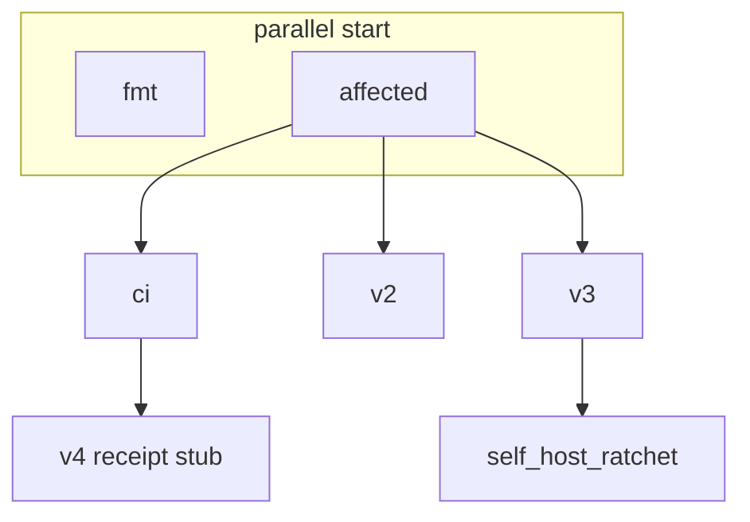

# CI Anatomy, Profiling, and Redundancy Audit

Date: 2026-05-29  
Work item: `node://adhoc-0972e492-c72` (CI EFFICIENCY MANAGER)  
Authority audited: `.github/workflows/ci.yml` on `main` at `2d2a8fc75` (2026-05-29)  
Canonical anchor for the CI-efficiency lane. Code-fix PRs reference this doc; do not bundle fixes here.

**North star (operator 2026-05-29):** Every CI step — including every test — is a pure function over content-addressed inputs. If inputs are unchanged, the step does not run (verdict reuse), not “runs faster.” Overlapping tests with the same input subgraph become **free at runtime** once declared: IRT-1 / affected-set skips both; only cold-cache cost remains, and that fires once per unique input merkle. Deduplication is substrate-enforced via input declaration + affected-set caching, not human “delete the duplicate” curation.

**Related work (coordinate, do not duplicate):**

| Owner | Artifact |
|-------|----------|
| wise-otter-34 / PR #3853 | `ci.dag` authority; dissolve `detect-affected-components.sh` |
| clever-cat-115 / PR #3883 | M1 emit-probe timeout fail-closed + `v4`-only gating (draft) |
| vivid-raven-55 | Deferral / scaffold-ratchet scan in INVARIANTS (dissolution triggers) |

---

## 1. Anatomy

### 1.1 Workflow triggers and concurrency

| Control | Value |
|---------|--------|
| **Triggers** | `push` to `main`; `pull_request` to `main` (`opened`, `synchronize`, `reopened`, `ready_for_review`) |
| **Draft PRs** | All jobs skip when `github.event.pull_request.draft == true` |
| **Concurrency** | One run per PR (`workflow-pr-number`); `cancel-in-progress: true` |
| **Runners** | Self-hosted `linux` / `arm64` (srv1/srv2); shared `$HOME` → per-job `CARGO_HOME`/`RUSTUP_HOME` in `$RUNNER_TEMP` |

### 1.2 Job dependency DAG



| Job | `needs` | Gate (`if`) | Role |
|-----|---------|-------------|------|
| `fmt` | — | non-draft PR | Rustfmt on entire workspace |
| `affected` | — | non-draft PR | Emits `v2`, `v3`, `v4`, `workflow_policy` booleans |
| `ci` | `affected` | non-draft PR | Policy shell gates + v3/v4/workflow receipts + v4 bootstrap/M1 |
| `v2` | `affected` | `v2 == true` | v2 stage0 `--verify` |
| `v3` | `affected` | `v3 == true` or push `main` | Full v3 compile/test/clippy (integration filtered #846) |
| `v4` | `affected`, `ci` | `v4 == true` | Receipt-only stub (load in `ci`) |
| `self_host_ratchet` | `affected`, `v3` | `v3 == true` or push `main` | DB-8 matrix on `main` only |

**Affected detection** (`scripts/detect-affected-components.sh`, ~26ms script; ~8s job with fetch):

| Output | True when |
|--------|-----------|
| `v2` | `src/v2/**` or `Cargo.toml` / `Cargo.lock` |
| `v3` | `src/v3/**` or `dsl/**` (not workspace deps alone) |
| `v4` | `src/v4/**`, `fixtures/v4-mvp1/**`, `scripts/v4-mvp1*`, `scripts/v4-m1*`, `scripts/v4-testclaim-*`, `dsl/std/**`, or workspace deps |
| `workflow_policy` | `.github/workflows/**`, detect script, Gate #103 ratchet scripts |

### 1.3 Job and step catalog

#### Job: `fmt` (timeout 15m)

| Step | Purpose | Command / action | Reads | Produces |
|------|---------|------------------|-------|----------|
| Isolate toolchain dirs | Avoid rustup races on shared HOME | `echo CARGO_HOME/RUSTUP_HOME → GITHUB_ENV` | `$RUNNER_TEMP` | Env for job |
| Clear auth header | Runner hygiene | `git config --global --unset-all http...` | — | — |
| Checkout | Shallow tree | `actions/checkout@v4` `fetch-depth: 1` | repo | working tree |
| Setup Rust | Install toolchain + rustfmt | `setup-rust-toolchain@v1.16.0` | `rust-toolchain.toml` | `rustc`, `rustfmt` |
| Pin rustup default | Isolated RUSTUP has no default | `rustup default …` | active toolchain | default toolchain |
| cargo fmt | Format gate | `cargo fmt --all --check` | all `*.rs`, Cargo files | pass/fail |

#### Job: `affected` (timeout 15m)

| Step | Purpose | Command | Reads | Produces |
|------|---------|---------|-------|----------|
| Checkout | Full history for diff | `fetch-depth: 0` | repo | tree |
| Fetch main | PR merge base | `git fetch origin main` | network | `origin/main` |
| Detect affected | Component buckets | `bash scripts/detect-affected-components.sh` | `git diff origin/main...HEAD` | job outputs `v2/v3/v4/workflow_policy` |

#### Job: `ci` (timeout 40m, `needs: affected`)

| Step | Purpose | Command(s) | Reads | Produces |
|------|---------|------------|-------|----------|
| Isolate / checkout / fetch main | Same pattern as above | shell + checkout | repo, `origin/main` | tree, diff base |
| SG-0 discipline | PR body vs census hand-path delta | `scripts/check-pr-sg0-net-shrink-discipline.sh` (+ self-test) | `sg0_census_test.rs`, PR body, `git show` | pass/fail |
| R4-carve discipline | Dissolution pairing | `scripts/check-r4-carve-dissolution-discipline.sh` | carve-related paths | pass/fail |
| Fabrication sentinels | Ban `__BUG_NO_PROFILE_` in sources | `scripts/check-fabrication-sentinels.sh` | all tracked `*.rs`, `*.dag` | pass/fail |
| T-19 testgen | Generated claim activation | `python3 scripts/check_t19_testgen_activation.py` | LBE / claim paths | pass/fail |
| Release-doc authority | Single-authority docs | `check-release-doc-authority.sh` + self-test | `docs/**` manifest | pass/fail |
| Manager-brief authority | Brief link/PR discipline | `check-manager-brief-authority.sh` + self-test | `docs/briefs/*.md`, `gh` | pass/fail |
| Test-timeout self-test | Ratchet consumer | `test-check-test-timeout.sh` | fixture logs | pass/fail |
| Rust toolchain authority | Single `rust-toolchain.toml` | `check-rust-toolchain-single-authority.sh` | toolchain files | pass/fail |
| Setup Rust + cache | Toolchain + cargo cache | `setup-rust-toolchain`, `actions/cache@v4` | `Cargo.lock`, v3 compiler paths | cache hit/miss |
| v3 bootstrap verify | Snapshot freshness | `cargo run -p v3-compiler --bin regen_bootstrap -- --verify` | v3 bootstrap blobs | pass/fail |
| Gate #103 inventory | No path-regex in workflows | `check-workflow-path-regex-inventory.sh` | `.github/workflows/*` | pass/fail |
| Gate #103 integration | Model ↔ YAML policy | `cargo test … ci_uses_affected_set_selection` + `workflow_no_path_regex_policy_ci_yml` | `ci.yml`, `ci.dag` | pass/fail |
| T-15 v4 bin smoke | Parse `main.dag` | `cargo test … v4_bin_main_dag_smoke_test::…` | `src/v4/bin/main.dag` | pass/fail |
| Lens-CI smoke | Registry DAG parses | `cargo test … v4_lens_registry_dag_smoke_test` | `src/v4/lens/registry.dag` | pass/fail |
| M1 binding smoke | `ci.dag` ↔ `ci.yml` | `cargo test … v4_workflow_ci_m1_rust_emit_probe_modeled_and_bound_to_ci_yml` | `ci.dag`, `ci.yml` | pass/fail |
| Cache / build gunbc | v2 binary for v4 gates | `actions/cache`, `cargo build -p v2-compiler --release` | `src/v2/stage0/**` | `target/release/gunbc` |
| MVP-1 e2e | `add.dag` pipeline | `scripts/v4-mvp1-e2e-gate.sh` | `fixtures/v4-mvp1/**` | pass/fail |
| Lens-CI semantic compile | Partial v4 rust emit | `gunbc compile` entry `ci.dag` + deps root | `src/v4/**` | emit tree |
| **M1 full-tree rust emit probe** | v2 rust emit + cargo check (informational) | `scripts/v4-m1-rust-emit-probe.sh` | **entire `src/v4`** | probe summary / notices |
| v4 bootstrap | Full v4 dag compile | `scripts/v4-bootstrap-viability.sh` | **entire `src/v4`** | compile receipt |
| v4 bootstrap bridge | Emit-wall posture | `v4-bootstrap-resolve-posture-gate.sh` | bootstrap log | pass/fail |
| T-22 TestClaim corpus | Structural bridge | `scripts/v4-testclaim-corpus-gate.sh` | `src/v4/test/claim/**` | pass/fail |

#### Job: `v2` — `cargo run -p v2-compiler --bin regen_stage0 -- --verify` when `v2` affected.

#### Job: `v3` — Zig linker, Python, Go; `execute-command-bootstrap`; prebuild integration; lib+bins+doc tests; clippy×2; L-7/L-8 inline grep; `check-compiler-std-ratchet.sh`; `check-banked-dissolutions.sh`. Integration execution uses `__HOT_FIX_NONEXISTENT_FILTER__` (gunbc#846).

#### Job: `v4` — notice only; real work in `ci`.

#### Job: `self_host_ratchet` — validates `v3` result; on `main` push runs `determinism_test` (release), `self_host_fixed_point`, informational `emit.rs` HashMap grep (`continue-on-error`).

---

## 2. Profiling

**Environment:** self-hosted `linux-arm64` (srv1/srv2). Times are wall-clock unless noted.

### 2.1 Representative run (docs-only, all buckets false)

| Field | Value |
|-------|--------|
| **Run ID** | [26615772294](https://github.com/gunb-ai/gunbc/actions/runs/26615772294) |
| **Branch** | `session/snappy-bee-513` |
| **Affected log** | `v2/v3/v4/workflow_policy` all `no` |

| Job | Wall (cold) | Notes |
|-----|-------------|-------|
| `fmt` | **25s** | rustup + fmt |
| `affected` | **8s** | fetch-depth 0 + fetch main |
| `ci` | **66s** | shell gates + rustup + cache restore; **no cargo test steps** |
| `v2`, `v3`, `v4`, `self_host_ratchet` | skipped | — |
| **Workflow total** | **~77s** | `fmt` ∥ `affected` then `ci` |

### 2.2 Job-level estimates by profile

| Profile | Dominant jobs | Typical wall |
|---------|---------------|--------------|
| Docs-only | `fmt` + `ci` (no cargo) | **1–2 min** |
| `workflow_policy` only | above + Gate #103 integration (~2 tests) | **4–8 min** |
| `v4` affected | `ci` + v2 build + dual full-tree compile + filtered integration tests | **15–45+ min** |
| `v3` affected / `main` | `v3` job (prebuild + lib+bins+clippy) | **10–120 min** budget |

### 2.3 Named step rows (cold / warm)

| Step | Cold | Warm | Profile |
|------|------|------|---------|
| `detect-affected-components.sh` | &lt;1s | &lt;1s | script only |
| `Setup Rust` (per job) | 20–40s | 5–15s | every `fmt`/`ci`/`v3` |
| Unconditional shell discipline (aggregate) | **6–25s** | similar | every `ci` |
| `cargo test` integration (single filter) | **2–8 min** | **30s–2 min** | gated |
| Build `v2-compiler --release` | **2–5 min** | cache hit ~0s | `v4` / `workflow_policy` |
| Lens-CI semantic `gunbc compile` | **1–3 min** | partial cache | `v4` / `workflow_policy` |
| **M1 full-tree rust emit probe** | **5–20 min** (cap **20m** step timeout) | rarely warm — full re-emit | `v4` or `workflow_policy` on `main` |
| `v4-bootstrap-viability.sh` | up to **35m** cap | — | `v4` |
| `v3` prebuild `integration --no-run` | **3–10 min** | — | `v3` / `main` |
| `v3` lib+bins+doc suite | **10–60+ min** | — | `v3` / `main` |

### 2.4 Local micro-benchmarks (clever-cat-115, 2026-05-29)

| Script | Wall |
|--------|------|
| `check-fabrication-sentinels.sh` | 2.6s |
| `check-pr-sg0-net-shrink-discipline.sh --self-test` | 1.5s |
| `check-release-doc-authority.sh` + self-test | ~1.6s |
| `test-check-manager-brief-authority.sh` | ~18s |
| **Shell discipline subtotal** (excl. manager-brief live check) | **~6.3s** |

---

## 3. Redundancy inventory (Table A)

| ID | Category | Step(s) | Duplicated computation | Wall / occurrence | Frequency |
|----|----------|---------|------------------------|-------------------|-----------|
| R01 | UNCONDITIONAL | `fmt`: rustup + `cargo fmt --all` | Toolchain + full-workspace fmt when no Rust surface changed | ~25s | Every non-draft PR |
| R02 | UNCONDITIONAL | `ci`: rustup + cache | Second rustup vs `fmt` | ~30–45s | Every non-draft PR |
| R03 | UNCONDITIONAL | `ci`: 9+ discipline shell steps | Scripts run when authority paths untouched | ~6–25s | Every `ci` |
| R04 | WITHIN-RUN | `affected` + `ci` | Duplicate `fetch-depth:0` + `git fetch origin main` | ~5–8s ×2 | Every PR |
| R05 | WITHIN-RUN | Multiple `cargo test -p v3-compiler --test integration <filter>` | Re-link / reuse binary per filter; cold compile repeated | 2–8 min each | v3/v4/workflow_policy gates |
| R06 | CROSS-RUN | Per-job `RUNNER_TEMP` cargo home | Registry cache not shared across `fmt`/`ci`/`v3` | 30s–5 min | Rust jobs |
| R07 | CROSS-RUN | `v4-m1-rust-emit-probe.sh` | Full `src/v4` rust emit + `cargo check`; no merkle skip | **5–20 min** | `v4` or `workflow_policy` |
| R08 | WITHIN-RUN | `v4-bootstrap-viability.sh` + M1 probe | Two full-tree v2 compiles (dag + rust) | up to 35m + 20m caps | `v4` PRs |
| R09 | CROSS-RUN | v2 build + Lens-CI + MVP-1 | Separate compile graphs | 2–8 min | `v4` / `workflow_policy` |
| R10 | INPUT-UNDECLARED | Discipline + M1 | `ci.dag` `M1RustEmitProbeCommand` cache = static tag, not `src/v4` merkle | cannot skip | implicit |
| R11 | CROSS-RUN | `v3` full suite + prebuild | Full compile despite #846 zero integration filter | 10–120 min | `v3` / `main` |
| R12 | UNCONDITIONAL | `v4` receipt stub | Scheduling after `ci` | ~5–15s | `v4` PRs |

---

## 4. Overlap map

Explicit computations that overlap across steps (same PR, often same workflow run):

| Overlap | Steps | Shared work |
|---------|-------|-------------|
| O1 | `fmt` + `ci` | `setup-rust-toolchain`, `rustup default`, cargo registry fetch |
| O2 | `affected` + `ci` (+ sg0 live) | `git fetch origin main`, `git diff origin/main...HEAD` |
| O3 | `check-fabrication-sentinels` + full-tree compiles | Walk all `*.dag` / `*.rs` inventory vs compile graph |
| O4 | Gate #103 integration + T-15 + Lens-CI + M1 binding | Four `cargo test -p v3-compiler --test integration …` invocations |
| O5 | `v4-bootstrap-viability.sh` + `v4-m1-rust-emit-probe.sh` | `gunbc compile --source-root src/v4` (different `--target`) |
| O6 | Lens-CI semantic compile + M1 probe | v2 emit over overlapping `src/v4` module closure |
| O7 | `v3` prebuild `integration --no-run` + `v3` zero-filter integration + `ci` integration filters | Same integration test binary artifact |
| O8 | `self_host_ratchet` `determinism_test` + `v3` `determinism_test` | Same test crate on `main` push |
| O9 | Multiple v4 `*_dag_smoke_test.rs` modules | Each: tokenize + parse same `.dag` paths (see §8) |
| O10 | `scripts/v4-testclaim-corpus-gate.sh` + `v4_*_dag_smoke_test` | Structural parse checks on claim/workflow DAGs |

---

## 5. Critical bugs found

| ID | Severity | Step | Symptom | Root cause | Fix status |
|----|----------|------|---------|------------|------------|
| B01 | **P0** | M1 full-tree rust emit probe | **20m timeout but job stays green** | (1) `continue-on-error: true` for modeled `non_blocking`; (2) script `exit 0` unless `V4_M1_RUST_EMIT_PROBE_STRICT=1` even when `timeout` returns 124; (3) GHA step timeout SIGTERM with no fail-closed follower | **PR #3883** (draft): `failure_class=timeout`, exit 124, `M1 probe timeout fail-closed` step; gate to `v4` only |
| B02 | **P0** | M1 probe scope | Full tree every run (`indexed 280 modules…`) | No content-hash skip; `ci_command_cache_digest(M1)` is static symbol tag | Modeled in §6; depends on T-21/T-24 |
| B03 | P1 | M1 on `workflow_policy` only | 20m emit when only `ci.yml` changed | `if: v4 \|\| workflow_policy` — binding smoke suffices | **#3883**: `v4` only |
| B04 | P1 | v4 bootstrap `continue-on-error` + bridge | Failed compile can still yield green via bridge step | Intentional emit-wall bridge; easy to misread as “compile passed” | Document; tighten when emit wall clears |
| B05 | P2 | `self_host_ratchet` / DB-8 steps | `continue-on-error: true` on staged checks | Informational staging | Track in DB-8 lane |
| B06 | P2 | `v3` integration | Zero-test filter still runs libtest setup | #846 hot-fix — pays compile, runs 0 tests | Restore when per-test ≤2s |

---

## 6. Dependency-modeled fix (Table B)

| Redundancy | Modeled step (`ci.dag` / T-24) | Declared inputs | Cache key | Wall when hashes match green |
|------------|-------------------------------|-----------------|-----------|------------------------------|
| R01 | `LintCommand` / fmt | rustfmt surface merkle + toolchain | `combine_hash(surface, toolchain)` | **0s** (not scheduled) |
| R02 | Shared rust pool node | Union of downstream digests | pool `content_hash` | **0s** |
| R03 | Per-gate `TestClaim` / shell Node | Path sets per script | T-21 frontier ∩ diff | **0s** |
| R04 | `CiGitDiffReadOutcome` (#3853) | single `Witness<Diff>` | one read / workflow | **~1s** |
| R05 | `TestCommand` + IRT-4 | binary digest + claim hashes | verdict cache | **seconds** |
| R06 | Cache emission | registry + target graph merkle | remote/sccache | **0s** restore |
| R07 | `M1RustEmitProbeCommand` | `content_hash(src/v4/**.dag)` + v2 binary | replace `ci_cache_cmd_m1_probe_tag` | **0s** reuse |
| R08 | Bootstrap → M1 `needs` edge | dag emit digest → rust emit | shared artifact | one compile / unique input |
| R09 | `BootstrapStageCompile` + `LensCiCommand` | stage0 + entry closure | gunbc/emit cache | **seconds** warm |
| R10 | All `ci_command_cache_digest` | real input merkle | frontier → `if:` | exact-once |
| R11 | v3 `TestCommand` + freeze | v3 subgraph merkle | T-21 on claims | **0s** when untouched |
| R12 | Receipt `CiGate` | prior verdict hash | stub if stale | **0s** |

### Summary (wasted compute)

| PR profile | Today (wasted approx) | Dependency-modeled | Δ |
|------------|----------------------|---------------------|---|
| Docs-only | **65–75s** | **8–12s** | **−55–65s** |
| workflow_policy-only | **4–8 min** | **1–2 min** | **−3–6 min** |
| v4-affected typical | **20–40 min** | **2–5 min** cold / **10–30s** warm | **−15–35 min** |
| M1 timeout path (B01) | 20m silent green | skip or fail-closed | correctness + time |

**Why affected-set feels weak today:** T-21 `ci_select_from_affected_set` narrows TestClaims in the model; GitHub Actions still uses coarse booleans (R10). #3853 swaps authority without merkle keyed skips.

---

## 7. Recommended action plan

| Rank | Target | Owner / ref | Expected Δ | Notes |
|------|--------|-------------|------------|-------|
| P0 | M1 timeout fail-closed + `v4`-only gate | PR **#3883** | correctness; −20m on policy-only PRs | Land + `gh pr ready` |
| P0 | `rustfmt` + `ci_rust` outputs | `adhoc-f7412ade-2d2` | **−55–65s** docs-only | Skip fmt/ci rust when no cargo work |
| P0 | Path-gate discipline shells | `adhoc-73481895-3d7` | **−6–25s** per PR | fabrication / sg0 / briefs |
| P1 | Merge #3853; wire finer buckets from `ci.dag` | wise-otter-34 | enables R03/R10 | Parity mirror ≠ speed |
| P1 | M1 merkle cache + bootstrap artifact sharing | new work-item | **−10–20 min** v4 PRs | R07/R08 |
| P1 | Single integration binary compile per workflow | CI refactor | **−5–15 min** | R05/O4 |
| P1 | Test input-declaration + IRT frontier (§8) | T-21/T-19/T-38 + #3853 | **−5–30 min** when skips work | declare inputs; do not bulk-delete overlaps |
| P1 | Scaffold-ratchet dissolution (delete) | vivid-raven-55 | varies | INVARIANTS trigger met only |
| P2 | Shared cargo home across jobs on host | infra | R06 | conflicts w/ rustup race fix |
| P2 | Restore v3 integration filter (#846) | operator | quality | after amortization |

---

## 8. Test corpus rationalization

**Operator clarification (2026-05-29):** Test overlap is handled via **affected-set semantics**, not hand-curated deletion PRs. Primary deliverable: **which tests lack declared input subgraphs** (so the frontier cannot skip them), and what declaration work closes the gap. See also Table B (§6) — tests are Nodes with `content_hash` inputs + cache-keyed verdicts, same as discipline shell steps.

### 8.1 What CI actually executes (test surface)

| Layer | Binary / runner | How CI invokes it |
|-------|-----------------|-------------------|
| **Workspace** | Many crates (`cargo test --workspace`) | Not full workspace in one step; scoped crates below |
| **v3-compiler lib+bins** | unit + bin tests | `v3` job: `cargo test -p v3-compiler --lib --bins` |
| **v3-compiler integration** | **One** binary (`tests/integration.rs`, ~140 `#[path]` modules) | `v3` job: full suite + zero filter; `ci` job: **named filters only** |
| **v3-compiler determinism** | `determinism_test` | `v3` job + `self_host_ratchet` (main, release) |
| **v3-compiler doc** | doc tests | `v3` job |
| **v2-compiler** | stage0 verify | `v2` job: `regen_stage0 --verify` |
| **Shell gates** | Python / bash | T-19, TestClaim corpus bridge, policy scripts |
| **v4 TestClaim corpus** | `src/v4/test/claim/**/*.dag` (~**165** files) | `v4-testclaim-corpus-gate.sh` (structural); eval runner **not** full CI yet (T-38) |
| **v4 smoke (Rust)** | ~**15** `v4_*_dag_smoke_test.rs` modules in integration binary | Filtered `cargo test` in `ci` when gated |

**Inventory scale (static, 2026-05-29):**

- Integration binary modules: **~140** files hoisted in `src/v3/compiler/tests/integration.rs` (unit + boundary + cementing included).
- v4 claim DAGs: **~165** under `src/v4/test/claim/`.
- CI-filtered integration tests per PR: **4–6** invocations × cold compile cost (R05).

**Full enumeration command** (for lane workers; not run in doc generation — environment compile is expensive):

```bash
cargo test --workspace --no-run 2>&1 | rg 'test .* ... ok'  # or:
cargo test -p v3-compiler --test integration -- --list
rg '#\[test\]' src/v3/compiler/tests -c
find src/v4/test/claim -name '*.dag' | sort
```

### 8.2 Classification rubric (operator-aligned)

| Class | Action | Mechanism |
|-------|--------|-----------|
| **INPUT-UNDECLARED** | **Primary gap** — discover/write declared input subgraph | TestClaim `input` edges, or generated host-Rust equivalent; IRT-1 / `ci_select_from_affected_set` skips when merkle stable |
| **DUPLICATE-COVERAGE** | **Do not delete** by classification | Same input subgraph ⇒ same behavior; both inert when inputs unchanged. File in **Table B** (§6), not delete list |
| **OVERLAP-WITH-TESTCLAIM** | **Do not delete** — declare Rust test inputs to match claim twin | Claim has `input: Node`; wire host-Rust test → same merkle. Both skipped together at runtime |
| **SCAFFOLD-RATCHET-DISSOLVABLE** | **Delete** when trigger met | Named INVARIANTS dissolution trigger; ratchet, not coverage. **vivid-raven-55** confirms |
| **DEAD** | **Delete** | No target, no consumer, no signal (includes CI steps that run 0 tests) |
| **ORPHAN** | **Investigate** | Implicit input subgraph → declare; no consumer → delete |
| **FLAKY / NON-DETERMINISTIC** | **Fix** (correctness) | Not duplication |

### 8.3 Overlap inventory → dependency-modeled fix (not deletion)

Pairs below share behavior on the **same `.dag` / module closure**. Not deletion candidates — **input-declaration** candidates (Table B).

| Host-Rust test (integration) | TestClaim / modeled twin | Declared inputs (target) | Cache key (target) | Wall when merkle matches green |
|------------------------------|--------------------------|--------------------------|--------------------|--------------------------------|
| `v4_lens_affected_set_dag_smoke_test` | `src/v4/test/claim/lens_affected_set/*.dag` | `content_hash(affected_set.dag)` + claim nodes | IRT-4 TestClaim node hash | **0s** (skipped) |
| `v4_workflow_ci_runner_dag_smoke_test` | `claim/workflow/affected_set_ci_runner.dag` | `content_hash(ci.dag)` + runner claims | same | **0s** |
| `v4_lens_edit_locus_dag_smoke_test` | `edit_locus_resolver.dag` | `content_hash(edit_locus.dag)` + deps | same | **0s** |
| `v4_lens_registry_dag_smoke_test` | registry claims + Lens-CI compile | registry closure merkle | Lens-CI + claim verdict | **seconds** warm |
| `v4_bin_main_dag_smoke_test` | bin/main.dag claims | `content_hash(main.dag)` | same | **0s** |
| `ci` job: Gate #103 + T-15 + Lens-CI + M1 binding (four `cargo test` filters) | `ci.dag` `TestCommand` roster | integration binary digest + per-test input merkle | compile once; skip off frontier | **−5–15 min** → **seconds** |
| `v3` `determinism_test` + `self_host_ratchet` (main) | determinism claims (when modeled) | determinism input merkle | single Node; flags as input | **−2–10 min** → reuse |

**Cold-cache note:** Undeclared tests still pay link/compile when CI fires separate `cargo test` filters (R05). Input declaration removes **execution**; one integration compile per workflow removes duplicate **cold link** (CI wiring, not test deletion).

### 8.4 Input-declaration discipline gap (primary deliverable)

*Which tests cannot be skipped today because nothing names their input subgraph?*

| Gap ID | Test / step | Symptom today | Declaration work | Owner lane |
|--------|-------------|---------------|------------------|------------|
| T-IG-01 | ~15 `v4_*_dag_smoke_test.rs` modules | Run whenever CI filter fires | Bind each `#[test]` to `content_hash(.dag)` via TestClaim or generated metadata | T-19 + T-38 |
| T-IG-02 | `v3-compiler` integration (~140 modules) | Whole binary on `v3` job; #846 runs 0 tests but pays libtest | Per-module `AffectedSet` registration or claim migration | T-21 + #846 |
| T-IG-03 | Host-Rust tests without claim backing | No `input: Node` | Synthetic TestClaim wrapper with fixture merkle | T-24 CI runner |
| T-IG-04 | `ci.yml` coarse `if: v4` | All integration filters on any v4 path change | `ci_select_from_affected_set` → step frontier (#3853) | wise-otter-34 |
| T-IG-05 | `v4-testclaim-corpus-gate.sh` | Structural only; no verdict cache | T-38 `TestClaimCorpusEvalCommand` + IRT-4 | T-38 |

**Enumeration procedure:** `cargo test -p v3-compiler --test integration -- --list` → infer `include_str!` / fixture paths → merkle → cross-check `src/v4/test/claim/**` → mark declared vs T-IG row.

### 8.5 v4 `*_dag_smoke_test` cluster (overlap map, not merge/delete)

| Module | Claim twin (declaration target) |
|--------|--------------------------------|
| `v4_bin_main_dag_smoke_test` | bin/main.dag claims |
| `v4_workflow_ci_runner_dag_smoke_test` | `claim/workflow/affected_set_ci_runner.dag` |
| `v4_lens_affected_set_dag_smoke_test` | `claim/lens_affected_set/*.dag` |
| `v4_lens_edit_locus_dag_smoke_test` | `edit_locus_resolver.dag` |
| `v4_lens_registry_dag_smoke_test` | registry claims |
| `v4_compiler_*_smoke_test` (3) | compiler pipeline claims |
| `v4_extdeps_*_smoke_test` (3) | extdeps claims |

**Action:** Wire host-Rust inputs to claim twin merkle (or run claim via T-38 eval). **Do not** bulk-delete as “duplicates.”

### 8.6 Substrate enforcement (how overlap becomes free)

```text
test_run(claim) = f(content_hash(input_subgraph(claim)))
ci_select_from_affected_set(roster, affected) → subset where input merkle ∈ rerun frontier
```

When PR diff does not touch a test’s declared input subgraph, **IRT-1** excludes it; **IRT-4** reuses cached verdict. A Rust smoke and its TestClaim twin with the same input merkle both skip — no human dedup list required.

### 8.7 Still delete / still fix (non-overlap classes)

| Class | Example | Action |
|-------|---------|--------|
| SCAFFOLD-RATCHET | `tc*_deferred_test.rs` / strict_fire pairs | Delete when **vivid-raven-55** confirms trigger |
| SCAFFOLD-RATCHET | `sg0_census_test.rs` | Delete when census trigger met |
| DEAD | `v3` `__HOT_FIX_NONEXISTENT_FILTER__` CI step | Delete step (0 tests) |
| DEAD | `v3` “Stage 2d SKIPPED” notice step | Delete step |
| ORPHAN | `t_ci_workflow_as_data_demo_test.rs` | Declare inputs or delete if no consumer |
| FLAKY | `check-test-timeout.sh` manifest | Fix / budget |

### 8.8 Dispatch (revised)

| Work item | Action |
|-----------|--------|
| **vivid-raven-55** | SCAFFOLD-RATCHET dissolution only; cross-ref T-IG table |
| Suggested child | T-IG-01: bind `v4_*_dag_smoke` tests to claim input merkle |
| Suggested child | T-IG-04: wire `ci_select_from_affected_set` to integration roster |
| **Not dispatched** | “Delete all duplicate smokes” — superseded by affected-set model |
| Each **delete** PR | INVARIANTS dissolution row or DEAD proof only |

---

## Appendix: Script index (ci.yml → scripts)

| Script | Job |
|--------|-----|
| `detect-affected-components.sh` | affected |
| `check-pr-sg0-net-shrink-discipline.sh` | ci |
| `check-r4-carve-dissolution-discipline.sh` | ci |
| `check-fabrication-sentinels.sh` | ci |
| `check_t19_testgen_activation.py` | ci |
| `check-release-doc-authority.sh` | ci |
| `check-manager-brief-authority.sh` | ci |
| `check-rust-toolchain-single-authority.sh` | ci |
| `check-workflow-path-regex-inventory.sh` | ci |
| `v4-mvp1-e2e-gate.sh` | ci |
| `v4-m1-rust-emit-probe.sh` | ci |
| `v4-bootstrap-viability.sh` | ci |
| `v4-bootstrap-resolve-posture-gate.sh` | ci |
| `v4-testclaim-corpus-gate.sh` | ci |
| `check-v3-full-suite-split-test-targets.sh` | v3 |
| `check-test-timeout.sh` | v3 |
| `check-compiler-std-ratchet.sh` | v3 |
| `check-banked-dissolutions.sh` | v3 |

---

*End of audit. Updates to profiling numbers: amend this doc with run ID + date; do not fork a parallel ledger.*
