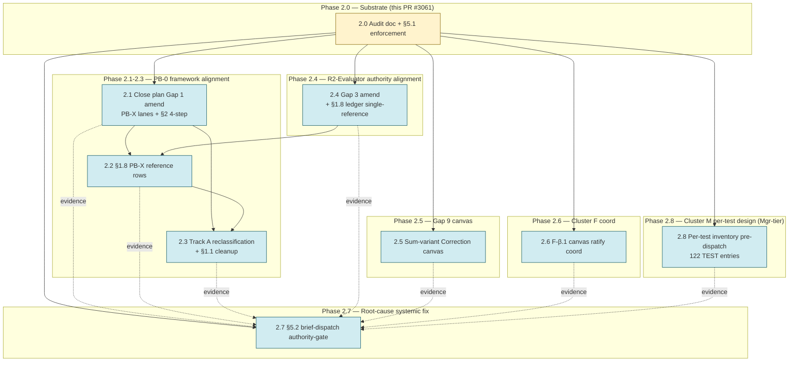

# R3 Phase 2 Corrective Sweep — Dispatch Plan with Dependency Tree

## §0. Purpose

Per operator request 2026-05-14: dependency-tree planning artifact for dashboard planning; every task associated with a concrete design-doc authority citation BEFORE dispatch.

This file operationalizes the §5.2 brief-dispatch authority-gate discipline (codified later in Phase 2.7) by applying it to the Phase 2 corrective sweep itself. If the planning shape works for Phase 2, the same template generalizes to future dispatches.

**Discipline applied per task**:
1. **Design authority cite**: which design-doc / authority artifact defines what this task should produce
2. **Mgr lane**: who owns the work (PM-direct / specific R3 Mgr / Director)
3. **Upstream deps**: which Phase tasks must complete before this can dispatch
4. **Downstream consumers**: which Phase tasks (or active work) depend on this completing
5. **Success criterion**: what "done" looks like, as a checkable predicate
6. **Status**: where the task sits in the lifecycle

## §1. Phase 2 task table

| ID | Task | Design authority | Mgr lane | Upstream deps | Downstream consumers | Success criterion | Status |
|----|------|------------------|----------|---------------|----------------------|-------------------|--------|
| **2.0** | Audit doc landing + §5.1 5th axis enforcement | Operator request 2026-05-14 + Director msg_e66f4326 + Director msg_b9f9c36b audit ratification | PM (deep-wolf-155) | — (root) | All other Phase 2 phases | PR #3061 merged with §5.1 class-C tightening + 4-breaks-+-1-queue framing + tree-aware L2.5 absence evidence | **ACTIVE** — see PR #3061 for live review + CI state |
| **2.1** | Close plan Gap 1 amendment — route through PB-X lanes + SELF_HOSTING §2 4-step | `src/v3/SELF_HOSTING.md` §2 (4-step migration discipline) + `docs/design-pure-bootstrap-zero.md` (PB-X lane enumeration) + `docs/substrate-reflection-design.md` §12.6 (migration order emit→lower→infer→parse) | PM (deep-wolf-155) | 2.0 (audit substrate) | 2.2 (§1.8 PB-X gate rows reference Gap 1 framing); 2.3 (Track A reclassification cites Gap 1 framing) | Close plan §1 Gap 1 narration routes through PB-X lanes explicitly with §2.2 4-step citation; PB-X-numbering-vs-migration-order distinction surfaced | **QUEUED** |
| **2.2** | §1.8 PB-X lane reference rows (NOT parallel substrate) | `docs/design-pure-bootstrap-zero.md` PB-X lane enumeration + `feedback_parallel_representation_debt` discipline (reference, not duplicate) | PM (deep-wolf-155) | 2.1 (Gap 1 framing established); 2.4 (R2-Evaluator reference-shape pattern) | 2.3 (Track A reclassification cites these gates) | §1.8 has reference rows (NOT parallel substrate) for: PB-Substrate / PB-1 / PB-3 / PB-4 / PB-5 / PB-6 / PB-Bootstrap-Process / PB-Runtime / PB-Lib+PB-Build; each row cites design-pure-bootstrap-zero.md authority | **QUEUED** |
| **2.3** | Track A taxonomy reclassification + §1.1 cluster cleanup | §5.1 class-C tightened (landed in 2.0 via this PR) + `docs/design-pure-bootstrap-zero.md` PB-X lane mapping | PM (deep-wolf-155) authoring; zesty-boar-261 (R3 Debt-Paydown Mgr) coordination | 2.1 (Gap 1 framing); 2.2 (§1.8 PB-X gate rows) | Future cycle workers reference reclassified taxonomy | Taxonomy classifies (b)-class pipeline-stage entries with explicit PB-X lane prereq + L2.5 domain-model-set citation (per §5.1 5th axis); §1.1 bootstrap/regen cluster mapped to PB-X lanes; NOT generic "Cluster M / regen brief canvas" prereq | **QUEUED** |
| **2.4** | Gap 3 R2-Evaluator amendment + §1.8 single-reference to r2-closure-ledger | Operator §4 Item 5 α-ratification 2026-05-14 (warm-wolf-698 expanded scope) + `docs/r2-closure-ledger.md:250-263` (5 sub-lane single-source authority) + `feedback_parallel_representation_debt` | PM (deep-wolf-155) | 2.0 (audit substrate) | 2.2 (establishes pattern for §1.8 references) | Gap 3 framing updated to ratified state (warm-wolf-698 expanded scope, NOT "pending §4 Item 5 staffing"); §1.8 references `docs/r2-closure-ledger.md:250-263` via single cross-reference on existing gate #16 row (NOT 5 parallel gate rows) | **QUEUED** |
| **2.5** | Gap 9 substrate-shape canvas authoring | Close plan Gap 9 §4 (line 301-346) + operator §4 Item 4 IN-R3 ratification 2026-05-13 (100% absolute LiveCorrection variant) | PM (deep-wolf-155) canvas authoring; Director (zesty-bear-812) + warm-wolf-698 (Substrate Mgr) ratification | 2.0 (audit substrate) | show-correct-code worker brief dispatch (currently stalled awaiting canvas; routes through still-moth-538/tidy-ram-467 Verification Mgr post-ratification) | Sum-variant `Correction { LiveCorrection \| DeferredCorrection }` substrate carrier canvas authored + ratified by Director + Substrate Mgr; show-correct-code worker brief dispatch unblocked | **QUEUED** |
| **2.6** | Cluster F Phase 2 canvas coordination with warm-wolf-698 | `docs/audit/r3-cluster-f-sequencing-plan-2026-05-09.md` (Task 12 amendment via PR #2364) + `docs/design-f-beta-1-effect-enum-migration-shape-canvas-2026-05-12.md` (F-β.1 canvas) | warm-wolf-698 (R3 Substrate Mgr; owns Cluster F lane); PM (deep-wolf-155) coordination | 2.0 (audit substrate) | F-α walker port worker dispatch; F-β.2 atomic migration worker (quiet-seal-699 PR #3016 already in flight) | F-β.1 canvas Substrate-Mgr-ratified; F-α walker port worker dispatch ready; F-β.2 (quiet-seal-699 PR #3016) coordinated with F-β.1 canvas authority | **QUEUED** (partial overlap with active quiet-seal-699 work) |
| **2.7** | §5.2 brief-dispatch authority-gate discipline — ROOT-CAUSE FIX | `src/v3/SELF_HOSTING.md` §2 + `INVARIANTS.md` P5 + audit doc §3 systemic pattern findings (4 sub-patterns: brief citations / Mgr lane sync / canvas-first sequencing / audit reactivity) | PM (deep-wolf-155) | 2.0 (audit doc establishes systemic pattern) + 2.1-2.8 (evidence-base for the discipline) | ALL future dispatches gated by §5.2 (permanent close-plan addition + PR-template enforcement) | §5.2 added to close plan with mandatory pre-dispatch: (a) design-doc authority citation; (b) Mgr lane ownership confirmation; (c) canvas-ratification status. Reviewer-grep enforcement at PR-template tier. Cross-references this dispatch-plan doc as exemplar | **QUEUED** |
| **2.8** | Cluster M Phase 3 per-test design enumeration (pre-dispatch) — SCOPE PENDING test-deletion framework ratification | `docs/audit/r3-cluster-m-sequencing-plan-2026-05-09.md` + `docs/briefs/r3-v-cluster-m-84-bulkport-coordinator.md` §2 + `docs/design-tests-as-data-completeness.md` §3 + §6 + operator discipline 2026-05-14 + **Director-held test-deletion framework T-α/T-β/T-γ/T-δ classification** (testgen-subsumption reduces per-test L2.5 scope from ~13 → ~2-4 docs) | tidy-ram-467 (current R3 Verification Mgr; Cluster M Coordinator role per Director ratification gunbc#846 #issuecomment-4412309986) | 2.0 (audit substrate) + **operator-ratified test-deletion framework (Director-held)** | Cluster M Phase 3 worker dispatch on T-γ classes (testgen-non-subsumable subset only) | Post-framework-ratification: per-T-γ-class enumeration (NOT all 6 classes; testgen-subsumable classes don't need per-test L2.5); scope ~2-4 docs aligns with test-deletion framework's substrate-prereq mapping | **HOLD pending operator-ratified test-deletion framework** (per Director msg_92b03a78 framework-coordination directive; PM premature-dispatch corrected via msg_77355877) |

## §2. Dependency graph (Mermaid)



## §3. Critical-path notes

- **Phase 2.0 is single point of failure**: every other Phase 2 task depends on 2.0 (audit doc) landing. Tracked in PR #3061 — see GitHub for live review + CI state.
- **Phase 2.1 → 2.2 → 2.3 chain is sequential**: Gap 1 framing must land first (2.1), then §1.8 PB-X reference rows (2.2), then Track A reclassification can cite them (2.3). Cannot parallelize.
- **Phase 2.4 is parallel with 2.1-2.3 once 2.0 lands**: R2-Evaluator amendment has no dependency on PB-0 framework work; can dispatch concurrently. Establishes the §1.8 reference-shape pattern for 2.2.
- **Phase 2.5 + 2.6 are parallel with everything else**: Gap 9 canvas + Cluster F coord are independent workstreams; gated only on 2.0 substrate.
- **Phase 2.7 is the synthesis**: §5.2 process discipline references all prior phases as evidence base. Should land last in the sweep so it's grounded in the actual Phase 2 execution patterns (proving the discipline works on the corrective sweep itself).

## §4. Status legend

- **ACTIVE**: task is currently in-flight; see referenced PR for live review + CI state
- **QUEUED**: design authority cited, dependencies enumerated, awaiting upstream completion or dispatch
- **DISPATCHED**: PR open, worker active
- **MERGED**: substantive landing complete
- **BLOCKED**: cannot proceed; reason cited

## §5. Operator-tier visibility

Per dispatch discipline (this doc IS the substrate for §5.2 brief-dispatch authority-gate):

Before any Phase 2 PR opens, the dispatch directive must:
1. Reference this doc's task ID (e.g., "Phase 2.1")
2. Cite the design authority listed in the §1 table
3. Confirm upstream deps marked MERGED (or explicit "dispatching in parallel with upstream X" annotation)
4. State the success criterion verbatim from the table

Reviewer-grep at PR-template tier checks for these citations; missing = REQUEST_CHANGES (substantive).

This is the discipline §5.2 will codify. By applying it to Phase 2 itself, we validate the shape before formalizing it as permanent close-plan addition.

## §6. Adjacent — what's NOT in this doc

- **R3 close work beyond Phase 2 corrective sweep**: remaining 2 R2-Evaluator sub-lanes + 11 R2-Grounding sub-lanes + Cluster F worker dispatches + Cluster M Phase 3 + T-WAD Slices 5-8 + close-audit doc Phase 2 + Gap 11 (LogCost asymmetry) + Gap 12 (PropertyGenerator) etc. — these will route through the §5.2 discipline once it lands via Phase 2.7, with their own dependency-tree planning artifacts as needed.
- **Active in-flight work**: PR #3016 (quiet-seal-699 F-β.2), PR #3033 (T-WAD Slice 7), PR #3024 (close-plan predicate execution Phase 2), PR #3059/#3062 (Mgr-tier work) — these are pre-Phase-2 dispatches; not retroactively re-validated against §5.2. Going-forward dispatches will be.
- **Director-tier L2.5 emit model (PB-6)**: Director (zesty-bear-812) authoring L2.5 emit model directly per "Director-tier-design-up-front discipline" (msg_e66f4326). Lands into warm-wolf-698 expanded scope; will be substrate for future PB-6 worker dispatch (post-deployment-trigger of PR #3041 --shape flag).

## §7. Sequencing recommendation (per Director msg_e66f4326)

1. **First (this PR, Phase 2.0)**: audit doc landing + §5.1 5th axis enforcement (**ACTIVE** — see PR #3061 for live review + CI state)
2. **Second (Phase 2.1)**: close plan Gap 1 amendment
3. **Third (Phase 2.4)**: Gap 3 R2-Evaluator amendment (parallel-eligible with 2.1)
4. **Fourth (Phase 2.2)**: §1.8 PB-X reference rows
5. **Fifth (Phase 2.5)**: Gap 9 canvas authoring (parallel-eligible)
6. **Sixth (Phase 2.3)**: Track A reclassification (after 2.1 + 2.2)
7. **Seventh (Phase 2.6)**: Cluster F Phase 2 coord (parallel-eligible)
8. **Eighth (Phase 2.8)**: Cluster M Phase 3 per-test design enumeration (parallel-eligible; blocks Cluster M Phase 3 worker dispatch downstream)
9. **Ninth (Phase 2.7)**: §5.2 process discipline (synthesis; last; consumes evidence from 2.1-2.8)

Director-tier ratify + admin-merge per operator broad-authorization on each PR open.

## §8. Dispatch commands per task — actual CLI invocations

Each Phase 2 task maps to a concrete sequence of CLI commands. **Most tasks are PM-direct (deep-wolf-155 authors the PR)**; a few involve Mgr-coordination messages or Director-tier ratification asks. NO Phase 2 tasks spawn child agents via `dashboard-ops work-items create` — they're all PM-author + Director-ratify shape.

### Phase 2.0 — Audit doc landing + §5.1 5th axis enforcement [ACTIVE — see PR #3061 for live review + CI state]

Already actioned; commands logged for the record:

```bash
# Branch + PR created earlier this session:
git checkout -b docs/r3-comprehensive-audit-2026-05-14
git add docs/audit/r3-comprehensive-design-brief-implementation-audit-2026-05-14.md
git commit -m "docs(r3-audit): comprehensive R3 audit + Phase 2 substrate"
git push -u origin docs/r3-comprehensive-audit-2026-05-14
gh pr create --title "..." --body "..."   # PR #3061

# Fix-forward commits per BLOCKING reviews:
# - codex BLOCKING #11655 → commit d44502362 (§5.1 class-C tightening)
# - codex BLOCKING #3 scheduled review → commit 3c69dc2ab
# - openai-pro REQUEST_CHANGES #11663 → commit 8b88e0388
# - codex APPROVE_WITH_COMMENTS #11667 → commit b2caa55c5
# - codex REQUEST_CHANGES #11675 → commit aeb533cdc
# - openai-pro REQUEST_CHANGES #11678 → commit 687c72b1e
# - dispatch plan addition → commit ec8d428c7

# Merge command (when ≥2 distinct approvals + CI green + mergeable=CLEAN):
gh pr merge 3061 --squash --delete-branch
```

### Phase 2.1 — Close plan Gap 1 amendment [QUEUED]

PM-direct authoring; new branch + PR off main.

```bash
git checkout main && git pull
git checkout -b docs/r3-close-gap1-pbx-routing
# Edit docs/r3-actual-close-plan.md Gap 1 (lines 23-56) to route through:
#   - PB-X lanes (PB-Substrate / PB-1 / PB-3 / PB-4 / PB-5 / PB-6 / PB-Bootstrap-Process / PB-Runtime / PB-Lib+PB-Build)
#   - SELF_HOSTING.md §2 4-step discipline citation
#   - PB-X-numbering-vs-migration-order distinction (emit→lower→infer→parse = PB-6→PB-4→PB-5→PB-3)
git add docs/r3-actual-close-plan.md
git commit -m "docs(r3-close): route Gap 1 sub-program through PB-X lanes + SELF_HOSTING §2 4-step (Phase 2.1 per dispatch plan)"
git push -u origin docs/r3-close-gap1-pbx-routing
gh pr create --title "docs(r3-close): route Gap 1 PB-0 sub-program through design-pure-bootstrap-zero PB-X lanes + SELF_HOSTING §2 4-step (Phase 2.1)" --body "..."

# Surface to Director on open:
dashboard-message send --to zesty-bear-812 --body "Phase 2.1 PR open: #<PR_NUM> — Gap 1 amend per dispatch plan §1"
```

### Phase 2.2 — §1.8 PB-X reference rows [QUEUED]

PM-direct authoring; depends on 2.1 merged.

```bash
git checkout main && git pull   # after 2.1 merges
git checkout -b docs/r3-program-plan-pbx-reference-rows
# Edit docs/r3-program-plan.md §1.8: add reference rows (NOT parallel substrate) for
#   PB-Substrate / PB-1 / PB-3 / PB-4 / PB-5 / PB-6 / PB-Bootstrap-Process / PB-Runtime / PB-Lib+PB-Build
# Each row cites design-pure-bootstrap-zero.md as authority (single-source predicate)
git add docs/r3-program-plan.md
git commit -m "docs(r3-program): add §1.8 reference rows for PB-X lanes per design-pure-bootstrap-zero authority (Phase 2.2)"
git push -u origin docs/r3-program-plan-pbx-reference-rows
gh pr create --title "..." --body "..."

dashboard-message send --to zesty-bear-812 --body "Phase 2.2 PR open: #<PR_NUM>"
```

### Phase 2.3 — Track A taxonomy reclassification + §1.1 cleanup [QUEUED]

PM-direct authoring; coordinated with zesty-boar-261 (R3 Debt-Paydown Mgr who owns the taxonomy doc) for review.

```bash
git checkout main && git pull   # after 2.1 + 2.2 merge
git checkout -b docs/r3-track-a-taxonomy-pbx-reclassification
# Edit docs/audit/r3-pb0-non-test-retirement-class-taxonomy-2026-05-13.md §3:
#   reclassify (b)-class pipeline-stage entries with explicit PB-X lane prereq + L2.5 domain-model-set citation
#   §1.1 bootstrap/regen cluster mapped to PB-X lanes
git add docs/audit/r3-pb0-non-test-retirement-class-taxonomy-2026-05-13.md
git commit -m "docs(r3-audit): reclassify Track A pipeline-stage entries per PB-X lane prereq (Phase 2.3)"
git push -u origin docs/r3-track-a-taxonomy-pbx-reclassification
gh pr create --title "..." --body "..."

# Coord with zesty-boar-261 since they own the taxonomy doc:
dashboard-message send --to zesty-boar-261 --body "Phase 2.3 PR open reclassifying Track A taxonomy you authored — see PR #<NUM> for the PB-X lane mapping shape"
```

### Phase 2.4 — Gap 3 R2-Evaluator amendment + §1.8 single-reference to r2-closure-ledger [QUEUED, parallel-eligible with 2.1]

PM-direct authoring.

```bash
git checkout main && git pull   # after 2.0 merges
git checkout -b docs/r3-close-gap3-r2-evaluator-ratified
# Edit docs/r3-actual-close-plan.md Gap 3 (lines 93-133) + docs/r3-program-plan.md §1.8 gate #16:
#   - Gap 3 framing: update to ratified state (warm-wolf-698 expanded scope; NOT "pending §4 Item 5 staffing")
#   - §1.8 gate #16: single cross-reference to docs/r2-closure-ledger.md:250-263 (NOT 5 parallel rows)
git add docs/r3-actual-close-plan.md docs/r3-program-plan.md
git commit -m "docs(r3-close): update Gap 3 + §1.8 gate #16 to reflect ratified R2-Evaluator owner + closure-ledger single-source predicate (Phase 2.4)"
git push -u origin docs/r3-close-gap3-r2-evaluator-ratified
gh pr create --title "..." --body "..."

dashboard-message send --to zesty-bear-812 --body "Phase 2.4 PR open"
```

### Phase 2.5 — Gap 9 substrate-shape canvas authoring [QUEUED, parallel-eligible]

PM-direct canvas authoring + Director + Substrate Mgr ratification messages.

```bash
git checkout main && git pull
git checkout -b docs/r3-gap9-correction-substrate-canvas
# Author new file: docs/design-correction-substrate-canvas-2026-05-14.md
#   sum-variant Correction { LiveCorrection | DeferredCorrection } substrate carrier
#   absolute (100%) coverage predicate per operator §4 Item 4 IN-R3 ratification 2026-05-13
git add docs/design-correction-substrate-canvas-2026-05-14.md
git commit -m "docs(r3-canvas): author Gap 9 sum-variant Correction substrate-shape canvas for Director + Substrate Mgr ratification (Phase 2.5)"
git push -u origin docs/r3-gap9-correction-substrate-canvas
gh pr create --title "docs(r3-canvas): Gap 9 sum-variant Correction substrate-shape canvas (Phase 2.5)" --body "..."

# Surface to Director for ratification:
dashboard-message send --to zesty-bear-812 --body "Phase 2.5 canvas PR open: #<NUM> — Gap 9 sum-variant Correction substrate per operator §4 Item 4 ratification; needs Director + Substrate Mgr sign-off before show-correct-code worker brief dispatch can unblock"

# Surface to warm-wolf-698 (Substrate Mgr) for substrate review:
dashboard-message send --to warm-wolf-698 --body "Phase 2.5 canvas PR #<NUM> needs Substrate Mgr substantive review per dispatch plan §1; sum-variant Correction shape lands in your lane post-ratification"
```

### Phase 2.6 — Cluster F Phase 2 canvas coordination [QUEUED, parallel-eligible]

PM coordination message; Substrate Mgr (warm-wolf-698) owns the canvas-ratification work.

```bash
# NO PM-authored PR for this phase — Mgr-coord message only.
# Surface to warm-wolf-698 (R3 Substrate Mgr; Cluster F lane owner):
dashboard-message send --to warm-wolf-698 --body "Phase 2.6 per dispatch plan §1: F-β.1 canvas (docs/design-f-beta-1-effect-enum-migration-shape-canvas-2026-05-12.md) needs Substrate Mgr ratification to unblock F-α walker port worker dispatch. quiet-seal-699 PR #3016 F-β.2 work is already in flight; coordinate F-β.1 ratification timeline against F-β.2 to avoid sub-phase ordering conflicts."

# Surface to Director for visibility:
dashboard-message send --to zesty-bear-812 --body "Phase 2.6 Cluster F coord routed to warm-wolf-698; no PM-authored PR for this phase — Substrate Mgr canvas-ratification action."
```

### Phase 2.8 — Cluster M Phase 3 per-test design enumeration [HOLD, Mgr-tier]

**HOLD-pending-framework** per Director msg_92b03a78: scope corrected from "static per-test inventory + 6-class enumeration + 6 class brief updates for all 122 entries" to "post-framework per-T-γ-class enumeration only (~2-4 docs)" — testgen-subsumption framing reduces scope dramatically. tidy-ram-467 NOT executing on premature dispatch; awaits operator-ratified test-deletion framework.

```bash
# HISTORICAL — premature dispatch sent + corrected:
# Original dispatch (msg_0ae3bd1c) framed Phase 2.8 as parallel-eligible only on PR #3061
#   merge. Missed Director-held test-deletion framework upstream.
# Hold-correction dispatch (msg_77355877) clarified HOLD pending framework ratification.

# Post-operator-ratification commands (run AFTER framework lands + scope refined):
# dashboard-message send --to tidy-ram-467 --body "Phase 2.8 RESUME per ratified framework: per-T-γ-class enumeration only; scope ~2-4 docs aligned with substrate-prereq mapping per class"

# Director-held framework surface (msg_92b03a78) — standing by for operator response.
# No further PM action on Phase 2.8 until framework ratifies.
```

### Phase 2.7 — §5.2 brief-dispatch authority-gate discipline (root-cause systemic fix) [QUEUED, synthesis-last]

PM-direct authoring; depends on 2.1-2.6 evidence base.

```bash
git checkout main && git pull   # after 2.1-2.6 land
git checkout -b docs/r3-close-section-5-2-brief-dispatch-authority-gate
# Edit docs/r3-actual-close-plan.md to add §5.2 (after §5.1):
#   "Brief-dispatch authority-gate discipline" — every brief must cite design-doc authority + named Mgr lane + canvas-ratification status BEFORE dispatch
# Cross-reference this dispatch plan doc as exemplar
# Reviewer-grep enforcement at PR-template tier
git add docs/r3-actual-close-plan.md
git commit -m "docs(r3-close): add §5.2 brief-dispatch authority-gate discipline (Phase 2.7 — root-cause systemic fix per audit doc §3)"
git push -u origin docs/r3-close-section-5-2-brief-dispatch-authority-gate
gh pr create --title "docs(r3-close): add §5.2 brief-dispatch authority-gate (Phase 2.7)" --body "..."

dashboard-message send --to zesty-bear-812 --body "Phase 2.7 PR open — §5.2 discipline; synthesis-last per dispatch plan §7 sequencing; references this dispatch plan as exemplar"
```

### Standing commands (any time during Phase 2 execution)

```bash
# Check PR review state for currently-active Phase 2 PR:
gh pr view <PR_NUM> --json reviews,mergeStateStatus,mergeable,statusCheckRollup

# Check subtree status if dispatching a child (NONE expected for Phase 2):
dashboard-ops graph deep-wolf-155

# Inspect recent inbound messages:
dashboard-ops messages mine 24 100

# Reply to PR review (after fix-forward commit):
gh pr comment <PR_NUM> --body "..."

# Squash-merge per dashboard merge-readiness criteria:
gh pr merge <PR_NUM> --squash --delete-branch
```

### Mapping to Mermaid graph nodes

Each `P2X` node in §2 Mermaid graph maps to the corresponding "Phase 2.X" command block above:

- **P20** ↔ Phase 2.0 commands (ACTIVE — see PR #3061 for live review + CI state)
- **P21** ↔ Phase 2.1 commands
- **P22** ↔ Phase 2.2 commands
- **P23** ↔ Phase 2.3 commands
- **P24** ↔ Phase 2.4 commands
- **P25** ↔ Phase 2.5 commands
- **P26** ↔ Phase 2.6 commands (Mgr-coord only; NO PR)
- **P27** ↔ Phase 2.7 commands
- **P28** ↔ Phase 2.8 commands (Mgr-tier dispatch via dashboard-message + work-item routing)

## §9. Design-coverage gap audit — per-entry readiness for dispatch

**Operator discipline (2026-05-14)**: "no worker starts working without a design ready ... every test/file should clearly map to a design section that explains how/where it's going."

This section audits whether every file currently in `EXPECTED_HAND_AUTHORED_NON_TEST` (37 entries at HEAD) + `EXPECTED_HAND_AUTHORED_TEST` (122 entries at HEAD) has design coverage at the level required by operator discipline — meaning each entry maps to a concrete design section explaining the migration path BEFORE worker dispatch.

### §9.1 NON_TEST entry coverage

**Authority artifact**: `docs/audit/r3-pb0-non-test-retirement-class-taxonomy-2026-05-13.md` (Track A taxonomy from PR #3045)

| Coverage status | Count | Notes |
|---|---|---|
| (a)-class with explicit retirement path | ~4 | `cementing_dispatch.rs` (post-PR #3046 hub; retires when gate #87 closes) + a few transient-cementing-discipline files |
| (b)-class with **GENERIC §1.1 cluster prereq** (NOT per-PB-X-lane) | ~25-30 | Bootstrap/regen cluster entries: `build.rs`, `bin/regen_*.rs`, `bin/gunbc_ci.rs`, `bin/r1c_e_emit_gates.rs`, `bin/self_host_fixed_point.rs`, `bootstrap.rs`, `bootstrap_regen_fresh.rs` — currently route through "§1.1 bootstrap/regen cluster — P5 atomic migration; not a single-PR retirement without Cluster M / regen brief canvas" generic prereq. **Per-PB-X-lane mapping NOT yet authored.** ⚠ |
| (b)-class with **specific gate prereq** | ~10 | Pipeline-stage files: `emit.rs` / `emit/python_target.rs` / `emit/rust_target.rs` / `emit_rust.rs` (→ PB-6 / Gap 13), `dag.rs` / `dag/builder.rs` / `dag/cardinality_payload.rs` / `dag/effects.rs` / `dag/ports.rs` (→ PB-Substrate), `diagnostics.rs` / `dimension.rs` — cite §1.8 row but NOT explicit L2.5 model status |
| (c)-class (Director-tier ratified hand-Rust) | 0 | None at HEAD |

**Gap**: ~25-30 NON_TEST entries (largely bootstrap/regen cluster) have generic prereq instead of specific PB-X lane mapping. **Phase 2.3 (Track A reclassification) is the remediation step** — explicitly maps each entry to PB-X lane + L2.5 model status.

### §9.2 TEST entry coverage

**Authority artifact**: `docs/briefs/r3-v-cluster-m-84-bulkport-coordinator.md` (Cluster M Phase 3 Coordinator)

| Coverage status | Count | Notes |
|---|---|---|
| **Class-level design only** (per-test inventory deferred to "mid-flight") | 122 | All 122 TEST entries route through Cluster M Phase 3 Coordinator framework with 6 class stubs: cementing-test (~20-25) / reflected-Dag (~25-30) / generic-DimReport (~20-25) / boundary (~10) / R1C-D-E (~3) / L4-L7-L5 (~5). Each class has a worker brief (some STUB, some DIRECTOR-SCAFFOLD); **per-test inventory + pilot/bulk split is filled in at Phase 3 dispatch time, NOT pre-dispatch.** ⚠ |
| Per-test design citation | 0 | Per the Coordinator brief §2: *"Each class is a parallel-dispatchable worker batch. Coordinator finalizes the class stubs as Phase 3 begins"* — by design, per-test mapping is mid-flight, not pre-flight. |

**Gap**: 122 TEST entries have CLASS-level design but no per-test design at dispatch-readiness. Per operator discipline ("no worker starts without design ready"), the Cluster M Coordinator's "finalize-at-dispatch" pattern is NOT compliant — needs pre-dispatch per-test design authoring per the ratified subset.

**Recommended remediation** (revised per Director msg_92b03a78 framework-coordination directive 2026-05-14): Phase 2.8 was originally scoped to "static per-test inventory for all 122 entries" but is now **HOLD pending operator-ratified test-deletion framework T-α/T-β/T-γ/T-δ**. Director's testgen-subsumption framing reduces per-test L2.5 scope from ~13 docs → ~2-4 docs (only T-γ classes that aren't testgen-subsumable). Per §1 Phase 2.8 row at line 36: post-framework-ratification, Phase 2.8 deliverable is **per-T-γ-class enumeration only** (NOT all 6 classes; testgen-subsumable classes don't need per-test L2.5), scope ~2-4 docs aligned with the test-deletion framework's substrate-prereq mapping. PM premature-dispatch corrected via msg_77355877 (tidy-ram-467 not blocked on the original 122-entry inventory).

### §9.3 Per-stage L2.5 domain-model authoring status

**Authority**: `src/v3/SELF_HOSTING.md` §2.2 names L2.5 domain-model SET for each pipeline stage as prereq for Step 2 (pipeline slot). Per §2 gating rule 4: *"L3 stage N cannot start until L2.5's model for stage N is reviewed."*

| Lane | Stage | L2.5 model authoring status | Workers eligible? |
|---|---|---|---|
| **PB-6** | emit.rs / emit/* / emit_rust.rs | **IN-FLIGHT** — Director (zesty-bear-812) authoring per msg_e66f4326 | NO until model lands + ratifies |
| **PB-4** | lower.rs | **NOT STARTED** | NO |
| **PB-5** | infer.rs | **NOT STARTED** | NO |
| **PB-3** | parse.rs | **NOT STARTED** | NO |
| **PB-2** | tokenize.rs (already retired earlier) | N/A (file already retired) | N/A |
| **PB-Substrate** | dag.rs / dag/builder.rs / dag/ports.rs / dag/effects.rs / dag/cardinality_payload.rs | **NOT STARTED** on per-file L2.5 refinement (existing `src/v3/std/substrate.dag` is general substrate; per-file targeted refinement for code-emission not yet authored) | NO |
| **PB-Bootstrap-Process** | bootstrap.rs / bootstrap_regen_fresh.rs | **NOT STARTED** on `bootstrap.dag` authority | NO |
| **PB-Runtime** | test_runner.rs / lens_apply.rs / lens_testgen.rs / post_emit_verifier.rs | **NOT STARTED** on per-file `.dag` authorities | NO |
| **PB-Lib+PB-Build** | lib.rs / build.rs | **NOT STARTED** | NO |
| **PB-1** | bootstrap loader emission (data-driven) | brief authored at `docs/briefs/pb-1-data-driven-bootstrap.md`; non-goals amendment landed via PB-Zero cascade 2026-04-25 | partial (brief but no L2.5 model artifacts) |

**Gap**: 7 of 9 PB-X lanes have NO L2.5 model authoring started. Director's PB-6 emit model is the only in-flight lane. Per operator discipline, **NO pipeline-stage worker dispatch should fire on PB-3/PB-4/PB-5/PB-Substrate/PB-Bootstrap-Process/PB-Runtime/PB-Lib+PB-Build until their L2.5 models land**.

**Recommended remediation**: explicit per-lane L2.5 model authoring stream (Director-tier-design-up-front discipline already established). Could be folded into expanded warm-wolf-698 R3 Substrate Mgr scope (per operator §4 Item 5 α-ratification 2026-05-14) — Substrate Mgr authors L2.5 models for PB-Substrate / PB-Bootstrap-Process / PB-Runtime / PB-Lib+PB-Build lanes; Director continues PB-6 + adjacent pipeline-stage authoring. Track this as parallel workstream to Phase 2 corrective sweep.

### §9.4 Gap summary

| Gap | Files affected | Remediation | In Phase 2? |
|---|---|---|---|
| **NON_TEST (b)-class generic §1.1 prereq** instead of specific PB-X lane | ~25-30 NON_TEST entries (bootstrap/regen cluster) | **Phase 2.3** (Track A reclassification) | ✓ COVERED |
| **TEST entries with class-level design only** (per-test inventory mid-flight) | 122 TEST entries | **NEW: Phase 2.8** — Cluster M Phase 3 per-test design enumeration pre-dispatch | ✗ GAP — need new Phase |
| **L2.5 per-stage models NOT authored** for 7 of 9 PB-X lanes | All pipeline-stage + adjacent retirement work | **Per-lane L2.5 authoring stream** — Director (PB-6 in flight) + warm-wolf-698 expanded scope (PB-Substrate / PB-Bootstrap-Process / PB-Runtime / PB-Lib+PB-Build) | ✗ GAP — parallel workstream, NOT in Phase 2 sweep |

### §9.5 Pre-dispatch authority-gate (recommended Phase 2.7 §5.2 codification)

Per §5.2 brief-dispatch authority-gate discipline (codified in Phase 2.7), every worker brief dispatch MUST satisfy:

1. **Per-entry design citation**: the worker brief names the specific file(s) being retired AND cites a design section explaining how/where each goes (NOT just class-level).
2. **L2.5 model status check**: if the work touches a pipeline-stage file, the L2.5 domain-model SET for that stage MUST be landed-and-reviewed (per `SELF_HOSTING.md` §2.2 Step 1).
3. **Closure-ledger / §1.8 row alignment**: the receipt path is named (deletion / SG-0 census shrink / explicit deferral with lane + ROADMAP row citation).

Workers fail-closed at brief-dispatch tier if any of these are missing. Reviewer-grep at PR-template tier checks for the citations.

**This dispatch plan IS the substrate for §5.2** — by applying it to Phase 2 itself, we test the discipline before formalizing it. The §9 gap audit makes the per-entry coverage status explicit so dispatch can be sequenced against actual readiness, not aspirational class-level coverage.
