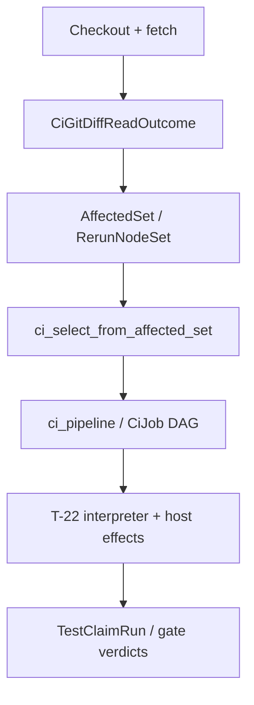

# CI DAG Overhaul — Design Canvas (Operator Ratification Gate)

**Status:** **DRAFT — awaiting operator audit/approval.** No Node authoring or legacy-path deletion lands until this canvas is ratified (except **A0** substrate under T-38 per Q-R2).

**Date:** 2026-05-29 (sharpened: no-bridging / immediate S2′)  
**Author lane:** clever-cat-115 (CI EFFICIENCY MANAGER, `node://adhoc-0972e492-c72`)  
**Companion read (what is wrong today):** [CI anatomy audit](https://github.com/gunb-ai/gunbc/pull/3885) — §7 aligned to this canvas (no staged YAML/bucket tuning).  
**This document (what we build):** modeled CI in `src/v4/workflow/ci.dag`; **§6.3 = project board**; **§6 = TASKS bridge**. No separate task ledger.

**Operator directive (2026-05-29):** *Less/no bridging → immediate solution.* One **execution** end-state (**S2′ interpreter-direct**). No S1/S2 staged YAML. No coarse bucket gating. **T-24 / C4 projection close** still requires Shape-B checked `ci.yml` emission (atom **A15**; `src/v4/TASKS.md` amended in this PR — §6.1.1).

---

## 1. Architectural target

Every CI computation is a **Node** in `src/v4/workflow/ci.dag` with declared `content_hash` inputs. **GHA runs CI by invoking the standard interpreter** (T-22 / `compiler/05_eval.dag`, THESIS:225) on `workflow/ci.dag`. The interpreter walks `ci_pipeline`, applies **IRT-1** (`affected_set` / `ci_select_from_affected_set`) and **IRT-4** verdict reuse, and executes `CiCommand` arms via modeled host effects.

**Scheduling authority = frontier only.** `CiComponentAffected` coarse buckets (`v2`/`v3`/`v4`/`workflow_policy`) are **not** a first-class scheduling surface and **do not** drive GHA `if:` gates in the end state. They are legacy shell-era compression, dissolved with `scripts/detect-affected-components.sh`.

**`.github/workflows/ci.yml` end state:** minimal harness only — triggers, concurrency, permissions, runner labels, checkout, optional gunbc build, **interpreter invocation**. Not a parallel policy authority.

**Deletion pairing:** every atom = one PR that authors the modeled Node **and** deletes the legacy path (scripts, hand YAML steps, mirrors). **No** “preserve hand YAML while tuning buckets” phase.

**Discipline:** `TestClaim` nodes + `DisciplinePolicyCommand` → `TestCommand` eval; **delete** `scripts/check-*.sh` in the same PR (§2.4).

---

## 2. Proposed Node taxonomy

Extends `v4.workflow.ci` on `main`. Does **not** redeclare wise-otter-34 substrate except as noted for **#3853 reframe**.

### 2.1 Authority layers

| Layer | Carrier | Role in end state |
|-------|---------|-------------------|
| **Witness** | `CiGitDiffReadOutcome` | Single fail-closed diff read per workflow run |
| **Frontier** | `AffectedSet` / `RerunNodeSet` (T-21) | **Primary scheduling authority** — which `CiJob` / `TestClaim` runs |
| **Pipeline** | `CiJob`, `CiCommand`, `CiGate` | Modeled work units + required-check surface |
| **Cache** | IRT-4 on `content_hash(whole TestClaim node)` + merkle command digests | Skip / reuse |
| **Host effects** | `extdeps/coordination.dag` + runtime carriers (A0) | `cargo`, `git`, subprocesses under interpreter |
| **Runner pool** | `CiRunnerPool` | Self-hosted M1 parallelism facts (modeled, not shell env) |

**Dropped as scheduling authority (operator default):**

| Removed | Reason |
|---------|--------|
| **`CiComponentAffected` → GHA `if:`** | Superseded by frontier-driven interpreter schedule; buckets duplicated T-21 imprecisely |
| **`CiGitDiffPublishCommand` → buckets** | Replaced by witness → frontier → `ci_select_from_affected_set` |
| **Per-job coarse `v2`/`v3`/`v4` jobs** | Collapsed into interpreter-run `ci_pipeline` (physical GHA partition only where resource isolation demands, not bucket booleans) |
| **`LensCiLiveWorkflowSignal` / `M1CiLiveWorkflowSignal`** | Dissolved — facts live in `CiPipeline` only |

**#3853 reframe:** Land **`CiGitDiffReadOutcome`** + `detect-ci-affected-components` host transport. **Do not** wire `CiComponentAffected` outputs to GHA job `if:` as a bridging step. If the type remains temporarily for receipts/tests, it is a **derived debug view** from diff paths, not a schedule driver.

### 2.2 `CiCommand` arms — summary

| Arm | Replaces (legacy) | Schedule when |
|-----|-------------------|---------------|
| `LintCommand` | `fmt` job | frontier touches rustfmt surface |
| `RustToolchainPoolCommand` | per-job rustup/cache | union of scheduled rust commands ≠ ∅ |
| `BootstrapStageCompile` | gunbc build / bootstrap | frontier + stage digest |
| `LensCiCommand` | Lens-CI steps | frontier + registry closure |
| `M1RustEmitProbeCommand` | `v4-m1-rust-emit-probe.sh` | frontier + `src/v4` merkle (fail-closed) |
| `TestClaimCorpusEvalCommand` | `v4-testclaim-corpus-gate.sh` | `ci_select_from_affected_set` |
| `DisciplinePolicyCommand` | `check-*.sh` / `check_*.py` | per-claim frontier |
| `TestCommand` | cargo test filters, T-15 smoke | `content_hash(TestClaim node)` + frontier |
| `V3IntegrationClusterCommand` | v3 test matrix | v3 subgraph frontier |

### 2.3 Discipline policy dissolution (P5)

Today’s `ci` job runs ~9 discipline **shell/Python scripts** (`scripts/check-*.sh`, `scripts/check_t19_testgen_activation.py`). The ratified end state:

| Legacy path | Modeled replacement | Same-PR deletion (required) |
|-------------|---------------------|----------------------------|
| `scripts/check-pr-sg0-net-shrink-discipline.sh` | `TestClaim` + `DisciplinePolicyCommand` (SG-0) | script file + `ci.yml` steps |
| `scripts/check-r4-carve-dissolution-discipline.sh` | TestClaim (R4-carve) | script + steps |
| `scripts/check-fabrication-sentinels.sh` | TestClaim | script + step |
| `scripts/check-release-doc-authority.sh` | TestClaim | script + steps |
| `scripts/check-manager-brief-authority.sh` | TestClaim | script + steps |
| `scripts/check-rust-toolchain-single-authority.sh` | TestClaim | script + step |
| `scripts/check-workflow-path-regex-inventory.sh` | TestClaim + Gate #103 `TestCommand` | script + step |
| `scripts/check_t19_testgen_activation.py` | TestClaim (T-19) | script + step |

**Forbidden steady state:** `DisciplinePolicyCommand` that shells out to retained `scripts/check-*.sh` (content-addressed script execution still leaves a second authority). **Allowed one-time import:** an atom may mechanically port shell logic into `TestClaim` oracle text in the **same PR** that deletes the script — no follow-on PR may depend on the deleted file.

Scheduling: `DisciplinePolicyCommand` is a `CiJob` whose execution arm is **`TestCommand`** (or `TestClaimCorpusEvalCommand` for multi-claim policies) narrowed by `ci_select_from_affected_set` on each claim’s declared `authority_paths` — **not** coarse bucket `if:` gates.

### 2.4 GHA mapping — end state only

| Today (legacy) | End state |
|----------------|-----------|
| `affected` job + detect script | Witness step inside harness; **no** bucket outputs |
| `fmt`, `ci`, `v2`, `v3`, `v4` jobs + `if: v*` | **One or few harness jobs** running interpreter on full `ci_pipeline` |
| `self_host_ratchet` | `TestCommand` in pipeline; scheduled by frontier + push policy |

---

## 3. Dependency DAG



**Edges:**

1. `CiGitDiffReadOutcome` → `affected_set_rerun_nodes` → `ci_select_from_affected_set` — **only** schedule narrow path.
2. Scheduled `CiJob`s execute via interpreter; `CiGate` surfaces required checks from job verdicts.
3. **No** `CiComponentAffected` → GHA `if:` edge.

---

## 4. Cache-key shape per Node type

**IRT-4 rule (non-negotiable):** verdict cache key = `content_hash(whole TestClaim node)` — input subgraph + oracle + evaluator + resources (`src/v4/TASKS.md` ~L1120). Pipeline-level `ci_command_cache_digest` interim tags are **scaffolding** until each command’s inputs are merkle-backed (audit R10).

| Node / command | Cache key function (target) | Replaces (interim) |
|----------------|----------------------------|---------------------|
| `CiGitDiffReadOutcome` | `content_hash(Witness<Diff>)` | n/a |
| `LintCommand` | `combine_hash(rustfmt_surface_merkle, toolchain_digest)` | `ci_cache_cmd_lint_tag` |
| `RustToolchainPoolCommand` | `content_hash(union(downstream_ci_job_digests))` | per-job duplicate setup |
| `BootstrapStageCompile` | `content_hash(src/v2/stage0/**.dag)` + plan pin | `ci_cache_cmd_bootstrap_compile_tag` + produces symbol |
| `LensCiCommand` | `combine_hash(registry_merkle, entry_root, target)` | lens tag fold |
| `M1RustEmitProbeCommand` | `combine_hash(content_hash(src/v4/**.dag), v2_stage0_binary_digest, Rust)` | **`ci_cache_cmd_m1_probe_tag` (bug R10)** |
| `TestClaimCorpusEvalCommand` | `combine_hash(corpus_merkle, selection_fn, roster_digest)` | static tag + fn symbol |
| `TestCommand` | `content_hash(TestClaim node)` | per-filter cargo invocations |
| `DisciplinePolicyCommand` | `content_hash(TestClaim node)` per scheduled claim (via `TestCommand`) | `check-*.sh` + unconditional shell steps |
| `CiGate` | `combine_hash(job_verdict_hash, run_policy_digest)` | GHA `if:` strings |
| `CiPipeline` (evaluator) | `content_hash(Node projection of CiPipeline)` | hand-rolled `ci_pipeline_cache_digest` fold (T-22) |

**Dissolved (not steady-state):** `CiComponentAffected` bucket tags — legacy shell-era compression; scheduling/cache authority is **frontier-only** (§2.1).

**Verdict reuse:** interpreter / T-38 harness checks IRT-4 receipt before host effects; GHA runs only when eval reports work scheduled (not when all inputs hit cache).

---

## 5. End state — S2′ interpreter-direct (only)

| Piece | Role |
|-------|------|
| **GHA** | Platform harness: triggers, concurrency, permissions, runners, checkout, build gunbc if needed, **run interpreter on `ci_pipeline`** |
| **Interpreter** | T-22 eval: frontier skip, IRT-4 reuse, execute `CiCommand` arms |
| **T-38** | Wires eval entry + host effects (neat-wren-762); **not** a second CI engine |

```yaml
- name: CI (interpreter)
  run: gunbc eval --entry v4.workflow.ci::ci_pipeline
```

Exact CLI lands in A0/A2 with T-38. **There is no S1, S2, or S3 in this lane.**

**Substrate today (`src/v4/workflow/ci.dag` on `main`):**

| Artifact | Status | Notes |
|----------|--------|-------|
| `CiPipeline` / `CiJob` / `CiCommand` | **modeled** | Policy graph exists; GHA still schedules via hand `ci.yml` buckets |
| `affected_set_rerun_nodes` / `RerunNodeSet` | **modeled** (`v4.lens.affected_set`) | Feeds T-21 rerun frontier |
| `ci_select_from_affected_set` | **modeled — TestClaim roster only** | `fn` at `ci.dag` ~L585; wired to `TestClaimCorpusEvalCommand.selection_fn` |
| `ci_select_ci_jobs_from_affected_set` (or equivalent) | **not yet** | Required to replace GHA `if: v2/v3/v4` with interpreter schedule over `ci_pipeline` |
| `CiComponentAffected` | **not in `ci.dag`** | Shell/YAML bucket authority only — **A1** deletes outputs; **A2** makes buckets unnecessary |

**Viability — dropping `CiComponentAffected` scheduling:**

| Question | Answer |
|----------|--------|
| **Viable?** | **Yes, after A2** — not “already.” TestClaim narrowing exists; **CiJob/CiCommand** scheduling from the same `AffectedSet` / fail-closed frontier is an explicit **A2** deliverable. |
| **Blocker?** | **A1:** #3853 must land witness only (no bucket→GHA). **A2:** add pipeline-level selector + interpreter entry; then delete bucket `if:`. |
| **Fail-closed rule** | Pipeline selector must be a **superset** of required work on ambiguity (same spirit as `test_claim_ci_selection_fail_closed` + `RerunNodeSetFailClosed`) — never skip a job whose inputs intersect the rerun frontier. |
| **Risk** | Interpreter must execute selected `ci_pipeline` subgraph in one harness — tracked in A2, not a reason to keep buckets past A2. |

---

## 6. TASKS.md bridge and planning authority

### 6.1 Cited rows (do not re-author)

**T-21:** replacement for `detect-affected-components.sh`; IRT-1/IRT-4 with T-24.

**T-24:** CI as `.dag`; **Phase 1** = S2′ interpreter-direct (A0–A14); **Phase 2** = Shape-B checked `ci.yml` + delete hand YAML (A15) — **T-24 [DONE] only after both** (Q-R1, **Q-R6**; TASKS.md ratified in this PR).

**T-38:** T-22 eval in CI; delete corpus shell when structured verdicts exist.

### 6.1.1 C4 and T-24 close — reconciling S2′ with TASKS.md / Pure Bootstrap

**Sources that appear to conflict:**

| Source | Text | Apparent tension |
|--------|------|------------------|
| `src/v4/TASKS.md` T-24 (~L1181–1186) | `.github/workflows/ci.yml` as **DERIVED Shape-B**; delete hand-authored YAML | Sounds like full YamlStatic emission |
| `docs/design-pure-bootstrap-zero.md` **C4** | Committed `ci.yml` as **checked projection** from `.dag` | Sounds like generated YAML is mandatory |
| This canvas **Q-R1 / S2′** | T-24 closes on **interpreter-direct** harness; YamlStatic **out of lane** (§10) | Sounds like no committed YAML |

**Resolution (single authority — two-phase close, no silent TASKS narrowing):**

This canvas **does not** redefine T-24/C4 in prose alone. It **ratifies** a two-phase close in **`src/v4/TASKS.md` (same PR)** so `TASKS.md` and C4 remain authoritative.

| Phase | Atoms | What closes | `ci.yml` role |
|-------|-------|-------------|---------------|
| **1 — execution** | A0–A14 | CI overhaul lane “behavior done” | **Interim:** thin GHA harness (checkout, env, interpreter on `ci_pipeline` per §5). Hand **policy** YAML + `scripts/check-*` **deleted**. Binding smoke in A2 proves harness entrypoints match `ci.dag`. **T-24 stays open.** |
| **2 — projection (T-24 / C4)** | **A15** | **T-24 [DONE]** per TASKS + C4 | **Shape-B:** generator emits **checked** `.github/workflows/ci.yml` from `CiPipeline`; **all** hand-authored `ci.yml` removed. Committed YAML is a non-authoritative projection only. |

1. **Policy authority = `ci.dag` only (both phases).** Every schedule decision and pass/fail verdict is a Node / `TestClaim` via T-22. GHA never encodes policy (`if: v4`, discipline shell, duplicate git-diff).
2. **Phase 1 does not claim T-24 closed.** Interpreter-direct (S2′) dissolves shell bridges and bucket `if:` scheduling; it is **not** a substitute for Shape-B emission.
3. **Phase 2 is mandatory for T-24 / C4** (`TASKS.md` L1181–1186; `design-pure-bootstrap-zero.md` C4). Shape-B checked YAML emission + deletion of hand-authored workflow YAML is **atom A15**, not an optional follow-on.
4. **P5 preserved:** each atom still pairs modeled Node authorship with legacy deletion in the **same PR**; A15 deletes remaining hand `ci.yml` when the emitter lands.

**Worker rule:** If a change adds policy to `ci.yml` instead of `ci.dag`, it violates P2. Hand-editing committed `ci.yml` after A15 is forbidden — regenerate from `ci.dag`.

**T-22:** THESIS:225 — `dag run` / eval is the primary execution path.

### 6.2 T-* relationships

| Task | Relationship |
|------|----------------|
| **T-21** | **Scheduling authority** for this overhaul |
| **T-24** | **Phase 1:** A0–A14 (S2′); **Phase 2:** A15 Shape-B — **[DONE] only after A15** (Q-R1/Q-R6) |
| **T-38** | **A0 active now** (Q-R2); neat-wren-762 owns harness + host effects |
| **T-15** | CI schedules self-host `TestCommand`; Lane C owns implementation |
| **T-10/T-23** | Unchanged lens split |

**TASKS.md:** T-24 close predicates amended **in this PR** (§6.1.1 table); no post-merge silent narrowing.

### 6.3 Migration atoms — project board

One PR each = author Node + delete legacy. **No YAML-tuning atoms.**

| Atom | Node / work | Legacy deleted (same PR) | Owner | Status |
|------|-------------|--------------------------|-------|--------|
| **A0** | Host-effect substrate for CI (`cargo`, `git`, …) | n/a | **neat-wren-762** | **active** (Q-R2 — start now) |
| **A1** | `CiGitDiffReadOutcome` + frontier schedule wiring; **dissolve bucket GHA outputs** | `scripts/detect-affected-components.sh`; `affected` job bucket outputs; bucket-driven `if:` on downstream jobs | wise-otter-34 + clever-cat-115 | **ready** — **#3853 must reframe** (no bucket `if:` landing) |
| **A2** | End-state `ci.yml` harness + interpreter entry on `ci_pipeline` | Hand-authored job graph in `ci.yml`; `dsl/gunbc/ci_github_actions_workflow.dag` mirror | clever-cat-115 + neat-wren-762 | paused |
| **A3** | `CiRunnerPool` / M1 parallelism in model | `V4_M1_CARGO_CHECK_JOBS` shell hacks | clever-cat-115 | paused |
| **A4** | `RustToolchainPoolCommand` | duplicate rustup/cache steps | clever-cat-115 | paused |
| **A5** | `LintCommand` + merkle | standalone `fmt` job blob | clever-cat-115 | paused |
| **A6** | `DisciplinePolicyCommand` SG-0 / R4-carve + claims | `check-pr-sg0-*.sh`, `check-r4-carve-*.sh`, steps | clever-cat-115 | paused |
| **A7** | `DisciplinePolicyCommand` doc/manager + claims | `check-release-doc-*.sh`, `check-manager-brief-*.sh`, steps | clever-cat-115 | paused |
| **A8** | `DisciplinePolicyCommand` fabrication/T-19/toolchain/G103 + claims | remaining `check-*.sh`, `check_t19_*.py`, steps | clever-cat-115 | paused |
| **A9** | `M1RustEmitProbeCommand` + eval | `scripts/v4-m1-rust-emit-probe.sh`, `M1CiLiveWorkflowSignal` | clever-cat-115 | paused |
| **A10** | Bootstrap → M1 artifact edge | duplicate full-tree compile | clever-cat-115 | paused |
| **A11** | `LensCiCommand` | `LensCiLiveWorkflowSignal`, hand semantic step | clever-cat-115 | paused |
| **A12** | `TestClaimCorpusEvalCommand` via interpreter | `scripts/v4-testclaim-corpus-gate.sh` | clever-cat-115 + neat-wren-762 | paused |
| **A13** | Bootstrap viability as bootstrap chain | `scripts/v4-bootstrap-viability.sh`, posture gate | clever-cat-115 | paused |
| **A14** | `V3IntegrationClusterCommand` + single binary | duplicate `cargo test` filters | clever-cat-115 | paused |
| **A15** | Shape-B `ci.yml` emission from `CiPipeline` + checked-in projection | **all** hand-authored `.github/workflows/ci.yml` | clever-cat-115 + merry-carp-814 pattern | paused — **T-24 / C4 close gate** |

**Removed from board (bridging only):** YamlStatic `affected` emit, emission mirror as interim schedule driver — see §10. **Not removed:** full `ci.yml` Shape-B emission (**A15**).

**Dispatch rule:** work-item title starts with atom id (`A9: …`).

**Paused:** A2–A15 until canvas ratified. **Active:** A0. **A1:** coordinate #3853 reframe before merge.

---

## 7. Coordination contracts

| Owner | Ships |
|-------|-------|
| **neat-wren-762** | **A0 now**; T-38 harness + host effects; A2/A12 interpreter wiring |
| **wise-otter-34** | **A1 only:** `CiGitDiffReadOutcome` + detect bin — **not** bucket→GHA wiring |
| **clever-cat-115** | Canvas, audit alignment, A2–A14 `ci.dag` + deletions |
| **merry-carp-814** | `release.dag` pattern only — not CI execution |
| **vivid-raven-55** | Scaffold-ratchet deletions when triggered |

**No overlap rule:** one authority per fact. Any `ci.yml` step must be projectable from `ci.dag` **or** deleted in the same atom PR that authors its modeled replacement. **Forbidden:** a standing “interim allowlist” of hand YAML steps (retired **S2 BinaryShim** / bespoke `gunbc ci run` path). **S0** (today’s hand `ci.yml`) exists only as audit baseline until **A2** lands the S2′ harness; no parallel YAML-tuning phase.

---

## 8. Ratification decisions (operator 2026-05-29)

| ID | Decision | Resolution |
|----|----------|------------|
| **Q-R1** | T-24 close requires Shape-B `ci.yml` emission? | **Yes (A15).** **No** staged YAML *bridging* (buckets / hand policy). S2′ = Phase 1 execution only. |
| **Q-R6** | C4 vs S2′ / TASKS Shape-B bullet | **Reconciled in TASKS.md + §6.1.1:** two-phase close; C4 satisfied at **A15**, not by hand harness |
| **Q-R2** | A0 before canvas ratification? | **Yes.** neat-wren-762 starts **immediately** (substrate/host-effects only). |
| **Q-R3** | `CiComponentAffected` scheduling | **Drop** as schedule driver (default **a**). Frontier only. |
| **Q-R4** | Staged S0/S1/S2/S3 | **Reject.** Single end-state **S2′**; S0 = today’s audit baseline only. |
| **Q-R5** | Executor | **T-38 / neat-wren-762** — same interpreter stack. |
| Q5 | M1 fail-closed | **Required** (B01) |
| Q11 | Discipline | **Resolved** — TestClaim only; delete scripts same PR |

**Infra compounding (operator, separate lane — 2026-05-29):** On srv2, `ctrl-jobserver` may crash-loop when `host.fifo` is not a FIFO → jobserver token starvation → emit-phase stalls until the 20m step cap (exit 143). This is **independent** of the modeled overhaul; operator owns infra fix. **A9** still required: real `src/v4` merkle skip + fail-closed so timeouts never pass green. Cross-ref audit `§5.1`.

---

## 9. Acceptance criteria

### 9.1 CI overhaul lane done (A0–A14 complete)

1. **`ci.dag` sole policy authority;** GHA invokes interpreter on `ci_pipeline` (S2′); **no** coarse bucket `if:`; **no** policy `scripts/check-*.sh`.
2. **IRT-1 + IRT-4** on all CI `TestCommand` / corpus eval paths.
3. **M1** real `src/v4` merkle; probe shell deleted; fail-closed on timeout.
4. **Single** `CiGitDiffReadOutcome` per run.
5. **Phase-1 ratchet:** harness binding smoke (`v4_workflow_ci_runner_dag_smoke_test` extended) — interim until A15.
6. Audit Table A rows owned by A0–A14 or explicitly deferred.

### 9.2 T-24 / C4 closed (requires A15)

1. **Shape-B** checked `.github/workflows/ci.yml` emitted from `CiPipeline` in `ci.dag`.
2. **Hand-authored `ci.yml` deleted** — no parallel workflow authority (TASKS L1182–1186; C4).
3. **v3 string ratchets** over generated output → `TestClaim`s (existing T-24 bridge clause).

---

## 10. Out of scope

- **YamlStatic `affected` job emit** or bucket→GHA bridging — not a schedule driver (dissolved A1).
- **Hand-editing `ci.yml` for policy** — forbidden after A15; only generator output.
- **A15 emitter implementation detail** — merry-carp-814 / `WorkflowRuntime` pattern informs A15; atom owner clever-cat-115 unless redispatched.
- **Staged YAML bridging** (S1 bucket tuning, parallel hand-`ci.yml` edits, “preserve YAML during emission slice”).
- **`CiComponentAffected` as GHA schedule driver** — dissolved in A1.
- **`release.dag`**, **T-15 implementation**, **T-21 lens math**, **sccache infra**, **micro-optimization PRs** (#3879-class).
- **Agent `gh pr merge`**.

---

## Appendix A — References

`src/v4/workflow/ci.dag`, `src/v4/TASKS.md`, PR #3885 (audit), PR #3853 (reframe A1), `docs/design-affected-set-lens.md`, neat-wren-762 / T-38.

## Appendix B — Execution gate

**PAUSED:** A2–A15 until operator ratifies this canvas. **ACTIVE:** A0 (neat-wren-762). **A1:** #3853 reframe coordination only until ratified.
