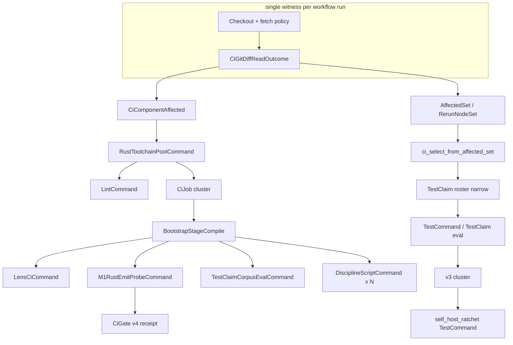

# CI DAG Overhaul — Design Canvas (Operator Ratification Gate)

**Status:** **DRAFT — awaiting operator audit/approval.** No Node authoring or legacy-path deletion lands until this canvas is ratified.

**Date:** 2026-05-29  
**Author lane:** clever-cat-115 (CI EFFICIENCY MANAGER, `node://adhoc-0972e492-c72`)  
**Companion read (what is wrong today):** [CI anatomy audit](https://github.com/gunb-ai/gunbc/pull/3885) (`docs/audit/ci-anatomy-and-redundancy-2026-05-29.md`, lands with #3885)  
**This document (what we build):** modeled CI authority in `src/v4/workflow/ci.dag`, migration atoms, emission end-state, coordination boundaries.

**Precedent canvases:** `docs/design-ci-workflow-substrate-shape-2026-05-12.md` (substrate shape, ratified), `docs/design-ci-workflow-emitter-dispatch.md` (`WorkflowRuntime` / projection targets), `docs/design-affected-set-lens.md` (T-21 frontier).

---

## 1. Architectural target

Every CI computation is a **Node** in `src/v4/workflow/ci.dag` with declared `content_hash` inputs and typed outputs. `.github/workflows/ci.yml` is either a **thin BinaryShim** (invoke one gunbc CI runner) or a **fully derived YamlStatic artifact** emitted from the same model — never a third authority. Legacy shell scripts and hand-Rust mirrors are **deleted in the same PR** as their modeled Node lands. **Exactly-once** is a structural property: unchanged input merkle → step is not scheduled (IRT-1 frontier) and prior green verdict is reused (IRT-4 `content_hash(whole TestClaim node)` per `src/v4/TASKS.md`). Speed is a consequence of correct modeling, not YAML `if:` tuning.

---

## 2. Proposed Node taxonomy

The overhaul **extends** the existing `v4.workflow.ci` carriers already on `main`. It does **not** redeclare types owned by wise-otter-34 / PR [#3853](https://github.com/gunb-ai/gunbc/pull/3853).

### 2.1 Authority layers (what is a “Node”)

| Layer | Carrier (in `ci.dag` or substrate) | Represents | Inputs (declared) | Output | Depends on |
|-------|-----------------------------------|------------|-------------------|--------|------------|
| **Witness source** | `CiGitDiffReadOutcome` *(#3853)* | Single git diff read, fail-closed | `Witness<GitDiffNameOnly>` from host transport | `Outcome<GitDiffNameOnly>` | checkout + fetch policy |
| **Component projection** | `CiComponentAffected` *(#3853)* | Coarse job-level buckets (`v2`, `v3`, `v4`, `workflow_policy`) | `GitDiffNameOnly` or `CiGitDiffReadOutcome` | `CiComponentAffected` flags | diff witness |
| **Frontier** | `AffectedSet` / `RerunNodeSet` *(T-21 lens)* | Node-precision rerun set | `Dag_before`, `Dag_after`, edit locus | `RerunNodeSet` | diff + program graph |
| **Pipeline vertex** | `CiJob` | One schedulable unit of work | `command`, `needs` | job verdict | upstream `CiJob` outputs |
| **Command** | `CiCommand` coproduct | What the job executes | per-arm fields + implicit digests | command receipt | bootstrap pool, digests |
| **Gate** | `CiGate` | Required check / policy surface | `job`, `run_policy` | gate verdict | bound `CiJob` |
| **Cache digest** | `ci_*_cache_digest` fns | IRT-4 key material for pipeline eval | command/job/gate structure | `Hash` | real input merkle *(target)* |
| **Test invocation** | `TestCommand` / `TestClaimCorpusEvalCommand` | Cargo test or T-22 eval roster | claim subgraph + binary digest | `TestClaimRun` | frontier selection |
| **Runner pool** | `CiRunnerPool` *(#3853)* | Self-hosted parallelism facts | pool id, job cap | pool binding | `workflow_policy` / M1 |

**Interim carriers to dissolve** (already marked 🟡 in `ci.dag`): `LensCiLiveWorkflowSignal`, `M1CiLiveWorkflowSignal` — forbidden permanent homes for `ci.yml` step names; projection must read `CiPipeline` only.

### 2.2 `CiCommand` arms — current → target

| `CiCommand` arm | Current CI step(s) | Target inputs | Target output | Notes |
|-----------------|-------------------|---------------|---------------|-------|
| `LintCommand` | `fmt` job: `cargo fmt --all` | `content_hash(rustfmt surface)` + toolchain pin | fmt pass/fail | Skip when surface ∅ (R01) |
| `BootstrapStageCompile` | `ci`: build `gunbc`, v4 bootstrap | `content_hash(src/v2/stage0/**)` + stage graph | stage0 binary digest | Shares artifact with downstream (R08/R09) |
| `LensCiCommand` | Lens-CI smoke + semantic compile | registry closure + entry root merkle | lens gate witnesses (T-10) | Verdict authority stays `00_compile.dag` |
| `M1RustEmitProbeCommand` | `v4-m1-rust-emit-probe.sh` | `content_hash(src/v4/**.dag)` + v2 binary digest + target=Rust | probe receipt (fail-closed) | Delete shell; fix static tag (R07, B01) |
| `TestClaimCorpusEvalCommand` | `v4-testclaim-corpus-gate.sh` | roster ∩ `ci_select_from_affected_set` | corpus eval verdicts | T-38 / T-22 |
| `TestCommand` | v3 integration filters, T-15 smoke, discipline self-tests | `content_hash(TestClaim node)` + toolchain/binary | `TestClaimRun` | IRT-1 + IRT-4 (R05, R11) |
| `IgnoredTestCommand` | `#846` zero-filter placeholders | explicit claim id | skipped receipt | Modeled “must run elsewhere” |

**New arms (to author — names indicative, exact coproduct spelling in implementation PR):**

| Proposed arm | Replaces | Declared inputs |
|--------------|----------|-----------------|
| `DisciplineScriptCommand { script_id, authority_paths }` | `check-*.sh` policy gates in `ci` | path-set merkle + script content hash |
| `CiGitDiffPublishCommand` | `affected` job shell + `detect-affected-components.sh` | delegates to `CiGitDiffReadOutcome` → `CiComponentAffected` |
| `RustToolchainPoolCommand` | per-job Setup Rust + cache | union of downstream command digests (R02) |
| `V3IntegrationClusterCommand` | v3 job cargo test matrix | v3 subgraph merkle + single prebuilt test binary |

### 2.3 Mapping: today’s GitHub Actions jobs → modeled graph

| GHA job (today) | Modeled as | Scheduling driver (target) |
|-----------------|------------|----------------------------|
| `affected` | `CiGitDiffPublishCommand` + outputs `CiComponentAffected` | always (cheap); **one** diff witness |
| `fmt` | `CiJob` + `LintCommand` | `LintCommand` input merkle ≠ ∅ |
| `ci` | **DAG of many `CiJob`s** inside one runner pool, not one blob job | per-command frontier + component flags |
| `v2` | `BootstrapStageCompile` / v2 verify command | `CiComponentAffected.v2` + frontier |
| `v3` | `V3IntegrationClusterCommand` + `TestCommand`s | `CiComponentAffected.v3` + frontier |
| `v4` | receipt `CiGate` only | prior `ci` job verdicts (R12) |
| `self_host_ratchet` | `TestCommand` on T-15 fixed-point | `main` push policy + v3 outcome |

---

## 3. Dependency DAG (proposed)

**Edge list (authoritative scheduling):**

1. `CiGitDiffReadOutcome` → `CiComponentAffected` (component buckets for GHA job `if:` during transition).
2. `CiGitDiffReadOutcome` → `affected_set_rerun_nodes` → `ci_select_from_affected_set` (per-claim / per-command narrow).
3. `RustToolchainPoolCommand` → all rust-consuming `CiJob`s (fmt, compile, test).
4. `BootstrapStageCompile` → `LensCiCommand`, `M1RustEmitProbeCommand`, `TestClaimCorpusEvalCommand` (shared v2 binary / emit tree).
5. `M1RustEmitProbeCommand` → `CiGate` (`m1_rust_emit_probe_signal`); **blocking** verdict (B01: no `continue-on-error` at authority).
6. Discipline commands: no compile dependency unless script authority touches rust surface.
7. `v3` job cluster: depends on pool + optional `BootstrapStageCompile` for gunbc-assisted tests only.

**Duplicate reads eliminated:** one `fetch-depth: 0` + `git fetch origin main` at witness; `ci` job must not re-fetch for discipline-only paths (R04).

---

## 4. Cache-key shape per Node type

**IRT-4 rule (non-negotiable):** verdict cache key = `content_hash(whole TestClaim node)` — input subgraph + oracle + evaluator + resources (`src/v4/TASKS.md` ~L1120). Pipeline-level `ci_command_cache_digest` interim tags are **scaffolding** until each command’s inputs are merkle-backed (audit R10).

| Node / command | Cache key function (target) | Replaces (interim) |
|----------------|----------------------------|---------------------|
| `CiGitDiffReadOutcome` | `content_hash(Witness<Diff>)` | n/a |
| `CiComponentAffected` | `content_hash(diff paths + bucket rules)` | static script version tag |
| `LintCommand` | `combine_hash(rustfmt_surface_merkle, toolchain_digest)` | `ci_cache_cmd_lint_tag` |
| `RustToolchainPoolCommand` | `content_hash(union(downstream_ci_job_digests))` | per-job duplicate setup |
| `BootstrapStageCompile` | `content_hash(src/v2/stage0/**.dag)` + plan pin | `ci_cache_cmd_bootstrap_compile_tag` + produces symbol |
| `LensCiCommand` | `combine_hash(registry_merkle, entry_root, target)` | lens tag fold |
| `M1RustEmitProbeCommand` | `combine_hash(content_hash(src/v4/**.dag), v2_stage0_binary_digest, Rust)` | **`ci_cache_cmd_m1_probe_tag` (bug R10)** |
| `TestClaimCorpusEvalCommand` | `combine_hash(corpus_merkle, selection_fn, roster_digest)` | static tag + fn symbol |
| `TestCommand` | `content_hash(TestClaim node)` | per-filter cargo invocations |
| `DisciplineScriptCommand` | `combine_hash(script_bytes_hash, authority_paths_merkle)` | unconditional shell |
| `CiGate` | `combine_hash(job_verdict_hash, run_policy_digest)` | GHA `if:` strings |
| `CiPipeline` (evaluator) | `ci_pipeline_cache_digest` → **dissolve** to `content_hash(Node projection of CiPipeline)` | hand-rolled fold (T-22) |

**Verdict reuse:** runner checks IRT-4 receipt before host execution; GHA step runs only when modeled runner reports `Schedule`.

---

## 5. End-state `.github/workflows/ci.yml`

**Ratified direction (compose existing canvases):** substrate shape **(c-refined)** from `docs/design-ci-workflow-substrate-shape-2026-05-12.md`; emission target **`WorkflowRuntime`** from `docs/design-ci-workflow-emitter-dispatch.md`.

**Staged end-state (recommended):**

| Phase | `ci.yml` shape | Justification |
|-------|----------------|---------------|
| **S0 (today)** | Hand-authored + `ci_github_actions_workflow.dag` mirror | Dual authority; audit baseline |
| **S1 (#3853 lands)** | Hand `ci.yml` calls `detect-ci-affected-components` binp; `ci.dag` owns bucket rules | Substrate merge; still dual |
| **S2 (post-ratification)** | **BinaryShim**: 3–4 jobs (`witness`, `ci-runner`, optional `v3-host`, `fmt-or-pool`) | GHA cannot execute `.dag`; one `gunbc ci run` reads `ci_pipeline` + frontier |
| **S3 (T-24 close)** | **YamlStatic** fully emitted from `ci.dag` + `dsl/extdeps/github/actions.dag` | Delete hand YAML; ratchets compare emit output |

**Recommendation:** target **S3**; use **S2** only while the CI runner binary and emission slice are incomplete. Do **not** perpetuate a third parallel `dsl/gunbc/ci_github_actions_workflow.dag` hand-edit path — every S1 edit must be mirrored from `ci.dag` or treated as emission drift.

**What remains in S3 YAML (minimal):**

- Triggers, concurrency, permissions, runner labels (platform facts).
- One checkout/fetch witness job OR inlined witness step.
- Jobs emitted from `CiJob`/`CiGate` with `if:` expressions **projected** from `CiComponentAffected` + per-command schedule bitmap (not hand-tuned booleans).
- No `bash scripts/check-*.sh` — discipline becomes `DisciplineScriptCommand` inside runner.

---

## 6. Migration sequence (authoring + deletion atoms)

Each atom = **one PR** that authors modeled facts **and** deletes the legacy path in the same diff. Order respects dependencies.

| # | Atom | Author | Delete / dissolve |
|---|------|--------|-------------------|
| A1 | Land **#3853** substrate | wise-otter-34 | `scripts/detect-affected-components.sh`; wire `detect-ci-affected-components` |
| A2 | `CiGitDiffReadOutcome` sole witness in workflow | wise-otter-34 | duplicate fetch in `ci` where runner absorbs |
| A3 | `CiRunnerPool` + M1 parallelism projection | wise-otter-34 | shell `V4_M1_CARGO_CHECK_JOBS` hacks |
| A4 | `RustToolchainPoolCommand` + pool digest | clever-cat-115 | 2nd/3rd rustup in `ci`/`fmt` (R02) |
| A5 | `LintCommand` real surface digest | clever-cat-115 | unconditional `fmt` on docs-only |
| A6 | `DisciplineScriptCommand` × SG-0 / R4-carve | clever-cat-115 | `check-pr-sg0-*`, `check-r4-carve-*` steps |
| A7 | `DisciplineScriptCommand` × doc/manager authority | clever-cat-115 | release-doc + manager-brief shell steps |
| A8 | `DisciplineScriptCommand` × fabrication / T-19 / toolchain | clever-cat-115 | remaining discipline scripts in `ci` |
| A9 | `M1RustEmitProbeCommand` runner + merkle cache | clever-cat-115 | `scripts/v4-m1-rust-emit-probe.sh`; `M1CiLiveWorkflowSignal` |
| A10 | Bootstrap artifact edge → M1 | clever-cat-115 | duplicate full-tree compile (R08) |
| A11 | `LensCiCommand` projection-only | clever-cat-115 | `LensCiLiveWorkflowSignal`; hand semantic step |
| A12 | `TestClaimCorpusEvalCommand` T-22 runner | clever-cat-115 | `scripts/v4-testclaim-corpus-gate.sh` |
| A13 | `v4-bootstrap-viability` as bootstrap chain | clever-cat-115 | `scripts/v4-bootstrap-viability.sh` bridge |
| A14 | `V3IntegrationClusterCommand` + single binary | clever-cat-115 | duplicate `cargo test` filters (R05) |
| A15 | Gate #103 + `workflow_policy` from model only | clever-cat-115 | hand `if:` regex inventory drift |
| A16 | Emit `affected` job YamlStatic | clever-cat-115 | hand `affected` job body |
| A17 | Emit full `ci.yml` + delete hand file | clever-cat-115 | `.github/workflows/ci.yml` authority |
| A18 | Remove `ci_github_actions_workflow.dag` mirror | clever-cat-115 | dual-authority mirror |

**Paused until this canvas is ratified:** A4–A18 (clever-cat-115 lane). **A1–A3** wise-otter-34 (#3853) may land independently but should not be extended by parallel YAML edits.

---

## 7. Coordination contracts

| Owner | Ships | Does **not** ship |
|-------|-------|-------------------|
| **wise-otter-34** / [#3853](https://github.com/gunb-ai/gunbc/pull/3853) | `CiComponentAffected`, `CiGitDiffReadOutcome`, `detect-ci-affected-components`, runner pool facts, `ci.yml`/`ci.dag` alignment for **affected** + M1 pool, claim receipts | Per-command migration atoms A4–A18; full YAML emission |
| **clever-cat-115** | This canvas; audit #3885; post-ratification A4–A18; CI runner orchestration; discipline dissolution | Redefining #3853 types; `release.dag`; T-15 self-host implementation |
| **merry-carp-814** | `release.dag` → `release.yml` emission pattern; shared projection DSL lessons | `ci.dag` edits; `ci.yml`; CI efficiency atoms |
| **vivid-raven-55** | INVARIANTS / scaffold-ratchet **deletions** only (when trigger fires) | New CI commands; workflow policy |
| **Lane C / T-15** | Self-host fixed-point, `bin/main.dag` bootstrap | CI workflow modeling |

**No overlap rule:** one authority per fact. If a step appears in `ci.yml`, it must be projectable from `ci.dag` or be on the explicit S2 shim allowlist until A17.

**Interface handshake (clever-cat ↔ wise-otter):** clever-cat-115 consumes `CiGitDiffReadOutcome` / `CiComponentAffected` as **read-only** types; extension PRs add `CiCommand` arms only on clever-cat branches after #3853 merges.

---

## 8. Open questions — operator ratification required

| ID | Question | Options | Recommendation |
|----|----------|---------|----------------|
| Q1 | End-state emission | YamlStatic vs permanent BinaryShim | **YamlStatic** (T-24 close); BinaryShim acceptable ≤6 months |
| Q2 | GHA execution model | `.dag` on runner vs pre-emitted YAML | **Runner interprets `ci_pipeline`** (S2); emit YAML (S3) |
| Q3 | Branch protection check names | Rename allowed vs stable aliases | **Stable `CiGate.id` → check name map** for migration; document renames |
| Q4 | Coarse buckets during transition | Keep `v2/v3/v4/workflow_policy` outputs | **Yes until A17**; per-command schedule bitmap behind the scenes |
| Q5 | M1 probe blocking | Informational vs required | **Required fail-closed** (B01); notices OK, green-on-timeout forbidden |
| Q6 | `fmt` as separate GHA job | Separate vs merged into pool job | **Merged into pool** at S2 (one rustup) |
| Q7 | v3 on docs-only PRs | Skip entire job vs skip via frontier | **Frontier-only** (no hand `ci_rust` YAML — superseded #3879) |
| Q8 | External cache backend | None vs sccache vs shared CARGO_HOME | **Defer** (R06); per-runner temp stays until infra decision |
| Q9 | `#846` zero-filter tests | Move receipt vs fix filter | **Model `IgnoredTestCommand`** + run at correct site (audit §8) |
| Q10 | Audit §7 P0 micro-rows | Keep vs rewrite | **Rewrite** to deletion-gated atoms A1–A18 (follow-up on #3885) |

---

## 9. Acceptance criteria (“CI overhaul done”)

Structural completion (not wall-clock promises):

1. **T-24 closed** per `src/v4/TASKS.md`: `ci.dag` is sole CI authority; hand `ci.yml` deleted; generator emits checked YAML.
2. **Zero** `scripts/*` invoked from CI except host transports explicitly declared as dissolution-pending with 🟡 marks (none remain for CI policy).
3. **IRT-1 + IRT-4** wired for every `TestCommand` / `TestClaimCorpusEvalCommand` in CI roster (docs-only PR: no rust toolchain, no cargo, discipline claims skipped at frontier).
4. **M1** cache uses real `src/v4` merkle; shell probe deleted; timeout cannot yield green (B01).
5. **Single** `CiGitDiffReadOutcome` per workflow run (R04).
6. **Ratchets:** `v4_workflow_ci_runner_dag_smoke_test` + emission diff test prove `ci.yml` ≡ projection(`ci_pipeline`).
7. **Audit Table A** rows R01–R12 have a **Table B** modeled owner merged or explicitly deferred with operator sign-off.

**Optional metrics (informational):** docs-only PR total wall ≤15s (profiled run 26615772294 baseline ~77s); v4-affected PR avoids duplicate full-tree compile (R07/R08).

---

## 10. Out of scope

- **`release.dag` / `release.yml`** — merry-carp-814 lane; only pattern-sharing per §7.
- **T-15 self-host fixed-point implementation** — Lane C; CI only *schedules* the TestCommand.
- **T-21 affected-set lens math** — wise-otter-34 / lens owners; CI consumes `AffectedSet`.
- **T-10 `run_required_lens_gates` semantics** — compiler owns verdict; CI schedules `LensCiCommand`.
- **sccache / registry infra** (R06) — independent capacity project.
- **Deleting overlapping tests by hand** — §8 audit: input declaration + IRT-4 makes overlap free; only SCAFFOLD-RATCHET/DEAD deletions (vivid-raven-55).
- **v2/v3 frozen-tree feature work** — only CI scheduling around frozen components.
- **Micro-optimization PRs** (#3879, #3882, #3883-class) — superseded by this overhaul.
- **Merging this canvas or audit via agent** — operator manual merge policy unchanged.

---

## Appendix A — References

| Artifact | Role |
|----------|------|
| `src/v4/workflow/ci.dag` | Modeled pipeline (current partial fill) |
| `src/v4/TASKS.md` T-24, T-21, IRT-1/IRT-4 | Close gates |
| `docs/audit/ci-anatomy-and-redundancy-2026-05-29.md` | Redundancy inventory |
| `docs/design-ci-workflow-substrate-shape-2026-05-12.md` | Ratified WorkflowRuntime placement |
| `docs/design-ci-workflow-emitter-dispatch.md` | YamlStatic / BinaryShim |
| PR #3853 | Substrate types (wise-otter-34) |
| PR #3885 | Audit doc |

## Appendix B — Execution gate

**PAUSED:** `session/clever-cat-115-ci-dag-m1-node` and all atoms A4+ remain **draft-only** until operator approves this canvas. Permitted work before ratification: audit doc (#3885), this design PR, coordination messages only.
