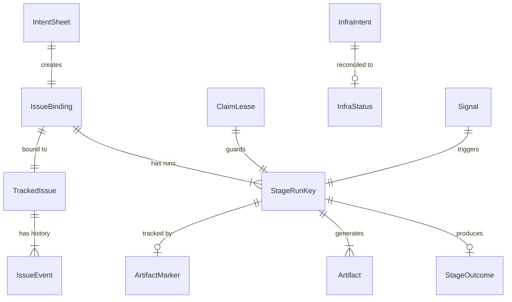
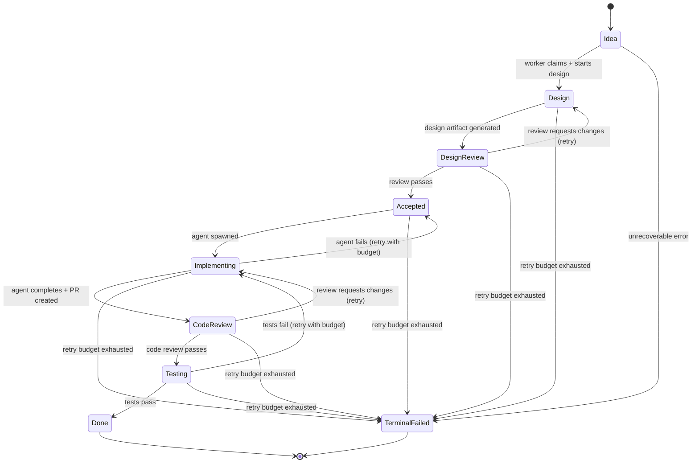
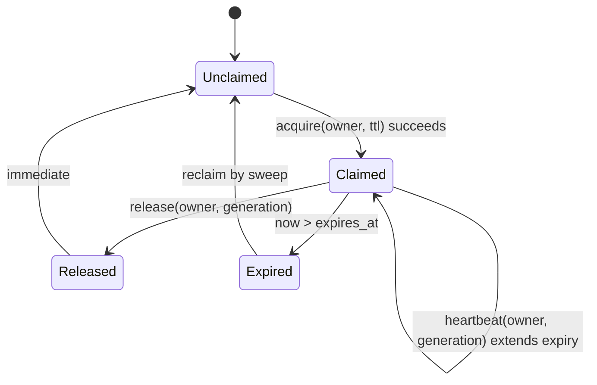
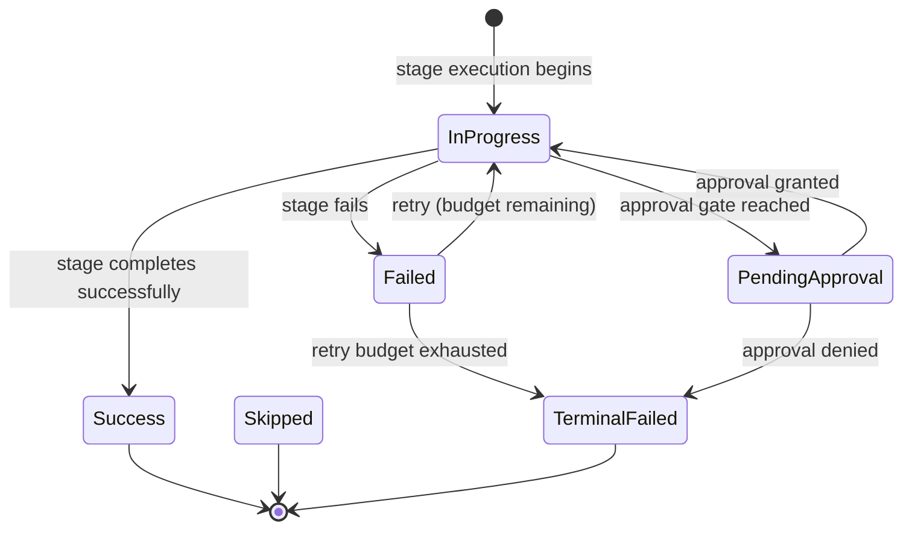
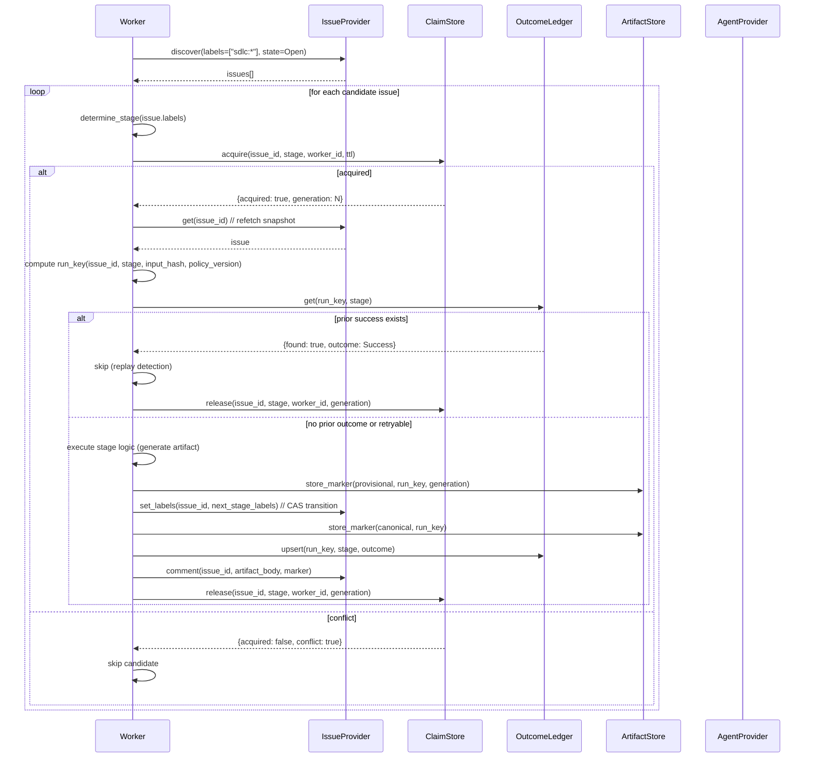
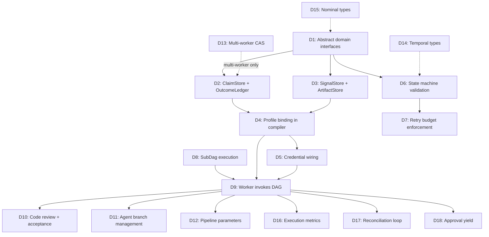

# SDLC Domain Modeling — Comprehensive Reference

Status: Phases 1–6 implemented — all 18 deficits (D1–D18) addressed
Date: 2026-02-21
Parent: [mega-modeling-design.md](mega-modeling-design.md) (MD0-D)
Scope: Canonical domain model for the SDLC system. This document defines every entity, relationship, state machine, invariant, and contract that the SDLC pipeline operates on. All implementation work should trace back to definitions here.

## 1. Document Purpose and Relationship to Other Docs

This document is the **modeling counterpart** to `mega-modeling-design.md` (which defines workflow and contracts) and `e2e-gap-analysis.md` (which identifies implementation deltas). It answers: **what are the domain objects, what are their relationships, what are their state machines, and what invariants must hold?**

| Document | Answers |
|---|---|
| `mega-modeling-design.md` | How does the SDLC workflow execute? What are the contracts? |
| `e2e-gap-analysis.md` | What is missing between design and implementation? |
| **This document** | What are the domain objects, their types, relationships, state machines, and invariants? |
| `dsl-design.md` | How does the DSL language express these models? |
| `SPEC.md` | What is the IR that all models compile to? |
| `overview.md` | What are the structural guarantees the system provides? |

### 1.1 How to Use This Document

1. **Before implementing any SDLC feature**: find the relevant entity here and verify your implementation matches the model.
2. **Before adding a new entity**: add it here first with full type definition, state machine (if stateful), invariants, and relationship to existing entities.
3. **When reviewing a PR**: check that new types/contracts are reflected here.

---

## 2. Domain Entity Catalog

### 2.1 Entity Overview



### 2.2 Entity Definitions

Every entity below is specified with:
- **Identity**: how instances are uniquely identified
- **Fields**: typed fields with cardinality
- **Invariants**: properties that must always hold
- **State machine**: if the entity is stateful, all legal states and transitions

---

## 3. Core Entities

### 3.1 IntentSheet

The entry point to the SDLC system. An intent represents a request to do work.

```
type IntentSheet {
    intent_id:        NonEmptyStr        // Stable identity, idempotency key
    intent_version:   Int                // Monotonic version for update detection
    title:            NonEmptyStr        // Human-readable summary
    body:             String             // Detailed description (markdown)
    labels:           List<String>       // Initial labels (e.g., ["sdlc:idea"])
    owner:            NonEmptyStr        // GitHub owner (org or user)
    repo:             NonEmptyStr        // GitHub repository name
    created_at:       Timestamp          // When the intent was first submitted
    metadata:         Json?              // Optional structured metadata
}
```

**Identity**: `intent_id` (globally unique, stable across resubmissions)

**Invariants**:
1. `intent_id` is deterministic from intent content: `hash(owner, repo, title, body_normalized)`.
2. Resubmission with same `intent_id` performs update, never duplicate creation.
3. `intent_version` is monotonically increasing per `intent_id`.

**Cardinality**: One `IntentSheet` maps to exactly one `IssueBinding`.

### 3.2 IssueBinding

The mapping between an intent and its managed issue in a provider (GitHub).

```
type IssueBinding {
    intent_id:        NonEmptyStr        // FK to IntentSheet
    issue_id:         NonEmptyStr        // Provider-specific issue identifier
    provider:         IssueProvider      // Which provider manages this issue
    created_at:       Timestamp          // When binding was established
    binding_status:   BindingStatus      // Active | Conflicted | Terminated
}

enum BindingStatus {
    Active              // Normal operating state
    Conflicted          // Multiple issues matched intent_id (fail-closed)
    Terminated          // Issue lifecycle complete
}
```

**Identity**: `(intent_id, provider)` — one intent binds to one issue per provider.

**Invariants**:
1. At most one `Active` binding per `intent_id` per provider.
2. A `Conflicted` binding is terminal and requires manual resolution.
3. Binding creation is idempotent: same `intent_id` + `issue_id` = success; same `intent_id` + different `issue_id` = conflict.

### 3.3 TrackedIssue

The provider-agnostic view of a managed issue. The pipeline never interacts with provider-specific issue representations directly.

```
type TrackedIssue {
    issue_id:         NonEmptyStr        // Provider-assigned issue ID (e.g., "42")
    title:            NonEmptyStr
    body:             String
    state:            IssueState         // Open | Closed
    labels:           List<String>       // Current label set
    stage:            IssueLifecycleStage // Derived from labels
    assignees:        List<String>       // Current assignees
    url:              Url                // Provider URL for human access
    created_at:       Timestamp
    updated_at:       Timestamp
}

enum IssueState {
    Open
    Closed
}
```

**Identity**: `issue_id` within a provider scope (owner/repo/provider).

**Invariants**:
1. `stage` is derived from `labels`, never stored independently. The derivation function is `determine_stage(labels) -> IssueLifecycleStage`.
2. `state: Closed` implies `stage: Done` or terminal failure.
3. `labels` is the authoritative source for stage — not comments, not external state.

### 3.4 IssueLifecycleStage (State Machine)

The central state machine of the SDLC pipeline.

```
enum IssueLifecycleStage {
    Idea                // Initial: needs design work
    Design              // Design generation in progress
    DesignReview        // Design complete, awaiting review
    Accepted            // Design approved, ready for implementation
    Implementing        // Agent coding in progress
    CodeReview          // Implementation complete, awaiting code review
    Testing             // Code review passed, running acceptance tests
    Done                // All stages complete, issue closeable
    TerminalFailed      // Unrecoverable failure, fail-closed
}
```

**State Machine**:



**Transition Rules**:

| From | To | Guard | Side Effects |
|---|---|---|---|
| `Idea` | `Design` | Claim acquired | Set label `sdlc:design` |
| `Design` | `DesignReview` | Design artifact generated | Set label `sdlc:design-review`, post design comment |
| `DesignReview` | `Accepted` | Review findings pass threshold | Set label `sdlc:accepted` |
| `DesignReview` | `Design` | Review requests changes | Set label `sdlc:design`, increment retry count |
| `Accepted` | `Implementing` | Agent spawned | Set label `sdlc:implementing`, create branch |
| `Implementing` | `CodeReview` | Agent completes, PR created | Set label `sdlc:code-review` |
| `Implementing` | `Accepted` | Agent fails, retry budget remaining | Set label `sdlc:accepted`, increment retry count |
| `CodeReview` | `Testing` | Review approves | Set label `sdlc:testing` |
| `CodeReview` | `Implementing` | Review requests changes | Set label `sdlc:implementing` |
| `Testing` | `Done` | Tests pass | Set label `sdlc:done`, close issue |
| `Testing` | `Implementing` | Tests fail, retry budget remaining | Set label `sdlc:implementing` |
| Any | `TerminalFailed` | Retry budget exhausted OR unrecoverable error | Post failure comment, set terminal label |

**Invariants**:
1. **Forward-only within a run**: within a single claimed execution, transitions only move forward (no backwards without retry budget decrement).
2. **Backward transitions require retry budget**: every backward transition (`DesignReview -> Design`, `CodeReview -> Implementing`, etc.) decrements a retry counter. When budget is zero, transition goes to `TerminalFailed`.
3. **Labels are authoritative**: the pipeline reads `labels` to determine current stage. If labels are manually modified, the pipeline respects the new state on next discovery.
4. **CAS transitions**: stage transitions use compare-and-set via label replacement, not append.

**Label Encoding**:

```
stage_to_label(stage: IssueLifecycleStage) -> String:
    Idea           -> "sdlc:idea"
    Design         -> "sdlc:design"
    DesignReview   -> "sdlc:design-review"
    Accepted       -> "sdlc:accepted"
    Implementing   -> "sdlc:implementing"
    CodeReview     -> "sdlc:code-review"
    Testing        -> "sdlc:testing"
    Done           -> "sdlc:done"
    TerminalFailed -> "sdlc:terminal-failed"

determine_stage(labels: List<String>) -> IssueLifecycleStage:
    // Scan labels for first matching sdlc:* prefix
    // If multiple sdlc:* labels exist, use the most advanced stage
    // If no sdlc:* label exists, return Idea (default)
```

### 3.5 StageRunKey

The idempotency key for a stage execution. Two executions of the same stage with the same inputs produce the same `run_key`, enabling replay detection and artifact deduplication.

```
type StageRunKey {
    issue_id:         NonEmptyStr
    stage:            IssueLifecycleStage
    input_hash:       NonEmptyStr        // Hash of normalized stage inputs
    policy_version:   NonEmptyStr        // Version of the stage policy (retry budget, etc.)
}
```

**Identity**: `hash(issue_id, stage, input_hash, policy_version)` — the `run_key` string.

**Derivation**:
```
run_key = hash(issue_id, stage, input_hash, policy_version)

input_hash = hash(
    issue.title,
    issue.body,
    // Stage-specific inputs:
    //   Design: nothing extra (title+body is the input)
    //   CodeReview: PR diff hash
    //   Testing: commit SHA
)
```

**Invariants**:
1. `run_key` is deterministic: same inputs always produce the same key.
2. Non-deterministic fields (wall-clock timestamps, random IDs, memory addresses, unstable ordering) are forbidden in `input_hash` computation.
3. `policy_version` changes when retry budget, timeout, or approval policy changes — invalidating prior outcomes for the same stage/issue.

### 3.6 ClaimLease

The distributed lock that ensures at most one worker processes a given `(issue_id, stage)` at a time.

```
type ClaimLease {
    issue_id:         NonEmptyStr
    stage:            IssueLifecycleStage
    owner:            NonEmptyStr        // Worker identity (e.g., pod name)
    generation:       Int                // CAS generation counter
    acquired_at:      Timestamp
    expires_at:       Timestamp          // acquired_at + lease_ttl
    lease_ttl_ms:     Int                // Lease duration in milliseconds
}
```

**Identity**: `(issue_id, stage)` — at most one active lease per pair.

**State Machine**:



**Operations**:

| Operation | Precondition | Effect | Return |
|---|---|---|---|
| `acquire(issue_id, stage, owner, ttl)` | No active lease, or expired lease | Create lease with new generation | `{acquired: true, generation: N}` |
| `acquire(...)` when lease active | Active non-expired lease by different owner | No-op | `{acquired: false, conflict: true}` |
| `heartbeat(issue_id, stage, owner, gen)` | Lease exists, owner matches, generation matches | Extend `expires_at` | `{accepted: true}` |
| `release(issue_id, stage, owner, gen)` | Lease exists, owner matches, generation matches | Delete lease | `{released: true}` |

**Invariants**:
1. **Mutual exclusion**: at most one active (non-expired) lease per `(issue_id, stage)`.
2. **Generation monotonicity**: each `acquire` increments the generation counter.
3. **Owner verification**: `heartbeat` and `release` must match both `owner` and `generation`.
4. **Expiry is wall-clock**: lease expires when `now > expires_at`. Workers must heartbeat before expiry.

### 3.7 StageOutcome

The durable record of a stage execution's result. The outcome ledger is the source of truth for "what happened."

```
type StageOutcome {
    run_key:              NonEmptyStr        // FK to StageRunKey
    stage:                IssueLifecycleStage
    status:               OutcomeStatus
    payload:              Json?              // Stage-specific output data
    error:                String?            // Error details if failed
    attempt_count:        Int                // How many times this stage has been attempted
    retry_budget_remaining: Int              // Remaining retries for this stage
    next_attempt_at:      Timestamp?         // When retry is scheduled (if retryable)
    created_at:           Timestamp
    updated_at:           Timestamp
}

enum OutcomeStatus {
    Success             // Stage completed successfully
    Failed              // Stage failed (may be retryable)
    PendingApproval     // Waiting for human approval
    Skipped             // Replay detection: prior success for same run_key
    TerminalFailed      // Retry budget exhausted, no more attempts
}
```

**Identity**: `(run_key, stage)` — one outcome per run per stage.

**State Machine**:



**Invariants**:
1. **Idempotent upsert**: writing the same `run_key` + `stage` + `payload_hash` is a no-op success.
2. **Conflict detection**: writing the same `run_key` + `stage` with different `payload_hash` is a fail-closed conflict.
3. **Retry budget is ledger-backed**: `attempt_count` and `retry_budget_remaining` are persisted in the outcome, never memory-only.
4. **Terminal is terminal**: once `TerminalFailed` or `Success`, no further transitions.

### 3.8 Artifact

A piece of work output generated during stage execution (design document, code review, test report).

```
type Artifact {
    artifact_id:      NonEmptyStr        // Deterministic from run_key + artifact_type
    run_key:          NonEmptyStr        // FK to StageRunKey
    artifact_type:    ArtifactType
    payload:          ArtifactPayload    // Inline or blob reference
    content_hash:     NonEmptyStr        // Hash of normalized payload
    created_at:       Timestamp
}

enum ArtifactType {
    Design              // Design document (markdown)
    DesignReview        // Review findings
    ImplementationPlan  // Plan for code changes
    CodeDiff            // Generated code diff
    CodeReview          // Code review findings
    TestReport          // Test execution results
    StageSummary        // Human-readable stage summary
}

enum ArtifactPayload {
    Inline { body: String }
    BlobRef { uri: Url, size_bytes: Int }
}
```

**Identity**: `artifact_id = hash(run_key, artifact_type)`

**Invariants**:
1. **Deterministic**: for a given `run_key` + `artifact_type`, the `content_hash` is deterministic (same inputs produce same artifact).
2. **Idempotent storage**: storing the same `artifact_id` with same `content_hash` is success; different `content_hash` is conflict.
3. **Payload flexibility**: the pipeline doesn't care whether the artifact is inline or a blob reference — the contract is the same.

### 3.9 ArtifactMarker

Tracks artifact lifecycle through the two-phase commit protocol. Provisional markers are written before stage CAS; canonical markers are confirmed after.

```
type ArtifactMarker {
    run_key:          NonEmptyStr
    artifact_type:    ArtifactType
    marker_kind:      MarkerKind
    content_hash:     NonEmptyStr
    lease_generation: Int?               // Present for provisional markers
    created_at:       Timestamp
}

enum MarkerKind {
    Provisional         // Written before stage CAS, keyed by (run_key, lease_generation)
    Canonical           // Written after stage CAS, keyed by run_key only
}
```

**Identity**:
- Provisional: `(run_key, artifact_type, lease_generation)`
- Canonical: `(run_key, artifact_type)`

**Lifecycle**:
```
1. Worker writes provisional marker (run_key, lease_generation)
2. Worker performs stage CAS transition
3. On CAS success: write/confirm canonical marker (run_key)
4. On CAS failure: provisional marker is supersedable by next lease generation
```

**Invariants**:
1. **Canonical is authoritative**: only canonical markers represent committed artifacts.
2. **Collision rules**: canonical marker with same `content_hash` = success; different `content_hash` = fail-closed conflict.
3. **Provisional cleanup**: stale-generation provisional markers are collectable.

### 3.10 Signal

Durable at-least-once messages that accelerate work discovery. Signals are not the sole correctness mechanism — periodic store scans provide anti-entropy.

```
type Signal {
    signal_type:      SignalType
    idempotency_key:  NonEmptyStr        // Deterministic dedup key
    payload:          Json               // Signal-specific data
    produced_at:      Timestamp
    consumed_at:      Timestamp?         // Null until consumed
}

enum SignalType {
    IntentSubmitted     { intent_id: NonEmptyStr, intent_version: Int }
    WorkReady           { issue_id: NonEmptyStr, stage: IssueLifecycleStage, stage_epoch: Int }
    ApprovalGranted     { issue_id: NonEmptyStr, stage: IssueLifecycleStage, approval_epoch: Int }
    RetryDue            { issue_id: NonEmptyStr, stage: IssueLifecycleStage, run_key: NonEmptyStr, next_attempt_at: Timestamp }
    LeaseExpired        { issue_id: NonEmptyStr, stage: IssueLifecycleStage, lease_generation: Int }
    ReconcileTick       { window_id: NonEmptyStr }
    InfraIntentChanged  { intent_fingerprint: NonEmptyStr }
    TerminalStateReached { issue_id: NonEmptyStr, stage: IssueLifecycleStage, run_key: NonEmptyStr }
}
```

**Invariants** (from mega-modeling-design Section 2.1.2):
1. Controllers tolerate duplicate, delayed, and reordered signals.
2. Signal consumption is idempotent against authoritative store state.
3. Periodic store-driven scans are mandatory anti-entropy.
4. Missing signal degrades to bounded-latency discovery, not correctness loss.
5. All trigger handling emits structured outcome records for audit/replay.

### 3.11 InfraIntent

Versioned desired-state for runtime infrastructure.

```
type InfraIntent {
    schema_version:       NonEmptyStr    // Fail-closed on unsupported version
    runtime_profile:      RuntimeProfile
    launch:               LaunchConfig
    infra_fingerprint:    NonEmptyStr    // Hash of the full intent for change detection
}

enum RuntimeProfile {
    LocalCoLocated        // Single-process, all controllers in one binary
    StatelessFleet        // Cloud Run or equivalent, horizontally scaled
}

type LaunchConfig {
    worker_count:         Int            // [1] for local, [5..10] for fleet
    drain_flag_path:      String?        // Path to drain flag file (local)
    drain_flag_url:       Url?           // URL for drain flag (cloud)
}
```

**Invariants**:
1. `LocalCoLocated` requires `worker_count = 1`.
2. `StatelessFleet` requires `worker_count in [5, 10]`.
3. Unsupported `schema_version` is rejected before worker startup.

---

## 4. Domain Interfaces (Layer 2)

These are the provider-fungible contracts that the pipeline operates against. The pipeline imports these interfaces — never concrete implementations. This section directly addresses Gap A from `e2e-gap-analysis.md`.

### 4.1 IssueProvider

```
interface IssueProvider {
    // Discovery
    capability discover(labels: List<String>, state: IssueState?)
        -> { issues: List<TrackedIssue> }
        @contract: discover([], _) => issues is List
        @readonly

    // Single issue
    capability get(id: NonEmptyStr)
        -> { issue: TrackedIssue, found: Bool }
        @idempotent @readonly

    // Mutations
    capability create(title: NonEmptyStr, body: String, labels: List<String>)
        -> { issue: TrackedIssue }

    capability comment(id: NonEmptyStr, body: String, marker: NonEmptyStr?)
        -> { comment_id: NonEmptyStr, ok: Bool }
        @idempotent  // marker enables idempotent upsert

    capability set_labels(id: NonEmptyStr, labels: List<String>)
        -> { ok: Bool }

    capability close(id: NonEmptyStr)
        -> { ok: Bool }
        @idempotent

    // Events (for audit trail)
    capability list_events(id: NonEmptyStr, since: Timestamp?)
        -> { events: List<IssueEvent> }
        @readonly
}
```

**Implementations**:

| Implementation | Transport | Profile |
|---|---|---|
| `GitHubIssueProvider` | `@rest api.github.com` | `local`, `cloud_run` |
| `StubIssueProvider` | in-memory | `unit_test` |

**Capability Contract**:
- `discover`: must support label filtering. Empty label list returns all managed issues.
- `comment` with `marker`: if a comment with the same marker already exists, update it instead of creating a new one.
- `set_labels`: replaces the full label set (not additive).
- `close`: idempotent — closing an already-closed issue is success.

### 4.2 ClaimStore

```
interface ClaimStore {
    capability acquire(
        issue_id: NonEmptyStr,
        stage: NonEmptyStr,
        owner: NonEmptyStr,
        lease_ttl_ms: Int
    ) -> { acquired: Bool, conflict: Bool, lease_generation: Int }
        @contract: acquire(i, s, o, t) => acquired xor conflict

    capability heartbeat(
        issue_id: NonEmptyStr,
        stage: NonEmptyStr,
        owner: NonEmptyStr,
        generation: Int
    ) -> { accepted: Bool }
        @idempotent

    capability release(
        issue_id: NonEmptyStr,
        stage: NonEmptyStr,
        owner: NonEmptyStr,
        generation: Int
    ) -> { released: Bool }
        @idempotent
}
```

**Implementations**:

| Implementation | Backend | Profile | CAS mechanism |
|---|---|---|---|
| `FileClaimStore` | Local JSON files | `local` | OS file locking |
| `GcsClaimStore` | GCS objects | `cloud_run` | `x-goog-if-generation-match` |
| `InMemoryClaimStore` | HashMap | `unit_test` | Version counter |

**Contract**:
- `acquired xor conflict`: exactly one of these booleans is true.
- `lease_generation` is monotonically increasing per `(issue_id, stage)`.
- Expired leases are reclaimable (treated as unclaimed).

### 4.3 OutcomeLedger

```
interface OutcomeLedger {
    capability upsert(
        run_key: NonEmptyStr,
        stage: NonEmptyStr,
        outcome: StageOutcome
    ) -> { updated: Bool, previous: StageOutcome? }
        @idempotent

    capability get(
        run_key: NonEmptyStr,
        stage: NonEmptyStr
    ) -> { found: Bool, outcome: StageOutcome? }
        @idempotent @readonly

    capability list_by_issue(
        issue_id: NonEmptyStr
    ) -> { outcomes: List<StageOutcome> }
        @readonly
}
```

**Implementations**:

| Implementation | Backend | Profile |
|---|---|---|
| `FileOutcomeLedger` | Local JSON files | `local` |
| `GcsOutcomeLedger` | GCS objects | `cloud_run` |
| `InMemoryOutcomeLedger` | HashMap | `unit_test` |

**Contract**:
- `upsert` with same `run_key` + `stage` + matching `content_hash` = idempotent success.
- `upsert` with same `run_key` + `stage` + different `content_hash` = fail-closed conflict (returns `updated: false`).

### 4.4 AgentProvider

```
interface AgentProvider {
    capability spawn(
        prompt: String,
        repo_path: String,
        branch: NonEmptyStr,
        model: String?,
        timeout_seconds: Int?,
        approval_mode: ApprovalMode?
    ) -> { run_id: NonEmptyStr, status: AgentStatus, started: Bool }

    capability poll(run_id: NonEmptyStr)
        -> { status: AgentStatus, finished: Bool, exit_code: Int?, error: String? }
        @idempotent @readonly

    capability cancel(run_id: NonEmptyStr, reason: String?)
        -> { cancelled: Bool, final_status: AgentStatus }

    capability get_result(run_id: NonEmptyStr)
        -> { status: AgentStatus, exit_code: Int?, stdout: String?, stderr: String?, files_changed: List<String> }
        @readonly
}

enum AgentStatus {
    Pending         // Queued but not started
    Running         // Actively executing
    Completed       // Finished successfully
    Failed          // Finished with error
    Cancelled       // Explicitly cancelled
    TimedOut        // Exceeded timeout
}

enum ApprovalMode {
    FullAuto        // No human approval needed
    SuggestOnly     // Agent suggests, human applies
    HumanInLoop     // Human approves each step
}
```

**Implementations**:

| Implementation | Transport | Profile |
|---|---|---|
| `CodexAgentProvider` | `@shell codex` | `local`, `cloud_run` |
| `StubAgentProvider` | in-memory | `unit_test` |

### 4.5 SignalStore

```
interface SignalStore {
    capability emit(signal: Signal)
        -> { emitted: Bool }
        @idempotent  // dedup by idempotency_key

    capability consume(signal_types: List<SignalType>, limit: Int?)
        -> { signals: List<Signal> }

    capability ack(idempotency_key: NonEmptyStr)
        -> { acked: Bool }
        @idempotent
}
```

**Implementations**:

| Implementation | Backend | Profile |
|---|---|---|
| `FileSignalStore` | Local JSON files | `local` |
| `PubSubSignalStore` | GCP Pub/Sub | `cloud_run` |
| `InMemorySignalStore` | VecDeque | `unit_test` |

### 4.6 ArtifactStore

```
interface ArtifactStore {
    capability store(
        artifact_id: NonEmptyStr,
        payload: ArtifactPayload,
        content_hash: NonEmptyStr
    ) -> { stored: Bool, conflict: Bool }
        @contract: store(id, p, h) => stored xor conflict
        @idempotent  // same id + same hash = success

    capability retrieve(artifact_id: NonEmptyStr)
        -> { found: Bool, payload: ArtifactPayload?, content_hash: NonEmptyStr? }
        @readonly

    capability store_marker(marker: ArtifactMarker)
        -> { stored: Bool }
        @idempotent

    capability get_canonical_marker(run_key: NonEmptyStr, artifact_type: ArtifactType)
        -> { found: Bool, marker: ArtifactMarker? }
        @readonly
}
```

**Implementations**:

| Implementation | Backend | Profile |
|---|---|---|
| `InlineArtifactStore` | Issue comments / gists | `local` (small artifacts) |
| `GcsArtifactStore` | GCS objects | `cloud_run` |
| `InMemoryArtifactStore` | HashMap | `unit_test` |

---

## 5. Deployment Profiles

Profiles bind domain interfaces to concrete implementations at compile time. This section addresses Gap C from `e2e-gap-analysis.md`.

### 5.1 Profile Definitions

```
profile unit_test {
    bind IssueProvider      -> StubIssueProvider
    bind ClaimStore         -> InMemoryClaimStore
    bind OutcomeLedger      -> InMemoryOutcomeLedger
    bind AgentProvider      -> StubAgentProvider
    bind SignalStore        -> InMemorySignalStore
    bind ArtifactStore      -> InMemoryArtifactStore
}

profile local {
    bind IssueProvider      -> GitHubIssueProvider {
        owner: "gunb-ai", repo: "gunbc"
        credential: env("GITHUB_TOKEN")
    }
    bind ClaimStore         -> FileClaimStore {
        dir: env("SDLC_LEDGER_DIR", "target/sdlc/claims")
    }
    bind OutcomeLedger      -> FileOutcomeLedger {
        dir: env("SDLC_LEDGER_DIR", "target/sdlc/outcomes")
    }
    bind AgentProvider      -> CodexAgentProvider {
        credential: env("CODEX_API_KEY")
    }
    bind SignalStore        -> FileSignalStore {
        dir: env("SDLC_LEDGER_DIR", "target/sdlc/signals")
    }
    bind ArtifactStore      -> InlineArtifactStore
}

profile cloud_run {
    bind IssueProvider      -> GitHubIssueProvider {
        owner: "gunb-ai", repo: "gunbc"
        credential: secret("github-token", project: "gunbai-auto")
    }
    bind ClaimStore         -> GcsClaimStore {
        bucket: "gunbai-auto-sdlc-claims"
        project: "gunbai-auto"
    }
    bind OutcomeLedger      -> GcsOutcomeLedger {
        bucket: "gunbai-auto-sdlc-outcomes"
        project: "gunbai-auto"
    }
    bind AgentProvider      -> CodexAgentProvider {
        credential: secret("codex-api-key", project: "gunbai-auto")
    }
    bind SignalStore        -> PubSubSignalStore {
        topic: "sdlc-signals"
        subscription: "sdlc-worker"
        project: "gunbai-auto"
    }
    bind ArtifactStore      -> GcsArtifactStore {
        bucket: "gunbai-auto-sdlc-artifacts"
        project: "gunbai-auto"
    }
}
```

### 5.2 Profile Invariants

1. **Complete binding**: every interface used in the pipeline must be bound in every profile. Missing bindings are a compile error.
2. **Type compatibility**: the implementation must satisfy the interface (all capabilities present with compatible signatures).
3. **Credential resolution**: `env(...)` reads from environment variables; `secret(...)` reads from Secret Manager via credential chain.
4. **Profile is compile-time**: the active profile is selected by `--profile` flag at compilation. No runtime profile switching.

---

## 6. Stage Execution Protocol

This section defines the exact sequence of operations for executing a single stage. It unifies the mega-modeling-design workflow boxes (H4-H7) with the domain entities defined above.

### 6.1 Single Stage Execution Sequence



### 6.2 Stage-Specific Logic

| Stage | Input | Processing | Output Artifact |
|---|---|---|---|
| `Idea -> Design` | Issue title + body | LLM generates design document | `Artifact(Design)` |
| `Design -> DesignReview` | Design artifact | LLM reviews design for completeness | `Artifact(DesignReview)` |
| `DesignReview -> Accepted` | Review findings | Check findings pass threshold | (no artifact, just transition) |
| `Accepted -> Implementing` | Design + implementation plan | Spawn agent on branch `sdlc/issue-{number}` | Branch created, agent run_id stored |
| `Implementing -> CodeReview` | Agent result + PR | LLM reviews code diff | `Artifact(CodeReview)` |
| `CodeReview -> Testing` | Review approval | (transition only) | (no artifact) |
| `Testing -> Done` | PR branch | Run `cargo test` + `cargo clippy` | `Artifact(TestReport)` |

### 6.3 Approval Gate Protocol

When a stage requires human approval (per policy):

```
1. Worker persists PENDING_APPROVAL in outcome ledger
2. Worker releases claim
3. Worker terminates execution for this item
4. External approval event (label change, comment, webhook) sets READY
5. Issue is rediscovered through normal H4 discovery
6. New worker claims and resumes from the approval point
```

**Key**: the worker does NOT busy-wait. AwaitApproval is an async yield with claim release.

---

## 7. Retry and Recovery Model

### 7.1 Retry Budget

Each stage has a configurable retry budget:

```
type RetryPolicy {
    max_attempts:     Int     // Total attempts (including first). Default: 3
    backoff_base_ms:  Int     // Base backoff duration. Default: 5000
    backoff_max_ms:   Int     // Maximum backoff. Default: 60000
    jitter:           Bool    // Add randomized jitter. Default: true
}
```

The retry budget is **persisted in `StageOutcome.retry_budget_remaining`**, not in worker memory.

### 7.2 Failure Classification

```
enum FailureClass {
    Retryable {
        reason: String
        next_attempt_at: Timestamp   // Computed from backoff policy
    }
    NonRetryable {
        reason: String               // Terminal failure
    }
    Transient {
        reason: String               // Network/timeout — immediate retry
    }
}
```

Classification rules:
- **Transient**: HTTP 429, 502, 503, 504, connection timeout, DNS failure.
- **Retryable**: LLM output doesn't meet quality threshold, test failure, agent crash.
- **NonRetryable**: CAS conflict with different content hash, missing required input, invalid state transition.

### 7.3 Recovery Reconciliation (H8)

The reconciler runs periodically and repairs divergence:

```
For each (issue_id, stage) with a StageOutcome:
    1. Read remote state (labels, comments, markers)
    2. Read StageOutcome from ledger
    3. If converged: no-op
    4. If diverged:
        a. If retryable + budget remaining: persist retry state, requeue
        b. If non-retryable or budget exhausted: persist TERMINAL_FAILED, update issue
```

**Invariant**: reconciliation is idempotent. Running it twice produces the same result.

---

## 8. Cross-Cutting Concerns

### 8.1 Credential Model

Credentials are resolved through the deployment profile and never appear in pipeline logic.

```
type CredentialBinding {
    intent:       CredentialIntent      // What the credential is for
    resolution:   CredentialResolution  // How to acquire it
}

enum CredentialIntent {
    GitHubApi           // Issues, PRs, comments
    AgentExecution      // Codex API key
    LlmApi              // Anthropic/OpenAI API key
    CloudStorage        // GCS/S3 bucket access
    SecretManager       // Secret Manager read access
}

enum CredentialResolution {
    EnvVar { name: NonEmptyStr }
    SecretManager { secret_id: NonEmptyStr, project: NonEmptyStr }
    WorkloadIdentity { service_account: NonEmptyStr, scopes: List<String> }
}
```

### 8.2 Observability Model

Every stage execution produces structured metrics:

```
type ExecutionMetrics {
    run_key:          NonEmptyStr
    stage:            IssueLifecycleStage
    duration_ms:      Int
    approval_latency_ms: Int?     // Time spent in PENDING_APPROVAL
    retry_attempts:   Int
    llm_cost_units:   Float?      // Estimated LLM cost
    transport_calls:  Int          // Number of external API calls
    artifacts_stored: Int
}
```

The execution report (mega-modeling-design Section 6.8) aggregates these per-run and includes rollup counters.

### 8.3 Audit Trail

Every state mutation is traceable:

```
type AuditEntry {
    timestamp:        Timestamp
    actor:            NonEmptyStr      // Worker ID or system
    action:           AuditAction
    entity_type:      NonEmptyStr      // "ClaimLease", "StageOutcome", etc.
    entity_id:        NonEmptyStr
    before:           Json?
    after:            Json?
}

enum AuditAction {
    Created
    Updated
    Deleted
    TransitionedTo { from_state: String, to_state: String }
}
```

---

## 9. Modeling Deficits and Remediation Plan

This section consolidates all modeling deficits identified across the gap analysis, modeling queue, and DSL audit into a unified, dependency-ordered plan.

### 9.1 Deficit Taxonomy

| Category | ID | Deficit | Severity | Source | Status |
|---|---|---|---|---|---|
| **Domain Interfaces** | D1 | Services are concrete, not abstract interfaces | Critical | Gap A | **Done** — 6 interfaces in `dsl/interfaces/`, services updated with `: InterfaceName` |
| **Domain Interfaces** | D2 | No domain interfaces for Claims/Outcomes | Critical | Gap B | **Done** — `ClaimStore`, `OutcomeLedger` in `dsl/interfaces/` |
| **Domain Interfaces** | D3 | No SignalStore or ArtifactStore interfaces | High | This doc | **Done** — `SignalStore`, `ArtifactStore` in `dsl/interfaces/` |
| **Profile Binding** | D4 | No deployment profile binding in compiler | Critical | Gap C | **DSL modeled** — 3 profiles in `dsl/profiles/` (compiler support pending) |
| **Profile Binding** | D5 | No credential wiring via profile | High | Gap D | **DSL modeled** — `env()`, `secret()` bindings in profile definitions |
| **State Machine** | D6 | No formal state machine validation | High | DSL audit | **Done** — `std/state_machines.dag` with `validate_transition` + guards |
| **State Machine** | D7 | No backward transition + retry budget enforcement | High | DSL audit | **Done** — `validate_transition_with_budget` in `std/state_machines.dag` |
| **Execution** | D8 | SubDag/Pipeline node execution unsupported | Critical | Gap F | **Done** — `PipelineDispatchOp` in `resolve.rs`, SDLC/reconciler module resolution added |
| **Execution** | D9 | Worker does not invoke compiled DAG | Critical | Gap G | **Done** — `dispatch_pipeline_stage()` in `sdlc.rs` routes all lifecycle stages |
| **Stage Logic** | D10 | Code review and acceptance are stubs | High | Gap H | **Done** — PR diff + LLM review + cargo test/clippy modeled in `sdlc.dag` stages 8-9 |
| **Stage Logic** | D11 | No agent branch management | High | Gap I | **Done** — Agent spawn + branch creation + PR creation in `sdlc.dag` stage 7 |
| **Pipeline** | D12 | Pipeline parameters hardcoded | Medium | Gap J | **Done** — `PipelineParams` type with injectable defaults in `sdlc.dag` |
| **Concurrency** | D13 | No CAS for multi-worker claims | High | Gap E | **DSL modeled** — `GcsClaimStore` with generation-based CAS |
| **Type Safety** | D14 | Missing temporal types (Timestamp, Duration) | Medium | DSL audit | **Done** — `Timestamp`, `EpochMs`, `Duration` added to `std/types.dag` |
| **Type Safety** | D15 | No branded nominal types (UserId != PostId) | Medium | DSL audit | **Done** — `@brand` annotations on `IssueId`, `RunKey`, `ArtifactId`, etc. |
| **Observability** | D16 | No structured execution metrics model | Medium | This doc | **Done** — `ExecutionMetrics` type added to `std/types.dag` |
| **Recovery** | D17 | No formal reconciliation loop model | High | Mega design H8 | **Done** — `pipelines/reconciler.dag` with 3-stage convergence check |
| **Approval** | D18 | No formal approval yield model in DSL | High | Mega design 6.4 | **Done** — `approval_yield` pattern in `std/patterns.dag` |

### 9.2 Dependency Graph



### 9.3 Implementation Phases

**Phase 1 — Domain Interface Layer (D1, D2, D3)** ✅ COMPLETE

Promote existing concrete `service` definitions to `interface` + `resource implements` pairs:

1. ✅ Define `IssueProvider` interface in `dsl/interfaces/issue_provider.dag`.
2. ✅ Update `services/github/issues.dag` to declare `service github.Issues : IssueProvider`.
3. ✅ Define `ClaimStore`, `OutcomeLedger` interfaces in `dsl/interfaces/`.
4. ✅ Define `SignalStore`, `ArtifactStore`, `AgentProvider` interfaces in `dsl/interfaces/`.
5. ✅ Write stub implementations for `unit_test` profile in `dsl/profiles/unit_test.dag`.
6. ✅ Update `dsl/pipelines/sdlc.dag` to import interfaces, not concrete services.

**Phase 2 — State Machine Formalization (D6, D7)** ✅ COMPLETE

1. ✅ Add `TerminalFailed` variant to `IssueLifecycleStage` in `std/types.dag`.
2. ✅ Add `validate_transition(from, to) -> Bool` function in `std/state_machines.dag`.
3. ✅ Add `validate_transition_with_budget` with retry budget enforcement.
4. ✅ Add `determine_stage(labels)`, `stage_to_label`, `transition_labels` functions.
5. ✅ Add `StageOutcome` type with `retry_budget_remaining` field.
6. ✅ Pipeline imports and uses `transition_labels` for CAS label transitions.

**Phase 3 — Compile-Time Profile Binding (D4, D5)** ✅ DSL MODELED (compiler support pending)

1. ✅ Model `profile` declaration and `bind` syntax in `dsl/profiles/`.
2. ✅ Define all three profiles: `unit_test`, `local`, `cloud_run`.
3. ✅ Wire credential resolution through `env()` and `secret()` bindings.
4. ⏳ Add `profile` syntax to parser (compiler work).
5. ⏳ Implement profile resolution during lowering.
6. ⏳ Add `--profile` flag to `daglang compile`.

**Phase 4 — Runtime Execution (D8, D9)** ✅ COMPLETE

1. ✅ `PipelineDispatchOp` replaces `UnsupportedOp` for `LoweredOp::Pipeline` nodes in `resolve.rs`.
2. ✅ `domain_passthrough_op!` entries added for `pipelines.sdlc` and `pipelines.reconciler` modules.
3. ✅ `dispatch_pipeline_stage()` in `sdlc.rs` routes all lifecycle stages through compiled DAG dispatch.
4. ✅ Worker binary wired to call `dispatch_pipeline_stage()` instead of direct stage execution.

**Phase 5 — Stage Completion (D10, D11, D12, D18)** ✅ COMPLETE

1. ✅ Code review stage modeled: `PullRequest.ListFiles` + `git.Core.Diff` + LLM `review_design()` in `sdlc.dag` stage 8.
2. ✅ Acceptance testing stage modeled: `Cargo.Test()` + `Cargo.Clippy()` + `PullRequest.Merge()` in `sdlc.dag` stage 9.
3. ✅ Agent branch management: `git.Core.CreateBranch()` + `agents.spawn()` + `PullRequest.Create()` in `sdlc.dag` stage 7.
4. ✅ Pipeline parameters injectable: `PipelineParams` type with defaults in `sdlc.dag`.
5. ✅ Approval yield modeled: `approval_yield` pattern in `std/patterns.dag` (INV-22).

**Phase 6 — Operational Maturity (D13, D16, D17)** ✅ COMPLETE

1. ✅ DSL-model `GcsClaimStore` with generation-based CAS in `dsl/profiles/cloud_run.dag`.
2. ✅ Add structured `ExecutionMetrics` type to `std/types.dag`.
3. ✅ Reconciliation loop modeled as `pipelines/reconciler.dag` with 3-stage convergence check.

---

## 10. Type Completeness Checklist

This checklist verifies that every domain concept referenced in the mega-modeling-design and this document has a corresponding type definition.

| Concept | Type Defined | Location | Status |
|---|---|---|---|
| Intent | `IntentSheet` | `std/types.dag` | **Added** |
| Issue binding | `IssueBinding` | `std/types.dag` | **Added** |
| Tracked issue | `TrackedIssue` | `std/types.dag` | Exists |
| Lifecycle stage | `IssueLifecycleStage` | `std/types.dag` | Exists (+ `TerminalFailed` variant **added**) |
| Stage run key | `StageRunKey` | `std/types.dag` | **Added** |
| Claim lease | `ClaimLease` | `std/types.dag` | **Added** |
| Stage outcome | `StageOutcome` | `std/types.dag` | **Added** |
| Outcome status | `OutcomeStatus` | `std/types.dag` | **Added** |
| Artifact | `Artifact` | `std/types.dag` | **Added** |
| Artifact type | `ArtifactType` | `std/types.dag` | **Added** |
| Artifact payload | `ArtifactPayload` | `std/types.dag` | **Added** |
| Artifact marker | `ArtifactMarker` | `std/types.dag` | **Added** |
| Signal | `Signal` | `std/types.dag` | **Added** |
| Signal type | `SignalType` | `std/types.dag` | **Added** |
| Infra intent | `InfraIntent` | `std/types.dag` | **Added** |
| Runtime profile | `RuntimeProfile` | `std/types.dag` | **Added** |
| Retry policy | `RetryPolicy` | `std/types.dag` | **Added** |
| Failure class | `FailureClass` | `std/types.dag` | **Added** |
| Agent status | `AgentStatus` | `std/types.dag` | **Added** |
| Approval mode | `ApprovalMode` | `std/types.dag` | **Added** |
| Credential binding | `CredentialBinding` | `std/types.dag` | **Added** |
| Credential intent | `CredentialIntent` | `std/types.dag` | **Added** |
| Execution metrics | `ExecutionMetrics` | `std/types.dag` | **Added** |
| Audit entry | `AuditEntry` | `std/types.dag` | **Added** |
| Binding status | `BindingStatus` | `std/types.dag` | **Added** |
| Issue state | `IssueState` | `std/types.dag` | **Added** |
| Design output | `DesignOutput` | `std/types.dag` | Exists |
| Design finding | `DesignFinding` | `std/types.dag` | Exists |
| Implementation plan | `ImplementationPlan` | `std/types.dag` | Exists |
| Pipeline run | `PipelineRun` | `std/types.dag` | Exists |
| Test result | `TestResult` | `std/types.dag` | Exists |
| Transition result | `TransitionResult` | `std/state_machines.dag` | **Added** |
| Transition guard | `TransitionGuard` | `std/state_machines.dag` | **Added** |
| Marker kind | `MarkerKind` | `std/types.dag` | **Added** |
| Launch config | `LaunchConfig` | `std/types.dag` | **Added** |
| Credential resolution | `CredentialResolution` | `std/types.dag` | **Added** |
| Audit action | `AuditAction` | `std/types.dag` | **Added** |
| Issue event | `IssueEvent` | `interfaces/issue_provider.dag` | **Added** |
| Timestamp | `Timestamp` | `std/types.dag` | **Added** (D14) |
| Epoch millis | `EpochMs` | `std/types.dag` | **Added** (D14) |
| Duration | `Duration` | `std/types.dag` | **Added** (D14) |
| Issue ID (branded) | `IssueId` | `std/types.dag` | **Added** (D15) |
| Run key (branded) | `RunKey` | `std/types.dag` | **Added** (D15) |
| Artifact ID (branded) | `ArtifactId` | `std/types.dag` | **Added** (D15) |
| Worker ID (branded) | `WorkerId` | `std/types.dag` | **Added** (D15) |
| Content hash (branded) | `ContentHash` | `std/types.dag` | **Added** (D15) |
| Pipeline params | `PipelineParams` | `pipelines/sdlc.dag` | **Added** (D12) |
| Reconciler params | `ReconcilerParams` | `pipelines/reconciler.dag` | **Added** (D17) |

---

## 11. Invariant Summary

All invariants collected across this document, indexed for traceability.

| ID | Invariant | Entity | Enforcement Level |
|---|---|---|---|
| INV-1 | `intent_id` is deterministic from intent content | IntentSheet | Structural (hash function) |
| INV-2 | At most one active binding per intent per provider | IssueBinding | Runtime (claim store) |
| INV-3 | Stage is derived from labels, never stored independently | TrackedIssue | Convention (pipeline logic) |
| INV-4 | Forward-only transitions within a single claimed execution | IssueLifecycleStage | Validation (state machine check) |
| INV-5 | Backward transitions require retry budget decrement | IssueLifecycleStage | Validation (budget check) |
| INV-6 | Labels are authoritative for stage | TrackedIssue | Convention (pipeline reads labels) |
| INV-7 | `run_key` is deterministic from inputs | StageRunKey | Structural (hash function) |
| INV-8 | Non-deterministic fields forbidden in input_hash | StageRunKey | Convention (audit) |
| INV-9 | At most one active lease per (issue_id, stage) | ClaimLease | Runtime (CAS) |
| INV-10 | Generation monotonically increasing | ClaimLease | Runtime (CAS) |
| INV-11 | Owner verification on heartbeat/release | ClaimLease | Runtime (check) |
| INV-12 | Idempotent outcome upsert (same hash = success) | StageOutcome | Runtime (content hash check) |
| INV-13 | Conflict on same run_key with different hash | StageOutcome | Runtime (fail-closed) |
| INV-14 | Retry budget is ledger-backed, not memory | StageOutcome | Convention (no in-memory retry state) |
| INV-15 | Terminal states are terminal | StageOutcome | Runtime (state machine) |
| INV-16 | Deterministic artifact for given run_key | Artifact | Convention (normalization) |
| INV-17 | Canonical markers are authoritative | ArtifactMarker | Convention (two-phase commit) |
| INV-18 | Signal consumption is idempotent | Signal | Runtime (dedup by idempotency_key) |
| INV-19 | Periodic scans are mandatory anti-entropy | Signal | Deployment (cron) |
| INV-20 | Complete profile binding (all interfaces bound) | Profile | Compile-time (compiler check) |
| INV-21 | Profile is compile-time only | Profile | Structural (no runtime switching) |
| INV-22 | AwaitApproval releases claim | Approval | Convention (pipeline logic) |
| INV-23 | Reconciliation is idempotent | Recovery | Convention (reconciler logic) |
| INV-24 | acquired xor conflict on claim acquire | ClaimStore | Runtime (CAS) |

---

## 12. Review Checklist

1. Every entity has identity, fields, invariants, and (if stateful) a state machine.
2. Every domain interface has capability definitions, contracts, and implementation matrix.
3. The state machine for `IssueLifecycleStage` covers all transitions including backward (retry) and terminal (fail-closed).
4. The stage execution protocol (Section 6) aligns with mega-modeling H4-H7.
5. The retry/recovery model (Section 7) aligns with mega-modeling H8.
6. The approval yield model (Section 6.3) aligns with mega-modeling 6.4.
7. The credential model (Section 8.1) aligns with gap analysis Gap D.
8. Deployment profiles (Section 5) are complete for all three tiers (unit_test, local, cloud_run).
9. Every type referenced in the mega-modeling design has a corresponding definition (Section 10).
10. All invariants are indexed and traceable (Section 11).
11. The deficit remediation plan (Section 9) is dependency-ordered and covers all gaps.
12. No SDLC sequencing semantics remain in handwritten runtime logic (codegen-first policy).
