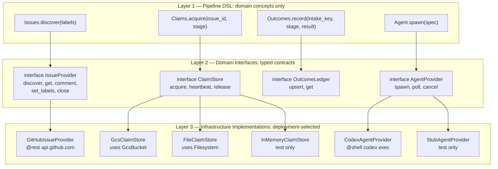
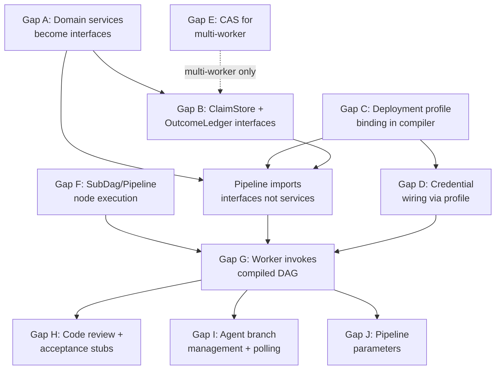

# SDLC Pipeline E2E Gap Analysis

Status: Draft — Revised for dry-run readiness
Date: 2026-02-21
Parent: [mega-modeling-design.md](mega-modeling-design.md) (MD0-D)
Scope: Delta between the mega modeling design and current implementation for end-to-end pipeline execution, with specific focus on gaps blocking a local dry-run deployment.

## 1. Architectural Principle

The mega modeling design (Section 2.1.3, Section 5) establishes:

1. **Orchestration logic lives in DSL only** (Section 3, row 1).
2. **State authorities are externalized** (Section 2.1, principle 2): claim store, outcome ledger, signal store.
3. **Adapters are generic** (Section 5.1): lease/claim store adapter, outcome ledger adapter.
4. **Deployment split is a transport concern** (Section 2.1.3, rule 3): DSL semantics unchanged across local/cloud.

### 1.1 Three-Layer Abstraction

The pipeline operates at three distinct abstraction layers. Business logic never sees infrastructure.



**Layer 1 (Pipeline)**: Pure domain operations. The pipeline says "I have an issue" and "I need a claim." It never mentions `ObjectStorage`, `GcsBucket`, `Filesystem`, `@rest`, or any transport.

**Layer 2 (Domain Interfaces)**: Typed contracts that define what operations exist on each domain concept (mega design Section 6.1: `try_acquire_claim`, `discover_ready_issues`, `upsert_comment`, `compare_and_set_stage`). These are the provider-fungible contracts from the mega modeling design.

**Layer 3 (Infrastructure)**: Concrete implementations selected by deployment profile. `GitHubIssueProvider` happens to use `@rest` against `api.github.com`. `GcsClaimStore` happens to use `GcsBucket` which implements `ObjectStorage`. `FileClaimStore` happens to use the `Filesystem` resource. These are implementation details.

The DSL infrastructure layer (`infra/core.dag`) already implements the Layer 3 pattern:
- `ObjectStorage`, `SecretStore`, `Compute`, `Queue`, `Identity` are abstract infrastructure interfaces.
- `GcsBucket implements ObjectStorage`, `ManagedSecret implements SecretStore`, etc.
- "Business logic writes `uses store: ObjectStorage(...)` and the provider is selected at compile time via environment config."

The gap is that Layer 2 (domain interfaces) and the compile-time profile binding mechanism do not exist yet.

### 1.2 Existing Domain Services vs Target Architecture

The DSL already has domain-level service definitions that are halfway to the target:

- `services/github/issues.dag` defines `Issues.List`, `Issues.Get`, `Issues.AddComment`, `Issues.SetLabels` -- these are domain operations.
- `services/agent/codex.dag` defines `Codex.Spawn`, `Codex.PollStatus` -- domain operations.
- `services/sdlc/control_plane.dag` defines `ControlPlane.AcquireStageClaim` -- domain operations.

The problem: these are concrete `service` definitions with hardcoded transport (`@rest` to a fixed `@endpoint`, `@shell` with specific commands). They should be abstract `interface` definitions where the transport is resolved by deployment profile. A test profile might satisfy `IssueProvider` with an in-memory stub; a production profile satisfies it with `GitHubIssueProvider`.

## 2. Resource Abstraction Model

### 2.1 Binding Resolution by Deployment Profile

The compiler resolves abstract interface bindings via deployment profile at compile time:

1. **Unit test** (`@hermetic`): All domain interfaces bind to in-memory/deterministic implementations. Clock is seeded from `run_id` (per `std/resources.dag`). No external I/O.
2. **Local dev** (`local-co-located`): `IssueProvider` binds to `GitHubIssueProvider` (real GitHub API). `ClaimStore`/`OutcomeLedger` bind to `FileClaimStore` (JSON files in `$SDLC_LEDGER_DIR`). Single-process.
3. **Cloud Run dev** (`stateless-fleet` in `gunbai-auto`): `ClaimStore`/`OutcomeLedger` bind to `GcsClaimStore` (GCS with generation-based CAS). Credentials from Secret Manager via `credential_chain` pattern.
4. **Cloud Run prod** (`stateless-fleet` in `gunbai-prod`): Same as dev with stricter IAM and separate GCS buckets.

### 2.2 What Exists vs What Is Missing

| Component | Designed | Layer 2 Interface | Layer 3 Impl | Profile Binding |
|-----------|----------|-------------------|--------------|-----------------|
| Issue operations | Mega design 6.1 | **Missing** (concrete `service` only) | GitHub `@rest` exists | **Missing** |
| Claim operations | Mega design 6.1 | **Missing** (concrete `service` only) | Rust only (`sdlc/claims.rs`) | **Missing** |
| Outcome operations | Mega design 6.1 | **Missing** (concrete `service` only) | Rust only (`sdlc/state.rs`) | **Missing** |
| Agent operations | Mega design implied | **Missing** (concrete `service` only) | `@shell` exists | **Missing** |
| ObjectStorage | `infra/core.dag` | Yes (infra-level) | GCS, S3, Azure | **Missing** |
| SecretStore | `infra/core.dag` | Yes (infra-level) | GCP `ManagedSecret` | **Missing** |
| Clock resource | `std/resources.dag` | Yes | Runtime clock | Yes (`@hermetic`) |
| Filesystem resource | `std/resources.dag` | Yes | File I/O | Yes (auto-wired) |

## 3. Gap Catalog

### Gap A: Domain Services Are Concrete Instead of Abstract Interfaces

**Current state**: `services/github/issues.dag`, `services/sdlc/control_plane.dag`, and `services/agent/codex.dag` are concrete `service` definitions with hardcoded transports (`@rest` to a fixed `@endpoint`, `@shell` with specific commands). The pipeline directly calls these concrete services.

**Target state**: The mega modeling design Section 6.1 specifies domain operations (`try_acquire_claim`, `discover_ready_issues`, `upsert_comment`, etc.) as provider-fungible contracts. These should be `interface` definitions (Layer 2) that can be satisfied by different implementations (Layer 3) depending on the deployment profile.

Example of the target architecture for issues:

```
// Layer 2: domain interface (pipeline sees this)
interface IssueProvider {
  capability discover(labels: List<String>) -> { issues: List<Issue> }
    @contract: discover([]) => issues is List
  capability get(id: NonEmptyStr) -> { issue: Issue, found: Bool }
    @idempotent @readonly
  capability comment(id: NonEmptyStr, body: String) -> { ok: Bool }
    @idempotent
  capability set_labels(id: NonEmptyStr, labels: List<String>) -> { ok: Bool }
  capability close(id: NonEmptyStr) -> { ok: Bool }
}

// Layer 3: concrete implementation (deployment profile selects this)
resource GitHubIssueProvider implements IssueProvider {
  config { owner: String, repo: String }
  // capabilities map to @rest calls against api.github.com
}

resource StubIssueProvider implements IssueProvider {
  // in-memory, for unit tests
}
```

The existing `service github.Issues` becomes the implementation body of `GitHubIssueProvider`. The pipeline imports `IssueProvider`, not `github.Issues`.

**What changes**:
- Promote each domain service to an `interface`.
- Move existing concrete `service` definitions into `resource ... implements ...` blocks.
- Pipeline imports domain interfaces, not concrete services.

**Severity**: Critical. This is the foundation for compile-time DI and testability.
**Dry-run impact**: Blocks switching between real GitHub and stub/mock providers. For a dry-run that only uses the Rust worker path (not compiled DAG execution), this can be deferred — the Rust worker already has its own `IssueTransport` trait. For compiled DAG execution, this blocks.

### Gap B: No Domain Interfaces for SDLC State (Claims, Outcomes)

**Current state**: `services/sdlc/control_plane.dag` defines claim/outcome operations as a `service` with `@rest` transport against `http://127.0.0.1:8787`. No server exists behind this endpoint. The actual logic is in hand-written Rust (`sdlc/claims.rs`, `sdlc/state.rs`).

**Target state**: Claims and outcomes are domain interfaces (per mega design Section 6.1):

```
// Layer 2: domain interface
interface ClaimStore {
  capability acquire(issue_id: NonEmptyStr, stage: NonEmptyStr, owner: NonEmptyStr, lease_ttl_ms: Int)
    -> { acquired: Bool, conflict: Bool, lease_generation: Int }
    @contract: acquire(i, s, o, t) => acquired xor conflict

  capability heartbeat(issue_id: NonEmptyStr, stage: NonEmptyStr, owner: NonEmptyStr, generation: Int)
    -> { accepted: Bool }
    @idempotent

  capability release(issue_id: NonEmptyStr, stage: NonEmptyStr, owner: NonEmptyStr, generation: Int)
    -> { released: Bool }
    @idempotent
}

interface OutcomeLedger {
  capability upsert(intake_key: NonEmptyStr, stage: NonEmptyStr, outcome: Json)
    -> { updated: Bool, previous: Json? }
    @idempotent

  capability get(intake_key: NonEmptyStr, stage: NonEmptyStr)
    -> { found: Bool, outcome: Json? }
    @idempotent @readonly
}
```

Layer 3 implementations:
- `FileClaimStore` uses `Filesystem` resource + `Clock` for lease expiry (local dev).
- `GcsClaimStore` uses `GcsBucket` with generation-based conditional writes (Cloud Run).
- `InMemoryClaimStore` for unit tests.

The CAS semantics (owner verification, lease expiry, generation tracking) live in the implementation, not the interface. The pipeline just says `Claims.acquire(...)` and gets back `acquired: Bool`.

**What changes**:
- Replace `service sdlc.ControlPlane` with `interface ClaimStore` + `interface OutcomeLedger`.
- Implement `FileClaimStore`, `GcsClaimStore`, `InMemoryClaimStore`.
- No HTTP server needed. No REST transport for control plane.

**Severity**: Critical. Without this, the pipeline cannot manage claims (no server behind the REST endpoint).
**Dry-run impact**: The Rust worker already has working file-based claim and outcome ledgers (`ClaimLedger`, `RunStateLedger` in `sdlc.rs`). The DSL `ControlPlane` service cannot execute because there is no server at `http://127.0.0.1:8787`. For the Rust worker path, this is already solved. For the compiled DAG path, this blocks entirely.

### Gap C: No Deployment Profile Binding in Compiler

**Current state**: `infra/core.dag` comments say "the provider is selected at compile time via environment config" but the compiler does not implement this. There is no mechanism to declare which concrete implementation satisfies an abstract interface for a given deployment.

**Target state**: Deployment profiles are DSL-declared, binding domain interfaces to concrete implementations:

```
profile unit_test {
  bind IssueProvider -> StubIssueProvider
  bind ClaimStore -> InMemoryClaimStore
  bind OutcomeLedger -> InMemoryOutcomeLedger
  bind AgentProvider -> StubAgentProvider
}

profile local {
  bind IssueProvider -> GitHubIssueProvider { owner: "gunb-ai", repo: "gunbc" }
  bind ClaimStore -> FileClaimStore { dir: env("SDLC_LEDGER_DIR", "target/sdlc") }
  bind OutcomeLedger -> FileOutcomeLedger { dir: env("SDLC_LEDGER_DIR", "target/sdlc") }
  bind AgentProvider -> CodexAgentProvider
}

profile cloud_run {
  bind IssueProvider -> GitHubIssueProvider { owner: "gunb-ai", repo: "gunbc" }
  bind ClaimStore -> GcsClaimStore { bucket: "gunbai-auto-sdlc-claims", project: "gunbai-auto" }
  bind OutcomeLedger -> GcsOutcomeLedger { bucket: "gunbai-auto-sdlc-outcomes", project: "gunbai-auto" }
  bind AgentProvider -> CodexAgentProvider
}
```

During compilation, `daglang compile --profile local` resolves every `uses` declaration to the profile's binding, generating the appropriate transport code for that concrete implementation.

**What changes**:
- Parser: add `profile` declaration and `bind` statement syntax.
- Lowering: when encountering `uses issues: IssueProvider`, look up the active profile's binding and lower to the concrete resource's transport code.
- CLI: add `--profile` flag to `daglang compile`.

**Severity**: Critical. This is the compile-time DI mechanism. Without it, abstract interfaces cannot be resolved to concrete implementations.
**Dry-run impact**: Only blocks the compiled DAG execution path. The Rust worker path does not use compile-time profiles.

### Gap D: Credential Wiring via Profile

**Current state**: GitHub services declare `@auth(BearerToken)` but no credential intent mapping exists for `github.*`. Codex uses `@shell` with no env-var injection. The `credential_chain` pattern in `std/patterns.dag` covers GCP auth but not GitHub/Codex.

**Target state**: Credentials are part of the deployment profile:

```
profile local {
  bind IssueProvider -> GitHubIssueProvider {
    credential: env("GITHUB_TOKEN")  // direct env var
  }
  bind AgentProvider -> CodexAgentProvider {
    credential: env("CODEX_API_KEY")
  }
}

profile cloud_run {
  bind IssueProvider -> GitHubIssueProvider {
    credential: secret("github-token", project: "gunbai-auto")  // Secret Manager
  }
  bind AgentProvider -> CodexAgentProvider {
    credential: secret("codex-api-key", project: "gunbai-auto")
  }
}
```

The credential resolution is part of the concrete implementation's configuration, not something the pipeline knows about. `GitHubIssueProvider` internally uses `credential_chain` to acquire the token; the profile just tells it where to find the secret.

**Severity**: High. Blocks any real external API calls.
**Dry-run impact**: Blocks GitHub API calls from both paths. However, the Rust worker currently uses `StubIssueTransport` which makes no API calls, so a stub dry-run works without credentials. A dry-run with real GitHub requires `GITHUB_TOKEN` in the environment and a real `IssueTransport` implementation in the Rust worker.

### Gap E: No CAS for Multi-Worker Claim Safety

**Current state**: `ObjectStorage` has `read`, `write`, `delete`, `list`. No conditional write (compare-and-swap).

**Target state**: The `ClaimStore` implementations for multi-worker deployments (GCS) use provider-specific CAS:
- GCS: `x-goog-if-generation-match` header on write requests.
- File: OS-level file locking (single machine only).
- In-memory: version counter.

CAS stays in the implementation (Layer 3), not the interface (Layer 2). The `ClaimStore.acquire` contract guarantees `acquired xor conflict` regardless of how the implementation achieves it.

**Severity**: High for multi-worker. Not blocking for single-worker local dev.
**Dry-run impact**: Not blocking. Local dry-run is single-worker. The Rust file-based claim ledger already uses in-process CAS (generation counters in `ClaimLedger`).

### Gap F: SubDag / Pipeline Node Execution

**Current state**: `SubDag` nodes (from `for`/`if` lowering) and `Pipeline` nodes resolve to `UnsupportedOp` in `gunbc-dag/src/resolve.rs:559`. The DSL compiles control flow but the runtime cannot execute it.

Specific locations:
- `resolve.rs:559`: `NodeBody::SubDag(_) => Ok(DynOp::new(UnsupportedOp::new("subdag_pattern")))`
- `resolve.rs:567`: `LoweredOp::Pipeline { .. } => Ok(DynOp::new(UnsupportedOp::new(...)))`
- `resolve.rs:579`: `LoopUnpack | LoopPack | BranchMerge => Ok(DynOp::new(UnsupportedOp::new("pattern_internal")))`

**Target state**: `SubDag` nodes are resolved recursively (resolve inner DAG, execute it as a nested DAG). `Pipeline` nodes are resolved as ordered stage sequences. Loop and branch internal nodes execute their respective semantics.

**Severity**: Critical. Without this, compiled DSL with `for`/`if`/`pipeline` cannot run.
**Dry-run impact**: Blocks the compiled DAG execution path entirely. The `sdlc_worker.dag` uses `for issue in issues_response.issues { ... }` and `if claim.acquired { ... }`, both of which compile to SubDag nodes. The `sdlc.dag` pipeline uses `pipeline { stage ... }` which compiles to a Pipeline node. All three are UnsupportedOp.

### Gap G: Worker Does Not Invoke Compiled DAG

**Current state**: `gunbc-dag/src/bin/sdlc.rs` manages ledgers but the `run_worker` function calls `execute_stage_idea_to_design()` which is a minimal stub (`sdlc.rs:2494-2506`). The stub posts a static "Generated design prompt" comment via `StubIssueTransport` (which is itself a no-op) and transitions the label from Idea to Design. No other stage handler exists — all intake records, regardless of their current stage, go through this single handler.

**Specific problems**:
1. Only idea→design transition is handled. Records at design, design-review, accepted, implementing, code-review, or testing stages are "executed" but nothing meaningful happens.
2. `StubIssueTransport` (`sdlc.rs:2483-2491`) is a no-op: `upsert_comment` returns `Ok(())` without posting anything, `compare_and_set_stage_label` returns `Ok(true)` without touching GitHub.
3. No LLM calls occur. The design prompt is computed during intake but never sent to an LLM.
4. The compiled `dsl/pipelines/sdlc.dag` is never loaded or executed.

**Target state**: The worker loads the compiled `dsl/pipelines/sdlc.dag` artifact, resolves it, and calls `execute_dag()` with inputs derived from worker context (owner, repo, run_key, credentials).

**Interim target for dry-run**: Before full DAG execution is ready (Gaps A-C, F), the Rust worker needs stage-based dispatch with real handlers for each transition. Sprint 11 delivered the dispatch infrastructure (`S11-1` through `S11-4`), but the worker's `run_worker` function does not use it — it still calls `execute_stage_idea_to_design` unconditionally.

**Severity**: Critical. The pipeline is compiled but never invoked, and the Rust fallback only handles one stage.
**Dry-run impact**: Blocking. Without stage-based dispatch, the worker cannot progress issues past the idea→design transition. A dry-run deployment will intake the issue, acquire a claim, mark it "completed" (even though nothing happened), and stop.

### Gap H: Code Review and Acceptance Testing Stages Are Stubs

**Current state**: Two versions of the pipeline exist with different stub implementations:
- `dsl/pipelines/sdlc.dag` (compiled pipeline): stages `code_review` and `acceptance` post static comments ("Code review completed.", "Acceptance tests completed.") with no actual logic. No PR diff retrieval, no LLM analysis, no CI execution.
- `docs/design/sdlc/sdlc.dag` (design-version pipeline): references `inline_review()`, `get_pr_diff()`, and `ci()` which are more realistic but `get_pr_diff()` and `generate_implementation_plan()` are undefined functions.

**Target state**:
- `code_review`: Call `PullRequest.ListFiles` + `PullRequest.Get` to retrieve diff, send to LLM review service, post findings as PR comment.
- `acceptance`: Call `shell.Cargo.Test` + `shell.Cargo.Clippy` on PR branch (or trigger CI via GitHub Actions API).

Both should be DSL `func`s that compose existing service operations.

**Severity**: High. Blocks the full scenario end-to-end.
**Dry-run impact**: Partially blocking. A dry-run can bypass these stages with stub responses, but the scenario (`TODO/scenario_sdlc.md`) explicitly requires real code review and CI validation. For a minimal dry-run proving the stage progression works, stubs are acceptable; for an E2E scenario dry-run, this blocks.

### Gap I: Agent Branch Management and Polling

**Current state**:
- `run_agent_spawn` (`sdlc.rs:1375`) creates a `HandoffSpec` with a `target_branch` but uses `StubAgentAdapter` which does not actually create a git branch, run an agent, or push code.
- No git branch is created before `Codex.Spawn` in the DSL pipeline.
- `agent_ledger` is written but never read back during the worker loop — no polling of in-flight agent runs occurs.
- The `validate-pr` command (`sdlc.rs`) exists but is separate from the worker loop.

**Target state**:
- Before `Codex.Spawn`, create a deterministic branch (`sdlc/issue-{number}`) via `shell.Git` service.
- After agent completion, push the branch and create the PR.
- The worker sweep checks `agent_ledger` for in-flight runs and polls their status.

**Severity**: High. Blocks the agent implementation loop.
**Dry-run impact**: Partially blocking. A dry-run with `StubAgentAdapter` can progress through the accepted→implementing transition without a real agent. But the worker will not poll or advance the issue past implementing, so the stage chain stops there.

### Gap J: Pipeline Parameters Are Hardcoded

**Current state**: Two divergent pipelines with different parameterization:
- `dsl/pipelines/sdlc.dag` (compiled): Uses `fn default_repo_owner() -> String { "gunb-ai" }` and similar `fn` helpers. No `param` declarations. The Rust binary accepts `--issue-id`, `--intake-key` but these values never reach the DSL pipeline.
- `docs/design/sdlc/sdlc.dag` (design version): Uses `param repo_owner: String` declarations, which is the correct target. But this file is in `docs/design/` and is not the compiled version.

**Target state**: Pipeline inputs are bound from the deployment profile or passed as DAG inputs at execution time. The compiled DAG accepts `owner`, `repo`, `run_key` as top-level inputs.

**Severity**: Medium. Limits the pipeline to one hardcoded repo.
**Dry-run impact**: Low for a single-repo dry-run against `gunb-ai/gunbc`. Blocks multi-repo usage.

## 4. Dependency Graph



Critical path: **A -> B -> C -> G** (with F as a parallel prerequisite for G).

## 5. GCP Resource Requirements (Cloud Run Profile)

These are Layer 3 resources that the `cloud_run` deployment profile binds to domain interfaces:

| Domain Interface | GCP Resource | Service | Project |
|-----------------|-------------|---------|---------|
| `ClaimStore` | `gunbai-auto-sdlc-claims` | GCS | `gunbai-auto` |
| `OutcomeLedger` | `gunbai-auto-sdlc-outcomes` | GCS | `gunbai-auto` |
| `IssueProvider` credential | `github-token` | Secret Manager | `gunbai-auto` |
| `AgentProvider` credential | `codex-api-key` | Secret Manager | `gunbai-auto` |
| LLM credential | `anthropic-api-key` | Secret Manager | `gunbai-auto` |
| Worker compute | `gunbc-sdlc-worker` | Cloud Run | `gunbai-auto` |
| Worker identity | `gunbc-sdlc-worker@` | IAM | `gunbai-auto` |
| Scheduler identity | `gunbc-sdlc-scheduler@` | IAM | `gunbai-auto` |
| Cron trigger | `gunbc-sdlc-trigger` | Cloud Scheduler | `gunbai-auto` |
| Container images | `gunbc` | Artifact Registry | `gunbai-auto` |

The `local` profile uses none of these GCP resources. It binds `ClaimStore` -> local files, `OutcomeLedger` -> local files, credentials -> env vars.

## 6. Implementation Priority

**Phase 1 -- Domain interface layer (Gaps A, B)**:
Promote existing concrete `service` definitions to `interface` + `resource implements` pairs. Define `IssueProvider`, `ClaimStore`, `OutcomeLedger`, `AgentProvider` interfaces. Move `github.Issues` into `GitHubIssueProvider implements IssueProvider`. Write `FileClaimStore`, `FileOutcomeLedger` implementations. Pipeline imports interfaces.

**Phase 2 -- Compile-time profile binding (Gap C, D)**:
Add `profile` declaration and `bind` syntax to the parser. Implement profile resolution during lowering. Add `--profile` flag to `daglang compile`. Wire credential resolution through profiles.

**Phase 3 -- Runtime execution (Gaps F, G)**:
Make SubDag/Pipeline nodes executable (replace `UnsupportedOp`). Wire the worker to load and execute compiled DAGs.

**Phase 4 -- Stage completion (Gaps H, I, J)**:
Fill in stub stages (code review, acceptance). Wire agent branch management and polling. Make pipeline parameters injectable from profile.

**Phase 5 -- Multi-worker safety (Gap E)**:
Implement `GcsClaimStore` with generation-based CAS for the `cloud_run` profile. Not needed for single-worker local dev.

## 7. Dry-Run Deployment Readiness

### 7.1 Definition of Dry-Run Deployment

A successful local dry-run deployment means:

1. `gunbc-sdlc intake --intent <path>` creates a ledger entry with computed run_key and provisional artifact.
2. `gunbc-sdlc worker` discovers the intake, acquires a claim, executes stage logic, advances the issue through at least idea → design → design-review → accepted, records outcomes, and releases the claim.
3. `gunbc-sdlc agent-spawn --intake-key <key>` creates a HandoffSpec and dispatches to an agent (or stub).
4. The worker's execution report is machine-readable, includes per-intake metrics, and correctly reflects what happened.
5. Re-running the worker is idempotent: replay-skip fires for already-completed run_keys.

The dry-run does NOT require:
- Real GitHub API calls (stub transport is acceptable).
- Real LLM calls (stub/mock responses are acceptable).
- Multi-worker safety (single-process).
- Cloud Run deployment or GCS backends.
- The compiled DSL pipeline to execute (Rust worker path is sufficient).

### 7.2 The Dual-Execution-Path Problem

The SDLC system currently has two parallel execution paths that implement overlapping logic differently:

**Path 1: Rust Worker (`gunbc-dag/src/bin/sdlc.rs`)**
- Manages ledgers (intake, claim, artifact, run_state, agent).
- Implements claim acquisition, heartbeat, release, reconciliation, drain, replay-skip.
- Implements stage execution via `execute_stage_idea_to_design()` (one stage only).
- Uses `IssueTransport` trait with `StubIssueTransport` (no-op).
- Does NOT load or execute the compiled DSL pipeline.

**Path 2: Compiled DSL Pipeline (`dsl/pipelines/sdlc.dag`)**
- Defines the full stage chain: fetch → design → design_review → accept → plan → code_review → acceptance → close → report.
- Calls concrete services (`Issues.Get`, `Issues.AddComment`, `ControlPlane.AcquireStageClaim`, `Codex.Spawn`).
- Cannot execute: SubDag/Pipeline nodes resolve to `UnsupportedOp`; control plane service has no server.
- Has hermetic tests with mock responses.

**The problem**: These two paths are diverging. The Rust worker has correct claim/ledger/reconcile semantics but only handles one stage. The DSL pipeline has the full stage chain but cannot execute. Neither path alone can do a dry-run.

**Resolution strategy**: For the dry-run, extend the Rust worker path (Path 1) with multi-stage dispatch. This is the fastest path to a working dry-run because:
1. The Rust worker already has working ledger/claim/reconcile infrastructure.
2. Adding stage dispatch handlers is incremental (Sprint 11 delivered `S11-1` through `S11-4` with the dispatch framework and per-stage handlers in the Rust runtime).
3. The compiled DAG path requires Gaps A, B, C, F to be resolved first — substantially more work.

The DSL pipeline path (Path 2) remains the long-term target per the codegen-first policy (mega design Section 5.3). The Rust worker path is the bridge.

### 7.3 Gap-by-Gap Dry-Run Blocking Assessment

| Gap | Blocks Rust Worker Dry-Run? | Blocks Compiled DAG Dry-Run? | Minimum Fix for Dry-Run |
|-----|---------------------------|---------------------------|------------------------|
| **A** (Domain interfaces) | No — Rust has `IssueTransport` trait | Yes | None for dry-run |
| **B** (Claims/Outcomes interfaces) | No — Rust has file-based ledgers | Yes | None for dry-run |
| **C** (Profile binding) | No | Yes | None for dry-run |
| **D** (Credential wiring) | Partially — stub works, real needs `GITHUB_TOKEN` | Yes | Env-var fallback in `IssueTransport` |
| **E** (Multi-worker CAS) | No (single-worker) | No (single-worker) | None |
| **F** (SubDag/Pipeline execution) | No | **Yes — total blocker** | None for dry-run |
| **G** (Worker DAG invocation) | **Yes — partial blocker** | Yes | Stage dispatch in worker |
| **H** (Code review/acceptance stubs) | Partially — stubs acceptable | Partially | Stub handlers sufficient |
| **I** (Agent branch mgmt) | Partially — StubAdapter works | Partially | Stub acceptable |
| **J** (Hardcoded params) | No (single-repo) | No (single-repo) | None for dry-run |

### 7.4 Critical Blocker: Worker Stage Dispatch (Gap G Details)

The single blocker for a Rust-worker-path dry-run is that `run_worker` does not route by stage. Every ready-to-run intake record, regardless of its current stage, goes through `execute_stage_idea_to_design()`.

**What exists** (Sprint 11 deliverables, in the Rust runtime but not wired into `run_worker`):
- `execute_stage()` dispatch function that routes by `record.stage` (S11-1).
- `execute_stage_design_to_review()` (S11-2).
- `execute_stage_review_to_accepted()` (S11-3).
- `execute_stage_accepted_to_implementation()` (S11-4).

**What is missing**:
1. `run_worker` calls `execute_stage_idea_to_design()` directly instead of calling the `execute_stage()` dispatcher. The fix is to replace the direct call at `sdlc.rs:1062` with a call to the stage-routing dispatcher.
2. The stage handlers use `StubIssueTransport` which does nothing. For a dry-run that should show stage progression in the ledger, this is acceptable (the ledger records the transition). For a dry-run that should actually post GitHub comments, a real `GitHubIssueTransport` implementation is needed (Gap D dependency).
3. After stage execution, the worker advances `record.stage` in the intake ledger but only for idea→design. The other stage handlers need to update `record.stage` appropriately.
4. Multiple worker passes are needed to progress an issue through all stages (each pass handles one stage transition). The worker loop processes each intake record once per invocation. To go idea→done, you need multiple `gunbc-sdlc worker` invocations (or a loop within a single invocation).

### 7.5 Divergent Pipeline Definitions

Two files define the SDLC pipeline with different semantics:

| Aspect | `dsl/pipelines/sdlc.dag` | `docs/design/sdlc/sdlc.dag` |
|--------|--------------------------|------------------------------|
| Parameters | `fn default_*()` helpers (hardcoded) | `param` declarations (injectable) |
| Claim management | `ControlPlane.AcquireStageClaim` per pipeline run | Not present (design expects worker handles it) |
| `code_review` stage | Static comment stub | Calls `inline_review()` + `get_pr_diff()` |
| `acceptance` stage | Static comment stub | Calls `ci()` pipeline |
| `plan_implementation` | Static comment with design content | Calls `generate_implementation_plan()` (undefined) |
| `generate_implementation_plan` | Not referenced | Referenced but undefined |
| Test coverage | Hermetic test with mock responses | Hermetic test with mock responses |

**Resolution**: The design-version (`docs/design/sdlc/sdlc.dag`) represents the target architecture. The compiled version (`dsl/pipelines/sdlc.dag`) needs to be updated to match the design version's `param` declarations and service calls. The undefined `generate_implementation_plan` and `get_pr_diff` functions need to be implemented or stubbed.

### 7.6 Observability Gaps

For a dry-run deployment to be useful, you need to see what happened. Current state:

| Observable | Status | Detail |
|-----------|--------|--------|
| Execution report JSON | **Works** | Worker emits structured JSON with intake counts, claim outcomes, replay-skip, terminal failures, metrics. |
| Per-intake stage tracking | **Partial** | Intake ledger records current stage and timestamps, but only idea→design transitions occur. |
| Claim audit trail | **Works** | Claim ledger records owner, generation, expiry for each `(issue_id, stage)` slot. |
| Artifact lineage | **Works** | Artifact ledger tracks provisional→canonical promotion with content hashes and timestamps. |
| Agent dispatch tracking | **Works** | Agent ledger records HandoffSpec, session_id, status per intake key. |
| Stage duration metrics | **Partial** | Report includes `stage_duration_ms` per intake key, but measures time-in-stage, not execution time (no stage execution occurs). |
| Error diagnostics | **Works** | Terminal failures include error messages. Retry state includes `last_error`, `attempts`, `next_retry_at_epoch_ms`. |
| GitHub activity | **Missing** | `StubIssueTransport` produces no observable output. No comments posted, no labels changed. |
| LLM interaction | **Missing** | No LLM calls made. Design prompt is computed but never sent. |

### 7.7 Test Coverage Assessment

| Component | Unit Tests | Scenario Tests | Gap |
|-----------|-----------|---------------|-----|
| Intake ledger operations | Yes (`sdlc_cli.rs`) | Yes | — |
| Claim acquire/heartbeat/release | Yes (`sdlc_cli.rs`) | Yes | — |
| Replay-skip logic | Yes | Yes | — |
| Reconciliation | Yes | Yes | — |
| Drain semantics | Yes | Yes | — |
| Artifact provisional→canonical | Yes | Yes | — |
| AwaitApproval yield/resume | Yes | Yes | — |
| Stage dispatch (idea→design) | Yes | Partial | Only one stage tested in worker integration |
| Stage dispatch (design→review→accepted) | Yes (S11-2, S11-3 unit tests exist) | **No** | Not wired into worker |
| Agent spawn (stub) | Yes | **No** | Not tested in worker loop |
| Agent polling | **No** | **No** | Not implemented |
| GitHub API integration (real) | **No** | **No** | No real transport implementation in worker |
| LLM integration (real) | **No** | **No** | No LLM calls from worker |
| DSL pipeline execution (compiled) | DSL hermetic tests pass | **No** | SubDag/Pipeline UnsupportedOp |
| Multi-stage worker progression | **No** | **No** | Worker only handles idea→design |

## 8. Concrete Unblocking Plan for Dry-Run

### 8.1 Minimum Viable Dry-Run (Rust Worker Path)

These changes enable a local dry-run where the worker progresses issues through all stages using stub transports:

**Step 1: Wire stage dispatch into run_worker** (Gap G fix)

Replace the direct `execute_stage_idea_to_design()` call in `run_worker` with the `execute_stage()` dispatcher from Sprint 11. The dispatcher routes by `record.stage` to the appropriate handler.

Location: `gunbc-dag/src/bin/sdlc.rs:1061-1062`
```rust
// Current:
let transport = StubIssueTransport;
if let Err(e) = execute_stage_idea_to_design(intake_key, record, &transport) {

// Target:
let transport = StubIssueTransport;
if let Err(e) = execute_stage(intake_key, record, &transport) {
```

**Step 2: Ensure stage handlers advance ledger stage**

Each stage handler must update `record.stage` to the next stage after successful execution. Verify that:
- `execute_stage_idea_to_design` sets `record.stage = Design`
- `execute_stage_design_to_review` sets `record.stage = DesignReview`
- `execute_stage_review_to_accepted` sets `record.stage = Accepted`
- `execute_stage_accepted_to_implementation` sets `record.stage = Implementation`

**Step 3: Add remaining stage handlers**

The Sprint 11 handlers cover idea→design→review→accepted→implementation. The remaining stages need stub handlers:
- `execute_stage_implementation_to_code_review` (implementing → code-review)
- `execute_stage_code_review_to_testing` (code-review → testing)
- `execute_stage_testing_to_done` (testing → done)
- `execute_stage_done` (terminalize, close issue)

These can be stubs for the dry-run: update the stage label, record the outcome, advance.

**Step 4: Add worker loop iteration**

Currently the worker processes each intake record once per invocation. For a complete dry-run of the full stage chain, either:
- (a) Run `gunbc-sdlc worker` multiple times (once per stage transition), or
- (b) Add a `--loop` or `--until-stable` flag that re-scans until no more progress is made.

Option (a) is simpler and sufficient for a dry-run validation.

**Step 5: Integration test for multi-stage progression**

Add a test that:
1. Creates an intake via `gunbc-sdlc intake --intent <path>`.
2. Runs the worker 8 times (one per stage transition).
3. Verifies the intake record reaches `stage: done` and `terminalized: true`.
4. Verifies the execution report includes all stages in the `executed_runs` list.

### 8.2 Enhanced Dry-Run (Real GitHub Transport)

After the minimum viable dry-run, add real GitHub interaction:

**Step 6: Implement `GitHubIssueTransport`**

Create a real `IssueTransport` implementation that calls the GitHub API:
```rust
struct GitHubIssueTransport {
    token: String,
    owner: String,
    repo: String,
}

impl IssueTransport for GitHubIssueTransport {
    fn upsert_comment(&self, issue_id: u64, marker: &str, body: &str) -> Result<(), String> {
        // POST /repos/{owner}/{repo}/issues/{issue_id}/comments
        // Uses self.token for Bearer auth
    }
    fn compare_and_set_stage_label(&self, issue_id: u64, from: Stage, to: Stage) -> Result<bool, String> {
        // PUT /repos/{owner}/{repo}/issues/{issue_id}/labels
        // CAS: verify current labels include `from`, then replace with `to`
    }
}
```

**Step 7: Select transport by environment**

```rust
let transport: Box<dyn IssueTransport> = if dry_run {
    Box::new(StubIssueTransport)
} else if let Ok(token) = std::env::var("GITHUB_TOKEN") {
    Box::new(GitHubIssueTransport::new(token, owner, repo))
} else {
    Box::new(StubIssueTransport)
};
```

### 8.3 Dependency Ordering for Full E2E

For the full compiled-DAG path (long-term target, not needed for dry-run):

```
Phase 1: S12-1..S12-5 (domain interfaces)      ──┐
Phase 2: S12-6..S12-9 (profile binding)          ├─► Phase 3: S12-10..S12-12 (runtime execution)
Gap F:   SubDag/Pipeline node resolution        ──┘         │
                                                             ▼
                                                    Phase 4: S12-13..S12-17 (stage completion)
```

Phase 1 and Gap F can proceed in parallel. Phase 2 depends on Phase 1 for interface definitions. Phase 3 depends on all three.

## 9. Risk Register

| Risk | Impact | Likelihood | Mitigation |
|------|--------|-----------|------------|
| Rust worker diverges further from DSL pipeline semantics | Medium — two paths implementing different stage logic | High if dry-run work extends the Rust path | Treat Rust worker as scaffolding only. Do not add SDLC sequencing logic to Rust beyond what's needed for dry-run. Track divergence explicitly. |
| StubIssueTransport hides real failures | Medium — dry-run passes but real deployment fails | High | Step 6/7 (real GitHub transport) should follow immediately after minimum viable dry-run. |
| Worker single-pass design requires multiple invocations | Low — acceptable for dry-run | Certain | Document the multi-invocation requirement. Add `--until-stable` flag if this becomes a friction point. |
| Sprint 11 stage handlers are not wired into worker | Medium — the code exists but isn't connected | Already happening | Step 1 directly addresses this. |
| Two divergent pipeline definitions cause confusion | Medium — developers don't know which is authoritative | Already happening | Resolve by updating `dsl/pipelines/sdlc.dag` to use `param` declarations and match the design version. Delete or mark the design version as superseded. |
| Compiled DAG path has deep dependency chain (Gaps A→B→C→F→G) | High — blocks the codegen-first target | High | Accept that dry-run uses Rust path. Plan compiled DAG path as Sprint 12 with clear phase gates. |
