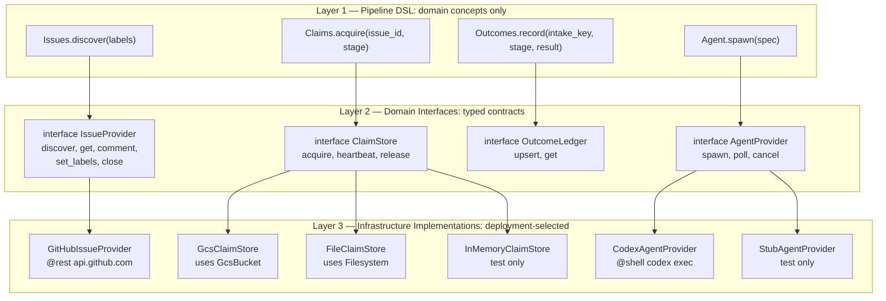
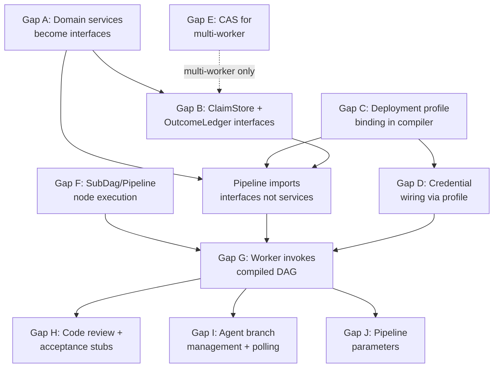

# SDLC Pipeline E2E Gap Analysis

Status: Draft
Date: 2026-02-21
Parent: [mega-modeling-design.md](mega-modeling-design.md) (MD0-D)
Scope: Delta between the mega modeling design and current implementation for end-to-end pipeline execution.

## 1. Architectural Principle

The mega modeling design (Section 2.1.3, Section 5) establishes:

1. **Orchestration logic lives in DSL only** (Section 3, row 1).
2. **State authorities are externalized** (Section 2.1, principle 2): claim store, outcome ledger, signal store.
3. **Adapters are generic** (Section 5.1): lease/claim store adapter, outcome ledger adapter.
4. **Deployment split is a transport concern** (Section 2.1.3, rule 3): DSL semantics unchanged across local/cloud.

### 1.1 Three-Layer Abstraction

The pipeline operates at three distinct abstraction layers. Business logic never sees infrastructure.



**Layer 1 (Pipeline)**: Pure domain operations. The pipeline says "I have an issue" and "I need a claim." It never mentions `ObjectStorage`, `GcsBucket`, `Filesystem`, `@rest`, or any transport.

**Layer 2 (Domain Interfaces)**: Typed contracts that define what operations exist on each domain concept (mega design Section 6.1: `try_acquire_claim`, `discover_ready_issues`, `upsert_comment`, `compare_and_set_stage`). These are the provider-fungible contracts from the mega modeling design.

**Layer 3 (Infrastructure)**: Concrete implementations selected by deployment profile. `GitHubIssueProvider` happens to use `@rest` against `api.github.com`. `GcsClaimStore` happens to use `GcsBucket` which implements `ObjectStorage`. `FileClaimStore` happens to use the `Filesystem` resource. These are implementation details.

The DSL infrastructure layer (`infra/core.dag`) already implements the Layer 3 pattern:
- `ObjectStorage`, `SecretStore`, `Compute`, `Queue`, `Identity` are abstract infrastructure interfaces.
- `GcsBucket implements ObjectStorage`, `ManagedSecret implements SecretStore`, etc.
- "Business logic writes `uses store: ObjectStorage(...)` and the provider is selected at compile time via environment config."

The gap is that Layer 2 (domain interfaces) and the compile-time profile binding mechanism do not exist yet.

### 1.2 Existing Domain Services vs Target Architecture

The DSL already has domain-level service definitions that are halfway to the target:

- `services/github/issues.dag` defines `Issues.List`, `Issues.Get`, `Issues.AddComment`, `Issues.SetLabels` -- these are domain operations.
- `services/agent/codex.dag` defines `Codex.Spawn`, `Codex.PollStatus` -- domain operations.
- `services/sdlc/control_plane.dag` defines `ControlPlane.AcquireStageClaim` -- domain operations.

The problem: these are concrete `service` definitions with hardcoded transport (`@rest` to a fixed `@endpoint`, `@shell` with specific commands). They should be abstract `interface` definitions where the transport is resolved by deployment profile. A test profile might satisfy `IssueProvider` with an in-memory stub; a production profile satisfies it with `GitHubIssueProvider`.

## 2. Resource Abstraction Model

### 2.1 Binding Resolution by Deployment Profile

The compiler resolves abstract interface bindings via deployment profile at compile time:

1. **Unit test** (`@hermetic`): All domain interfaces bind to in-memory/deterministic implementations. Clock is seeded from `run_id` (per `std/resources.dag`). No external I/O.
2. **Local dev** (`local-co-located`): `IssueProvider` binds to `GitHubIssueProvider` (real GitHub API). `ClaimStore`/`OutcomeLedger` bind to `FileClaimStore` (JSON files in `$SDLC_LEDGER_DIR`). Single-process.
3. **Cloud Run dev** (`stateless-fleet` in `gunbai-auto`): `ClaimStore`/`OutcomeLedger` bind to `GcsClaimStore` (GCS with generation-based CAS). Credentials from Secret Manager via `credential_chain` pattern.
4. **Cloud Run prod** (`stateless-fleet` in `gunbai-prod`): Same as dev with stricter IAM and separate GCS buckets.

### 2.2 What Exists vs What Is Missing

| Component | Designed | Layer 2 Interface | Layer 3 Impl | Profile Binding |
|-----------|----------|-------------------|--------------|-----------------|
| Issue operations | Mega design 6.1 | **Missing** (concrete `service` only) | GitHub `@rest` exists | **Missing** |
| Claim operations | Mega design 6.1 | **Missing** (concrete `service` only) | Rust only (`sdlc/claims.rs`) | **Missing** |
| Outcome operations | Mega design 6.1 | **Missing** (concrete `service` only) | Rust only (`sdlc/state.rs`) | **Missing** |
| Agent operations | Mega design implied | **Missing** (concrete `service` only) | `@shell` exists | **Missing** |
| ObjectStorage | `infra/core.dag` | Yes (infra-level) | GCS, S3, Azure | **Missing** |
| SecretStore | `infra/core.dag` | Yes (infra-level) | GCP `ManagedSecret` | **Missing** |
| Clock resource | `std/resources.dag` | Yes | Runtime clock | Yes (`@hermetic`) |
| Filesystem resource | `std/resources.dag` | Yes | File I/O | Yes (auto-wired) |

## 3. Gap Catalog

### Gap A: Domain Services Are Concrete Instead of Abstract Interfaces

**Current state**: `services/github/issues.dag`, `services/sdlc/control_plane.dag`, and `services/agent/codex.dag` are concrete `service` definitions with hardcoded transports (`@rest` to a fixed `@endpoint`, `@shell` with specific commands). The pipeline directly calls these concrete services.

**Target state**: The mega modeling design Section 6.1 specifies domain operations (`try_acquire_claim`, `discover_ready_issues`, `upsert_comment`, etc.) as provider-fungible contracts. These should be `interface` definitions (Layer 2) that can be satisfied by different implementations (Layer 3) depending on the deployment profile.

Example of the target architecture for issues:

```
// Layer 2: domain interface (pipeline sees this)
interface IssueProvider {
  capability discover(labels: List<String>) -> { issues: List<Issue> }
    @contract: discover([]) => issues is List
  capability get(id: NonEmptyStr) -> { issue: Issue, found: Bool }
    @idempotent @readonly
  capability comment(id: NonEmptyStr, body: String) -> { ok: Bool }
    @idempotent
  capability set_labels(id: NonEmptyStr, labels: List<String>) -> { ok: Bool }
  capability close(id: NonEmptyStr) -> { ok: Bool }
}

// Layer 3: concrete implementation (deployment profile selects this)
resource GitHubIssueProvider implements IssueProvider {
  config { owner: String, repo: String }
  // capabilities map to @rest calls against api.github.com
}

resource StubIssueProvider implements IssueProvider {
  // in-memory, for unit tests
}
```

The existing `service github.Issues` becomes the implementation body of `GitHubIssueProvider`. The pipeline imports `IssueProvider`, not `github.Issues`.

**What changes**:
- Promote each domain service to an `interface`.
- Move existing concrete `service` definitions into `resource ... implements ...` blocks.
- Pipeline imports domain interfaces, not concrete services.

**Severity**: Critical. This is the foundation for compile-time DI and testability.

### Gap B: No Domain Interfaces for SDLC State (Claims, Outcomes)

**Current state**: `services/sdlc/control_plane.dag` defines claim/outcome operations as a `service` with `@rest` transport against `http://127.0.0.1:8787`. No server exists behind this endpoint. The actual logic is in hand-written Rust (`sdlc/claims.rs`, `sdlc/state.rs`).

**Target state**: Claims and outcomes are domain interfaces (per mega design Section 6.1):

```
// Layer 2: domain interface
interface ClaimStore {
  capability acquire(issue_id: NonEmptyStr, stage: NonEmptyStr, owner: NonEmptyStr, lease_ttl_ms: Int)
    -> { acquired: Bool, conflict: Bool, lease_generation: Int }
    @contract: acquire(i, s, o, t) => acquired xor conflict

  capability heartbeat(issue_id: NonEmptyStr, stage: NonEmptyStr, owner: NonEmptyStr, generation: Int)
    -> { accepted: Bool }
    @idempotent

  capability release(issue_id: NonEmptyStr, stage: NonEmptyStr, owner: NonEmptyStr, generation: Int)
    -> { released: Bool }
    @idempotent
}

interface OutcomeLedger {
  capability upsert(intake_key: NonEmptyStr, stage: NonEmptyStr, outcome: Json)
    -> { updated: Bool, previous: Json? }
    @idempotent

  capability get(intake_key: NonEmptyStr, stage: NonEmptyStr)
    -> { found: Bool, outcome: Json? }
    @idempotent @readonly
}
```

Layer 3 implementations:
- `FileClaimStore` uses `Filesystem` resource + `Clock` for lease expiry (local dev).
- `GcsClaimStore` uses `GcsBucket` with generation-based conditional writes (Cloud Run).
- `InMemoryClaimStore` for unit tests.

The CAS semantics (owner verification, lease expiry, generation tracking) live in the implementation, not the interface. The pipeline just says `Claims.acquire(...)` and gets back `acquired: Bool`.

**What changes**:
- Replace `service sdlc.ControlPlane` with `interface ClaimStore` + `interface OutcomeLedger`.
- Implement `FileClaimStore`, `GcsClaimStore`, `InMemoryClaimStore`.
- No HTTP server needed. No REST transport for control plane.

**Severity**: Critical. Without this, the pipeline cannot manage claims (no server behind the REST endpoint).

### Gap C: No Deployment Profile Binding in Compiler

**Current state**: `infra/core.dag` comments say "the provider is selected at compile time via environment config" but the compiler does not implement this. There is no mechanism to declare which concrete implementation satisfies an abstract interface for a given deployment.

**Target state**: Deployment profiles are DSL-declared, binding domain interfaces to concrete implementations:

```
profile unit_test {
  bind IssueProvider -> StubIssueProvider
  bind ClaimStore -> InMemoryClaimStore
  bind OutcomeLedger -> InMemoryOutcomeLedger
  bind AgentProvider -> StubAgentProvider
}

profile local {
  bind IssueProvider -> GitHubIssueProvider { owner: "gunb-ai", repo: "gunbc" }
  bind ClaimStore -> FileClaimStore { dir: env("SDLC_LEDGER_DIR", "target/sdlc") }
  bind OutcomeLedger -> FileOutcomeLedger { dir: env("SDLC_LEDGER_DIR", "target/sdlc") }
  bind AgentProvider -> CodexAgentProvider
}

profile cloud_run {
  bind IssueProvider -> GitHubIssueProvider { owner: "gunb-ai", repo: "gunbc" }
  bind ClaimStore -> GcsClaimStore { bucket: "gunbai-auto-sdlc-claims", project: "gunbai-auto" }
  bind OutcomeLedger -> GcsOutcomeLedger { bucket: "gunbai-auto-sdlc-outcomes", project: "gunbai-auto" }
  bind AgentProvider -> CodexAgentProvider
}
```

During compilation, `daglang compile --profile local` resolves every `uses` declaration to the profile's binding, generating the appropriate transport code for that concrete implementation.

**What changes**:
- Parser: add `profile` declaration and `bind` statement syntax.
- Lowering: when encountering `uses issues: IssueProvider`, look up the active profile's binding and lower to the concrete resource's transport code.
- CLI: add `--profile` flag to `daglang compile`.

**Severity**: Critical. This is the compile-time DI mechanism. Without it, abstract interfaces cannot be resolved to concrete implementations.

### Gap D: Credential Wiring via Profile

**Current state**: GitHub services declare `@auth(BearerToken)` but no credential intent mapping exists for `github.*`. Codex uses `@shell` with no env-var injection. The `credential_chain` pattern in `std/patterns.dag` covers GCP auth but not GitHub/Codex.

**Target state**: Credentials are part of the deployment profile:

```
profile local {
  bind IssueProvider -> GitHubIssueProvider {
    credential: env("GITHUB_TOKEN")  // direct env var
  }
  bind AgentProvider -> CodexAgentProvider {
    credential: env("CODEX_API_KEY")
  }
}

profile cloud_run {
  bind IssueProvider -> GitHubIssueProvider {
    credential: secret("github-token", project: "gunbai-auto")  // Secret Manager
  }
  bind AgentProvider -> CodexAgentProvider {
    credential: secret("codex-api-key", project: "gunbai-auto")
  }
}
```

The credential resolution is part of the concrete implementation's configuration, not something the pipeline knows about. `GitHubIssueProvider` internally uses `credential_chain` to acquire the token; the profile just tells it where to find the secret.

**Severity**: High. Blocks any real external API calls.

### Gap E: No CAS for Multi-Worker Claim Safety

**Current state**: `ObjectStorage` has `read`, `write`, `delete`, `list`. No conditional write (compare-and-swap).

**Target state**: The `ClaimStore` implementations for multi-worker deployments (GCS) use provider-specific CAS:
- GCS: `x-goog-if-generation-match` header on write requests.
- File: OS-level file locking (single machine only).
- In-memory: version counter.

CAS stays in the implementation (Layer 3), not the interface (Layer 2). The `ClaimStore.acquire` contract guarantees `acquired xor conflict` regardless of how the implementation achieves it.

**Severity**: High for multi-worker. Not blocking for single-worker local dev.

### Gap F: SubDag / Pipeline Node Execution

**Current state**: `SubDag` nodes (from `for`/`if` lowering) and `Pipeline` nodes resolve to `UnsupportedOp` in `gunbc-dag/src/resolve.rs`. The DSL compiles control flow but the runtime cannot execute it.

**Target state**: `SubDag` nodes are resolved recursively (resolve inner DAG, execute it as a nested DAG). `Pipeline` nodes are resolved as ordered stage sequences.

**Severity**: Critical. Without this, compiled DSL with `for`/`if` cannot run.

### Gap G: Worker Does Not Invoke Compiled DAG

**Current state**: `gunbc-dag/src/bin/sdlc.rs` manages ledgers but the `run_worker` function just calls `mark_run_completed()` without executing any stage logic. The comment says "Stage execution is handled by the DSL-compiled pipeline" but no code loads or executes the compiled pipeline.

**Target state**: The worker loads the compiled `dsl/pipelines/sdlc.dag` artifact, resolves it, and calls `execute_dag()` with inputs derived from worker context (owner, repo, run_key, credentials).

**Note**: With Gaps A-D resolved, the worker becomes simpler: it just needs to load the compiled DAG and execute it. The DAG itself handles claim acquisition, stage execution, and outcome recording via abstract resource functions.

**Severity**: Critical. The pipeline is compiled but never invoked.

### Gap H: Code Review and Acceptance Testing Stages Are Stubs

**Current state**: `dsl/pipelines/sdlc.dag` stages `code_review` and `acceptance` post static comments. No actual code review (PR diff retrieval + LLM analysis) or CI execution (cargo test/clippy) occurs.

**Target state**:
- `code_review`: Call `PullRequest.ListFiles` + `PullRequest.Get` to retrieve diff, send to LLM review service, post findings as PR comment.
- `acceptance`: Call `shell.Cargo.Test` + `shell.Cargo.Clippy` on PR branch (or trigger CI via GitHub Actions API).

Both should be DSL `func`s that compose existing service operations.

**Severity**: High. Blocks the full scenario end-to-end.

### Gap I: Agent Branch Management and Polling

**Current state**:
- No git branch is created before `Codex.Spawn`.
- `handle_agent_completion` takes `branch_name` but nothing provides it.
- `check_agent_status` is defined but nothing invokes it.

**Target state**:
- Before `Codex.Spawn`, create a deterministic branch (`sdlc/issue-{number}`) via `shell.Git` service.
- After agent completion, push the branch and create the PR.
- The worker sweep checks `agent_ledger` for in-flight runs and polls their status.

**Severity**: High. Blocks the agent implementation loop.

### Gap J: Pipeline Parameters Are Hardcoded

**Current state**: `dsl/pipelines/sdlc.dag` uses `fn default_repo_owner() -> String { "gunb-ai" }`. The Rust binary accepts `--issue-id`, `--intake-key` but the DSL pipeline ignores them.

**Target state**: Pipeline inputs are bound from the deployment profile or passed as DAG inputs at execution time. The compiled DAG accepts `owner`, `repo`, `run_key` as top-level inputs.

**Severity**: Medium. Limits the pipeline to one hardcoded repo.

## 4. Dependency Graph



Critical path: **A -> B -> C -> G** (with F as a parallel prerequisite for G).

## 5. GCP Resource Requirements (Cloud Run Profile)

These are Layer 3 resources that the `cloud_run` deployment profile binds to domain interfaces:

| Domain Interface | GCP Resource | Service | Project |
|-----------------|-------------|---------|---------|
| `ClaimStore` | `gunbai-auto-sdlc-claims` | GCS | `gunbai-auto` |
| `OutcomeLedger` | `gunbai-auto-sdlc-outcomes` | GCS | `gunbai-auto` |
| `IssueProvider` credential | `github-token` | Secret Manager | `gunbai-auto` |
| `AgentProvider` credential | `codex-api-key` | Secret Manager | `gunbai-auto` |
| LLM credential | `anthropic-api-key` | Secret Manager | `gunbai-auto` |
| Worker compute | `gunbc-sdlc-worker` | Cloud Run | `gunbai-auto` |
| Worker identity | `gunbc-sdlc-worker@` | IAM | `gunbai-auto` |
| Scheduler identity | `gunbc-sdlc-scheduler@` | IAM | `gunbai-auto` |
| Cron trigger | `gunbc-sdlc-trigger` | Cloud Scheduler | `gunbai-auto` |
| Container images | `gunbc` | Artifact Registry | `gunbai-auto` |

The `local` profile uses none of these GCP resources. It binds `ClaimStore` -> local files, `OutcomeLedger` -> local files, credentials -> env vars.

## 6. Implementation Priority

**Phase 1 -- Domain interface layer (Gaps A, B)**:
Promote existing concrete `service` definitions to `interface` + `resource implements` pairs. Define `IssueProvider`, `ClaimStore`, `OutcomeLedger`, `AgentProvider` interfaces. Move `github.Issues` into `GitHubIssueProvider implements IssueProvider`. Write `FileClaimStore`, `FileOutcomeLedger` implementations. Pipeline imports interfaces.

**Phase 2 -- Compile-time profile binding (Gap C, D)**:
Add `profile` declaration and `bind` syntax to the parser. Implement profile resolution during lowering. Add `--profile` flag to `daglang compile`. Wire credential resolution through profiles.

**Phase 3 -- Runtime execution (Gaps F, G)**:
Make SubDag/Pipeline nodes executable (replace `UnsupportedOp`). Wire the worker to load and execute compiled DAGs.

**Phase 4 -- Stage completion (Gaps H, I, J)**:
Fill in stub stages (code review, acceptance). Wire agent branch management and polling. Make pipeline parameters injectable from profile.

**Phase 5 -- Multi-worker safety (Gap E)**:
Implement `GcsClaimStore` with generation-based CAS for the `cloud_run` profile. Not needed for single-worker local dev.
