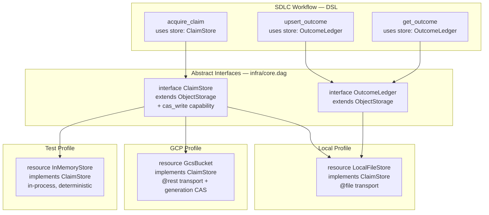
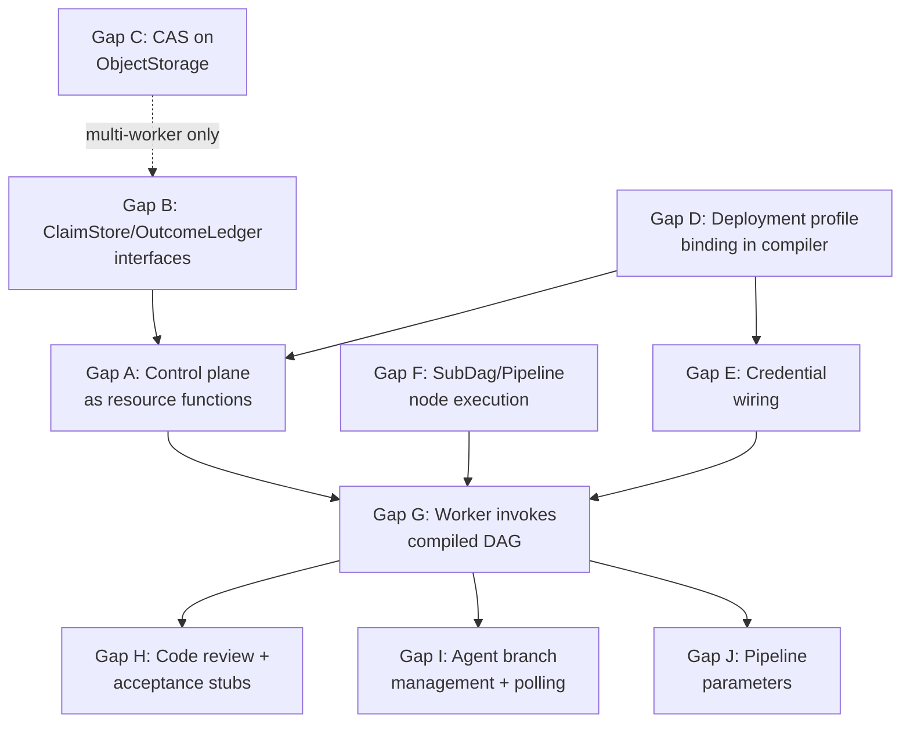

# SDLC Pipeline E2E Gap Analysis

Status: Draft
Date: 2026-02-21
Parent: [mega-modeling-design.md](mega-modeling-design.md) (MD0-D)
Scope: Delta between the mega modeling design and current implementation for end-to-end pipeline execution.

## 1. Architectural Principle

The mega modeling design (Section 2.1.3, Section 5) establishes:

1. **Orchestration logic lives in DSL only** (Section 3, row 1).
2. **State authorities are externalized** (Section 2.1, principle 2): claim store, outcome ledger, signal store.
3. **Adapters are generic** (Section 5.1): lease/claim store adapter, outcome ledger adapter.
4. **Deployment split is a transport concern** (Section 2.1.3, rule 3): DSL semantics unchanged across local/cloud.

The DSL infrastructure layer already implements the dependency injection mechanism:

- `infra/core.dag` defines abstract interfaces (`ObjectStorage`, `SecretStore`, `Compute`, `Queue`, `Identity`).
- `infra/gcp/resources.dag` provides concrete GCP implementations (`GcsBucket implements ObjectStorage`, etc.).
- Business logic declares `uses store: ObjectStorage(...)` and the provider is resolved at compile time via environment config.

**The control plane should follow this pattern exactly.** The workflow declares abstract resource needs (claim store, outcome ledger). The deployment profile (local, cloud-run, unit-test) binds the concrete implementation at compile time.

## 2. Resource Abstraction Model



### 2.1 Binding Resolution Order

The compiler resolves abstract resource bindings via deployment profile:

1. **Unit test**: `@hermetic` profile. All stores are in-memory. Clock is deterministic (seeded from `run_id`, per `std/resources.dag`).
2. **Local dev**: `local-co-located` profile. Stores are `@file` transport to `$SDLC_LEDGER_DIR`. Single-process, no CAS needed.
3. **Cloud Run (dev)**: `stateless-fleet` profile in `gunbai-auto`. Stores are `GcsBucket` with generation-based CAS. Secrets from Secret Manager.
4. **Cloud Run (prod)**: `stateless-fleet` profile in `gunbai-prod`. Same as dev but with stricter IAM and separate GCS buckets.

### 2.2 What Exists vs What Is Missing

| Component | Designed | DSL Contract | Concrete Impl | Compile-Time Binding |
|-----------|----------|-------------|---------------|---------------------|
| ObjectStorage interface | Yes (`infra/core.dag`) | Yes (read/write/delete/list) | GCS (`infra/gcp/resources.dag`) | **Missing** |
| ClaimStore interface | In mega design (Section 6.1) | **Missing** | Rust only (`sdlc/claims.rs`) | **Missing** |
| OutcomeLedger interface | In mega design (Section 6.1) | **Missing** | Rust only (`sdlc/state.rs`) | **Missing** |
| SecretStore interface | Yes (`infra/core.dag`) | Yes (read_value/write_value) | GCP (`ManagedSecret`) | **Missing** |
| Clock resource | Yes (`std/resources.dag`) | Yes (`now()`) | Runtime clock | Yes (`@hermetic` for tests) |
| Filesystem resource | Yes (`std/resources.dag`) | Yes (read/write) | File I/O | Yes (auto-wired) |

## 3. Gap Catalog

### Gap A: Control Plane Is a REST Service Instead of Abstract Resource Functions

**Current state**: `services/sdlc/control_plane.dag` defines a `service` with `@rest` transport against `http://127.0.0.1:8787`. This requires an HTTP server to exist.

**Target state**: Control plane operations become `func`s that `uses store: ClaimStore` and `uses store: OutcomeLedger`. No HTTP server. The workflow calls these functions directly. The concrete store implementation is injected at compile time.

**What changes**:
- Replace `service sdlc.ControlPlane` with `func acquire_claim(...)`, `func heartbeat_claim(...)`, `func release_claim(...)`, `func upsert_outcome(...)`, `func get_outcome(...)`.
- Each func uses `ObjectStorage` capabilities (or a `ClaimStore` extension with CAS).
- Remove `@endpoint`, `@rest` annotations from control plane.

**Severity**: Critical. Without this, the pipeline cannot execute (no server behind the REST endpoint).

### Gap B: No ClaimStore / OutcomeLedger Abstract Interfaces

**Current state**: `infra/core.dag` defines `ObjectStorage` but not SDLC-specific claim/outcome stores. The mega modeling design (Section 6.1) specifies `try_acquire_claim`, `heartbeat_claim`, `release_claim`, `record_stage_outcome` as canonical interface operations but they have no DSL interface definition.

**Target state**: New interfaces in `infra/core.dag` (or `dsl/sdlc/stores.dag`):

```
interface ClaimStore extends ObjectStorage {
  capability try_acquire(key: NonEmptyStr, owner: NonEmptyStr, lease_ttl_ms: Int)
    -> { acquired: Bool, conflict: Bool, lease_generation: Int }
    @contract: try_acquire(k, o, t) => acquired xor conflict

  capability heartbeat(key: NonEmptyStr, owner: NonEmptyStr, generation: Int)
    -> { accepted: Bool }
    @idempotent

  capability release(key: NonEmptyStr, owner: NonEmptyStr, generation: Int)
    -> { released: Bool }
    @idempotent
}

interface OutcomeLedger extends ObjectStorage {
  capability upsert(key: NonEmptyStr, outcome: Json)
    -> { updated: Bool, previous: Json? }
    @idempotent

  capability get(key: NonEmptyStr)
    -> { found: Bool, outcome: Json? }
    @idempotent @readonly
}
```

**What changes**:
- Define `ClaimStore` and `OutcomeLedger` interfaces.
- Implement for local (`LocalClaimStore` using `@file` + `Clock`), GCP (`GcsClaimStore` using GCS conditional writes), and test (`InMemoryClaimStore`).
- The CAS semantics live in the implementation, not the workflow.

**Severity**: Critical. Prerequisite for Gap A.

### Gap C: No CAS Capability on ObjectStorage

**Current state**: `ObjectStorage` has `read`, `write`, `delete`, `list`. No conditional write (compare-and-swap).

**Target state**: Either:
1. Add `cas_write` capability to `ObjectStorage` (generic CAS).
2. Or keep CAS in the `ClaimStore` interface only (domain-specific CAS).

For GCS, this maps to `x-goog-if-generation-match` header on write requests. For local files, this maps to file locking or generation tracking. For in-memory, this is a simple version counter.

**Recommendation**: Keep CAS in `ClaimStore` (option 2). Not all object stores need CAS, and the claim semantics (owner, lease, expiry) are domain-specific.

**Severity**: High for multi-worker. Not blocking for single-worker local dev.

### Gap D: No Deployment Profile Binding in Compiler

**Current state**: The comment in `infra/core.dag` says "the provider is selected at compile time via environment config" but the compiler does not implement this. There is no mechanism to say "in this deployment profile, `ClaimStore` is `GcsBucket`" and have the compiler wire it.

**Target state**: Deployment profiles are DSL-declared:

```
profile local {
  bind ClaimStore -> LocalFileStore { dir: env("SDLC_LEDGER_DIR", "target/sdlc") }
  bind OutcomeLedger -> LocalFileStore { dir: env("SDLC_LEDGER_DIR", "target/sdlc") }
  bind SecretStore -> EnvVarSecret
}

profile cloud_run {
  bind ClaimStore -> GcsBucket { name: "gunbai-auto-sdlc-claims", project: "gunbai-auto" }
  bind OutcomeLedger -> GcsBucket { name: "gunbai-auto-sdlc-outcomes", project: "gunbai-auto" }
  bind SecretStore -> ManagedSecret { project: "gunbai-auto" }
}

profile unit_test {
  bind ClaimStore -> InMemoryStore
  bind OutcomeLedger -> InMemoryStore
  bind SecretStore -> StaticSecret { value: "test-token" }
}
```

**What changes**: Compiler needs `profile` declaration support and `bind` resolution during lowering. When lowering a `uses store: ClaimStore` declaration, the compiler looks up the active profile's binding and generates transport code for the concrete implementation.

**Severity**: High. This is the compile-time DI mechanism. Without it, the abstract interfaces are design-only.

### Gap E: Credential Wiring for External Services

**Current state**: GitHub services declare `@auth(BearerToken)` but no credential intent mapping exists for `github.*`. Codex service uses `@shell` with no env-var injection. The `credential_chain` pattern in `std/patterns.dag` covers GCP auth but not GitHub/Codex.

**Target state**: Credentials are resources, resolved via deployment profile:
- `local` profile: `GITHUB_TOKEN` from env var, `CODEX_API_KEY` from env var.
- `cloud_run` profile: Both from Secret Manager via `credential_chain` pattern.
- `unit_test` profile: Static test tokens.

This is a special case of Gap D (deployment profile binding) applied to `SecretStore`.

**Severity**: High. Blocks any real external API calls.

### Gap F: SubDag / Pipeline Node Execution

**Current state**: `SubDag` nodes (from `for`/`if` lowering) and `Pipeline` nodes resolve to `UnsupportedOp` in `gunbc-dag/src/resolve.rs`. The DSL compiles control flow but the runtime cannot execute it.

**Target state**: `SubDag` nodes are resolved recursively (resolve inner DAG, execute it as a nested DAG). `Pipeline` nodes are resolved as ordered stage sequences.

**Severity**: Critical. Without this, compiled DSL with `for`/`if` cannot run.

### Gap G: Worker Does Not Invoke Compiled DAG

**Current state**: `gunbc-dag/src/bin/sdlc.rs` manages ledgers but the `run_worker` function just calls `mark_run_completed()` without executing any stage logic. The comment says "Stage execution is handled by the DSL-compiled pipeline" but no code loads or executes the compiled pipeline.

**Target state**: The worker loads the compiled `dsl/pipelines/sdlc.dag` artifact, resolves it, and calls `execute_dag()` with inputs derived from worker context (owner, repo, run_key, credentials).

**Note**: With Gaps A-D resolved, the worker becomes simpler: it just needs to load the compiled DAG and execute it. The DAG itself handles claim acquisition, stage execution, and outcome recording via abstract resource functions.

**Severity**: Critical. The pipeline is compiled but never invoked.

### Gap H: Code Review and Acceptance Testing Stages Are Stubs

**Current state**: `dsl/pipelines/sdlc.dag` stages `code_review` and `acceptance` post static comments. No actual code review (PR diff retrieval + LLM analysis) or CI execution (cargo test/clippy) occurs.

**Target state**:
- `code_review`: Call `PullRequest.ListFiles` + `PullRequest.Get` to retrieve diff, send to LLM review service, post findings as PR comment.
- `acceptance`: Call `shell.Cargo.Test` + `shell.Cargo.Clippy` on PR branch (or trigger CI via GitHub Actions API).

Both should be DSL `func`s that compose existing service operations.

**Severity**: High. Blocks the full scenario end-to-end.

### Gap I: Agent Branch Management and Polling

**Current state**:
- No git branch is created before `Codex.Spawn`.
- `handle_agent_completion` takes `branch_name` but nothing provides it.
- `check_agent_status` is defined but nothing invokes it.

**Target state**:
- Before `Codex.Spawn`, create a deterministic branch (`sdlc/issue-{number}`) via `shell.Git` service.
- After agent completion, push the branch and create the PR.
- The worker sweep checks `agent_ledger` for in-flight runs and polls their status.

**Severity**: High. Blocks the agent implementation loop.

### Gap J: Pipeline Parameters Are Hardcoded

**Current state**: `dsl/pipelines/sdlc.dag` uses `fn default_repo_owner() -> String { "gunb-ai" }`. The Rust binary accepts `--issue-id`, `--intake-key` but the DSL pipeline ignores them.

**Target state**: Pipeline inputs are bound from the deployment profile or passed as DAG inputs at execution time. The compiled DAG accepts `owner`, `repo`, `run_key` as top-level inputs.

**Severity**: Medium. Limits the pipeline to one hardcoded repo.

## 4. Dependency Graph



Critical path: **B -> A -> G** (with F and D as parallel prerequisites for G).

## 5. GCP Resource Requirements

Once Gaps A-E are resolved, the pipeline needs these GCP resources in `gunbai-auto`:

| Resource | Service | Purpose | DSL Declaration |
|----------|---------|---------|-----------------|
| `gunbai-auto-sdlc-claims` | GCS | Claim lease storage | `GcsBucket` in deployment profile |
| `gunbai-auto-sdlc-outcomes` | GCS | Stage outcome ledger | `GcsBucket` in deployment profile |
| `github-token` | Secret Manager | GitHub API auth | `ManagedSecret` in deployment profile |
| `codex-api-key` | Secret Manager | Codex agent auth | `ManagedSecret` in deployment profile |
| `anthropic-api-key` | Secret Manager | LLM design/review | `ManagedSecret` in deployment profile |
| `gunbc-sdlc-worker` | Cloud Run | Worker compute | `CloudRunService` in `infra/sdlc/deploy.dag` |
| `gunbc-sdlc-worker@` | IAM | Worker identity | `GcpServiceAccount` |
| `gunbc-sdlc-scheduler@` | IAM | Scheduler identity | `GcpServiceAccount` |
| `gunbc-sdlc-trigger` | Cloud Scheduler | Cron trigger (*/5 * * * *) | Needs DSL service definition |
| `gunbc` | Artifact Registry | Container images | Needs DSL resource definition |

## 6. Implementation Priority

**Phase 1 -- Abstract resource layer (Gaps B, D)**:
Define `ClaimStore` and `OutcomeLedger` interfaces. Implement deployment profile binding in the compiler. This unlocks compile-time DI for all downstream work.

**Phase 2 -- Control plane as functions (Gap A)**:
Rewrite `control_plane.dag` from `service` to `func`s that use the abstract store interfaces.

**Phase 3 -- Runtime execution (Gaps F, G, E)**:
Make SubDag/Pipeline nodes executable. Wire the worker to load and execute compiled DAGs. Wire credentials via deployment profile.

**Phase 4 -- Stage completion (Gaps H, I, J)**:
Fill in the stub stages (code review, acceptance). Wire agent branch management and polling. Make pipeline parameters injectable.

**Phase 5 -- Multi-worker safety (Gap C)**:
Add CAS capability to `ClaimStore` for GCS (generation-based conditional writes). Not needed for single-worker local dev.
