# SDLC Mega Modeling Design (MD0-D)

Status: Draft for review  
Date: 2026-02-21  
Scope: Canonical SDLC modeling gate. All SDLC design/implementation tasks are downstream of this document.

## 1. Document Contract

1. This is the only SDLC design source of truth.
2. SDLC implementation tasks (`IM*`, `IN*`, `CG*`, `W*`) are blocked until `MD0-D` sign-off.
3. If implementation behavior conflicts with this document, implementation is wrong until this doc is revised.

## 2. High-Level SDLC Workflow

This is the top-level execution model. Appendix A provides recursive breakdowns for each high-level box.

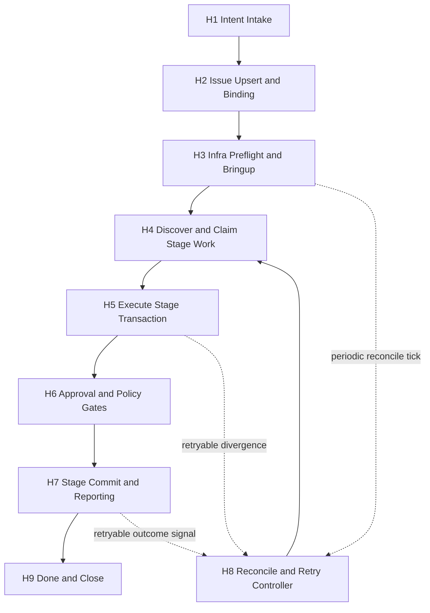

Execution context note:

1. `H8` is an asynchronous controller context, not an inline continuation of a claimed stage transaction.
2. `H8` must acquire ownership explicitly before any state mutation that requires a claim.

## 2.1 Runtime Topology and Trigger Ownership

The delivery strategy is local-first for business logic correctness, then stateless infra split without changing semantics.

Runtime principles:

1. Orchestration semantics stay in DSL/state machine; deployment split must not change behavior.
2. Control loops are stateless; authoritative state is externalized (issue provider, claim store, outcome ledger, signal store).
3. Signals are durable hints that accelerate pickup; correctness remains store-driven and idempotent.

### 2.1.1 Graph-to-Deployable Mapping

| High-level box | Deployable unit | State authority | Primary trigger |
|---|---|---|---|
| `H1` + `H2` (intake + binding) | `sdlc-intake` controller (CLI/API invoked) | issue provider + binding store | `IntentSubmitted` |
| `H3` (infra preflight/bringup) | `gunbc-infra` controller | infra intent store + status checks | `InfraIntentChanged`, periodic infra tick |
| `H4` + `H5` + `H6` + `H7` (claim/execute/commit) | `sdlc-worker` fleet | claim store + stage/outcome ledger + provider | `WorkReady`, rediscovery scan |
| `H8` (reconcile/retry) | `sdlc-reconcile` controller | outcome ledger + provider + claim store | retryable outcome signal, periodic reconcile tick |
| `H9` (terminalize/close) | terminalizer path in worker/reconciler | issue provider + ledger | `TerminalStateReached` |

Notes:

1. Approval handling is split: worker yields at `AwaitApproval`, then approval bridge (webhook/poller) emits resume signal.
2. `H8` is always asynchronous and may run in separate deployment from workers.
3. Any unit can be co-located in local mode; production/non-local mode separates units by control-loop role.

### 2.1.2 Signal Contract Matrix

| Signal | Producer | Consumer | Idempotency key | Delivery semantics |
|---|---|---|---|---|
| `IntentSubmitted(intent_id, intent_version)` | CLI/API intake edge | `sdlc-intake` | `(intent_id, intent_version)` | at-least-once, durable |
| `WorkReady(issue_id, stage, stage_epoch)` | intake/commit/reconcile | `sdlc-worker` | `(issue_id, stage, stage_epoch)` | at-least-once, durable |
| `ApprovalGranted(issue_id, stage, approval_epoch)` | webhook/poller bridge | `sdlc-worker` discover loop | `(issue_id, stage, approval_epoch)` | at-least-once, durable |
| `RetryDue(issue_id, stage, run_key, next_attempt_at)` | reconcile/controller timer | `sdlc-reconcile` or worker discover | `(issue_id, stage, run_key, next_attempt_at)` | at-least-once, durable |
| `LeaseExpired(issue_id, stage, lease_generation)` | claim-store sweep/timer | `sdlc-worker` discover loop | `(issue_id, stage, lease_generation)` | at-least-once, durable |
| `ReconcileTick(window_id)` | scheduler | `sdlc-reconcile` | `window_id` | periodic durable schedule |
| `InfraIntentChanged(intent_fingerprint)` | infra spec update path | `gunbc-infra` | `intent_fingerprint` | at-least-once, durable |
| `TerminalStateReached(issue_id, stage, run_key)` | worker/reconcile terminal path | terminalizer path | `(issue_id, stage, run_key)` | at-least-once, durable |

Signal reliability rules:

1. Controllers must tolerate duplicate, delayed, and reordered signals.
2. Signal consumption must be idempotent against authoritative store state.
3. Periodic store-driven scans are mandatory anti-entropy; signals are never sole correctness dependency.
4. Missing signal must degrade to bounded-latency discovery, not correctness loss.
5. All trigger handling emits structured outcome records for audit/replay.

### 2.1.3 Local-First to Split-Infra Rollout

Local-first phase (business logic before infra split):

1. Run intake/worker/reconcile loops co-located in a single process profile for deterministic testing.
2. Use the same interfaces as deployed mode (provider adapter, claim store adapter, ledger adapter, signal adapter).
3. Validate crash/replay, approval yield/resume, and retry-budget durability under deterministic test clock.

Split-infra phase (stateless deployment):

1. Deploy `sdlc-worker`, `sdlc-reconcile`, and `gunbc-infra` as independently scalable stateless units.
2. Keep ownership boundaries strict: only claimed contexts mutate claim-protected stage state.
3. Treat deployable boundaries as transport concerns only; DSL semantics remain unchanged.
4. Scale workers horizontally (5-10+) with no in-memory coordination assumptions.

## 3. Modeling Concerns

| Concern | Decision | Owner Tasks |
|---|---|---|
| Where orchestration logic lives | In DSL only; runtime code may not embed SDLC sequencing logic | `CG0-D`, `CG1`, `CG2` |
| Interpreter role | Supported mode for differential testing/diagnostics, not default execution path | `CG0-D`, `CG6` |
| Backend fungibility | Rust/Go/C generated backends must all run SDLC semantics | `CG5`, `CG6` |
| Backend rotation (non-prod) | Rotate generated backends to expose backend-specific defects | `CG6` |
| Idempotent issue intake | `intent_id` maps to one managed issue with fail-closed collision handling | `IM1`, `IM2`, `IM10` |
| Atomic pickup at scale | Lease/CAS claim protocol with heartbeat and expiry reclaim | `IM6`, `IM7` |
| Crash-window safety | Replay reconciliation for marker/stage/ledger divergence | `IM11` |
| Approval wait behavior | AwaitApproval is async yield; claim released while waiting for human input | `W13` |
| Retry budget durability | Retry counters/timers are persisted in ledger, never memory-only | `IM9`, `IM11` |
| Fail-closed terminalization | Fail-closed paths must write terminal state and user-visible issue updates | `IM9`, `W12` |
| Artifact storage flexibility | Same contract supports inline and blob-reference payloads | `IM4`, `IM13`, `CG3` |
| Runtime bringup modeling | Versioned `InfraIntent` with idempotent reconcile semantics | `IN1`, `IN2` |
| Signal trigger ownership | Every stage transition trigger has explicit producer/consumer/idempotency key contract | `IN0-D`, `IM7`, `W12` |
| Local-first rollout | Co-located local loop validates business logic before infra split | `IN0-D`, `IN4`, `W12` |
| Real-mode safety | Capability/preflight gates fail closed before worker startup | `IM12`, `IN3` |
| Cross-backend correctness proof | Multi-level conformance from DSL to end-to-end parity | `CG6` |
| C backend ownership safety | Explicit FFI ownership contract for variable-length payload exchange | `CG5`, `CG6` |

## 4. Core Abstractions

Canonical types/contracts:

1. `IntentSheet`
2. `InfraIntent`
3. `IssueBinding`
4. `StageRunKey`
5. `Artifact` (`Inline` or `BlobRef`)
6. `ArtifactMarker`
7. `ClaimLease`
8. `StageOutcome`
9. `ProviderCapabilities`

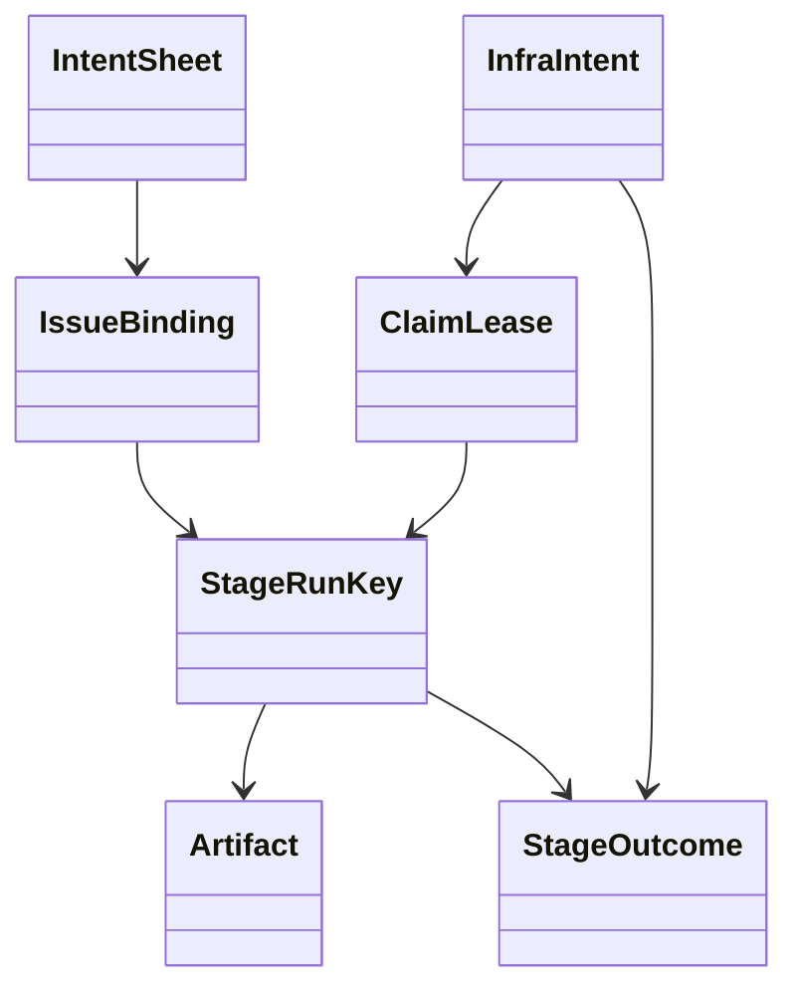

## 5. Architecture Boundaries

### 5.1 Allowed Handwritten Runtime Surface

1. Parser/typecheck/lowering/execution engine.
2. Generic adapters:
   1. REST execution adapter.
   2. Lease/claim store adapter.
   3. Outcome ledger adapter.
   4. Metrics/log sink adapter.

### 5.2 Forbidden Handwritten Runtime Surface

1. SDLC stage ordering semantics.
2. SDLC retry/transition policy semantics.
3. SDLC-specific infra reconcile policy semantics.

### 5.3 Codegen-First Policy

1. Generated backend execution is default for normal runs.
2. Interpreter mode is supported and intentionally retained.
3. New SDLC behavior must be added to DSL/codegen first.
4. Interpreter-only behavior additions are disallowed.

### 5.4 Codegen-First Implementation Gate (CG0-D / CG3 / CG4 / CG5 / CG6)

This section records the concrete implementation surface that satisfies the
codegen-first boundary for SDLC + infra control-plane orchestration.

Canonical DSL modules (authoritative behavior/modeling):

1. `dsl/pipelines/sdlc.dag` — SDLC stage orchestration semantics.
2. `dsl/tools/design.dag` — typed design/review prompt transforms.
3. `dsl/services/sdlc/control_plane.dag` — claim lease + stage outcome
   control-plane service contracts.
4. `dsl/tools/infra.dag` — infra plan/apply/reconcile orchestration contract.

Runtime delegation invariants:

1. `gunbc-sdlc` and `gunbc-infra` consume compiled DSL module behavior through
   shared DAG build/resolve paths, not handwritten stage-flow branching.
2. Workspace discovery/coverage gates fail closed for unmapped DSL modules.
3. Generated backend conformance must include manifest parity and runnable
   target smoke across Rust/Go/C/MIPS where toolchains are present.

Conformance evidence classes:

1. Manifest parity tests across Rust/Go/C/MIPS for SDLC and infra modules.
2. Generated runtime smoke tests:
   1. Rust layer-1 runnable smoke for infra entrypoint.
   2. Go/C/MIPS toolchain-aware smoke for infra + SDLC modules.
3. Differential policy:
   1. Any new SDLC orchestration behavior must land in DSL modules first.
   2. Runtime-only behavior deltas are design-policy violations.
4. Differential runtime checks:
   1. Interpreter vs generated-runtime output parity is enforced for `tools.makegen`
      in `codegen_parity` to keep L5 conformance executable, not aspirational.
   2. Makegen C backend differential checks additionally run under ASAN+UBSAN.
   3. Design-tool Rust Layer-1 execution trace differential (interpreter vs generated runtime node trace) is enforced in `codegen_parity`.

## 6. Canonical Contracts

### 6.1 Interface Operations

1. `upsert_issue_by_intent`
2. `get_issue`
3. `upsert_comment`
4. `upsert_artifact`
5. `compare_and_set_stage`
6. `set_labels`
7. `list_events`
8. `discover_ready_issues`
9. `try_acquire_claim`
10. `heartbeat_claim`
11. `release_claim`
12. `record_stage_outcome`

### 6.2 Idempotency and Atomicity Rules

1. Intake idempotency:
   1. rerun with same `intent_id` updates, not duplicate creates.
2. Stage idempotency:
   1. `run_key = hash(issue_id, stage, input_hash, policy_version)`.
   2. Artifact generation for a fixed `run_key` must be deterministic after normalization.
   3. Non-deterministic fields (wall-clock timestamps, random IDs, memory addresses, unstable ordering) are forbidden in canonical artifact hash input.
3. Artifact idempotency:
   1. Workers write provisional artifact markers keyed by `(run_key, lease_generation)` before transition commit.
   2. Canonical marker keyed by `run_key` is written/confirmed only after successful stage CAS transition.
   3. canonical marker collision with same payload hash is success.
   4. canonical marker collision with different payload hash is fail-closed conflict.
   5. provisional marker collisions across lease generations are resolved by active-lease generation order; stale-generation provisional artifacts are supersedable/collectable.
4. Claim atomicity:
   1. one active lease per `(issue_id, stage)` with generation CAS.
5. Retry budget durability:
   1. retry state (`attempt_count`, `retry_budget_remaining`, `next_attempt_at`) is persisted in `StageOutcome` metadata.
   2. worker memory is non-authoritative for retry budget.
6. Fail-closed terminalization:
   1. fail-closed must persist terminal failure in ledger.
   2. fail-closed must write user-visible issue/comment/label update.
   3. fail-closed must release claim (if held) and terminate execution context.

### 6.3 Artifact/Blob Modeling

1. `Artifact.payload`:
   1. `Inline { body }`
   2. `BlobRef { uri, size_bytes }`
2. Equality:
   1. `content_hash + normalized payload reference`.
3. Provider strategy:
   1. GitHub may use inline comments, chunked comments, linked gist, or object-storage references.

### 6.4 Approval Yield Contract

1. `AwaitApproval` is asynchronous yield, not busy wait.
2. Entering `AwaitApproval` requires:
   1. persist stage execution state `PENDING_APPROVAL`.
   2. release active claim.
   3. terminate worker execution for that item.
3. Approval signal (label/comment/webhook/policy event) transitions state from `PENDING_APPROVAL` to `READY`.
4. Resumed work is rediscovered through `H4` and claimed normally.

### 6.5 C Backend FFI Ownership Contract

1. Generated C runtime and handwritten adapters exchange variable-length payloads via explicit ownership handles.
2. Generated C runtime must never call `free()` on adapter-owned memory directly.
3. Adapter boundary must expose paired acquire/release functions for owned buffers.
4. Each acquired handle must be released exactly once.
5. Conformance gate includes sanitizer-backed memory tests (ASAN/UBSAN/leak checks) for generated C runtime paths.

### 6.6 Signal Reliability Contract

1. Signal transport semantics are at-least-once and durable.
2. Every signal type has a deterministic idempotency key and explicit producer/consumer ownership.
3. Signal handlers must be idempotent and derive final decisions from authoritative store state.
4. Periodic anti-entropy scans are required; signals may accelerate work discovery but may not be sole correctness source.
5. Loss of any single signal may delay execution but must not cause missed terminalization or duplicate side effects.
6. Timer-derived triggers (`RetryDue`, lease expiry, reconcile tick) must be persisted or reconstructable from ledger/claim state.

### 6.7 Runtime Launch Profile and Drain Contract

1. Infra intent input is versioned and fail-closed:
   1. `schema_version` is required.
   2. Unsupported schema versions are rejected before worker startup.
1. Infra intent `runtime_profile` must be explicit and validated fail-closed:
   1. `stateless-fleet` requires `launch.worker_count` in `[5, 10]`.
   2. `local-co-located` requires `launch.worker_count = 1`.
2. Worker loop capacity per pass is bounded by validated `launch.worker_count`; overflow intake keys are deferred and surfaced in execution summary metrics.
3. Real-mode worker startup must run infra preflight checks before processing any intake.
4. Worker drain mode is explicit and durable through a persisted drain flag.
5. When drain is active, worker must:
   1. stop acquiring new claims,
   2. release worker-owned claims,
   3. exit cleanly with machine-readable drain status.
6. Infra reconciliation is health-gated:
   1. reconcile preview/execute commands must fail closed while auth/project/service-account/secret health checks are failing.
   2. healthy reconcile preview reports the same runtime dependency target set as infra plan.

### 6.8 Execution Report Contract

1. Worker execution produces a persisted machine-readable report artifact.
2. Report includes per-intake metric maps:
   1. stage duration,
   2. approval latency,
   3. retry attempts,
   4. LLM cost units.
3. Report includes rolled-up cost units, including aggregate estimated LLM cost.
4. Report includes rollup summary counters for monitoring ingestion:
   1. intake total,
   2. ready/executed/terminalized counts,
   3. awaiting approval, claim conflict, replay-skip, **canonical-replay-skip**, retry-backoff-deferred, and capacity-deferred counts.
5. Report includes issue-scope metadata when invoked via issue filter:
   1. requested `issue_filter`,
   2. `issue_binding_found` boolean (whether intake mapping exists for that issue id).
6. Report includes generation timestamp for downstream time-series correlation.

## 7. Conformance Model (Multi-Level)

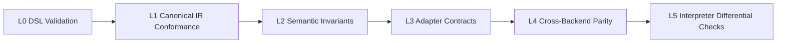

Levels:

1. `L0`: DSL type/contract correctness.
2. `L1`: canonical IR equivalence checks.
3. `L2`: lease/retry/replay/stage semantics.
4. `L3`: provider/store capability contract tests.
5. `L4`: Rust/Go/C generated runtime parity.
6. `L5`: generated-backend vs interpreter differential checks.

## 8. Rollout Gates

1. Gate A: `MD0-D` review sign-off.
2. Gate B: design implementation tasks begin.
3. Gate C: conformance evidence required for completion.

## 9. Task Traceability

| Area | Tasks |
|---|---|
| Identity/intake contracts | `IM1`, `IM2`, `IM10` |
| Stage idempotency/replay | `IM3`, `IM8`, `IM11` |
| Artifact/blob contracts | `IM4`, `IM13`, `CG3` |
| Claim/worker safety | `IM6`, `IM7`, `IM9`, `W12` |
| Provider capability gating | `IM12`, `W9`, `W12` |
| Runtime infra bringup | `IN1`, `IN2`, `IN3`, `IN4` |
| Codegen cutover/parity | `CG1`, `CG2`, `CG4`, `CG5`, `CG6` |
| Governance/reporting | `IM5`, `W13`, `W14` |

## 10. Appendix A: Recursive Workflow Breakdowns

### A.1 Breakdown for H1 (Intent Intake)

Reference: High-level box `H1`.

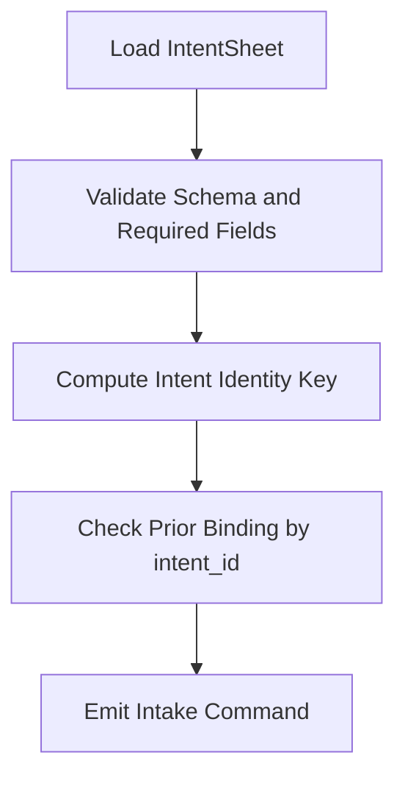

### A.2 Breakdown for H2 (Issue Upsert and Binding)

Reference: High-level box `H2`.

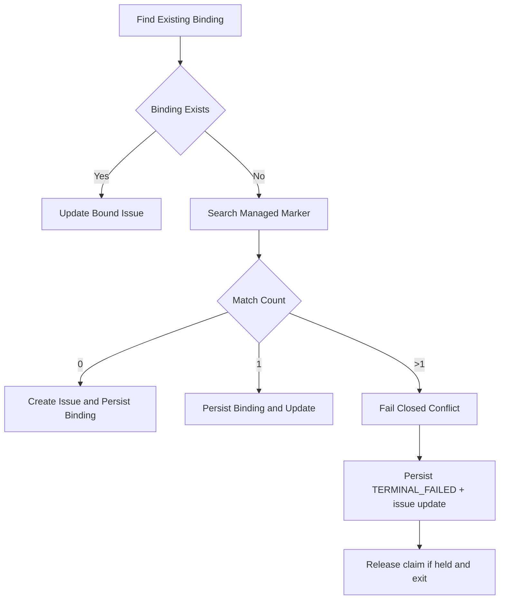

### A.3 Breakdown for H3 (Infra Preflight and Bringup)

Reference: High-level box `H3`.

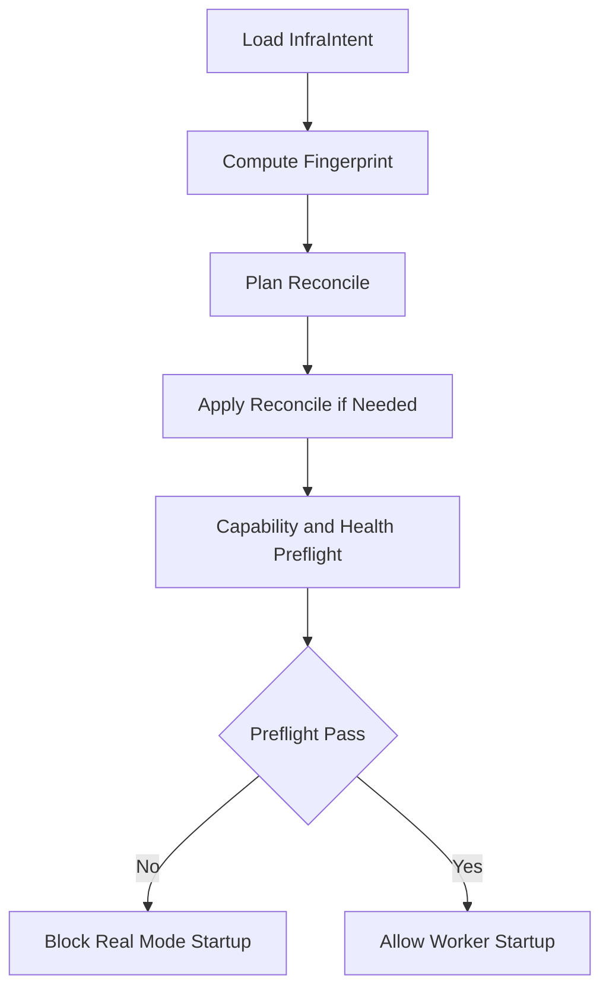

### A.4 Breakdown for H4 (Discover and Claim Stage Work)

Reference: High-level box `H4`.

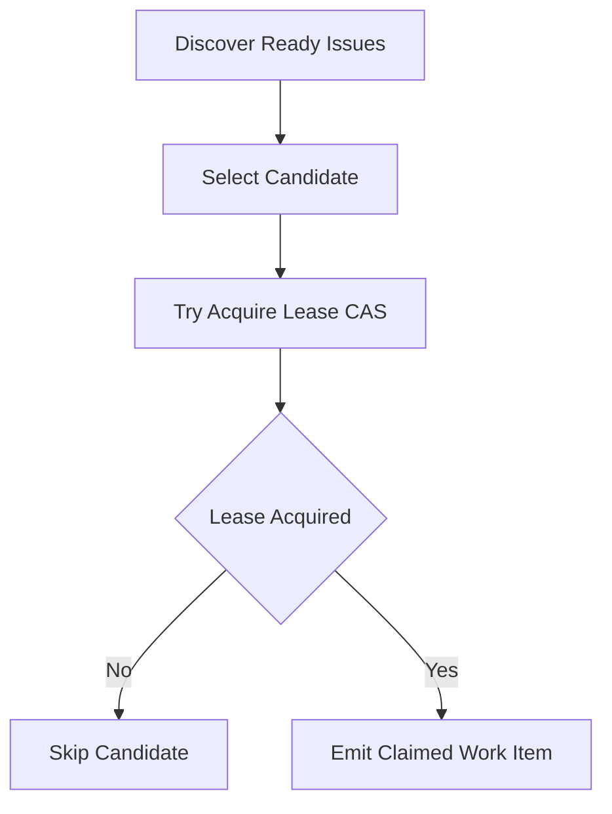

### A.5 Breakdown for H5 (Execute Stage Transaction)

Reference: High-level box `H5`.

```mermaid
flowchart TD
  E1[Refetch Issue Snapshot] --> E2[Check Preconditions]
  E2 --> E3[Compute run_key]
  E3 --> E4[Check Prior Outcome]
  E4 --> E5{Success Cached}
  E5 -- Yes --> E6[Reuse prior outcome and release cached-hit]
  E6 --> E11[Return success outcome]
  E5 -- No --> E7[Generate deterministic artifact from run_key]
  E7 --> E8[Upsert provisional artifact marker (run_key + lease_generation)]
  E8 --> E9[CAS Stage Transition]
  E9 --> E10[Upsert or confirm canonical marker (run_key)]
  E10 --> E11[Record StageOutcome]
```

### A.6 Breakdown for H6 (Approval and Policy Gates)

Reference: High-level box `H6`.

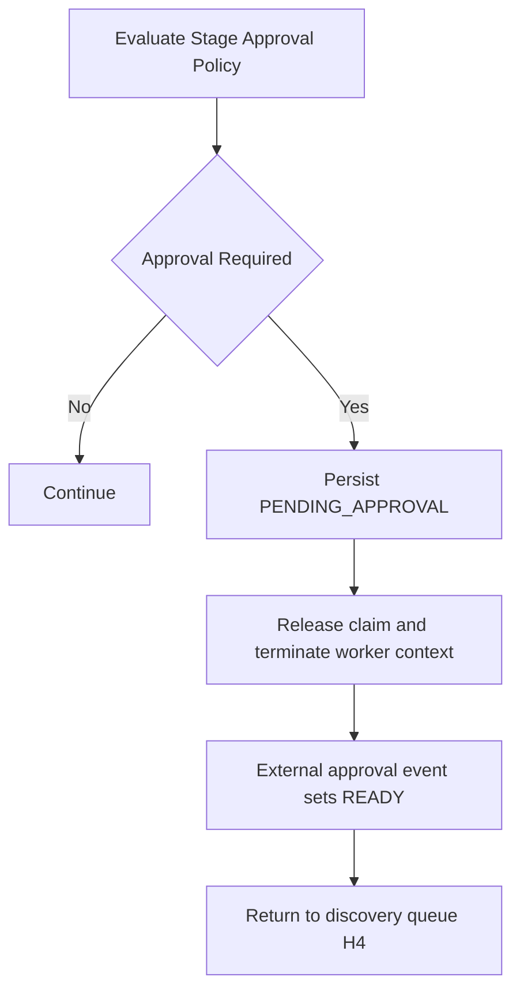

### A.7 Breakdown for H7 (Stage Commit and Reporting)

Reference: High-level box `H7`.

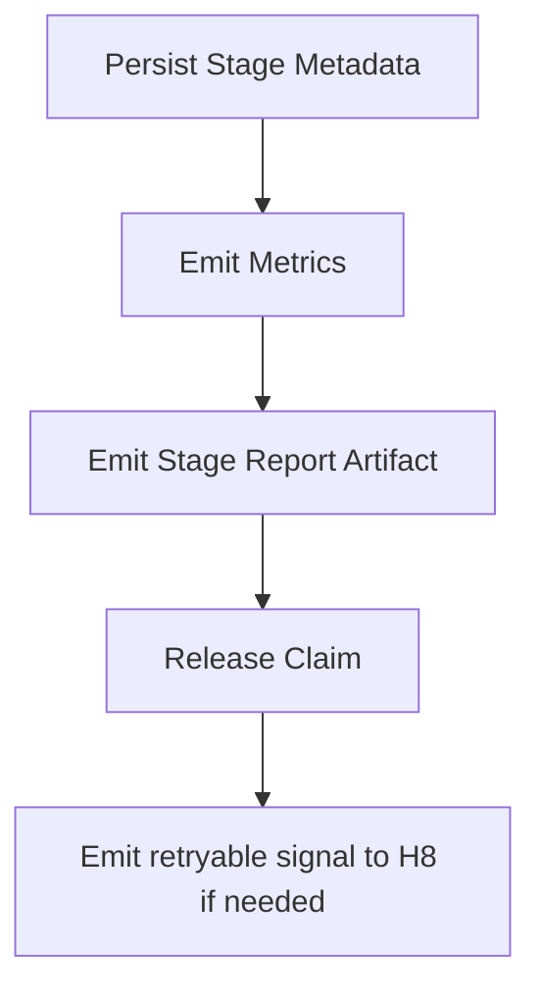

### A.8 Breakdown for H8 (Reconcile and Retry Loop)

Reference: High-level box `H8`.

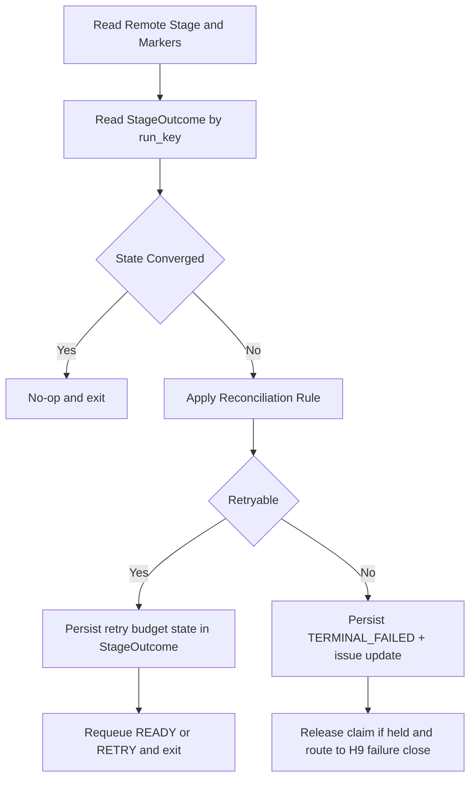

### A.9 Breakdown for H9 (Terminalize and Close)

Reference: High-level box `H9`.

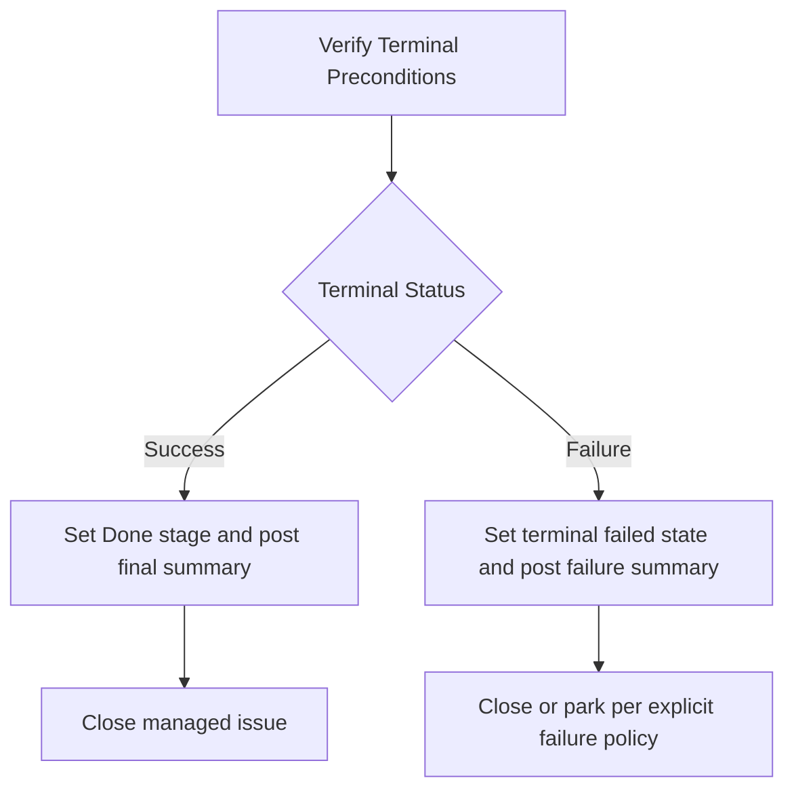

## 11. Review Checklist

1. Abstractions are minimal, composable, and provider-fungible.
2. Every invariant has an explicit verification path.
3. No SDLC sequencing semantics remain in handwritten runtime logic.
4. Codegen-first + interpreter-supported policy is unambiguous.
5. Artifact/blob flexibility is modeled without changing pipeline semantics.
6. High-level flow and recursive appendix flows are aligned (`H1`-`H9`).
7. Task traceability is complete and implementation-ready.
8. `AwaitApproval` is modeled as async yield with claim release.
9. Retry budget persistence is modeled as ledger-backed, not memory-backed.
10. Fail-closed paths route to terminalized user-visible outcomes.
11. C backend memory ownership contract is explicit and testable.
12. Each high-level graph box has explicit deployable ownership and trigger source.
13. Signal transport/dedup/idempotency/anti-entropy rules are explicit and testable.
14. Local co-located profile and split stateless profile preserve identical DSL semantics.
