# Tool Workflow Design Pack (WF14-D to WF22)

Status: Draft for review
Date: 2026-02-19
Scope: `WF14-D`..`WF22` for planner-first tool workflows (gist focus, all targets)
Canonical normative model: `docs/design/workflow-minimal-execution-model.md`

## 1. Read This First

This pack is the tool-workflow analog of `wf1-wf4-dag-design-pack.md`:

1. `docs/design/workflow-minimal-execution-model.md` is the normative source for
   workflow semantics, keys/ledger, flattening, and proof obligations.
2. This document is the WF14-WF22 review pack: concrete DAG views, capability
   decompositions, ownership maps, and acceptance checklists for tool workflows.
3. If this document conflicts with the canonical model, canonical model wins.
4. Hierarchical diagrams here are authoring/review views; runtime execution uses
   the flattened global DAG contract from the canonical model.

### 1.1 Consolidation Map (WF Tasks → Canonical Sections)

| WF Task | This Pack (review view) | Canonical Source |
|---|---|---|
| `WF14-D` | Section 2 (Compilation capability) | `workflow-minimal-execution-model.md` Section 15.2 §6 |
| `WF15-D` | Section 3 (Codegen capability) | `workflow-minimal-execution-model.md` Section 15.2 §5 |
| `WF16-D` | Section 4 (Gist base + modes) | `workflow-minimal-execution-model.md` Section 15.4 |
| `WF19-D` | Sections 5-9 (Non-gist tools) | `workflow-minimal-execution-model.md` Section 15.5 |

---

## 2. Compilation Capability (WF14-D)

### 2.1 Current State

Every `make <tool>` target invokes `cargo run -p <package> --bin <binary>`, which
triggers Cargo's full workspace dependency check before binary execution. This
applies to every tool invocation, regardless of whether source has changed.

### 2.2 Compilation as Keyed Unit

```rust
WorkflowUnit {
    op: InvokeProcessUnit(ProcessUnitRef("compilation.ensure")),
    // Key inputs:
    //   - workspace source hashes (Cargo.toml + *.rs for transitive deps)
    //   - cargo metadata dependency hashes
    //   - compiler version (rustc --version)
    // Output:
    //   - binary paths (Map<BinaryName, AbsolutePath>)
}
```

### 2.3 Key Contract

| Key Field | Source | Invalidation |
|---|---|---|
| `source_hashes` | content hashes of all `*.rs` + `Cargo.toml` in dep tree | any source file changes |
| `cargo_metadata_hash` | hash of `cargo metadata --format-version=1` dependency graph | dependency version changes |
| `compiler_version` | `rustc --version` output hash | toolchain update |

Miss reason ADT:

```rust
enum CompilationMissReason {
    SourceChanged { changed_crate: String },
    DependencyChanged { changed_dep: String },
    CompilerChanged { old: String, new: String },
    NeverBuilt,
}
```

### 2.4 Before/After Make Target Shape

**Before** (current):
```makefile
gist: ensure-codegen
    @RUSTFLAGS="-D warnings" cargo run -p gunbc-gist --bin gunbc-gist -- ...
```

**After** (planner-managed):
```makefile
gist:
    @target/release/gunbc-workflow gist-snapshot -- ...
```

The `gunbc-workflow` binary is itself built by the compilation unit. The planner
resolves compilation freshness from ledger, rebuilds only if source changed, and
dispatches tool execution via pre-built binary path.

### 2.5 Cross-Workflow Sharing

The compilation unit is shared by every workflow. A single compilation check
serves all tool invocations in a session. `WorkIdentity` for compilation is
context-free — `ci.compilation.ensure` and `gist.compilation.ensure` resolve
to the same identity and share a single ledger entry.

---

## 3. Codegen Capability (WF15-D)

### 3.1 Codegen as Keyed Unit

```rust
WorkflowUnit {
    op: InvokeProcessUnit(ProcessUnitRef("codegen.ensure")),
    // Key inputs:
    //   - DSL source hashes (dsl/**/*.dag content hashes)
    //   - codegen binary semantic version
    // Output:
    //   - codegen_fresh: Bool
}
```

### 3.2 Key Contract

| Key Field | Source | Invalidation |
|---|---|---|
| `dsl_source_hashes` | content hashes of `dsl/**/*.dag` files | any DSL source changes |
| `codegen_binary_version` | semantic version from codegen binary manifest | codegen logic changes |

Miss reason ADT:

```rust
enum CodegenMissReason {
    DslSourceChanged { changed_file: String },
    CodegenBinaryChanged { old_version: String, new_version: String },
    NeverRun,
}
```

### 3.3 `ensure-codegen` Elimination

The Make prerequisite `ensure-codegen` is replaced by a typed dependency edge
in the workflow DAG. Tool workflows declare `codegen.ensure` as an input
dependency:

```
codegen.ensure ──(control)──> gist.snapshot
codegen.ensure ──(control)──> bootstrap.run
codegen.ensure ──(control)──> makegen.run
...
```

On warm state, `codegen.ensure` resolves to `CachedHit` via ledger lookup.
No subprocess spawned. No `cargo run`. Tool workflow starts immediately.

### 3.4 Cross-Workflow Sharing

Same as compilation: codegen unit is shared globally. Running `make ci`
materializes codegen in the ledger. Running `make gist` afterward gets
`CachedHit` for free.

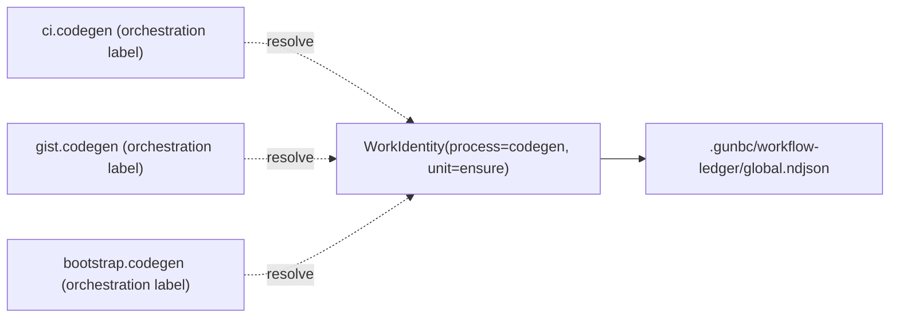

---

## 4. Gist Workflows (WF16-D)

### 4.1 Structural Overview

The gist family consists of three modes that share a base workflow. The Rust
source already factors this:

- `shared.gist_modes` (DSL) / `gunbc-lib-gist-ops` (Rust): base workflow
  (`branch_resolution`, `gist_upload` including credential chain)
- `tools.gist` (DSL) / `gunbc-lib-gist::graph` (Rust): mode-specific content
  acquisition, composed with the base

```
gist-snapshot = base + snapshot content acquisition
gist-diff     = base + diff content acquisition
gist-recent   = base + recent content acquisition + credential cloud override
```

### 4.2 Base Gist Workflow (shared by all modes)

#### 4.2.1 Process-Level DAG (Rust source: actual nodes)

The base consists of two SubDags that appear in all three modes:

**Branch Resolution SubDag** (`build_branch_resolution_subdag`):

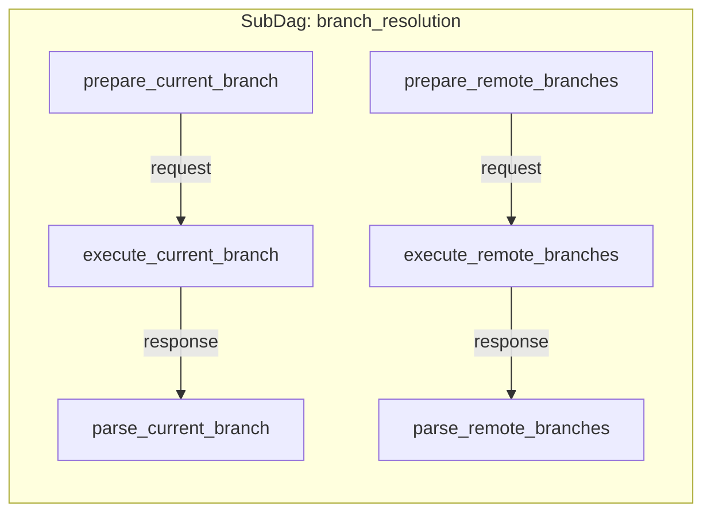

Inputs: `repo_path`
Outputs: `branch`, `remote_branch`
Resources: `res:file` (FilesystemHandle, Read)

**Gist Upload SubDag** (`build_gist_upload_subdag`):

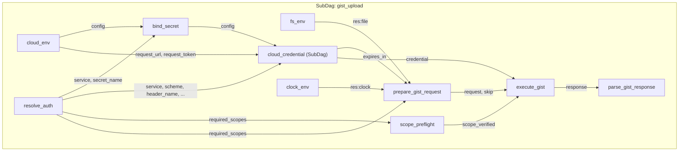

Inputs: `markdown`, `branch`, `remote_branch`, `base_ref` (optional)
Outputs: `url`, `ok`, `expires_at`
Internal resources: `fs_env` (Write), `clock_env`, credential chain

#### 4.2.2 Base Capability Units (Orchestration Level)

```
Capability        Unit                    Key Inputs                     Skip When
─────────────────────────────────────────────────────────────────────────────────────
Compilation       compilation.ensure      source + cargo meta + rustc    source unchanged
Codegen           codegen.ensure          DSL hashes + binary version    DSL unchanged
Git State         git.current_branch      .git/HEAD content              HEAD unchanged
Git State         git.remote_branches     .git/refs + HEAD               refs unchanged
Credential        credential.resolve      runtime_mode + source hash     within validity
  (local-dev)       env(GITHUB_TOKEN)     env var content hash           env unchanged
  (cloud)           gcp.wif_exchange      WIF provider + OIDC token      within token TTL
                    gcp.iam_impersonate   SA + STS token                 within token TTL
                    gcp.secret_access     project + secret + IAM token   within token TTL
Pure              gist_filename           branch + base_ref + timestamp  inputs unchanged
Network           github.gist_create      markdown + credential + meta   never (volatile)
```

These units appear identically in all three modes. Cross-workflow dedup via
`WorkIdentity` means running `make gist` then `make gist-diff` reuses
compilation, codegen, branch context, and credential from the first run.

#### 4.2.3 Credential Sub-Chain Detail

The `gist_upload` SubDag embeds a `cloud_credential` SubDag. The credential
chain is a 6-phase pipeline matching `AuthenticatePhaseBinding`:

| Phase | Node | Description |
|---|---|---|
| ResolveContext | `cloud_env` | Load `CloudSecretConfig` from env/file/profile |
| SelectFlow | `resolve_auth` | Hardcoded GitHub gist credential parameters |
| BindSecret | `bind_secret` | Bind secret name to config |
| AcquireBaseIdentity | `cloud_credential` | WIF exchange or local env read |
| ExchangeOrDerive | `cloud_credential` | IAM impersonation (if applicable) |
| FinalizeCredential | `scope_preflight` | Verify required scopes |

In `LocalDev` runtime mode, `cloud_credential` resolves from `GITHUB_TOKEN`
env var directly — no WIF/OIDC/Secret Manager network calls. This is the
expected fast path for all local tool invocations.

#### 4.2.4 Cross-Workflow Sharing with dag-viz

The `dag-viz` family uses the same `shared.gist_modes` base. Both `gist` and
`dag-viz` emit the same `branch_resolution` and `gist_upload` SubDags with
identical structure. Under the planner model, these resolve to the same
`WorkIdentity` entries and share ledger state:

```
gist.branch_resolution     ─┬─> WorkIdentity(process=git, unit=branch_resolution)
dag_viz.branch_resolution  ─┘

gist.credential.resolve    ─┬─> WorkIdentity(process=credential, unit=resolve_github)
dag_viz.credential.resolve ─┘
```

### 4.3 Snapshot Mode (WF16)

#### 4.3.1 Full Orchestration DAG

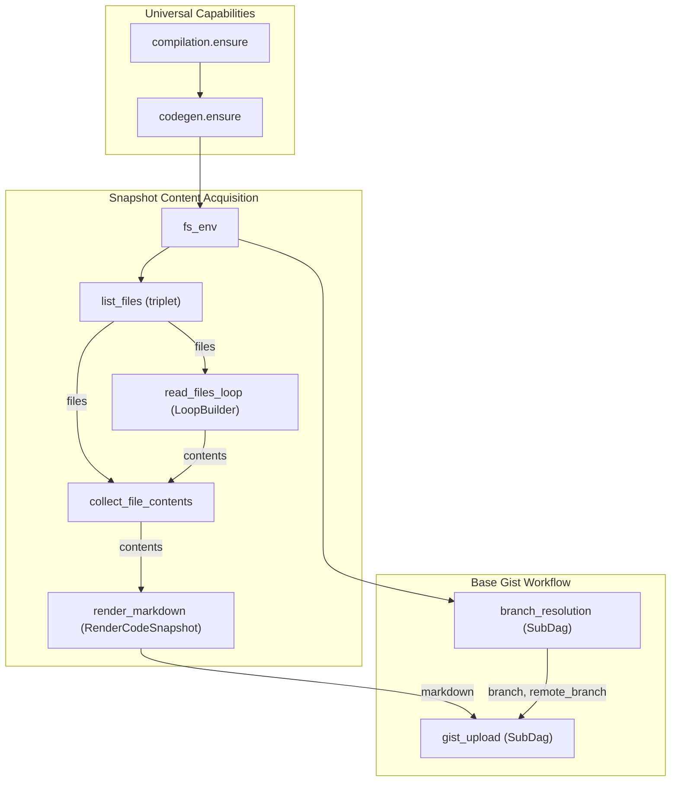

#### 4.3.2 Process-Level Node Inventory (from `graph.rs`)

| Node ID | Op | Kind | Capability |
|---|---|---|---|
| `fs_env` | `FsEnv(Write)` | environment root | Filesystem |
| `list_files` | transport triplet (`PrepareLsFiles` → `Execute` → `ParseLsFiles`) | SubDag | Git State |
| `read_files_loop` | `LoopBuilder(PrepareReadFile → Execute → ParseReadFile)` | SubDag | Filesystem |
| `collect_file_contents` | `CollectFileContentsOp` | pure | Pure |
| `render_markdown` | `MarkdownOp::RenderCodeSnapshot` | pure | Pure |
| `branch_resolution` | SubDag (2 parallel triplets) | SubDag | Git State |
| `gist_upload` | SubDag (credential chain + request pipeline) | SubDag | Credential + Network |

Total top-level nodes: 7 (excluding SubDag internals)

#### 4.3.3 Snapshot-Specific Key Inputs

| Unit | Key Inputs | Invalidation |
|---|---|---|
| `list_files` | `.git/index` hash + `extensions` filter | index changes |
| `read_files_loop` | file content hashes (from list_files output) | any file content changes |
| `collect_file_contents` | filenames + contents lists | upstream changes |
| `render_markdown` | `contents` map hash | upstream changes |

#### 4.3.4 Warm-State Execution Plan

```
Plan: compilation.ensure     CachedHit
      codegen.ensure         CachedHit
      list_files             CachedHit  (index unchanged)
      read_files_loop        CachedHit  (file contents unchanged)
      collect_file_contents  CachedHit  (pure, inputs unchanged)
      render_markdown        CachedHit  (pure, inputs unchanged)
      branch_resolution      CachedHit  (HEAD + refs unchanged)
      gist_upload            Execute    (volatile: creates new gist)
        └── credential       CachedHit  (within validity window)
        └── gist_create      Execute    (volatile side effect)
Execute set: 1 node (github.Gist.Create)
```

### 4.4 Diff Mode (WF17)

#### 4.4.1 Full Orchestration DAG

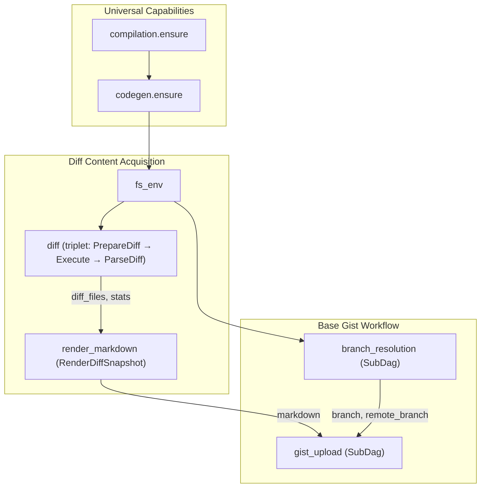

#### 4.4.2 Process-Level Node Inventory

| Node ID | Op | Kind | Capability |
|---|---|---|---|
| `fs_env` | `FsEnv(Write)` | environment root | Filesystem |
| `diff` | transport triplet (`PrepareDiff` → `Execute` → `ParseDiff`) | SubDag | Git State |
| `render_markdown` | `MarkdownOp::RenderDiffSnapshot` | pure | Pure |
| `branch_resolution` | SubDag (2 parallel triplets) | SubDag | Git State |
| `gist_upload` | SubDag (credential chain + request pipeline) | SubDag | Credential + Network |

Total top-level nodes: 5

#### 4.4.3 Diff-Specific Key Inputs

| Unit | Key Inputs | Invalidation |
|---|---|---|
| `diff` | `base_ref` hash + HEAD hash + `extensions` filter | either ref moves |
| `render_markdown` | `diff_files` map hash + `stats` hash | upstream changes |

#### 4.4.4 Augmentation Relationship

Diff mode shares all base units with snapshot. The only new units are `diff`
and `render_markdown(RenderDiffSnapshot)`. If `make gist` has already run,
`make gist-diff` reuses:

- `compilation.ensure` → CachedHit
- `codegen.ensure` → CachedHit
- `branch_resolution` → CachedHit
- `credential.resolve` → CachedHit
- `gist_upload` internal plumbing → CachedHit (except volatile transport)

Only `diff` and `render_markdown` are new (mode-specific) units.

### 4.5 Recent Mode (WF18)

#### 4.5.1 Full Orchestration DAG

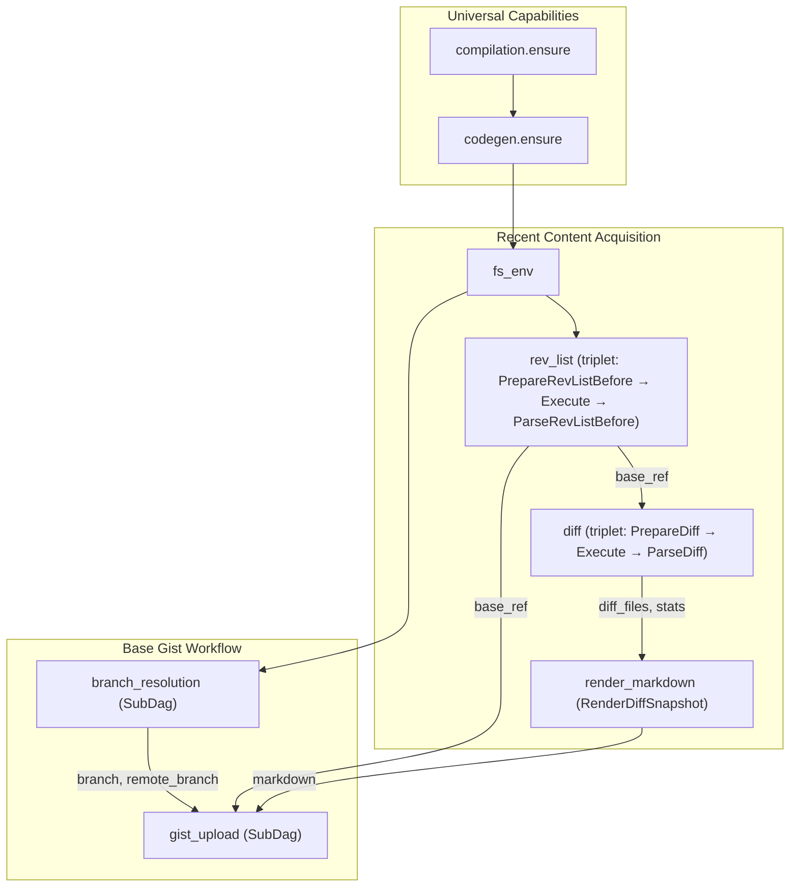

#### 4.5.2 Process-Level Node Inventory

| Node ID | Op | Kind | Capability |
|---|---|---|---|
| `fs_env` | `FsEnv(Write)` | environment root | Filesystem |
| `rev_list` | transport triplet (`PrepareRevListBefore` → `Execute` → `ParseRevListBefore`) | SubDag | Git State |
| `diff` | transport triplet (`PrepareDiff` → `Execute` → `ParseDiff`) | SubDag | Git State |
| `render_markdown` | `MarkdownOp::RenderDiffSnapshot` | pure | Pure |
| `branch_resolution` | SubDag (2 parallel triplets) | SubDag | Git State |
| `gist_upload` | SubDag (credential chain + request pipeline) | SubDag | Credential + Network |

Total top-level nodes: 6

#### 4.5.3 Recent-Specific Key Inputs

| Unit | Key Inputs | Invalidation |
|---|---|---|
| `rev_list` | git object store + `"3 days ago"` boundary | new commits in window |
| `diff` | `base_ref` from rev_list + HEAD hash | either changes |
| `render_markdown` | `diff_files` map hash + `stats` hash | upstream changes |

#### 4.5.4 Credential Cloud Override

Recent mode sets `GUNBC_CLOUD_CONFIG_REQUIRED=1` in the current Makefile. Under
the planner model, this becomes an explicit `runtime_mode: Cloud` input to the
credential unit, not an ambient env probe:

```rust
// Current (ambient env probing):
// @GUNBC_CLOUD_CONFIG_REQUIRED=1 cargo run -p gunbc-gist --bin gunbc-gist-recent

// Planner model (explicit typed input):
credential.resolve(runtime_mode: CloudRuntime::Cloud, ...)
```

The credential sub-chain keying from Section 4.2.3 applies, with each sub-step
(WIF exchange, IAM impersonation, Secret Manager access) independently cached
with TTL-aware keys.

#### 4.5.5 Augmentation Relationship

Recent = base + `[rev_list, diff, render_markdown]` + credential cloud override.
Shares all base units with snapshot and diff. If any prior gist mode has run:

- base units → CachedHit
- credential → CachedHit if within TTL (even for cloud path, since sub-steps
  are independently keyed)

### 4.6 Composition Summary

```
                        ┌─── snapshot: list_files → read_loop → collect → render_snapshot
                        │
base gist ──────────────┼─── diff: git_diff → render_diff
  (branch_resolution,   │
   gist_upload,         └─── recent: rev_list → git_diff → render_diff
   credential_chain)                + credential.resolve(Cloud)
```

### 4.7 Why These DAGs Are Minimal / Non-Redundant

1. Base workflow appears once as shared SubDags; modes compose, not duplicate.
2. Each content acquisition strategy has exactly the nodes it needs — no shared
   nodes are re-declared in mode-specific subgraphs.
3. Credential chain is a single SubDag within `gist_upload`; modes don't create
   their own credential paths.
4. Cross-mode and cross-tool dedup happens via `WorkIdentity` in the global
   ledger — no explicit wiring needed.
5. The only volatile node is `github.Gist.Create`. All upstream nodes are
   deterministic functions of their inputs and can be cached.
6. Recent mode's cloud credential override is a typed input change to the same
   credential unit, not a separate credential path.

---

## 5. Bootstrap Workflow (WF19-D)

### 5.1 Process-Level DAG (from `gunbc-dag/src/bootstrap/graph.rs`)

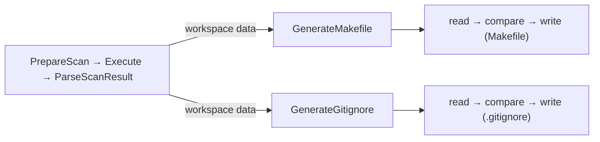

Nodes: 15, Edges: 21
Two parallel upsert chains.

### 5.2 Capability Decomposition

```
Capability        Unit                    Key Inputs                     Skip When
─────────────────────────────────────────────────────────────────────────────────────
Compilation       compilation.ensure      (shared)                       source unchanged
Codegen           codegen.ensure          (shared)                       DSL unchanged
Filesystem        workspace_scan          workspace crate structure      crate structure unchanged
Pure              generate_makefile       scan results                   inputs unchanged
Pure              generate_gitignore      scan results                   inputs unchanged
FS Write          upsert(Makefile)        generated content hash         content matches existing
FS Write          upsert(.gitignore)      generated content hash         content matches existing
```

### 5.3 Key Insight: Input-Keyed Upsert

The current bootstrap DAG does compare-before-write (content upsert). Under the
planner model, the upsert skip is a **consequence of input keying**: if the scan
results haven't changed, the generated content hasn't changed, so the write is
skipped before the generation step even runs. The content comparison is redundant
when keying is correct.

---

## 6. Makegen Workflow (WF19-D)

### 6.1 Process-Level DAG (from `gunbc-dag/src/makegen/graph.rs`)

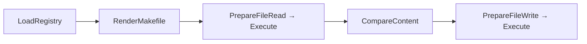

Nodes: 7, Edges: 9
Single upsert chain.

### 6.2 Capability Decomposition

```
Capability        Unit                    Key Inputs                     Skip When
─────────────────────────────────────────────────────────────────────────────────────
Compilation       compilation.ensure      (shared)                       source unchanged
Codegen           codegen.ensure          (shared)                       DSL unchanged
Pure              load_registry           tool registry content          registry unchanged
Pure              render_makefile         registry data                  inputs unchanged
FS Write          upsert(Makefile)        generated content hash         content matches existing
```

---

## 7. Pragma Workflow (WF19-D)

### 7.1 Process-Level DAG (from `gunbc-dag/src/pragma/graph.rs`)

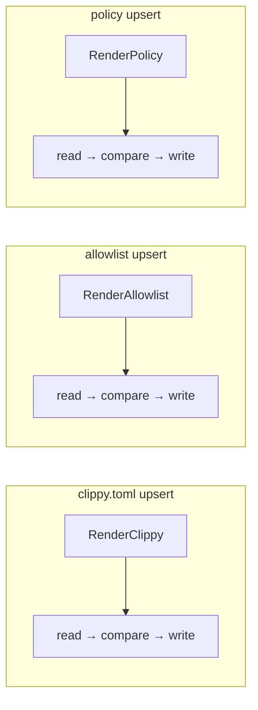

Nodes: 18, Edges: 24
Three independent parallel upsert chains (no inter-dependencies).

### 7.2 Capability Decomposition

```
Capability        Unit                    Key Inputs                     Skip When
─────────────────────────────────────────────────────────────────────────────────────
Compilation       compilation.ensure      (shared)                       source unchanged
Codegen           codegen.ensure          (shared)                       DSL unchanged
Pure              render_clippy           pragma config                  config unchanged
Pure              render_allowlist        pragma config                  config unchanged
Pure              render_policy           pragma config                  config unchanged
FS Write          upsert(clippy.toml)     generated content hash         matches existing
FS Write          upsert(allowlist)       generated content hash         matches existing
FS Write          upsert(policy)          generated content hash         matches existing
```

---

## 8. Deps Workflow (WF19-D)

### 8.1 Process-Level DAG (from `lib/tools/deps/src/graph.rs`)

**Install graph** (8 nodes):

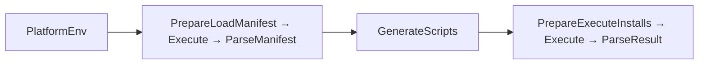

**Generate graph** (4 nodes):

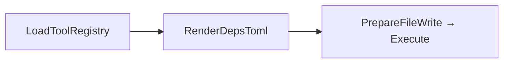

### 8.2 Capability Decomposition (Install)

```
Capability        Unit                    Key Inputs                     Skip When
─────────────────────────────────────────────────────────────────────────────────────
Compilation       compilation.ensure      (shared)                       source unchanged
Codegen           codegen.ensure          (shared)                       DSL unchanged
Pure              platform_env            platform detection             platform unchanged
FS Read           load_manifest           deps.toml content hash         manifest unchanged
Pure              generate_scripts        manifest + platform            inputs unchanged
Network           execute_installs        scripts + platform             volatile (installs)
```

---

## 9. DAG Viz Workflow (WF19-D)

### 9.1 Structural Relationship to Gist

`dag-viz` follows the same 3-mode pattern (snapshot, diff, recent) and shares
the same `gist_modes` base via `shared.gist_modes`. The content acquisition
produces a visualization instead of a code/diff snapshot, but the base workflow
(branch resolution, credential chain, gist upload) is structurally identical.

### 9.2 Capability Sharing

```
dag_viz.branch_resolution     ≡  gist.branch_resolution     (same WorkIdentity)
dag_viz.credential.resolve    ≡  gist.credential.resolve     (same WorkIdentity)
dag_viz.gist_upload           ≡  gist.gist_upload            (same WorkIdentity, different markdown input)
```

The viz-specific content acquisition (DAG serialization + rendering) is the only
unique capability. Everything else is shared with the gist family.

---

## 10. Admission and Resource Claims

### 10.1 Tool Workflow Resource Surface

| Resource | Access Mode | Consumers |
|---|---|---|
| `file:workspace` | Read | gist-snapshot (ls-files, file reads), bootstrap (scan), deps (manifest) |
| `file:workspace` | Write | bootstrap (upsert), makegen (upsert), pragma (upsert), testgen (upsert) |
| `file:generated` | Write | codegen (generated entrypoints) |
| `file:target` | Write | compilation (binary output) |
| `credential:github` | Read | gist (all), dag-viz (upload modes) |
| `credential:llm` | Read | review, LLM chat |
| `api:github_gist` | Write | gist (all), dag-viz (upload modes) |
| `clock` | Read | gist_upload (timestamp) |
| `ledger:workflow` | Write | planner (all workflows) |

### 10.2 Conflict Rules

1. `file:workspace(Write)` conflicts with `file:workspace(Write)` — bootstrap and
   makegen cannot run concurrently (both write to workspace).
2. `file:workspace(Read)` does not conflict with `file:workspace(Read)` — gist-snapshot
   and branch resolution can run in parallel.
3. `api:github_gist(Write)` does not conflict with itself (each creates a new gist).
4. `credential:github(Read)` does not conflict — shared read access.

---

## 11. Review Checklist (Approval Gate)

1. Canonical-vs-derived boundary is explicit and conflict-free.
2. DAGs are orchestration-only and do not inline authored process internals.
3. Base gist workflow appears once; modes augment, not duplicate.
4. Each process concept appears exactly once per workflow DAG.
5. Hierarchical views are present and consistent with flat orchestration DAGs.
6. Key computation is explicit-input only (no ambient probes).
7. `GUNBC_CLOUD_CONFIG_REQUIRED=1` replaced by typed `runtime_mode` input.
8. Upstream keying is context-free (`PortName` keyed), not orchestration-name keyed.
9. Ledger scope is global across workflows for cross-workflow reuse.
10. Admission derives from declared resource claims with fail-closed validation.
11. Compilation + codegen units shared across all workflows via WorkIdentity.
12. Credential sub-chain steps independently keyed with TTL-aware validity.
13. Base gist units shared with dag-viz family via WorkIdentity.
14. Content-upsert skip is consequence of input keying, not post-hoc comparison.
15. All non-volatile nodes are deterministic functions of their keyed inputs.
