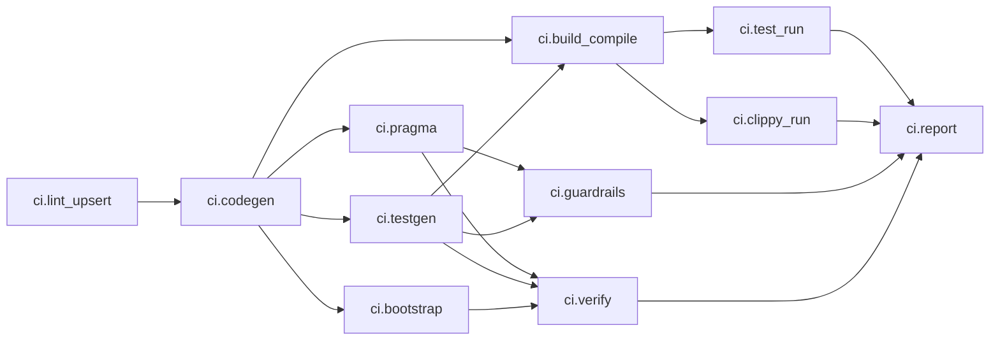
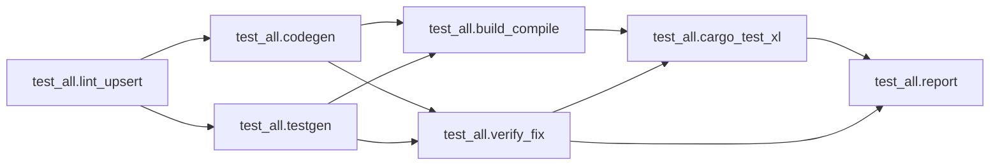

# WF1-D to WF4-D Design Pack (Workflow Planner)

Status: Draft for review  
Date: 2026-02-19  
Scope: `WF1-D`, `WF2-D`, `WF3-D`, `WF4-D` for planner-first `ci` and `test-all`

## 1. Read This First

This doc is DAG-centric and orchestration-centric:

1. It defines only the orchestration DAG for `ci` and `test-all`.
2. It does not redefine domain process semantics (codegen/testgen/pragma/build/etc).
3. Each orchestration node delegates to an existing process owner.
4. Minimality means no duplicated process units and no redundant orchestration edges.

## 2. Orchestration Unit Contract (WF1-D)

`WorkflowSpec` reuses existing graph primitives:

```rust
pub struct WorkflowSpec {
    pub id: WorkflowId,
    pub dag: Dag<WorkflowUnit>,
    pub policy_version: u32,
}

pub struct WorkflowUnit {
    pub op: WorkflowOp, // typed, closed op set
}
```

Planner/orchestration units are limited to:

1. `InvokeProcess(process_id)` for existing process definitions.
2. `Aggregate*` units for reduction/summary.
3. `Report` unit for terminal output.

Required ports for executable units:

1. input `after` (control fan-in)
2. output `commit` (control fan-out)
3. output `result` (`WorkflowResult` ADT)

Edge semantics:

1. `EdgeKind::Control`: ordering/readiness only.
2. `EdgeKind::DataFlow`: typed result payload flow.

No inlined process internals are allowed inside orchestration DAG units.

## 3. CI Orchestration DAG (WF1-D + WF4-D)

### 3.1 Visual DAG (Mermaid)



### 3.2 Process Ownership Map

| Orchestration Node | Delegates To | Source Of Truth |
|---|---|---|
| `ci.lint_upsert` | `lint-upsert` process | `Makefile`, tool orchestration in `gunbc-dag/src/makegen/registry.rs` |
| `ci.codegen` | codegen process | `gunbc-dag/src/bin/codegen.rs` |
| `ci.bootstrap` | bootstrap process | `gunbc-dag/src/bin/bootstrap.rs` |
| `ci.pragma` | pragma process | `gunbc-dag/src/bin/pragma.rs` |
| `ci.testgen` | testgen process | `gunbc-dag/src/bin/testgen.rs` |
| `ci.build_compile` | build process | `dsl/tools/build.dag` |
| `ci.test_run` | test process | `dsl/tools/build.dag` / cargo test invocation |
| `ci.clippy_run` | clippy process | `dsl/tools/build.dag` / clippy invocation |
| `ci.guardrails` | guardrail process | `dsl/pipelines/ci.dag` guardrail stage intent |
| `ci.verify` | verify process | `Makefile` verify target + generated checks |
| `ci.report` | planner report | workflow planner runtime |

### 3.3 Why This DAG Is Minimal / Non-Redundant

1. Each process concept appears exactly once as an orchestration node.
2. No node duplicates another node's process responsibility.
3. Edges are only immediate prerequisites; transitive edges are intentionally omitted.
4. Verify fan-in happens once (`ci.verify`), report fan-in happens once (`ci.report`).
5. Process internals stay in their own process definitions; orchestration DAG only composes them.

## 4. `test-all` Orchestration DAG (WF1-D + WF4-D)

### 4.1 Visual DAG (Mermaid)



### 4.2 Why This DAG Is Minimal / Non-Redundant

1. Generation steps (`codegen`, `testgen`) are single-producer units.
2. `build_compile` and `verify_fix` consume those producers; they do not re-declare them.
3. `cargo_test_xl` waits for exactly the two required readiness gates: build + verified artifacts.
4. No duplicate `testgen` or duplicate build producer nodes exist in orchestration space.
5. Warm-path skipping comes from key/ledger hits, not redundant orchestration branches.

## 5. Admission and Mutual Exclusion Model (WF2-D)

### 5.1 Resource Claims (Derived, Not Parallel Truth)

Claims are derived from declared resource ports + op class, using canonical
resource IDs and `AccessMode`:

1. `file:workspace`
2. `file:generated`
3. `file:manifest`
4. `file:target`
5. `ledger:workflow`
6. tool/resource handles (`tool:*`, `credential:*`, `api:*`) as read capabilities

### 5.2 Admission Rules

1. Conflict check uses canonicalized resource IDs + `AccessMode::conflicts_with`.
2. No side-table claim overrides are allowed.
3. Missing required claims on effectful ops fail at build/validation time.
4. Deterministic tie-break for equal-priority ready nodes: lexical `NodeId`.

## 6. Key/Ledger Causality Model (WF3-D)

### 6.1 No Ambient Inputs

Key computation is DAG-functional only:

```text
key = H(op_version, input_hashes, upstream_keys, policy_version)
```

Rules:

1. Inputs come from declared/wired ports only.
2. Env/toolchain variance must arrive via explicit input resources/ports.
3. Planner must not probe ambient OS state during key computation.

### 6.2 Canonical Structures

```rust
pub struct CanonicalKeyPayload {
    pub op_version: u32,
    pub input_hashes: BTreeMap<PortName, ContentHash>,
    pub upstream_keys: BTreeMap<NodeId, MaterializationDigest>,
    pub policy_version: u32,
}

pub struct RunLedgerEntry {
    pub node_id: NodeId,
    pub key: MaterializationKey,
    pub status: LedgerStatus,
    pub output_hashes: BTreeMap<PortName, ContentHash>,
    pub duration_ms: u64,
}

pub enum MissReason {
    NoPriorRun,
    InputChanged { port: PortName, old: ContentHash, new: ContentHash },
    UpstreamKeyChanged { upstream: NodeId, old: MaterializationDigest, new: MaterializationDigest },
    OpVersionChanged { old: u32, new: u32 },
    PolicyVersionChanged { old: u32, new: u32 },
    OutputMissing { port: PortName },
    OutputTampered { port: PortName, expected: ContentHash, actual: ContentHash },
    VolatileEffect { effect: Effect },
}
```

### 6.3 Atomic Ledger Persistence

1. write to temp path (`*.tmp.<pid>.<nonce>`)
2. flush + `fsync` temp file
3. atomic rename temp -> target
4. `fsync` parent directory

Corrupt/missing ledger behavior:

1. default fail-closed with actionable parse error
2. explicit recovery mode (`--rebuild-ledger`) required for reset

## 7. Downstream Coordination and Failure Semantics (WF4-D)

### 7.1 Commit/Result Separation

To avoid the report-finally trap:

1. process-invocation units must emit typed `WorkflowResult` payloads for both pass/fail outcomes of the invoked domain process,
2. those outcomes are modeled as data (`DomainSuccess` / `DomainFailure` / `ExecutionFailure`) on `result`,
3. units still emit `commit` once invocation is complete (even if domain outcome is failure),
4. `report` depends on completion commits and reads all result payloads.

### 7.2 Failure Propagation

1. `Skipped { blocked_by }` is used only when a unit never ran due to unmet prerequisite commits.
2. Domain failures do not skip report; they flow into report as typed results.
3. True execution-layer crashes still fail closed and are surfaced explicitly.

### 7.3 Validation Invariants

Reject a workflow spec if:

1. cycle exists in combined control/data edge graph
2. required control ports (`after`/`commit`) are missing
3. effectful ops lack declared resource dependencies
4. unknown/fallback op variant appears in executable graph

## 8. Markdown Visualization Guidance

For natural review in Markdown:

1. keep Mermaid DAGs (GitHub renders ` ```mermaid ` blocks natively),
2. keep node ownership map next to each DAG,
3. include minimality bullets under each DAG,
4. keep ADT snippets for miss/failure semantics adjacent to the DAG sections.

## 9. Review Checklist (Approval Gate)

1. DAGs are orchestration-only and do not inline process internals.
2. Each process concept appears exactly once per workflow DAG.
3. Report node runs for domain failures and receives typed result payloads.
4. Key computation is explicit-input only (no ambient probes).
5. Output tamper detection and volatile-effect miss reasons are modeled.
6. Admission derives from declared resource claims with fail-closed validation.
