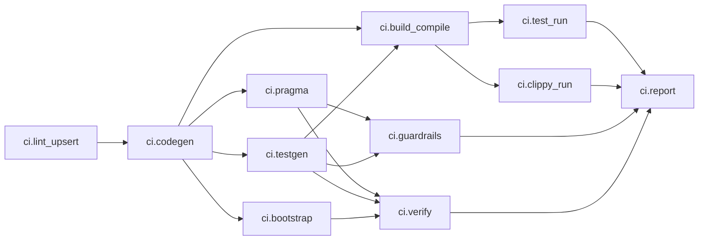
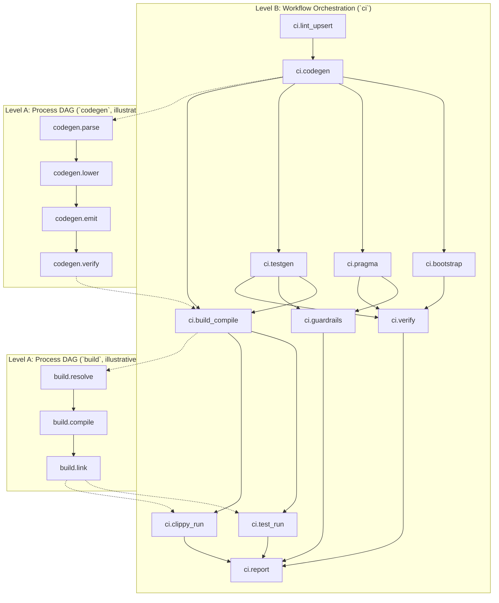
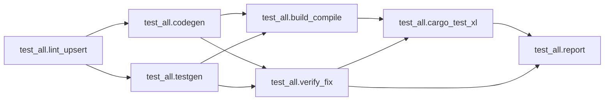
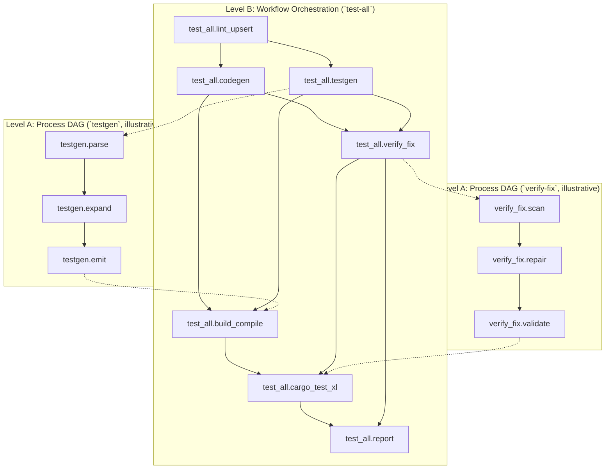
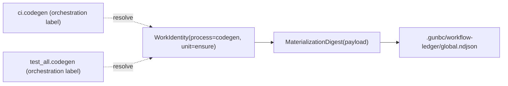

# WF1-D to WF4-D Design Pack (Workflow Views)

Status: Draft for review  
Date: 2026-02-19  
Scope: `WF1-D`, `WF2-D`, `WF3-D`, `WF4-D` for planner-first `ci` and `test-all`  
Canonical normative model: `docs/design/workflow-minimal-execution-model.md`

## Implementation Status

WF1/WF2/WF3 planner foundations now have an initial typed implementation in
`gunbc-dag::workflow`:

1. WF1 schema types and deterministic `ci` / `test-all` spec builders:
   - `workflow/schema.rs`
   - `workflow/process_registry.rs`
   - `workflow/spec_builders.rs`
2. WF2 fail-closed admission validation:
   - `workflow/admission.rs`
   - `workflow/errors.rs`
3. WF3 deterministic key/ledger + cached-hit rehydration:
   - `workflow/key.rs`
   - `workflow/ledger.rs`
   - `workflow/planner.rs`
4. Contract coverage:
   - `gunbc-dag/tests/workflow_schema_contracts.rs`
   - `gunbc-dag/tests/workflow_admission_contracts.rs`
   - `gunbc-dag/tests/workflow_key_ledger_contracts.rs`

WF4+ remains staged in subsequent implementation tasks.

## 1. Read This First

This pack is consolidated with the canonical model:

1. `docs/design/workflow-minimal-execution-model.md` is the normative source for
   workflow semantics, keys/ledger, flattening, and proof obligations.
2. This document is the WF1-WF4 review pack: concrete DAG views, ownership maps,
   workflow-specific constraints, and acceptance checklist.
3. If this document conflicts with the canonical model, canonical model wins.
4. Hierarchical diagrams here are authoring/review views; runtime execution still
   uses the flattened global DAG contract from the canonical model.

## 2. Orchestration Unit Contract (WF1-D)

`WorkflowSpec` reuses existing graph primitives:

```rust
pub struct WorkflowSpec {
    pub id: WorkflowId,
    pub dag: Dag<WorkflowUnit>,
    pub policy_version: u32,
}

pub struct WorkflowUnit {
    pub op: WorkflowOp, // typed, closed op set
}
```

Planner/orchestration units:

1. `InvokeProcessUnit(ProcessUnitRef)` for existing process definitions.
2. `Aggregate*` units for reduction/summary.
3. `Report` unit for terminal output.

`ProcessUnitRef` semantic contract:

1. each reference resolves to a typed process-unit spec in registry,
2. resolved process-unit semantic version/digest defines `op_version` for keying,
3. semantic changes to process behavior must update that semantic identity.

Required ports for executable units:

1. input `after` (control fan-in)
2. output `commit` (control fan-out)
3. output `result` (`WorkflowResult` ADT)

Edge semantics:

1. `EdgeKind::Control`: ordering/readiness only.
2. `EdgeKind::DataFlow`: typed result payload flow.

### 2.1 Consolidation Map (WF Tasks -> Canonical Sections)

| WF Task | This Pack (review view) | Canonical Source |
|---|---|---|
| `WF1-D` | Sections 2-4 | `workflow-minimal-execution-model.md` Sections 6, 6.1, 6.2 |
| `WF2-D` | Section 5 | `workflow-minimal-execution-model.md` Sections 6.3, 9 |
| `WF3-D` | Section 6 | `workflow-minimal-execution-model.md` Sections 7, 7.1, 8 |
| `WF4-D` | Section 7 | `workflow-minimal-execution-model.md` Sections 8, 9, 10 |

No inlined process internals are authored inside orchestration DAG units.

## 3. CI Orchestration DAG (WF1-D + WF4-D)

### 3.1 Flat Orchestration DAG (Mermaid)



### 3.2 Hierarchical DAG View (Mermaid)



### 3.3 Process Ownership Map

| Orchestration Node | Delegates To | Source Of Truth |
|---|---|---|
| `ci.lint_upsert` | `lint-upsert` process | `Makefile`, tool orchestration in `gunbc-dag/src/makegen/registry.rs` |
| `ci.codegen` | codegen process | `gunbc-dag/src/bin/codegen.rs` |
| `ci.bootstrap` | bootstrap process | `gunbc-dag/src/bin/bootstrap.rs` |
| `ci.pragma` | pragma process | `gunbc-dag/src/bin/pragma.rs` |
| `ci.testgen` | testgen process | `gunbc-dag/src/bin/testgen.rs` |
| `ci.build_compile` | build process | `dsl/tools/build.dag` |
| `ci.test_run` | test process | `dsl/tools/build.dag` / cargo test invocation |
| `ci.clippy_run` | clippy process | `dsl/tools/build.dag` / clippy invocation |
| `ci.guardrails` | guardrail process | `dsl/pipelines/ci.dag` guardrail stage intent |
| `ci.verify` | verify process | `Makefile` verify target + generated checks |
| `ci.report` | planner report | workflow planner runtime |

### 3.4 Why This DAG Is Minimal / Non-Redundant

1. Each process concept appears exactly once as an orchestration node.
2. No node duplicates another node's process responsibility.
3. Edges are only immediate prerequisites; transitive edges are intentionally omitted.
4. Verify fan-in happens once (`ci.verify`), report fan-in happens once (`ci.report`).
5. Process internals stay owned by process specs; runtime flattening handles
   inter/intra process dedup in one global graph.

## 4. `test-all` Orchestration DAG (WF1-D + WF4-D)

### 4.1 Flat Orchestration DAG (Mermaid)



### 4.2 Hierarchical DAG View (Mermaid)



### 4.3 Why This DAG Is Minimal / Non-Redundant

1. Generation steps (`codegen`, `testgen`) are single-producer units.
2. `build_compile` and `verify_fix` consume those producers; they do not re-declare them.
3. `cargo_test_xl` waits for exactly the two required readiness gates: build + verified artifacts.
4. No duplicate `testgen` or duplicate build producer nodes exist in orchestration space.
5. Warm-path skipping comes from key/ledger hits and global flatten+dedup, not
   redundant orchestration branches.

## 5. Admission and Mutual Exclusion Model (WF2-D)

Normative semantics are in canonical model Sections 6.3 and 9. Workflow-specific
resource surface for `ci`/`test-all`:

1. `file:workspace`
2. `file:generated`
3. `file:manifest`
4. `file:target`
5. `ledger:workflow`
6. `tool:*`, `credential:*`, `api:*` read capabilities

Admission rules:

1. claims derive from op + declared resource ports (no side tables),
2. conflicts use canonicalized resource IDs + `AccessMode::conflicts_with`,
3. missing required claims on effectful ops fail validation,
4. unordered concurrent writers to same resource fail preflight.

## 6. Key/Ledger Causality Model (WF3-D)

Normative semantics are in canonical model Sections 7, 7.1, and 8.

Workflow-specific requirements:

1. `upstream_keys` are keyed by consuming input `PortName`, not upstream node label,
2. workflow labels (`ci.*`, `test_all.*`) are explainability-only,
3. ledger is workspace-global and shared across entrypoints,
4. fan-in cardinality is preserved in key payloads for multi-producer ports,
5. canonical key payload encoding is versioned and deterministic (`key_format_version`).

### 6.1 Cross-Workflow WorkIdentity Unification (Mermaid)



This view is the key anti-redundancy guarantee for cross-workflow reuse.

### 6.2 Fan-In Keying + Rehydration Notes

1. Key payloads preserve multi-producer contributors per input port (vector/set
   semantics with deterministic ordering), not a single overwritten map value.
2. Cached-hit nodes must rehydrate output payloads from CAS before downstream
   dataflow/commit readiness is satisfied.
3. Missing CAS payload for an expected ledger hash is fail-closed.
4. If `result` is consumed via dataflow, cached hits must rehydrate the typed
   `result` payload (or typed summary/reference) from CAS/ledger-backed materialization.

## 7. Downstream Coordination and Failure Semantics (WF4-D)

Normative semantics are in canonical model Sections 8, 9, and 10.

WF-specific coordination requirements:

1. `commit` controls readiness; `result` carries domain outcomes,
2. domain failures still flow to `report` (no report-finally trap),
3. unresolved opaque process invocations are rejected before scheduling,
4. flattened global DAG preserves dependency and claim contracts before execution,
5. dependency gate is "committed with required outputs available," not
   "domain succeeded."

### 7.1 Domain-Failure Caching Policy

1. Domain-failure results are cacheable by policy because they are committed data.
2. Strict/minimal default: persist/replay typed bounded `result` summary/reference.
3. Planner surface must include explicit policy/flag for rerun behavior (`--force-run`
   or op-level volatile policy).
4. Full `result` payload persistence is optional per-unit policy when required.

## 8. Markdown Visualization Guidance

For natural review in Markdown:

1. keep both flat and hierarchical Mermaid blocks,
2. keep ownership map next to each workflow DAG,
3. keep key/ledger unification diagram near WF3-D section,
4. keep canonical references visible in each WF section.

## 9. Review Checklist (Approval Gate)

1. Canonical-vs-derived boundary is explicit and conflict-free.
2. DAGs are orchestration-only and do not inline authored process internals.
3. Each process concept appears exactly once per workflow DAG.
4. Hierarchical views are present and consistent with flat orchestration DAGs.
5. Key computation is explicit-input only (no ambient probes).
6. Upstream keying is context-free (`PortName` keyed), not orchestration-name keyed.
7. Ledger scope is global across workflows for cross-workflow reuse.
8. Admission derives from declared resource claims with fail-closed validation.
9. Flattening removes opaque process boundaries before scheduling/dedup.
10. Multi-producer fan-in is represented in key payload without contributor loss.
11. Cached-hit nodes rehydrate outputs from CAS before downstream dataflow.
12. Key encoding is canonical and versioned for deterministic hashing behavior.
