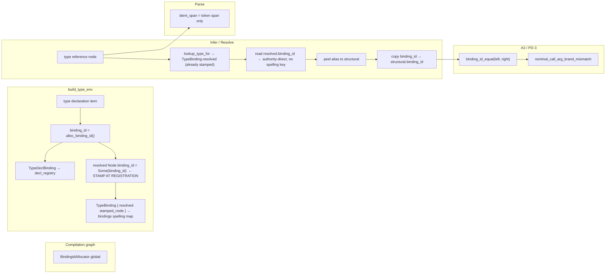

# Brand-Identity Side-Channel for A3/PD-3 Relation Refinement

**Status:** design report (docs only — no implementation in this lane)
**Work item:** `node://adhoc-8274731a-727`
**Session:** wise-ant-182
**Parent lane:** bright-owl-653 (Mgr-ENF-2 / A3 dogfood)

**Amendment (2026-06-09, codex review on #4579):** v1 incorrectly equated `InternTable` intern ids
with declaration identity. `InternTable` is a **spelling** table (`String → Int`,
`00_core.dag:1448`); `build_type_env` keys bindings by `intern(authored_name)` (`04_infer.dag:5193`),
so same-spelled declarations in different modules collapse to the same lookup key. The revised
design below separates **spelling id** (lookup) from **binding id** (declaration identity) and
bounds PD-3 phase-1 scope accordingly.

**Amendment 2 (2026-06-09, codex review on #4579 @ eb6b724):** v2 incorrectly reused `Node.ident`
for `BindingId` while `lookup_type_for` (`04_env.dag:62`) treats `node.ident` as the spelling-key
into `TypeEnv.bindings`. One field cannot carry both key domains. The design now adds an explicit
`Node.binding_id` side-channel; `Node.ident` keeps its lookup semantics unchanged.

**Amendment 4 (2026-06-09, follow-up #4579 codex sweep — this PR):**

1. **`decl_id_by_spelling` is removed from the stamp path entirely.** Deriving `binding_id`
   through a spelling key is a P1/P3 violation: `intern(name)` ids collapse same-spelled
   declarations from different modules to one key, so a spelling-keyed lookup cannot be the
   authority for declaration identity. Any `Map<Int, BindingId>` constructed by folding a
   spelling-keyed index inherits the same ambiguity silently (last insert wins = fabricated
   plausible output, not fail-closed).
2. **Stamp path is authority-direct.** `binding_id` is read from the `TypeDeclBinding.resolved`
   node that `build_type_env` constructs and stores in `TypeEnv.decl_registry`. That resolved
   node is the SAME `Node` value placed in `TypeBinding.resolved` (shared reference). After
   `lookup_type_for` returns `TypeBinding.resolved`, `binding_id` is already present on that
   node — no side-map lookup required.
3. **`decl_id_by_spelling` deferred to phase 2.** If a spelling→BindingId index is eventually
   needed for cross-module lookup optimisation, it must (a) be constructed fail-closed (collision
   = ambiguous/absent, never silent winner-pick), (b) never be a stamp source, and (c) only be
   introduced with cross-module collision tests. Phase 1 ships without it.
4. **Class sweep:** every path that feeds `binding_id` onto a `Node` was audited (§5.5 below);
   none goes through a spelling key.

**Amendment 3 (2026-06-09, inline + codex review on #4579 @ 99340b4):**

1. **`TypeBinding` is shared** between `TypeEnv.bindings` (type declarations) and inference
   `scope.locals` (params, let bindings, lambda slots — `04_infer.dag:996+`). Adding mandatory
   `binding_id` to `TypeBinding` would force fabricated declaration ids on value bindings (P2
   violation). **Fix:** introduce `TypeDeclBinding` for type-declaration registry only; leave
   `TypeBinding` unchanged for locals/params.
2. **Per-module `next_binding_id`** collides when `merge_envs` (`04_env.dag:128`) folds imported
   module envs — two modules can assign the same ids. **Fix:** graph-global `BindingId` allocator
   on the compilation unit; `decl_registry` keyed by globally unique ids.

---

## 1. Problem

A3/PD-3 bounded direct-call brand-twin rejection (`nominal_call_arg_brand_mismatch`,
`direct_call_arg_mismatch_diags` in `src/v2/04_infer.dag`) must distinguish nominal twins that
share a structural carrier (`UserId` vs `AccountId` both over `Refined<String>`) **after** type
resolution has peeled aliases to their structural targets.

Today's TRANSITION preserves brand through resolution by grafting the **reference-site
`ident_span`** onto the resolved structural node (`with_authored_identity` in
`src/v2/04_resolve.dag`). `authored_name_at` then reads the brand name from that span via
`source_text_at`.

This overloads `ident_span` with two incompatible authorities (P2 / Boundary Discipline):

| Authority | Correct carrier | Current hack |
|---------|-----------------|--------------|
| **Source location** — which token in the file this node names (diagnostics, parse span tests, `node_name_span`) | `ident_span → SourceSpan` | ✓ at parse sites |
| **Declaration identity** — which nominal declaration this type reference denotes (brand-twin compare after resolve) | *missing* | `ident_span` graft from reference site |

### Conflict symptoms

1. **Span dishonesty after resolve.** A resolved structural head (`n.name = "Refined"`) carries an
   `ident_span` pointing at the *reference* token (`UserId`), not the structural head's location.
   Diagnostic consumers that trust `ident_span` as "where this node's name lives in source" lie.

2. **`with_authored_identity` drops `ident`.** The graft copies `identity.ident_span` but keeps
   `structural.ident` (`v2_compiler_infer_resolve.rs:61–81`). Even if parse stamped declaration
   ids on references, resolution currently erases them.

3. **Dual naming split is already acknowledged but fragile.** `structural_carrier_template_name`
   (`04_types.dag:124–138`) reads structural head from `n.name` and brand from
   `authored_name_at` (→ grafted `ident_span`). The split works only while the ident_span hack
   holds; any path that clears or rewrites `ident_span` without updating brand silently breaks
   PD-3.

4. **Container resolve rebuilds children with inherited `ident_span`** (`04_resolve.dag:441–456`)
   without a declaration-identity field — brand can be lost or mis-attributed when element slots
   are re-wrapped.

---

## 2. Design goal

Preserve nominal **declaration identity** through alias peel and env resolve so that:

- `node_type_compatible` and PD-3 brand-twin checks compare **declaration identity**, not
  structural template equality alone.
- `ident_span` reverts to **source-location-only** authority (no brand graft).
- The mechanism is a named, typed side-channel — not a span overlay.

**Non-goals (this design):**

- Full v3 `DeclarationId` substrate migration on v2 `Node` (future convergence).
- Widening PD-3 beyond bounded direct-call arg check (callable positions, substrate skip).
- `where brand("…")` predicate evaluation (separate track; `brand` predicate facts live in
  `properties` today).

---

## 3. Recommended side-channel: `Node.binding_id` (separate from `Node.ident`)

### 3.1 Two authorities — do not conflate

| Concept | What it is today | Role |
|---------|------------------|------|
| **Spelling id** | `InternTable` intern (`String → Int`, `00_core.dag:1463`) | Fast lookup key for `TypeEnv.bindings`; **not** declaration identity |
| **Binding id** | *Missing* — must be introduced | One id per **type declaration registration** in `build_type_env`; survives alias peel |

`lookup_type_for` (`04_env.dag:62`) uses `node.ident` as a lookup hint into `bindings`. That is
correct for **name resolution**, but stamping `ident: Some(intern(table, type_name).id)` at parse
would only record spelling — two modules both declaring `type UserId = …` share the same intern
id and the later `map_insert` wins (`04_infer.dag:5254` `merge_envs`). PD-3 would then compare
spellings while claiming declaration identity (P1/P2 violation; codex #4579 finding).

### 3.2 BindingId — declaration-identity authority (not on `TypeBinding`)

`TypeBinding` (`04_env.dag:20`) is reused for **two roles** today:

| Role | Site | Examples |
|------|------|----------|
| Type-env lookup carrier | `TypeEnv.bindings` | kernel types, imported types, local `type` items |
| Value / scope carrier | `InferScope.locals`, `scope_locals` | fn params, let bindings, lambda slots (`04_infer.dag:996+`) |

Declaration identity belongs **only** on type declarations. Do **not** add `binding_id` to
`TypeBinding` — that would require fabricated ids for params and let bindings.

Introduce a separate registry entry:

```dag
type BindingId = Int   // opaque; assigned only by graph-global allocator

type TypeDeclBinding {
  binding_id: BindingId   // graph-global unique
  name: String
  resolved: Node
  provenance: SubValueRelation
}

// TypeBinding — UNCHANGED (no binding_id field)
type TypeBinding {
  name: String
  resolved: Node
  provenance: SubValueRelation
}
```

**TypeEnv extension** (`04_env.dag`):

```dag
type TypeEnv {
  bindings: Map<Int, TypeBinding>              // spelling-keyed lookup — unchanged role
  decl_registry: Map<BindingId, TypeDeclBinding>  // declaration identity authority
  // NOTE: decl_id_by_spelling absent — deferred to phase 2 (Amendment 4).
  // Stamp path is authority-direct: resolved Node already carries binding_id at registration.
  // … recursive_types, intern_table, etc. unchanged …
}
```

- `build_type_env` still inserts `TypeBinding` into `bindings` for `lookup_type_for`.
- For each **type declaration item**, insert `TypeDeclBinding` into `decl_registry` **and**
  stamp `binding_id = Some(binding_id)` directly onto the resolved `Node` that is shared
  between `TypeDeclBinding.resolved` and `TypeBinding.resolved`.  The stamp travels on the
  `Node` value — no spelling-keyed side map needed.
- Inference locals continue constructing plain `TypeBinding { … }` with **no** registry entry.

**Graph-global id namespace:** `BindingId` is allocated from a single counter on the
compilation graph (`FrontendResult` / reconcile pass), passed into each `build_type_env` call.
**Not** per-module `next_binding_id` — `merge_envs` (`04_env.dag:128`) concatenates envs from
kernel + imports + local module; per-invocation counters would collide on the same integers.

```dag
type BindingIdAllocator {
  next_id: Int
}

fn alloc_binding_id(alloc: BindingIdAllocator) -> (BindingId, BindingIdAllocator) { … }
```

`merge_envs` merges `decl_registry` alongside `bindings` — safe because ids are globally
unique at allocation time.  No `decl_id_by_spelling` merge: the field does not exist in
phase 1.

**Carrier on `Node`:** add `binding_id: BindingId?` on `Node` (`00_core.dag` substrate extension).
Stamped at **declaration-registration time** by `build_type_env` — **not** after lookup or
peel.  Infer/resolve only reads and propagates an already-present stamp; it never originates one.

| Field | Domain | Consumer |
|-------|--------|----------|
| `Node.ident` | Spelling intern id (or module IR id) | `lookup_type_for` → `bindings` — **unchanged** |
| `Node.binding_id` | `BindingId` (set at registration, propagated through peel) | PD-3 compare, `with_preserved_binding_id` peel graft |

Later `lookup_type_for` calls still resolve via spelling — never via `binding_id`.
`brand_name_at(binding_id, env)` reads `decl_registry`, not `bindings`.

### 3.3 Phase-1 scope bound (PD-3 dogfood)

Current PD-3 tests and adversarial suite are **single-module** (`pd3.brand_relation`,
`pd3.brand_call_reject`, etc. — all one `module` block). Phase-1 implementation:

- Assigns distinct `binding_id` per declaration within a module (`UserId` ≠ `AccountId` even when
  both alias to `Refined<String>`).
- Stamps `Node.binding_id = Some(binding_id)` at **registration time** in `build_type_env`
  (onto the resolved `Node` shared by `TypeDeclBinding` and `TypeBinding`) — **not** after
  lookup, **not** via spelling key.  Leaves `Node.ident` on the spelling-key path for any
  subsequent `lookup_type_for`.
- Does **not** claim cross-module same-spelling disambiguation is solved (that requires binding
  map key migration off spelling intern id — tracked as phase-2 escalation).
- **`decl_id_by_spelling` is deferred entirely (Amendment 4):** the spelling→BindingId side map
  is absent in phase 1.  Any future phase-2 spelling index must be fail-closed on collision
  (ambiguous/absent, never silent winner-pick) and must never be a stamp source.

Workers must **not** implement `intern(type_name).id` at parse as declaration identity.

### 3.4 Alternatives considered

| Option | Verdict |
|--------|---------|
| Continue `ident_span` graft | **Reject** — carrier conflict is the bug being fixed. |
| `intern(type_name).id` at parse (v1 design) | **Reject** — spelling id, not declaration identity (codex finding). |
| Reuse `Node.ident` for `BindingId` | **Reject** — `lookup_type_for` already consumes `ident` as spelling-key; dual domain violates P2 (codex amendment 2). |
| `decl_id_by_spelling` as stamp source | **Reject** — spelling-keyed map lookup is a P1/P3 violation: same-spelled declarations in different modules collapse to one key (Amendment 4). |
| `decl_id_by_spelling` as lookup-only phase-1 index | **Defer** — latent collision risk not worth shipping in single-module phase-1 where authority-direct stamp (resolved `Node.binding_id`) already covers the need. |
| New `Node.binding_id` field | **Accept** — explicit side-channel; one field, one authority. |
| `properties` entry `BrandIdentity` | **Reject** — properties are predicate/refinement carriers; identity would not propagate through resolve rebuild sites. |
| Compare via `TypeEnv` lookup only | **Reject** — call-site actual args after peel must carry identity locally. |
| Full v3 `DeclarationId` now | **Defer** — correct long-term target; `BindingId` is the minimal v2 staging form. |

---

## 4. Authority split (post-design)

| Fact | Authority | Accessor |
|------|-----------|----------|
| Source token text / diagnostic span | `ident_span` | `source_name_at(node, source_indices)` — rename intent of current `authored_name_at` for display/diagnostics |
| Spelling / lookup key | `InternTable` | `intern_find(table, name)` — **lookup only**, not PD-3 compare |
| Declaration identity (brand) | `TypeDeclBinding.binding_id` → `Node.binding_id` | `binding_id_at(node) -> BindingId?` |
| Declaration name string | `TypeDeclBinding.name` via `decl_registry` | `brand_name_at(binding_id, env) -> String` |
| Spelling lookup into env | `Node.ident` or name | `lookup_type_for` (unchanged) |
| Structural template head | `name` (post-resolve) | `structural_carrier_template_name` (unchanged) |

**Compatibility rule during migration:** when `binding_id == none` (kernel types, synthetic nodes,
pre-migration graphs), PD-3 falls back to `source_name_at` string compare (today's behavior).
Stamping is a **`build_type_env`-registration obligation**, not a parse-time intern and not a
post-lookup obligation — infer/resolve reads and propagates, never originates.

---

## 5. Data flow



### 5.1 `build_type_env` — register `TypeDeclBinding` per type declaration

**Sites to update** (`04_infer.dag` `build_type_env`, ~5192+; `04_env.dag`):

- Thread `BindingIdAllocator` from the compilation graph into every `build_type_env` call; bump
  once per **type declaration item** via `alloc_binding_id` (graph-global namespace).
- On each type-decl `map_insert` into `local_bindings`:
  1. Allocate `binding_id = alloc_binding_id(alloc)`.
  2. Construct the resolved `Node` with `binding_id = Some(binding_id)` stamped — this is the
     **authority stamp**; it must come from `alloc_binding_id`, not from any spelling key.
  3. Insert `TypeDeclBinding { binding_id, name, resolved: stamped_node, provenance }` into
     `decl_registry` (keyed by `binding_id`; globally unique).
  4. Insert plain `TypeBinding { resolved: stamped_node, … }` into `bindings` (spelling key
     unchanged) for `lookup_type_for`.  `TypeBinding` struct is **unchanged** (no `binding_id`
     field on it); the stamp lives on `Node.binding_id`.
  5. **Do NOT** record `decl_id_by_spelling` — that side map is absent in phase 1.
- **Do not** touch inference `scope.locals` / param `TypeBinding` construction — no `binding_id`,
  no `decl_registry` entry.
- `merge_envs` merges `decl_registry` alongside `bindings`; global ids prevent collision.
  No `decl_id_by_spelling` merge.

**Do not** assign `binding_id` from `intern(type_name)` — spelling and identity diverge by design.
**Do not** use per-module counters — imported env merge requires graph-global allocation.

### 5.2 Infer / resolve — read and propagate `binding_id`; replace ident_span graft

After `lookup_type_for` resolves a type reference, read `binding_id` directly from the
**resolved `Node`** returned by the lookup: `resolved.binding_id`.  The stamp is already on
the node — `build_type_env` placed it at declaration-registration time (see §5.1).  There is
no secondary lookup through a spelling key.

If the resolved node has `binding_id = none` (kernel synthetic, type-param slot, pre-migration
graph), the binding is not a type declaration; `binding_id` stays unset on the reference node.
Leave `node.ident` unchanged (spelling key for any later `lookup_type_for`).

Replace `with_authored_identity` with `with_preserved_binding_id`:

```dag
fn with_preserved_binding_id(identity: Node, structural: Node) -> Node {
  Node {
    name: structural.name,
    ident: structural.ident,                      // spelling lookup key — unchanged
    binding_id: identity.binding_id,              // declaration identity side-channel
    ident_span: structural.ident_span,            // honest source span
    // … all other fields from structural …
  }
}
```

Update call sites:

- `preserve_nominal_brand_on_resolve` — graft `identity.binding_id`, not `identity.ident_span`.
- `peel_nominal_alias_identity` — stamp `binding_id` from looked-up binding before peel; graft
  onto structural result.
- **Guard:** only graft when `identity.binding_id != none` and binding names differ from
  structural template spelling.

`topo_resolve_types` (`04_infer.dag:5743+`) passes pre-resolve nodes that already carry binding id
from binding registration.

### 5.3 Compare — PD-3 and relation refinement

**Primary change:** `nominal_call_arg_brand_mismatch` compares `BindingId` values:

```dag
fn nominal_call_arg_brand_mismatch(formal: Node, actual: Node, env: TypeEnv, source_indices: Map<String, NewlineIndex>) -> Bool {
  // … callable / empty guards unchanged …
  match (formal.binding_id, actual.binding_id) {
    (Some { value: f }, Some { value: a }) =>
      f != a   // distinct binding registrations
        && structural_carrier_template_name(n: formal, …) == structural_carrier_template_name(n: actual, …)
        && !is_declared_container_alias_spelling(…)
    _ =>
      // Fallback for unstamped nodes (kernel / synthetic): source_name_at string compare
      source_name_at(…) != source_name_at(…) && same structural carrier …
  }
}
```

**`node_type_compatible` leaf branch** (`04_types.dag:772`): prefer `binding_id` equality when both
sides stamped; fall back to `source_name_at` string equality. Container kind compare unchanged.

### 5.4 Reference nodes

`nominal_ref_node` should accept optional `binding_id: BindingId?`. Parse-time refs start with
`binding_id: none`; infer stamps after env bind. Spelling `ident` (if any) remains independent.

### 5.5 Class sweep — all `binding_id` feed paths (Amendment 4)

The following enumeration confirms every path that writes `Node.binding_id` derives from
the declaration authority (the registered `BindingId` from `alloc_binding_id`), not from a
spelling key.

| Feed site | Source of `binding_id` | Spelling-keyed? | Verdict |
|-----------|------------------------|-----------------|---------|
| `build_type_env` — type-decl registration | `alloc_binding_id(alloc)` — graph-global allocator, returns fresh `BindingId` | No | **AUTHORITY** |
| `with_preserved_binding_id` — peel/resolve graft | `identity.binding_id` — read from the pre-peel Node that was stamped at registration | No (propagates already-stamped value) | **SAFE** |
| `peel_nominal_alias_identity` — alias peel | reads `binding_id` from the looked-up `TypeBinding.resolved` node (stamped at registration) | No | **SAFE** |
| `TypeBinding.resolved.binding_id` — returned by `lookup_type_for` | set at `build_type_env` registration, not at lookup | No | **SAFE** |
| `nominal_ref_node` — parse-time ref construction | `binding_id: none` — no value set | N/A | **SAFE (none)** |
| Inference scope locals / param `TypeBinding` | not touched (no `binding_id` on `TypeBinding` struct, no `decl_registry` entry) | N/A | **SAFE (absent)** |
| `decl_id_by_spelling` lookup → stamp | **ELIMINATED** — this field does not exist in phase 1 | Would have been spelling-keyed | **REMOVED** |

**Rule that cannot be relaxed:** `Node.binding_id` must be set **only** from a value produced
by `alloc_binding_id` (direct) or copied from a node that was already stamped by
`alloc_binding_id` (transitive graft).  Any code that derives `binding_id` from
`intern(name).id`, from a spelling map lookup, or from any key that encodes the type's name
is in violation of this rule and P1/P3.

---

## 6. Invariant alignment

| Principle | How this design satisfies it |
|-----------|-------------------------------|
| **P2 Boundary Discipline** | `TypeBinding` (value/scope) vs `TypeDeclBinding` (declaration registry) vs `Node.binding_id` (stamped compare carrier) vs `Node.ident` (spelling lookup). No struct serves two roles. |
| **P1 Modeling Faithfulness** | `binding_id` allocated at type-decl registration with graph-global authority; not re-derived from spelling or fabricated on params/lets. |
| **P5 Progress Is Dissolution** | `TypeDeclBinding` + `decl_registry` + `Node.binding_id`; `TypeBinding` unchanged; deletes ident_span brand graft. |
| **E-6 target identity** | `BindingId` is the v2 staging form of v3 `DeclarationId`; convergence path is rename + substrate migration, not a second identity scheme. |

---

## 7. Migration / dissolution sequence

**Implementation atomicity (re-ratification condition):** deleting the `with_authored_identity`
ident_span graft and landing `with_preserved_binding_id` + `Node.binding_id` stamping **must
occur in the same implementation PR**. There must be no window where peel/resolution carries
neither ident_span brand nor `binding_id` — identity would silently drop and PD-3 would false-accept.

Ordered for minimal blast radius; each step has a consumer test.

| Step | Change | Consumer |
|------|--------|----------|
| 1 | Add `BindingId`, `TypeDeclBinding`, `BindingIdAllocator`; extend `Node.binding_id`; `decl_registry` on `TypeEnv`; helpers in `00_core.dag` + `04_env.dag` | unit tests in `infer_semantics.rs` |
| 2 | `build_type_env`: graph-global alloc; register `TypeDeclBinding` per type decl; stamp `Node.binding_id` on decl resolved nodes | `m1_brand_twins_over_refined_base_remain_distinct` |
| 3 | Infer/resolve: read `resolved.binding_id` (already stamped at step 2); `with_preserved_binding_id` propagates it through peel; **atomically** delete `with_authored_identity` ident_span graft (same PR — see atomicity note above) | same + parse span tests still green |
| 4 | PD-3 fns compare `binding_id` | `pd3_*`, `pd3_adversarial.rs` |
| 5 | Remove `authored_name_at` from compare path (use `binding_id` / `source_name_at` fallback) | grep audit |
| 6 | Remove `module_skips_direct_call_arg_check` when substrate compiles clean | ROADMAP `PD-3-DOGFOOD` row |
| 7 | *(Phase 2, escalate)* Migrate `bindings` map key off spelling intern id for cross-module same-spelling disambiguation | new tests for same-spelled types in different modules |

**Regression anchors (must stay green throughout):**

- `m1_brand_twins_over_refined_base_remain_distinct_in_infer_representation`
- `pd3_brand_twins_incompatible_at_node_type_compatible`
- `pd3_direct_call_rejects_brand_twin_mismatch` / `accepts_same_brand`
- `pd3_adversarial.rs` (false-accept + over-reject suites)
- `item_ident_spans_point_at_identifiers_not_keywords` (proves ident_span honesty restored)

---

## 8. Open questions (escalate if blocking implementation)

1. **Cross-module same-spelling declarations (phase 2).** `bindings` map keyed by spelling intern
   id cannot host two `type UserId` in different modules. Phase-1 bounds PD-3 to single-module
   dogfood. Phase-2 must either key `bindings` by `binding_id` with a secondary spelling index, or
   adopt qualified keys `(module_path, name)`. **Escalate before** implementing cross-module brand
   compare.

2. **Cross-module re-exports.** References should stamp the **defining binding's `binding_id`**
   (from `lookup_type_for` resolution target), not a re-export spelling. Re-export alias
   declarations get their own `binding_id` only when they are a distinct `type` item.

3. **`where brand("Char")` nominal refinements** (`dsl/std/types.dag`). Predicate brand string vs
   `binding_id` — PD-3 scope today is **type-alias twins**, not refinement brands. Separate hook.

4. **v4 wave-1 record types** (`nominal_distinctness_cross_call.dag`). Record-syntax declarations
   need `binding_id` at registration like alias declarations; wave-1 grammar gap is orthogonal.

---

## 9. Verdict

**Recommended path (amended):** introduce `TypeDeclBinding` + graph-global `BindingIdAllocator` +
`TypeEnv.decl_registry`; stamp `Node.binding_id` at **declaration-registration time** in
`build_type_env` (onto the resolved `Node` shared by `TypeDeclBinding` and `TypeBinding`) —
**not** via a post-lookup spelling index; keep `TypeBinding` unchanged for locals/params;
keep `Node.ident` for spelling lookup only; replace `with_authored_identity` ident_span graft
with authority-direct `binding_id` graft; PD-3 compares `Node.binding_id`.

**Implementation estimate:** one focused PR on `00_core.dag`, `04_env.dag`, `04_infer.dag`,
`04_resolve.dag`, `04_types.dag`, `compile.dag` (+ generated stage0 regen). New types/fields:
`TypeDeclBinding`, `BindingIdAllocator`, `Node.binding_id`, `TypeEnv.decl_registry`.
**`TypeBinding` struct unchanged. `decl_id_by_spelling` not introduced (deferred to phase 2).**

**Explicit non-implementation:**

- Do **not** add `binding_id` to `TypeBinding` (params/lets must not carry declaration identity).
- Do **not** use per-module `next_binding_id` (collides under `merge_envs`).
- Do **not** stamp `intern(type_name).id` at parse as declaration identity.
- Do **not** store `BindingId` in `Node.ident` — `lookup_type_for` must keep spelling-key semantics.
- Do **not** introduce `TypeEnv.decl_id_by_spelling` in phase 1 — any spelling→BindingId
  index is deferred to phase 2 with cross-module collision handling.  If ever introduced it
  must be fail-closed on collision and must never be a stamp source.

**This lane delivers:** design report only. Implementation is a follow-on worker item under the
same parent lane.
