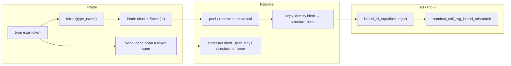

# Brand-Identity Side-Channel for A3/PD-3 Relation Refinement

**Status:** design report (docs only — no implementation in this lane)
**Work item:** `node://adhoc-8274731a-727`
**Session:** wise-ant-182
**Parent lane:** bright-owl-653 (Mgr-ENF-2 / A3 dogfood)

---

## 1. Problem

A3/PD-3 bounded direct-call brand-twin rejection (`nominal_call_arg_brand_mismatch`,
`direct_call_arg_mismatch_diags` in `src/v2/04_infer.dag`) must distinguish nominal twins that
share a structural carrier (`UserId` vs `AccountId` both over `Refined<String>`) **after** type
resolution has peeled aliases to their structural targets.

Today's TRANSITION preserves brand through resolution by grafting the **reference-site
`ident_span`** onto the resolved structural node (`with_authored_identity` in
`src/v2/04_resolve.dag`). `authored_name_at` then reads the brand name from that span via
`source_text_at`.

This overloads `ident_span` with two incompatible authorities (P2 / Boundary Discipline):

| Authority | Correct carrier | Current hack |
|---------|-----------------|--------------|
| **Source location** — which token in the file this node names (diagnostics, parse span tests, `node_name_span`) | `ident_span → SourceSpan` | ✓ at parse sites |
| **Declaration identity** — which nominal declaration this type reference denotes (brand-twin compare after resolve) | *missing* | `ident_span` graft from reference site |

### Conflict symptoms

1. **Span dishonesty after resolve.** A resolved structural head (`n.name = "Refined"`) carries an
   `ident_span` pointing at the *reference* token (`UserId`), not the structural head's location.
   Diagnostic consumers that trust `ident_span` as "where this node's name lives in source" lie.

2. **`with_authored_identity` drops `ident`.** The graft copies `identity.ident_span` but keeps
   `structural.ident` (`v2_compiler_infer_resolve.rs:61–81`). Even if parse stamped declaration
   ids on references, resolution currently erases them.

3. **Dual naming split is already acknowledged but fragile.** `structural_carrier_template_name`
   (`04_types.dag:124–138`) reads structural head from `n.name` and brand from
   `authored_name_at` (→ grafted `ident_span`). The split works only while the ident_span hack
   holds; any path that clears or rewrites `ident_span` without updating brand silently breaks
   PD-3.

4. **Container resolve rebuilds children with inherited `ident_span`** (`04_resolve.dag:441–456`)
   without a declaration-identity field — brand can be lost or mis-attributed when element slots
   are re-wrapped.

---

## 2. Design goal

Preserve nominal **declaration identity** through alias peel and env resolve so that:

- `node_type_compatible` and PD-3 brand-twin checks compare **declaration identity**, not
  structural template equality alone.
- `ident_span` reverts to **source-location-only** authority (no brand graft).
- The mechanism is a named, typed side-channel — not a span overlay.

**Non-goals (this design):**

- Full v3 `DeclarationId` substrate migration on v2 `Node` (future convergence).
- Widening PD-3 beyond bounded direct-call arg check (callable positions, substrate skip).
- `where brand("…")` predicate evaluation (separate track; `brand` predicate facts live in
  `properties` today).

---

## 3. Recommended side-channel: `Node.ident` (intern-table declaration id)

### Why `Node.ident`

v2 already models declaration identity infrastructure:

```62:67:src/v2/04_env.dag
fn lookup_type_for(env: TypeEnv, node: Node) -> Node? {
  match node.ident {
    Some { value: id } => lookup_type(env: env, ident: id)
    None => lookup_type_by_name(env: env, name: authored_name(env: env, node: node))
  }
}
```

- `InternTable` is built at parse and carried on `FrontendResult`.
- `TypeEnv.bindings` is keyed by intern id (`04_infer.dag:5193+`).
- Module/import nodes already stamp `ident` at parse (`02_parse.dag:883,947`).

**Gap:** type reference nodes (`leaf_type_node`, `parse_type_expr`, alias RHS, call-site inferred
types) do **not** stamp `ident`. Brand comparison falls back to `authored_name_at` → `ident_span`
text.

Using `Node.ident` as the brand side-channel is **dissolution, not new substrate**: the field and
env lookup path exist; A3/PD-3 needs them wired through parse → resolve → peel → compare.

### Alternatives considered

| Option | Verdict |
|--------|---------|
| Continue `ident_span` graft | **Reject** — carrier conflict is the bug being fixed. |
| New `Node.brand_id` field | **Defer** — duplicates `ident` semantics; only justified if module `ident` and type-ref `ident` must diverge (no evidence today). |
| `properties` entry `BrandIdentity` | **Reject** — properties are predicate/refinement carriers; identity would not propagate through the dozens of `Node { … }` rebuild sites in resolve. |
| Compare via `TypeEnv` lookup only | **Reject** — call-site actual args after `peel_nominal_alias_identity` must carry identity locally; env binding name is not always reachable. |

---

## 4. Authority split (post-design)

| Fact | Authority | Accessor |
|------|-----------|----------|
| Source token text / diagnostic span | `ident_span` | `source_name_at(node, source_indices)` — **rename intent** of current `authored_name_at` for display/diagnostics |
| Declaration identity (brand) | `ident` (+ `InternTable`) | `declaration_identity_at(node) -> Int?` |
| Declaration name string | `intern_str(table, ident)` | `brand_name_at(node, env) -> String` |
| Structural template head | `name` (post-resolve) | `structural_carrier_template_name` (unchanged) |

**Compatibility rule during migration:** `brand_name_at` falls back to `source_name_at` when
`ident == none` (kernel types, synthetic nodes, pre-migration graphs). PD-3 tests become the
consumer that forces `ident` stamping on user-module type refs.

---

## 5. Data flow



### 5.1 Parse — stamp `ident` on every type reference node

**Sites to update** (`02_parse.dag` / `v2_compiler_parse.rs`):

- `leaf_type_node` / `parse_type_expr` simple refs: `ident: Some(intern(table, type_name).id)`.
- Applied types (`List<T>`): container node gets `ident` for `List`; args get their own.
- Alias RHS leaf refs: same stamp as use-site.
- **Do not** stamp `ident` on structural heads created by resolve (synthetic `Refined` expansion).

`ident_span` continues to point at the authored token — no semantic change at parse.

### 5.2 Resolve — replace ident_span graft with ident graft

Replace `with_authored_identity` with `with_preserved_declaration_identity`:

```dag
fn with_preserved_declaration_identity(identity: Node, structural: Node) -> Node {
  Node {
    name: structural.name, ident: identity.ident,   // ← side-channel
    ident_span: structural.ident_span,              // ← honest source span
    // … all other fields from structural …
  }
}
```

Update call sites:

- `preserve_nominal_brand_on_resolve` — graft `identity.ident`, not `identity.ident_span`.
- `peel_nominal_alias_identity` — same.
- **Guard:** only graft when `identity.ident != none` and brand differs from structural template
  (same condition as today, but compare via `brand_name_at` / `ident`).

`topo_resolve_types` paths that call `preserve_nominal_brand_on_resolve` (`04_infer.dag:5743+`)
remain; they gain correct identity preservation for free once `pre` nodes carry `ident`.

### 5.3 Compare — PD-3 and relation refinement

**Primary change:** `nominal_call_arg_brand_mismatch` compares declaration ids:

```dag
fn nominal_call_arg_brand_mismatch(formal: Node, actual: Node, env: TypeEnv, source_indices: Map<String, NewlineIndex>) -> Bool {
  // … callable / empty guards unchanged …
  match (formal.ident, actual.ident) {
    (Some { value: f }, Some { value: a }) =>
      f != a
        && structural_carrier_template_name(n: formal, …) == structural_carrier_template_name(n: actual, …)
        && !is_declared_container_alias_spelling(…)
    _ =>
      // Fallback for unstamped nodes (kernel / synthetic): string brand compare
      brand_name_at(…) != brand_name_at(…) && same structural carrier …
  }
}
```

**`node_type_compatible` leaf branch** (`04_types.dag:772`): prefer `ident` equality when both
sides stamped; fall back to `brand_name_at` string equality. Container branches that compare
`authored_name_at` for container kind should use `brand_name_at` only when checking **element
slot** brand twins — container **kind** compare stays on `authored_name_at` / canonical template
(unchanged).

### 5.4 Env binding registration

When `build_type_env` registers a type (`04_infer.dag:5192+`), the `TypeBinding.resolved` node
should carry `ident: Some(item_ident)` so env round-trips reinforce the same id. Reference nodes
created by `nominal_ref_node` should accept `ident` parameter.

---

## 6. Invariant alignment

| Principle | How this design satisfies it |
|-----------|-------------------------------|
| **P2 Boundary Discipline** | One authority per fact: span ≠ identity. |
| **P1 Modeling Faithfulness** | Declaration identity grounds in `InternTable` (shared CS string-intern / symbol-table pattern), not source-text re-parse. |
| **P5 Progress Is Dissolution** | Extends existing `ident` + `lookup_type_for` rather than adding parallel brand state. |
| **E-6 target identity** | Aligns v2 compare path with v3 `DeclarationId` direction without requiring v3 migration first. |

---

## 7. Migration / dissolution sequence

Ordered for minimal blast radius; each step has a consumer test.

| Step | Change | Consumer |
|------|--------|----------|
| 1 | Add `declaration_identity_at`, `brand_name_at` helpers in `00_core.dag` | unit tests in `infer_semantics.rs` |
| 2 | Parse: stamp `ident` on type ref nodes | `m1_brand_twins_over_refined_base_remain_distinct` |
| 3 | `with_preserved_declaration_identity`; delete ident_span graft | same + parse span tests still green |
| 4 | PD-3 fns use ident compare | `pd3_*`, `pd3_adversarial.rs` |
| 5 | Remove `ident_span` brand dependency from `authored_name_at` call sites in compare path | grep audit |
| 6 | Delete `with_authored_identity` | — |
| 7 | Remove `module_skips_direct_call_arg_check` when substrate compiles clean | ROADMAP `PD-3-DOGFOOD` row |

**Regression anchors (must stay green throughout):**

- `m1_brand_twins_over_refined_base_remain_distinct_in_infer_representation`
- `pd3_brand_twins_incompatible_at_node_type_compatible`
- `pd3_direct_call_rejects_brand_twin_mismatch` / `accepts_same_brand`
- `pd3_adversarial.rs` (false-accept + over-reject suites)
- `item_ident_spans_point_at_identifiers_not_keywords` (proves ident_span honesty restored)

---

## 8. Open questions (escalate if blocking implementation)

1. **Cross-module re-exports.** If module B re-exports type `UserId` from module A, do references
   in B stamp A's binding id or a B-local alias id? Recommendation: **canonical binding id from
   defining module** (same as `lookup_type_for` resolution target); re-export is spelling, not a new
   declaration.

2. **`where brand("Char")` nominal refinements** (`dsl/std/types.dag`). Predicate brand string vs
   declaration `ident` — PD-3 scope today is **type-alias twins**, not refinement brands.
   Refinement brand compare is a separate relation hook; do not conflate in step 4.

3. **v4 wave-1 record types** (`nominal_distinctness_cross_call.dag`). Record-syntax `type IntentId
   { value: String }` may not lower to alias+brand yet. Side-channel design still applies once
   those declarations register distinct `ident` ids; wave-1 grammar gap is orthogonal.

---

## 9. Verdict

**Recommended path:** wire `Node.ident` as the declaration-identity side-channel; replace
`with_authored_identity` ident_span graft with ident graft; split accessors so `ident_span` is
source-location-only and PD-3 compares intern ids.

**Implementation estimate:** one focused PR on `00_core.dag`, `02_parse.dag`, `04_resolve.dag`,
`04_types.dag`, `04_infer.dag` (+ generated stage0 regen). No new `Node` fields required.

**This lane delivers:** design report only. Implementation is a follow-on worker item under the
same parent lane.
