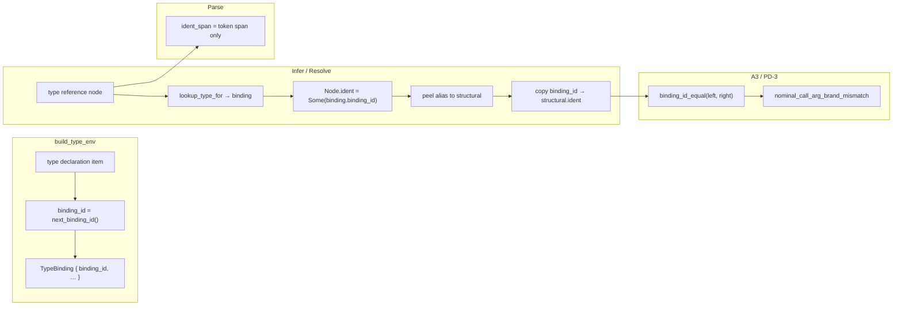

# Brand-Identity Side-Channel for A3/PD-3 Relation Refinement

**Status:** design report (docs only — no implementation in this lane)
**Work item:** `node://adhoc-8274731a-727`
**Session:** wise-ant-182
**Parent lane:** bright-owl-653 (Mgr-ENF-2 / A3 dogfood)

**Amendment (2026-06-09, codex review on #4579):** v1 incorrectly equated `InternTable` intern ids
with declaration identity. `InternTable` is a **spelling** table (`String → Int`,
`00_core.dag:1448`); `build_type_env` keys bindings by `intern(authored_name)` (`04_infer.dag:5193`),
so same-spelled declarations in different modules collapse to the same lookup key. The revised
design below separates **spelling id** (lookup) from **binding id** (declaration identity) and
bounds PD-3 phase-1 scope accordingly.

---

## 1. Problem

A3/PD-3 bounded direct-call brand-twin rejection (`nominal_call_arg_brand_mismatch`,
`direct_call_arg_mismatch_diags` in `src/v2/04_infer.dag`) must distinguish nominal twins that
share a structural carrier (`UserId` vs `AccountId` both over `Refined<String>`) **after** type
resolution has peeled aliases to their structural targets.

Today's TRANSITION preserves brand through resolution by grafting the **reference-site
`ident_span`** onto the resolved structural node (`with_authored_identity` in
`src/v2/04_resolve.dag`). `authored_name_at` then reads the brand name from that span via
`source_text_at`.

This overloads `ident_span` with two incompatible authorities (P2 / Boundary Discipline):

| Authority | Correct carrier | Current hack |
|---------|-----------------|--------------|
| **Source location** — which token in the file this node names (diagnostics, parse span tests, `node_name_span`) | `ident_span → SourceSpan` | ✓ at parse sites |
| **Declaration identity** — which nominal declaration this type reference denotes (brand-twin compare after resolve) | *missing* | `ident_span` graft from reference site |

### Conflict symptoms

1. **Span dishonesty after resolve.** A resolved structural head (`n.name = "Refined"`) carries an
   `ident_span` pointing at the *reference* token (`UserId`), not the structural head's location.
   Diagnostic consumers that trust `ident_span` as "where this node's name lives in source" lie.

2. **`with_authored_identity` drops `ident`.** The graft copies `identity.ident_span` but keeps
   `structural.ident` (`v2_compiler_infer_resolve.rs:61–81`). Even if parse stamped declaration
   ids on references, resolution currently erases them.

3. **Dual naming split is already acknowledged but fragile.** `structural_carrier_template_name`
   (`04_types.dag:124–138`) reads structural head from `n.name` and brand from
   `authored_name_at` (→ grafted `ident_span`). The split works only while the ident_span hack
   holds; any path that clears or rewrites `ident_span` without updating brand silently breaks
   PD-3.

4. **Container resolve rebuilds children with inherited `ident_span`** (`04_resolve.dag:441–456`)
   without a declaration-identity field — brand can be lost or mis-attributed when element slots
   are re-wrapped.

---

## 2. Design goal

Preserve nominal **declaration identity** through alias peel and env resolve so that:

- `node_type_compatible` and PD-3 brand-twin checks compare **declaration identity**, not
  structural template equality alone.
- `ident_span` reverts to **source-location-only** authority (no brand graft).
- The mechanism is a named, typed side-channel — not a span overlay.

**Non-goals (this design):**

- Full v3 `DeclarationId` substrate migration on v2 `Node` (future convergence).
- Widening PD-3 beyond bounded direct-call arg check (callable positions, substrate skip).
- `where brand("…")` predicate evaluation (separate track; `brand` predicate facts live in
  `properties` today).

---

## 3. Recommended side-channel: `BindingId` on `Node.ident`

### 3.1 Two authorities — do not conflate

| Concept | What it is today | Role |
|---------|------------------|------|
| **Spelling id** | `InternTable` intern (`String → Int`, `00_core.dag:1463`) | Fast lookup key for `TypeEnv.bindings`; **not** declaration identity |
| **Binding id** | *Missing* — must be introduced | One id per **type declaration registration** in `build_type_env`; survives alias peel |

`lookup_type_for` (`04_env.dag:62`) uses `node.ident` as a lookup hint into `bindings`. That is
correct for **name resolution**, but stamping `ident: Some(intern(table, type_name).id)` at parse
would only record spelling — two modules both declaring `type UserId = …` share the same intern
id and the later `map_insert` wins (`04_infer.dag:5254` `merge_envs`). PD-3 would then compare
spellings while claiming declaration identity (P1/P2 violation; codex #4579 finding).

### 3.2 BindingId — the actual declaration-identity authority

Introduce `BindingId` as a monotonic `Int` assigned when `build_type_env` registers each type
declaration item (one fresh id per `map_insert` into `local_bindings`, independent of spelling).

```dag
type TypeBinding {
  name: String
  resolved: Node
  provenance: SubValueRelation
  binding_id: BindingId   // NEW — declaration identity; assigned at registration
}
```

**Carrier on `Node`:** reuse existing `Node.ident: Int?` to hold `BindingId` on type nodes after
env bind / resolve peel. This is a **semantic rebind** of the field for type-reference nodes:
`ident` means "which `TypeBinding` declared this nominal," not "which spelling token."

Module/import parse nodes (`02_parse.dag:883`) may continue using `ident` for module IR ids;
type-reference stamping is a separate path gated on `binding_id != none`.

### 3.3 Phase-1 scope bound (PD-3 dogfood)

Current PD-3 tests and adversarial suite are **single-module** (`pd3.brand_relation`,
`pd3.brand_call_reject`, etc. — all one `module` block). Phase-1 implementation:

- Assigns distinct `binding_id` per declaration within a module (`UserId` ≠ `AccountId` even when
  both alias to `Refined<String>`).
- Stamps `Node.ident = Some(binding_id)` after env lookup / alias peel — **not at parse**.
- Does **not** claim cross-module same-spelling disambiguation is solved (that requires binding
  map key migration off spelling intern id — tracked as phase-2 escalation).

Workers must **not** implement `intern(type_name).id` at parse as declaration identity.

### 3.4 Alternatives considered

| Option | Verdict |
|--------|---------|
| Continue `ident_span` graft | **Reject** — carrier conflict is the bug being fixed. |
| `intern(type_name).id` at parse (v1 design) | **Reject** — spelling id, not declaration identity (codex finding). |
| New `Node.brand_id` field | **Defer** — `Node.ident` is an unused slot on type-ref nodes; rebind before adding fields. |
| `properties` entry `BrandIdentity` | **Reject** — properties are predicate/refinement carriers; identity would not propagate through resolve rebuild sites. |
| Compare via `TypeEnv` lookup only | **Reject** — call-site actual args after peel must carry identity locally. |
| Full v3 `DeclarationId` now | **Defer** — correct long-term target; `BindingId` is the minimal v2 staging form. |

---

## 4. Authority split (post-design)

| Fact | Authority | Accessor |
|------|-----------|----------|
| Source token text / diagnostic span | `ident_span` | `source_name_at(node, source_indices)` — rename intent of current `authored_name_at` for display/diagnostics |
| Spelling / lookup key | `InternTable` | `intern_find(table, name)` — **lookup only**, not PD-3 compare |
| Declaration identity (brand) | `TypeBinding.binding_id` → `Node.ident` | `binding_id_at(node) -> BindingId?` |
| Declaration name string | `TypeBinding.name` | `brand_name_at(binding_id, env) -> String` |
| Structural template head | `name` (post-resolve) | `structural_carrier_template_name` (unchanged) |

**Compatibility rule during migration:** when `binding_id == none` (kernel types, synthetic nodes,
pre-migration graphs), PD-3 falls back to `source_name_at` string compare (today's behavior).
Stamping is a post-`build_type_env` / post-lookup obligation, not a parse-time intern.

---

## 5. Data flow



### 5.1 `build_type_env` — assign `binding_id` per declaration

**Sites to update** (`04_infer.dag` `build_type_env`, ~5192+):

- Maintain `next_binding_id: Int` counter per `build_type_env` invocation (or per compilation
  graph — pick one authority; per-graph is simpler for cross-module phase-2).
- On each `map_insert` into `local_bindings`, assign a fresh `binding_id` on the `TypeBinding`.
- Set `TypeBinding.resolved.ident = Some(binding_id)` on the registered node so env round-trips
  carry identity.
- **Keep** `item_ident = intern(authored_name).id` as the `bindings` map **lookup key** for now
  (spelling-keyed map is a known limitation; binding_id is the compare authority).

**Do not** assign `binding_id` from `intern(type_name)` — spelling and identity diverge by design.

### 5.2 Infer / resolve — stamp `binding_id` after lookup, replace ident_span graft

After `lookup_type_for` resolves a type reference to a `TypeBinding`, stamp
`node.ident = Some(binding.binding_id)`.

Replace `with_authored_identity` with `with_preserved_binding_id`:

```dag
fn with_preserved_binding_id(identity: Node, structural: Node) -> Node {
  Node {
    name: structural.name,
    ident: identity.ident,              // BindingId side-channel
    ident_span: structural.ident_span,  // honest source span
    // … all other fields from structural …
  }
}
```

Update call sites:

- `preserve_nominal_brand_on_resolve` — graft `identity.ident` (binding id), not `identity.ident_span`.
- `peel_nominal_alias_identity` — stamp from looked-up binding before peel; graft binding id onto
  structural result.
- **Guard:** only graft when `identity.ident != none` and binding names differ from structural
  template spelling.

`topo_resolve_types` (`04_infer.dag:5743+`) passes pre-resolve nodes that already carry binding id
from binding registration.

### 5.3 Compare — PD-3 and relation refinement

**Primary change:** `nominal_call_arg_brand_mismatch` compares `BindingId` values:

```dag
fn nominal_call_arg_brand_mismatch(formal: Node, actual: Node, env: TypeEnv, source_indices: Map<String, NewlineIndex>) -> Bool {
  // … callable / empty guards unchanged …
  match (formal.ident, actual.ident) {
    (Some { value: f }, Some { value: a }) =>
      f != a   // distinct binding registrations
        && structural_carrier_template_name(n: formal, …) == structural_carrier_template_name(n: actual, …)
        && !is_declared_container_alias_spelling(…)
    _ =>
      // Fallback for unstamped nodes (kernel / synthetic): source_name_at string compare
      source_name_at(…) != source_name_at(…) && same structural carrier …
  }
}
```

**`node_type_compatible` leaf branch** (`04_types.dag:772`): prefer `binding_id` equality when both
sides stamped; fall back to `source_name_at` string equality. Container kind compare unchanged.

### 5.4 Reference nodes

`nominal_ref_node` should accept optional `binding_id: BindingId?` and set `ident` when known.
Parse-time refs start with `ident: none`; infer stamps after env bind.

---

## 6. Invariant alignment

| Principle | How this design satisfies it |
|-----------|-------------------------------|
| **P2 Boundary Discipline** | One authority per fact: span ≠ identity. |
| **P1 Modeling Faithfulness** | Declaration identity grounds in `InternTable` (shared CS string-intern / symbol-table pattern), not source-text re-parse. |
| **P5 Progress Is Dissolution** | Extends existing `ident` + `lookup_type_for` rather than adding parallel brand state. |
| **E-6 target identity** | Aligns v2 compare path with v3 `DeclarationId` direction without requiring v3 migration first. |

---

## 7. Migration / dissolution sequence

Ordered for minimal blast radius; each step has a consumer test.

| Step | Change | Consumer |
|------|--------|----------|
| 1 | Add `declaration_identity_at`, `brand_name_at` helpers in `00_core.dag` | unit tests in `infer_semantics.rs` |
| 2 | Parse: stamp `ident` on type ref nodes | `m1_brand_twins_over_refined_base_remain_distinct` |
| 3 | `with_preserved_declaration_identity`; delete ident_span graft | same + parse span tests still green |
| 4 | PD-3 fns use ident compare | `pd3_*`, `pd3_adversarial.rs` |
| 5 | Remove `ident_span` brand dependency from `authored_name_at` call sites in compare path | grep audit |
| 6 | Delete `with_authored_identity` | — |
| 7 | Remove `module_skips_direct_call_arg_check` when substrate compiles clean | ROADMAP `PD-3-DOGFOOD` row |

**Regression anchors (must stay green throughout):**

- `m1_brand_twins_over_refined_base_remain_distinct_in_infer_representation`
- `pd3_brand_twins_incompatible_at_node_type_compatible`
- `pd3_direct_call_rejects_brand_twin_mismatch` / `accepts_same_brand`
- `pd3_adversarial.rs` (false-accept + over-reject suites)
- `item_ident_spans_point_at_identifiers_not_keywords` (proves ident_span honesty restored)

---

## 8. Open questions (escalate if blocking implementation)

1. **Cross-module re-exports.** If module B re-exports type `UserId` from module A, do references
   in B stamp A's binding id or a B-local alias id? Recommendation: **canonical binding id from
   defining module** (same as `lookup_type_for` resolution target); re-export is spelling, not a new
   declaration.

2. **`where brand("Char")` nominal refinements** (`dsl/std/types.dag`). Predicate brand string vs
   declaration `ident` — PD-3 scope today is **type-alias twins**, not refinement brands.
   Refinement brand compare is a separate relation hook; do not conflate in step 4.

3. **v4 wave-1 record types** (`nominal_distinctness_cross_call.dag`). Record-syntax `type IntentId
   { value: String }` may not lower to alias+brand yet. Side-channel design still applies once
   those declarations register distinct `ident` ids; wave-1 grammar gap is orthogonal.

---

## 9. Verdict

**Recommended path:** wire `Node.ident` as the declaration-identity side-channel; replace
`with_authored_identity` ident_span graft with ident graft; split accessors so `ident_span` is
source-location-only and PD-3 compares intern ids.

**Implementation estimate:** one focused PR on `00_core.dag`, `02_parse.dag`, `04_resolve.dag`,
`04_types.dag`, `04_infer.dag` (+ generated stage0 regen). No new `Node` fields required.

**This lane delivers:** design report only. Implementation is a follow-on worker item under the
same parent lane.
