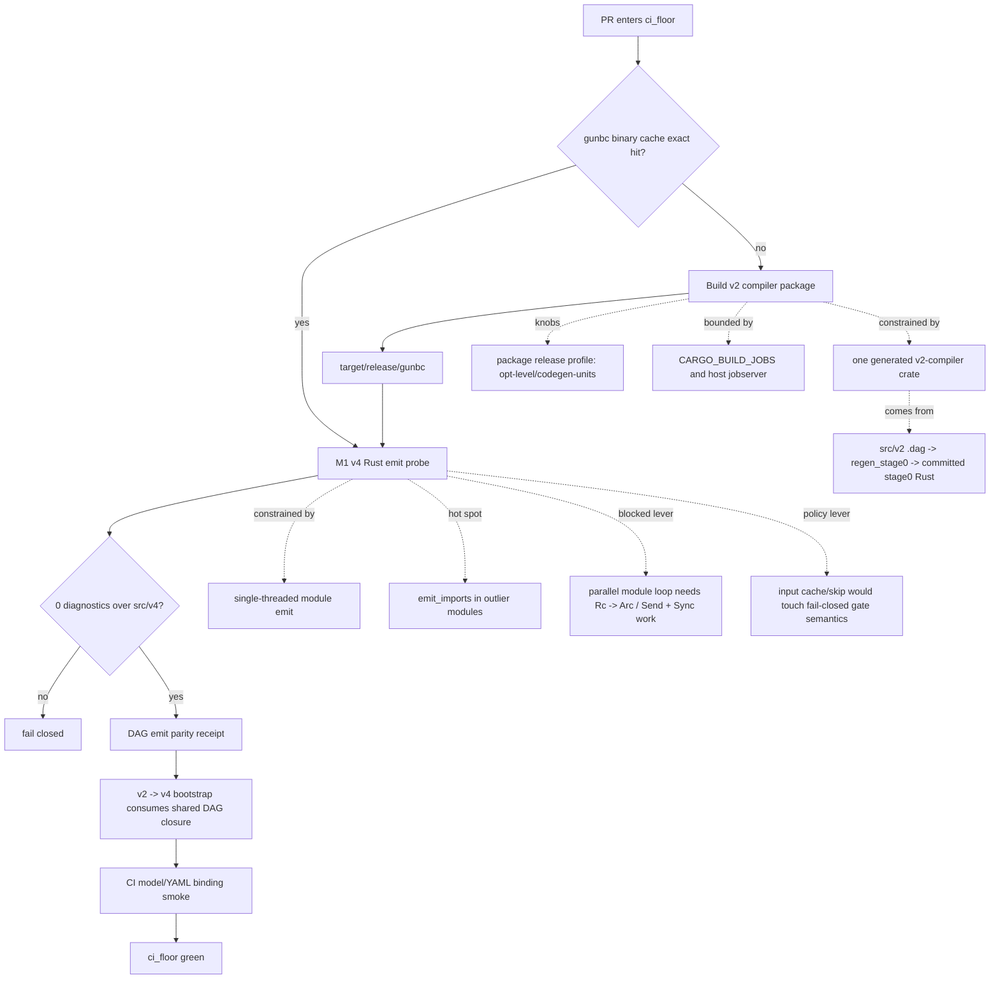

# ci_floor Profiling Constraints Map

> **Status:** profiling evidence note, no implementation authority.
> **Scope:** `ci_floor` wall time on self-hosted arm64 runners, especially the v2 compiler build and M1 v4 Rust emit probe.
> **Head measured:** `225d65f7b7cf52ada06f950d7d5c99bcc9a5c16b`.
> **Rule:** timings can motivate L.4 scheduling/profile work or future emit-algorithm work; they do not authorize a second compiler authority, fail-open gate skip, or hand-wired cache policy.

## 1. What `ci_floor` Is Paying For

The `ci_floor` job is the Class A safety floor for non-draft PRs. Its expensive work is split into two different cost classes:

| Phase | Typical wall | Paid when | Role |
| --- | ---: | --- | --- |
| setup / checkout / cache restore | ~0:35 | every run | isolate toolchains, restore Cargo and binary caches |
| build v2 compiler | ~5:51 local CI-like, ~6:45 operator anchor | only when `target/release/gunbc` binary cache misses | compile the bootstrap seed binary |
| M1 v4 Rust emit probe | ~15:00 local CI-like, ~9:11 operator anchor | every `ci_floor` run | fail-closed proof: v2 emitter emits all v4 sources to Rust with 0 diagnostics |
| DAG emit parity receipt | ~1:44 | every run | prove shared rust+dag closure matches standalone DAG emit on the receipt slice |
| v2 -> v4 bootstrap compile | ~0 after shared closure | every run | consumes the shared DAG closure |
| CI model/YAML binding smoke | ~1:14 | every run | prove `.github/workflows/ci.yml` still matches modeled CI source facts |

Two facts matter for decisions:

1. The build is conditional. It is mostly a substrate-PR or toolchain/Cargo.lock cost because the gunbc binary cache skips it on exact hits.
2. The emit probe is universal. It is the recurring tax on ordinary PRs and remains the larger policy question.

## 2. Generated-Crate Provenance

The surprising "one huge generated crate" is not a CI artifact. It is the committed v2 stage0 bootstrap seed:

```text
src/v2/*.dag authorities
  -> cargo run -p v2-compiler --bin regen_stage0
  -> src/v2/stage0/src/*.rs committed seed
  -> Cargo package: v2-compiler
  -> binary: target/release/gunbc
  -> ci_floor M1 probe runs target/release/gunbc over src/v4
```

Key anchors:

| Artifact | Role |
| --- | --- |
| `src/v2/stage0/Cargo.toml` | package `v2-compiler`, binaries `gunbc` and `regen_stage0` |
| `src/v2/stage0/src/bin/regen_stage0.rs` | regenerates committed stage0 Rust from v2 `.dag` authorities and verifies freshness |
| `src/v2/stage0/src/lib.rs` | includes the generated stage0 modules in one Rust crate |
| `src/v2/stage0/src/v2_compiler_emit_rust.rs` | largest measured generated module, ~883 KiB |
| `src/v2/stage0/src/v2_compiler_infer.rs` | second-largest generated module, ~588 KiB |
| `src/v2/stage0/src/v2_compiler_parse.rs` | generated parser module, ~537 KiB |

The build long pole is therefore: Cargo recompiles a single package, and that package contains several large generated Rust modules. Once dependencies are warm, there is limited crate-level parallelism left. Release codegen for that package dominates the miss-path build.

## 3. Constraint Flow



## 4. Build Dimension Map

The current workflow sets `CARGO_BUILD_JOBS=2` in `ci_floor` before the build and runs:

```sh
RUSTC_WRAPPER= cargo build -p v2-compiler --release
```

That means:

- sccache is deliberately cleared for the v2 compiler build step.
- `CARGO_INCREMENTAL=0` is in effect in the measured CI-like runs.
- the exact binary cache skips the build on ordinary hits.
- on a cache miss, warm `target/` still helps dependencies, but the changed generated package must recompile.

Measured CI-like matrix (`RUSTC_WRAPPER=`, `CARGO_INCREMENTAL=0`, `CARGO_BUILD_JOBS=2`; touched `v2_compiler_emit_rust.rs` before each build):

| Variant | Build | M1 emit | Net build+emit vs default |
| --- | ---: | ---: | ---: |
| default release | 351.0s | 898.1s | baseline, ~20.8m |
| package `codegen-units = 256` | 197.7s | 911.8s | -139.6s, ~2.3m faster |
| package `opt-level = 2` | 194.2s | 892.5s | -162.4s, ~2.7m faster |

Interpretation:

- The build is release-codegen dominated, not dependency dominated, once the cache is warm.
- Package-scoped `opt-level = 2` is the strongest measured build-profile knob.
- Package-scoped `codegen-units = 256` is also viable, but slightly weaker in this matrix.
- `CARGO_PROFILE_RELEASE_PACKAGE_*` environment variables were not a valid way to set package-scoped profile overrides; `cargo --config 'profile.release.package."v2-compiler"...'` did reach rustc.

Open concurrency question:

`CARGO_BUILD_JOBS=2` is conservative for a 128-core host. The host control plane has a FIFO jobserver intended to cap total rustc pressure across runners, while `CARGO_BUILD_JOBS` is a per-job ceiling. A separate measurement should test `CARGO_BUILD_JOBS=4/8/16` under the host jobserver and record wall time, RSS, runner contention, and whether the jobserver actually constrains aggregate rustc work.

## 5. Emit Dimension Map

The M1 emit probe does:

```sh
bash .github/ci-floor/v4-m1-rust-emit-probe.sh
```

with Rust and DAG output dirs supplied by the workflow. It asks `gunbc` to compile all `src/v4` sources to `rust+dag` and requires 0 diagnostics.

Measured local profiling split:

| Scope | Wall |
| --- | ---: |
| frontend + reconcile, 392 modules | 137.7s |
| emit setup | 3.5s |
| pure emit, 392 modules | 400.4s |
| ordinary baseline module, 6 items | 0.29s |
| `src/v4/extdeps/languages/rust.dag`, 553 items | 36.70s |
| `src/v4/compiler/06_translate.dag`, 175 items | 30.86s |

Within-module split:

| Module | `emit_imports` | item loop | full module |
| --- | ---: | ---: | ---: |
| `v4.extdeps.languages.rust` | 35.44s | 1.24s | 36.96s |
| `v4.compiler.translate` | 30.10s | 0.73s | 31.10s |
| baseline | 0.29s | 0.003s | 0.29s |

Interpretation:

- The two outlier modules are not slow because item rendering is quadratic.
- About 97% of their time is in import emission/resolution.
- The clean algorithmic lane is likely deduping or memoizing import-resolution work inside existing emit authority, especially wildcard reexport surface and per-name lookup paths.
- Parallelizing the module loop remains blocked on the planned `Rc` -> `Arc` / `Send + Sync` refinement.
- Skipping the probe through an input cache would be an every-run win, but it changes fail-closed gate semantics and is a policy decision, not a profiling-only fix.

## 6. Lever Classification

| Lever | Expected impact | Constraint | Disposition |
| --- | --- | --- | --- |
| package `opt-level = 2` for `v2-compiler` | ~2.7m saved on cache-miss build+emit path | L.4 scheduling/profile change; must keep receipts | worth trying |
| package `codegen-units = 256` for `v2-compiler` | ~2.3m saved on cache-miss build+emit path | L.4 scheduling/profile change; must keep receipts | worth trying, second choice |
| increase `CARGO_BUILD_JOBS` above 2 | unknown; likely build-only improvement if host idle | must measure under host jobserver and runner contention | open measurement |
| optimize `emit_imports` | unknown, could cut universal emit tax | touches load-bearing emit authority | promising follow-up, needs proper emit PR |
| parallelize per-module emit | large theoretical win | blocked by `!Send`/`!Sync` stage0 graph and Rc model | blocked |
| input cache / skip M1 emit probe | large every-run win | changes fail-closed gate semantics | policy call |
| sccache for changed generated crate | unlikely useful for changed crate; brief ruled it out | conflicts with current cache-interface direction | not pursued |
| split generated crate | potentially large build miss-path win | structural bootstrap/substrate work | deeper lane |

## 7. Profile Change Landing Bar

If a build-profile knob is pursued:

1. Scope it to package `v2-compiler`; do not alter global release semantics unless separately justified.
2. Keep the M1 Rust emit probe and v2 compiler tests as correctness receipts.
3. Update modeled CI carriers when required by RR-L L.4: workspace `Cargo.toml`, `src/v4/workflow/ci.dag`, `dsl/gunbc/ci_github_actions_workflow.dag`, and `.github/workflows/ci.yml` must not drift.
4. State that the change is scheduling/performance only. Build time is not a semantic proof.

## 8. Next Measurements

Recommended next profiling slices:

| Question | Suggested run |
| --- | --- |
| Is `CARGO_BUILD_JOBS=2` leaving easy build time on the table? | matrix `2/4/8/16`, host jobserver enabled, warm target, touched stage0 file |
| Does `opt-level=2` remain stable across repeated runs? | repeat default and opt2 once on a quiet runner, compare variance |
| Which import path dominates `emit_imports`? | instrument wildcard reexport surface, specific import block, and per-name lookup memo candidates |
| Can CI distinguish idle host from saturated host? | record jobserver token count, load, RSS, and runner count during ci_floor |

## 9. Non-Goals

- No new parser, infer, lower, or emit authority.
- No fail-open gate skip.
- No Rust-template cementing to satisfy a census or timing target.
- No hand-wired cache transport beyond the existing modeled-cache migration boundary.
- No PR from this profiling note by itself.
