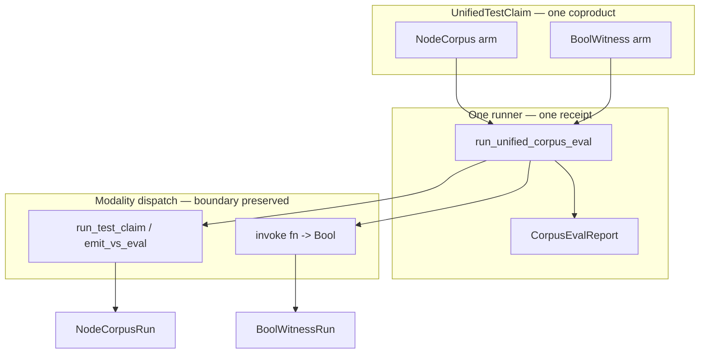

# Test-Claim Consolidation — Unified Resolved-Type Claim System + One Runner

**Status:** design note (**docs only** — no `.dag`, runner, roster, or CI transport edits in this PR)  
**Parent plan:** ctrl#1490 (subordinate to RR-A runtime engine, RR-I corpus-runner contract, thin-shim CI, affected-set-3a, lens-CI-gate)  
**Work item:** `node://adhoc-e4390ffa-916` (`zesty-otter-154`)  
**Gate:** Mgr-C / parent gate before any implementation PR lands

**Scope discipline:** Load-bearing cuts (`verification.dag`, `05_eval.dag`, `testclaim_corpus_runner.dag`, lens-CI transport, roster deletion) land in **separate Mgr-C-gated implementation PRs** with an explicit before/after cut list — not bundled here.

**Operator GO (parent revision):** The target is a **unified coproduct of both modalities** — existing Node-corpus `TestClaim` **plus** a new first-class Bool-witness claim modality that keeps `fn() -> Bool` witnesses as `fn() -> Bool`. Consolidation must **not** launder lens/manual families into `TestClaimEvalSubject<Node>` as the only path.

---

## 1. What exists today

The v4 claim corpus under `src/v4/test/claim/` has grown **parallel authorities** and **parallel runners**. They overlap in intent but do not share a single execution receipt or a single schema that names both modalities.

### 1.1 Fragmentation inventory (landed tree, 2026-06-08)

| Artifact class | count | role today |
| -------------- | ----: | ---------- |
| Top-level families (`test/claim/*/` excl. `workflow/`) | 41 | domain claim groupings |
| `fn *_claim_holds() -> Bool` predicates | 58 | compile-time / `--claim-run` Bool witnesses |
| `data claim_*: TestClaim` rows | 179 | closed `TestClaim` coproduct declarations |
| files calling `run_test_claim(` | 17 | T-22 `TestClaimRun` execution rows |
| `workflow/*_eval.dag` orchestrators | 10 | per-family corpus eval folds |
| `v4_roster_pilot.dag` explicit rows | 42 | list-based `{entry, function}` Bool-witness roster |
| `family_receipt.dag` | 3 | T-38B receipt modules (`lens_idempotency`, `grounding_go`, `grounding_typescript`) |
| `subject_roster.dag` | 4 | T-38B subject lists (+ `lens_ownership` roster-only) |

### 1.2 Parallel authorities (the consolidation problem)

| Authority | location | consumer | problem |
| --------- | -------- | -------- | ------- |
| **`TestClaim` coproduct** | `v4.std.verification` | `run_test_claim`, CI selection | canonical Node-corpus schema — but Bool witnesses live outside it |
| **Family-specific carriers** | e.g. `LensStructuralResolutionClaim` | `*_claim_holds()` | parallel schema; not registered in any unified coproduct |
| **Bool `{entry, function}` rows** | `v4_roster_pilot`, `lens_ci_gate`, per-file `*_claim_holds` | `gunbc run --claim-run` | first-class execution surface with **no modeled claim type** |
| **Per-family `*_eval.dag`** | `workflow/` | authoring-time `TestClaimRun` lists | third runner co-authoring verdict |

The `lens_cost/atom_zero.dag` pattern shows optional **dual surfacing** (Bool gate + `TestClaim` data row) — not a requirement that Bool rows collapse into Node projection.

### 1.3 Four parallel runners (today)

| Runner | entry | actual type | CI binding |
| ------ | ----- | ----------- | ---------- |
| **`run_test_claim`** | `05_eval.dag` | `TestClaimEvalSubject<Node> → TestClaimRun<Node, RuntimeValue>` | manual corpus, T-38B families |
| **`run_test_claim_emit_vs_eval`** | `emit_host.dag` | same subject type, emit→host→parse compare | nat_semiring / branch_dispatch rung 3–6 |
| **Per-family `*_eval.dag`** | `workflow/nat_semiring_rung*_eval.dag`, etc. | pre-built `TestClaimRun` lists | authoring-time const rows (RR-A §6 forbidden as sole pass) |
| **Bool `--claim-run`** | host CLI over `fn() -> Bool` | `Bool` stdout | `v4_roster_pilot` (42 rows), `lens_ci_gate` (4 rows), claim-corpus map (377 witnesses) |

### 1.4 Resolved-type witness (Node-corpus modality anchor)

For the **Node-corpus** arm, evaluation acceptance is modeled at a single witness boundary in `05_eval.dag`:

```text
RuntimeValueAcceptanceWitness {
  resolved_type:   inferred_facts_resolved_type(facts) == runtime_value_resolved_type(value)
  inhabitance:     canonical grounding admits facts
  canonical:       canonical grounding witness holds
}
```

`run_test_claim` routes `TestClaim` variants through this stack. The **Bool-witness** arm has a different resolved-type head (`Bool` verdict at the `fn() -> Bool` boundary) — consolidation names both heads explicitly rather than re-encoding Bool semantics as Node.

---

## 2. Problem statement

**Representative failure:** Reviewers see green Bool witnesses, type-checking `TestClaim` rows, and per-family eval orchestrators — with **no unified schema** naming both modalities and **no single runner receipt** that preserves which modality executed. A consolidation that collapses everything into `TestClaimEvalSubject<Node>` is the laundering-prone "re-encode into Node-corpus" path the operator pinned against.

**Why local patches are forbidden:**

| patch | violation |
| ----- | --------- |
| Require every Bool witness to project to `TestClaimEvalSubject<Node>` | erases Bool modality; laundering path |
| Add another `workflow/*_eval.dag` per family | P2 — N runners co-authoring verdict |
| Fork `run_test_claim` per lens family | RR-I §6 — parametric fork |
| Delete `v4_roster_pilot` before discovery equivalence | silent roster drop (E-10) |
| Implement without `verification.dag` Bool-witness arm | model-after-implement (INVARIANTS P1) |

**Deepest unsound boundary:** Bool witnesses execute via `--claim-run` with no modeled claim type; Node corpus executes via `run_test_claim` with no registry link to the 42-row pilot roster. Two modalities, zero coproduct.

---

## 3. Target: unified representation (`UnifiedTestClaim`)

### 3.1 Explicit coproduct (both modalities, one authority)

**Steady-state schema** (names provisional until L2.5 model PR lands):

```text
type UnifiedTestClaim
  = NodeCorpus {
      claim: TestClaim
      subject: TestClaimEvalSubject<Node>
      transport: TestClaimTransportMode   // EvalOnly | EmitVsEval { target }
    }
  | BoolWitness {
      entry: String                      // module relpath under src/v4/test/claim/
      function: Symbol                   // nullary fn () -> Bool
      receipt: BoolWitnessReceipt        // typed execution receipt (see §3.3)
    }
```

**Resolved-type heads** — discovery and dispatch key off the modality tag, not string heuristics:

| arm | resolved-type head | execution semantics |
| --- | ---------------- | ------------------- |
| `NodeCorpus` | `TestClaim` coproduct variant + `RuntimeValueAcceptanceWitness.resolved_type` at eval boundary | `run_test_claim` / `run_test_claim_emit_vs_eval` |
| `BoolWitness` | `fn() -> Bool` (preserved — **not** re-encoded as Node) | host invokes named function; result is `Bool` |

**Forbidden:** treating `BoolWitness` as a migration shim that must eventually become `NodeCorpus`. Optional cross-modality equivalence witnesses may exist (§6) but are **not** admission requirements.

### 3.2 Model-first substrate delta (load-bearing — escalate before implementation)

**Phase 0 implementation is blocked until this lands** (separate L2.5 / Mgr-C-gated model PR):

| file | delta |
| ---- | ----- |
| `v4.std.verification` | Add `BoolWitness` carrier + `BoolWitnessReceipt` + `UnifiedTestClaim` coproduct wrapping existing `TestClaim` **without** deleting or narrowing `TestClaim` arms |
| `v4.compiler.eval` (or `verification.dag` accessors) | `unified_test_claim_modality(c: UnifiedTestClaim) -> UnifiedTestClaimModality` — structural tag for dispatch |
| Registry projection fns | `bool_witness_from_roster_row(V4RosterPilotClaimRunRow) -> BoolWitness` — mechanical, not hand-maintained parallel lists |

`TestClaim` coproduct arm changes for Node-corpus claims remain in scope of this consolidation — they are **not** listed as a non-goal. The **first** substrate landing is the Bool-witness arm so both modalities exist before runner migration.

**Escalation:** any implementation touching `verification.dag` match arms without the model PR is a STOP per INVARIANTS load-bearing bar.

### 3.3 `BoolWitnessReceipt` (one receipt shape, modality-preserved)

The one runner emits a **unified receipt** whose entries tag modality:

```text
type UnifiedClaimRun
  = NodeCorpusRun { run: TestClaimRun<Node, RuntimeValue> }
  | BoolWitnessRun {
      witness: BoolWitness
      result: Bool
      execution_status: HostVerdictSurfaceExecutionStatus  // runtime vs authoring-time
    }

type CorpusEvalReport {
  entries: List<UnifiedClaimRun>
}
```

CI consumers read `CorpusEvalReport` — not raw Bool stdout and not `TestClaimRun` alone. The receipt **preserves** which arm ran; it does not normalize Bool results into fake `TestClaimRun` rows.

### 3.4 Node-corpus arm (consume, extend — do not replace)

Existing `TestClaim` + `TestClaimEvalSubject<Node>` + T-38B `subject_roster` / `family_receipt` pattern remains the Node-corpus path. Emit-vs-eval is a **transport mode** on `NodeCorpus`, not a separate runner:

| mode | primitive |
| ---- | --------- |
| `EvalOnly` | `run_test_claim` |
| `EmitVsEval { target }` | `run_test_claim_emit_vs_eval` |

RR-I unsupported families (`ci_pipeline`, `non_runtime_value`) stay explicit until a real projection or parametric substrate PR lands — consolidation does not fake them as either modality.

### 3.5 Bool-witness arm (first-class, not derived)

**Preserved semantics:**

- Migrated roster rows keep `fn <name>() -> Bool` as the **authoritative** definition.
- Runner dispatches: `gunbc run --entry <entry> --function <function>` (or bootstrap harness equivalent) and records `BoolWitnessRun.result`.
- `data witness_*: Bool = <fn>()` rebindings remain valid; runner deduplicates per claim-corpus-map discipline.

**Optional equivalence (not admission):** where a family *chooses* to also declare `NodeCorpus`, an equivalence witness may pin `bool_result == (node_run_verdict == Pass)`. Absence of Node projection is **not** a defect.

---

## 4. Target: one runner (modality dispatch, boundary preserved)

### 4.1 Steady-state shape

```text
run_unified_corpus_eval(claims: List<UnifiedTestClaim>) -> CorpusEvalReport
```

Single fold in `testclaim_corpus_runner.dag` (bootstrap pin may retain `run_manual_testclaim_corpus_eval` name until RR-A A.3b harness lands). Dispatch:

```text
match claim {
  NodeCorpus { subject, transport, ... } =>
    NodeCorpusRun { run: <transport selects run_test_claim | run_test_claim_emit_vs_eval> }
  BoolWitness { entry, function, ... } =>
    BoolWitnessRun { result: invoke_fn(entry, function), ... }
}
```



### 4.2 Registry sources (until T-19 reflection)

| source | maps to |
| ------ | ------- |
| `manual_corpus_roster` / family `subject_roster.dag` | `NodeCorpus` rows |
| `v4_roster_pilot_claim_run_rows` | `BoolWitness` rows (mechanical projection) |
| `lens_ci_gate` rows | `BoolWitness` rows (same shape) |
| T-19 item-registry (future) | discovers both arms by resolved-type head |

**Interim:** explicit import rosters remain until reflection lands; the unified coproduct is still the **named** authority.

### 4.3 What gets retired (implementation phase)

| retire | replaced by |
| ------ | ----------- |
| `workflow/*_eval.dag` (10 files) | `NodeCorpus` slices in unified registry + `run_unified_corpus_eval` |
| Separate Bool CLI as **sole** CI pass without receipt | `BoolWitnessRun` inside `CorpusEvalReport` |
| Parallel `{entry, function}` list types (`V4RosterPilotClaimRunRow`, `LensCiClaimRunRow`) | projections into `BoolWitness` (lists may remain as views until deletion gate) |

**Keep:** `fn() -> Bool` function bodies; `TestClaim` data rows; `run_test_claim` / `run_test_claim_emit_vs_eval` as Node-corpus primitives inside the one fold.

### 4.4 `v4_roster_pilot.dag` deletion gate

`v4_roster_pilot.dag` is **not** deleted in early phases. Deletion requires **all** of:

1. **Discovery completeness:** mechanically discovered `BoolWitness` set from corpus scan **equals** `v4_roster_pilot_claim_run_rows` (same 42 `{entry, function}` pairs, no silent drops).  
2. **Run equivalence:** for every row, `BoolWitnessRun.result` from unified runner **equals** legacy `--claim-run` stdout on the same `{entry, function}`.  
3. **Discrimination:** mutation-under-perturb checks (lens-CI M2 discriminating gate pattern) still fire red-on-mutation via unified receipt — not weakened by runner swap.

Until C9–C11 (§6.2) pass, `v4_roster_pilot` stays authoritative for host transport projection (`v4_roster_pilot_claim_run_row_count`, shell scripts).

---

## 5. Migration plan

Phased cuts; each phase is a separate Mgr-C-gated implementation PR.

### Phase 0 — Design gate (this doc)

Mgr-C accepts §3–§4 dual-modality coproduct + §6 equivalence bar. No `.dag` edits.

### Phase 1 — Substrate: `BoolWitness` + `UnifiedTestClaim` in `verification.dag`

Land `BoolWitness`, `BoolWitnessReceipt`, `UnifiedTestClaim`, modality tag fns. **No runner changes** in same PR if it risks load-bearing match churn — split runner to Phase 2.

### Phase 2 — One runner dispatch (pilot slice)

Wire `run_unified_corpus_eval` for:

- manual 5-row `NodeCorpus` wedge (existing T-38 path)  
- `v4_roster_pilot` 42-row `BoolWitness` slice (projected, not hand-duplicated)

Emit `CorpusEvalReport` with tagged entries. Legacy transports remain parallel until Phase 4.

### Phase 3 — T-38B Node-corpus expansion + retire `*_eval.dag`

Per RR-A §2: families with `run_test_claim` rows get `subject_roster` + `family_receipt` as `NodeCorpus` registry slices. Delete per-family `workflow/*_eval.dag` orchestrators.

**Bool-only families** (lens_cost `*_claim_holds`, structural_resolution carriers, etc.) register as `BoolWitness` — **no** forced `TestClaimEvalSubject` projection.

### Phase 4 — CI transport unification (RR-A A.1 / A.3b)

Bootstrap harness executes `run_unified_corpus_eval` at runtime. JSON receipt carries `CorpusEvalReport` with `execution_status=runtime_verdicts`. Lens CI + smoke roster scripts consume unified receipt.

### Phase 5 — `v4_roster_pilot` deletion

Only after §6.2 C9–C11. Replace explicit list with discovered `BoolWitness` registry + equivalence witnesses.

### Phase 6 — Family carrier dissolution (optional, per-family)

`claim_carrier.dag` types dissolve when a family elects to register as `BoolWitness` or `NodeCorpus` via unified coproduct — not by mandatory Node re-encoding.

---

## 6. Equivalence plan

### 6.1 Equivalence laws

| law | statement | required? |
| --- | --------- | --------- |
| **E1 — Bool run equivalence** | For every `BoolWitness` row: unified runner `result` == legacy `--claim-run` stdout | **yes** (admission) |
| **E2 — Node harness agreement** | RR-A A.1.5a: corpus fold agrees with direct `run_test_claim` on Node slice | **yes** (Node arm) |
| **E3 — Emit-vs-eval agreement** | `EmitVsEval` mode agrees with `EvalOnly` on in-process targets | **yes** (Node arm) |
| **E4 — Cross-modality optional** | Where both exist: `bool_fn() == (node_verdict == Pass)` | **optional** per family |
| **E5 — No silent drop** | Row removed from `v4_roster_pilot` ↔ appears in discovered `BoolWitness` set | **yes** |
| **E6 — Modality tag preserved** | `CorpusEvalReport` entries carry `NodeCorpusRun` or `BoolWitnessRun` — no normalization | **yes** |

### 6.2 Falsification table (implementation PROVEN)

| ID | probe | receipt |
| -- | ----- | ------- |
| C1 | Unified receipt has `execution_status=runtime_verdicts` | RR-A A.3b JSON |
| C2 | `workflow/*_eval.dag` count → 0 | filesystem |
| C3 | `UnifiedTestClaim` in `verification.dag` with both arms | model PR diff |
| C4 | E2 pinned for manual Node wedge | `inprocess_equivalence` expansion |
| C5 | E1 pinned for lens-CI 4-row Bool slice | equivalence witness file |
| C6 | No `run_<family>_test_claim` fork | `rg 'fn run_.*_test_claim' src/v4/compiler` |
| C7 | Unsupported roster rows unchanged unless projection lands | RR-I R6/R7 |
| C8 | Claim corpus map ERROR bucket not regressed on touched families | execution-map diff |
| **C9** | Discovered `BoolWitness` set == `v4_roster_pilot` rows | mechanical diff script |
| **C10** | E1 for all 42 pilot rows | batch equivalence log |
| **C11** | Perturb-check discrimination survives runner swap | lens-CI / pilot mutation receipts |

### 6.3 Tranche artifacts

Each implementation PR ships before/after snapshots and `fn <tranche>_equivalence_holds() -> Bool` in `workflow/` (pattern: `inprocess_equivalence.dag`).

---

## 7. Position in ctrl#1490

| ctrl#1490 lane | relationship |
| -------------- | ------------ |
| RR-A (A.1/A.2/A.3b) | Node-corpus arm + unified CI receipt |
| RR-I | Unsupported families; no parametric `run_test_claim` fork |
| thin-shim CI | `gunbc test` invokes **one** `run_unified_corpus_eval` |
| affected-set-3a | `NodeCorpus` claims expose `test_claim_evaluation_nodes`; Bool arm uses entry-path rules (separate) |
| lens-CI-gate | Migrates to `BoolWitness` rows inside unified receipt; perturb-check preserved |

**Ordering:** Phase 1 substrate before Phase 2 runner. Phase 4 blocks on RR-A A.1 harness. Phase 5 (`v4_roster_pilot` delete) is last.

---

## 8. Forbidden patterns

| pattern | why |
| ------- | --- |
| Mandatory Bool → `TestClaimEvalSubject<Node>` projection | laundering path; erases modality |
| `*_claim_holds` as derived-only with no `BoolWitness` arm | Bool modality not first-class |
| Delete `v4_roster_pilot` before C9–C11 | silent roster drop |
| New `workflow/<family>_eval.dag` | per-family runner |
| `fn run_<family>_test_claim` fork | RR-I P2 eval fork |
| Normalize `BoolWitnessRun` into `TestClaimRun` | erases modality boundary in receipt |
| Implement runner before `verification.dag` Bool arm | model-after-implement |

---

## 9. Non-goals

- T-19 item-registry implementation (consume when landed for discovery)  
- `eval_parallel` runtime (RR-I §5.0.2)  
- Forcing cross-modality equivalence (E4) on every family  
- v3 `sg0_census` / hand-Rust migration (T-PB-B)  
- Re-litigating RR-A structural bridge (#4115 CLOSED)

**Removed from prior draft:** "Substrate changes to `TestClaim` coproduct arms" as non-goal — Node-corpus arm extensions remain in scope; **Bool-witness arm is the first substrate landing**.

---

## 10. Landing order (post-gate)

```text
0. This doc merged — Mgr-C gate.
1. Phase 1 — verification.dag: BoolWitness + UnifiedTestClaim (C3).
2. Phase 2 — run_unified_corpus_eval pilot (manual Node wedge + v4_roster_pilot Bool slice).
3. Phase 3 — T-38B Node expansion; retire *_eval.dag (C2).
4. Phase 4 — RR-A harness + unified CI receipt (C1, C4, C5).
5. Phase 5 — v4_roster_pilot delete (C9–C11).
6. Phase 6 — optional family carrier dissolution.
```

---

## 11. Verification commands (re-run before dispatch)

```bash
# Modality inventory
rg -l 'fn \w+_claim_holds\(' src/v4/test/claim --glob '*.dag' | wc -l
rg -c 'V4RosterPilotClaimRunRow' src/v4/test/claim/workflow/v4_roster_pilot.dag
find src/v4/test/claim/workflow -name '*_eval.dag' | wc -l

# Single-runner discipline (post-implementation)
rg 'fn run_.*test_claim' src/v4/compiler --glob '*.dag'

# Substrate gate (post-Phase 1)
rg 'UnifiedTestClaim|BoolWitness' src/v4/std/verification.dag
```

---

## 12. Escalation triggers

Stop and escalate if:

1. `BoolWitness` cannot be modeled in `verification.dag` without violating M2 or INVARIANTS load-bearing rules.  
2. Unified receipt cannot preserve perturb-check discrimination for lens-CI Bool rows.  
3. Discovered `BoolWitness` set cannot be made to match `v4_roster_pilot` without silent drops.
