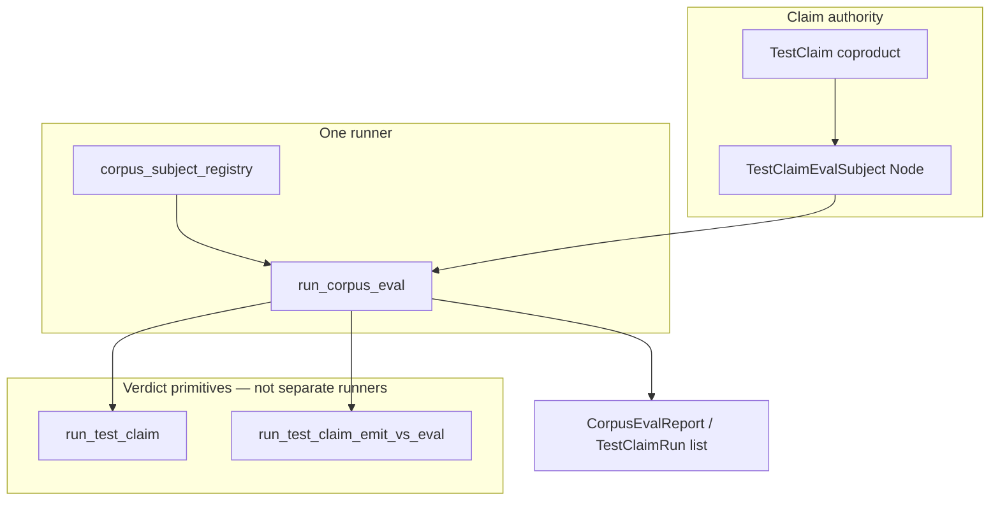

# Test-Claim Consolidation — Unified Resolved-Type Claim System + One Runner

**Status:** design note (**docs only** — no `.dag`, runner, roster, or CI transport edits in this PR)  
**Parent plan:** ctrl#1490 (subordinate to RR-A runtime engine, RR-I corpus-runner contract, thin-shim CI, affected-set-3a, lens-CI-gate)  
**Work item:** `node://adhoc-e4390ffa-916` (`zesty-otter-154`)  
**Gate:** Mgr-C / parent gate before any implementation PR lands

**Scope discipline:** Load-bearing cuts (`05_eval.dag`, `verification.dag`, `testclaim_corpus_runner.dag`, lens-CI transport, per-family roster deletion) land in **separate Mgr-C-gated implementation PRs** with an explicit before/after cut list — not bundled here.

---

## 1. What exists today

The v4 claim corpus under `src/v4/test/claim/` has grown three **parallel authorities** and four **parallel runners**. They overlap in intent but do not share a single execution receipt.

### 1.1 Fragmentation inventory (landed tree, 2026-06-08)

| Artifact class | count | role today |
| -------------- | ----: | ---------- |
| Top-level families (`test/claim/*/` excl. `workflow/`) | 41 | domain claim groupings |
| `fn *_claim_holds() -> Bool` predicates | 58 | compile-time / `--claim-run` Bool witnesses |
| `data claim_*: TestClaim` rows | 179 | closed `TestClaim` coproduct declarations |
| files calling `run_test_claim(` | 17 | T-22 `TestClaimRun` execution rows |
| `workflow/*_eval.dag` orchestrators | 10 | per-family corpus eval folds |
| `family_receipt.dag` | 3 | T-38B receipt modules (`lens_idempotency`, `grounding_go`, `grounding_typescript`) |
| `subject_roster.dag` | 4 | T-38B subject lists (+ `lens_ownership` roster-only) |

### 1.2 Three parallel claim authorities

| Authority | location | consumer | problem |
| --------- | -------- | -------- | ------- |
| **`TestClaim` coproduct** | `v4.std.verification` | `run_test_claim`, CI selection (`affected_set_selection.dag`) | canonical schema — but many families do not route through it |
| **Family-specific carriers** | e.g. `LensStructuralResolutionClaim` in `claim_carrier.dag` | `*_claim_holds()` Bool gates | second schema parallel to `TestClaim`; no `TestClaimRun` receipt |
| **Bool `*_claim_holds()`** | ~58 lens/manual files | `gunbc run --claim-run`, `lens_ci_gate.dag` | third authority; grep/typecheck passes without `TestClaimRun` verdict (E-10 vacuum) |

The `lens_cost/atom_zero.dag` pattern illustrates the dual-authority smell: a lens-local `atom_zero_claim_holds()` **and** a `data claim_atom_zero: TestClaim` whose `rhs` is derived from the Bool — two surfaces for one fact.

### 1.3 Four parallel runners

| Runner | entry | actual type | CI binding |
| ------ | ----- | ----------- | ---------- |
| **`run_test_claim`** | `05_eval.dag` | `TestClaimEvalSubject<Node> → TestClaimRun<Node, RuntimeValue>` | manual corpus, T-38B families |
| **`run_test_claim_emit_vs_eval`** | `emit_host.dag` | same subject type, emit→host→parse compare | nat_semiring / branch_dispatch / loop_linear_bound rung 3–6 |
| **Per-family `*_eval.dag`** | `workflow/nat_semiring_rung*_eval.dag`, etc. | repackages pre-built `TestClaimRun` lists | authoring-time const rows (RR-A §6 forbidden as sole pass) |
| **Bool `--claim-run`** | host CLI over `*_claim_holds` | `Bool` | `lens_ci_gate.dag` (4 rows), claim-corpus execution map (377 witnesses) |

`testclaim_corpus_runner.dag` is the closest thing to a unified fold, but it only covers the 5-row manual wedge and explicitly lists two **unsupported** subject families (`ci_pipeline`, `non_runtime_value`) per RR-I §3.

### 1.4 Resolved-type witness (the substrate anchor)

Evaluation acceptance is already modeled at a single witness boundary in `05_eval.dag`:

```text
RuntimeValueAcceptanceWitness {
  resolved_type:   inferred_facts_resolved_type(facts) == runtime_value_resolved_type(value)
  inhabitance:     canonical grounding admits facts
  canonical:       canonical grounding witness holds
}
```

`run_test_claim` routes claim variants through this stack (runtime eval for `EqualsClaim` / `CompilesClaim` / `DiagnosticClaim`; structural admission for `StructuralEqualsClaim`; round-trip preconditions for `RoundTripClaim`). The consolidation target is: **every executable claim row projects into this witness stack** — not a parallel Bool predicate or family-local carrier.

---

## 2. Problem statement

**Representative failure:** A capable agent (or reviewer) can read a green `*_claim_holds()` Bool, a type-checking `TestClaim` data row, and a `family_receipt.dag` list — and still have **no single execution receipt** proving the claim ran through the eval interpreter with the bootstrap `v4_evaluator` pin. RR-A closed the structural bridge; the corpus still carries pre-folded `run_test_claim` const rows, Bool gates, and per-family eval orchestrators that co-author.

**Why local patches are forbidden:**

| patch | violation |
| ----- | --------- |
| Add another `workflow/*_eval.dag` per family | P2 — N runners co-authoring verdict |
| Keep `*_claim_holds()` as CI pass surface | E-10 — Bool without `TestClaimRun` consumer |
| Fork `run_test_claim` per lens family | RR-I §6 — parametric fork instead of projection |
| New `Lens*Claim` carrier per family | M2 — duplicate type authority |

**Deepest unsound boundary:** `run_manual_testclaim_corpus_eval()` repackages compile-time `run_test_claim` results; lens CI invokes `*_claim_holds` directly; emit-vs-eval claims use a second verdict primitive. Three surfaces, one intended semantics.

---

## 3. Target: unified resolved-type claim system

### 3.1 Definition — resolved-type claim

A **resolved-type claim** is an executable assertion whose verdict is decided at one of two **declared** boundaries — never by a hand-rolled Bool:

| boundary | `TestClaim` arm | verdict mechanism |
| -------- | --------------- | ----------------- |
| **Runtime resolved-type** | `EqualsClaim`, `CompilesClaim`, `DiagnosticClaim` | `run_test_claim_runtime_assert` after `eval` produces `Outcome<RuntimeValue>`; acceptance uses `RuntimeValueAcceptanceWitness.resolved_type` |
| **Structural resolved-type** | `StructuralEqualsClaim` | structural admission of lhs (well-formed, no runtime eval of receipt nodes) + node equality to rhs |
| **Round-trip resolved-type** | `RoundTripClaim` | `dag_round_trip_wave1_authorities_ready` precondition + structural input admission |

Lens and manual families **do not introduce a fourth boundary**. They declare:

1. a `TestClaim` row (or a projection into one), and  
2. a `TestClaimEvalSubject<Node>` built from shared fixtures (`lens_common/infer_fixture.dag` cost-of-change = 1).

Family-specific carriers (`LensStructuralResolutionClaim`, etc.) are **migration scaffolding** with explicit dissolve marks — not steady-state authorities.

### 3.2 Single schema authority (M2)

**Steady state:** `v4.std.verification::TestClaim` remains the only closed assertion-shape coproduct. New claim shapes extend the coproduct via L2.5 model PR — not parallel `*Claim` types in family directories.

**Projection, not parallel schema:** Where a lens fact is not natively an `EqualsClaim`/`DiagnosticClaim`, the family exports:

```text
fn <family>_test_claim_subject(row: <Family>Claim) -> TestClaimEvalSubject<Node>
```

The family-local type is input to the projection only until T-19 item-registry reflection dissolves explicit rosters.

### 3.3 Transport mode (not transport runner)

Emit-vs-eval is a **transport mode** on an existing subject, not a second corpus entry point:

| mode | primitive | when |
| ---- | --------- | ---- |
| `EvalOnly` | `run_test_claim` | default — in-process evaluator |
| `EmitVsEval { target: TargetModel }` | `run_test_claim_emit_vs_eval` | cross-target law rows (nat_semiring rung 3–6, MVP translate) |

Mode is carried on `TestClaimEvalSubject` context (or a `TestClaimTransportMode` field on `EvalContext`) — **one** `run_corpus_eval` fold selects the primitive per subject. Forbidden: per-family `run_*_eval.dag` orchestrators that re-list the same rows.

### 3.4 Unsupported families (RR-I contract — consume, do not re-litigate)

`ci_pipeline` and `non_runtime_value` stay in `testclaim_subject_roster_unsupported_rows` until a projection into `(Node, RuntimeValue)` or an escalated parametric `run_test_claim<A>` substrate PR lands. Consolidation does not widen the runner by copy.

---

## 4. Target: one runner

### 4.1 Steady-state shape

```text
run_corpus_eval(subjects: List<TestClaimEvalSubject<Node>>) -> CorpusEvalReport
```

- **Single fold** in `testclaim_corpus_runner.dag` (name may stay `run_manual_testclaim_corpus_eval` for bootstrap pin compatibility until A.3b harness lands).
- **Single roster authority** — T-19 item-registry reflection replaces explicit import rosters; until then, a `corpus_subject_registry.dag` aggregates `subject_roster.dag` exports (no per-family `*_eval.dag`).
- **Single CI verdict surface** — `TestClaimRun` verdict tally, not `Bool` `*_claim_holds`.



### 4.2 What gets retired (implementation phase)

| retire | replaced by |
| ------ | ----------- |
| `workflow/*_eval.dag` (10 files) | registry slice + `run_corpus_eval` |
| `lens_ci_gate.dag` `*_claim_holds` transport | `TestClaimRun` roster rows projected from lens subjects |
| `gunbc run --claim-run` as CI pass | `gunbc test` / bootstrap harness `TestClaimRun` receipt (RR-A A.1) |
| Dual `*_claim_holds` + `data claim_*: TestClaim` | `claim_*` + subject projection; `*_claim_holds` becomes derived witness only |

**Keep (not retired):** `run_test_claim` and `run_test_claim_emit_vs_eval` as **primitives inside** the one fold — RR-A §3 "landed, consume, do not fork."

### 4.3 Lens CI gate migration

Today `v4.workflow.lens_ci_gate` lists `{ entry, function }` pointing at `*_claim_holds`. Target:

```text
LensCiClaimRunRow {
  label: String
  subject: TestClaimEvalSubject<Node>   // or Symbol pin to registry row
}
```

The shell gate (`scripts/v4-lens-ci-gate.sh`) invokes the bootstrap harness path that returns `TestClaimRun`, not a Bool thunk. Discriminating perturb-check semantics are preserved on the **verdict+reason** projection (M2 discriminating gate — parent cluster).

---

## 5. Migration plan

Phased cuts; each phase is a separate implementation PR gated on §7 falsification receipts.

### Phase 0 — Design gate (this doc)

Mgr-C / parent accepts §3–§4 steady-state shape and §7 equivalence bar. No `.dag` edits.

### Phase 1 — Bool → `TestClaimRun` equivalence shim (lens wedge)

**Scope:** 4 lens-CI rows + `lens_cost` family (highest visibility, smallest surface).

For each `*_claim_holds` row:

1. Add (or expose) `subject_*: TestClaimEvalSubject<Node>` projection.  
2. Add equivalence witness: `claim_holds() == (verdict(run_test_claim(subject)) == Pass)`.  
3. Pin in `manual_corpus_eval_expected.dag` or family `family_receipt.dag`.

**Do not delete** `*_claim_holds` until Phase 4.

### Phase 2 — T-38B roster expansion (A.2 families)

Per RR-A §2: each ACTIVE family gets `subject_roster.dag` + `family_receipt.dag` listing `TestClaimRun` rows — not `*_eval.dag` orchestrators.

Priority order (materiality):

1. Partial families already calling `run_test_claim`: `nat_semiring`, `branch_dispatch`, `loop_linear_bound`, `generated`, `lens_effect`  
2. Lens families with Bool gates: `lens_cost`, `lens_synthesis`, `lens_coverage`, `lens_structural_resolution`, …  
3. Scaffold-only families last

### Phase 3 — Registry aggregation + retire `*_eval.dag`

1. Land `corpus_subject_registry.dag` importing family `subject_roster` exports.  
2. Point `run_corpus_eval` at registry (replaces `manual_corpus_roster` explicit import wedge).  
3. Delete `workflow/nat_semiring_rung*_eval.dag`, `branch_dispatch_rung*_eval.dag`, etc. — receipts move to family `family_receipt.dag`.

### Phase 4 — CI transport unification (RR-A A.1 / A.3b)

1. Bootstrap harness executes `run_corpus_eval` at runtime with `v4_evaluator` pin.  
2. `lens_ci_gate` and `scripts/v4-testclaim-corpus-eval.sh` consume `TestClaimRun` JSON receipt.  
3. Delete `*_claim_holds` as CI pass surface; retain only as derived compile-time witnesses until T-19 reflection.

### Phase 5 — Family carrier dissolution

Delete `claim_carrier.dag` family types when projections into `TestClaim` + `TestClaimEvalSubject` are total. Trigger: T-19 item-registry / coproduct reflection marks.

---

## 6. Equivalence plan

### 6.1 Equivalence laws (must hold across every migration tranche)

| law | statement |
| --- | --------- |
| **E1 — Bool/run agreement** | For every row with `*_claim_holds` and `subject_*`: `claim_holds() == (test_claim_run_verdict(run_test_claim(subject)) == Pass)` |
| **E2 — Harness/in-process agreement** | RR-A A.1.5a / `inprocess_equivalence.dag`: corpus-runner fold agrees with direct `run_test_claim` on the same subject list |
| **E3 — Emit-vs-eval agreement** | `run_test_claim_emit_vs_eval(subject, target)` agrees with `run_test_claim(subject)` on rows where transport is `EvalOnly` (in-process target) |
| **E4 — Registry completeness** | Every `data claim_*: TestClaim` in a merged family has exactly one `subject_*` in that family's `subject_roster.dag` |
| **E5 — No silent drop** | Row removed from `*_claim_holds` transport ↔ row appears in `TestClaimRun` registry with matching `test_claim_label` |

### 6.2 Falsification table (implementation PROVEN)

| ID | probe | receipt |
| -- | ----- | ------- |
| C1 | Lens CI executes via `TestClaimRun` verdict, not Bool stdout | `scripts/v4-lens-ci-gate.sh` log shows `--claim-run` retired; JSON receipt has `execution_status=runtime_verdicts` |
| C2 | `workflow/*_eval.dag` count → 0 | `find src/v4/test/claim/workflow -name '*_eval.dag' \| wc -l` |
| C3 | `family_receipt.dag` count ≥ partial-family count from RR-A §2 | filesystem receipt |
| C4 | E1 pinned for lens-CI 4-row slice | `manual_corpus_eval_expected.dag` or lens family receipt witnesses |
| C5 | E2 extended beyond 1-row slice | harness PR cites subjects from `inprocess_equivalence_slice` expansion |
| C6 | No new `run_test_claim_*` fork per family | `rg 'fn run_.*_test_claim' src/v4/compiler` — only `run_test_claim`, `run_test_claim_emit_vs_eval` |
| C7 | `testclaim_subject_roster_unsupported_rows` unchanged unless projection lands | RR-I §4 R6/R7 diff review |
| C8 | Claim corpus map re-run: ERROR bucket not regressed by runner swap | `scripts/v4-claim-corpus-execution-map.sh` diff on touched families |

### 6.3 Tranche equivalence artifacts

Each implementation PR ships:

1. **Before snapshot** — `TestClaimRun` / Bool verdicts for the tranche's subject list (authoring-time is acceptable for the diff baseline; runtime after A.1).  
2. **After snapshot** — same subjects through `run_corpus_eval`.  
3. **Witness file** — `fn <tranche>_equivalence_holds() -> Bool` in `workflow/` (pattern: `inprocess_equivalence.dag`).

---

## 7. Position in ctrl#1490

This design is **downstream of** ratified worksheets and **upstream of** implementation workers:

| ctrl#1490 lane | relationship |
| -------------- | ------------ |
| RR-A (A.1 runtime engine, A.2 families, A.3b receipt) | Consolidation **implements** A.2 T-38B at scale + unifies transport A.1/A.3b depend on |
| RR-I (corpus-runner contract) | §3.4 / §4.1 **consumes** unsupported-family decision; no parametric fork |
| thin-shim CI | `gunbc test` / `gunbc-ci` invokes **one** `run_corpus_eval` — aligns with single-runner thesis |
| affected-set-3a | `ci_select_from_*` already projects `TestClaim`; registry must expose evaluation nodes for frontier |
| lens-CI-gate (M2 discriminating) | Phase 1 migrates 4 rows to `TestClaimRun` without losing perturb-check |

**Ordering constraint:** Phase 4 (CI runtime) does not start before RR-A A.1 harness entry lands. Phases 1–3 can proceed in parallel with thin-shim / affected-set work if they touch disjoint files.

---

## 8. Forbidden patterns

| pattern | why |
| ------- | --- |
| New `workflow/<family>_eval.dag` orchestrator | recreates per-family runner |
| `*_claim_holds` as sole CI pass | E-10 vacuum |
| `fn run_<family>_test_claim` fork | RR-I §6 P2 eval fork |
| Permanent `Lens*Claim` carrier type | M2 duplicate authority |
| Authoring-time `data run_*: TestClaimRun = run_test_claim(...)` as CI pass | RR-A §6 |
| Silent removal of unsupported roster rows | RR-I §4 R7 |

---

## 9. Non-goals

- T-19 item-registry reflection implementation (roster dissolution — consume when landed)  
- `eval_parallel` runtime (RR-I §5.0.2 — separate lane if metrics trip)  
- Substrate changes to `TestClaim` coproduct arms (L2.5 gate)  
- v3 `sg0_census` / hand-Rust test migration (T-PB-B — parallel track)  
- Re-litigating RR-A structural bridge (#4115 CLOSED)

---

## 10. Landing order (post-gate)

```text
0. This doc merged — Mgr-C gate (zesty-otter-154 closeout).
1. Phase 1 PR — lens-CI 4-row + lens_cost equivalence shim (C1/C4).
2. Phase 2 PRs — per-family T-38B rosters (parallelizable across families).
3. Phase 3 PR — corpus_subject_registry + delete *_eval.dag (C2).
4. Phase 4 PR — RR-A A.1 harness + unified CI receipt (C1/C5, RR-A §4 R1–R3).
5. Phase 5 PR — claim_carrier.dag dissolution (T-19 gated).
```

---

## 11. Verification commands (re-run before dispatch)

```bash
# Fragmentation baseline (should shrink post-implementation)
find src/v4/test/claim -mindepth 1 -maxdepth 1 -type d ! -name workflow | wc -l
rg -l 'fn \w+_claim_holds\(' src/v4/test/claim --glob '*.dag' | wc -l
find src/v4/test/claim/workflow -name '*_eval.dag' | wc -l
find src/v4/test/claim -name 'family_receipt.dag' | wc -l

# Single-runner discipline
rg 'fn run_.*test_claim' src/v4/compiler --glob '*.dag'

# RR-A equivalence pattern present
rg -n 'inprocess_equivalence' src/v4/test/claim/workflow/
```

---

## 12. Escalation triggers

Stop and escalate to parent (do not improvise) if:

1. A family genuinely cannot project to `TestClaimEvalSubject<Node>` without a new substrate coproduct arm.  
2. Lens CI perturb-check cannot be expressed on `TestClaimRun` verdict+reason.  
3. Implementation would touch `05_eval.dag` / `verification.dag` load-bearing match arms before L2.5 model PR.
