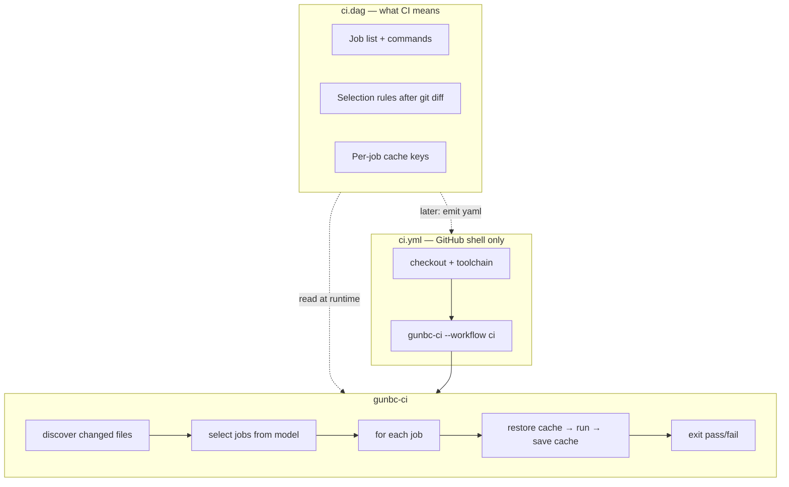

# Thin-Shim CI — Plain-Language Design

**Status:** design note (**docs only** — no `ci.dag`, `ci.yml`, ratchet, or `ci_affected_components` edits in this PR)  
**Parent plan:** ctrl#1490 (manager cluster owns ordering; this doc explains the shape)

**Scope discipline:** Any load-bearing cut (including deleting `ci.dag`, migrating authority to hand-Rust/YAML, or removing ratchets) lands in a **separate Mgr-C-gated implementation PR** with an explicit before/after cut list — not bundled here.

---

## 1. What exists today

We have **two places** that describe CI, and they overlap:

| File | Size | Role today |
|------|------|------------|
| `src/v4/workflow/ci.dag` | ~6,300 lines | **Data model** — lists CI jobs, what each job does, how to pick jobs after a git diff, cache keys per operation |
| `.github/workflows/ci.yml` | ~550 lines | **Live CI** — GitHub Actions workflow that actually runs on every PR |

**Also relevant:**

- `gunbc-ci` — a small Rust binary meant to become the in-job runner. Today its main dispatch path is a **stub** (exits with error unless a smoke env var is set).
- `dsl/gunbc/ci_emission.dag` — already sketches a **thin** workflow: one job that calls `gunbc-ci`.
- Test claims and a Rust helper (`ci_affected_components`) already **read** parts of `ci.dag` at compile/check time — but nothing runs the full pipeline from the model yet.

**The pain:** the same facts (which steps exist, when they run, what files they care about) are written twice — once in `.dag`, once in `.yml`. They drift. The `.dag` file also accumulated copy that only exists to mirror YAML step text.

---

## 2. Ideas we're working with

**CI as data.**  
`ci.dag` is the intended source of truth for *what CI means*: job list, commands (build, test, lens checks, …), rules for “run this job only if these paths changed.”

**Thin YAML shell.**  
GitHub Actions should only do what GitHub must do: checkout, install toolchain, restore coarse caches (e.g. rustup), inject secrets, name required checks, concurrency. Everything about *which gates run and how* belongs in the repo runner.

**Single runner, not many modules.**  
We are **not** splitting `ci.dag` into a dozen per-job files. One program (`gunbc-ci`) reads one model and executes it.

**One cache key per operation.**  
Each build/test step in the model carries its own cache identity (which files it depends on + a content hash of that step). There is no single job-wide cache for all work — v3 bootstrap, v4 tests, lens CI, etc. each get their own key. YAML may still run `actions/cache` for toolchain; per-operation restore/save is the runner’s job, keyed from the model.

**Two speeds of “consuming” the model:**

| Kind | Meaning | Today? |
|------|---------|--------|
| Structural | Tests and tools compile against / grep `ci.dag` | Yes |
| Runtime | `gunbc-ci` loads the model, runs selected jobs, exits pass/fail | No |

**Who owns what (steady state):**

| GitHub YAML | `gunbc-ci` runner |
|-------------|-------------------|
| Checkout | Read git diff → affected components |
| Toolchain install | Decide which jobs to run |
| Coarse cache (rustup, etc.) | Per-job cache restore/save |
| Secrets | Run each command (cargo, scripts, …) |
| Required job names, concurrency | Report + exit code |

---

## 3. What we want

**End state (simplified):**

```
ci.dag  ──models──▶  what CI is (jobs, selection, cache keys)
       │
       ├──▶  gunbc-ci reads it at runtime and runs CI
       │
       └──▶  (later) emits ci.yml — thin ~40–60 line workflow
```

- **`ci.dag`** stays the authority for pipeline meaning. It gets **smaller** by deleting duplicate YAML mirrors, not by deleting the job list or selection logic.
- **`ci.yml`** becomes a thin wrapper: checkout, toolchain, one line invoking `gunbc-ci`. Eventually **generated** from the model, not hand-edited in parallel.
- **`gunbc-ci`** owns: discover → select → for each job: restore cache → run → save cache → exit.



**Explicitly not the goal:** delete `ci.dag`, split it into 12 files, or keep hand-edited `ci.yml` forever alongside generated YAML.

---

## 4. How we'll get there

### Phase A — Ready now (thin + run)

| Step | Work | Outcome |
|------|------|---------|
| A1 | List every `ci.yml` step: GitHub-only vs runner-executable | Cut list for manager approval |
| A2 | Thin `ci.yml` to shell + one `gunbc-ci` invocation | Fewer duplicated steps; `infra_isolation` job kept |
| A3 | Implement **run-all** in `gunbc-ci`: load model, run every job, real exit code | First **runtime** consumption of `ci.dag` |
| A4 | Delete duplicate mirror text from `ci.dag` (YAML step copies, etc.) | Smaller model; manager approves each cut |
| A5 | Wire **selection**: only run jobs affected by the diff | Needs affected-set work in parent cluster |

**Phase A does not remove:** the job list, command types, selection functions, or test-corpus CI bindings.

**When can we start consuming `ci.dag` for real?**  
After **A3** — run-all runner. That can land as soon as the manager approves the thin-YAML cut list and someone implements dispatch. Smart selection (**A5**) comes after affected-set wiring; YAML generation comes in Phase B.

### Phase B — Later (generate YAML)

| Step | Work | Outcome |
|------|------|---------|
| B1 | Emit `ci.yml` from `ci.dag` (Shape-B projection) | Single source of truth for YAML too |
| B2 | Cert: changing only the runner line in output fails the cert | Proves emission is tied to model |
| B3 | Delete hand-maintained `ci.yml` | No dual authority |

Until B3 lands, hand `ci.yml` remains the transport file — Phase A only makes it thinner.

---

## 5. What to delete vs keep (for cut lists)

**Safe to delete in Phase A** (after manager review):  
Rows that only duplicate what a YAML step already says — step name mirrors, shadow copies of shell blocks, old fixtures replaced by runner output.

**Keep until replacement is proven:**  
Job list (`ci_pipeline`), command enum, “is this pipeline valid?” checks, git-diff → job selection, test-corpus CI bindings, per-job cache/upsert rows that define **keys** (not just YAML prose).

**Never do without explicit approval:**  
Remove jobs from the pipeline, edit `ci.yml` for facts the model owns, generate YAML while hand `ci.yml` still lives as a second source, reimplement selection in Rust instead of calling the model.

---

## 6. Before any implementation PR

1. Send manager a **cut list** (what files/lines change and why).  
2. Record **before** checks green (workflow claims, required CI job names).  
3. Land change + **after** checks + `gunbc-ci` smoke.  
4. Wait for gate — do not improvise load-bearing cuts.

---

## 7. How this fits other work (one line each)

- **Affected-set** — blocks smart selection (Phase A5); run-all (A3) does not wait on it.  
- **Lens CI gate** — stays a job in the model; runner executes it.  
- **Bootstrap fixes** — needed before YAML generation (Phase B).  

---

## 8. Summary

| Question | Answer |
|----------|--------|
| What exists? | Big `ci.dag` + hand `ci.yml` + stub `gunbc-ci` |
| What do we want? | Model = meaning; runner = execution; YAML = thin GitHub shell (later emitted) |
| How soon is runtime consumption? | **Phase A3** (run-all) after manager-approved thin YAML + dispatch PR |
| How soon is smart selection? | **Phase A5**, after affected-set |
| How soon is generated YAML? | **Phase B**, later |
