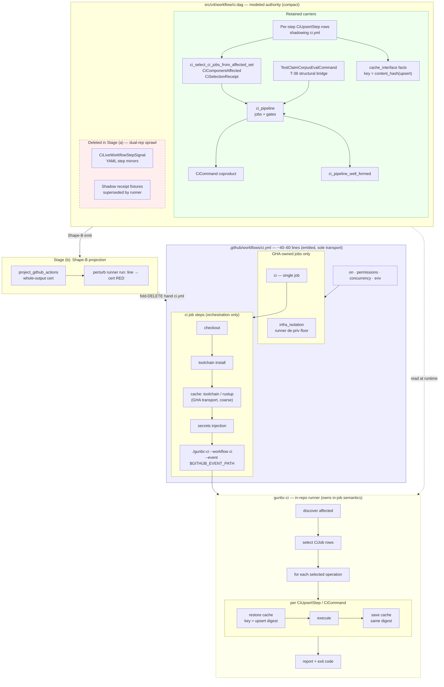

# Thin-Shim CI Dissolution — Design Note (ctrl#1490 subordinate)

> **Status:** DESIGN NOTE — subordinate to **ctrl#1490** (sole plan; no parallel roadmap)  
> **Session:** proud-deer-476 / node://adhoc-d2b4d72d-7c9  
> **Mgr-C correction (2026-06-08):** D3 resolved target is a **single thin shim**, not N modeled one-job modules.  
> **Hard rail:** No load-bearing cut to `src/v4/workflow/ci.dag` or `.github/workflows/ci.yml` without Mgr-C gate (concrete cut list + before/after checks first).

---

## §0 — Authority

| Rule | Source |
|------|--------|
| **ctrl#1490** is the only plan | witty-pike-248 / Mgr-C ready-now cluster |
| This doc is a **working artifact** | May inform dispatch; not a forked roadmap |
| Mergeable output | Implementation PR **or** this note, explicitly subordinate + Mgr-C approved |
| Load-bearing surfaces | `SELF_HOSTING.md`, `design-pure-bootstrap-zero.md` — `bootstrap.dag`, `ci.dag`, C4 |

**Superseded by this note:** the prior draft §4–§7 proposed **12 `jobs/<id>.dag` modules** — **retracted**. ctrl#1490 D3 is one maintained runner shim + eventual Shape-B emitted YAML, not per-job `.dag` file factoring.

---

## §1 — Problem (unchanged facts)

`src/v4/workflow/ci.dag` is **6337 lines** today. It mixes:

1. **Runner-owned semantics** — affected-set discovery, job selection, command dispatch, verdict aggregation (should live in the runner program, not duplicated in YAML step text).
2. **Descriptive dual-representation sprawl** — `CiLiveWorkflowStepSignal`, per-step upsert ledgers, shadow receipts, and hand-synced ci.yml mirrors of the same facts (YAML + `.dag` both describing in-job work).
3. **Durable modeled authority** — `ci_pipeline`, `CiCommand` coproduct, well-formedness, T-21/T-24 selection (must survive thinning; not deleted in Stage (a)).

`.github/workflows/ci.yml` is **~550+ lines** of multi-job orchestration that largely re-implements what a single in-repo runner can own once thinned.

---

## §2 — ctrl#1490 D3 target: single thin shim

### 2.1 Authoritative boundary

| **YAML keeps** (cross-job / GHA-owned only) | **Runner owns** (in-job program) |
|---------------------------------------------|----------------------------------|
| Checkout | Discover affected paths / components |
| Toolchain install | Decide what to run (selection, scheduling) |
| Cache restore / save **transport** (GHA `actions/cache` mechanism) | **Per-operation cache keys** (from `CiUpsertStep` / `cache_interface` — see §2.4) |
| Secrets injection | Report results |
| Matrix fan-out (only if truly required) | Exit code / fail-closed |
| Required-check job names | |
| Concurrency groups | |

YAML must **not** carry per-gate shell scripts, affected-set `if:` matrices, or descriptive re-statements of `CiCommand` work that the runner can read from modeled authority (or from a slim runtime config) and execute internally.

### 2.2 Single shim shape

**One maintained runner shim** — not 12 modeled job modules:

```
.github/workflows/ci.yml   →  thin (~40–60 lines at steady state)
                              checkout + toolchain + cache + secrets
                              + invoke runner (one line)
gunbc-ci (or successor)    →  discover → select → run → report → exit
src/v4/workflow/ci.dag     →  modeled pipeline/selection authority (shrinks; not deleted in (a))
```

Ratified transport precedent: `dsl/gunbc/ci_emission.dag` `BinaryShim` — one GHA job, `run: ./gunbc-ci --workflow ci --event "$GITHUB_EVENT_PATH"`. Today `gunbc_ci.rs` dispatch is stubbed; Stage (a) may start **dumb run-all** inside the runner before selection wiring is complete.

### 2.4 Per-operation cache (Upsert design — you read this correctly)

The mermaid below must **not** be read as one shared cache for all build/test work. The landed
`CiUpsertStep<T>` substrate gives **each pipeline operation its own cache identity**:

| Mechanism | Authority | Identity |
|-----------|-----------|----------|
| `CiUpsertStep` per command | `ci.dag` — one row per execution step | `ci_upsert_step_cache_digest` = `content_hash` of full step projection (inputs + verify + create + resolve + payload_type) |
| `CiStepSelection` | selection receipt partition | per-step `cache_digest` alongside `inputs_consulted` |
| `CacheInterfaceFacts` | `dsl/std/cache_interface.dag` | `content_hash(canonical Upsert subject)` — **not** `hashFiles(...)` (P2; see ci.dag L862–878) |

Example: `ci_upsert_v3_determinism_execution` carries its own input file-set, projects
`V3DeterminismCommand`, and tags `ci_cache_cmd_v3_determinism_tag` — distinct from
`ci_upsert_v2_bootstrap_smoke_execution` / `ci_cache_cmd_v2_bootstrap_tag`.

**YAML vs runner split for cache:**

- **GHA-owned (may appear in thin ci.yml):** coarse transport caches with no per-command semantics — e.g. rustup/toolchain store, repo-level `actions/cache` envelope when the backend is `gha_actions_cache_facts`.
- **Runner-owned (per build/test operation):** restore/save keyed by the modeled upsert digest for each selected `CiCommand` row — sccache (`sccache_local_facts`), cargo target dir (`cargo_target_dir_facts`), compiled artifacts. The runner consults `ci_upsert_row_cache_digest_for_step_id` (or Shape-B projection of the same facts) **before/after** each operation, not once for the whole job.

Stage (b) Shape-B may emit **N cache blocks** from upsert rows (one per operation that needs a GHA-backed store) **or** keep a single `gunbc-ci` step where the runner performs N keyed restore/save cycles internally. Either way, **key authority is per `CiUpsertStep`, not one job-wide key.** Hand `hashFiles` / ad-hoc `cache_key:` strings are interim transport repair only (ci.dag cache-interface note).

### 2.5 End state (Stage b) — `ci.dag` + `ci.yml`

Steady state after Shape-B emit and hand-`ci.yml` fold-delete. **Single emission authority:** `ci.dag` models facts; Shape-B projects `ci.yml`; runner executes — no dual YAML representation.



**Reading the diagram:**

| Box | Role |
|-----|------|
| **Green (`ci.dag` retained)** | Pipeline membership, command taxonomy, well-formedness, affected-set selection — runner reads these at execution time |
| **Red dashed (`ci.dag` deleted)** | Descriptive bridges that duplicated YAML step text; gone after Stage (a) cut list |
| **Blue (`ci.yml`)** | Thin emitted shell: GHA triggers, required job names, checkout/toolchain/cache/secrets, one runner invocation |
| **Yellow (`gunbc-ci`)** | Selection, per-operation execute, and **per-operation cache** keyed by `CiUpsertStep` digest |
| **Upsert rows** | One cache identity per build/test operation — not a single job-wide cache key |

Stage (a) interim: hand-maintained `ci.yml` thins toward the blue box; runner may **run-all** before selection wiring (a.5). Stage (b) replaces hand YAML with emitted output and deletes the hand file.

---

## §3 — Stage ordering (ctrl#1490 row map)

### Stage (a) — Ready-now: thin / delete

**Goal:** Remove descriptive dual-rep sprawl; thin `ci.yml` to a maintained runner shim.

| Step | Action | Gate |
|------|--------|------|
| **a.1** | Inventory dual-rep: every ci.yml step whose behavior is runner-executable vs GHA-only | Cut list → Mgr-C before edit |
| **a.2** | Thin ci.yml: retain §2.1 YAML-owned surface; collapse in-job steps behind single runner invocation | Before/after: required checks still named; `infra_isolation` floor preserved |
| **a.3** | Runner: land **dumb run-all** dispatch (executes full pipeline; no selection yet) | `gunbc-ci` exits 0 on green; fail-closed on red |
| **a.4** | Delete **descriptive** sprawl from `ci.dag` only where Mgr-C approves cut list — interim bridges (`CiLiveWorkflowStepSignal`, redundant upsert shadow rows mirroring YAML steps) | Per-symbol cut list + claim receipts |
| **a.5** | Wire runner selection when affected-set-3a / lens-CI-gate deps green | Selection reads `ci_select_ci_jobs_from_affected_set` |

**Not in Stage (a):** deleting `ci_pipeline`, `CiCommand` coproduct, T-38 corpus eval binding, or `ci_pipeline_well_formed`.

### Stage (b) — Later: Shape-B emit

**Goal:** Emit the ~40–60 line shim **from `.dag`** with whole-output certification; perturb runner-invocation line = red.

| Step | Action | Gate |
|------|--------|------|
| **b.1** | Shape-B projection from `v4.workflow.ci` (or successor slim model) → GitHub Actions `Workflow` | Whole-output cert (THESIS H3 beachhead) |
| **b.2** | Perturbation test: change runner `run:` line only → cert red | Fail-closed receipt |
| **b.3** | **Fold-DELETE** hand `ci.yml` | **Never** emit alongside hand-maintained ci.yml as dual authority (C4) |

**Dissolution trigger for hand ci.yml:** Stage (b) cert green + Mgr-C C4 sign-off. Until then, hand ci.yml is the transport; thinning in (a) reduces line count but does not claim YAML authority dissolution.

---

## §4 — What to delete vs keep (scoping for cut lists)

### 4.1 Candidate **delete** (descriptive dual-rep — Stage (a), gated)

Requires per-PR cut list to Mgr-C:

| Bucket | ~Lines | Rationale |
|--------|--------|-----------|
| `CiLiveWorkflowStepSignal` / `M1CiLiveWorkflowSignal` ledger rows | ~200 | YAML step mirrors; runner owns execution |
| Per-step `CiUpsertStep` rows that **only** shadow ci.yml step *text* (duplicate shell, not cache authority) | varies | Delete YAML mirrors; **keep** rows whose `cache_digest` + `inputs` are the cache/selection authority |
| Wave-2 shell exception table arms whose YAML step is retired | ~200 | Static floor until dynamic selection replaces |
| Shadow receipt **fixtures** superseded by runner receipts | ~500 | Keep until runner emits equivalent partition |

### 4.2 **Keep** until runner + Shape-B prove replacement

| Surface | Why |
|---------|-----|
| `data ci_pipeline` | Single job/gate membership authority |
| `CiCommand` coproduct | Closed command taxonomy |
| `ci_pipeline_well_formed` | Eager fail-closed |
| `ci_select_ci_jobs_from_affected_set` + `CiComponentAffected` | T-21/T-24; runner consumes |
| `TestClaimCorpusEvalCommand` + `ci_upsert_testclaim_corpus_eval_*` | T-38 structural bridge |
| `CiSelectionReceipt` (modeled partition) | Runner scheduling input until Shape-B emits `if:` from receipt |
| 6 workflow claim import surface | Compile consumers |

### 4.3 Line-budget autopsy (informing delete candidates, not module split)

| Region | ~Lines | Stage (a) posture |
|--------|--------|-------------------|
| L1–320 | 320 | Keep types; delete live-workflow bridges when YAML thinned |
| L1163–2200 | 1038 | **Primary delete candidate** — upsert rows mirroring YAML |
| L3471–5677 | ~2300 | Keep selection logic; delete fixtures when runner receipts land |
| L5894–6228 | 335 | **Move to runner** (Rust); keep `.dag` types if claims import |
| L6229–6337 | 108 | Runner policy may stay modeled for `infra_isolation` comment anchor |

**Target after Stage (a) (indicative, not ratified):** `ci.dag` loses descriptive sprawl; modeled authority compacts but remains one module until Mgr-C says otherwise. **Not** a target of 12 files.

---

## §5 — Mgr-C gate protocol (mandatory)

Before any PR that **cuts** load-bearing `ci.dag` or **thins** `ci.yml`:

1. **Cut list** — file paths + symbol names + line ranges + deletion rationale (dual-rep vs authority).
2. **Before checks** — commands/claims green today (`ci_component_affected`, `affected_set_ci_runner`, `ci_selection_receipt_shadow_well_formed_ok`, required CI job names).
3. **After checks** — same suite + runner smoke (`gunbc-ci` dumb run-all or selection path).
4. **Send to witty-pike-248** — wait for gate/escalation before merge.

**STOP (escalate, do not improvise):**

- Reducing `ci_pipeline` job count without named dissolution mark.
- Hand-editing ci.yml for facts owned by runner selection.
- Emitting Shape-B ci.yml while hand ci.yml remains (dual authority).
- Splitting `ci.dag` into parallel module authorities without ctrl#1490 amendment.

---

## §6 — Cluster ordering (ctrl#1490 deps)

Ready-now cluster (parent lane) — this note does **not** reorder; it maps thin-shim onto stated deps:

| Lane | Relationship to thin-shim |
|------|---------------------------|
| **affected-set-3a** | Runner selection consumes `ci_select_ci_jobs_from_affected_set`; blocks smart dispatch (a.5) |
| **lens-CI-gate (M2)** | `LensCiCommand` remains in `ci_pipeline`; runner executes |
| **get-off-v3 (M3)** | Orthogonal per-file migration; no ci.dag module fork |
| **SB-c/d fixes** | Bootstrap substrate; precedes Shape-B cert |
| **M1 A3 brand-twin probe** | `M1RustEmitProbeCommand`; runner-owned in (a) |

Stage (a) **a.1–a.3** (thin YAML + dumb runner) may proceed in parallel with affected-set hardening; **a.5** waits on affected-set-3a.

---

## §7 — Verification

| Stage | Check |
|-------|-------|
| (a) YAML thin | `wc -l .github/workflows/ci.yml` drops; required job ids unchanged |
| (a) Runner | `gunbc-ci --workflow ci --event …` executed (not stub exit 2) |
| (a) Model | `cargo test` / v4 workflow claims green |
| (b) Shape-B | Whole-output cert + perturb runner-line red |
| (b) C4 | Hand ci.yml deleted; single emission authority |

---

## §8 — Summary

- **ctrl#1490 D3:** one **thin runner shim** + YAML that only owns GHA orchestration — **not** 12 `.dag` job modules.
- **Stage (a):** delete descriptive dual-rep, thin hand ci.yml, runner starts dumb run-all; Mgr-C gates every load-bearing cut.
- **Stage (b):** Shape-B emit ~40–60 line workflow from `.dag`; fold-delete hand ci.yml; never dual authority.
- **This doc** is subordinate to ctrl#1490; retracts the prior 12-module row map.
