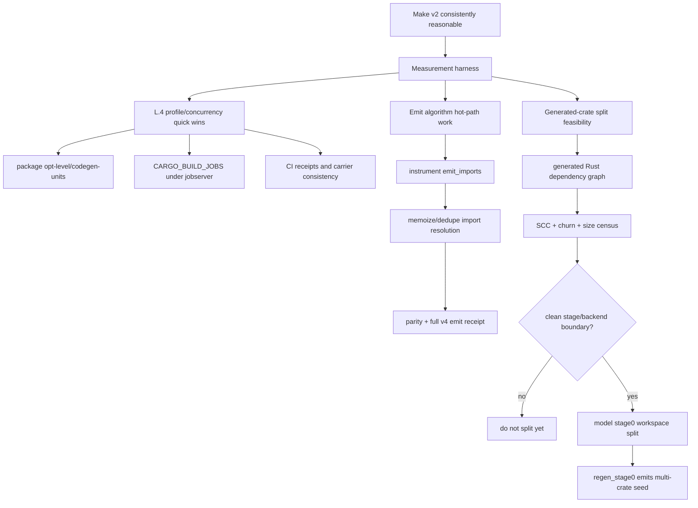

# v2 Compiler Performance Stabilization Scope

> **Status:** planning/scope note, no implementation authority.
> **Goal:** make the v2 compiler consistently reasonable while it remains the bootstrap seed for v4 CI and self-hosting work.
> **Related evidence:** `docs/planning/ci-floor-profiling-constraints-2026-06-03.md`.
> **Rule:** performance work must preserve the `.dag` authorities and fail-closed compiler gates. Rust stage0 is a seed and generated realization, not a new place to encode source truth.

## 1. Objective

The target is not "make CI as fast as possible." The target is:

```text
v2 is predictable, understandable, and fast enough that relying on it
for the next self-hosting interval does not distort project decisions.
```

For this scope, "reasonable" means:

- cache-miss v2 build time is bounded and not surprising;
- every-run v4 emit probe time has an explained cost model;
- hot paths are text-processing / graph-processing costs, not accidental repeated full scans;
- local optimization work does not create a second compiler authority;
- structural work has a dependency graph receipt before it touches generated stage0 layout.

## 2. Current Diagnosis

The v2 compiler is simple in intent: read `.dag`, build typed graphs, emit target text. The current cost does not come from conceptual complexity as much as from the bootstrap realization shape:

```text
src/v2/*.dag authorities
  -> regen_stage0
  -> one committed generated Rust package: v2-compiler
  -> one release binary: gunbc
  -> ci_floor emits all src/v4 through that binary
```

Observed cost centers:

| Cost center | Current evidence | Character |
| --- | --- | --- |
| cache-miss build | `v2-compiler` release rebuild ~351s at `CARGO_BUILD_JOBS=2`; package `opt-level=2` reduces build+emit by ~162s | release codegen for one large generated package |
| M1 emit probe | full v4 rust+dag probe is the every-run tax | fail-closed CI gate |
| emit outliers | two modules spend ~97% of module time in `emit_imports` | likely repeated import-resolution work, not item-render quadratic |
| runner concurrency | workflow pins `CARGO_BUILD_JOBS=2` despite 128-core hosts | probably conservative per-runner cap; needs jobserver-aware measurement |

## 3. Workstream Flow



## 4. Phase 0: Stable Measurement Harness

Before changing v2, create a repeatable local/CI measurement harness that labels:

- commit/head;
- runner host and runner count if available;
- `CARGO_BUILD_JOBS`, `MAKEFLAGS`, jobserver FIFO state, `RUSTC_WRAPPER`, `CARGO_INCREMENTAL`;
- target cache state: cold deps, warm deps, binary cache hit/miss shape;
- exact command and profile knobs;
- wall time, rustc timing where available, and diagnostics count.

Minimum harness slices:

| Slice | Purpose |
| --- | --- |
| warm target, touched generated stage0 file, release build | substrate-PR cache-miss approximation |
| `src/v4 --target rust+dag` M1 probe | correctness and runtime sensitivity |
| outlier module emit instrumentation | explain universal emit tax |
| `CARGO_BUILD_JOBS=2/4/8/16` under jobserver | distinguish per-runner cap from host-wide safety |

Exit criterion:

- a single table can compare build, emit, and total substrate-PR wall for each variant;
- the table includes enough environment facts to explain variance;
- all emit runs report diagnostics.

## 5. Phase 1: Low-Risk Build/Profile Work

This is the immediate "make it less silly" lane. It is scheduling/profile work, not substrate work.

Candidate changes:

| Candidate | Evidence | Risk | Scope |
| --- | --- | --- | --- |
| package `opt-level = 2` for `v2-compiler` | best measured net win: ~2.7m on build+emit at jobs=2 | changes generated compiler optimization level; needs emit/tests receipt | small PR |
| package `codegen-units = 256` | measured net win: ~2.3m | weaker than opt2; may reduce runtime locality | small PR if opt2 rejected |
| raise `CARGO_BUILD_JOBS` from 2 | unmeasured; likely helps when host idle | can increase runner contention if jobserver is not effective | measurement first |

Landing bar:

- package-scoped only;
- keep `.dag` compiler authorities untouched;
- run v2 tests and M1 v4 rust+dag emit receipt;
- update modeled CI/YAML carriers if the workflow or profile policy becomes modeled by RR-L;
- call the change performance-only.

## 6. Phase 2: Emit Hot-Path Cleanup

This lane targets the every-run tax. The first profile says the known outliers are dominated by import emission:

```text
v4.extdeps.languages.rust: emit_imports ~35.44s, item loop ~1.24s
v4.compiler.translate:    emit_imports ~30.10s, item loop ~0.73s
```

The first implementation should not parallelize and should not skip the gate. It should reduce repeated work inside the existing emit authority.

Suggested investigation order:

1. Split `emit_imports` timing into wildcard reexport surface, specific import block, variant-parent lookup, and graph-type-name lookup.
2. Count repeated `(import_module, name)` and `(candidate_module, exported_surface)` lookups.
3. Add memoization only where the key is immutable over the typed graph and source module.
4. Prove no emitted Rust or diagnostics changed on a representative slice and then full `src/v4`.

Allowed shape:

```text
same typed graph + same import declarations
  -> fewer repeated lookups
  -> identical emitted files and diagnostics
```

Forbidden shape:

- skip an import because it "should be unchanged";
- change wildcard semantics to reduce work;
- add Rust-only template shortcuts that are not generated from `.dag` authority;
- weaken the M1 fail-closed gate.

## 7. Phase 3: Generated-Crate Split Feasibility

Splitting the generated stage0 package could help cache-miss builds, but it is structural bootstrap work. It should not start by choosing "one crate per file" or "one crate per folder."

Purity matters because it makes good interfaces possible:

```text
tokenize(SourceText) -> Tokens
parse(Tokens, InternTable) -> ParsedModule + InternTable
resolve(Vec<ParsedModule>) -> ResolvedGraph
infer(ResolvedGraph, SourceIndex, InternTable) -> TypedGraph
emit_rust(TypedGraph, EmitOptions) -> EmittedFiles + Diagnostics
```

Purity does not imply one crate per `.dag` file. A `.dag` file is source/model authority; a Rust crate is an incremental compilation and API boundary. Those boundaries should be related but not identical.

Correct split heuristic:

1. Build the generated Rust module dependency graph.
2. Collapse strongly connected components.
3. Overlay generated file size and recent regen churn.
4. Identify stage/backend boundaries with small pure APIs.
5. Split only if the boundary reduces rebuild work without forcing broad public internals.

Likely first candidate boundaries:

| Candidate crate | Why | Blocker to check |
| --- | --- | --- |
| `v2_stage0_core` | shared runtime/types/diagnostics | must not become a dumping ground for all generated helpers |
| `v2_stage0_frontend` | tokenize + parse | intern-table threading and parser dependencies |
| `v2_stage0_resolve` | module/import graph | type dependencies into infer/emit |
| `v2_stage0_infer` | large, pipeline-local stage | shared type graph and lookup APIs |
| `v2_stage0_emit_core` | artifact/import planning | avoid Rust-backend-specific facts |
| `v2_stage0_emit_rust` | largest generated file and measured hot backend | helper/type cycles with emit core and compiler tests |
| `gunbc` | CLI orchestration only | should not own compiler semantics |

Feasibility exit criterion:

- dependency graph shows a candidate split with no unacceptable cycle;
- expected rebuild savings are estimated from file size/churn and rustc timings;
- `regen_stage0` output registry can represent the split;
- freshness verification compares the multi-crate seed to a fresh self-compile;
- the plan names which `.dag` stage model justifies each crate boundary.

Prototype census tool:

```sh
python3 scripts/v2_stage0_dependency_census.py --top 12
python3 scripts/v2_stage0_dependency_census.py --format json
```

The first run on this head found 64 stage0 modules, 309 direct module-reference edges, and one
multi-module SCC. That SCC is the first split blocker to study:

```text
v2_compiler_compile
v2_compiler_compiler_tests_rust
v2_compiler_dag_collect
v2_compiler_emit_rust
```

This does not prove that `emit_rust` cannot become its own crate. It proves that a direct split is
blocked until the cycle is understood and either kept together as an emit/compile component or
broken by a modeled API change.

## 8. What Not To Do

Do not:

- split per `.dag` file by default;
- split per folder without graph evidence;
- optimize by hand-editing generated Rust;
- introduce hidden global state to make interfaces convenient;
- reduce CI by skipping M1 without a policy decision;
- use build time as proof of compiler correctness;
- turn Rust crate boundaries into new source authority.

## 9. Proposed Dispatch Units

These are separable worker-sized tasks:

| Unit | Output | Implementation risk |
| --- | --- | --- |
| Measurement harness | repeatable script/report for build+emit variants | low |
| `CARGO_BUILD_JOBS` jobserver matrix | table for `2/4/8/16`, host load/RSS, diagnostics | low |
| package profile trial PR | package-scoped `opt-level=2` or `codegen-units=256` with receipts | low/medium |
| `emit_imports` microprofile | timing/count report for subpaths and repeated keys | low |
| `emit_imports` memoization PR | identical emit output, lower import time | medium, load-bearing emit |
| generated dependency graph census | SCC/churn/size report, no code split | low |
| stage0 workspace split design | modeled multi-crate seed plan and receipts | high |

## 10. Recommended Near-Term Order

```text
1. Land or re-run the measurement harness until variance is understood.
2. Measure CARGO_BUILD_JOBS=2/4/8/16 under the host jobserver.
3. If stable, land package-scoped opt-level=2 for v2-compiler with receipts.
4. Microprofile emit_imports and dispatch the smallest memoization PR that preserves output.
5. Only after those: run the generated dependency graph census for crate splitting.
```

Rationale:

- profile/concurrency work can buy minutes without changing compiler authority;
- `emit_imports` targets the universal tax and already has a concrete hotspot;
- crate splitting is valuable only if the graph shows clean stage/backend boundaries.

## 11. Open Questions

- Is the current `CARGO_BUILD_JOBS=2` an intentional safety cap from a prior runner incident, or stale now that the host jobserver exists?
- Does `opt-level=2` remain neutral across multiple full v4 emit runs and v2 compiler test suites?
- Which `emit_imports` lookup key accounts for most repeated work?
- Do generated Rust module SCCs align with pipeline stages, or are there cross-stage helper cycles that must be modeled first?
- What p95 target should `ci_floor` enforce for ordinary PRs and substrate PRs after the first two low-risk improvements?
