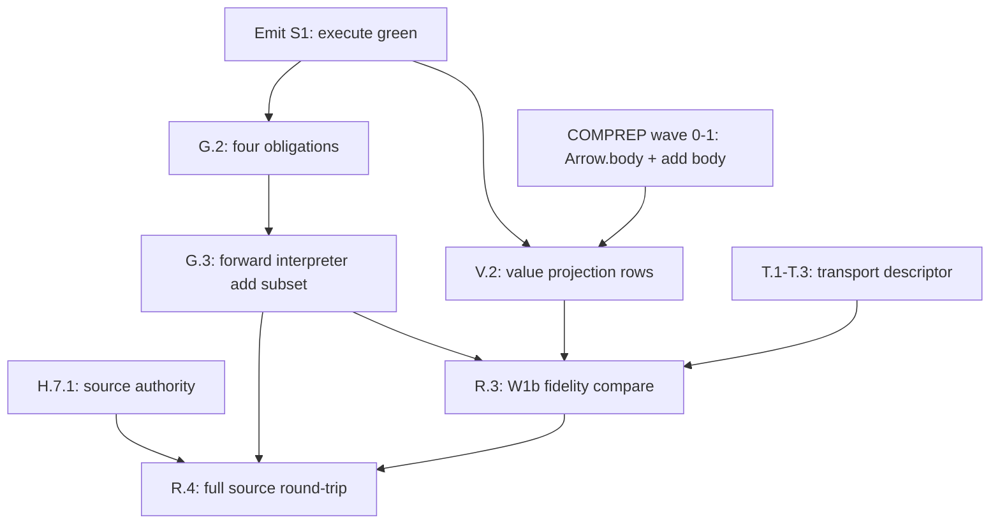

# #g-bidir Scoping Worksheet — Bidirectional Emit/Ingest Unification

> **Status:** SCOPING — map, not territory (INVARIANTS "Map vs territory"). No implementation
> lands from this worksheet without the consumers named in §8 (E-10).
> **Work item:** `node://adhoc-30ed95ca-9d6` (session `vivid-fox-248`).
> **Authority:** THESIS "core flip" (emit = coerce *to*, ingest = coerce *from*, one engine);
> `docs/design-bidirectional-coercion.md` (BIDIR dep-graph node);
> `docs/design-value-emit-schema.md` + `docs/design-omni-emission-transport.md` (bidir-aware
> slices); `docs/planning/rr-b-omni-ingestion-worksheet-2026-06-02.md` (B-min floor).

## Guard

- **No third syntax authority.** `ConcreteSyntaxSchema` (`std/grammar.dag`) is the staged
  single concrete-syntax carrier; `LexPattern`, `GrammarExpr`, and `ParseGrammar` are
  operational projections until CP-1b convergence — not parallel authorities.
- **No parallel ingest engine.** Ingest is not a bolt-on parser project; it is the forward
  interpreter of the same production rows emit renders backward (`design-bidirectional-coercion.md`
  §4.1). `coerce_grounded_node` on target-model trees is the semantic half, not a substitute
  for source parse.
- **No bit-identical round-trip claims** without an explicit quotient declaration
  (`FidelityDisposition` / per-target normalization budget). Identity means
  identity-up-to-declared-quotient (C5).
- **Gated on emit execution.** The emit path must terminate and produce real source by
  execution (v4-compiler-migration S1) before breadth work on bidir rows — otherwise the
  inverse proof has no forward consumer to falsify.

---

## 10-Field Worksheet

| Field | Entry |
|---|---|
| 1. Work item | `node://adhoc-30ed95ca-9d6` — scope INGEST as emit dual + collapse into one `find_witness` coercion over shared grammar/descriptor substrate. |
| 2. Thesis commitment | Emit and ingest are one engine: two declared relations per target (syntax + semantic), each interpreted in both directions by shared `find_witness` machinery — zero hand-written direction-specific adapters (`design-bidirectional-coercion.md` §5). |
| 3. Substrate (named, P1) | No new substrate primitives. Relation data lives in existing carriers: `FormalGrammar`/`FormalProduction`, `ConcreteSyntaxSchema`, `LexRules`, `TargetModel` rows, `GrammarRelationRow`, `TargetValueExpression`/`TargetValueTemplate`, `HostTransportDescriptor` (design-only until landed). `find_witness` itself is frozen — selection discipline only, not extended. |
| 4. Two layers | **Syntax:** token seq ↔ target-model tree via production rows (§3.1). **Semantic:** target-model tree ↔ canonical IR via `coerce_grounded_node` / `find_witness_derives` (§3.2). Neither layer reaches around the other. |
| 5. Three bidir-aware slices | Grammar/lex (CP-1b), value-emit-schema (body tier), omni-emission transport (runtime boundary). Each authors rows once; both directions read them. |
| 6. Current receipts | RTADD (`mvp1_dag_add_round_trip.dag`) — emit → `coerce_grounded_node` → canonical IR, executed Bool witness. B-min floor claim (`claim_dag_ingestion_floor_min`). English ingest fail-closed boundary. LLVM IN-B probe (structured ingest, not text adapter). |
| 7. Current gaps | Forward parse uses parallel operational algebra (`02_parse`); full `compile_ingest_staging` is legacy staging; four bidirectionality obligations not landed as structural folds; value-tier projection + operator catalog design-only; `HostTransportDescriptor` design-only; W1b emit→ingest fidelity compare open; Bmin.4–5 blocked on H.7.1 source authority. |
| 8. Minimal slice | Home language (`dag.dag`), `add` keystone subset: author rows + four obligations green → derive both interpreters → round-trip by execution up to declared quotient (§7). |
| 9. Dependencies | In: emit S1 execution, optional COMPREP wave-1 for honest body-tier scope, H.7.1 for full source parse/print law (Bmin.4–5). Out: T7 ingest enablement, COMPREP wave-3 bodies-through-translate, SELFHOST source ingestion, cross-target round-trip breadth. |
| 10. Handoffs | B-min authority → RR-B owner; source parse/print law → Branch H; value-emit rows → emit-ladder / COMPREP wave-3; host transport → omni-emission slice; Go parse-claim movement → Go owner per RR-B B2.2. |

---

## 1. The unification — one `find_witness`, two relations, two directions

The headline "emit/ingest = one coercion" cashes out as **two declared relations per target**,
each a closed candidate set + preservation predicate, both directions using the same
`find_witness` fold (`std/find_witness.dag`):

```
                    SYNTAX RELATION (per target, declared once)
source text ──forward interpreter──► target-model tree ──backward interpreter──► source text
              (ingest: parse/render-lex)                    (emit: serialize/render)

                    SEMANTIC RELATION (per target, declared once)
canonical IR ──coerce-to (translate)──► target-model tree ──coerce-from──► canonical IR
              find_witness_derives / coercion_fold          coerce_grounded_node
```

**Emit pipeline:** `coerce-to` then `backward interpreter` (`05_emit` = `serialize ∘ translate`).
**Ingest pipeline:** `forward interpreter` then `coerce-from` (`compile_ingest_staging` target
shape; today hand-built, dissolution target is derived forward interpreter).

Production selection at the syntax layer is not a new primitive — it is `find_witness` with
direction-specific predicates (`design-bidirectional-coercion.md` §4.2):

| Direction | Candidates | Preservation predicate |
|---|---|---|
| Backward (render) | target's `FormalProduction` set (closed) | source node inhabits production LHS shape |
| Forward (parse) | same set | token frontier matches production RHS prefix |
| Semantic to-IR | `declared_inhabitants` on `TargetModel` | `project_to_core` / `exact_structural_equality_zip_fold` / etc. |
| Semantic from-IR | same inhabitant set | widening/refinement rules in opposite direction |

Ambiguity in a *declared* grammar is a model defect — rejected at validation time (§4.3
obligations), with per-use `find_witness` ambiguity as fail-closed backstop.

---

## 2. INGEST scoped as the dual of EMIT

### 2.1 Pipeline composition (mirror)

| Stage | EMIT (landed shape) | INGEST (dual — target shape) | Today |
|---|---|---|---|
| Lexical | render lexeme from `LexRules` (backward) | scan tokens from `LexRules` (forward) | `01_tokenize` forward only; lex CP-1b marker |
| Syntactic | `target_serialize_source_from_model` — grammar-inverse walk over rows | parse: forward row interpreter over same rows | emit backward approximated in `06_translate`; ingest uses `02_parse` operational types |
| Semantic | `translate` — IR → target tree (`coercion_fold` to-direction) | `coerce_grounded_node` — target tree → IR | **Landed** for add keystone (RTADD) |
| Normalize | C5 quotient on emit path (trivia stripped per `FidelityDisposition`) | same quotient on ingest path (symmetric) | declared in `dag.dag` / `fidelity.dag`; W1b compare not landed |
| Host/runtime | `run_emit_host` → spawn, capture stdout | `runtime_value_parse` → bytes → `RuntimeValue` | hand-list per target; omni-emission design rules descriptor fold |

### 2.2 What "ingest" names (disambiguation)

Three ingest surfaces exist today; scope treats them as **one mechanism at different boundaries**:

1. **Source ingest** — `Source` text → canonical IR (`compile_ingest_staging`). The BIDIR
   dissolution target: forward interpreter replaces hand `02_parse` per construct.
2. **Target-tree ingest** — emitted/foreign target-model tree → IR (`coerce_grounded_node`).
   **Already the semantic dual of `translate`**; RTADD is the receipt.
3. **Runtime-byte ingest** — process stdout → `RuntimeValue` (`runtime_value_parse`). Dual of
   emit-host execution; omni-emission transport design scopes the codec row.

Surfaces 2 and 3 are partial ingest today. Surface 1 is the main unification debt.

### 2.3 Forbidden shapes (P2 / hand-rolled derived operation)

- Per-construct render lambdas on emit without a production row.
- Per-construct parse functions without a production row.
- `IngestionDescriptor` twin parallel to `HostTransportDescriptor` (omni-emission §5).
- Second coercion engine for ingest — semantic ingest **is** `coerce_grounded_node`.
- Treating `coerce_grounded_node` round-trip as proof of full source ingest (RTADD proves
  semantic + grammar-inverse on **fixture trees**, not `Source` text → parse → IR).

---

## 3. Shared substrate — three bidir-aware slices

### 3.1 Slice A — Grammar / lex (CP-1b)

**Authority:** `ConcreteSyntaxSchema` + `WellFormedFormalGrammar` (`std/grammar.dag`).

**Emit reads:** `FormalProduction` rows backward via `grammar_inverse` / serialize walk.
**Ingest reads:** same rows forward — candidate = productions for current nonterminal;
`find_witness` selects by RHS frontier match.

**Bidirectionality obligations** (static, per grammar — `design-bidirectional-coercion.md` §4.3):

| # | Obligation | Emit direction | Ingest direction |
|---|---|---|---|
| 1 | Slot bijection | bound terminals ↔ LHS named edges | captures ↔ edges |
| 2 | Forward determinism | (validation only) | disjoint RHS frontiers |
| 3 | Backward determinism | disjoint LHS shapes | (validation only) |
| 4 | Quotient declaration | trivia channels normalized | same channels stripped on parse |

**Dissolution:** `ParseGrammar` / `GrammarExpr` / `LexPattern` operational types delete
per-construct as forward interpretation + obligations go green (CP-1b markers).

**Coupling:** RR-B B-min rows Bmin.1–3 (authority + terminal coverage + well-formed witness)
are prerequisites for honest forward interpretation; Bmin.4–5 wait on H.7.1.

### 3.2 Slice B — Value-emit-schema (body tier)

**Authority:** `TargetValueExpressionKind` + `TargetValueTemplateKind` twins,
`TargetValueExpressionProjection` per language, `CanonicalOperation` +
`TargetOperatorRealization` catalog (`design-value-emit-schema.md`).

**Emit:** exhaustive `Behavior` fold → `TargetValueExpression` carriers → backward row render.
**Ingest:** forward row match on value surface → `TargetValueExpression` → inverse projection
→ `Behavior` subtree. Operator catalog read forward for ingest recognition (§4.3: one fact, two
directions).

**Scope gate (E-10):** `BindingRef` + `PrimitiveApply` only until COMPREP wave-1 body producer
lands; `Branch`/`Loop`/`Bind` kinds producer-gated.

**Coupling:** COMPREP wave-3 ("bodies through translate/emit") is ladder-coupled — T7 body
ingest is forward interpreter, not new work (`design-computation-representation.md` §3 wave 3).

### 3.3 Slice C — Omni-emission transport (runtime boundary)

**Authority:** `HostTransportDescriptor` + `RuntimeValueCodec` (`design-omni-emission-transport.md`).

**Emit:** descriptor fold → workspace write → build → run → receipt.
**Ingest:** same descriptor's `runtime_value_codec` read forward by `runtime_value_parse`
(bytes → `RuntimeValue`). Source-ingestion of foreign projects reuses grammar rows (slice B/A),
not a second descriptor.

**Scope gate:** Model + rows + one `run_host_process` primitive first; hand-list deletion held
until TS round-trip through descriptor row (manager ruling 2026-06-10).

---

## 4. Current state audit

| Component | Emit direction | Ingest direction | Verdict |
|---|---|---|---|
| `find_witness` / `find_witness_derives` | coercion to target | coercion from target | **Landed** — semantic engine |
| `coerce_grounded_node` | n/a (uses translate for to-direction) | target tree → IR | **Landed** — RTADD executed |
| `translate` + `05_emit` | IR → source text | n/a | **Modeled** — execution gated (S1) |
| `grammar_inverse_source_validated` | validates serialize row | n/a | **Landed** — RTADD witness |
| `02_parse` + `compile_ingest_staging` | n/a | Source → IR | **Staged** — parallel algebra, dissolution target |
| `ConcreteSyntaxSchema` | projection source | projection source | **Landed** — B-min authority |
| Four bidir obligations | not checked | not checked | **Open** — scope row G.2 |
| `TargetValueExpressionProjection` | design only | design only | **Open** — scope row V.1 |
| `HostTransportDescriptor` | design only | design only | **Open** — scope row T.1 |
| Round-trip `Source → … → Source` | partial via serialize | blocked on H.7.1 + W1b | **Blocked** |
| C5 `FidelityDisposition` | declared per target | declared per target | **Landed** — trivia policy |
| English prose ingest | n/a | fail-closed | **Landed** — boundary claim |

---

## 5. Phased scope rows

### Phase G — Grammar bidirectionality (home language, add subset)

| Row | Status | Required shape | Consumer |
|---|---|---|---|
| G.1 | Open | `add`-subset `FormalProduction` rows with named bindings in `dag.dag` | obligation folds |
| G.2 | Open | Four obligation structural folds + discriminating red claims (dropped capture, overlapping frontier, duplicate LHS, quotient perturbation) | `TestClaim` lens verdicts |
| G.3 | Open | Forward interpreter derived over G.1 rows for `add` subset (enough for keystone surface) | replaces hand path in `02_parse` for those constructs |
| G.4 | Open | Round-trip by execution: `add` source → tree → source, identity up to `dag` quotient | extends RTADD to **text** |
| G.5 | Deferred | Per-construct `02_parse` dissolution beyond `add` subset | consumer-triggered ratchet |

**Blocked:** G.4 full source-text round-trip also needs H.7.1 canonical source AST law for
bit-faithful claims beyond quotient-honest identity.

### Phase V — Value-emit-schema bidirectionality

| Row | Status | Required shape | Consumer |
|---|---|---|---|
| V.1 | Open | `TargetValueExprBindingRef` + `TargetValueExprPrimitiveApply` kinds + template twins | substrate |
| V.2 | Open | `TargetValueExpressionProjection` + one-entry `TargetOperatorRealization` catalog (TS skeleton first) | TS emit-vs-eval |
| V.3 | Open | Body projection fold (exhaustive `Behavior` match) + backward render | `06_translate` |
| V.4 | Open | Forward value-surface recognition using same catalog | ingest of value tier |
| V.5 | Deferred | `CallableApply`, wave-2 behaviors | COMPREP producers |

**Gated:** V.1+ requires COMPREP wave-0/1 (`Arrow.body` + add body producer) for honest body
scope — or explicit signature-tier labeling if proceeding on fixtures only.

### Phase T — Omni-emission transport bidirectionality

| Row | Status | Required shape | Consumer |
|---|---|---|---|
| T.1 | Open | Substrate types in `std/host_run.dag` + descriptor rows (rust/python/go/typescript) | fold reads rows |
| T.2 | Open | One `run_host_process` primitive + one eval hook | emit-vs-eval |
| T.3 | Open | `run_emit_host` + `runtime_value_parse` as descriptor folds | deletes hand-list |
| T.4 | Held | Delete per-target Rust runners / dispatch chains | after TS descriptor round-trip green |

### Phase R — Round-trip integration (cross-slice)

| Row | Status | Required shape | Consumer |
|---|---|---|---|
| R.1 | Landed (partial) | RTADD semantic round-trip on fixture tree | `mvp1_dag_add_round_trip.dag` |
| R.2 | Landed (floor) | B-min authority readiness | `claim_dag_ingestion_floor_min` |
| R.3 | Open | W1b emit→ingest fidelity compare (normalized, C5-honest) | `dag_ingest_round_trip.dag` label follow-up |
| R.4 | Blocked | Full `source.dag` parse/print law round-trip | H.7.1 + Bmin.4–5 |
| R.5 | Deferred | Per-language B-full ingest (8-row expansion) | RR-B B2.8 — after B-min stable |

---

## 6. Sequencing and dependency graph



**Recommended dispatch order:**

1. **Parallel track 1 (grammar):** G.1 → G.2 → G.3 — does not require COMPREP if scoped to
   signature/`add` surface syntax already parseable.
2. **Parallel track 2 (value tier):** V.1–V.4 — gated on COMPREP wave-1 for real bodies; TS
   skeleton may use interim fixture body per value-emit-schema §6.
3. **Parallel track 3 (transport):** T.1–T.3 per omni-emission §4 ordering.
4. **Integration:** R.3 once G.3 + emit S1 green; R.4 after H.7.1.

**Explicitly not in #g-bidir scope:** B-full per-language ingest breadth (RR-B B2.8), parser
generator tooling, grammar inference, η-equivalence research, multi-run host descriptors.

---

## 7. Minimal slice definition (E-10 / seesaw)

The committed risk is **same rows, both directions + obligations** — not a toy grammar.

**Green (all required, by execution):**

1. `add`-subset production rows with bindings in `dag.dag`.
2. Four obligation folds green on that subset + three discriminating reds (§4.3).
3. Backward interpreter matches existing `target_serialize_source_from_model` on `add` (no regression vs RTADD).
4. Forward interpreter parses `add` source text to a target-model tree admissible to `coerce_grounded_node`.
5. Compose: `source → forward → coerce_from → coerce_to → backward → source` identity up to declared quotient; whitespace perturbation green, identifier perturbation red.

**Does not need to be green for minimal slice:**

- Full `02_parse` replacement.
- Value-tier body projection (separate V-track).
- Host transport descriptor (separate T-track).
- Bit-identical round-trip (T8 / H.7.1).

---

## 8. Open questions — escalate, don't improvise

| ID | Question | Recommendation | Escalate if |
|---|---|---|---|
| Q-G1 | T3 fold-carrier shape (positional vs labeled edges in derived rows) | Defer until one bounded run (`design-optional-surface.md` §4) — kinds + catalog independent | implementation commits carrier shape early |
| Q-G2 | Quotient field shape on `TargetModel` (Q-B2) | Per-target `FidelityDisposition` bundle already exists; formalize quotient edge on `TargetModel` | operator prefers different authority |
| Q-G3 | `CanonicalOperation` grounding (Q-V1) | Algebra-grounded `OpAdd`; interim surface-atom map under 🟡 | rows multiply before ruling |
| Q-G4 | Marker repair (Q-B4) | Re-point CP-1b markers from missing `TASKS.md T-6/T-7` to this worksheet + BIDIR node | blocking dissolution triggers |
| Q-G5 | Language identity on `TargetModel` for descriptor selection (Q-T1) | Ruled: language identity, not `authority_source_text` pin | `TargetModel` lacks stable identity field |

---

## 9. Acceptance matrix

| Row | Required evidence | Forbidden evidence |
|---|---|---|
| Syntax dual | Forward + backward interpreters over **same** `FormalProduction` rows; obligation claims | Parallel `ParseGrammar` authority; hand parse per construct without row |
| Semantic dual | `coerce_grounded_node` after forward parse; RTADD-style quality gate | Second ingest coercion engine; fixture-tree-only claim labeled as source ingest |
| Value tier dual | Catalog entry serves emit spelling + ingest recognition | Per-language operator string tables outside catalog |
| Transport dual | `runtime_value_codec` in descriptor; one fold | `runtime_value_parse_*` per-target aliases; `IngestionDescriptor` twin |
| Round-trip | `RoundTripClaim` / BoolWitness by execution; quotient cited | Bit-identical claim without quotient; JSON IR as source authority |
| Fail-closed | 0 candidates → located diagnostic; ≥2 → model defect | Fallback spelling; silent normalization |

---

## 10. Non-goals

- No changes to `find_witness` preservation-rule vocabulary or closedness discipline.
- No wholesale `02_parse` replacement in one PR — per-construct ratchet only.
- No B-full eight-language ingest expansion (RR-B deferred).
- No `IngestionDescriptor` or parallel transport mechanism.
- No rows/kinds ahead of producers (E-10).
- No implementation while emit S1 is red (gated on emit execution).
