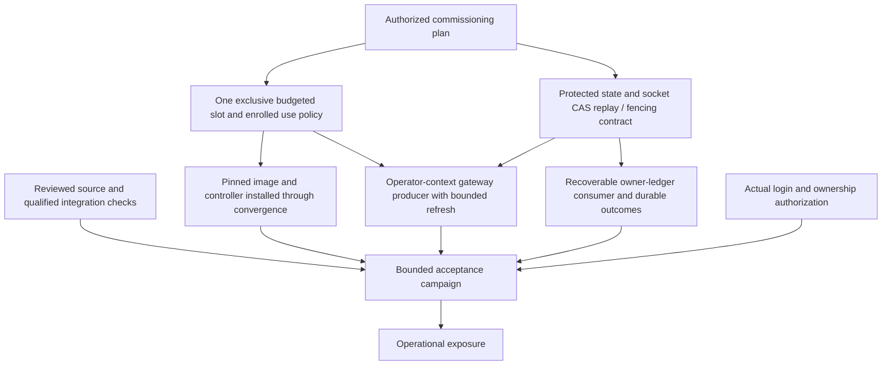
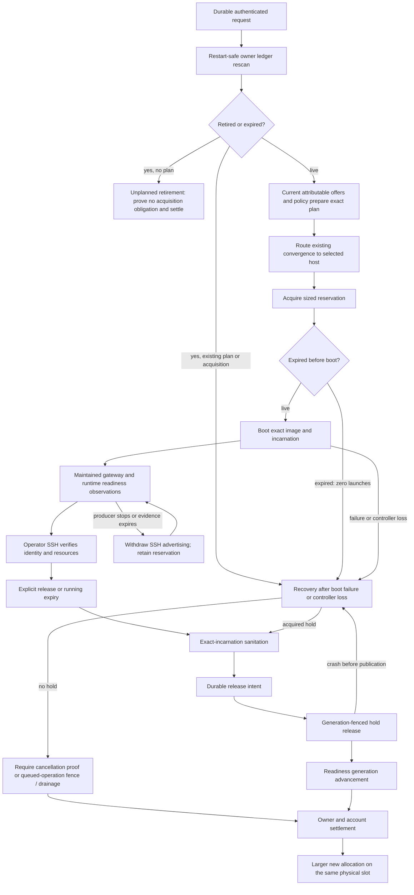

# First operational workspace allocation

Baseline: allocation PR #12465, `ada7daefc28696ce4ba242437cd26daf61bd0bab`.
This is a dependency and acceptance map, not a deployment receipt. Existing source
and focused tests do not establish any of the live milestones below.

## Commissioning dependencies

Reviewed, qualified code plus an authorized commissioning plan permits the bounded
acceptance run. Successful acceptance permits operational exposure. This does not
require a successful VM boot before installing the code needed for acceptance.

## Execution, retirement and reuse

The consumer reconciles retirement before requesting offers, including when no
eligible capacity exists. Every refusal, waiting state and recovery obligation
must remain owner-visible. A free hold read is not proof that an elected actor's
queued operation cannot later commit. Recovery of an existing release must not
release a later occupant or duplicate the account transition.

Gateway evidence currently expires after 60 seconds; page readiness after 30.
Wire `workspace_refresh_gateway_wet` in the actual operator access context and
maintain observations across boot and runtime. Never copy private keys into the
controller or turn a generic timeout into proof of forwarding permission.

Implementation can proceed before live prerequisites. No host is hardcoded in a
request; one commissioned candidate suffices for this operator-only first cut.

## Source audit: first missing join

`workspace_route_create` records intent. The existing
`observe_workspace_allocation_plan_request_wet` reads a request selected by
`GUNBC_WORKSPACE_REQUEST_ID` through `workspace_convergence_observe`: that requires
an already prepared allocation. It does not discover or prepare recorded requests.

`workspace_prepare_convergence_from_observations` can produce that prepared basis,
but its caller must provide `WorkspacePreparationEvidence` and
`WorkspacePreparationPolicy`. The consumer must join durable intent to these
authoritative observations, then enter the existing fleet plan/apply path. Adding
another HTTP effect or a second controller would not close this boundary correctly.

For the initial single authorized owner, discovery can read that owner's durable
ledger; it need not introduce a global owner index. Unreadable state must refuse,
not look empty. Preparation retries must reuse the recorded plan; retirement and
expiry must be reconciled before new preparation. An in-flight acquisition with
uncertain socket completion must retain its obligation.

## Evidence required at each join

| Join | Required evidence |
| --- | --- |
| Protected state | Authenticated write/read across process restart; unauthorized access refused; restricted socket integration; queued-operation fencing/drainage and replay evidence |
| Policy and slot | Actual approved provenance, account/use policy, exclusive full envelope, withdrawn competing purpose, initial sanitation; no floor fixtures |
| Cold gateway | Host access and forwarding eligibility without requiring a guest listener before boot |
| Durable request consumer | Recorded request discovered after restart; unreadable state refuses; retired/expired intent never launches; repeated convergence does not duplicate acquisition |
| Plan and apply | Owner revision, request, host, slot, generation, grant and artifact remain bound; stale plan refuses |
| Ready | Actual SSH to expected incarnation, guest identity and resource readback; stale observation withdraws readiness |
| Termination | Explicit release, prelaunch expiry and running expiry; observed cleanup before fenced release; uncertain cleanup holds quota |
| Reuse | Smaller allocation released, larger allocation boots on the same physical slot with changed grant and new incarnation; prior disposable contents absent; stale predecessor identity refused; POST retry returns original allocation |

The first live receipt must include guest RAM, attempt/controller limits and peaks,
swap policy, request-to-ready time and release-to-clean time. Keep the existing
memory ceilings. Diagnose the integrated validation memory failure separately;
it is not evidence for raising a production envelope.

Broad task-history migration, additional secret-consumer conversions, and GitHub
runner completion are separate cutovers, not prerequisites for this first VM.

## Review 5333734576 gates

Source gates remain separate from live acceptance: restore the principal-mint
negative specimen and require a successful file read; test competing transaction
consumers; require the exact served above-cap refusal; obtain integrated checks.
The initial source repair adds the missing principal specimen and makes a missing
file fail the witness rather than enter the compiler census as empty content.

Acceptance must separately exercise lost POST response and consumer restart,
maintained readiness followed by producer loss, all three expiry windows, and
crashes around acquisition commit and release publication. No manual preparation
helper substitutes for the website-to-consumer route.

## Current implementation checkpoint

`workspace_request_consumer` discovers the outstanding owner request, commits
expiry and settles unplanned retirement through the existing protected-state CAS.
Planned requests retain the obligation and route to the existing selected-host
convergence check. The plan CLI calls this consumer; it no longer requires a
request ID carried from the HTTP process. Waiting preparation is published in
the owner's existing reason field without changing readiness freshness.

This remains partial: current supply/policy production, remote selected-host
transport orchestration, scheduled consumption and maintained gateway refresh
remain unconnected. No host was installed or deployed. Do not describe the CLI
connection as an autonomous website-to-VM acceptance pass.

The first implementation used a binary that rejected this baseline's syntax.
The compatible binary and successful focused results below supersede that source
blocker diagnosis. The draft publication still inherits Rust formatting drift in
`src/v1/stage0/src/cli_run.rs`; the hook's documented `--no-verify` override is for
review publication only, not qualification or landing.

## Consumer continuation

The owner reconciliation pass now commits expiry, then settles an unplanned
retirement through the existing store authority. A request with a plan is routed
for host recovery; the coordinator never reads a local hold to discharge it.
Conflicting CAS returns retry rather than looping. The fleet plan CLI now discovers
the outstanding operator request from protected state instead of requiring
`GUNBC_WORKSPACE_REQUEST_ID`. It records a preparation-wait reason in the owner
ledger when commissioned evidence/policy are not connected, preserving the actual
readiness timestamp and connection. That write loses to planning or retirement.
It still requires the installed controller release for a prepared host plan.

Lease assessment/expiry moved intact from the host lifecycle to
`workspace_allocation_lease`; controller and consumer share that authority. The
consumer test closure falls from 741 modules to 641. The smaller closure exposed
an implicit service dependency in `workspace_acquisition_invocation`; it now
explicitly imports `extdeps.systemd.systemctl`.

The initial four dispatch controls passed with the repository binary SHA256
`e6d8571156538304137139853153e1d30f77f99ba71d8c76ccd3a943b8875e5b`,
which handles this baseline's machine-constraint syntax. A copy is pinned locally
at `target/validation-bin/gunbc`. This supersedes the earlier parse diagnosis as a
source blocker: that refusal was binary/source compatibility, not proof that the
source was malformed. All six consumer controls now pass, including temporary protected-store expiry
settlement after reader reconstruction and refusal of a late waiting update after
retirement. These local-file controls do not qualify the served socket route. The
restored principal negative specimen directly produces the expected mint-caller
admission refusal. The complete principal census suite has not been rerun.

Socket dependency checked: PR #12482 was open at
`5a136eff541f0f764f4a0f03e7b3af58df2d005f`. Its documented contract supplies
kernel-attested peer admission and routes the placed host through the socket.
Its description does not establish queued acquisition fencing/drainage. It also
reports the served roster empty. Do not equate this source with a commissioned
allocation writer or a completed acquisition recovery contract. No sibling
socket changes were cherry-picked or deployed by this continuation.

The 1116-module CLI closure reached successful typechecking of
`gunbc.fleet_converge_plan_cli`, then exited 137 before the deliberate missing-entry
refusal used to avoid executing effects. systemd retained `Result=oom-kill` with
`MemoryMax=6442450944`, so this run has explicit OOM attribution. This is not a
completed CLI or integrated-floor pass. No memory ceilings changed. Receipts are
in `receipts/allocation-consumer-2026-09-28/`.

The focused suite ran against a byte-identical 641-module closure using the pinned
binary, `systemd-run --user --scope -p MemoryMax=6G -p MemorySwapMax=0`, and
`--entry .../test.claim.workspace_request_consumer_witness_test.dag --claim-run`.
All six controls passed (exit 0). The later consumer comment edit changes no code.
The broader CLI snapshot preceded the explicit systemctl import; its completed
CLI typecheck includes the new discovery/waiting adapter but is not a final-source
full qualification. The runtime invocation of host convergence is not exercised.

## Gateway and HOLD-control continuation

Gateway refresh now persists local observation failures (for example unavailable
trust/selector material) as explicit slot-bound, timestamped refusals. Previously
those failures returned to the caller while the prior positive remained in storage.
Evidence and refusal records share one CAS head and ordering check. A refusal can
withdraw an equal-time positive; delayed or equal-time positives cannot revive it.
A later successful refresh recovers normally. Existing evidence documents remain
readable. Repeated refreshes also clean up their temporary public-key selectors.
No private key is copied and no observer service has been installed.

Fleet gateway naming moved into a lightweight shared authority consumed by both
access and gateway admission; its values did not change. The gateway control also
exposed an incompatible structural `string_replace` call in the SSH diagnostic
classifier. It now uses the existing scalar `replace` operation for the same CR
normalization. The real-store control passed: positive, same-time explicit refusal,
delayed positive refusal, later recovery, and withdrawal after the existing 60-second
freshness limit. This is fixture SSH evidence, not external SSH acceptance or an
installed recurring producer.

The additional HOLD controls now have executed receipts:

- Two separate DAG interpreter processes each read the same live login transaction,
  rendezvoused at a barrier, then invoked production consumption. Exactly one won.
  This is actual competing consumption, not sequential replay; no Google exchange
  or session mint was attempted.
- The authenticated served-storage control passed empty/append/reread and reread
  across server restart. Its above-cap check now requires exactly HTTP 400 with
  the protocol's `closure bound out of range` response. With the server stopped,
  the same check failed, proving transport failure cannot satisfy it.

Reproduction helpers are `tools/tests/allocation_login_race.py` and
`tools/tests/allocation_served_storage.py`. Build their byte-identical closures with
`tools/tests/dag_validation_closure.py`, using entries
`test.manual.login_consumer_race`, `test.manual.fabric_state_hold_server`, and
`test.manual.roadmap_served_storage_hold_wet`. All subprocesses retain 6 GiB/no swap.
Gateway entry: `test.claim.workspace_gateway_refresh_witness_test`. Receipts are
under `receipts/allocation-gateway-2026-09-28/`.

A fresh read-only srv1 census still finds the proposed slot failed and the allocation
and readiness store directories absent. This is not commissioning or proof of free
capacity. The existing designation remains empty. Production evidence/policy,
queued-operation fencing, remote orchestration, recurrent consumption/refresh,
and VM acceptance remain outstanding.

The updated gateway observer's 733-module closure completed loading/typechecking
under the same cap and reached the deliberate `validation_no_effect_entry` missing
function refusal. This establishes source qualification of the cleanup and refusal
publication wiring, not execution of SSH, a periodic refresh service, or VM access.

## Bounded consumer entry and acquisition separation

The owner-ledger reader no longer imports reservation acquisition effects. The
reservation record/codec moved to `workspace_reservation_record`; acquisition
operations moved unchanged to `workspace_allocation_acquisition`. Stored JSON is
unchanged, and caller restrictions follow their moved declarations. New plans
still originate from the same preparation authority.

The unchanged six consumer controls pass with a 298-module closure (previously
641), measured peak 1,900,998,656 bytes (1.77 GiB), zero swap, and no cgroup OOM or
limit events. All three acquisition storage controls also pass, including keeping
quota held when an actor was elected and queued effects remain unresolved.

`workspace_request_consumer_cli.workspace_reconcile_once` is a narrow one-pass
entry into that same consumer. It obtains the installed protected-state binding,
uses the authorized operator identity, reconciles expiry/retirement, and records a
preparation wait when authoritative supply is absent. It writes a create-only
receipt under `target/workspace-consumer-<receipt_name>.json`; callers must supply a
fresh safe path segment. Pending preparation or host convergence is explicitly
reported as pending, never as a launched VM. A failed receipt write does not undo
or obscure the durable intent; the next invocation rediscovers it.

Its 573-module closure completed loading/typechecking under 6 GiB/no swap and
reached the deliberately absent `validation_no_effect_entry`. That is source
qualification only: this entry has not been run against production protected
state, scheduled, or connected to a commissioned remote host. The broad host
apply CLI's earlier OOM remains unresolved by this narrower consumer result.
Receipts: `receipts/allocation-consumer-split-2026-09-28/`.

Protected socket dependency rechecked at `e22248e9229e611b64cc13ae66a0182660e9f448`
(PR #12482): still open, not merged. Its current description continues to report
an empty served roster and deployment/readback as remaining work. This does not
establish the queued-acquisition fencing/drainage contract or commissioning of
allocation protected state. No sibling source was imported on that basis.

The four launch-directive controls also pass after the record move: exact
head/host/slot/artifact binding, stale head/foreign owner refusal, foreign
host/slot/root/artifact refusal, and release-intent settlement identity. These
are source/fixture controls; no guest was launched.

## Initial full preview serve integration checks (6 GiB witness allowance)

The review correctly identified integrated serve breakage missed by focused tests.
Source revision `31930c0` supplies the missing `attempt_stale` fields in both sandbox
row constructors, and missing `headers` fields in three served-observation
responses plus the static-route response. No auth-flow semantics were changed.

A clean `cargo build --release --bin gunbc -j 1` on this branch succeeded under
6 GiB/no swap. Its binary then ran the actual
`roadmap_serve_handle_srv2_preview` entry with `dag` and `src/v2`, loopback and port
zero. It resolved 1031 sources, but systemd recorded `oom-kill` before readiness.
A second diagnostic used a byte-identical copy of all 1031 full serve-closure
modules (not a focused test closure). It progressed through page, component,
belt and emitter typechecking, but also OOM-killed before readiness at the same
limit. Thus the constructor repairs do not establish a passing integrated gate.

Reproduction: build the branch binary, then run
`tools/tests/roadmap_preview_readiness.py --output target/preview-check` in the
declared serving-budget/no-swap scope. The helper waits for this child's exact listening announcement
and stops its own child without sending application requests. Optional source-root
and entry arguments support the full-closure diagnostic. An OOM may kill the
supervisor too; retain systemd's scope result as done in these receipts.

Receipts and binary identity: `receipts/allocation-serve-2026-09-28/`.
No preview units were restarted and the live site was untouched. HOLD remains;
the actual readiness gate must pass before preview qualification. The operator
subsequently clarified that 6 GiB is the witness allowance, not the serving
budget. These OOM receipts therefore do not establish failure under the existing
serving budget. Memory reduction remains separate work. No deployment memory
ceiling was increased.

## Full preview startup qualified under the existing serving budget

At source `ac31a971b609df3fee5e56ca07e0fa808c458946`, the branch-local release
binary started `roadmap_serve_handle_srv2_preview` from normal `dag` + `src/v2`
roots and reached its own loopback listening announcement. All 850 sources were
resolved. Elapsed startup was 307.36 seconds; scope peak was 12,023,717,888 bytes
(11.20 GiB), with no swap and no high/max/OOM events. The helper then stopped its
own process; no application requests or production mutations were performed.

The test scope used the existing `live_deploy_slice_memory_max` (53 GiB) and
`live_deploy_slice_memory_high` (49 GiB). Those are the shared deployment envelope,
not a newly authored per-process entitlement. This isolated startup does not prove
concurrent member fit or route latency. No deployment limit was changed. The
operator explicitly separated serving qualification from the 6 GiB witness cap.

Integrated repairs include the sandbox row and response fields, missing sandbox
band arguments, explicit event-history projection input, and typed serve request
construction. The approval transport adapter preserves existing tailnet transport
evidence without treating a Google session as a broker identity. Its two focused
controls pass under 6 GiB/no swap. Login transaction semantics were not changed.

The branch also incorporates already-merged dependency splits #12449, #12480,
#12481 and #12483, plus a shared belt-cadence leaf. These remove deployment emitter,
compiler translator and generated registry dependencies from the serving closure;
the full closure fell from 1031 to 850 modules. The branch-local binary was rebuilt
after the Rust-containing dependency change. Its hash and exact command are in
`receipts/allocation-serve-budget-2026-09-28/receipt.json`; build, startup and adapter
witness logs are alongside it.

The reported preview compilation/startup blocker is cleared for this source.
This is not integrated-floor qualification, deployment, protected-storage
commissioning, or VM acceptance. Capacity transfer, authoritative preparation,
remote convergence, maintained observations and recovery/expiry/reuse acceptance
remain required. The overall allocation HOLD remains.
