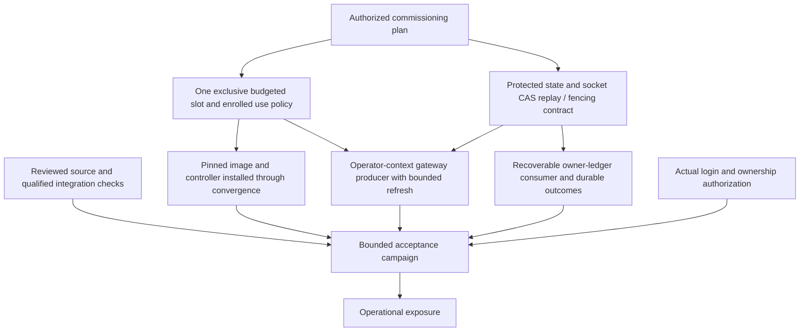
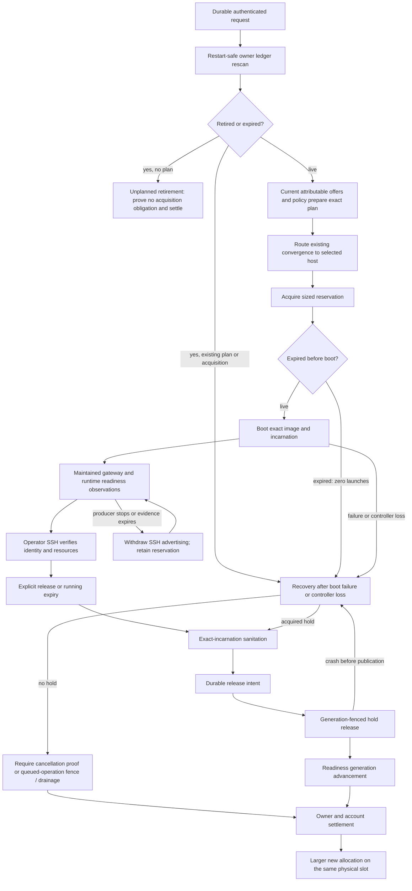

# First operational workspace allocation

Baseline: allocation PR #12465, `ada7daefc28696ce4ba242437cd26daf61bd0bab`.
This is a dependency and acceptance map, not a deployment receipt. Existing source
and focused tests do not establish any of the live milestones below.

## Commissioning dependencies

Reviewed, qualified code plus an authorized commissioning plan permits the bounded
acceptance run. Successful acceptance permits operational exposure. This does not
require a successful VM boot before installing the code needed for acceptance.

## Execution, retirement and reuse

The consumer reconciles retirement before requesting offers, including when no
eligible capacity exists. Every refusal, waiting state and recovery obligation
must remain owner-visible. A free hold read is not proof that an elected actor's
queued operation cannot later commit. Recovery of an existing release must not
release a later occupant or duplicate the account transition.

Gateway evidence currently expires after 60 seconds; page readiness after 30.
Wire `workspace_refresh_gateway_wet` in the actual operator access context and
maintain observations across boot and runtime. Never copy private keys into the
controller or turn a generic timeout into proof of forwarding permission.

Implementation can proceed before live prerequisites. No host is hardcoded in a
request; one commissioned candidate suffices for this operator-only first cut.

## Source audit: first missing join

`workspace_route_create` records intent. The existing
`observe_workspace_allocation_plan_request_wet` reads a request selected by
`GUNBC_WORKSPACE_REQUEST_ID` through `workspace_convergence_observe`: that requires
an already prepared allocation. It does not discover or prepare recorded requests.

`workspace_prepare_convergence_from_observations` can produce that prepared basis,
but its caller must provide `WorkspacePreparationEvidence` and
`WorkspacePreparationPolicy`. The consumer must join durable intent to these
authoritative observations, then enter the existing fleet plan/apply path. Adding
another HTTP effect or a second controller would not close this boundary correctly.

For the initial single authorized owner, discovery can read that owner's durable
ledger; it need not introduce a global owner index. Unreadable state must refuse,
not look empty. Preparation retries must reuse the recorded plan; retirement and
expiry must be reconciled before new preparation. An in-flight acquisition with
uncertain socket completion must retain its obligation.

## Evidence required at each join

| Join | Required evidence |
| --- | --- |
| Protected state | Authenticated write/read across process restart; unauthorized access refused; restricted socket integration; queued-operation fencing/drainage and replay evidence |
| Policy and slot | Actual approved provenance, account/use policy, exclusive full envelope, withdrawn competing purpose, initial sanitation; no floor fixtures |
| Cold gateway | Host access and forwarding eligibility without requiring a guest listener before boot |
| Durable request consumer | Recorded request discovered after restart; unreadable state refuses; retired/expired intent never launches; repeated convergence does not duplicate acquisition |
| Plan and apply | Owner revision, request, host, slot, generation, grant and artifact remain bound; stale plan refuses |
| Ready | Actual SSH to expected incarnation, guest identity and resource readback; stale observation withdraws readiness |
| Termination | Explicit release, prelaunch expiry and running expiry; observed cleanup before fenced release; uncertain cleanup holds quota |
| Reuse | Smaller allocation released, larger allocation boots on the same physical slot with changed grant and new incarnation; prior disposable contents absent; stale predecessor identity refused; POST retry returns original allocation |

The first live receipt must include guest RAM, attempt/controller limits and peaks,
swap policy, request-to-ready time and release-to-clean time. Keep the existing
memory ceilings. Diagnose the integrated validation memory failure separately;
it is not evidence for raising a production envelope.

Broad task-history migration, additional secret-consumer conversions, and GitHub
runner completion are separate cutovers, not prerequisites for this first VM.

## Review 5333734576 gates

Source gates remain separate from live acceptance: restore the principal-mint
negative specimen and require a successful file read; test competing transaction
consumers; require the exact served above-cap refusal; obtain integrated checks.
The initial source repair adds the missing principal specimen and makes a missing
file fail the witness rather than enter the compiler census as empty content.

Acceptance must separately exercise lost POST response and consumer restart,
maintained readiness followed by producer loss, all three expiry windows, and
crashes around acquisition commit and release publication. No manual preparation
helper substitutes for the website-to-consumer route.

## Current implementation checkpoint

`workspace_request_consumer` discovers the outstanding owner request, commits
expiry and settles unplanned retirement through the existing protected-state CAS.
Planned requests retain the obligation and route to the existing selected-host
convergence check. The plan CLI calls this consumer; it no longer requires a
request ID carried from the HTTP process. Waiting preparation is published in
the owner's existing reason field without changing readiness freshness.

This remains partial: current supply/policy production, remote selected-host
transport orchestration, scheduled consumption and maintained gateway refresh
remain unconnected. No host was installed or deployed. Do not describe the CLI
connection as an autonomous website-to-VM acceptance pass.

The first implementation used a binary that rejected this baseline's syntax.
The compatible binary and successful focused results below supersede that source
blocker diagnosis. The draft publication still inherits Rust formatting drift in
`src/v1/stage0/src/cli_run.rs`; the hook's documented `--no-verify` override is for
review publication only, not qualification or landing.

## Consumer continuation

The owner reconciliation pass now commits expiry, then settles an unplanned
retirement through the existing store authority. A request with a plan is routed
for host recovery; the coordinator never reads a local hold to discharge it.
Conflicting CAS returns retry rather than looping. The fleet plan CLI now discovers
the outstanding operator request from protected state instead of requiring
`GUNBC_WORKSPACE_REQUEST_ID`. It records a preparation-wait reason in the owner
ledger when commissioned evidence/policy are not connected, preserving the actual
readiness timestamp and connection. That write loses to planning or retirement.
It still requires the installed controller release for a prepared host plan.

Lease assessment/expiry moved intact from the host lifecycle to
`workspace_allocation_lease`; controller and consumer share that authority. The
consumer test closure falls from 741 modules to 641. The smaller closure exposed
an implicit service dependency in `workspace_acquisition_invocation`; it now
explicitly imports `extdeps.systemd.systemctl`.

The initial four dispatch controls passed with the repository binary SHA256
`e6d8571156538304137139853153e1d30f77f99ba71d8c76ccd3a943b8875e5b`,
which handles this baseline's machine-constraint syntax. A copy is pinned locally
at `target/validation-bin/gunbc`. This supersedes the earlier parse diagnosis as a
source blocker: that refusal was binary/source compatibility, not proof that the
source was malformed. All six consumer controls now pass, including temporary protected-store expiry
settlement after reader reconstruction and refusal of a late waiting update after
retirement. These local-file controls do not qualify the served socket route. The
restored principal negative specimen directly produces the expected mint-caller
admission refusal. The complete principal census suite has not been rerun.

Socket dependency checked: PR #12482 was open at
`5a136eff541f0f764f4a0f03e7b3af58df2d005f`. Its documented contract supplies
kernel-attested peer admission and routes the placed host through the socket.
Its description does not establish queued acquisition fencing/drainage. It also
reports the served roster empty. Do not equate this source with a commissioned
allocation writer or a completed acquisition recovery contract. No sibling
socket changes were cherry-picked or deployed by this continuation.

The 1116-module CLI closure reached successful typechecking of
`gunbc.fleet_converge_plan_cli`, then exited 137 before the deliberate missing-entry
refusal used to avoid executing effects. systemd retained `Result=oom-kill` with
`MemoryMax=6442450944`, so this run has explicit OOM attribution. This is not a
completed CLI or integrated-floor pass. No memory ceilings changed. Receipts are
in `receipts/allocation-consumer-2026-09-28/`.

The focused suite ran against a byte-identical 641-module closure using the pinned
binary, `systemd-run --user --scope -p MemoryMax=6G -p MemorySwapMax=0`, and
`--entry .../test.claim.workspace_request_consumer_witness_test.dag --claim-run`.
All six controls passed (exit 0). The later consumer comment edit changes no code.
The broader CLI snapshot preceded the explicit systemctl import; its completed
CLI typecheck includes the new discovery/waiting adapter but is not a final-source
full qualification. The runtime invocation of host convergence is not exercised.
