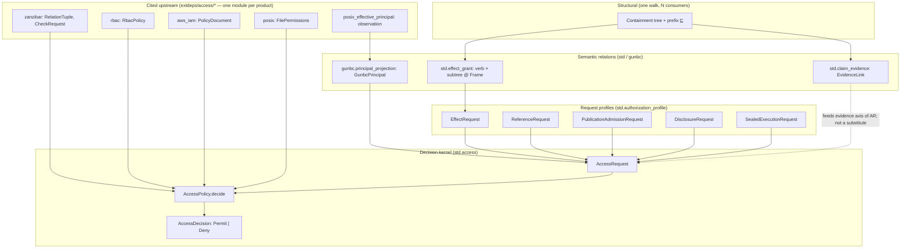

# Authority relation topology — AUTH-0 design note

Status: **DRAFT for operator review (AUTH-0, session cool-ram-632, 2026-08-04).** No code lands from this doc; it is the topology authority the AUTH-1+ lanes cite. Supersedes no landed carrier — it names what already exists and forbids the forks the tree keeps re-inventing. Companions: [effect-namespace-grants](effect-namespace-grants.md) (reach axis), [node-subtree visibility grants](node-subtree-visibility-grants.md) (retired carrier experiment — capabilities remain open), [dag-scm-design](dag-scm-design.md) (claim-indexed evidence, P−1), DESIGN open thread “one authorization kernel, several typed request profiles.”

## 0. Displaced cost (§6 — the pain this removes)

Authorization work in this repository keeps paying the same topology tax:

- **State-space conflation** — one bit or enum carrying WHO, WHAT, WHERE, and WHETHER (`Hermetic | Wet`, `AudienceScopeTree`, hand-rolled `workspace_root` gates, `AuthScope` as reach-in-disguise). Each fork is later dissolved at interest.
- **Parallel allow/deny folds** — a second admitted/refused sum beside `std.access.AccessDecision`, or a profile-local decision type that never projects through the kernel.
- **Nicknamed authorities** — a second RBAC/IAM/Zanzibar vocabulary in `std/` instead of projecting cited `extdeps/access/*` rows through `AccessPolicy`.
- **Evidence mistaken for permission** — a recorded fact, a successful probe, or a POSIX uid treated as authorization without an explicit `AccessRequest` and policy seam.
- **Reach mistaken for identity** — `ResourceHandle`, cache `VisibilityScope`, and deploy `Ownership` each partially overlap the reach axis; only one may own subtree admission.

AUTH-0 is the single DFS-before-minting map so AUTH-1+ work can ask “which relation layer?” instead of re-deriving the stack per PR.

## 1. What “authority relation” means here

An **authority relation** is a typed edge whose meaning is grounded by a **cited external or structural authority**, not by a minted internal nickname. It answers one of four **orthogonal questions**; conflating two questions is the recurring §3 failure mode.

| question | relation kind | decides | typical refusal shape |
|---|---|---|---|
| **WHO is acting?** | principal projection | which external evidence names the actor | observation refused / evidence absent |
| **WHAT may this actor touch?** | reach grant | whether `target ⊑ granted_root` for a verb | `EffectOutsideGrant`, `AccessActionNotGranted` |
| **WHAT supports a claim?** | evidence link | whether fact *F* may support/challenge claim *C* under rule *R* | `EvidenceInsufficient`, `ClaimReadinessRefused` |
| **MAY this request proceed?** | access decision | single Permit/Deny over a normalized request | `AccessRefusal` at structured coordinates |

**Not authority relations** (adjacent, must not absorb them):

- **Containment / naming** (`QualifiedName`, `SymbolIndex`, `DeclarationExposure`) — structural position; feeds reach and evidence scope but is not itself permission.
- **Ownership for teardown** (`gunbc.ownership.Ownership = Owned | Ensured`) — fleet reconcile responsibility, not subtree read/write admission.
- **Cache visibility** (`std.cache_interface.VisibilityScope`) — cache-entry sharing audience, not code-name or filesystem reach.
- **Measure / budget** — how much, not whether.

## 2. The topology (one diagram, five layers)

Relations are **not** a flat list. They stack: structural position at the bottom, cited upstream models at the edge, three semantic relations in the middle, one decision kernel at the top.

**Read order (serial, like DESIGN):**

1. **⊑ (containment prefix)** — Filesystem paths, URIs, `/proc`, service-op trees, and (when landed) code-name positions share one prefix-descent relation. Namespace resolution, content-addressing, termination, and effect reach are consumers of the **same** walk; effects are the fourth consumer ([namespace-resolution-design](namespace-resolution-design.md), [effect-namespace-grants](effect-namespace-grants.md)). Interim realization: path-string prefix in `std.effect_grant.position_under`; dissolve-on = `SymbolIndex`-backed position.

2. **Cited access models (`extdeps/access/*`)** — Each upstream product keeps its own module per DESIGN external upstream decomposition: Zanzibar/ReBAC tuples, NIST RBAC assignments, AWS IAM policy grammar, POSIX mode bits, effective-principal observation. These modules own **interface shape + cited vocabulary**; they do not own the Permit/Deny sum.

3. **`std.claim_evidence`** — A recorded fact becomes evidence only through `EvidenceLink` (direction, inference rule, authority, provenance, freshness, fidelity, probe independence, maximum conclusion). Claim assessment is Belnap four-valued (support / challenge / both / neither). This is **epistemic**, not **deontic** — `CredentialRecorded` ≠ `ProviderReady` ≠ `MayExecute`.

4. **`gunbc.principal_projection`** — Principals are projections of external evidence (`OidcIdTokenClaims`, `EffectivePosixPrincipalObservation`), never invented identities. `principal_projection_note` already names the convergence target: future policy vocabulary projects `PolicyDocument`, `RbacPolicy`, and `CheckRequest` rather than minting substitutes.

5. **`std.authorization_profile`** — Typed request products only; each profile has a total projection `*_access_request` into `AccessRequest`. No profile declares its own admitted/refused sum or allow/deny fold. Audiences are sets (`AudienceSet`), not a frozen scope chain.

6. **`std.access`** — The **sole** decision kernel: `AccessPolicy.decide`, `decision_meet` for conjunction, `AccessRefusal` with typed cause and structured location. Every authorization surface routes here.

**Cross-cutting reach:** `std.effect_grant` models verb × subtree grants attached to `std.materialization_ladder.Frame`, checks `position_under`, and delegates through `EffectRequest` → `effect_grant_policy`. WHO may execute remains principal-side; WHAT may be touched is grant-side.

## 3. DFS convergence map (§2/§3 — cite, don't mint)

| concept | single authority | relationship to kernel |
|---|---|---|
| Permit / Deny | `std.access.AccessDecision` | **the** outcome; no parallel sums |
| Request shape | `std.access.AccessRequest` + profiles | profiles project; they do not decide |
| Effect reach | `std.effect_grant.Grant` / `Envelope` | constructs `EffectRequest`; `admit_effect` → kernel |
| Evidence for claims | `std.claim_evidence.EvidenceLink` | supplies `AccessEvidence` content; never substitutes for `decide` |
| Principal | `gunbc.principal_projection.GunbcPrincipal` | populates `AccessRequest.subject` from cited evidence |
| Zanzibar check | `extdeps.access.zanzibar.CheckRequest` | upstream shape; realization handler evaluates → `AccessPolicy` |
| RBAC permission | `extdeps.access.rbac.RbacPolicy` | upstream shape; `rbac_decide` in witnesses is the pattern |
| IAM statement | `extdeps.access.aws_iam.PolicyDocument` | upstream shape; ABAC context decomposes to typed dimensions (witness: `access_iam_validation_test`) |
| POSIX mode | `extdeps.access.posix.FilePermissions` | upstream shape; `posix_decide` pattern |
| Namespace subtree admission | `std.effect_grant` + profiles (`ReferenceRequest`, `PublicationAdmissionRequest`) | publication ontology still open (DESIGN); shapes are placeholders |
| SCM admission | `gunbc.source_integration_*` + `std.claim_evidence` | authorization failures are typed refusals in landing spine, not a second kernel |

**Witness pattern (extdeps-first, derive policy, validate):** `dag/test/claim/access_validation_test.dag` and siblings implement **toy** `AccessPolicy` folds over cited carriers to prove the projection pattern — they are not production policy authorities.

## 4. Anti-fork verdict (load-bearing)

| forbidden move | why | review tell |
|---|---|---|
| Mint `std.zanzibar_policy` | §3 nicknaming — cite `extdeps.access.zanzibar` | new `std/` module mirroring tuple grammar |
| Add `Verb::Publish` to `std.effect_grant` | publication is a profile axis, not `EffectShape` | verb enum grows without `verb_of_effect_shape` grounding |
| `EvidenceLink` implies Permit | evidence ≠ permission (dashboard/Codex incident, SCM P−1) | skip `AccessPolicy.decide` because a probe succeeded |
| Second `⊑` walk for auth | one containment tree, N consumers | path-prefix helper not delegating to `position_under` / future `SymbolIndex` |
| `AudienceScopeTree` or frozen scope chain | audiences are sets with join/subset | tree-shaped audience enum returns |
| Profile-local `Admitted \| Refused` | absorbs the kernel | match on profile-specific outcome instead of `AccessDecision` |
| Union-level `==` on principals | cross-family comparison | bare string uid compared to OIDC subject without projection |

## 5. Landed vs partial vs open (honest census)

**Landed and enrolled**

- `std.access` kernel + `std.authorization_profile` profiles and projections
- `std.effect_grant` P-A model + `admit_effect` → kernel; P-C slices per effect-namespace-grants ledger
- `std.claim_evidence` shared carrier + three discriminating consumers (provider readiness, os install, source integration)
- `extdeps/access/{zanzibar,rbac,aws_iam,posix,posix_effective_principal}` cited shapes
- `gunbc.principal_projection` for OIDC + POSIX effective principal
- Witness suite: `access_validation_test`, `access_iam_validation_test`, `access_authorization_profile_witness_test`, `principal_projection_witness_test`, `claim_indexed_evidence_witness_test`

**Partial / interim**

- Reach positions are path-string prefix, not yet `SymbolIndex`-grounded
- `ReferenceRequest` / `PublicationAdmissionRequest` — shapes without replacement publication ontology (operator ruling 2026-08-01)
- Policy realization: witness toy policies exist; no default production `AccessPolicy` composes extdeps rows for fleet/dashboard/SCM
- Zanzibar: `CheckRequest` modeled; no userset rewrite evaluator or tuple store in tree
- `AuthScope` convergence undecided (effect-namespace-grants Q3)

**Open capabilities (not blocked on AUTH-0)**

- Publication replacement ontology (DESIGN: operator review required)
- Reference-edge admission consumer (deferred — no concrete consumer)
- ReBAC tuple store as subgraph of node graph (early #5415 direction; not on main as `v2.std.access`)

## 6. Phases after AUTH-0

| phase | trigger | delivers | does not deliver |
|---|---|---|---|
| **AUTH-0** | this review | topology doc + anti-fork table | code |
| **AUTH-1** | operator signs §4 + §7 Q1 | `gunbc.access_policy_composition` design: how extdeps policies fold into one `AccessPolicy` without nicknaming | Zanzibar evaluator |
| **AUTH-2** | `SymbolIndex` lands namespace positions | re-home `NamespacePosition` on containment walk; retire path-string interim | publication ontology |
| **AUTH-3** | concrete publication consumer selected | profile + policy rows for `PublicationAdmissionRequest` | SCM kernel changes |
| **AUTH-4** | reference-edge consumer exists | `ReferenceRequest` enforcement at compile or dispatch seam | reach/grant changes |

Each phase: model-first PR, discriminating RED, dissolve-on for scaffolds. AUTH-1 is blocked on operator answers in §7, not on AUTH-0 text landing.

## 7. Open questions (operator)

1. **Policy composition home** — Should fleet/dashboard/SCM each own an `AccessPolicy` fragment merged via `decision_meet`, or one `gunbc.global_access_policy` composing extdeps rows? (Affects AUTH-1 module layout, not the kernel.)
2. **`AuthScope` fate** — Converge onto reach grants where it encodes subtree visibility, or keep identity-side? (effect-namespace-grants Q3; blocks AUTH-1 row set.)
3. **Zanzibar realization** — Tuple store as explicit graph rows vs derived from containment-tree edges (#5415 thesis). Needs a named consumer before AUTH-1 commits.
4. **Evidence → request wiring** — Standard pattern for `AccessEvidence` populated from `EvidenceLink` (typed projection per profile vs generic bundle). SCM and provider-readiness lanes need one ruling to avoid three forks.
5. **Publication ontology** — Still explicitly unresolved (DESIGN 2026-08-01). AUTH-3 cannot start until selected; AUTH-0 does not propose one.

## 8. Dissolution

This document dissolves when the topology is self-describing in the carriers: a generated `authority_relation_topology` projection from module notes + registered `AccessPolicy` rows replaces the prose map, and every forbidden move in §4 has a living construction wall or lens. Until then, AUTH-1+ lanes cite this file as the topology authority.
