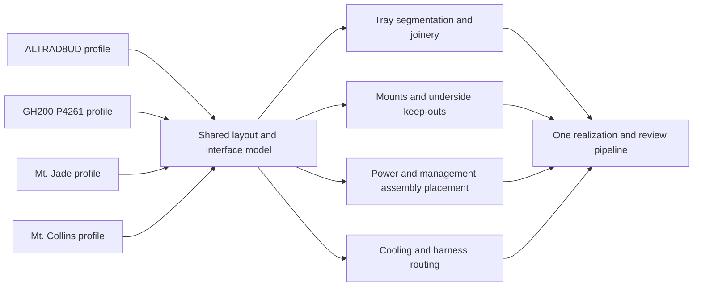

# One cassette design, multiple platform profiles

Operator direction, 4 October 2026: consolidate the design on main; support the NVIDIA P4261 GH200 baseboard and Mt. Collins/Mt. Jade transplants without forking cassette geometry. “Baseboard” here means a mechanical support cassette, not a replacement electrical PCB.

## Shared architecture

`cassette_profile` owns the shared input shapes; `cassette_profiles` supplies configuration rows. `cassette_layout` owns board-to-tray dimension derivation and refuses missing outlines. The existing `cassette` consumes that same derivation, preserving its printed Altra dimensions. `stack_mass_review` emits all profile standings. Board-specific upstream facts remain with their existing vendor/specification owners.

The common design does not require identical outer dimensions. A profile selects footprint, mounting coordinates, retained assemblies, cooler envelope, cable corridors and power architecture. Cross-profile stacking requires compatible support interfaces and load paths; width changes cannot be hidden by simply extending unsupported tray material.

## Profiles and evidence

| Profile | Established input | Still needed |
| --- | --- | --- |
| ASRock ALTRAD8UD | Existing board dimensions, printed tray/joinery and fan-pattern observations | Existing standoff/underside/load/thermal obligations |
| NVIDIA P4261 / 694-24261-000-100 K1 | Exact operator-requested identity; matching marketplace listing located | Manufacturer drawing/revision, board outline, hole map, underside keep-outs, functional module/carrier/management BOM, power connector and sequencing, cooling assembly |
| Mt. Jade | Public OCP rev 1.0 board outline 428 × 479.36 mm, reused from extdeps | Mounting map and retained assembly placement; revision-specific power/management/harness details |
| Mt. Collins | Existing product briefs and getting-started guide references, dual-socket platform facts | Exact board/chassis revision, motherboard drawing and hole map, original power/management assembly placement |

Sources: [Mt. Jade OCP specification](https://www.opencompute.org/documents/open-compute-specification-mt-jade-rev-1-0-pdf-1), existing `extdeps.ampere.mt_collins_getting_started_guide.subject`, and [Ampere reference-design document catalog](https://amperecomputing.com/home/customer-reference-boards). The [P4261 marketplace listing](https://www.ebay.com/itm/157373033242) identifies the requested item but is not authority for pinouts, hole coordinates, or complete-system compatibility. No MGX system enclosure dimensions or Jetson carrier drawings are substituted for this board. Some Ampere design packages require Customer Connect access; publicly modeled sources are reused first.

A board-only rectangular 180 mm grid needs 3 × 3 cells for Jade. That is an envelope calculation, not a print plan: margin, joint overlap, supports, retained hardware and structural members must be included before choosing actual pieces. With the current shared 14 mm edge allowance, the board-only tray reservation is 456 × 507.36 mm. It is not a released tray or final whole-system footprint.

## Preserve the functional platform assembly

For the new transplant profiles, prefer retaining the platform's original power distribution and PSU cage with the node, rather than requiring the separate generic power cassette. This is design intent, not proof that a loose baseboard includes every required part. Model and place:

- Compute board/module and original socket backplates/load-bearing mounts.
- Matched PSU, PDB/backplane, enable/sense/standby harness and protective-earth path.
- BMC/management or other sequencing hardware, front-panel connections and required interlocks.
- Original cooling hardware, fan power/control and airflow ducts; liquid plumbing if the selected assembly needs it.
- Risers, NIC/storage connections, retention and cable insertion/removal swept volumes.

The printed cassette replaces chassis support around those assemblies; it does not automatically replace their electrical interfaces, bonding or cooling. The Altra three-by-80-mm fan arrangement is not inherited as adequate cooling for GH200 or a dual-socket board. The mass fold must include all retained items at their positions, and the larger span changes joint loads and creep requirements.

## Shared-generator implementation sequence

1. **Completed:** a common profile/layout authority, existing Altra dimension consumer, explicit missing-outline refusals and review output for all four configurations.
2. Generalize the current fixed four-panel topology into a bed-constrained tile/edge graph. Generate each joint once from adjacent cells; make rails, handles, corner interfaces and rear attachments consumers of that graph. Preserve existing Altra geometry as the regression case.
3. Replace board-specific support placement with a profile-supplied mounting/keep-out map. Unknown holes refuse support generation; never scale one board's pattern to another.
4. Place retained power/management/cooling assemblies through shared mount interfaces and derive cable routes and service volumes. Each profile supplies actual parts; it does not author another generator.
5. Run common assembly/collision/bed-fit witnesses, mass/force and thermal screens; realize through the existing CadQuery path. New platform fabrication waits on its unresolved inputs. No motherboard removal or new print is requested by this planning change.

The geometry is not fully generalized yet: the current realization remains the four-panel Altra assembly. The new profiles are executable design inputs and tracked obligations, not fabricated GH200/Collins/Jade models.

## Consolidation

PR #13295 becomes the main-targeted cassette design PR and includes #13222's joinery ancestry. #13283's extra-frame design is superseded by the integrated-column direction and is not merged back. The print-day preparation/physical receipts are retained in this consolidated branch. Slicing (#13223) and printer authorization (#13149 and its approval-client dependency) remain separate operational changes, preserving the earlier review's requested separation from mechanical design.
