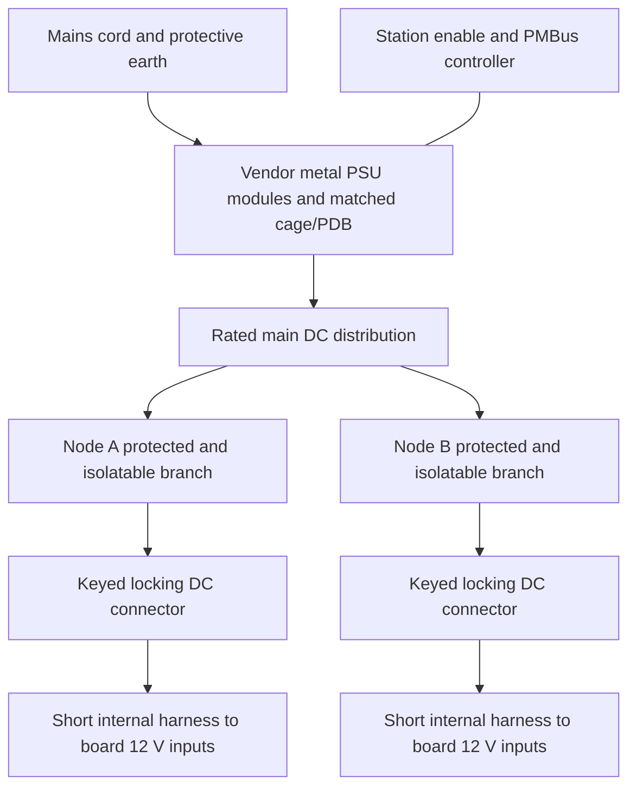

# Interchangeable server-PSU power cassette

Investigation and design intent, 4 October 2026; PR #13295. This is a reference architecture, not a selected electrical assembly or released mount CAD.

## Power availability preference

The operator selects a single PSU as the default; redundancy is optional only if the incremental cost is worthwhile. FSP remains a reference, not a required supplier. Do not require a two-module redundant set for the first cassette. A redundant-capable PDB must have documented single-module operation, enable behavior and unused-slot airflow handling before being used with one module.

FSP separately catalogs PDBs including FSP-PH51A and FSP-FC210CE. The [PH51A product page](https://www.fsp-group.com/en/product/crps/1745379392-1427.html) advertises cable customization, and its [datasheet](https://www.fsp-group.com/download/pro/FSP-PH51A_Datasheet.pdf) states that the wire harness can be customized. This establishes a vendor offering, not an off-the-shelf multi-node harness SKU or included cable set. Exact module compatibility, small-quantity availability, harness part numbers, price and single-module behavior remain procurement obligations. The protected per-node distribution remains our system requirement.

## Boundaries

The cassette should accommodate different power assemblies through **replaceable inserts**, rather than assuming every server PSU has the same connector. Keep the column attachment and node-facing DC interface consistent. Each insert owns its PSU/cage envelope, attachment, insertion/removal clearance, ventilation, cord retention and strain relief. Each electrical adapter owns the exact mating PDB/backplane, enable/sense/standby behavior, output harness and management interface. A change of PSU family requires review of both adapters.

The initial node service interface is one accessible, shrouded, keyed locking DC connector, with local isolation and status, and two Ethernet connections. Select its current/temperature rating, wire/crimp system and mating life from an actual family. Do not equate a similar connector shell with EPS/PCIe electrical compatibility. Shut down and isolate a node before disconnecting it. A PSU module being hot-swappable does not qualify the board connection for live mating.

Blind mating can follow: it needs guides/floating alignment, contact sequencing, inrush/precharge/discharge behavior and an interlock. Do not make a printed latch perform electrical sequencing implicitly. Keep connector access outside the corner-column joints and the temporary support/extraction swept volume. Use replaceable clips and captive inserts, minimizing small assembly screws.

Keep the vendor metal PSU enclosure/cage and its earthing intact. Printed parts locate and retain that assembly; they do not replace its mains enclosure. The preferred station position remains the bottom of the column, outside node extraction. Its actual mass and position must enter the component fold once a BOM is chosen.

## Candidate references, not an interchangeability list

| Reference | Established | Unresolved |
| --- | --- | --- |
| Existing Mt. Collins PSU | Repo product brief: two redundant units, Platinum, up to 2000 W, PMBus 1.2 | Actual installed model, main-rail ratings, pinout and matching cage/PDB |
| Chicony S15-550P1A / S550E004L listing | Seller identifies 550 W | Primary mating-interface documentation and compatible PDB; do not substitute another Chicony model's pinout |
| FSP800-50FS complete redundant assembly | Main 12 V, 65 A = 780 W at listed 100–240 Vac | Exact purchased variant/drawing, output harness and per-node protection |
| FSP1200-50FS complete redundant assembly | Main 12 V: 80.5 A = 966 W at 100–127 Vac; 97 A = 1164 W at 180–264 Vac | Same integration obligations; no inferred rating in the undocumented input gap |

Primary sources: [FSP800-50FS datasheet](https://www.fsp-group.com/download/pro/FSP800-50FS_Datasheet.pdf), [FSP1200-50FS datasheet](https://www.fsp-group.com/download/pro/FSP1200-50FS_Datasheet.pdf), [FSP catalog](https://www.fsp-group.com/download/catalog/IPCPSU.pdf). The current catalog gives a 265 × 76 × 84 mm assembly envelope, larger than the older sheets' 250 × 76 × 83.8 mm. Reserve the larger body for planning; reconcile the exact drawing before creating mount geometry. Body fit alone excludes cord bends, airflow and withdrawal clearance.

[Chicony's CRPS family table](https://www.chiconypower.com/en/item/view?item_id=580) illustrates why labels alone are insufficient: its R550AV02P lists 42.6 A on main 12 V (511.2 W), with standby separate. This is **not** evidence for the seller's S550E004L. PMBus specifies management, not a universal mechanical/power pinout. Prefer a complete vendor-matched assembly, or an explicitly documented module/backplane pair.

## Capacity screen

The executable report in `stack_mass_review` includes the following examples. The 300/400 W loads are declared node scenarios, not measured fleet loads; the 20 W overhead and 20% reserve are planning inputs, not an electrical-code rule.

| Two nodes | Required including overhead/reserve | Reference main rail | Result |
| --- | --- | --- | --- |
| 300 W each | 744 W | 800-class assembly: 780 W | Capacity screen passes only |
| 400 W each | 984 W | 800-class assembly: 780 W | Insufficient |
| 400 W each | 984 W | 1200-class, 115 Vac: 966 W | Insufficient with this reserve |
| 400 W each | 984 W | 1200-class, 230 Vac: 1164 W | Capacity screen passes only |

Even granting all 550 W to the main rail, two 300 W nodes exceed it before losses. Lower capped nodes may fit, but 550 W is not the unrestricted two-node default. Two 550 W modules in 1+1 redundancy still provide at most one module's relevant rating after a failure. The model removes the largest module and caps the remainder by the distribution-path rating; arithmetic never grants permission to parallel unmatched supplies.

## Electrical adapter obligations

Select exact module/PDB part numbers and pinout; main/standby rails and minimum loads; enable/sense behavior; sharing and ORing; PMBus addresses and one management owner; coordinated per-node fault isolation; branch connector and wire ratings; inrush/discharge; earthing/strain relief; cooling and insertion envelope; and board input population. These remain typed open obligations even when a capacity example passes.

Use a station controller for shared supply enable. Do not wire multiple hosts' PS_ON outputs together. The ASRock DC-IN route and its front-edge 8-pin inputs remain the board interface modeled by `node_power_feed`; do not connect an unverified PSU standby rail to its signal header. A matched PDB does not by itself establish independent branch protection: a fault on one node must be evaluated against upstream shutdown behavior.

## Next implementation

1. Select a documented complete 800–1200 W-class reference assembly against node load scenarios, AC input and required redundancy; obtain its exact mechanical drawing and output harness specification.
2. Implement the common cassette attachment and removable mechanical insert, keeping the chosen vendor cage intact. Reserve routing and service clearances, not just a rectangular PSU body.
3. Select and model the protected branch assembly and common node connector; bind each supported PSU adapter to its compatibility evidence and limits.
4. Fold the selected assembly, harness and printed insert masses/positions into stack statics; evaluate local thermal exposure before selecting printed material.
5. Generate/review adapter CAD and an unpowered assembly prototype. Current r06 tray printing remains a separate unpowered cassette fit exercise.
