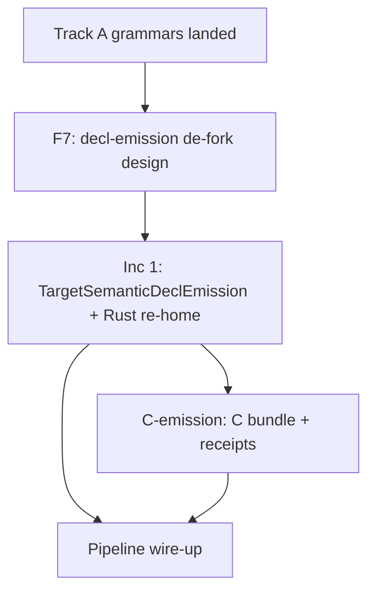

# Decl-emission de-fork: `emit_semantic_decl` rust-hardwired → target dispatch

> **Status: DESIGN-ONLY, sign-ready draft.** No implementation in this lane.
> Work item: Phase B / F7 (`node://adhoc-33307559-f07`, session witty-crane-236).
> Parent arc: **C emission** (eager-ferret-110) — this de-fork unblocks adding C (and other)
> semantic-decl surfaces without editing the compiler module.
> DESIGN refs: §2 (one concept, N realizations — Realization pattern), §3 (interface shape in
> compiler, transport/grammar in extdeps; dispatch is realization, lives peripheral), §4
> (`emit = serialize_target ∘ translate`, N rows not N×M), §5 (refusals are the worklist;
> fail-closed on unwired targets), §6 (scaffold with named dissolution trigger), §7 (seed-retained
> frontier row must name the blocker honestly).

---

## 0. One-sentence claim

> Semantic type declarations (`Disj` → sum, `Conj` → record) are already routed by **substrate
> connective**; the only fork is that `v2.compiler.emit_semantic_decl` **imports Rust surface
> builders and grammars directly** instead of reading them from the active `TargetModel` bundle —
> so adding C (or any second target) would require a compiler edit. The fix is a
> **`TargetSemanticDeclEmission` bundle edge** (same seam as
> `target_model_edge_value_expression_projection`) plus a target-agnostic
> `emit_semantic_type_decl(name, params, node, target)` entry; Rust re-homes its existing
> `rust_*_decl_surface_*` / `rust_*_general_decl_*` rows onto the bundle, and C lands as **rows
> only**.

---

## 1. Displaced cost (§6)

| Cost today | Mechanism |
|---|---|
| **N×M compiler fork** | Each new target (C, DAG round-trip, TypeScript decl headers) would copy `emit_semantic_decl.dag` or grow `*_rust` arms — the §3 nicknaming trap the value-expression lane already paid down for bodies. |
| **Blocked parent lane** | C emission cannot register enum/struct decl grammars until the compiler stops hard-importing `v2.extdeps.languages.rust`. |
| **Frontier dishonesty** | `self_host/frontier.dag` lists `emit_semantic_decl.dag` as `EmitSurfaceGap` / seed-retained with trigger `migrate_when_rust_decl_emit_track_a_completes` — but Track A decl **grammars are landed** (`decl_emit_consolidated_test.dag`, rung 7 in [s2-v2-self-emit-direction.md](s2-v2-self-emit-direction.md)); the remaining gap is the **compiler↔target seam**, not missing Rust rows. |
| **Pipeline wiring deferred** | `emit_semantic_type_decl_*` is exercised only by `semantic_decl_routing*_test.dag` today; whole-module emit still routes type decls through the v1 seed. De-forking now is cheap (two receipts, no production consumer migration) and prevents cementing the Rust import into the first pipeline wire-up. |

---

## 2. The fork (§3) — what lives where today

### 2.1 Honest authority split (already correct)

| Fact | Correct home | Live today? |
|---|---|---|
| **Which core shape is a decl** (`Disj` coproduct, `Conj` record) | Substrate / `program_partition` | ✓ `emit_semantic_decl.dag:83-88` |
| **Enum/struct surface AST** (derive attr, variant block, field list) | `extdeps/languages/rust.dag` | ✓ `rust_enum_decl_surface_from_coproduct`, `rust_struct_decl_surface_from_record`, generic variants |
| **Grammar rows + structural target model** | `extdeps/languages/rust.dag` | ✓ `rust_*_general_decl_productions_only_translation_rules`, `rust_*_general_decl_structural_target_model` |
| **Serialize** (`grammar_relation_row_for_emitted` → tokens → source) | `v2.compiler.translate` (target-agnostic) | ✓ `emit_decl_surface_rust` — misnamed but already parameterized by `rules` + `target` |

### 2.2 The violation (three coupled forks)

1. **Compiler imports Rust extdeps** — `emit_semantic_decl.dag` `import v2.extdeps.languages.rust { … }` (lines 8–17). Layer inversion: compiler → extdeps is correct direction, but the import is **Rust-specific**; a second target cannot plug in without editing this file.

2. **API names encode the realization** — `emit_semantic_type_decl_rust`, `emit_semantic_enum_decl_rust`, … Callers (receipts, future pipeline) must know the target at the **name** layer instead of passing `TargetModel`.

3. **Serialize helper named for Rust** — `emit_decl_surface_rust(surface, rules, target)` is target-agnostic in body but Rust-named; invites a second `emit_decl_surface_c` copy.

### 2.3 Sibling fork (explicitly out of scope here)

`emit_produced.dag` repeats the same pattern (`emit_produced_decl_rust`, direct `rust_signature_with_open_from_decl` import). **This design covers only semantic type decls** (`type`/`data` shapes routed by connective). Produced fn decls are a **parallel de-fork** tracked separately; do not widen F7 to absorb it — different surface pipeline (`target_serialize_bodied_arrow_from_model`).

---

## 3. Scope

### 3.1 In scope (F7)

- Design + scope for `v2.compiler.emit_semantic_decl` de-fork.
- New `TargetSemanticDeclEmission` carrier + `target_model_edge_semantic_decl_emission` bundle edge contract in `target_model.dag` (design only).
- Rust re-homing plan: existing `rust_*_decl_surface_*` + `rust_*_general_decl_*` become the first bundle population — **zero new Rust grammar**.
- Migration increments, receipt discipline, frontier row update, dissolution trigger.
- Explicit **unwired-target refusal** contract (C bundle absent ⇒ typed `Rejected`, never silent skip).

### 3.2 Out of scope (named neighbors)

| Neighbor | Why out |
|---|---|
| `emit_produced.dag` fn-decl fork | Different serialize path; separate work item. |
| Track A remainder (aliases, `data =`, module framing A4–A7) | Extends grammars **after** the dispatch seam exists; grammars are not blocked on F7, but F7 is blocked on **not** hardwiring Rust while those land. |
| Wiring `emit_semantic_type_decl` into `06_translate` / whole-module emit | Downstream consumer migration; F7 only requires the API be target-parameterized so that wire-up does not import Rust. |
| C enum/struct grammar authoring | Parent C-emission lane; depends on F7 design sign-off, implements C rows against the bundle. |
| `emit_produced` + partition pipeline end-to-end | Wave 2 self-host; needs both de-forks + orchestration. |

### 3.3 Load-bearing files (escalate before edit under a stale brief)

- `src/v2/std/compilers/target_model.dag` — new edge + carrier.
- `src/v2/compiler/emit_semantic_decl.dag` — de-fork implementation.
- `src/v2/extdeps/languages/rust.dag` — bundle registration (re-home only).
- `src/v2/compiler/self_host/frontier.dag` — frontier row trigger text.

---

## 4. Target design

### 4.1 API (compiler — single entry)

Replace the `*_rust` surface with:

```dag
fn emit_semantic_type_decl(
  name: Symbol,
  params: List<Symbol>,
  node: Node,
  target: TargetModel
) -> Outcome<Medium<String>>
```

- **Routing** (substrate, stays in compiler): `params` empty vs generic mirrors today (`Empty` → monomorphic path); `node.kind` `Disj` → enum arm, `Conj` → struct arm; all else → existing `emit_semantic_decl_unsupported_diagnostic` (unchanged refusal set).
- **Dispatch** (new): `semantic_decl_emission_bundle_from_target(target)` — fail-closed if edge missing or malformed.
- **Serialize** (rename only): `emit_decl_surface(surface, rules, target)` — same body as today's `emit_decl_surface_rust`.

Deprecated aliases: keep `emit_semantic_type_decl_rust` as a one-line wrapper `emit_semantic_type_decl(..., target: rust_*_general_decl_structural_target_model())` **only until receipts migrate**, then delete (same discipline as B0 retiring hardcoded signature fixtures).

### 4.2 Carrier: `TargetSemanticDeclEmission` (std — interface shape)

New record in `target_model.dag`, decoded from bundle edge `^target_model_edge_semantic_decl_emission`:

| Field | Type | Role |
|---|---|---|
| `enum_translation_rules` | `Node` | `grammar_relation_row_for_emitted` rules root for enum decl productions |
| `struct_translation_rules` | `Node` | rules root for struct decl productions |
| `enum_structural_target` | `TargetModel` | structural target for enum serialize (today `rust_enum_general_decl_structural_target_model()`) |
| `struct_structural_target` | `TargetModel` | structural target for struct serialize |

Surface construction **does not** move into the carrier as opaque nodes — it stays as **named functions in each language module**, invoked through a **total dispatch helper** in `target_model.dag`:

```dag
fn target_semantic_enum_surface(
  emission: TargetSemanticDeclEmission,
  target: TargetModel,
  name: Symbol,
  params: List<Symbol>,
  coproduct: Node
) -> Outcome<Node>
```

Implementation pattern (mirror `target_value_expression_projection_from_target`):

1. Decode bundle → `TargetSemanticDeclEmission`.
2. Branch on `target.medium` / language id (closed enum — `Rust | C | Dag | …`, fail-closed `_ =>` refusal).
3. Tail-call the language's existing surface builder (`rust_enum_decl_surface_from_coproduct_generic`, future `c_enum_decl_surface_from_coproduct`, …).

**Why not store surface builders in the bundle?** Functions are not bundle facts; the value-expression lane stores **projection data** in the bundle and keeps token synthesis in extdeps. Same split here: bundle holds **grammar authority** (rules + structural target); extdeps holds **surface builders**.

⚠ **FLAG (operator):** medium dispatch key — use existing `TargetModel.medium` carrier vs a new `target_language_id` symbol. Prefer whatever `emit_host` and `target_source_medium` already use so C and Rust do not get a third naming axis.

### 4.3 Rust bundle registration (extdeps — first handler)

Add to `rust_target_model_bundle_core()`:

```dag
Named {
  name: ^target_model_edge_semantic_decl_emission,
  target: rust_semantic_decl_emission_bundle_node()
}
```

`rust_semantic_decl_emission_bundle_node()` packs the four fields from existing authorities (no new productions):

- `enum_translation_rules` ← `rust_enum_general_decl_productions_only_translation_rules()`
- `struct_translation_rules` ← `rust_struct_general_decl_productions_only_translation_rules()`
- `enum_structural_target` ← `rust_enum_general_decl_structural_target_model()`
- `struct_structural_target` ← `rust_struct_general_decl_structural_target_model()`

### 4.4 C handler (parent lane — rows only)

Parent C-emission session adds `v2.extdeps.languages.c` (or extends `cpp.dag` only if C is intentionally unified — ⚠ **FLAG: C vs C++ decl syntax**; do not assume). Required artifacts per handler:

1. `c_*_general_decl_*` grammar rows (enum + struct/tag variants as C requires).
2. `c_enum_decl_surface_from_coproduct[_generic]`, `c_struct_decl_surface_from_record[_generic]`.
3. `c_semantic_decl_emission_bundle_node()` + bundle edge on `c_target_model()`.
4. One arm in `target_semantic_enum_surface` / `target_semantic_struct_surface` dispatch.
5. Receipt: `src/v2/test/claim/emit/c_semantic_decl_routing_test.dag` (golden + RED + refusal), mirroring `semantic_decl_routing_test.dag`.

F7 **does not** author C rows — it only makes the compiler seam target-agnostic.

---

## 5. Migration increments

### Inc 1 — seam + Rust re-home [gating, this lane's implementation follow-on]

1. Land `TargetSemanticDeclEmission` + decode + `target_model_edge_semantic_decl_emission`.
2. Refactor `emit_semantic_decl.dag`: drop direct `v2.extdeps.languages.rust` import; call `emit_semantic_type_decl(..., target)`.
3. Register Rust bundle; implement dispatch with **only Rust arm** (others → `Rejected` `^semantic_decl_target_unwired`).
4. Rename `emit_decl_surface_rust` → `emit_decl_surface`.
5. Migrate `semantic_decl_routing_test.dag` + `semantic_decl_routing_generic_test.dag` to `emit_semantic_type_decl` + explicit `rust_enum_general_decl_structural_target_model()` or a shared `rust_target_model()` — receipts stay green.
6. Update `compiler_frontier_row_emit_semantic_decl` migration trigger to `^migrate_when_semantic_decl_pipeline_wired` (honest next blocker).

**Receipt bar:** existing tests green-by-execution + new RED: same nodes with a target missing the bundle edge ⇒ `Rejected` (not empty string).

### Inc 2 — C bundle [parent C-emission lane, blocked on Inc 1 sign-off]

Land C grammars + dispatch arm + `c_semantic_decl_routing_test.dag`. Compiler unchanged.

### Inc 3 — pipeline wire-up [Wave 2 / self-host, blocked on body + partition consumers]

`program_partition` / `06_translate` call `emit_semantic_type_decl` when emitting user semantic types (today v1 seed). Out of F7 scope but named so Inc 1 is not mistaken for "done."

---

## 6. Receipt discipline (§5)

| Tier | Witness | Status |
|---|---|---|
| Routing + enum/struct golden | `semantic_decl_routing_test.dag` | live |
| Generic params | `semantic_decl_routing_generic_test.dag` | live |
| Grammar consolidation | `decl_emit_consolidated_test.dag` | live (exercises rust rows directly — stays; not replaced) |
| **New:** unwired target refusal | `semantic_decl_target_refusal_test.dag` (to author at Inc 1) | design |
| **New:** C golden | `c_semantic_decl_routing_test.dag` (parent lane) | design |

Normalized round-trip for decls remains blocked on §5 reparse lookahead ([s2-v2-self-emit-direction.md](s2-v2-self-emit-direction.md) §5) — golden receipts stay legitimate per construct.

---

## 7. Sequencing & dependencies



- **Hard dependency:** Inc 1 before any C grammar work (parent lane).
- **Soft dependency:** `target_model.dag` edge namespace stable before `emit_host` target coverage census extended ([emit_host_gate/target_coverage_completeness_test.dag](src/v2/test/claim/emit_host_gate/target_coverage_completeness_test.dag) will need the new edge in the required set when C target exists).
- **No dependency** on body-lowering general producer or §5 reparse fix.

---

## 8. Frontier row update (honest blocker)

Current:

```293:298:src/v2/compiler/self_host/frontier.dag
data compiler_frontier_row_emit_semantic_decl: CompilerModuleFrontierRow = knowledge_attributed_blocker_class_seed_retained_row(
  module_path: "src/v2/compiler/emit_semantic_decl.dag",
  closure_reads: 59,
  measured_blocker: EmitSurfaceGap,
  migration_trigger: ^migrate_when_rust_decl_emit_track_a_completes
)
```

After Inc 1 lands, update to:

- `measured_blocker`: `EmitSurfaceGap` (unchanged until self-emitted)
- `migration_trigger`: `^migrate_when_semantic_decl_emission_defork_lands` → then `^migrate_when_semantic_decl_pipeline_wired` after Inc 1

Track A completion is **already true** for enum/struct grammars; the trigger text is stale and should not block Inc 1 sign-off.

---

## 9. Open flags (escalate, do not guess)

| ID | Question | Default if unsigned |
|---|---|---|
| F1 | C vs C++ — separate `languages/c.dag` or tag-union under cpp? | Separate `c.dag` (C emission parent owns) |
| F2 | Dispatch key on `TargetModel` — which field? | Match `emit_host` medium id |
| F3 | Keep temporary `emit_semantic_type_decl_rust` wrapper for one PR? | Yes, delete in same PR as receipt migration |
| F4 | Enroll `semantic_decl_*` tests in CI discovery roster? | Coordinate with [s2-v2-self-emit-direction.md](s2-v2-self-emit-direction.md) §8 — optional parallel |

---

## 10. Definition of done (this design lane)

- [ ] Operator sign-off on §4 carrier shape + §5 increments.
- [ ] Parent C-emission session acknowledges C rows land against `target_model_edge_semantic_decl_emission` (no compiler edit).
- [ ] Frontier trigger wording correction agreed (§8).

Delete this doc when Inc 1 is merged, C receipt is green (if C is in scope for the arc), unwired-target RED is proven by execution, and `emit_semantic_decl.dag` has **zero** `import v2.extdeps.languages.rust`.
