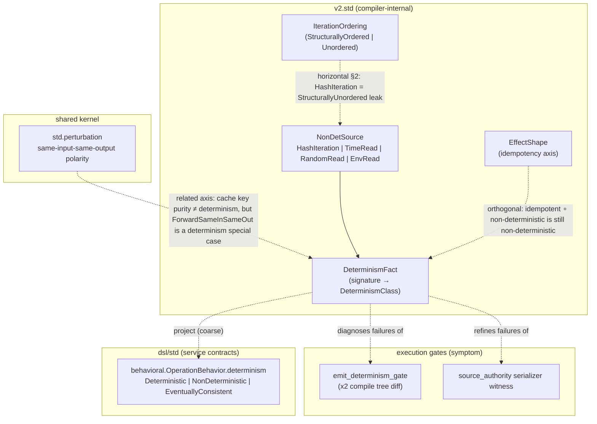

# Determinism mechanism — design proposal (§5)

> **Status: DESIGN-ONLY — awaiting operator shape-sign.** No `std/` or `lens/` authoring until signed.
> Lane: `v2.std.determinism` inert-carrier activation (keen-bat-281).
> DESIGN refs: §2 (horizontal — one perturbation/determinism kernel, many readings; deep — ground `NonDetSource` atoms), §3 (single authority vs `behavioral.determinism`, `perturbation`, `emit_determinism_gate`), §5 (construction over validation; decidability trichotomy), §6 (inert carrier → wired consumer; priced in displaced cost), §7 (signature-derived classification dissolves the lens).
>
> Every place I am unsure is tagged **⚠ FLAG**. The brief asks me to flag rather than commit on load-bearing modeling.

---

## 0. The one-sentence claim

> **Determinism is a signature-derived classification axis orthogonal to `EffectShape`**, carried by `DeterminismFact { signature, classification }`, where `NonDeterministic { source: NonDetSource }` names one of four **grounded leak atoms** (`HashIteration | TimeRead | RandomRead | EnvRead`). A pure function's output must be a function of its declared inputs only; any dependence outside that key is a **located, typed `NonDetSource` leak**, not a silent bit-identical drift discovered later by `emit_determinism_gate`.

The carrier already exists (`src/v2/std/determinism.dag`, landed as PR-1 substrate in the v4→v2 rename). It has **zero corpus references** — not even a self-test — so it sits below the inert-carrier census's "self-tested but unconsumed" gate and is pure §6 coverage-by-illusion until this mechanism lands.

---

## 1. The pain (displaced cost — §6)

Three symptoms today, one root:

| Symptom | where it lives | what it costs |
| --- | --- | --- |
| **Emit drift** | `tools.emit_determinism_gate` (x2 `gunbc compile` diff) | Non-reproducible emit forces hand-edits to the v1 Rust seed after each regen — every representation change lands in doomed seed instead of `.dag` authority ([representation-minimization.md](representation-minimization.md) item 1, #5879) |
| **Serializer law without source taxonomy** | `v2.compiler.source_authority.deterministic_dag_source_serializer_witness` | Proves byte equality of two serializations but cannot **name** *why* they differ (`^source_authority_serializer_nondeterministic` is opaque — no `NonDetSource`) |
| **Iteration-order leak unnamed** | `v2.std.refinement` `StructurallyUnordered` / `refine_ordered_iteration` | Rejects unordered iteration at a refinement boundary with `^naming_the_leak` but does not connect to the compiler-wide determinism axis |

The mechanism's job is not to replace `emit_determinism_gate` (corpus-level backstop) but to make **every non-deterministic dependence locatable before execution** — the same construction-first move §5 applied to idempotency (`EffectShape`) and cache purity (`std.perturbation`).

---

## 2. Authority map (do not fork — §3)

Four nearby concepts that must stay distinct and project, not duplicate:



### 2.1 `v2.std.determinism` — **the compiler authority** (this design)

- **Granularity:** per `Symbol` signature (function / primitive / pipeline step).
- **Taxonomy:** closed `NonDetSource` coproduct (four atoms, no stringly "maybe non-det").
- **Home:** `src/v2/std/determinism.dag` (v2 compiler std layer).

### 2.2 `dsl/std/behavioral.determinism` — **extdeps service-contract authority**

- **Granularity:** per capability / REST operation (`OperationBehavior`).
- **Taxonomy:** `EventuallyConsistent` (distributed) has **no image** in `NonDetSource` — it is honestly out of scope for the compiler determinism wall.
- **Relationship:** a **projection homomorphism**, not a merge:
  - `behavioral.Deterministic` ← requires `DeterminismClass = Deterministic` at every transport realization the contract binds.
  - `behavioral.NonDeterministic` ← requires `∃ NonDetSource` (source may be unknown at contract-authoring time → `DescentUnknown` analogue **⚠ FLAG** — see §8).
- **Do not** add `EventuallyConsistent` to `NonDetSource` — that would be nicknaming a distributed-systems fact into a compiler leak atom.

### 2.3 `std.perturbation` — **input-key purity kernel** (already live)

- `ForwardSameInSameOut`: perturb outside declared inputs → output must not respond.
- This is determinism **specialized to cache-key / declared-input boundaries** — the cache-purity reading.
- **Horizontal reuse (§2):** `v2.std.determinism` should not re-encode "output responded to off-key perturbation." Instead:
  - cache purity continues to consume `std.perturbation` directly;
  - determinism classification names **which off-key axis** leaked when purity fires (bridge diagnostic: `NonDetSource` refinement on a `ResponseViolation`).

### 2.4 `emit_determinism_gate` — **corpus backstop, not the mechanism**

- Proves: whole `dsl` emit tree is byte-identical across two sequential runs.
- Does not prove: *which* function introduced drift.
- **Sequencing:** mechanism diagnoses → gate verifies. Gate stays in CI floor permanently as §5 fail-closed backstop (like `CrossRepresentationEquality` kept after numeric tower grounded).

### 2.5 `v2.std.refinement.IterationOrdering` — **ordered-iteration refinement**

- `StructurallyUnordered` → `refine_ordered_iteration` rejects with `^naming_the_leak`.
- **Horizontal §2:** `HashIteration` **is** the iteration-ordering leak atom at the determinism layer. One concept:
  - refinement gate: "you may not *claim* ordered iteration over an unordered carrier without proof."
  - determinism fact: "this signature *depends on* hash iteration order."

---

## 3. Grounding the `NonDetSource` atoms (deep decomposition — §2)

Each arm must point at a shared, time-stable framework (§3), not an internal nickname.

| `NonDetSource` | grounded upstream | compiler-site examples (today / near) | decidable classification? |
| --- | --- | --- | --- |
| `HashIteration` | Rust `HashMap` iteration order is intentionally unspecified ([Rust std docs](https://doc.rust-lang.org/std/collections/struct.HashMap.html)); same for many host `HashMap` uses in v1 emit (`v1_compiler_emit_rust.rs` pervasive `HashMap`) | emit walks keyed by `HashMap` without sorted key order; `fold` over unordered `Map` in `.dag` when key order affects output | **yes** at emit-site pattern level (② until emit uses ordered containers by construction) |
| `TimeRead` | POSIX `clock_gettime` / host clock | `now()` primitives, timestamp literals read from host at compile time, log headers with wall time in emitted output | **yes** for a closed primitive roster |
| `RandomRead` | C `getrandom` / host RNG | test fixtures seeded from OS RNG without fixed seed; `uuid()` in emit | **yes** for a closed primitive roster |
| `EnvRead` | POSIX environment (`environ`) | `std::env::var` in emit, transport scripts reading `$VAR` for output-shaping decisions | **yes** for a closed primitive roster |

**⚠ FLAG:** `HashIteration` vs "any `Map` type" — the v1 emit corpus uses both `HashMap` and ordered structures. The atom name says *hash* iteration specifically; do not broaden to `MapIteration` unless the ordered/unordered distinction is modeled as a refinement parameter (ties to `IterationClassifier`).

---

## 4. The mechanism (construction-first — §5)

### 4.1 Target algebra (mirror `EffectShape` pattern)

`v2.std.effects` already shows the intended shape:

1. **Closed classifiers** on primitives (`effect_shape_for_create_cause`).
2. **Composition rules** (`create_double_init_collapsible` — idempotent ⊗ idempotent).
3. **Witness data** proving the algebra (`witness_create_if_absent_cause_is_idempotent`).
4. **Node projection** for test claims (idempotency_contract pattern).

`v2.std.determinism` should grow the same four layers (after shape-sign):

```dag
// SKETCH ONLY — not authored until operator sign-off

fn determinism_of_primitive(sig: Symbol) -> DeterminismClass { ... }

fn determinism_compose(
  outer: DeterminismClass,
  inner: DeterminismClass
) -> DeterminismClass {
  // deterministic ∘ deterministic = deterministic
  // any NonDeterministic propagates; source = left-biased merge or diagnostic pair
  // ⚠ FLAG: source-merge policy when both sides leak
}

fn determinism_fact_for_signature(sig: Symbol) -> DeterminismFact {
  DeterminismFact {
    signature: sig,
    classification: determinism_of_primitive(sig: sig) // → derived for composites
  }
}
```

**Composition law (proposed):**

- `Deterministic ⊗ Deterministic → Deterministic`
- `NonDeterministic { s } ⊗ _ → NonDeterministic { s }` (leak propagates)
- `_ ⊗ NonDeterministic { s } → NonDeterministic { s }`
- Idempotency does not cure non-determinism: `IsIdempotent(_) ⊗ NonDeterministic { s } → NonDeterministic { s }`

### 4.2 Where facts are computed (pipeline placement)

Mirror the `DescentEvidence` / `InferredFacts` side-car pattern:

| Stage | responsibility |
| --- | --- |
| **Primitive roster** (`v2.std.determinism`) | closed `Symbol → DeterminismClass` for compiler intrinsics, host reads, ordered/unordered container ops |
| **Infer** (`04_infer`) | derive composite `DeterminismFact` for every resolved signature; attach to `InferredFacts` map (parallel to termination descent) |
| **Lens** (interim) | read derived facts; fail-closed when a **determinism-required consumer** (emit, serializer, cache key) calls a `NonDeterministic` signature without an explicit isolation witness |
| **Emit** | consume only `Deterministic` projections for pure paths; ordered-container emission for any map iteration that affects output order |

**⚠ FLAG:** exact `InferredFacts` extension field name / whether determinism lives beside `DescentEvidence` or in its own side-map — defer to #3468 signature-derivation bundle (effect + ownership + determinism share the same "signature-derived closed set" blocking follow-up noted in `v2.lens.effect` and `v2.lens.ownership` construction justifications).

### 4.3 Interim fact bridge (host-fed — Tier 2 pattern)

Until infer derives determinism by construction, follow `layer_import_facts_live` / `concept_decl_facts_live`:

```
determinism_facts_live() -> List<DeterminismFact>
```

- Host scan: v1 emit Rust for `HashMap` iteration patterns affecting output; `.dag` corpus for `shell.Exec` / `env` reads in transports.
- Pure `.dag` lens consumes the list — no new host logic in the lens itself.
- **Dissolution:** delete the host bridge when `04_infer` derives facts from the primitive roster (#5364 / v2 self-host compile-graph trigger).

### 4.4 Lens shape (interim — `WallAfterGrounding`)

Proposed module: `v2.lens.determinism` (NOT authored yet).

```dag
// SKETCH ONLY

fn determinism_required_context(consumer: Symbol) -> Bool { ... }
// emit stages, serializer, canonical hash, CI claim executor scheduling: true

fn determinism_leak_diagnostic(fact: DeterminismFact, at: Locus) -> Diagnostic { ... }

fn determinism_clean(facts: List<DeterminismFact>) -> Bool { ... }
```

**Construction justification (draft):**

- **Class:** `WallAfterGrounding { dissolves_to: SingleAuthority }`
- **Grounding authority:** signature-derived `DeterminismClass` closed set (#3468 bundle)
- **Dissolve on:** non-determinism is uncallable from a determinism-required context unless explicitly isolated (hermetic wrapper / fixed seed / sorted iteration) — the bad state is unwritable, not flagged post-hoc

**Frontier placement:**

| Check | class | why |
| --- | --- | --- |
| Primitive in closed roster is `NonDeterministic` | ① wall (once roster is authoritative) | decidable |
| Composite derivation from signatures | ① wall after #3468 | decidable |
| "This emit site iterates a `HashMap`" in v1 seed | ② lens residue | decidable but host-fed until emit is `.dag`-derived |
| "Is this function deterministic?" for arbitrary user code | ③ ratchet forever | Rice |

---

## 5. Relationship to existing gates and witnesses

### 5.1 `emit_determinism_gate` integration

```
diagnose (determinism lens/facts) → fix located NonDetSource
verify  (emit_determinism_gate x2 diff) → corpus green
```

The gate message today: `"two sequential 'gunbc compile dsl --target rust' runs produced non-identical output trees"`. Enriched diagnostic (future): attach the **first** `DeterminismFact` leak on the emit dependency chain.

### 5.2 `source_authority` serializer law

`deterministic_dag_source_serializer_witness` compares two `Medium<String>` values. Bridge:

- GREEN: both `Deterministic` classification on the serializer signature **and** byte equality.
- RED (equality): existing `^source_authority_serializer_nondeterministic`.
- RED (classification): new diagnostic naming `NonDetSource` **before** byte comparison fails — fail-closed with located source, not opaque mismatch.

### 5.3 `refinement_ordered_iteration` tests

Existing witness: unordered classifier → `^naming_the_leak`. Add horizontal link:

- `refine_ordered_iteration` rejection **implies** `NonDeterministic { HashIteration }` at the dependant signature when the classifier is provably structurally unordered.
- Do not duplicate the check — refinement remains the construction gate for *claiming* order; determinism records the *fact*.

---

## 6. Phasing (operator shape-sign → execution)

| Phase | deliverable | consumer | gate |
| --- | --- | --- | --- |
| **P0** (now) | this design doc | operator shape-sign | — |
| **P1** | extend `v2.std.determinism` with primitive roster + `determinism_compose` + witness data | `*_test.dag` claims (mirror idempotency_contract) | compile-clean |
| **P2** | `determinism_facts_live` host bridge + `v2.lens.determinism` (observing, ranked report) | floor witness (manual) | advisory only |
| **P3** | wire emit/serializer consumers; enrich `emit_determinism_gate` failure diagnostics | `emit_determinism_gate` | fail-closed on new leaks |
| **P4** | infer-derived facts (#3468); delete host bridge | `04_infer` | lens dissolves to construction |
| **P5** | projection to `behavioral.determinism` for extdeps contracts | extdeps authoring | contract drift lens |

**MVP discriminating witness (required by §5):**

- **GREEN:** `determinism_of_primitive(^pure_add) == Deterministic` and `determinism_compose(Deterministic, Deterministic) == Deterministic`.
- **RED:** `determinism_of_primitive(^hash_map_keys_iter) == NonDeterministic { HashIteration }`.
- **RED:** calling a `TimeRead` primitive inside the emit closure from a determinism-required context → located diagnostic (after P3).

---

## 7. What this is NOT (purity-trap guards — §6)

- **Not a second emit diff gate.** `emit_determinism_gate` stays; this explains it.
- **Not a replacement for `std.perturbation`.** Purity is the same-input-same-output reading; determinism names the leak axis.
- **Not a fork of `behavioral.determinism`.** Service contracts project from the compiler authority.
- **Not an excuse to gate "optimality of algorithm".** Whether a *faster* algorithm exists is ③ forever; whether the *implemented* algorithm reads the clock is ①.
- **Not v1-seed cement.** v1 `HashMap` scan in the host bridge is explicitly bank-if-cheap / dies with v1 (representation-minimization discriminator). The v2-surviving root is primitive roster + infer derivation in `.dag`.

---

## 8. Open flags (⚠ — need operator ruling)

1. **Source-merge policy:** when two sub-expressions leak (`TimeRead` + `HashIteration`), is the composite source a coproduct pair, left-biased, or a new `NonDetSource` arm? (Recommend: keep pair in diagnostic; do not grow `NonDetSource` without a new grounded atom.)
2. **`behavioral.EventuallyConsistent` boundary:** confirm it stays out of `NonDetSource` permanently.
3. **`InferredFacts` extension:** bundle with #3468 or own field? (Recommend: bundle — one signature-derived facts block.)
4. **Ordered container construction:** is `BTreeMap`/sorted-key fold the single authority for ordered emission, or a `Refined<Map, StructurallyOrdered>` requirement? (Touches refinement + determinism — one horizontal fix.)
5. **Inert-carrier hygiene:** P1 must add a `*_test.dag` witness referencing `DeterminismFact` so the carrier enters the inert census correctly when still unwired.

---

## 9. Dissolution trigger (DESIGN §6)

Delete or fold this doc when:

1. `v2.std.determinism` carries a closed primitive roster + compose algebra with green witness claims;
2. infer derives `DeterminismClass` from signatures by construction (#3468 landed);
3. `v2.lens.determinism` is deleted (construction subsumed inference);
4. `emit_determinism_gate` failures surface the first located `NonDetSource` on the emit chain;
5. `behavioral.determinism` projects from `DeterminismFact` without a second taxonomy.

Until operator shape-sign on §4–§6, **no `std/` or `lens/` edits** — this document is the sole artifact.
