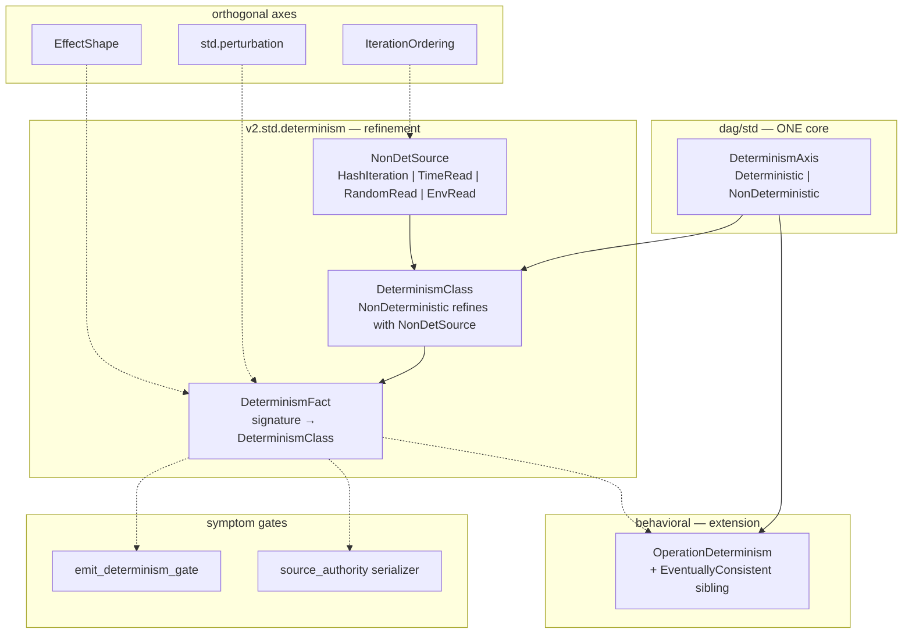

# Determinism mechanism — design proposal (§5)

> **Status: OPERATOR SHAPE-SIGNED — P1 landed in #5941 (sunny-wolf-582).** Supersedes #5937 (keen-bat-281) design-for-sign draft; signed status + FLAG locks authoritative here.
> **FLAG 1 = A** (bundle determinism into #3468 `InferredFacts` block); **FLAG 2 = C** (refinement + emit + determinism horizontal).
> Lane: `v2.std.determinism` inert-carrier activation (keen-bat-281 → sunny-wolf-582 P1).
> DESIGN refs: §2 (horizontal — one perturbation/determinism kernel, many readings; deep — ground `NonDetSource` atoms), §3 (single authority vs `behavioral.determinism`, `perturbation`, `emit_determinism_gate`), §5 (construction over validation; decidability trichotomy), §6 (inert carrier → wired consumer; priced in displaced cost), §7 (signature-derived classification dissolves the lens).
>
> Every unresolved item is either a **decided-with-rationale** entry (§8) or one of **two genuine operator FLAGS**.

---

## 0. The one-sentence claim

> **Determinism is a signature-derived classification axis orthogonal to `EffectShape`**, carried by `DeterminismFact { signature, classification }`, where `NonDeterministic { source: NonDetSource }` names one of four **grounded leak atoms** (`HashIteration | TimeRead | RandomRead | EnvRead`). A pure function's output must be a function of its declared inputs only; any dependence outside that key is a **located, typed `NonDetSource` leak**, not a silent bit-identical drift discovered later by `emit_determinism_gate`.

The carrier already exists (`src/v2/std/determinism.dag`, landed as PR-1 substrate in the v4→v2 rename). It has **zero corpus references** — not even a self-test — so it sits below the inert-carrier census's "self-tested but unconsumed" gate and is pure §6 coverage-by-illusion until this mechanism lands.

---

## 1. The pain (displaced cost — §6)

Three symptoms today, one root:

| Symptom | where it lives | what it costs |
| --- | --- | --- |
| **Emit drift** | `tools.emit_determinism_gate` (x2 `gunbc compile` diff) | Non-reproducible emit forces hand-edits to the v1 Rust seed after each regen — every representation change lands in doomed seed instead of `.dag` authority ([representation-minimization.md](representation-minimization.md) item 1, #5879) |
| **Serializer law without source taxonomy** | `v2.compiler.source_authority.deterministic_dag_source_serializer_witness` | Proves byte equality of two serializations but cannot **name** *why* they differ (`^source_authority_serializer_nondeterministic` is opaque — no `NonDetSource`) |
| **Iteration-order leak unnamed** | `v2.std.refinement` `StructurallyUnordered` / `refine_ordered_iteration` | Rejects unordered iteration at a refinement boundary with `^naming_the_leak` but does not connect to the compiler-wide determinism axis |

The mechanism's job is not to replace `emit_determinism_gate` (corpus-level backstop) but to make **every non-deterministic dependence locatable before execution** — the same construction-first move §5 applied to idempotency (`EffectShape`) and cache purity (`std.perturbation`).

### 1.1 Additive to #5913 (first construction instance — do not re-do in parallel)

**#5913 (crisp-stag, merged 2026-06-28) already grounded the first `HashIteration` class** in `.dag` authority — variant-owner disambiguation and import-map-key ordering — not as a hand-synced v1 seed restore:

| #5913 fix | where | what it eliminated |
| --- | --- | --- |
| `unique_imported_variant_owner` | `src/v2/compiler/04_infer.dag` | variant-owner pick depending on transitive `type_env` iteration order |
| alpha-sorted `variant_fold` | `04_infer.dag` | shared-variant owner selection unstable across `env.bindings` walk order |
| sorted `map_keys(export_sets)` | `05_emit_rust.dag` (3 sites) | `pub use` import-set ordering drift |
| `find_struct_name_by_fields` disambiguation | infer | struct literal pick ambiguity |

Proof at merge: double-emit `diff` 36→0; `regen_stage0 --verify` green; `variant_owner_disambiguation` 3/3.

**This design is ADDITIVE — it generalizes #5913, not parallel work:**

- #5913 = the **first realized construction-instance** of making a former `HashIteration` leak structurally deterministic (sorted iteration / unambiguous owner maps).
- P1 `v2.std.determinism` primitive roster + `determinism_compose` = the **general algebra** those fixes instantiate (`unique_imported_variant_owner`, sorted `map_keys`, etc. become roster entries or compose derivatives).
- Interim `determinism_facts_live()` host bridge = covers **remaining** v1-seed `HashMap` emit residue #5913 did not touch — bank-if-cheap, dies with v1 — until infer owns the full roster at P4.

Read #5913 as "row 1 of the roster landed early," not as a competing determinism mechanism.

---

## 2. Authority map (do not fork — §3)

### 2.0 One core, two refinements (resolving the §3 core-fork probe)

The `Vendor<Hardware>` analog applies as **one shared core + domain refinements**, not as two parallel re-declarations of `Deterministic | NonDeterministic`.

**The hidden fork to avoid:** two independent enums that each list `Deterministic | NonDeterministic` as separate top-level coproducts — same predicate duplicated, extra arms differ. That fails the rename test even when projection is documented.

**Adopted decomposition (§2-deep):**

```dag
// ONE core authority (home: dag/std — universal, layer-stable)
type DeterminismAxis = Deterministic | NonDeterministic

// Compiler refinement — std REFINES NonDeterministic with leak detail
type DeterminismClass
  = Deterministic
  | NonDeterministic { source: NonDetSource }   // NonDetSource = HashIteration | TimeRead | RandomRead | EnvRead

// Service extension — behavioral ADDS a sibling arm (not a compiler leak)
type OperationDeterminism
  = Deterministic
  | NonDeterministic                            // coarse: no source required at contract time
  | EventuallyConsistent                        // distributed replication; no compiler image
```

| layer | type | relationship to core |
| --- | --- | --- |
| `dag/std` | `DeterminismAxis` | **the** single core — two arms only |
| `src/v2/std/determinism` | `DeterminismClass` | refines `NonDeterministic` with `NonDetSource`; `Deterministic` is shared verbatim |
| `dag/std/behavioral` | `OperationDeterminism` | projects `Deterministic`/`NonDeterministic` from core; adds `EventuallyConsistent` as service-domain sibling |

**Projection rules (P5):**

- `OperationDeterminism.Deterministic` ⇐ every bound realization has `DeterminismClass = Deterministic`.
- `OperationDeterminism.NonDeterministic` ⇐ ∃ realization with `NonDeterministic { source: _ }` (source mandatory at bind time, optional at contract time).
- `OperationDeterminism.EventuallyConsistent` ⇐ **no image** in `DeterminismClass` or `NonDetSource` — honestly out of scope for the compiler wall.

`DeterminismFact { signature, classification: DeterminismClass }` remains the compiler fact carrier; behavioral contracts project *from* it, never re-declare the core.

**Why not collapse into one type today:** `EventuallyConsistent` is genuinely not a refinement of `NonDeterministic` — it is a third predicate ("converges without per-call stability") that only exists at the service-contract boundary. One core + one service sibling arm is the minimal honest factoring; merging into `DeterminismClass` would nickname distributed semantics into compiler leak atoms.



### 2.1 `v2.std.determinism` — **compiler refinement of the core**

- **Granularity:** per `Symbol` signature (function / primitive / pipeline step).
- **Taxonomy:** `DeterminismClass` refines core `NonDeterministic` with closed `NonDetSource` (four grounded atoms).
- **Home:** `src/v2/std/determinism.dag` (v2 compiler std layer). `DeterminismAxis` lands in `dag/std` at P1 (shape-sign).

### 2.2 `dag/std/behavioral.OperationDeterminism` — **service extension of the core**

- **Granularity:** per capability / REST operation (`OperationBehavior`).
- **Adds:** `EventuallyConsistent` only — not a compiler leak, not a `NonDetSource` arm.
- **Projects** `Deterministic` / `NonDeterministic` from `DeterminismAxis`; does not re-declare the core predicate.

### 2.3 `std.perturbation` — **input-key purity kernel** (already live)

- `ForwardSameInSameOut`: perturb outside declared inputs → output must not respond.
- This is determinism **specialized to cache-key / declared-input boundaries** — the cache-purity reading.
- **Horizontal reuse (§2):** `v2.std.determinism` should not re-encode "output responded to off-key perturbation." Instead:
  - cache purity continues to consume `std.perturbation` directly;
  - determinism classification names **which off-key axis** leaked when purity fires (bridge diagnostic: `NonDetSource` refinement on a `ResponseViolation`).

### 2.4 `emit_determinism_gate` — **corpus backstop, not the mechanism**

- Proves: whole `dag` emit tree is byte-identical across two sequential runs.
- Does not prove: *which* function introduced drift.
- **Sequencing:** mechanism diagnoses → gate verifies. Gate stays in CI floor permanently as §5 fail-closed backstop (like `CrossRepresentationEquality` kept after numeric tower grounded).

### 2.5 `v2.std.refinement.IterationOrdering` — **ordered-iteration refinement**

- `StructurallyUnordered` → `refine_ordered_iteration` rejects with `^naming_the_leak`.
- **Horizontal §2:** `HashIteration` **is** the iteration-ordering leak atom at the determinism layer. One concept:
  - refinement gate: "you may not *claim* ordered iteration over an unordered carrier without proof."
  - determinism fact: "this signature *depends on* hash iteration order."

---

## 3. Grounding the `NonDetSource` atoms (deep decomposition — §2)

Each arm must point at a shared, time-stable framework (§3), not an internal nickname.

| `NonDetSource` | grounded upstream | compiler-site examples (today / near) | decidable classification? |
| --- | --- | --- | --- |
| `HashIteration` | Rust `HashMap` iteration order is intentionally unspecified ([Rust std docs](https://doc.rust-lang.org/std/collections/struct.HashMap.html)); same for many host `HashMap` uses in v1 emit (`v1_compiler_emit_rust.rs` pervasive `HashMap`) | emit walks keyed by `HashMap` without sorted key order; `fold` over unordered `Map` in `.dag` when key order affects output | **yes** at emit-site pattern level (② until emit uses ordered containers by construction) |
| `TimeRead` | POSIX `clock_gettime` / host clock | `now()` primitives, timestamp literals read from host at compile time, log headers with wall time in emitted output | **yes** for a closed primitive roster |
| `RandomRead` | C `getrandom` / host RNG | test fixtures seeded from OS RNG without fixed seed; `uuid()` in emit | **yes** for a closed primitive roster |
| `EnvRead` | POSIX environment (`environ`) | `std::env::var` in emit, transport scripts reading `$VAR` for output-shaping decisions | **yes** for a closed primitive roster |

**Decided (not an operator FLAG):** `HashIteration` names *hash* iteration specifically, not every `Map`. The ordered/unordered distinction is the `IterationClassifier` / `Refined<Map, StructurallyOrdered>` horizontal (operator FLAG 2 below) — do not broaden the atom to `MapIteration`.

---

## 4. The mechanism (construction-first — §5)

### 4.1 Target algebra (mirror `EffectShape` pattern)

`v2.std.effects` already shows the intended shape:

1. **Closed classifiers** on primitives (`effect_shape_for_create_cause`).
2. **Composition rules** (`create_double_init_collapsible` — idempotent ⊗ idempotent).
3. **Witness data** proving the algebra (`witness_create_if_absent_cause_is_idempotent`).
4. **Node projection** for test claims (idempotency_contract pattern).

`v2.std.determinism` should grow the same four layers (after shape-sign):

```dag
// SKETCH ONLY — not authored until operator sign-off

fn determinism_of_primitive(sig: Symbol) -> DeterminismClass { ... }

fn determinism_compose(
  outer: DeterminismClass,
  inner: DeterminismClass
) -> DeterminismClass {
  // deterministic ∘ deterministic = deterministic
  // any NonDeterministic propagates; compose classification left-biased;
  // diagnostic carries full source list when both sides leak (see §8 decided #1)
}

fn determinism_fact_for_signature(sig: Symbol) -> DeterminismFact {
  DeterminismFact {
    signature: sig,
    classification: determinism_of_primitive(sig: sig) // → derived for composites
  }
}
```

**Composition law (proposed):**

- `Deterministic ⊗ Deterministic → Deterministic`
- `NonDeterministic { s } ⊗ _ → NonDeterministic { s }` (leak propagates)
- `_ ⊗ NonDeterministic { s } → NonDeterministic { s }`
- Idempotency does not cure non-determinism: `IsIdempotent(_) ⊗ NonDeterministic { s } → NonDeterministic { s }`

### 4.2 Where facts are computed (pipeline placement)

Mirror the `DescentEvidence` / `InferredFacts` side-car pattern:

| Stage | responsibility |
| --- | --- |
| **Primitive roster** (`v2.std.determinism`) | closed `Symbol → DeterminismClass` for compiler intrinsics, host reads, ordered/unordered container ops |
| **Infer** (`04_infer`) | derive composite `DeterminismFact` for every resolved signature; attach to `InferredFacts` map (parallel to termination descent) |
| **Lens** (interim) | read derived facts; fail-closed when a **determinism-required consumer** (emit, serializer, cache key) calls a `NonDeterministic` signature without an explicit isolation witness |
| **Emit** | consume only `Deterministic` projections for pure paths; ordered-container emission for any map iteration that affects output order |

**Operator FLAG (genuine):** exact `InferredFacts` extension — bundle with #3468 signature-facts block vs separate side-map (see §8 FLAG 1).

### 4.3 Interim fact bridge (host-fed — Tier 2 pattern)

Until infer derives determinism by construction, follow `layer_import_facts_live` / `concept_decl_facts_live`:

```
determinism_facts_live() -> List<DeterminismFact>
```

- Host scan: v1 emit Rust for `HashMap` iteration patterns affecting output; `.dag` corpus for `shell.Exec` / `env` reads in transports.
- Pure `.dag` lens consumes the list — no new host logic in the lens itself.
- **Dissolution:** delete the host bridge when `04_infer` derives facts from the primitive roster (#5364 / v2 self-host compile-graph trigger).

### 4.4 Lens shape (interim — `WallAfterGrounding`)

Proposed module: `v2.lens.determinism` (NOT authored yet).

```dag
// SKETCH ONLY

fn determinism_required_context(consumer: Symbol) -> Bool { ... }
// emit stages, serializer, canonical hash, CI claim executor scheduling: true

fn determinism_leak_diagnostic(fact: DeterminismFact, at: Locus) -> Diagnostic { ... }

fn determinism_clean(facts: List<DeterminismFact>) -> Bool { ... }
```

**Construction justification (draft):**

- **Class:** `WallAfterGrounding { dissolves_to: SingleAuthority }`
- **Grounding authority:** signature-derived `DeterminismClass` closed set (#3468 bundle)
- **Dissolve on:** non-determinism is uncallable from a determinism-required context unless explicitly isolated (hermetic wrapper / fixed seed / sorted iteration) — the bad state is unwritable, not flagged post-hoc

**Frontier placement:**

| Check | class | why |
| --- | --- | --- |
| Primitive in closed roster is `NonDeterministic` | ① wall (once roster is authoritative) | decidable |
| Composite derivation from signatures | ① wall after #3468 | decidable |
| "This emit site iterates a `HashMap`" in v1 seed | ② lens residue | decidable but host-fed until emit is `.dag`-derived |
| "Is this function deterministic?" for arbitrary user code | ③ ratchet forever | Rice |

---

## 5. Relationship to existing gates and witnesses

### 5.1 `emit_determinism_gate` integration

```
diagnose (determinism lens/facts) → fix located NonDetSource
verify  (emit_determinism_gate x2 diff) → corpus green
```

The gate message today: `"two sequential 'gunbc compile dag --target rust' runs produced non-identical output trees"`. Enriched diagnostic (future): attach the **first** `DeterminismFact` leak on the emit dependency chain.

### 5.2 `source_authority` serializer law

`deterministic_dag_source_serializer_witness` compares two `Medium<String>` values. Bridge:

- GREEN: both `Deterministic` classification on the serializer signature **and** byte equality.
- RED (equality): existing `^source_authority_serializer_nondeterministic`.
- RED (classification): new diagnostic naming `NonDetSource` **before** byte comparison fails — fail-closed with located source, not opaque mismatch.

### 5.3 `refinement_ordered_iteration` tests

Existing witness: unordered classifier → `^naming_the_leak`. Add horizontal link:

- `refine_ordered_iteration` rejection **implies** `NonDeterministic { HashIteration }` at the dependant signature when the classifier is provably structurally unordered.
- Do not duplicate the check — refinement remains the construction gate for *claiming* order; determinism records the *fact*.

---

## 6. Phasing (operator shape-sign → execution)

| Phase | deliverable | consumer | gate |
| --- | --- | --- | --- |
| **P0** (now) | this design doc | operator shape-sign | — |
| **P1** | `DeterminismAxis` core in `dag/std` + extend `v2.std.determinism` with roster (incl. #5913 instances) + `determinism_compose` + witness data | `*_test.dag` claims (mirror idempotency_contract) | compile-clean |
| **P2** | `determinism_facts_live` host bridge + `v2.lens.determinism` (observing, ranked report) | floor witness (manual) | advisory only |
| **P3** | wire emit/serializer consumers; enrich `emit_determinism_gate` failure diagnostics | `emit_determinism_gate` | fail-closed on new leaks |
| **P4** | infer-derived facts (#3468); delete host bridge | `04_infer` | lens dissolves to construction |
| **P5** | `OperationDeterminism` projects from `DeterminismFact` for extdeps contracts | extdeps authoring | contract drift lens |

**MVP discriminating witness (required by §5):**

- **GREEN:** `determinism_of_primitive(^pure_add) == Deterministic` and `determinism_compose(Deterministic, Deterministic) == Deterministic`.
- **RED:** `determinism_of_primitive(^hash_map_keys_iter) == NonDeterministic { HashIteration }`.
- **RED:** calling a `TimeRead` primitive inside the emit closure from a determinism-required context → located diagnostic (after P3).

---

## 7. What this is NOT (purity-trap guards — §6)

- **Not a second emit diff gate.** `emit_determinism_gate` stays; this explains it.
- **Not a replacement for `std.perturbation`.** Purity is the same-input-same-output reading; determinism names the leak axis.
- **Not a fork of the core axis.** `DeterminismAxis` is one authority; behavioral extends with `EventuallyConsistent`, compiler refines with `NonDetSource`.
- **Not an excuse to gate "optimality of algorithm".** Whether a *faster* algorithm exists is ③ forever; whether the *implemented* algorithm reads the clock is ①.
- **Not a parallel re-do of #5913.** #5913 is roster row 1; this design generalizes it.
- **Not v1-seed cement.** v1 `HashMap` scan in the host bridge is bank-if-cheap / dies with v1; v2-surviving root is roster + infer derivation in `.dag`.

---

## 8. Operator decisions

### Decided (with rationale — not open for operator call)

**D1 — Source-merge when two sub-expressions leak different atoms.** Composite `determinism_compose` classification is **left-biased** (simple algebra). The **located diagnostic carries the full source list** (all leak atoms). Do **not** grow the closed `NonDetSource` roster for combinations. *Rationale: §2-deep — atoms are grounded upstream; combinations are diagnostic richness, not new authorities.*

**D2 — `EventuallyConsistent` permanently out of scope for compiler `NonDetSource`.** `OperationDeterminism.EventuallyConsistent` is a service-domain sibling arm on `DeterminismAxis`; it has **no image** in `DeterminismClass` or `NonDetSource`. Distributed replication semantics are not host-read leak atoms. *Rationale: §3 rename test — same word, different domain; projection not merge. Operator veto only if a cited distributed framework demands a compiler image (none identified).*

**D3 — P1 self-test before production consumer.** P1 **must** add `*_test.dag` witnesses referencing `DeterminismFact` / `determinism_compose` alongside the roster. The carrier has zero refs today (not even self-tested); staged-ahead entry on the shrinking inert roster is honest §6 discipline. *Rationale: §6 inert-carrier hygiene — a green test with no production consumer is the precise §5 trap this design closes incrementally.*

### Genuine operator FLAGS (2 only)

**FLAG 1 — `InferredFacts` seam architecture (#3468 bundle).**
- **Decision (OPERATOR-LOCKED): A** — bundle determinism with the #3468 signature-derived facts block (effect + ownership + determinism); not a parallel side-map.

**FLAG 2 — Refinement / emit / determinism horizontal (ordered container construction).**
- **Decision:** how three subsystems jointly guarantee ordered map iteration on output-affecting paths.
- **Options:** (A) emit realization always uses sorted-key / `BTreeMap`; (B) `Refined<Map, StructurallyOrdered>` construction gate only; (C) both — refinement gates the *claim*, emit realizes sorted iteration, `NonDetSource.HashIteration` names the leak.
- **Recommendation: C** — horizontal §2 one concept across `v2.std.refinement`, `05_emit`, and `v2.std.determinism`. *Touches three load-bearing subsystems; operator signs the cross-team sequencing.*

---

## 9. Dissolution trigger (DESIGN §6)

Delete or fold this doc when:

1. `v2.std.determinism` carries a closed primitive roster + compose algebra with green witness claims;
2. infer derives `DeterminismClass` from signatures by construction (#3468 landed);
3. `v2.lens.determinism` is deleted (construction subsumed inference);
4. `emit_determinism_gate` failures surface the first located `NonDetSource` on the emit chain;
5. `DeterminismAxis` is the single core; `OperationDeterminism` projects from `DeterminismFact` without re-declaring `Deterministic | NonDeterministic`.

P1 substrate authoring (`dag/std/determinism.dag`, `v2.std.determinism` roster/compose/witnesses, `determinism_contract_test.dag`) proceeds under this signed shape; lens wiring remains P2+.
