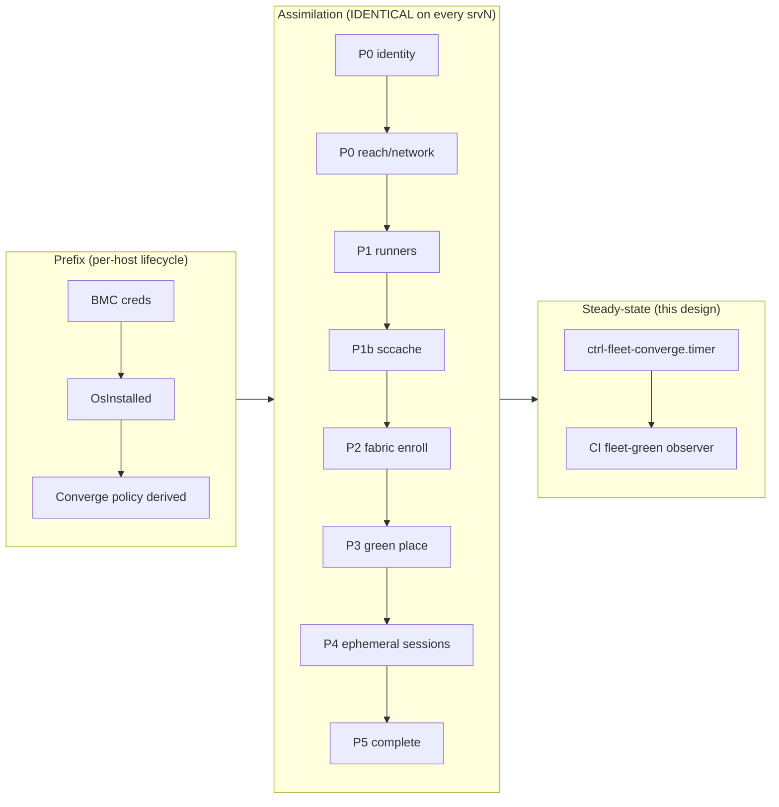
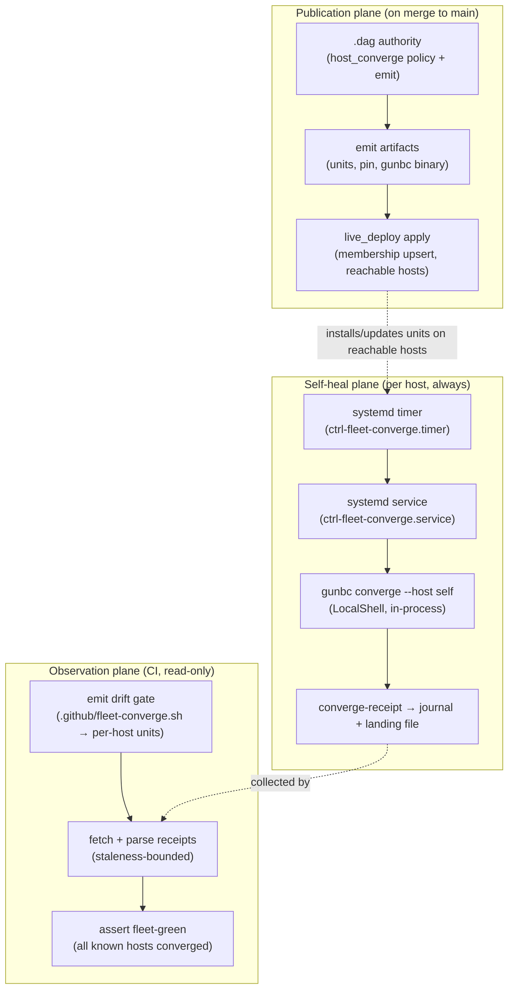

# Fleet self-converge enforcement — host-local timers, CI as observer

**Status:** design for operator sign-off (deep-swift-443, 2026-07-21).  
**North star:** every srvN host is **homogeneous** — same assimilation spine, same cgroup caps, same runner slots, same build cache, same ephemeral session containers, same self-converge timer — with only **hardware inventory** and **lifecycle phase** allowed to differ.  
**Supersedes (in part):** the star-topology assumption in `ci-humming.md` T5 ("ctrl fetches script, runs per-host over SSH") and any GHA-cron converge enforcement sketch.  
**Builds on:** `host-effect-orchestration.md` Phase E, `gunbc.host_standup` assimilation spine, ROADMAP `2-periodic-actuation`, `membership-diff-reconcile-spine-design.md` (live_deploy binding), `fleet-acceptance-criteria.md` T5, `srvn-buildcache-provisioning-design.md`.

## North star — homogeneous srvN

The operator goal is not "a converge script" — it is **srv1 = srv2 = srv3** as fabric members: properly capped, self-healing, running ephemeral agent-session containers and GHA runner slots under the same model.

**Single program, N hosts.** `gunbc.host_standup.host_standup_spine` is already the master checklist — prefix (BMC → OS install → converge policy) then assimilation (identity → network → runners → build cache → fabric enroll → green place → session placement → complete gate). Homogeneity means **every host that reaches `FabricJoined` has executed the same spine rows**, not three hand-tuned snowflakes.

**What "homogeneous" means concretely:**

| Capability | Authority | srv1 today | srv2 today | srv3 today |
|---|---|---|---|---|
| Physical inventory | `fleet_intent` | modeled ✓ | modeled ✓ | modeled ✓ (BMC observed) |
| OS installed | prefix `OsInstallActuated` | ✓ | ✓ | **✓ live** (Ubuntu/systemd 255 since 2026-07-13; **hand-stood**, not neat-boar-modeled) |
| Tailnet / reach | `ReachSecretsNetwork` (P0) | partial (TS endpoint modeled) | partial | **none** (LAN only — `192.168.1.221` hand-known, not in `fleet_intent_network` yet) |
| Runner slots + caps | `RunnerDeploySlot` (P1) | hand-managed | hand-managed | **hand-managed** (5 slots; melt history 2026-07-20/21) |
| Build cache (sccache) | `BuildCacheProvision` (P1b) | misconfigured legacy | misconfigured legacy | unknown / not provisioned |
| Self-converge timer | *this design* | **missing** | **missing** | **missing** (highest-risk gap — serving CI unenforced) |
| Compute fabric enroll | `ComputeFabricEnroll` (P2) | ctrl JS interim | ctrl JS interim | ctrl JS interim |
| Pinned gunbc tree | `GreenPlaceReadiness` (P3) | partial | partial | partial |
| Ephemeral session containers | `SessionPlacementEnrollment` (P4) | ctrl JS interim | ctrl JS interim | ctrl JS interim (6 sessions live) |
| Assimilation complete | P5 gate | **not closed** | **not closed** | **not closed** |

**Ephemeral containers** are the session/agent isolation layer (`gunbc.fleet_container`: `AgentSessionContainer`, `GhaRunnerContainer`; `ExecutionSurface.isolation = ContainerHermetic`). Today session spawn still routes through ctrl `container_runtime.mjs` (P4 gap). Homogeneity requires P4 modeled: each dispatch session runs in a **frame-contained** cgroup/container whose teardown erases state (`LifecycleByConstruction` per `effect-namespace-grants.md`) — same envelope on every srvN, admitted by `fleet_host_budget` alongside runner slots.

**This doc's slice** is the **steady-state enforcement loop** (timer + reachability model + CI observer) — one assimilation row that must be identical on every live host. It does not subsume OS install (srv3 prefix), tailnet ACL (P0), or session placement (P4); it **depends on** them and **must not fork** per host.



**Push-to-main → fleet update** in the homogeneity story: merge publishes new spine artifacts (units, pin, runner manifest, ACL emit) via live_deploy; each host's timer converges local state toward them; CI verifies receipts — it does not perform the converge.

## Problem (operator correction)

Three facts that the current shape gets wrong:

1. **A melted host cannot run its own healing workflow from CI.** Yesterday's srv3 could not execute a GitHub Actions converge job — if the host is broken, the central runner is blind or unreachable. Enforcement must be **on-host**: a systemd timer that runs whether or not GitHub is up.

2. **Converge's job is to fix broken runners on the host that owns them.** Caps, runner width, jobserver tokens, pinned tree — these are local systemd facts. The actor that applies them must be **local** (`LocalShell` / in-process `gunbc converge`), not a star-topology SSH poke from srv1 or a GHA runner.

3. **Reachability is a first-class fleet fact, not an implicit SSH config.** srv3 is not on the tailnet; there was no ssh config anywhere modeling how (or whether) a central actor reaches it. Sessions that assumed SSH reachability were **blind by construction** — a §5 fail-open dressed as "we'll figure it out at apply time."

The operator still wants **push-to-main → fleet updates** — but loosely: merging main should publish new target state and roll it out to reachable hosts. That is **publication + membership apply**, not "CI cron runs converge on everyone."

## Architecture — three planes



| Plane | Runs where | Mutates hosts? | Trigger |
|---|---|---|---|
| **Publication** | CI runner (merge) + live_deploy transport | Yes — **membership upsert** only on hosts the model admits reachable | `push` to `main` (existing CD path; extend) |
| **Self-heal** | Each fleet host locally | Yes — converge knobs on **self** only | systemd timer (`OnCalendar` or monotonic — see timer section) |
| **Observation** | CI runner | **No** | `push` to `main`, scheduled falsifier cadence |

**Invariant:** CI never calls `gunbc converge --host srvN` for remote N. CI may only (a) verify emitted artifacts match `.dag`, (b) collect receipts, (c) assert fleet-green.

## What dies: the star script

Today's `.github/fleet-converge.sh` is a **21-line star topology** — one artifact runs `gunbc converge --host srv1`, `srv2`, and `srv3` from a single executor. That made sense as a bootstrap oracle during slice-2 landing; it is the wrong enforcement shape.

| Today | Target |
|---|---|
| One script converges all hosts | One **service unit per host** converges **self** only |
| GHA/ctrl runs converge remotely | Host timer runs converge locally |
| srv3 bootstrap + steady-state in same script | srv3 bootstrap stays **BMC/autoinstall seed** for *future* modeled installs; **today's hand-stood srv3** gets the local timer **now** (interim LAN apply path) |
| Reachability implicit in ssh config | Reachability **modeled**; central actors refuse when absent |

The committed golden migrates: `expected_fleet_converge_sh` dissolves into `expected_fleet_converge_unit` + `expected_fleet_converge_timer` per host (or one parameterized emit with host identity argument). The drift gate stays — it checks **emit fidelity**, not remote execution.

## Host reachability — model it as a knob

Reachability is not a ConvergeKnob (it is not a systemd property). It is a **management-plane fact** upstream of transport selection — the same layer that already owns `fleet_intent_network` endpoints and `live_deploy.spec.DeploymentHostTarget.ssh_host`.

### Proposed authority: `HostManagementProfile` in `gunbc.fleet_intent`

```dag
type HostInstallDisposition
  = ModeledInstalled          // neat-boar/autoinstall lane witnessed OsInstalled
  | HandStoodUp { since: LogicalTime, note: NonEmptyStr }   // live OS outside modeled install — honest interim row

type ManagementTransport
  = LocalOnly                          // in-band: timer runs on this host
  | SshOverLan   { address: NonEmptyStr, port: Nat? }
  | SshOverTailnet { tailscale_name: NonEmptyStr }   // MagicDNS or stable TS IP
  | BmcOnly      { endpoint: NetworkEndpoint }       // out-of-band lifecycle only
  | Unmanaged    { reason: NonEmptyStr }             // central actors REFUSE

type HostManagementProfile {
  identity: HostIdentity
  install: HostInstallDisposition
  in_band: ManagementTransport           // steady-state self-converge + observer collection
  out_of_band: ManagementTransport?      // BMC path (always present for metal)
  receipt_sink: ReceiptLanding?          // where observers read back (see Observation plane)
}
```

**Grounding against live fleet (corrected 2026-07-21 — supersedes stale ROADMAP "greenfield" row):**

| Host | `install` | `in_band` (today → target) | `out_of_band` | Notes |
|---|---|---|---|---|
| srv1 | modeled / live | `SshOverTailnet` → **`LocalOnly`** once timer lands | `BmcOnly` (LAN) | Timer eliminates central SSH converge |
| srv2 | modeled / live | same | same | same |
| srv3 | **`HandStoodUp`** (2026-07-13) | **`SshOverLan { 192.168.1.221 }`** for interim publication/observation → **`LocalOnly`** for steady-state | `BmcOnly` (`192.168.1.192`, Redfish live) | **Serving required CI today with no enforcement loop** — timer install is **not** gated on neat-boar; interim LAN row must land in `fleet_intent_network` |

**Operator-accepted interim risk (explicit):** until srv3's timer is live, the fleet's highest melt-risk host runs **unenforced**. Phase 2 extends to srv3 on LAN in parallel with srv1/srv2 — not deferred to Phase 3/autoinstall.

**Construction wall:** `host_effect_apply` over `SshShell` for host H must require `management_transport_allows_ssh(h) == true`. Steady-state converge over SSH is unwritable once `in_band = LocalOnly`.

**Dissolve trigger:** `live_deploy.spec.DeploymentHostTarget.ssh_host` and `ci_deploy_access` host projections (`operator_host_srv1` etc., with identity-match refusal in `ci_deploy_target_host.dag`) **re-parent** under `HostManagementProfile` — not a second ssh authority beside the existing `operator_host_*` rows.

### Relationship to `product.network_topology`

`network_reachability(from, to)` answers "can zone A route to zone B?" — necessary but not sufficient. `HostManagementProfile` answers "which transport is **authorized** for management effects on this host?" srv3 is LAN-reachable but was **unmodeled** for in-band SSH — the blind spot this authority closes.

## Prerequisite — decoy-slice false-green (blocker for fleet-green, not for timer install)

**The design must not certify a lie.** Today `gunbc_runner_slot_unit_placeholder` in `host_converge.dag` is the **unescaped** string `system-actions-runner.slice`; runners actually live in `system-actions\x2drunner.slice`. Verified live on srv1 (2026-07-21 review): the targeted slice is **inactive, memberless, MemoryMax=80G**; the real slice shows **MemoryMax=infinity**. The `runner_slice_cap_bytes` knob has reported "converged" against an empty decoy cgroup since 2026-07-11.

This is the #6096 "mutate-then-read" failure: `systemctl show` reads the manager's property store, not kernel cgroup truth. **Under this design, an unfixed timer would re-assert the lie every cadence; the CI observer would certify it fleet-green.**

**Required before fleet-green accept gates (Phase 1 deliverable, may parallel timer install):**

1. **Fix the slice name** — `gunbc_runner_slot_unit_placeholder` → escaped unit id `system-actions\x2drunner.slice` (or derive from `extdeps.os.systemd` slice naming authority).
2. **Migrate stale decoy artifacts** — remove/reconcile `/etc/systemd/system.control/system-actions-runner.slice.d/` and the 2025-05-28 hand drop-in on each host (one-shot membership apply).
3. **Kernel-grounded read-back** — fleet-green verdicts for cap knobs must use cgroup-fs reads (`/sys/fs/cgroup/.../memory.max`), not `systemctl show` alone. `2-live-read-seam` is the long-term home; a **minimal slice-cap slice** is a **hard gate for Phase 4**, not optional polish.

**Distinction (review finding 1):** timer install may proceed with `ReadAbsent` per-knob fail-closed semantics, but **trusting the observer** requires kernel-grounded reads — fleet-green without (3) is a §5 false-green.

## Self-heal plane — per-host systemd timer

### Unit shape (emitted, live_deploy `SystemdUnit` member)

**Service** `ctrl-fleet-converge.service`:
- `Type=oneshot`
- `User=root` (caps/systemd properties require it — same privilege model as today)
- `ExecStart=/opt/gunbc/bin/gunbc converge --host self`
  - **Path authority:** `/opt/gunbc/bin/gunbc` — matches existing live_deploy apply (`.github/live-deploy-srv1-apply.sh` rsyncs repo to `/opt/gunbc/gunbc/` then `install -m 0755 target/release/gunbc /opt/gunbc/bin/gunbc`). The `ServeBinary` member and roadmap unit use the same path.
- `EnvironmentFile=-/etc/gunbc/fleet-converge.env` (pin + `GUNBC_ROOT`)
- Logs structured receipt line to stdout → journald (`converge-receipt host=…` prefix)

**Timer** `ctrl-fleet-converge.timer` — **two signed options** (operator picks one; do not ship `Persistent=true` on a monotonic timer):

**Option A — calendar + catch-up (recommended for "missed runs after downtime"):**
```ini
[Timer]
OnCalendar=*:0/15
Persistent=true
RandomizedDelaySec=90
Unit=ctrl-fleet-converge.service
```
`Persistent=true` applies only with `OnCalendar=` — systemd ignores it on `OnBootSec`/`OnUnitActiveSec` (would log a warning and provide no catch-up).

**Option B — monotonic (simpler, no calendar catch-up):**
```ini
[Timer]
OnBootSec=5min
OnActiveSec=2min
OnUnitActiveSec=15min
RandomizedDelaySec=90
Unit=ctrl-fleet-converge.service
```
Post-`enable --now`, `OnActiveSec` fires the first run deterministically; `OnBootSec` covers reboot. Missed runs while powered off are **not** replayed — acceptable only if operator accepts reboot-only catch-up.

**Modeled constant:** `fleet_converge_timer_interval` in `.dag` (not hand-edited unit text). Jitter is `RandomizedDelaySec=`, not a property of `OnUnitActiveSec`.

**Oneshot semantics:** converge is idempotent; noop runs emit `verdict=converged applied=0` (T5 acceptance).

### CLI: `--host self`

ROADMAP `2-converge-reland` already names **hostname self-selection**. Formalize:

```
gunbc converge --host self
  → resolve local HostIdentity via gunbc.host_identity_observation authority
      (hostname/static-id match against fleet_intent operator_host_srv* rows;
       NOT a fresh alias table — reuse existing UnknownHost refusal in fleet_converge_cli.dag)
  → converge_cli_run for that identity only
  → emit converge_cli_receipt_line to stdout + exit code
```

RED: `--host self` on a host whose identity is not in `fleet_intent_known_hosts` → `UnknownHost` refusal (`ConvergeCliRefusalCause`), non-zero exit, typed journal.

### Target pin (loose push-to-main coupling)

On merge to main, the fleet should converge toward a new policy without a central cron:

1. **Pin file** — content-addressed desired revision, e.g. `/etc/gunbc/pin` containing the git SHA (or content hash of `fleet_converge_policy()`), written by live_deploy apply when the `GunbcPinnedTree` knob changes.
2. **Timer pre-check** — service reads pin; if local checkout ≠ pin, `git fetch && git checkout` (or `GunbcPinnedTree` converge knob handles it) before converge loop.
3. **CI on main** — does NOT run converge; live_deploy apply updates pin + units on hosts with SSH-authorized `in_band` (tailnet srv1/srv2, LAN srv3 interim). Hosts with only `BmcOnly` in-band are counted frontier rows, not silent skips.

### Receipt landing and grammar migration

`converge_cli_receipt_line` is governed by `gunbc_host_converge_receipt_grammar_marker` (byte-locked; ctrl may consume the line format). **Extension rule (sign before Phase 1):**

| Approach | Rule | Rollout |
|---|---|---|
| **Append-only fields (preferred)** | New optional `k=v` tokens appended after existing fields (`policy_hash=…`, `observed_at=…`). Marker grammar version unchanged; parser accepts unknown trailing tokens (forward-compatible). | Old lines without new fields remain valid during rollout; staleness gate treats missing `observed_at` as `Refused` until all hosts upgraded. |
| **Marker bump (fallback)** | Increment grammar marker; dual-parse window in collector. | Only if append breaks an existing consumer that rejects unknown suffixes. |

**No parallel JSON authority.** The landing file `/var/lib/gunbc/receipts/converge-latest` stores the **byte-identical** `converge_cli_receipt_line` string (one line, atomic rename). CI collector parses that line through the same `converge_cli_receipt_line` inverse — never a hand-rolled JSON shape. If a structured projection is needed later, it is a **derived view** from the line grammar, not a second serialization.

**Journal collection:** `journalctl -u ctrl-fleet-converge.service --grep 'converge-receipt host=' -o cat -n 1` (the `-n 1` status line is not the receipt). Cross-check: landing file hash == journal line when both present.

**Proposed receipt fields (append-only):**

```dag
// Existing ConvergeCliReceipt fields unchanged; new fields serialize as appended k=v only when Present
policy_hash: ContentHash?      // desired policy content hash at evaluation time
observed_at: LogicalTime?      // ISO-8601 in serialized line; staleness gate input
```

### srv3 receipt collection — Phase 1 decision (gates Phase 3 observer)

srv3 is `LocalOnly` in steady-state (timer runs locally) but has **no tailnet**. Journal-over-tailnet-SSH-from-srv1 **cannot** collect srv3 receipts. The **Phase 3** CI fleet-green observer is **unsatisfiable** until one path is chosen — so the path must be **signed in Phase 1**, not deferred to Phase 3 implementation or Phase 4 closeout.

| Option | Mechanism | Tradeoff |
|---|---|---|
| **A — push landing file (recommended v1)** | Each host's service writes `converge-latest` locally; a **push** step (git commit to `fleet-receipts` branch, object store, or dashboard ingest) runs from the host post-converge | No tailnet required; needs modeled push transport |
| **B — LAN pull** | CI/srv1 collector SSH over LAN (`SshOverLan { 192.168.1.221 }`) read-only `cat /var/lib/gunbc/receipts/converge-latest` | Works now; CI runner must reach LAN (operator network posture) |
| **C — tailnet join srv3** | P0 `ReachSecretsNetwork` enrolls srv3 | Best long-term; slowest |

**Decision required in Phase 1** (not Phase 4). Interim: Option B for hand-stood srv3; Option A as steady-state so CI does not depend on LAN topology.

## Observation plane — CI asserts fleet-green

### What CI does on `push` to `main`

| Step | Kind | Accept |
|---|---|---|
| Emit drift | verify-only | `fleet_converge_emit_test` + per-host unit/timer goldens match committed files |
| Receipt collection | read-only | Fetch last receipt per host from `receipt_sink` within staleness bound |
| Fleet-green assert | verify-only | Every `fleet_intent_known_hosts` member has `timer_installed` + fresh receipt + (Phase 3+) kernel-grounded cap read-back; any host without a timer is a **typed refusal**, not a counted frontier |
| Enforcement census | verify-only | Hosts explicitly exempt from timer (e.g. pre-`OsInstalled` BMC-only) are **listed** with a typed `EnforcementExempt` reason — never silently skipped |

### Fleet-green definition

**Enrollment rule:** every host in `fleet_intent_known_hosts` is in the enforcement set unless it carries an explicit `EnforcementExempt { reason }` row in `HostManagementProfile` (today: **none** — srv1/srv2/srv3 are all live and must be enforced). A host without `timer_installed` and without `EnforcementExempt` ⇒ fleet-green **refuses** (`TimerNotInstalled { host }`), never passes as a silent frontier.

```
fleet_green(receipts, profiles, cgroup_reads, now) =
  ∀ h ∈ fleet_intent_known_hosts :
    match enforcement_status(h, profiles) {
      EnforcementExempt { reason: _ } => true   // listed in census, not in receipt set
      EnforcementRequired =>
        timer_installed(h)
        ∧ ∃ r ∈ receipts where r.host = h
          ∧ r.verdict = Converged
          ∧ age(r.observed_at, now) ≤ staleness_bound
          ∧ cap_knobs_kernel_grounded(h, cgroup_reads)   // Phase 3+ gate (decoy-slice)
    }
```

**Phase split:** Phase 2 fleet-green checks may omit `cap_knobs_kernel_grounded` (timer + receipt only). Phase 3 adds the kernel cross-check — the decoy-slice gate is **observer-blocking in Phase 3**, not Phase 2.

RED controls:
- Hand-edit a managed cap → next timer run restores + receipt shows `applied > 0` + cgroup read matches (Phase 3+)
- Stop timer on srv2 → CI fleet-green fails on staleness within one cadence window
- Known host with no timer and no `EnforcementExempt` → `TimerNotInstalled` refusal (cannot green)
- Decoy slice present → fleet-green **refuses** even if receipt says converged

### What CI explicitly does NOT do

- Run `gunbc converge --host srv1|srv2|srv3` remotely
- SSH converge over star topology
- Treat GHA workflow success as converge success (exit-0 of a remote shell is not independent read-back)

## live_deploy membership (publication binding)

Reuse `membership_reconcile` (landed) — new owned artifacts per host:

| Member kind | Path | Ownership |
|---|---|---|
| `SystemdUnit` | `/etc/systemd/system/ctrl-fleet-converge.service` | Owned |
| `SystemdUnit` | `/etc/systemd/system/ctrl-fleet-converge.timer` | Owned |
| `ServerScript` or config | `/etc/gunbc/fleet-converge.env` | Owned |
| `ServeBinary` | `/opt/gunbc/bin/gunbc` | Owned (existing belt B row) |

Apply pole: upsert all members, `systemctl enable --now ctrl-fleet-converge.timer`.  
Retract pole: teardown owned artifacts (R5 wall — Ensured deps stay).

**srv1 first** (live_deploy already targets srv1). srv2 via same spec pattern. **srv3 interim:** LAN apply path (same units, `SshOverLan` transport) in **Phase 2** alongside srv1/srv2 — not gated on neat-boar autoinstall. Modeled autoinstall seed is the long-term reinstall path, not a blocker for today's live host.

## Non-goals — enforcement topology ≠ melt-proof

This design delivers **routine converge enforcement** (timer + observer). It does **not** by itself prevent the failure modes that contributed to srv3's 2026-07-20/21 melt. Name these explicitly so "fleet-green" is not read as "won't melt again":

| Gap | Why not a converge knob | Pointer |
|---|---|---|
| Swap provisioning | Host-level (`/swap2.img` + fstab); not in `ConvergeTarget` | `host-converge-inventory.md` §5 |
| Per-slot `TasksMax` | Not modeled as knob | same |
| Runner width **INCREASE** / slot provisioning | Converge is drain-only today; new slots need provision act | ROADMAP `2-converge-reland`, `runner_count` row |
| Unit content drift (`depriv.conf` newer on srv3 than srv1) | Reverse drift — not detected by presence-only diff | membership `value_eq` must be content-aware (landed in spine design) |
| Session slice caps | `sessions.slice` knobs exist but session cgroup enforcement is P4/interim | `ci-humming.md` SessionSliceEnforcement |
| Ephemeral container lifecycle | P4 gap — ctrl `container_runtime.mjs` | `host_standup` P4 |

Fleet-green means **converge knobs the model owns are enforced and kernel-read-back proves it** — not full host homogeneity (Track A spine rows).

## Phased work plan

Two tracks run in parallel; homogeneity closes when **both** complete for each host.

**Track A — assimilation spine** (gets a host *to* `FabricJoined`):
- srv3: reconcile `HandStoodUp` vs future `ModeledInstalled` (neat-boar lane for reinstalls, not a blocker for today's host)
- P0 `ReachSecretsNetwork`: tailnet ACL modeled + srv3 enrolled (long-term; LAN interim for observation)
- P1/P1b: runner slots + sccache provisioned per `host_standup` (not hand ctrl)
- P2/P4: compute-fabric enroll + ephemeral session placement off ctrl JS

**Track B — steady-state enforcement** (keeps a joined host *at* `FabricJoined`):
- Phases 0–4 below (reachability model, decoy-slice fix, timer, CI observer, retire star script)

srv1/srv2/srv3 timer install in **Phase 2** (srv3 via LAN interim). Receipt collection path decided in **Phase 1**.

### Phase 0 — Model reachability + decoy-slice fix (no timer yet)

**Deliverables:**
- `HostManagementProfile` rows for srv1/srv2/srv3 (including srv3 `HandStoodUp` + `SshOverLan`)
- `srv3_host_lan_endpoint` in `fleet_intent_network` (`192.168.1.221`)
- `management_transport_allows_ssh` guard in `host_effect_realize`
- **Decoy-slice fix:** correct `gunbc_runner_slot_unit_placeholder`; migration plan for stale `.slice.d` artifacts
- Witness: converge against decoy slice → `NotConverged` or refusal after fix

**Accept (T1):** synthetic RED on wrong slice name; srv3 SSH without profile row → refused.

### Phase 1 — Emit per-host units + `--host self` + receipt grammar + collection decision

**Deliverables:**
- `fleet_converge_emit.dag` emits `ctrl-fleet-converge.{service,timer}` per host (parameterized; timer Option A or B signed)
- `gunbc converge --host self` in `fleet_converge_cli.dag` + stage0 receiver
- Receipt append-only fields + landing file (byte-identical line, not JSON)
- **Signed:** srv3 receipt collection = Option B (LAN pull) interim → Option A (push) target
- Goldens + drift gate (retire monolithic star script or bootstrap-only Scaffold)

**Accept (T1):** emit tests green; grammar marker witnesses pass with appended fields; collection path documented.

### Phase 2 — Install timers on srv1 + srv2 + srv3 (interim)

**Deliverables:**
- live_deploy spec members for service + timer + env file + landing dir
- Operator GO: srv1, srv2 (tailnet apply), **srv3 (LAN apply — priority host given melt history)**
- First real receipts in journal + landing file

**Accept (T4/T5):** timer active on all three; receipt parsed via `--grep converge-receipt`; hand-edit cap on srv3 → next timer run shows `applied > 0` in receipt (kernel cgroup proof deferred to Phase 3).

### Phase 3 — Kernel-grounded observer + CI fleet-green

**Deliverables:**
- Minimal cgroup-fs read for `runner_slice_cap_bytes` (decoy-slice gate)
- CI floor batch: `fleet_green_observer` (read-only)
- Receipt collector per signed path (LAN pull for srv3 interim)
- Staleness + fleet-green assertion **with kernel cross-check**

**Accept (T5):** main push greens only when all three hosts fresh + caps kernel-grounded; RED: decoy slice → refuse; stop timer → staleness fail.

**Note:** Former "Phase 3 srv3 seed" and "Phase 4 observer" merged — srv3 is live now; observer without srv3 is meaningless.

### Phase 4 — Retire star topology remnants

**Deliverables:**
- Delete or quarantine `.github/fleet-converge.sh` steady-state arms (bootstrap-only if still needed for GHA pre-runtime window)
- Dissolve `fleet_converge_thin_invocation` Scaffold
- Update `ci-humming.md` T5 wording to observer model
- ctrl reconciler hash/fan-out deletion (host-effect-orchestration Phase D carryover)

## Dependencies and sequencing

```
Phase 0 (reachability + decoy-slice fix)
    ↓
Phase 1 (emit + CLI + grammar + collection decision) ──┐
    ↓                                                    │
Phase 2 (timers on srv1+srv2+srv3)                      ├→ Phase 3 (observer + kernel reads) → Phase 4 (retire star)
```

**Hard gates:**
- **Decoy-slice fix + kernel read-back:** required for Phase 3 fleet-green accept; NOT required to install timers (but timer without fix re-certifies false-green — install order should fix slice **before** or **with** first timer enable)
- **srv3 receipt collection path:** decided in Phase 1; Phase 3 blocked without it
- `2-live-read-seam` full seam is parallel long-term work; minimal slice-cap cgroup read is the Phase 3 minimum
- `2-converge-reland` three-way diff is parallel; timer enforcement does not wait for full closed-loop

**Soft coupling:**
- `GunbcPinnedTree` knob quality improves pin semantics (Phase 1 can use git SHA literal initially with Scaffold)
- neat-boar `ModeledInstalled` path remains for future reinstalls; does not block srv3 interim timer

## Open questions for operator sign-off

1. **Timer shape:** Option A (`OnCalendar` + `Persistent`) vs Option B (monotonic + `OnActiveSec` first run)?
2. **Receipt collection:** confirm Option B (LAN pull) interim for srv3 → Option A (push landing file) steady-state?
3. **Monolithic script:** retire entirely, or bootstrap-only Scaffold until Phase 4?
4. **srv3 LAN address:** confirm `192.168.1.221` for `fleet_intent_network` row?
5. **Fleet-green staleness:** 2× timer interval strict, or `FleetObserverConfig` row?
6. **Phase 2 priority:** srv3 first given melt history, or srv1→srv2→srv3 serial?

## Acceptance block (for dispatch)

- **Consumer:** per-host `ctrl-fleet-converge.timer` executing `gunbc converge --host self`
- **Green:** timer active on srv1+srv2+srv3; receipt fresh; fleet-green passes with kernel-grounded cap read
- **RED:** decoy slice → fleet-green refuses; stop timer → staleness fail; hand-edit cap → corrected + cgroup proof
- **No inert landing:** star script no longer steady-state enforcement path
- **Receipt location:** journald (`--grep converge-receipt`) + `/var/lib/gunbc/receipts/converge-latest` (byte-identical line)
- **Re-run behavior:** noop converge emits `applied=0`, exit 0

## Homogeneity acceptance (the operator bar)

A host is **homogeneous** when ALL hold (T4/T5 per `fleet-acceptance-criteria.md`):

1. **Spine green** — `host_standup_spine` assimilation phases P0–P5 have no `DeclaredGap` refusal for this host (interim ctrl paths dissolved).
2. **Timer active** — `ctrl-fleet-converge.timer` enabled; receipt fresh within staleness bound.
3. **Runner allocation modeled** — changing runner count/caps is an edit to `ci_runner_placement` / `fleet_converge_policy`, not hand systemctl.
4. **Sessions ephemeral** — agent dispatch runs in `ContainerHermetic` isolation with cgroup cap from `fleet_host_budget`; teardown erases the frame.
5. **Build cache provisioned** — sccache daemon alive per `BuildCacheProvision`; CI release build does not hit `-u RUSTC_WRAPPER` fallback.
6. **Reachability honest** — `HostManagementProfile` matches reality; central lanes do not assume SSH to hosts marked `Unmanaged`.

**Fleet-homogeneous** = srv1 + srv2 + srv3 all pass. srv3 is live today (`HandStoodUp`) — not gated on neat-boar. CI fleet-green observer is the periodic proof.

## Review disposition (2026-07-21)

| Finding | Disposition |
|---|---|
| 1 Decoy-slice false-green | **Accepted blocker** — new prerequisite section; kernel read-back gates Phase 3 |
| 2 srv3 row wrong | **Fixed** — `HandStoodUp`, LAN interim, Phase 2 includes srv3 now |
| 3 `Persistent=true` on monotonic timer | **Fixed** — Option A/B split; `RandomizedDelaySec` for jitter |
| 4 Grammar migration | **Fixed** — append-only k=v rule; landing file stores line verbatim |
| 5 srv3 collection unsatisfiable | **Fixed** — Phase 1 signs collection path; Phase 3 observer blocked until path exists (heading corrected from "Phase 4 blocker") |
| 6 Non-goals / melt-proof | **Fixed** — explicit non-goals table |
| Minor (ssh_host, journalctl, bin path, identity) | **Fixed** in place |

## Dissolution trigger

Delete this doc when Phase 4 lands, the ROADMAP `2-periodic-actuation` node closes at T5, `ci-humming.md` T5 is updated, the homogeneity acceptance rows above are witnessed on srv1+srv2+srv3, and the design row is registered in `gunbc.plans.*`.
