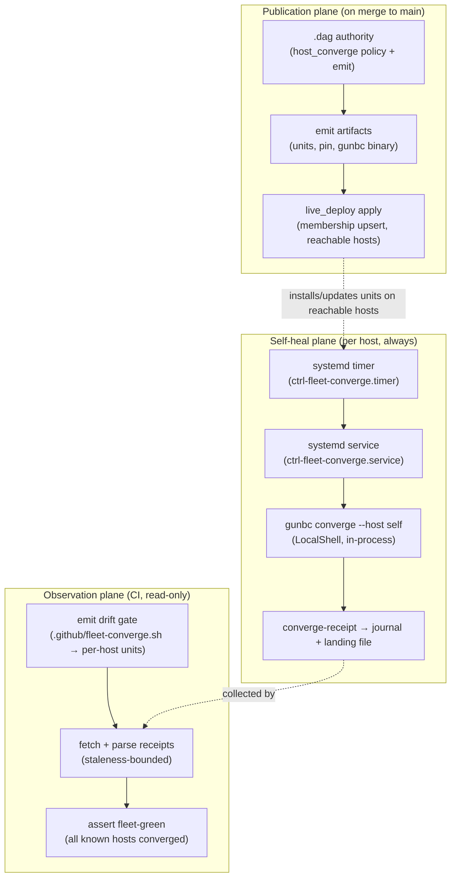

# Fleet self-converge enforcement — host-local timers, CI as observer

**Status:** design for operator sign-off (deep-swift-443, 2026-07-21).  
**Supersedes (in part):** the star-topology assumption in `ci-humming.md` T5 ("ctrl fetches script, runs per-host over SSH") and any GHA-cron converge enforcement sketch.  
**Builds on:** `host-effect-orchestration.md` Phase E, ROADMAP `2-periodic-actuation`, `membership-diff-reconcile-spine-design.md` (live_deploy binding), `fleet-acceptance-criteria.md` T5.

## Problem (operator correction)

Three facts that the current shape gets wrong:

1. **A melted host cannot run its own healing workflow from CI.** Yesterday's srv3 could not execute a GitHub Actions converge job — if the host is broken, the central runner is blind or unreachable. Enforcement must be **on-host**: a systemd timer that runs whether or not GitHub is up.

2. **Converge's job is to fix broken runners on the host that owns them.** Caps, runner width, jobserver tokens, pinned tree — these are local systemd facts. The actor that applies them must be **local** (`LocalShell` / in-process `gunbc converge`), not a star-topology SSH poke from srv1 or a GHA runner.

3. **Reachability is a first-class fleet fact, not an implicit SSH config.** srv3 is not on the tailnet; there was no ssh config anywhere modeling how (or whether) a central actor reaches it. Sessions that assumed SSH reachability were **blind by construction** — a §5 fail-open dressed as "we'll figure it out at apply time."

The operator still wants **push-to-main → fleet updates** — but loosely: merging main should publish new target state and roll it out to reachable hosts. That is **publication + membership apply**, not "CI cron runs converge on everyone."

## Architecture — three planes



| Plane | Runs where | Mutates hosts? | Trigger |
|---|---|---|---|
| **Publication** | CI runner (merge) + live_deploy transport | Yes — **membership upsert** only on hosts the model admits reachable | `push` to `main` (existing CD path; extend) |
| **Self-heal** | Each fleet host locally | Yes — converge knobs on **self** only | systemd timer (+ optional `OnUnitActiveSec` jitter) |
| **Observation** | CI runner | **No** | `push` to `main`, scheduled falsifier cadence |

**Invariant:** CI never calls `gunbc converge --host srvN` for remote N. CI may only (a) verify emitted artifacts match `.dag`, (b) collect receipts, (c) assert fleet-green.

## What dies: the star script

Today's `.github/fleet-converge.sh` is a **21-line star topology** — one artifact runs `gunbc converge --host srv1`, `srv2`, and `srv3` from a single executor. That made sense as a bootstrap oracle during slice-2 landing; it is the wrong enforcement shape.

| Today | Target |
|---|---|
| One script converges all hosts | One **service unit per host** converges **self** only |
| GHA/ctrl runs converge remotely | Host timer runs converge locally |
| srv3 bootstrap + steady-state in same script | srv3 bootstrap stays **BMC/autoinstall seed**; steady-state is **local timer** post-`OsInstalled` |
| Reachability implicit in ssh config | Reachability **modeled**; central actors refuse when absent |

The committed golden migrates: `expected_fleet_converge_sh` dissolves into `expected_fleet_converge_unit` + `expected_fleet_converge_timer` per host (or one parameterized emit with host identity argument). The drift gate stays — it checks **emit fidelity**, not remote execution.

## Host reachability — model it as a knob

Reachability is not a ConvergeKnob (it is not a systemd property). It is a **management-plane fact** upstream of transport selection — the same layer that already owns `fleet_intent_network` endpoints and `live_deploy.spec.DeploymentHostTarget.ssh_host`.

### Proposed authority: `HostManagementProfile` in `gunbc.fleet_intent`

```dag
type ManagementTransport
  = LocalOnly                          // in-band: timer runs on this host (srv1, srv2, srv3 post-install)
  | SshOverLan   { address: NonEmptyStr, port: Nat? }
  | SshOverTailnet { tailscale_name: NonEmptyStr }   // MagicDNS or stable TS IP
  | BmcOnly      { endpoint: NetworkEndpoint }       // out-of-band lifecycle only; NO in-band converge
  | Unmanaged    { reason: NonEmptyStr }             // explicitly unreachable — central actors REFUSE

type HostManagementProfile {
  identity: HostIdentity
  lifecycle: HostLifecyclePhase          // FactoryDefault | OsInstalled | FabricJoined | …
  in_band: ManagementTransport           // how steady-state self-converge runs
  out_of_band: ManagementTransport?      // BMC path (always present for metal)
  receipt_sink: ReceiptLanding?          // where observers read back (see below)
}
```

**Grounding against live fleet (honest rows, not wishful):**

| Host | `in_band` (today → target) | `out_of_band` | Notes |
|---|---|---|---|
| srv1 | `SshOverTailnet` → **`LocalOnly`** once timer lands | `BmcOnly` (LAN) | Timer eliminates need for central SSH converge |
| srv2 | same | same | same |
| srv3 | **`Unmanaged`** (no tailnet, no ssh row) → **`LocalOnly`** after `OsInstalled` | `BmcOnly` (LAN `192.168.1.192`) | Central lane was blind; BMC is the only honest path until OS exists |

**Construction wall:** `host_effect_apply` over `SshShell` for host H must require `management_transport_allows_ssh(h) == true`. If `in_band` is `LocalOnly | BmcOnly | Unmanaged`, the SSH transport arm is **unwritable** for steady-state converge — not a runtime surprise.

**Dissolve trigger:** hand `ssh_host: "srv1"` literals in `live_deploy/spec.dag` become projections of `HostManagementProfile` (same pattern as `gunbc.host_layout` path authority).

### Relationship to `product.network_topology`

`network_reachability(from, to)` answers "can zone A route to zone B?" — necessary but not sufficient. `HostManagementProfile` answers "which transport is **authorized** for management effects on this host?" A host may be LAN-reachable but `Unmanaged` for in-band (srv3 today). Do not conflate the two authorities.

## Self-heal plane — per-host systemd timer

### Unit shape (emitted, live_deploy `SystemdUnit` member)

**Service** `ctrl-fleet-converge.service`:
- `Type=oneshot`
- `User=root` (caps/systemd properties require it — same privilege model as today)
- `ExecStart=/opt/gunbc/bin/gunbc converge --host self` (see CLI extension below)
- `EnvironmentFile=-/etc/gunbc/fleet-converge.env` (pin + `GUNBC_ROOT`)
- Logs structured receipt line to stdout → journald

**Timer** `ctrl-fleet-converge.timer`:
- `OnBootSec=5min` (post-reboot heal)
- `OnUnitActiveSec=15min` (steady cadence; exact interval is a modeled constant, not hand-edited)
- `Persistent=true` (catch up missed runs after downtime — the host heals itself after melt)
- `Unit=ctrl-fleet-converge.service`

**Oneshot semantics:** converge is idempotent; noop runs emit `verdict=converged applied=0` (T5 acceptance).

### CLI: `--host self`

ROADMAP `2-converge-reland` already names **hostname self-selection**. Formalize:

```
gunbc converge --host self
  → resolve local HostIdentity (from /etc/hostname + fleet_intent alias table, fail-closed on unknown)
  → converge_cli_run for that identity only
  → emit converge-receipt line + exit code
```

RED: `--host self` on a host whose identity is not in `fleet_intent_known_hosts` → `UnknownHost` refusal, non-zero exit, typed journal.

### Target pin (loose push-to-main coupling)

On merge to main, the fleet should converge toward a new policy without a central cron:

1. **Pin file** — content-addressed desired revision, e.g. `/etc/gunbc/pin` containing the git SHA (or content hash of `fleet_converge_policy()`), written by live_deploy apply when the `GunbcPinnedTree` knob changes.
2. **Timer pre-check** — service reads pin; if local checkout ≠ pin, `git fetch && git checkout` (or `GunbcPinnedTree` converge knob handles it) before converge loop.
3. **CI on main** — does NOT run converge; live_deploy apply updates pin + units on **reachable** hosts. Unreachable hosts (srv3 pre-install) are `Unmanaged` — not an error, a counted frontier row.

This is the "loose" push-to-main → fleet update: **membership apply propagates artifacts; timers propagate knob state; pin propagates policy revision.**

## Observation plane — CI asserts fleet-green

### What CI does on `push` to `main`

| Step | Kind | Accept |
|---|---|---|
| Emit drift | verify-only | `fleet_converge_emit_test` + per-host unit/timer goldens match committed files |
| Receipt collection | read-only | Fetch last receipt per host from `receipt_sink` within staleness bound |
| Fleet-green assert | verify-only | Every host with `in_band != Unmanaged` has `verdict=converged` and `observed_at` < 2× timer interval |
| Reachability census | verify-only | Hosts marked `Unmanaged` are **listed**, not silently skipped — counted frontier |

### Receipt landing

Extend `ConvergeCliReceipt` (already byte-locked in `fleet_converge_cli.dag`) with collection metadata:

```dag
type ConvergeCliReceipt {
  host: String
  applied: Int
  drifted: Int
  verdict: ConvergeVerdict
  reason: ConvergeCliRefusalCause?
  policy_hash: ContentHash?      // NEW — which desired state was evaluated
  observed_at: LogicalTime?      // NEW — for staleness gate
}
```

**Landing paths (per host, modeled in `receipt_sink`):**
- **Primary:** journald structured line (`converge-receipt host=…`) — collector parses `journalctl -u ctrl-fleet-converge.service -n 1`
- **Secondary:** append-only file `/var/lib/gunbc/receipts/converge-latest.json` (for CI SSH collection from srv1/srv2 tailnet — **read-only**, not written by CI)

**Fleet-green definition:**

```
fleet_green(receipts, profiles, now) =
  ∀ h ∈ hosts where in_band(h) ≠ Unmanaged :
    ∃ r ∈ receipts where r.host = h
      ∧ r.verdict = Converged
      ∧ age(r.observed_at, now) ≤ staleness_bound
```

RED controls:
- Hand-edit a managed cap → next timer run restores + receipt shows `applied > 0`
- Stop timer on srv2 → CI fleet-green fails on staleness within one cadence window
- Forge receipt file without journal correlation → collector refuses (optional cross-check phase)

### What CI explicitly does NOT do

- Run `gunbc converge --host srv1|srv2|srv3` remotely
- SSH converge over star topology
- Treat GHA workflow success as converge success (exit-0 of a remote shell is not independent read-back)

## live_deploy membership (publication binding)

Reuse `membership_reconcile` (landed) — new owned artifacts per host:

| Member kind | Path | Ownership |
|---|---|---|
| `SystemdUnit` | `/etc/systemd/system/ctrl-fleet-converge.service` | Owned |
| `SystemdUnit` | `/etc/systemd/system/ctrl-fleet-converge.timer` | Owned |
| `ServerScript` or config | `/etc/gunbc/fleet-converge.env` | Owned |
| `ServeBinary` | `/opt/gunbc/bin/gunbc` | Owned (existing belt B row) |

Apply pole: upsert all members, `systemctl enable --now ctrl-fleet-converge.timer`.  
Retract pole: teardown owned artifacts (R5 wall — Ensured deps stay).

**srv1 first** (live_deploy already targets srv1). srv2 via same spec pattern. srv3 gated on `OsInstalled` — timer members are in the autoinstall seed, not live_deploy SSH apply.

## Phased work plan

### Phase 0 — Model reachability (no host mutation)

**Deliverables:**
- `HostManagementProfile` rows for srv1/srv2/srv3 in `gunbc.fleet_intent`
- `management_transport_allows_ssh` guard wired into `host_effect_realize` (fail-closed stub refusal)
- Witness: srv3 `SshShell` converge attempt → typed `ManagementUnreachable` refusal
- Witness: srv1 `LocalOnly` profile → SSH converge arm unwritable

**Accept (T1):** synthetic RED proves central SSH to srv3 is refused by construction, not discovered at runtime.

### Phase 1 — Emit per-host units + `--host self`

**Deliverables:**
- `fleet_converge_emit.dag` emits `ctrl-fleet-converge.{service,timer}` per host (parameterized)
- `gunbc converge --host self` in `fleet_converge_cli.dag` + stage0 receiver
- Goldens + drift gate (retire monolithic star script or reduce it to **bootstrap-only** oracle with explicit Scaffold disposition)
- Receipt extensions (`policy_hash`, `observed_at`)

**Accept (T1):** emit tests green; RED: wrong unit content → drift gate fails.

### Phase 2 — Install timers on srv1 + srv2

**Deliverables:**
- live_deploy spec members for service + timer + env file
- Operator GO for one live apply on srv1, then srv2
- First real receipt landed via journald

**Accept (T4/T5):** independent read-back — `systemctl is-active ctrl-fleet-converge.timer` + receipt parsed from journal; hand-edit cap → next run corrects.

### Phase 3 — srv3 local self-converge (post-`OsInstalled`)

**Deliverables:**
- Autoinstall/cloud-init seed enables timer (neat-boar lane)
- srv3 `in_band` flips `Unmanaged` → `LocalOnly` in `HostManagementProfile`
- Remove srv3 from any central converge script

**Accept (T4):** srv3 receipt appears in fleet collection without any central SSH; BMC remains `out_of_band` only.

### Phase 4 — CI fleet-green observer

**Deliverables:**
- CI floor batch: `fleet_green_observer` (read-only, Hermetic where possible)
- Receipt collector (journal over tailnet SSH **read**, or checked-in receipt artifacts from falsifier cadence initially)
- Staleness + fleet-green assertion

**Accept (T5):** main push greens when all managed hosts have fresh receipts; RED: stop one timer → next CI run fails.

### Phase 5 — Retire star topology remnants

**Deliverables:**
- Delete or quarantine `.github/fleet-converge.sh` steady-state arms (bootstrap-only if still needed for GHA pre-runtime window)
- Dissolve `fleet_converge_thin_invocation` Scaffold
- Update `ci-humming.md` T5 wording to observer model
- ctrl reconciler hash/fan-out deletion (host-effect-orchestration Phase D carryover)

## Dependencies and sequencing

```
Phase 0 (reachability model)
    ↓
Phase 1 (emit + CLI) ─────────────────────┐
    ↓                                       │
Phase 2 (srv1/srv2 timers)                 │
    ↓                                       ├→ Phase 4 (CI observer) → Phase 5 (retire star)
Phase 3 (srv3 seed) ───────────────────────┘
```

**Hard gates:**
- `2-live-read-seam` partial progress helps converge quality but is NOT a blocker for timer install (timer can run with `ReadAbsent` knobs — fail-closed per knob, not silent widen)
- `2-converge-reland` three-way diff is parallel; timer enforcement does not wait for full closed-loop
- srv3 Phase 3 blocked on neat-boar `OsInstalled`

**Soft coupling:**
- `GunbcPinnedTree` knob quality improves pin semantics (Phase 1 can use git SHA literal initially with Scaffold)

## Open questions for operator sign-off

1. **Timer cadence:** 15min default — acceptable, or tie to `ctrl` dashboard heartbeat?
2. **Receipt collection transport:** journald-over-SSH-from-srv1 vs each host pushes to a git-backed receipt branch vs object store — which is the first landing?
3. **Monolithic script:** retire entirely, or keep as GHA bootstrap-only artifact with explicit `Scaffold { dissolution = Phase 5 }`?
4. **srv3 pre-install:** confirm `in_band = Unmanaged` is the honest row until `OsInstalled` (BMC-only management) — yes/no?
5. **Fleet-green staleness:** 2× timer interval strict, or operator-tunable `FleetObserverConfig`?

## Acceptance block (for dispatch)

- **Consumer:** per-host `ctrl-fleet-converge.timer` executing `gunbc converge --host self`
- **Green:** timer active on srv1+srv2; receipt with `verdict=converged` landed within one interval; CI fleet-green job passes on main
- **RED:** stop timer → CI fails staleness; hand-edit cap → next receipt shows correction; central `gunbc converge --host srv3` → `ManagementUnreachable` refusal
- **No inert landing:** star script no longer the steady-state enforcement path
- **Receipt location:** journald `ctrl-fleet-converge.service` + `/var/lib/gunbc/receipts/converge-latest.json`
- **Re-run behavior:** noop converge emits `applied=0`, exit 0

## Dissolution trigger

Delete this doc when Phase 5 lands, the ROADMAP `2-periodic-actuation` node closes at T5, `ci-humming.md` T5 is updated, and the design row is registered in `gunbc.plans.*`.
