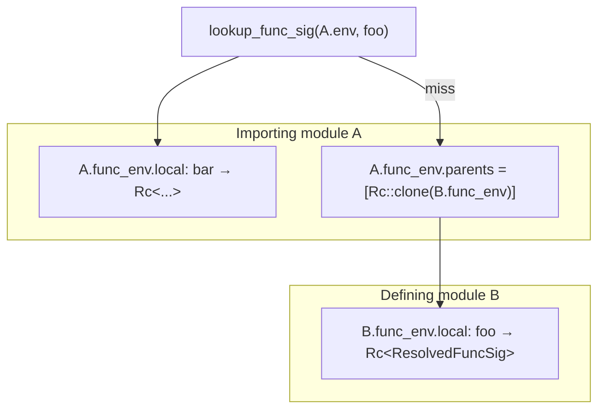

# func_env.sigs single-authority — design sketch

Status: design-first, 2026-06-29. Owner: wise-wolf-402.
Parent plan: [representation-minimization.md](representation-minimization.md) item 4.
Gate: **no `build_type_env` edits** in this lane (load-bearing; separate bank-if-cheap kernel-slice item).

## Problem (verified by code read)

Each `TypedModule` carries a `func_env: ResolvedFuncEnv` whose `signatures` map is a **fully materialized transitive closure** of every callable signature the module can see. That closure is rebuilt independently for every module in the graph.

Three conversion sites allocate fresh outer shells even when the heavy payloads are already `Rc`-shared:

| Site | File | What it copies |
|---|---|---|
| Import merge | `04_infer.dag` `merge_scope_from_imports` ~298–322 | For each direct import, every `ResolvedFuncSig` in `typed_parent.func_env.signatures` is round-tripped through a fresh `DeclaredFuncSig` (name `String`, cloned `params`/`inferred`/`provenance` `Rc`s) and accumulated into a new `Map`. |
| Re-resolve | `04_sigs.dag` `declared_to_resolved` + `resolve_func_sigs` | Parent entries that were already `ResolvedFuncSig` are converted `DeclaredFuncSig → Rc::new(ResolvedFuncSig {…})` again in `collect_parent_resolved_sigs` and `topo_resolve_loop`. |
| Per-module store | `04_infer.dag` `build_module_context` → `typecheck_module` | `resolve_result.func_env` (full merged map) is stored on the `TypedModule` and copied forward by every downstream importer. |

`populate_output_provenance` (~5012) only mutates **local** function entries; imported signatures never need a per-consumer copy. The waste is structural, not semantic.

### Already shared (not the prize)

Inside each `ResolvedFuncSig`, `params`, `inferred`, `output_provenance`, and `variant_provenance` are `Rc`-backed. `declared_to_resolved` clones those inner `Rc`s — it does **not** deep-copy Node trees. The duplication is:

- one `Rc<ResolvedFuncSig>` outer shell per (module, function) pair in the closure;
- one `HashMap` backbone per module holding the closure;
- one raw `String` key per map entry (not interned).

### Measurement context

- Plan estimate: **hundreds of MiB** on whole-tree resolve (second-quadratic in module count × closure width, but subordinate to the intern-table fix).
- Phase-0 chronicle (#5893): **~158 MiB per typecheck entry** attributed to per-entry resolve on a 204-module closure — same structural family, not yet isolated to `func_env` alone.
- Prior intern-table fix (#5867) is the precedent: **1397 → 1** unique `InternTable` `Rc`, 14.2 → 5.5 GiB whole-tree. Target the same shape of receipt for `ResolvedFuncSig` identity.

## Design discriminator

Per representation-minimization item 4: this fix **can land anytime**, lives in the **`.dag` authority** (`04_sigs.dag`, `04_infer.dag`, `04_lookup.dag`), and does **not** require the emitter-determinism gate (#5879). Implementation path: model in `.dag` → emit → regenerate v1 seed (standard §7 loop).

Explicitly **out of scope** for this lane:

- `build_type_env` / `type_env` closure de-merge (separate designed item in [resolved-graph-representation-minimization.md](resolved-graph-representation-minimization.md) §“Source-side de-merge (A)”; touches the same load-bearing function but is a distinct, larger change).
- Kernel-bindings / `seed_kernel_intern_table` sharing inside `build_type_env` (bank-if-cheap v1-seed hygiene).
- Lever C frontier eviction (deferred to v2 streaming infer; decision A3).

## Recommended design: scope-chain `ResolvedFuncEnv`

Extend, do not fork (DESIGN §3): mirror the already-designed `TypeEnv` scope-chain from resolved-graph item A, but **only for function signatures** and **without waiting** on the type_env migration.

### Type change

```dag
type ResolvedFuncEnv {
  local: Map<String, ResolvedFuncSig>   // functions declared in THIS module (post-resolve + post-provenance)
  parents: List<ResolvedFuncEnv>         // Rc-shared envs of DIRECT imports, in source import order
}
```

Remove the flat `signatures` field. Each module stores **only its own** resolved signatures in `local`; visibility to imports is by chain-walk, not copy.

### Lookup (single authority for consumers)

Replace `lookup_func_sig` (`04_lookup.dag` ~71) with:

```
lookup_func_sig(env, name):
  if map_get(env.local, name) present → return   // (1) local shadows everything
  for parent in reverse(env.parents):            // (2) last direct import shadows earlier
    if lookup_func_sig(parent, name) present → return
  absent
```

**Shadowing contract (must match today's flat merge exactly):**

| Priority | Source | Today's equivalent |
|---|---|---|
| 1 (wins) | `env.local` | local `func_sigs` merged last in `build_module_context` |
| 2 | last import in `resolved_imports` | last `map_insert` in `merge_scope_from_imports` |
| 3 | … | … |
| n | first import | first `map_insert` |

`parents` is **stored** in source import order `[imp₁, imp₂, …]`; lookup walks **reverse** so impₙ shadows impₙ₋₁ (same as cumulative `map_insert`). Walking forward would let imp₁ win — **wrong** and caught by the shadowing witness below.

All consumers already go through `lookup_func_sig` or `lookup_func_sig_in_scope` (`04_infer.dag`, `05_emit.dag`). No emitter semantic change if lookup is equivalent.

### Build path (eliminate the copy sites)

**1. `merge_scope_from_imports` (~298)** — drop `func_sigs` from `InferScopeComponents` entirely. The function keeps only `svc_registry` / `svc_locals` import merging (unaffected). No `ResolvedFuncSig → DeclaredFuncSig` conversion at this site.

**2. `build_module_context` (~5924)** — replace merged declared map + `resolve_func_sigs` over closure:

```
let parent_envs = map(resolved_imports, imp =>
  map_get(parent_index, imp.module_path).func_env   // Rc-share, no copy
)
let resolve_result = resolve_func_sigs(
  declared_sigs: local.func_sigs,                    // LOCAL declarations only
  parent_envs: parent_envs,
  items: local.resolved_items,
  ...
)
let func_env = ResolvedFuncEnv {
  local: resolve_result.signatures,                   // local resolved map only
  parents: parent_envs
}
```

**3. `resolve_func_sigs` / `04_sigs.dag`** — thread `parent_envs: List<ResolvedFuncEnv>` instead of parent entries embedded in `declared_sigs`:

- `collect_parent_resolved_sigs` becomes `lookup_parent_resolved(name, parent_envs)` using the same chain-walk as `lookup_func_sig` (no `declared_to_resolved` for imports).
- `topo_resolve_loop` seeds `resolved` from parent lookups only for names referenced as local callees (lazy: lookup on demand when a callee is non-local).
- `declared_to_resolved` remains for **local** `DeclaredFuncSig` rows only — each function is resolved **once**, at its defining module.

**4. `populate_output_provenance` (~5012)** — fold over `func_env.local` only (typed_items are local). Parents are immutable shared `Rc`s; provenance is per-defining-module fact.

**5. `annotate_descent_evidence` / infer call sites** — pass `func_env` (chain) instead of `func_env.signatures` flat map; internal callees resolved via `lookup_func_sig`.

### Topological order invariant

`typecheck_modules` (`04_infer.dag` ~6279) already typechecks in dependency order and passes `module_index` containing **completed** parent modules. When module M is processed, each direct import's `func_env` is final (including `populate_output_provenance`). Chain-walk reads stable `Rc`s — no copy required.



## Rejected alternatives

| Alternative | Why not |
|---|---|
| Flat map but `Rc::clone` parent sigs in `merge_scope_from_imports` (skip `DeclaredFuncSig` round-trip) | Cuts one conversion hop but **retains per-module `HashMap` backbones** and `String` keys — partial fix, second-quadratic map count remains. |
| Global `FuncSigRegistry` side table | New authority; duplicates the import DAG already carried by `module_index`. Scope chain reuses existing parent pointers. |
| Intern `String` name keys only | Worthwhile hygiene (~#5867 analog) but does not remove map backbones; compose **after** scope-chain lands. |

## Sign-off checklist (operator review targets)

### (1) Shadowing order — discriminating GREEN

Witness module `dsl/test/claim/func_env_scope_chain_shadow_test.dag` (name TBD), three-file fixture:

```
// shadow_first.dag — defines fn marker() -> i32 { 1 }
// shadow_second.dag — defines fn marker() -> i32 { 2 }
// shadow_consumer.dag:
//   import shadow_first
//   import shadow_second          // second import MUST win
//   fn use_marker() -> i32 { marker() }
```

Assertion: inferred return of `use_marker` body is **literal 2** (not 1). A forward parent-walk (imp₁ before imp₂) resolves `marker` to **1** → witness **RED**. Local shadow variant: consumer defines its own `marker() -> i32 { 3 }` with both imports present → must resolve to **3**.

### (2) Rc-identity oracle — same pointer, not a fresh clone

Witness `func_env_scope_chain_rc_identity_test.dag` (Rust seed helper or `rc_ptr_eq` from `v1_rt`):

After whole-tree typecheck on a real import edge **definer → consumer**:

```
let def_sig = map_get(definer.func_env.local, "some_fn")
let use_sig = lookup_func_sig(consumer.func_env, "some_fn")
assert rc_ptr_eq(def_sig, use_sig)    // SAME Rc allocation
```

Count oracle (whole dsl corpus): unique `ResolvedFuncSig` pointers reachable from all `func_env`s ≈ **count of distinct functions defined** (not Σ closure sizes). Main-branch control: strictly higher count (copy still present). **Ptr-eq is the proof the copy is gone**; count alone only shows shrinkage.

### (3) Discriminating RED — dropped parent breaks resolution

Same fixture family; **perturbation control** (not shipped code — test-only or `#[cfg(test)]` helper):

```
// shadow_consumer imports shadow_first only (NOT shadow_second)
// calls first_only() defined in shadow_first
```

GREEN: `lookup_func_sig` finds sig, typecheck passes. **RED perturbation**: build consumer `func_env` with `parents: []` (drop parent) → `lookup_func_sig` returns absent → `undefined variable` diagnostic. Proves chain-walk is load-bearing, not decorative.

### (4) Files touched / load-bearing exclusions

**Edited (.dag authority):**

| File | Changes |
|---|---|
| `src/v1/04_sigs.dag` | `ResolvedFuncEnv { local, parents }`; `resolve_func_sigs` parent-chain param |
| `src/v1/04_lookup.dag` | chain-walk `lookup_func_sig` |
| `src/v1/04_infer.dag` | `merge_scope_from_imports` (drop sig copy), `build_module_context`, `populate_output_provenance`, `annotate_descent_evidence` call sites, `typecheck_module` empty-env branch |
| `src/v1/04_items.dag` | only if `TypedModule` doc/comments need update |
| `src/v1/05_emit.dag` | `lookup_func_sig_in_scope` delegates to updated lookup |

**Regenerated (emit output, not hand-edited):** `v1_compiler_infer_sigs.rs`, `v1_compiler_infer_lookup.rs`, `v1_compiler_infer.rs`, `v1_compiler_emit.rs`, and other bins that import `ResolvedFuncEnv`.

**Witness data (landed):** Rust oracles in `src/v1/tests/src/func_env_scope_chain_test.rs` and `func_env_semantic_equivalence_test.rs`, enrolled via `rust_gates_ci.dag` → `cargo nextest run -p v1-compiler-tests` (v1 seed bootstrap path). Thin `dsl/test/claim/func_env_scope_chain_*_test.dag` wrappers are optional v2 realize debt, not blocking this lane.

**Explicitly NOT edited:**

| File / function | Reason |
|---|---|
| `build_type_env` | load-bearing; out of scope for this lane |
| `build_type_env_unresolved` | same |
| `seed_kernel_intern_table` | inside build_type_env family |
| `03_resolve.dag` and resolver internals | DESIGN load-bearing |
| `collect_parent_envs`, `merge_envs`, `resolve_env_bindings` | type_env path, untouched |

## Equivalence and memory witnesses (landed @ `054b9e7995`)

All five execute green-by-execution:

1. **Shadowing witness** — `func_env_import_shadowing_last_import_wins`, `func_env_local_shadow_beats_imports` (`func_env_scope_chain_test.rs`).
2. **Rc-identity witness** — `func_env_rc_identity_shared_across_import_chain`, cache-hit variant, whole-tree unique-ptr count (`func_env_scope_chain_test.rs`).
3. **Dropped-parent RED** — `func_env_dropped_parent_chain_fails_lookup`: real `test.func_env_rc_consumer` import fixture; `lookup_func_sig` absent after `parents: []` **and** `infer_expr` reinfer emits `function 'shared_fn' not found in scope`.
4. **Semantic oracle** — `func_env_whole_corpus_semantic_oracle_matches_pre_change_baseline`: aggregate `corpus_fingerprint` (per-module diagnostics + type-summary emit repr + canonical `EmitGraphInfo`) byte-identical vs frozen `57223267a2` corpus (`git archive`).
5. **RSS receipt** — `measure_whole_tree_resolve` emits `[measurement] post-typecheck-func-env-rss`; measured ~−10.4 MiB on replayable 519-module strict probe (not hundreds of MiB — honest §5 posture; structural unique-ptr==local-defs oracle scales to unreplayable 5.5 GiB floor).

## Implementation sequencing (post sign-off)

All edits in `.dag` authority first; regenerate; no hand-seed edits.

| Step | Files | Notes |
|---|---|---|
| 1 | `04_sigs.dag` | `ResolvedFuncEnv` type; `resolve_func_sigs` parent chain param; drop parent entries from `declared_sigs` merge. |
| 2 | `04_lookup.dag` | Chain-walk `lookup_func_sig`. |
| 3 | `04_infer.dag` | `merge_scope_from_imports` strip func_sigs; `build_module_context`, `populate_output_provenance`, `InferScope` call sites; `typecheck_module` empty-env branches. |
| 4 | `04_items.dag` | `TypedModule` field docs if needed (shape unchanged at module level — still `func_env: ResolvedFuncEnv`). |
| 5 | `05_emit.dag` | `lookup_func_sig_in_scope` — already delegates to `lookup_func_sig`. |
| 6 | emit + regenerate | v1 seed; run oracles + floor subset. |

`build_type_env` is **not** in this table.

## v2 alignment

v2 already splits consumed core vs inference facts (`03_resolve.dag` `ResolvedTree` vs `04_infer.dag` `InferredTree { facts: … }`). A scope-chain `ResolvedFuncEnv` is the v1 bootstrap mirror of **per-module local facts + import-chain lookup** — the same fact the v2 facts side-map will need when streaming infer (Lever C) lands. No new resolve-output type; this dissolves the v1 bootstrap habit of flat-closure materialization.

## Dissolution

Lands-or-moot when scope-chain is in `.dag` authority and whole-tree `ResolvedFuncSig` identity oracle is green; folded into representation-minimization item 4 completion. If type_env scope-chain (item A) lands first, **compose** — do not duplicate parent lists on a merged env carrier.

## Open questions (non-blocking for sketch; resolve at implementation)

1. **Serde / cache round-trip** — `resolved_graph_cache` format v2 pool interns func sigs by value hash. Scope-chain reduces RAM identity; disk pool already dedups. Confirm decode restores sharing (same lesson as #5834 bindings pool).
2. **`infer_output_provenance` / `compute_variant_provenance`** take `func_sigs: Map<…>` today — refactor to `ResolvedFuncEnv` + `lookup_func_sig` at callee sites; grep-driven, mechanical.
3. **Error-path `func_env: empty`** in `typecheck_module` early return (~5970) — use `{ local: empty, parents: [] }`.
