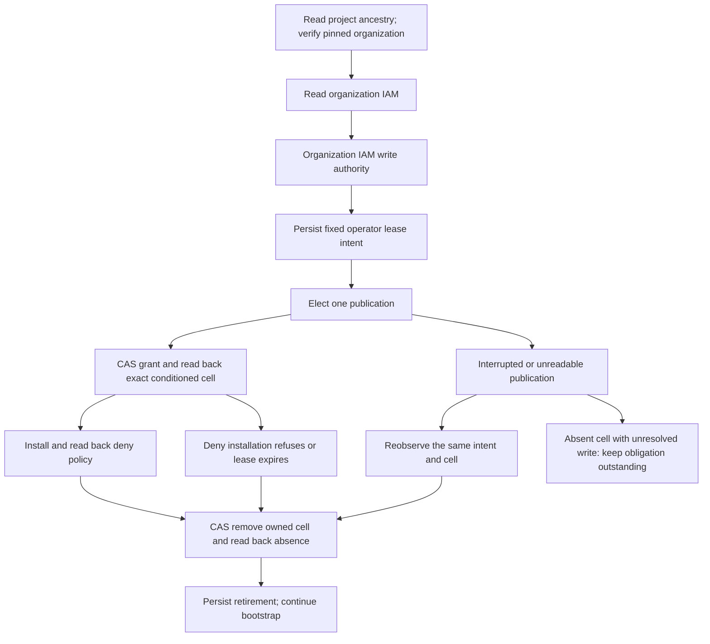

# Commission the approval-gated GCP IAM workflow

The existing `gcp_iam_converge` fleet workflow needs its own cloud identities
before it can request approval and configure other workflows. This bootstrap
commissions that foundation from the existing IAM declarations. It does not
depend on the workspace allocation branch.

## Entry points

`gunbc.auth.gcp_iam_bootstrap.iam_bootstrap_plan` prints the exact roles,
permissions, bindings, deny permissions, and workflow admission condition without
cloud effects. `iam_bootstrap_apply` uses an explicitly supplied operator token
file and a fresh receipt identity:

```bash
export GUNBC_GCP_ACCESS_TOKEN_FILE=/path/to/private/operator-token
export GUNBC_IAM_BOOTSTRAP_RECEIPT=operator-bootstrap-unique-attempt
export GUNBC_IAM_BOOTSTRAP_AUTHORITY_ID=stable-authority-operation
export GUNBC_IAM_BOOTSTRAP_AUTHORITY_EXPIRES_AT=2026-09-28T23:00:00Z # illustrative; set once for the intended operation
export GUNBC_IAM_BOOTSTRAP_PROBE_ID=stable-probe-operation
export GUNBC_IAM_BOOTSTRAP_PROBE_EXPIRES_AT=2026-09-28T23:00:00Z # illustrative; set once, at most one hour away
systemd-run --user --scope -p MemoryMax=6G -p MemorySwapMax=0 --quiet \
  ./target/release/gunbc run --source-root dag --source-root src/v2 \
  --entry dag/gunbc/auth/gcp_iam_bootstrap.dag \
  --function iam_bootstrap_apply
```

`iam_bootstrap_plan` (same roots and entry, `--function iam_bootstrap_plan`) prints the
operator-supplied intent variables the run reads; this block illustrates them.

The token file must be private and short-lived. No token belongs in a command
argument, source file, receipt, or GitHub variable. The ongoing workflow never
falls back to this operator token. No service-account key is created.

The missing deny-policy permission is a modeled dependency, not a console task.
Under the operator's explicit authorization, the organization IAM writer can publish a
time-limited `roles/iam.denyAdmin` grant to `user:brian@gunb.ai`, install the
protection policy, then remove exactly that grant. GCP documents
[Deny Admin](https://docs.cloud.google.com/iam/docs/deny-access) and
[time-limited conditional bindings](https://docs.cloud.google.com/iam/docs/managing-conditional-role-bindings).
The account used for continuing automation never receives this grant.

The operation ID and absolute UTC expiry identify one desired authority lease.
The maximum remaining duration is one hour. Retries retain both values and the
journal; they do not recalculate the expiry. A new lease requires a new explicit
intent. The current credential must be able to read/write organization IAM; if it
cannot, convergence reports that upstream dependency. This is an observed
boundary, not a declaration that organization IAM authority must forever be manual.

## What bootstrap owns

1. Observe and enable the declared APIs with independent readiness readback, then
   create or exactly read back the dedicated IAM workflow pool/provider and its
   observer/apply accounts. Create only bare pools and accounts for declared
   target federations, so resource-local administrative roles can be attached.
2. Create or exactly read back the existing four apply role definitions and
   three resource-specific observer roles plus one single-permission bootstrap probe role. Existing drift refuses adoption.
3. For an absent deny policy, converge the temporary operator authority, install
   and read back the policy, and retire the exact temporary grant. Cleanup is
   attempted on ordinary failure too; later capabilities and workflow trust require
   successful cleanup. Existing exact deny policies need no new authority grant.
4. Add declared capability bindings with policy etags, preserving foreign cells.
5. Converge a time-bounded probe grant for the verified operator on only the
   observer/apply accounts. The custom role contains only
   `iam.serviceAccounts.getAccessToken`. Check access using 600-second tokens:
   observer reads must work, and the apply account must receive HTTP 403 reading
   a credential that the observer just successfully read.
6. Remove and independently verify absence of both temporary probe grants. Cleanup
   also runs after ordinary failure and has a standalone recovery entry. Issued
   tokens retain their original 600-second lifetime; deleting a grant is not
   revocation of an already minted token.
7. Only after these checks and cleanup, add workload-identity impersonation
   bindings for the existing, pinned IAM workflow.

Target providers, workload impersonation, and target secret-access grants remain
in the existing approval-gated convergence plan. Bare target containers do not
activate those workflows. The target roster comes from `gcp_iam_converge_targets`,
including its current private-publisher and Namecheap entries; it is not copied
from the older allocation branch.

Permission probes are diagnostics, not an authorization oracle. Configuration
readback and the real observer/apply secret-read control are separate checks.
Successful bootstrap still requires a real GitHub OIDC/approval/apply run before
the ongoing workflow can be called operational.

## Recovery and evidence

Each invocation creates `target/gcp-iam-bootstrap-<receipt>-started.txt` before
effects, then a separate receipt for every attempted stage. A refusal stops
later stages. A process loss or asynchronous creation may require a new attempt
identity; it rereads named resources and their current policies. A started
receipt is not completion evidence. Existing policy drift never authorizes
automatic privilege expansion.

The existing `fleet_converge_workflow.dag` job already performs observer WIF,
request/approval, apply WIF, live approval recheck, and independent readback.
Bootstrap supplies its missing cloud prerequisites rather than adding another
approval workflow or a pasted-token path to secret consumers.

## Validation

The witness `test.claim.auth.gcp_iam_bootstrap_witness_test` is discovered and
executed by the required floor lane (`claim_executor --required-ci --required-lane
witnesses`) on every pull request and merge group that touches its closure; no
hand-assembled source root is needed. Qualification must also record
the binary hash, source revision, pure plan, missing-credential refusal, cloud
stage receipts, and a real approval-workflow run when available.

API contracts follow Google Cloud's official references for
[custom roles](https://docs.cloud.google.com/iam/docs/reference/rest/v1/projects.roles/create),
[project policy updates](https://docs.cloud.google.com/resource-manager/reference/rest/v1/projects/setIamPolicy),
[workload identity pools](https://docs.cloud.google.com/iam/docs/reference/rest/v1/projects.locations.workloadIdentityPools),
and [deny policy creation](https://docs.cloud.google.com/iam/docs/reference/rest/v2/policies/createPolicy).

## Current commissioning standing

Bootstrap completed successfully at source `85bdb4e19` on 2026-09-29. All ten
stages passed: required API readiness, identities, roles, deny protection,
temporary deny-authority cleanup, capabilities, temporary probe authority,
effective access checks, probe-authority cleanup, and workflow trust. The observer
read the pinned approval credential and the writer received exact HTTP 403 for it.
Both temporary probe grants and the earlier Deny Admin grant were verified absent.
The operator token file was removed. See
`receipts/gcp-iam-services-2026-09-29/README.md` for evidence and limitations.

The existing approval-gated workflow was then dispatched on main as run
`36505895733`. Bootstrap completion does not establish that workflow's approval
or apply acceptance, nor VM commissioning. Earlier refusal receipts remain as
historical evidence of the dependencies repaired along the way.

## Temporary-authority dependency and recovery



`target/gcp-iam-authority-<operation>-*.txt` records the exact project, organization, principal,
role, condition, and expiry before effects. Keep these records with the operator
recovery workspace; they are local bootstrap state, not yet protected fabric
storage. Intent drift or unreadable records refuse. A create-only election means
at most one grant request is issued for this operation, even across retries.
An acknowledged successful publication or a grant observed present closes that publication; cleanup can recover a crash
between removal and recording retirement. A definitive publication HTTP 4xx also
closes the no-effect attempt. Other unresolved write outcomes remain outstanding
when a read sees absence. Neither a timeout nor expiry proves physical cleanup.
The cloud condition independently bounds effective access after process loss.

The shared policy reconciler preserves unrelated grants and conditions, uses
version 3, and requires etags. Cleanup owns only the exact conditioned cell;
unconditional pre-existing administrator access survives. A retired operation
cannot publish again. `iam_bootstrap_authority_cleanup` drives withdrawal alone,
using the same authority ID, expiry, journal, and operator token-file input.

The downstream account-impersonation readback still requires its actual authority.
That is a separate dependency to classify when reached, not permission to invent
an approval or give the continuing workflow self-elevation rights.


### Role grant scope correction

The first dependency attempt was rejected with HTTP 400 because Deny Admin cannot
be granted on a project. The current model uses the role's documented
[organization-only grant scope](https://docs.cloud.google.com/iam/docs/roles-permissions/iam#iam.denyAdmin).
A read-only Resource Manager observation established that active
`projects/582015116396` (`gunbai-secrets`) belongs to
`organizations/266638272282`. The authority declaration pins that organization;
publication rereads the project and follows validated folder parents, refusing
unknown, changed, cyclic, or incomplete ancestry. No project move or organization
creation is inferred from missing ancestry.

This temporary role is organization-scoped and time-limited; it is not represented
as project-scoped access. Only the named human operator receives it. The modeled
actuator still installs only the exact project deny policy. Cleanup addresses the
pinned organization even if the project later moves. These local journals support
one shared operator recovery workspace; they are not a distributed election across
independent workspaces or hosts. The original project-level attempt was rejected,
not an effective grant, and its historical receipt remains preserved.


A newly read-back authority binding may not yet be effective. Deny installation
permits at most 30 attempts separated by ten seconds, only after an explicit HTTP
403 and while the original lease remains live. Transport/server faults are not
retried as if nothing committed. An accepted create is followed by at most seven
readbacks separated by ten seconds, with no additional creation request. Exhaustion
or clock/deadline refusal enters the same authority cleanup obligation.


Before publishing temporary authority, the native Google UserInfo operation must
establish subject `116084671989231734979` (previously confirmed by the operator),
verified email, and the pinned IAM member `user:brian@gunb.ai`. Live UserInfo readback
identified this primary email; the earlier `briansrls@gunb.ai` spelling is not used
as the authority identity. A different subject with the same email, missing claims,
or changed transport email refuses publication. Cleanup does not require the old
operator credential's identity: an authorized recovery credential may remove the
already-pinned exact cell. No access token is put in a URL or command argument.

## Exclusive initialization of an empty pool policy

On 2026-09-29 the operator confirmed that no other administrator will update
these pool policies during bootstrap. This supplies an operational exclusivity
assumption, not a provider-enforced CAS token. Normal policy updates still require
an observed nonempty etag.

The one-off initializer is limited to pool resources already derived by
`iam_bootstrap_capability_bindings`: `github-heal-publisher`,
`github-heal-publisher-private`, `github-mtcollins1-boot`,
`github-namecheap-dns`, and `github-gcp-iam-converge`. Each initial policy contains
all and only that pool's declared capability cells. The last pool receives
observer capability only; the apply principal cannot administer its own trust.
It does not install target OIDC providers or account impersonation grants.

An invocation must explicitly select the confirmed window using
`GUNBC_IAM_BOOTSTRAP_POOL_WINDOW=exclusive-pool-policy-initialization-20260929`.
The native initializer verifies the same stable Google administrator identity,
requires an empty policy without a revision, elects one publication through a
create-only local journal, and performs independent readback. Completion requires
exact declared cells and a returned revision before later CAS updates are allowed.
A failed or ambiguous write retains the journal and cannot issue another
unconditional request. Recovery can close it only after matching readback.
Keep the same journal workspace across retries; do not delete election records or
run independent copies. The operator's exclusive window must still be in force
at actual execution. This is not a standing permission for future initializations.

This slice has not been applied to Google yet. An approval receipt does not
create an administrator credential. The normal `gcp-iam-converge` workflow first
federates as `iam-observe`, files its request, and only after approval federates as
`iam-converge`. Both trust grants are deliberately the final bootstrap stage.
Consequently that workflow cannot bootstrap its own initial trust. An existing
administrator credential is a remaining explicit dependency; this environment
has neither gcloud nor a configured readable GCP token file. No credential or
refresh token is stored in these sources or receipts.


## Temporary probe authority

The live pool run completed all capability grants, then the administrator token
received HTTP 403 for `iam.serviceAccounts.getAccessToken` on `iam-converge`.
That is now another explicit bootstrap dependency, not a console instruction.
`GUNBC_IAM_BOOTSTRAP_PROBE_ID` and `GUNBC_IAM_BOOTSTRAP_PROBE_EXPIRES_AT` pin its
operation and deadline, at most one hour away. The two exact-account conditional
grants name the verified human identity. They share the deny authority's journal,
publication election, etag update and cleanup machinery. No signing, key-creation,
policy-write or project-wide impersonation permission is included.

Google documents the [access-token permission](https://docs.cloud.google.com/iam/docs/service-account-permissions).
Permission propagation retries accept only explicit HTTP 403, at most 85 attempts
with five-second waits (seven minutes of waiting), and stop at the original deadline. Other failures are not
converted to propagation. `iam_bootstrap_probe_cleanup` can recover both exact
grants without rerunning bootstrap; keep its journal and original environment.
Trust requires cleanup success. A retired probe operation cannot grant again.

The first probe lease was removed after 30 token-mint refusals over roughly one
minute. That did not establish a permission-design defect: Google documents policy
propagation as typically two minutes, potentially seven or longer. The bounded
retry now permits seven minutes within the original lease; no role is widened.

### Re-running after an interrupted probe-authority stage

The probe stage first reads back the operator identity, and only then does
`iam_bootstrap_cell_authority_reconcile` pin an intent or elect a publication. A run that
stops inside that readback therefore leaves no `gcp-iam-probe-*` journal and no grant.
Re-run with a fresh `GUNBC_IAM_BOOTSTRAP_RECEIPT` (the started receipt is create-only):
earlier stages read back and adopt what exists (the deny stage elects no temporary
authority when its policy already reads back), and the probe stage elects fresh under
the same or a new probe intent. Any `gcp-iam-probe-*` or `gcp-iam-authority-*` journal
that does exist must be kept with its original environment, as above.
