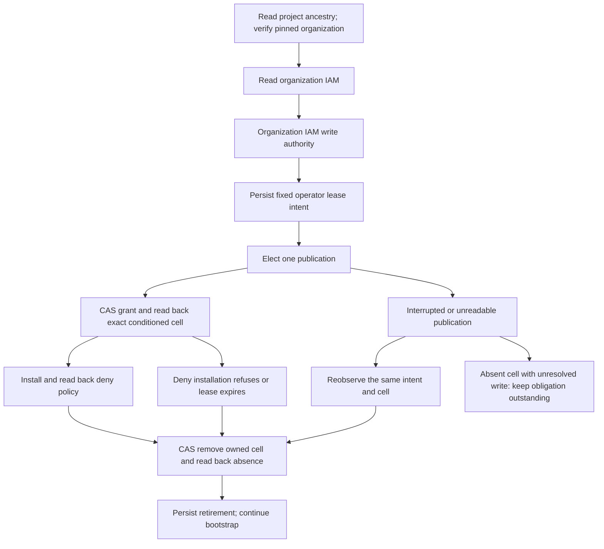

# Commission the approval-gated GCP IAM workflow

The existing `gcp_iam_converge` fleet workflow needs its own cloud identities
before it can request approval and configure other workflows. This bootstrap
commissions that foundation from the existing IAM declarations. It does not
depend on the workspace allocation branch.

## Entry points

`gunbc.auth.gcp_iam_bootstrap.iam_bootstrap_plan` prints the exact roles,
permissions, bindings, deny permissions, and workflow admission condition without
cloud effects. `iam_bootstrap_apply` uses an explicitly supplied operator token
file and a fresh receipt identity:

```bash
export GUNBC_GCP_ACCESS_TOKEN_FILE=/path/to/private/operator-token
export GUNBC_IAM_BOOTSTRAP_RECEIPT=operator-bootstrap-unique-attempt
export GUNBC_IAM_BOOTSTRAP_AUTHORITY_ID=stable-authority-operation
export GUNBC_IAM_BOOTSTRAP_AUTHORITY_EXPIRES_AT=2026-09-28T23:00:00Z # illustrative; set once for the intended operation
systemd-run --user --scope -p MemoryMax=6G -p MemorySwapMax=0 --quiet \
  ./target/release/gunbc run --source-root target/iam-bootstrap-controls \
  --entry target/iam-bootstrap-controls/gunbc.auth.gcp_iam_bootstrap.dag \
  --function iam_bootstrap_apply
```

The token file must be private and short-lived. No token belongs in a command
argument, source file, receipt, or GitHub variable. The ongoing workflow never
falls back to this operator token. No service-account key is created.

The missing deny-policy permission is a modeled dependency, not a console task.
Under the operator's explicit authorization, the organization IAM writer can publish a
time-limited `roles/iam.denyAdmin` grant to `user:briansrls@gunb.ai`, install the
protection policy, then remove exactly that grant. GCP documents
[Deny Admin](https://docs.cloud.google.com/iam/docs/deny-access) and
[time-limited conditional bindings](https://docs.cloud.google.com/iam/docs/managing-conditional-role-bindings).
The account used for continuing automation never receives this grant.

The operation ID and absolute UTC expiry identify one desired authority lease.
The maximum remaining duration is one hour. Retries retain both values and the
journal; they do not recalculate the expiry. A new lease requires a new explicit
intent. The current credential must be able to read/write organization IAM; if it
cannot, convergence reports that upstream dependency. This is an observed
boundary, not a declaration that organization IAM authority must forever be manual.

## What bootstrap owns

1. Create or exactly read back the dedicated IAM workflow pool/provider and its
   observer/apply accounts. Create only bare pools and accounts for declared
   target federations, so resource-local administrative roles can be attached.
2. Create or exactly read back the existing four apply role definitions and
   three resource-specific observer roles. Existing drift refuses adoption.
3. For an absent deny policy, converge the temporary operator authority, install
   and read back the policy, and retire the exact temporary grant. Cleanup is
   attempted on ordinary failure too; later capabilities and workflow trust require
   successful cleanup. Existing exact deny policies need no new authority grant.
4. Add declared capability bindings with policy etags, preserving foreign cells.
5. Check access using short-lived impersonated observer/apply credentials. The
   operator must already have impersonation authority; bootstrap does not grant
   that authority to itself. Observer reads must work, and the apply account must
   receive HTTP 403 reading a credential that the observer just successfully read.
6. Only after these checks, add workload-identity impersonation bindings for the
   existing, pinned IAM workflow.

Target providers, workload impersonation, and target secret-access grants remain
in the existing approval-gated convergence plan. Bare target containers do not
activate those workflows. The target roster comes from `gcp_iam_converge_targets`,
including its current private-publisher and Namecheap entries; it is not copied
from the older allocation branch.

Permission probes are diagnostics, not an authorization oracle. Configuration
readback and the real observer/apply secret-read control are separate checks.
Successful bootstrap still requires a real GitHub OIDC/approval/apply run before
the ongoing workflow can be called operational.

## Recovery and evidence

Each invocation creates `target/gcp-iam-bootstrap-<receipt>-started.txt` before
effects, then a separate receipt for every attempted stage. A refusal stops
later stages. A process loss or asynchronous creation may require a new attempt
identity; it rereads named resources and their current policies. A started
receipt is not completion evidence. Existing policy drift never authorizes
automatic privilege expansion.

The existing `fleet_converge_workflow.dag` job already performs observer WIF,
request/approval, apply WIF, live approval recheck, and independent readback.
Bootstrap supplies its missing cloud prerequisites rather than adding another
approval workflow or a pasted-token path to secret consumers.

## Validation

Build the branch's own release binary under the same 6 GiB/no-swap scope. The
closure helper copies sources byte for byte and records their hashes:

```bash
python3 tools/tests/dag_validation_closure.py --output target/iam-bootstrap-controls \
  test.claim.auth.gcp_iam_bootstrap_witness_test \
  gunbc.bmc_onboarding gunbc.host_converge gunbc.host_effect \
  gunbc.os_install_deduction gunbc.network_identity_subsumption \
  gunbc.srv3_os_install_diagnostic
systemd-run --user --scope -p MemoryMax=6G -p MemorySwapMax=0 --quiet \
  ./target/release/gunbc run --source-root target/iam-bootstrap-controls \
  --entry target/iam-bootstrap-controls/test.claim.auth.gcp_iam_bootstrap_witness_test.dag \
  --claim-run
```

The additional modules resolve existing admitted-caller references. This focused
closure is not the full repository landing suite. Qualification must also record
the binary hash, source revision, pure plan, missing-credential refusal, cloud
stage receipts, and a real approval-workflow run when available.

API contracts follow Google Cloud's official references for
[custom roles](https://docs.cloud.google.com/iam/docs/reference/rest/v1/projects.roles/create),
[project policy updates](https://docs.cloud.google.com/resource-manager/reference/rest/v1/projects/setIamPolicy),
[workload identity pools](https://docs.cloud.google.com/iam/docs/reference/rest/v1/projects.locations.workloadIdentityPools),
and [deny policy creation](https://docs.cloud.google.com/iam/docs/reference/rest/v2/policies/createPolicy).

## Current commissioning standing

The 2026-09-28 run completed identity and exact custom-role readback, then GCP
refused deny-policy creation with HTTP 403, `iam.denypolicies.create` missing.
Capability bindings, account-context probes, and workflow-trust grants were not
reached. See `receipts/gcp-iam-bootstrap-2026-09-28/README.md` for that historical
standing. The new dependency slice can obtain temporary deny authority through
organization IAM convergence. Its own receipts must establish the grant, use, and
cleanup before commissioning can be called complete.

## Temporary-authority dependency and recovery



`target/gcp-iam-authority-<operation>-*.txt` records the exact project, organization, principal,
role, condition, and expiry before effects. Keep these records with the operator
recovery workspace; they are local bootstrap state, not yet protected fabric
storage. Intent drift or unreadable records refuse. A create-only election means
at most one grant request is issued for this operation, even across retries.
An acknowledged successful publication or a grant observed present closes that publication; cleanup can recover a crash
between removal and recording retirement. A definitive publication HTTP 4xx also
closes the no-effect attempt. Other unresolved write outcomes remain outstanding
when a read sees absence. Neither a timeout nor expiry proves physical cleanup.
The cloud condition independently bounds effective access after process loss.

The shared policy reconciler preserves unrelated grants and conditions, uses
version 3, and requires etags. Cleanup owns only the exact conditioned cell;
unconditional pre-existing administrator access survives. A retired operation
cannot publish again. `iam_bootstrap_authority_cleanup` drives withdrawal alone,
using the same authority ID, expiry, journal, and operator token-file input.

The downstream account-impersonation readback still requires its actual authority.
That is a separate dependency to classify when reached, not permission to invent
an approval or give the continuing workflow self-elevation rights.


### Role grant scope correction

The first dependency attempt was rejected with HTTP 400 because Deny Admin cannot
be granted on a project. The current model uses the role's documented
[organization-only grant scope](https://docs.cloud.google.com/iam/docs/roles-permissions/iam#iam.denyAdmin).
A read-only Resource Manager observation established that active
`projects/582015116396` (`gunbai-secrets`) belongs to
`organizations/266638272282`. The authority declaration pins that organization;
publication rereads the project and follows validated folder parents, refusing
unknown, changed, cyclic, or incomplete ancestry. No project move or organization
creation is inferred from missing ancestry.

This temporary role is organization-scoped and time-limited; it is not represented
as project-scoped access. Only the named human operator receives it. The modeled
actuator still installs only the exact project deny policy. Cleanup addresses the
pinned organization even if the project later moves. These local journals support
one shared operator recovery workspace; they are not a distributed election across
independent workspaces or hosts. The original project-level attempt was rejected,
not an effective grant, and its historical receipt remains preserved.


A newly read-back authority binding may not yet be effective. Deny installation
permits at most 30 attempts separated by ten seconds, only after an explicit HTTP
403 and while the original lease remains live. Transport/server faults are not
retried as if nothing committed. An accepted create is followed by at most seven
readbacks separated by ten seconds, with no additional creation request. Exhaustion
or clock/deadline refusal enters the same authority cleanup obligation.
