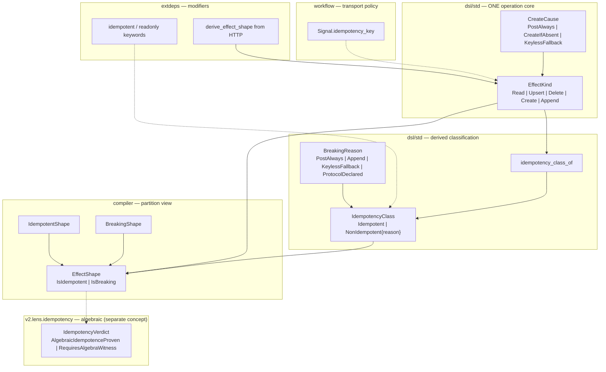

# Idempotency mechanism — design proposal (§3 / §4 / §5)

> **Status: DESIGN-ONLY — awaiting operator shape-sign.** No `std/` or `lens/` authoring, no `idempotent` keyword changes, no consumer migration until signed.
> Lane: `effects` grounding-cluster unification (`dsl-v2-defork-audit` row) + `v2.lens.idempotency` construction path.
> DESIGN refs: §2 (horizontal — one effect kernel, operation + idempotency readings; deep — ground `BreakingReason` atoms), §3 (single authority vs dsl/v2 `EffectShape` axis fork; service `idempotent` modifier vs compiler carrier), §4 (idempotency dissolved from `idempotent: Bool` into variant inhabitance), §5 (construction over `is_idempotent_effect` validation), §6 (priced in displaced cost — silent double-init, modifier drift, de-fork blocker), §7 (signature-derived classification dissolves the lens residue).
>
> Every unresolved item is either a **decided-with-rationale** entry (§8) or one of **two genuine operator FLAGS**.

---

## 0. The one-sentence claim

> **Effect idempotency is an inhabitance classification on `EffectKind`, not a parallel `Bool` flag or a second type fork.** `EffectKind` (operation semantics — read/upsert/delete/create/append) is the single `dsl/std` authority; `IdempotencyClass = Idempotent | NonIdempotent { reason: BreakingReason }` is **derived** from `EffectKind` by a closed algebra (`idempotency_class_of`); `EffectShape` in the compiler layer is the §4 grounding that makes non-idempotent shapes **uninhabitable in idempotent positions** (the `IsIdempotent(_)` / `IsBreaking(_)` partition is a view of that derivation, not a competing axis). Service operation modifiers (`idempotent`, `readonly`) **project** from the derived class; workflow dedup keys (`idempotency_key`) are orthogonal transport policy (§3c), not effect algebra.

Three **distinct** idempotency concepts exist in the corpus today and must not be nicknamed into one:

| concept | home (today) | meaning |
| --- | --- | --- |
| **Effect idempotency** | `dsl/std/effects`, `v2/std/effects` | HTTP/service ops: `f(f(x)) = f(x)` by effect kind |
| **Algebraic idempotency** | `v2.lens.idempotency` | Dependency-graph edges: idempotent/cancellation laws on composed effects |
| **Round-trip idempotency** | emit/ingest tests | `parse ∘ emit = id` — serialization law, not effect algebra |

This design covers **Effect idempotency** (the de-fork blocker). Algebraic idempotency is named and sequenced as a **downstream consumer** of the unified `EffectShape` carrier, not merged into it.

---

## 1. The pain (displaced cost — §6)

Four symptoms today, one root: **the effect model is forked on two axes and idempotency is still partially a `Bool`.**

| Symptom | where it lives | what it costs |
| --- | --- | --- |
| **dsl/v2 `EffectShape` body diverges** | `dsl/std/effects.dag` vs `src/v2/std/effects.dag` | De-fork blocked — repoint breaks consumers; `dsl-v2-defork-audit` holds `effects` in grounding cluster (#5511) |
| **`idempotent: Bool` residue** | `check_modifier_vs_derivation`, GCP `operation` modifiers, `IdempotencyEvidence` + `is_idempotent_effect` | Second representation (§5) — spec can declare idempotent while derivation says breaking; agreement is post-hoc validation |
| **v2 idempotency-class without dsl operation authority** | v2 `IsIdempotent`/`IsBreaking` wrapper, node projections, testgen | Compiler models idempotency but cannot derive HTTP shapes — parallel type bodies |
| **Lens advisory forever** | `v2.lens.idempotency` → `RequiresAlgebraWitness` on all `EffectDependsOn` | §6 coverage-by-illusion until signature-derived facts land (#3468 bundle); no construction wall on non-idempotent composition |

The mechanism's job is not to replace `idempotency_contract` or generated `idempotent_operation` floor witnesses — it **grounds** them on one authority so de-fork, modifier checks, and the lens dissolve together.

---

## 2. Authority map (do not fork — §3)

### 2.0 One core, two refinements (resolving the dsl/v2 axis fork)

The `DeterminismAxis` analog applies: **one shared operation core + idempotency derivation + compiler partition view**, not two independent `EffectShape` enums.

**The hidden fork to avoid:** `dsl/std/effects.EffectShape` (operation-kind flat enum) and `v2/std/effects.EffectShape` (idempotency-class wrapper) as parallel top-level authorities with the same name and incompatible bodies. That fails the rename test and blocks Root B repoints (`roadmap_authority` `5-root-b`).

**Adopted decomposition (§2-deep):**

```dag
// ONE core authority (home: dsl/std — universal REST/HTTP effect semantics)
type EffectKind
  = ReadEffect
  | UpsertEffect { key_source: KeySource }
  | DeleteEffect { key_source: KeySource }
  | CreateEffect { cause: CreateCause }   // PostAlways | CreateIfAbsent | KeylessFallback
  | AppendEffect

type CreateCause
  = PostAlways
  | CreateIfAbsent { key_source: KeySource }
  | KeylessFallback { method: Symbol }    // v2-only today; merge into dsl CreateCause

type BreakingReason
  = PostAlways
  | AppendAccumulates
  | KeylessFallback { method: Symbol }
  | ProtocolDeclared { note: String }       // modifier/spec override path — see D2

// Derived — NOT a Bool flag
type IdempotencyClass
  = Idempotent
  | NonIdempotent { reason: BreakingReason }

fn idempotency_class_of(kind: EffectKind) -> IdempotencyClass { ... }
fn effect_kind_from_http(method: HttpMethod, path: PathTemplate) -> EffectKind { ... }
// subsumes dsl derive_effect_shape
```

```dag
// Compiler refinement (home: dsl/std or v2/std after de-fork — ONE partition view)
type EffectShape
  = IsIdempotent(IdempotentShape)
  | IsBreaking(BreakingShape)

// Bijection: IdempotentShape ↔ {Read, Upsert, Delete, CreateIfAbsent}
// Bijection: BreakingShape ↔ {Create(PostAlways|KeylessFallback), Append}
fn effect_shape_from_kind(kind: EffectKind) -> EffectShape { ... }
fn effect_kind_from_shape(shape: EffectShape) -> EffectKind { ... }
```

| layer | type | relationship to core |
| --- | --- | --- |
| `dsl/std` | `EffectKind`, `CreateCause`, `KeySource` | **the** operation authority |
| `dsl/std` | `IdempotencyClass`, `idempotency_class_of` | **derived** classification — replaces `is_idempotent_effect: Bool` + `IdempotencyEvidence` parallel enum |
| compiler std | `EffectShape` partition | **view** of `EffectKind` through idempotency class — §4 "dissolved from Bool into variant" |
| `extdeps` service decl | `idempotent` / `readonly` modifiers | **project** from `idempotency_class_of(derived_kind)` — §3c workflow policy stays upstream |
| `gunbc/workflow` | `Signal.idempotency_key` | **orthogonal** — dedup/lease transport, not `EffectKind` |



### 2.1 `dsl/std/effects` — **operation + derivation authority**

- **Granularity:** per REST operation (`method` + `path` → `EffectKind`).
- **Carries:** `derive_op_effect`, `compose_effects`, `create_double_init_collapsible`, `generate_idempotency_obligations`.
- **Dissolves:** `is_idempotent_effect(shape) -> Bool` → `idempotency_class_of(kind) -> IdempotencyClass`.
- **Dissolves:** `IdempotencyEvidence` (`LatticeEffect` / `IdentityEffect` / `NonIdempotent`) → `IdempotencyClass` (one classification enum; evidence is witness data, not a parallel type).

### 2.2 `v2/std/effects` — **compiler partition + node projection**

- **Today:** idempotency-class-primary `EffectShape` + 74 lines of node projection + testgen samples.
- **After sign:** delete v2 duplicate; import unified `dsl/std/effects`; retain **only** node-projection helpers until emit ingests them from authority (or move projections to `v2.compiler.*` as realization).
- **Witness data** (`witness_create_if_absent_cause_is_idempotent`) stays — proves the algebra, not a second type.

### 2.3 `v2.lens.idempotency` — **algebraic law residue (separate concept)**

- **Granularity:** per `DependencyView` edge in `InferredTree`.
- **Verdict:** `AlgebraicIdempotenceProven { law }` | `RequiresAlgebraWitness`.
- **NOT** an `EffectShape` check — it asks whether composed effect dependencies satisfy the idempotent/cancellation algebra.
- **Construction justification (existing):** `WallAfterGrounding { dissolves_to: SingleAuthority }` — dissolves when redundant ops collapse structurally by algebra law (#3468 / infer-derived signature facts).
- **Sequencing:** P4+ after `EffectShape` unified — lens consumes derived facts, does not define them.

### 2.4 Service `idempotent` keyword — **spec modifier, not the carrier**

- Parsed in `dsl/extdeps/languages/dag/syntax.dag` keyword set; used on GCP operations (`gcp.dag`, `iam.dag`, …).
- **§3c:** business policy ("this POST is idempotent because the upstream spec says so") stays at the service/workflow boundary.
- **Projection rule:** `declared_idempotent` modifier ⇔ `idempotency_class_of(derived_kind) == Idempotent` **or** `BreakingReason.ProtocolDeclared` with cited upstream authority — never a bare `Bool` stored as the fact.

### 2.5 `Signal.idempotency_key` — **workflow dedup (orthogonal)**

- `gunbc/workflow/types.dag` — event dedup/lease key for orchestration signals.
- **No image** in `EffectKind` or `IdempotencyClass`. Naming collision only; do not merge.

---

## 3. Grounding the `BreakingReason` atoms (deep decomposition — §2)

| `BreakingReason` | grounded upstream | examples | decidable? |
| --- | --- | --- | --- |
| `PostAlways` | HTTP POST semantics (non-safe methods) | `POST /tokens` without create-if-absent key | **yes** |
| `AppendAccumulates` | monoid append without identity collapse | log append, list snoc chains | **yes** |
| `KeylessFallback` | method + path derives create without key | `DELETE` collection endpoint → `CreateEffect` fallback | **yes** |
| `ProtocolDeclared` | upstream API spec override | OAuth refresh `idempotent` on POST | **yes** with cited `ExternalAuthority` |

**Decided (not an operator FLAG):** `CreateIfAbsent` with matching `KeySource` is `Idempotent` — `create_double_init_collapsible` is the composition law witness (already in both trees).

---

## 4. The mechanism (construction-first — §5)

### 4.1 Target algebra (mirror determinism + existing witnesses)

Four layers (after shape-sign), same pattern as `v2.std.determinism` proposal and live `idempotency_contract`:

1. **Closed classifiers** — `idempotency_class_of(kind: EffectKind)`.
2. **Composition rules** — `compose_effects`, `create_double_init_collapsible` (already live in dsl).
3. **Witness data** — `witness_*` rows + `idempotency_contract` impossible-bug claims + testgen `f(f(x))==f(x)`.
4. **Position gate** — non-idempotent `EffectKind` **uninhabitable** in idempotent position (construction, not `is_idempotent_effect` grep).

```dag
// SKETCH ONLY — not authored until operator sign-off

fn idempotency_class_of(kind: EffectKind) -> IdempotencyClass {
  match kind {
    ReadEffect => Idempotent
    UpsertEffect { key_source: _ } => Idempotent
    DeleteEffect { key_source: _ } => Idempotent
    CreateEffect { cause: CreateIfAbsent { key_source: _ } } => Idempotent
    CreateEffect { cause: PostAlways } => NonIdempotent { reason: PostAlways }
    CreateEffect { cause: KeylessFallback { method: m } } => NonIdempotent { reason: KeylessFallback { method: m } }
    AppendEffect => NonIdempotent { reason: AppendAccumulates }
  }
}

fn compose_idempotency_class(a: IdempotencyClass, b: IdempotencyClass) -> IdempotencyClass {
  // first NonIdempotent wins; Idempotent ⊗ Idempotent → Idempotent
}
```

**Composition law (proposed):**

- `Idempotent ⊗ Idempotent → Idempotent`
- `NonIdempotent { r } ⊗ _ → NonIdempotent { r }`
- Breaking ⊗ Idempotent → Breaking (left-biased; diagnostic carries full reason list — same as determinism D1)

### 4.2 Where facts are computed (pipeline placement)

| Stage | responsibility |
| --- | --- |
| **Primitive roster** (`dsl/std/effects`) | `EffectKind` + `idempotency_class_of` + HTTP derivation |
| **extdeps authoring** | `idempotent`/`readonly` modifiers checked via `check_modifier_vs_derivation` (refactored to return `IdempotencyClass` disagreement, not `Bool`) |
| **Infer** (`04_infer`, #3468 bundle) | attach `IdempotencyClass` per effect dependency edge; feed `v2.lens.idempotency` |
| **Lens** (interim) | `RequiresAlgebraWitness` until infer derives; then construction subsumes |
| **Workflow** | `idempotency_key` on `Signal` — unchanged, separate concern |

**Operator FLAG (genuine):** exact `InferredFacts` extension — bundle with #3468 vs side-map (see §8 FLAG 1). **Recommend bundle** — same seam as determinism.

### 4.3 Modifier check refactor (dissolve `Bool`)

Today `check_modifier_vs_derivation(op, declared_idempotent: Bool, ...)` returns `ModifierAgreement`. After sign:

```dag
fn check_modifier_vs_derived_class(
  op: DerivedOpEffect,
  declared: OperationModifiers   // { idempotent: Bool, readonly: Bool } — surface only
) -> ModifierCheck {
  let derived = idempotency_class_of(kind: op.kind)
  // Agrees | Disagrees { derived, declared } | DerivationUnknown { ... PostAlways + declared idempotent ... }
}
```

`DerivationUnknown` is the honest residue for POST-without-key + spec-declared-idempotent — requires `BreakingReason.ProtocolDeclared` with citation, not silent `Agrees`.

### 4.4 Lens shape (interim — existing `v2.lens.idempotency`)

No new lens module for effect idempotency — the **construction wall** is `EffectShape` inhabitance + infer-derived classes. Existing lens stays for **algebraic** idempotence on dependency graphs until #3468.

---

## 5. Relationship to existing gates and witnesses

### 5.1 `idempotency_contract` (impossible-bug)

- GREEN: idempotent shape in idempotent position.
- RED: `^impossible_bug_reason_idempotency_violation`, `^impossible_bug_reason_idempotency_repetition`.
- **After sign:** contract body references unified `EffectShape` / `EffectKind` — no semantic change, import path change only.

### 5.2 Generated `idempotent_operation` conformance (floor #5434)

- `testgen_emit_idempotent_operation_claim` + 4 composable samples.
- **Skips** `LabelOnlyIdempotentInhabitance` with `^idempotent_operation_tautology_skip` — the discriminating control (label without composable body rejected).
- **After sign:** samples import unified authority; testgen stays in `v2.lens.testgen`.

### 5.3 `lens_idempotency_family_eval` (advisory roster)

- `write_effect` receipt: `EffectDependsOn` → `RequiresAlgebraWitness`.
- **Not** effect-shape idempotency — do not conflate in migration census.

### 5.4 v1 `effects.rs` integration tests (~48 refs)

- Seed tests for `compose_effects`, `generate_idempotency_obligations`, GCP site classification.
- **Migration:** floor `*_test.dag` witnesses before v1 test delete (seed-shrink census §5 rule).

---

## 6. Phasing (operator shape-sign → execution)

| Phase | deliverable | consumer | gate |
| --- | --- | --- | --- |
| **P0** (now) | this design + census | operator shape-sign | — |
| **P1** | unify `EffectKind` + `IdempotencyClass` in `dsl/std/effects`; add `KeylessFallback` to dsl `CreateCause`; witness data | `idempotency_contract`, dsl tests | compile-clean |
| **P2** | delete `v2/std/effects` duplicate; repoint v2 consumers to `dsl/std/effects`; move node projections | testgen, generated conformance | floor green |
| **P3** | refactor `check_modifier_vs_derivation` to `IdempotencyClass`; wire GCP modifier checks | extdeps GCP ops | fail-closed on Disagrees |
| **P4** | infer-derived `IdempotencyClass` on effect edges (#3468); lens reads facts | `v2.lens.idempotency` | lens advisory → construction |
| **P5** | v1 `effects.rs` tests → `*_test.dag`; delete v1 mirror | seed-shrink Chunk effects | per-module gate |

**MVP discriminating witness (required by §5):**

- **GREEN:** `idempotency_class_of(ReadEffect) == Idempotent` and `create_double_init_collapsible(CreateIfAbsent{k1}, CreateIfAbsent{k2})` when `k1 == k2`.
- **RED:** `idempotency_class_of(AppendEffect) == NonIdempotent { AppendAccumulates }`.
- **RED:** `LabelOnlyIdempotentInhabitance` → `^idempotent_operation_tautology_skip` (already green).
- **RED:** non-idempotent kind in idempotent position → `^impossible_bug_reason_idempotency_violation` (already green).

---

## 7. What this is NOT (purity-trap guards — §6)

- **Not a merge of three idempotency concepts.** Effect / algebraic / round-trip stay named; only effect algebra unifies.
- **Not a new `idempotent` keyword.** Keyword exists; this design refactors what it **means** (projection from derived class).
- **Not workflow `idempotency_key` modeling.** Transport dedup stays in `gunbc/workflow`.
- **Not v1-seed cement.** v1 `std_effects.rs` mirror dissolves with de-fork; no new Rust validation.
- **Not "pick v2 axis over dsl axis."** Operation kind is core; idempotency class is derived + partition view — both preserved, neither forked.
- **Not implement-before-sign.** Same gate as Path-Y / determinism #5937.

---

## 8. Operator decisions

### Decided (with rationale — not open for operator call)

**D1 — Source-merge when composition leaks different reasons.** `compose_idempotency_class` is **left-biased**; diagnostic carries **full reason list**. Do not grow `BreakingReason` for combinations. *Rationale: same as determinism D1 — atoms grounded, combinations are diagnostic richness.*

**D2 — `ProtocolDeclared` is the only honest escape for spec-declared POST idempotency.** `DerivationUnknown` in modifier checks becomes `NonIdempotent { ProtocolDeclared { note } }` **with citation**, or `Idempotent` when upstream authority is cited. Bare `declared_idempotent: Bool` without derivation path is **unwritable** after P3. *Rationale: §3c — business policy at workflow/extdeps boundary, not a Bool in std.*

**D3 — `EffectShape` partition is a view, not a second authority.** `effect_shape_from_kind` / `effect_kind_from_shape` are total bijections on the closed enum. v2's `IsIdempotent`/`IsBreaking` wrapper survives as syntax for position gates, not as a separate type body. *Rationale: §4 DESIGN citation — Bool dissolved into variant, not replaced by parallel enum.*

**D4 — P1 self-test before v2 de-fork delete.** Witness rows in `dsl/std/effects` before deleting `v2/std/effects.dag`. *Rationale: §6 inert-carrier hygiene (determinism D3 analog).*

### Genuine operator FLAGS (2 only)

**FLAG 1 — `InferredFacts` seam architecture (#3468 bundle).**
- **Decision:** bundle effect idempotency class with the #3468 signature-derived facts block (effect + ownership + determinism + idempotency) vs a separate side-map.
- **Options:** (A) one bundled extension; (B) parallel `idempotency_class_facts` map.
- **Recommendation: A** — one signature-derived authority block; algebraic lens consumes the same facts. *Shared-seam call — coordinate with determinism FLAG 1 (same operator session).*

**FLAG 2 — `EffectKind` vs `EffectShape` naming at de-fork collapse.**
- **Decision:** after unification, does the exported type name stay `EffectShape` (compiler partition view, breaking v1/dsl importers) or `EffectKind` (operation core, with `EffectShape` as derived alias)?
- **Options:** (A) rename dsl flat enum to `EffectKind`; `EffectShape` = partition view only in compiler modules; (B) keep `EffectShape` as the dsl export name and nest idempotency inside each variant (larger blast radius on v1 seed).
- **Recommendation: A** — honest §2-deep decomposition; v1 seed changes are scheduled deletion anyway (seed-shrink). *Touches extdeps derivation + v1 mirror + v2 testgen — operator signs sequencing with jolly-cat-29 emitter lane.*

---

## 9. Dissolution trigger (DESIGN §6)

Delete or fold this doc when:

1. `dsl/std/effects` is the single `EffectKind` + `IdempotencyClass` authority with green witness claims;
2. `v2/std/effects.dag` duplicate is deleted and all v2 consumers import dsl;
3. `is_idempotent_effect: Bool` and `IdempotencyEvidence` are dissolved;
4. `v2.lens.idempotency` reads infer-derived classes (#3468) and `RequiresAlgebraWitness` is dead for classified edges;
5. `dsl-v2-defork-audit` `effects` row moves from grounding cluster to mechanical repoint complete.

Until operator shape-sign on §4–§6 and FLAG 1–2, **no `std/` or `lens/` edits, no keyword changes, no consumer migration** — this document and the census are the sole artifacts.
