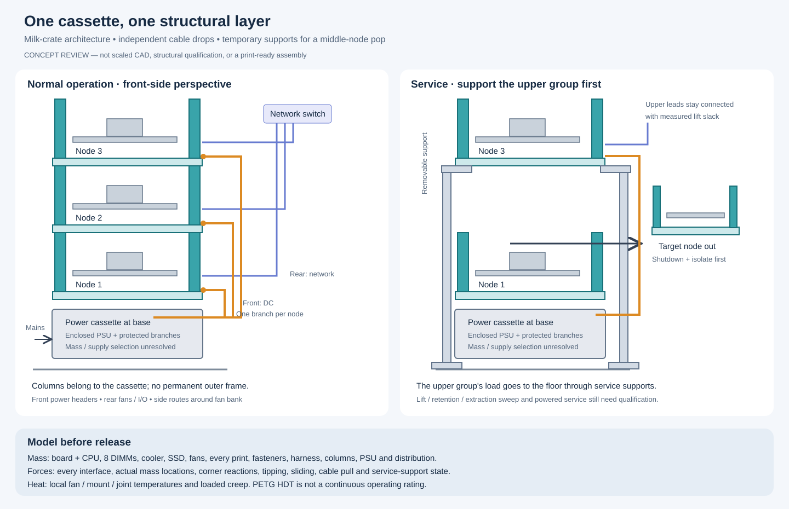
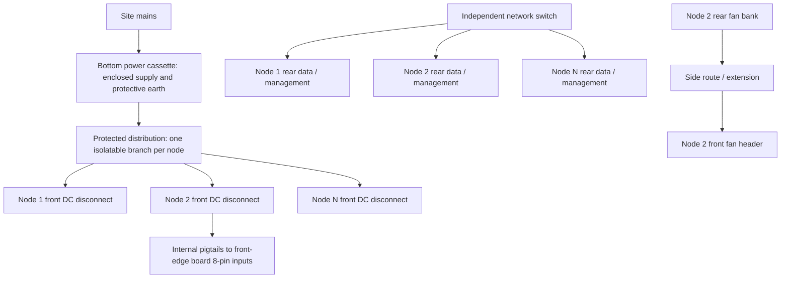

# Integrated milk-crate cassette: review and evidence

PR [#13295](https://github.com/gunb-ai/gunbc/pull/13295), based on
`session/cassette-joinery-review` (#13222). This is an architecture and calculation review,
not a release to print a populated stack. The earlier separate-frame proposal #13283 is superseded.

## Assembly and service topology

The cassette carries its own four corner columns. There is no permanent outer rack, duplicate
runner system, or extra set of trays. Column feet register on the next cassette; broad bearing
faces carry compression, while removable keys retain alignment. Retaining pins must not carry
the stack's gravity load. Prefer open ribs/L-sections and local gussets over solid 20 mm posts;
final section, layer direction, joint stiffness and creep still require qualification.





A direct stack cannot lose a middle structural member while the upper stack remains unsupported.
The minimal-material answer is **temporary service supports**, shared between columns:

1. Shut down and isolate only the target node. Disconnect its external DC and network leads.
2. Install two floor-supported service trestles outside the target's extraction path. A crosshead
   engages the **upper cassette's corner bearing pads**, not its motherboard tray or fan arms.
3. Lift the upper group only enough to disengage the registration keys; retain it against tipping.
   Every upper branch needs that lift allowance, bend radius and strain relief. No cable is a support.
4. Withdraw the target toward the front. Upper nodes' independent cable drops stay connected.
5. Reinsert, reseat, transfer the load back, remove the service supports and reconnect the target.

This is a proposed service sequence, not qualified live service. Until its complete load path,
retention, lift mechanism and cable sweep are checked, use an unloaded demonstration only.
Without the supports, removal remains LIFO and requires moving the nodes above.

**Geometry to resolve before a new cassette print:** the old rear arm sockets lie under the tray
corners, and 20 mm posts centered on the current tray edge intrude into the board envelope. Move
corner bearing sections outward or redesign the socket together with the post; do not simply
extrude the old corner. A review candidate uses post centers around x = ±142 mm, z = ±159 mm
with a 20 mm envelope (about 304 × 338 mm bearing footprint). These are proposed clearances,
not released dimensions. The rear fan bank extends farther aft. One authoritative StackJoint,
actual sections and continuous extraction sweep are owed by the geometry revision, which must
also replace `rack_assembly.fixed_parts` in the assembly-review root. The existing r06 meshes
and hosted rendering are historical and do not yet show this integrated structure.

## Cable space is part of the design

The [ASRock manual](https://download.asrock.com/Manual/ALTRAD8UD-1L2T.pdf) places the three
8-pin power inputs and five fan headers on the edge opposite rear I/O. It permits DC-IN without
the 4-pin signal lead; high-load input population and header current limits remain unresolved.

| Run | Routing and service consequence |
|---|---|
| Shared supply → node | Independent front-side drop; rated, keyed disconnect and strain relief at each cassette. No power daisy-chain through a removable node. |
| Disconnect → board | Short internal pigtails to the front-edge inputs. Select complete contacts, crimps, wire and protection together; do not infer compatibility from connector appearance. |
| Network / management | Independent rear-side drops. Reserve plug bodies, latch access and bend radius before the fan bank; escape around a side instead of passing through fan apertures. Link count comes from the selected networking topology, not all four RJ45 sockets automatically. |
| Rear fans → board | Route along a side to the front header. The modeled rear fan offset makes the straight route about 371 mm before service/bend allowance: a 400 mm fan lead is insufficient with 100 mm allowance. Add and weigh the extension. |
| Cooler fan | Its own internal board-header lead; do not add its airflow to the rear bank as if they were independent parallel fans. |
| Station wiring | Mains inlet/PE, distribution wiring, branch protection, disconnects and station cooling all belong to the power cassette BOM. |

The existing `harness_census` is a **lower-bound route/count screen**, not a cut list. It still
models the old rear-raceway/LIFO alternative for comparison. Exact connector endpoints, network
selection, exterior drop clips, fan lead extension, cooler lead and station wiring must be bound
before a harness order. Middle removal cannot reuse its LIFO disconnect count as an admission.

## Mass is a fold over components

`component_mass.node_components` derives all printed-part occurrences and cooler/fan placements
from the cassette model, adds the board, CPU, DIMMs, SSD, mounting hardware, fasteners, internal
harness and corner structure, and takes the DIMM count from `HostMemoryPopulation`.
`stack_mass_review` consumes the actual `srv3_memory_population` and `srv4_memory_population`:
both have **eight Samsung M393A8G40D40-CRB DIMMs**, not an assumed four.

Mass rows distinguish vendor nominal values, bounded values and a typed missing measurement.
The fold rejects missing mass, duplicate identities/measurements, stale measurement IDs,
invalid ranges and empty inventories. A complete mass sum still reports provisional positions
and nominal vendor inputs: it is not a complete structural qualification.

| Component | Evidence / remaining work |
|---|---|
| W1 active cooler including its fan | [Dynatron](https://www.dynatron.co/product-page/w1): 612 ± 10 g. Do not add its fan again. |
| Three rear P8 PWM PST fans | [ARCTIC specification](https://www.arctic.de/media/84/14/68/1697784882/Spec_Sheet_P8_PWM_PST_EN.pdf): 81 g each, nominal; manufacturing tolerance not provided. |
| srv3 970 EVO Plus / srv4 970 EVO SSD | Samsung brochures give **maximum 8 g**, represented as a bound, not a measured 8 g restoring weight. |
| Board and CPU | Missing mass evidence. The optional `BOARD_AND_CPU` subassembly replaces the two separate rows so the CPU need not be removed for weighing. |
| DIMMs | One matching DIMM's mass, multiplied by the modeled population. Do not count the RAM clearance slabs too. |
| Printed pieces | Use revision/profile-bound slicer or measured part mass. Positive primitive volumes include overlaps and ignore cuts/infill; they are not actual printed mass or conservative tipping input. |
| Hardware, harness, connectors | Explicit missing rows, filled from the selected BOM and routed lengths or measured sets. No silent zero. |
| Power cassette | Separate PSU, enclosure, distribution and wiring rows. Supply selection is still open, so mass and CG are open. |
| Service supports / exterior cables | Separate service-case loads and cable forces, not mass silently assigned to a node. |

The already-generated PLA P1/P2 G-code reports **156.51 / 147.82 g of filament used**. Those are
job consumption estimates, potentially including support/purge, and belong to r06/profile/material;
they must not be copied onto a redesigned PETG corner cassette as actual part weights.

**Useful operator measurements now:** board with installed CPU (without cooler, DIMMs or SSD),
and one matching DIMM. If separating the cooler is inconvenient, a board+CPU+cooler measurement
can instead constrain the board+CPU range by subtracting the cited 602–622 g cooler interval;
it must be recorded as that grouped observation, not double-counted. No need to weigh the fans
or a whole server just to replace existing vendor/model rows. Printed/hardware/harness masses are
our preparation task; PSU mass follows selection. Center-of-mass placement remains separate from
weighing: use surveyed locations or explicit position bounds before calculating a stack limit.

## Force calculations and their boundary

`placed_mass_model` folds mass and x/y/z first moments. For each supporting interface, the load
set must contain all components above it, in that interface's frame. The bottom power cassette
raises every node and contributes its own mass at the base; it cannot be added as weight without
also moving the node positions. Check every interface and the complete stack, not only the floor.

For a rectangular support region, four directional restoring moments use each edge's distance
from the actual CG. Top push uses the **applied-force height**; base acceleration uses the **CG
height**. Four equal vertical contact stiffnesses give reactions proportional to
`1 ± x/a ± z/b`; negative reactions require a unilateral contact re-solve, not clamping to zero.
Equal quarter loads are valid only for a centered, symmetric case under that assumption.

`load_from_ledger` refuses an incomplete mass ledger. Endpoint scenarios are sensitivity cases,
not an interval proof: putting every mass at its maximum can increase the restoring moment.
The previous uniform `stack_mechanics` model is retained as a labeled approximation, with the
push-height and bottom-station offsets corrected and bending-strength-as-compression removed.
Its result is now `StackScreeningOnly`; its search is `max_screened_height`.

**No defensible safe stack height is established yet.** Remaining constraints include contact
footprint and print orientation, joint shear/bending, pillar buckling with real end conditions,
local compression, creep at measured temperature, friction/sliding, cable pull, chosen bump/tilt
load cases, and the temporary service-support state. Rigid-body statics does not substitute for
FEA or physical creep/joint testing. A heavy base may help; a lighter base raising heavier nodes
can make stability worse. The earlier “10 high” and “PLA/PETG admit the same height” are withdrawn.

## Thermal and material interpretation

The user's candidate is **SUNLU High Speed (likely Matte) PETG**; exact SKU/lot remains to match.
Its [primary TDS](https://media.sunlu.com/prod/20260330/ccf53a55-5b58-49fa-b1d9-08f94c0a4b28.pdf?filename=TDS)
reports HDT **70 ± 2 °C at 0.45 MPa**, on specified XY printed specimens. High printing speed is
not a thermal rating. HDT is neither melting temperature nor a long-duration loaded-part limit.
The model uses a vendor-neutral filament row instead of borrowing Bambu PETG values.

A 100 °C CPU junction does not mean a 100 °C fan mount. Conversely, a **measured 100 °C mount**
is well beyond this PETG's HDT screen. Bulk exhaust rise `Q/(rho V cp)` is useful only with its
assumptions: installed airflow must come from the fan/system pressure-curve intersection or a
measurement. Catalog maximum free-air flow times PWM percentage does not establish it.
The hypothetical aggregate-flow cases are now labeled `AssumedAir...`; percentages are fractions
of free-air flow, not fan duty. Unknown local temperature stays `InstalledThermalUnresolved`.

The P8 catalog operating ambient ceiling is **40 °C**, independent of the filament. A 35 °C
inlet plus even the hypothetical ~8 K bulk rise already needs attention at the fan inlet.
Measure inlet, fan inlet, hottest mount and column joint under sustained load and a controlled
fan-failure shutdown transient. Radiation, conduction, hot recirculation and creep remain open.
Do not select a BMC PWM floor or authorize PLA/PETG operation from the free-air calculation.

## Electrical corrections

The Molex primary 5556/5558 table varies rating with circuit count, terminal material and wire.
For an 8-circuit 18 AWG screening row the lower listed material rating is **6 A/contact**, not
the family maximum 9 A. This still does not identify the actual board header, crimp or PCB path.
The feed calculation now rounds constant-power current up at the chosen minimum voltage;
300 W at 11.4 V is 26.316 A. Zero derating refuses. `NodeFeedScreeningOnly` is not approval of
wire ampacity, parallel current sharing, connector/pigtail drop, protection, transient load or
board input population. The ATX voltage band is a screening assumption for direct DC-IN.
DC-return bonding and node bonding/ESD requirements depend on the selected supply design;
“12 V only” does not erase those obligations.

## Execution and next geometry boundary

Run the component-mass, stack-mechanics, stack-feed and exhaust-thermal witness entries under
`dag/test/claim/printed_chassis_*_witness_test.dag`. The executable fleet inventory report is:

```
gunbc run --source-root dag --source-root src/v2 \
  --entry dag/gunbc/product/printed_chassis/stack_mass_review.dag
```

The new mass model is consumed by that report and the placed-load refusal path. SUNLU and fan
ambient rows are consumed by thermal witnesses. New integrated corner geometry and the
support-assisted extraction mechanism are a **named frontier for the next CAD revision**, not
claimed to have been printed, strength-tested, or incorporated into the hosted r06/r07 meshes.
Their landing must replace the old fixed-rack review root, bind the mass ledger to finalized
parts, and run collision/continuous-sweep/bed-fit checks before another cassette print.
