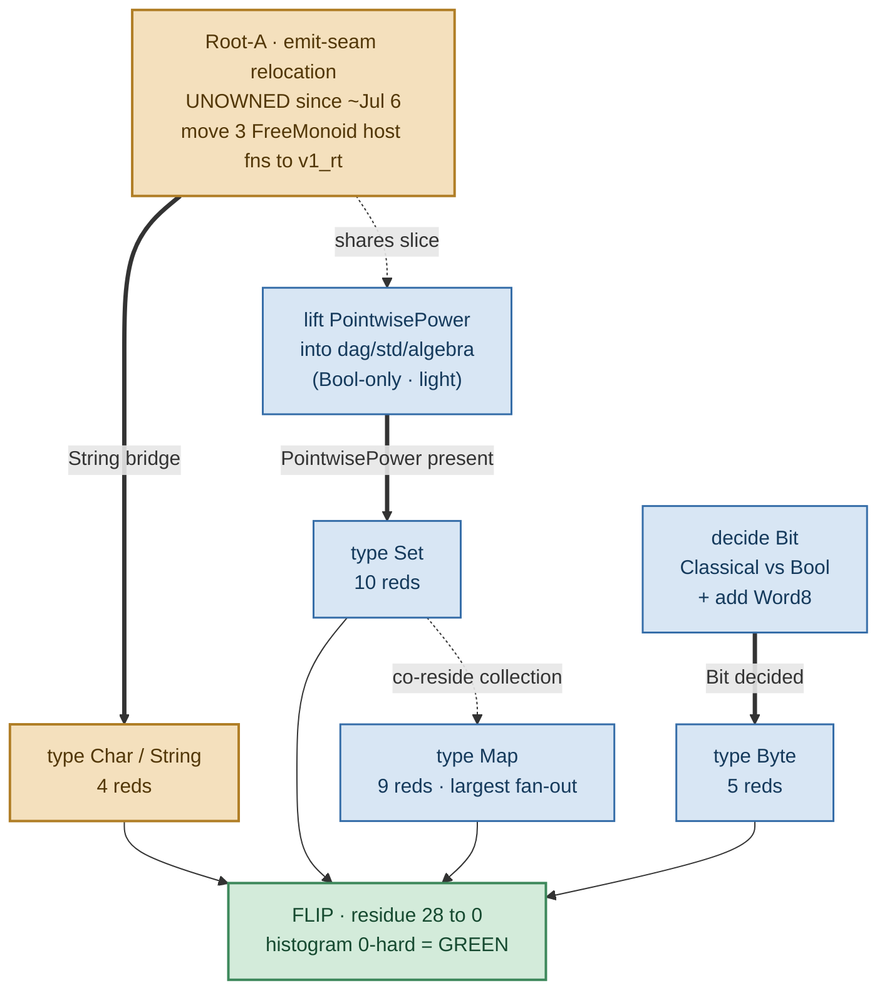

# Namespace §13 flip — the last 28 reds (Root-A / two-std de-fork)

Scope + dependency graph for the namespace flip's final blocker. Companion to
[namespace-only resolution design](namespace-resolution-design.md) (the lane authority) — this
doc is the residue-burn-down ledger for the `NameResolutionPolicy = NamespaceOnlyY` flip
(`src/v1/stage0/src/v1_rt.rs`, default `false` = ImportScoped byte-identical; `true` =
NamespaceOnlyY). Ground truth for the residue is the `compile_clean_diagnostic_histogram` bin run
with the policy flipped ON in an isolated worktree, **not** the `resolution_divergence_census`
proxy (self-flagged unsound — a compile-path raw-count).

## Residue state

| stage | hard reds | what clears them |
| --- | --- | --- |
| flip ON today | **90** | — |
| − §13 mechanism fix (#7147) | (was +32 InternalError) | two §13-unaware `None`-arms in `04_infer` now route through `AmbiguousReference`, not `inference_error` |
| − doable-now lane | **−62** | homonym renames (42) + local/DSL consolidations (20) — no Root-A dependency |
| = two-std forks left | **28** | `Set` (10) · `Map` (9) · `Byte` (5) · `Char` (4) |
| target | **0** | flip default ON, histogram 0-hard = GREEN |

The flip stays **honestly red** on these four until they consolidate — no qualify-bridge
(operator, 2026-07-23).

## The key insight

**Only `Char` actually rides Root-A.** `Set`, `Map`, and `Byte` are seam-independent —
**24 of the 28 reds clear with no Root-A owner at all.** Root-A is the critical path for exactly
one type (Char, 4 reds), because the emitted String↔`FreeMonoid<Char>` host-fold bakes in
`Char = Nat`. Everything else runs in parallel.

## Dependency graph · Root-A → 28 → 0

Legend: **critical path** (needs an owner) = Root-A, Char · **parallel-now** (no Root-A) =
PointwisePower lift, Bit decision, Set, Map, Byte · **goal** = flip green.

## The four tracks

### `Char` / `String` — 4 reds · Root-A gated
- **Fork:** `std.types.Char = Int where unicode_scalar` vs `v2.std.text.Char = Nat`.
- **Why gated:** the emitter hardcodes `freemonoid_empty::<v2_std_nat::Nat>` as the
  String↔`FreeMonoid<Char>` element (`05_emit_rust.dag:272–279, 7679`). Deleting `v2.std.text`
  dangles the emitted host fold — regen reds.
- **Decision:** `Char = Int` wins the name; the String bridge and the Char decision are **one
  bundled edit** with Root-A.

### `Set` — 10 reds · parallel-now
- **Fork:** `std.types.Set = BooleanAlgebra` (a mis-model, zero users) vs
  `v2.std.collection.Set = PointwisePower`.
- **Gate:** a light lift only — promote the 3-line `PointwisePower` record into
  `dag/std/algebra` (depends on `Bool` alone; does **not** drag `FreeMonoid`). Not the emit seam.
- **Decision:** all 17 consumers use the value form `Set{member: fn}`; v2's model wins, redefine
  `std.types.Set` on the lifted record.

### `Map` — 9 reds · parallel-now (largest fan-out)
- **Fork:** `std.types.Map = PartialFunction` vs `v2.std.collection.Map` (record + host primitives).
- **Gate:** none external. The emitter already routes `Map → crate::std_algebra::PartialFunction`,
  and the `empty_map/map_insert/map_get` contracts are already single-authority in
  `dag/std/primitives`. Pure import re-point + wrapper re-homing.
- **Note:** largest blast radius (~119 files) — start early despite the low red count.

### `Byte` — 5 reds · parallel-now
- **Fork:** `std.bit.Byte {bits: List<Bit>}` (Bit=Classical) vs `v2.std.machine.Byte`
  (Bit=Bool + Word family).
- **Gate:** record shape is byte-identical; the only gap is the **Bit decision** (Classical vs
  Bool) plus adding `Word8` to `dag/std/bit`. No emit-seam path touches machine/Byte/Word.
- **Note:** once Bit is decided, a mechanical ~32-file re-point.

## Root-A — what a fresh owner picks up

Root-A is the one item with **no owner** — the prior worker left ~2026-07-06
(`dag/gunbc/plans/dag_v2_defork_audit.dag:126`). It is a fresh assignment, not a rediscovery.
Tightly scoped:

- Move the 3 `FreeMonoid` host fns (`freemonoid_empty`, `list_snoc_item`, `fold_list`) off
  `v2.std.algebra` into `v1_rt` — beside `code_point`/`from_code_point`/`concat`, which the seam
  already calls there.
- Lift `PointwisePower` into `dag/std/algebra` (this slice also unblocks `Set`).
- Swap the `FreeMonoid` element `v2_std_nat::Nat` → the consolidated `Char` authority; land
  `Char` in the same edit.
- Prove it green-by-execution: emitted compiler still round-trips strings; `regen --verify`
  byte-clean.

**Skills:** the src/v1 seed emitter (`05_emit_rust.dag` — how host bridges and crate paths route),
the `v1_rt` realization module, and the self-host regen loop. The `v2_std_integer` /
closure-stub cleanup is regen *hygiene*, not on the critical path — sequence it after `Char`
clears, not before.

## Critical path & endgame

The only chain longer than one hop is **`Root-A → Char → flip`**. `Set` (via the PointwisePower
lift), `Map`, and `Byte` (via the Bit decision) are each a single hop to the flip and run fully in
parallel. Wall-clock is gated entirely on getting a Root-A owner — and even then, **if Root-A
slips, 24/28 reds still clear**, leaving only `Char`'s 4 pinned to the seam.

All four representation-reconciliation *decisions* are analysis, not deletion — they can be settled
before any owner touches the emit seam. When the four land: flip
`NameResolutionPolicy = NamespaceOnlyY` on, run `compile_clean_diagnostic_histogram`, confirm 0
hard.

**Verification note:** "reaches 0" is trust-but-unverified — one flip-on dry-run after the four
land confirms no fifth name hides in the 28 before flipping the default. clever-pike-49 owns that
flip-oracle verification (flips the bool in an isolated worktree, runs the histogram); no worker
flips the bool themselves.

---
*Scoped by execution against main; residue 10+9+5+4 = 28; edges adversarially verified.*
