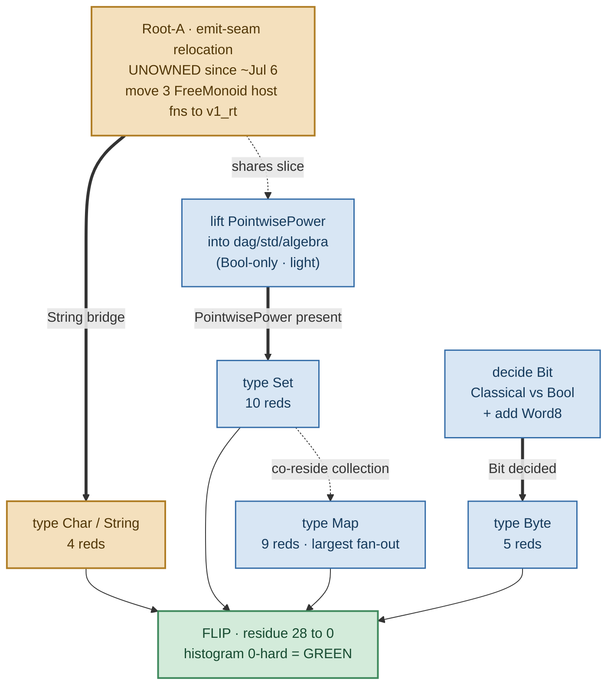

# Namespace §13 flip — the last 28 reds (Root-A / two-std de-fork)

Scope + dependency graph for the namespace flip's final blocker. Companion to
[namespace-only resolution design](namespace-resolution-design.md) (the lane authority) — this
doc is the residue-burn-down ledger for the `NameResolutionPolicy = NamespaceOnlyY` flip
(`src/v1/stage0/src/v1_rt.rs`, default `false` = ImportScoped byte-identical; `true` =
NamespaceOnlyY). Ground truth for the residue is the `compile_clean_diagnostic_histogram` bin run
with the policy flipped ON in an isolated worktree, **not** the `resolution_divergence_census`
proxy (self-flagged unsound — a compile-path raw-count).

> **STATUS 2026-07-24 — residue = 0, LANDED.** The full 90 → 0 burn-down is done by execution.
> The doable-now lane (62) landed via #7156 (homonyms) + #7157 (consolidations); the four two-std
> forks (28) landed via **#7165** (proud-ibex-240 — Char + the FreeMonoid emit-seam relocation,
> then Set/Map/Byte authority-collapse). Flip-oracle against merged main (isolated worktree, policy
> ON): **`HISTOGRAM_TOTAL_HARD 0`**. The corpus is now **unambiguous under NamespaceOnlyY** — i.e.
> flip-ready. What remains is no longer *de-forking*; it is the flip itself and the deletion it
> unblocks — see **[Post-0 roadmap](#post-0-roadmap--flip--global-deletion-two-dispatches)** below.

## Residue state

| stage | hard reds | what clears them |
| --- | --- | --- |
| flip ON today | **90** | — |
| − §13 mechanism fix (#7147) | (was +32 InternalError) | two §13-unaware `None`-arms in `04_infer` now route through `AmbiguousReference`, not `inference_error` |
| − doable-now lane | **−62** | homonym renames (42) + local/DSL consolidations (20) — no Root-A dependency |
| = two-std forks left | **28** | `Set` (10) · `Map` (9) · `Byte` (5) · `Char` (4) |
| − two-std de-fork (#7165) | **−28** | Char + FreeMonoid seam relocation, then Set/Map/Byte authority-collapse (delete v2-local dup, import from std) |
| = **LANDED** | **0** | flip-oracle on merged main: `HISTOGRAM_TOTAL_HARD 0` ✓ |

The flip stayed **honestly red** on these four until they consolidated — no qualify-bridge
(operator, 2026-07-23). All four are now collapsed to a single authority, so the residue is 0 by
execution. **Key lesson banked:** a §13 red clears only when the name has exactly **one reachable
definition** — aligning the two models *structurally* is not enough; one side's def must be
deleted/redirected.

## The key insight

**Only `Char` actually rides Root-A.** `Set`, `Map`, and `Byte` are seam-independent —
**24 of the 28 reds clear with no Root-A owner at all.** Root-A is the critical path for exactly
one type (Char, 4 reds), because the emitted String↔`FreeMonoid<Char>` host-fold bakes in
`Char = Nat`. Everything else runs in parallel.

## Dependency graph · Root-A → 28 → 0

Legend: **critical path** (needs an owner) = Root-A, Char · **parallel-now** (no Root-A) =
PointwisePower lift, Bit decision, Set, Map, Byte · **goal** = flip green.

## The four tracks

### `Char` / `String` — 4 reds · Root-A gated
- **Fork:** `std.types.Char = Int where unicode_scalar` vs `v2.std.text.Char = Nat`.
- **Why gated:** the emitter hardcodes `freemonoid_empty::<v2_std_nat::Nat>` as the
  String↔`FreeMonoid<Char>` element (`05_emit_rust.dag:272–279, 7679`). Deleting `v2.std.text`
  dangles the emitted host fold — regen reds.
- **Decision:** `Char = Int` wins the name; the String bridge and the Char decision are **one
  bundled edit** with Root-A.

### `Set` — 10 reds · parallel-now
- **Fork:** `std.types.Set = BooleanAlgebra` (a mis-model, zero users) vs
  `v2.std.collection.Set = PointwisePower`.
- **Gate:** a light lift only — promote the 3-line `PointwisePower` record into
  `dag/std/algebra` (depends on `Bool` alone; does **not** drag `FreeMonoid`). Not the emit seam.
- **Decision:** all 17 consumers use the value form `Set{member: fn}`; v2's model wins, redefine
  `std.types.Set` on the lifted record.

### `Map` — 9 reds · parallel-now (largest fan-out)
- **Fork:** `std.types.Map = PartialFunction` vs `v2.std.collection.Map` (record + host primitives).
- **Gate:** none external. The emitter already routes `Map → crate::std_algebra::PartialFunction`,
  and the `empty_map/map_insert/map_get` contracts are already single-authority in
  `dag/std/primitives`. Pure import re-point + wrapper re-homing.
- **Note:** largest blast radius (~119 files) — start early despite the low red count.

### `Byte` — 5 reds · parallel-now
- **Fork:** `std.bit.Byte {bits: List<Bit>}` (Bit=Classical) vs `v2.std.machine.Byte`
  (Bit=Bool + Word family).
- **Gate:** record shape is byte-identical; the only gap is the **Bit decision** (Classical vs
  Bool) plus adding `Word8` to `dag/std/bit`. No emit-seam path touches machine/Byte/Word.
- **Note:** once Bit is decided, a mechanical ~32-file re-point.

## Root-A — what a fresh owner picks up

Root-A is the one item with **no owner** — the prior worker left ~2026-07-06
(`dag/gunbc/plans/dag_v2_defork_audit.dag:126`). It is a fresh assignment, not a rediscovery.
Tightly scoped:

- Move the 3 `FreeMonoid` host fns (`freemonoid_empty`, `list_snoc_item`, `fold_list`) off
  `v2.std.algebra` into `v1_rt` — beside `code_point`/`from_code_point`/`concat`, which the seam
  already calls there.
- Lift `PointwisePower` into `dag/std/algebra` (this slice also unblocks `Set`).
- Swap the `FreeMonoid` element `v2_std_nat::Nat` → the consolidated `Char` authority; land
  `Char` in the same edit.
- Prove it green-by-execution: emitted compiler still round-trips strings; `regen --verify`
  byte-clean.

**Skills:** the src/v1 seed emitter (`05_emit_rust.dag` — how host bridges and crate paths route),
the `v1_rt` realization module, and the self-host regen loop. The `v2_std_integer` /
closure-stub cleanup is regen *hygiene*, not on the critical path — sequence it after `Char`
clears, not before.

## Critical path & endgame

The only chain longer than one hop is **`Root-A → Char → flip`**. `Set` (via the PointwisePower
lift), `Map`, and `Byte` (via the Bit decision) are each a single hop to the flip and run fully in
parallel. Wall-clock is gated entirely on getting a Root-A owner — and even then, **if Root-A
slips, 24/28 reds still clear**, leaving only `Char`'s 4 pinned to the seam.

All four representation-reconciliation *decisions* are analysis, not deletion — they can be settled
before any owner touches the emit seam. When the four land: flip
`NameResolutionPolicy = NamespaceOnlyY` on, run `compile_clean_diagnostic_histogram`, confirm 0
hard.

**Verification note (DISCHARGED).** "reaches 0" was trust-but-unverified — one flip-on dry-run
after the four landed was owed to confirm no fifth name hid in the 28. clever-pike-49 ran it against
merged main (`b4b433a27b`) in an isolated worktree with the bool flipped ON:
`HISTOGRAM_TOTAL_HARD 0`. No fifth name. The corpus is flip-ready.

---

## Post-0 roadmap — flip → global deletion (two dispatches)

Residue = 0 means de-forking is *done*. Two dispatches remain, and **only two** — this section
draws them explicitly because the number is the point.

### Why exactly two (the anti-infinity guarantee)

The open concern was infinite regress: between "flip-ready" and "import is deleted" there is an
unbounded chain of *minimization/micro-scoping* steps we could keep inventing (the Gojo-infinity
worry). The defense is **decidability** (DESIGN §5 — "never" is a trap; check the wall vs the
ratchet). Each dispatch below has a **decidable done-line** — a wall, not a ratchet — so it
terminates and cannot be sub-divided into more dispatches without one of those done-lines already
being green:

- **Dispatch 1 done-line:** with imports *stripped in a throwaway worktree*, the corpus still
  compiles clean under NamespaceOnlyY. That green **proves the imports are already redundant** —
  every reference binds by containment, not by its import line. Decidable: the histogram is 0 or it
  is not.
- **Dispatch 2 done-line:** `import` is a **parse error**. Decidable: the grammar production is
  present or it is absent.

There is no third decidable wall between them, so there is no room for a third dispatch. Any
"further minimization" would either be pre-empted by Dispatch 1's done-line (already redundant) or
be post-deletion cleanup (cosmetic, not a blocker).

### Operator ruling — INLINE + GLOBAL (2026-07-24)

Supersedes the older per-subtree / file-alias wording in
[namespace-resolution-design.md §8](namespace-resolution-design.md):

- **INLINE qualification, not file-level aliases.** Where a reference needs help to resolve without
  its import, qualify it **at the use site** (`container.member`, e.g. `medium.Foo`) — do *not*
  introduce a file-level alias / `using` declaration. Inline is Rule-1-minimal and survives when
  modules stop being files; a file-scoped alias is a naming authority that only exists because files
  do, and would have to be dissolved again the moment the storage-realization stops being 1 file =
  1 module (the module-identity-vs-storage lane). (This is C++-style qualification, *not* a
  C++ `using namespace` alias.)
- **GLOBAL flip, not per-subtree rollout.** Because residue = 0, the *whole* corpus is unambiguous
  under NamespaceOnlyY at once — flip the policy default globally. No incremental subtree staging
  (that staging only existed to bound a still-red corpus; there is nothing left to bound).

### Dispatch 1 — the flip

Turn on namespace-only resolution and inline-qualify the references that need it to bind without
their import.

- **Mechanism:** flip `NAME_RESOLUTION_POLICY_NAMESPACE_ONLY` default `false → true`
  (`src/v1/stage0/src/v1_rt.rs`). Under NamespaceOnlyY a bare name binds by walking the containment
  tree, not by an import list — so every reference that today resolves *only because* an import
  dragged its target into the pool (#6985 Class-B pool-membership-coincidence) must instead be
  written `container.member` at the use site.
- **Worklist = the forked-name refs the *witness corpus* exposes (NOT the policy census).**
  Established by execution, correcting an earlier guess: under the flip a bare *unlisted* ref only
  breaks when its name is **forked** (2+ reachable defs) and the compilation closure sees both.
  Almost all forks are benign (the ~30-name integer tower is referenced in disjoint closures). The
  ambiguous ones surface in the **witness corpus** — lens/test files whose closure sees both defs —
  e.g. `TerminationProof`/`RankingDimension` across ~56 witness files (see
  [formal-concepts extdeps grounding](formal-concepts-extdeps-grounding.md)) and `Nat`/`Zero`/`Succ`
  across ~26. The policy census (the sibling dispatch's `UnlistedImportUse` TSV) is **not** this
  worklist — it is `UnlistedImportUse`-scoped, resolves each name to one definer, and does not
  contain the forked refs (a *listed* import to a forked name still breaks under the flip).
- **The `compile_clean_diagnostic_histogram` is a *partial* oracle.** Proven by execution: strip the
  qualifications, keep the flip on, re-run → still `HISTOGRAM_TOTAL_HARD 0`. The histogram and the
  floor's compile-clean *gate* share an exclusion scope (`whole_tree_strict_resolve_exclusion_substrings`:
  `/test/`, several `lens/*`) that never sees the ambiguous closures. So `residue = 0` held for
  compile-clean scope but not the whole tree.
- **Acceptance (the done-line) = the FLOOR / `ci` job green under the flip** (the whole witness
  corpus), *not* the histogram. That is the consumer that compiles the lens/test files with both
  forked defs in closure. clever-pike-49 owns the flip-oracle verification; the histogram remains a
  fast compile-clean-scope check, the floor the completeness gate.
- **Not in scope:** deleting the actual import lines or the import grammar — that is Dispatch 2.
  Dispatch 1 leaves imports in place (harmless once redundant); it only makes them redundant.

### Dispatch 2 — global import deletion

Delete every `import` line and the `import` grammar production itself.

- **Mechanism:** remove the import statements corpus-wide, then delete the `import` production from
  `02_parse.dag`. Dependencies are thereafter derived purely from `container.member` references
  (Rule-1 end-state, namespace-resolution-design.md §8 step 5). The flip (Dispatch 1) *is* the
  closure-independent binding mechanism the PR-5b strip was historically blocked on — with binding
  by containment, deletion no longer risks losing a resolution.
- **Acceptance (the done-line):** `import` is a **parse error**; the corpus compiles with deps
  derived from references alone.

### The one thing that could make it three (named, not hidden)

§12 runtime-dispatch (namespace-resolution-design.md §12) makes the containment tree a **third**
consumer (resolution walks it, content-addressing hashes it, termination reads its sub-value edges —
runtime dispatch would be the fourth). If wiring runtime dispatch onto the tree turns out to need
its *own* policy flip (a NamespaceOnlyY-equivalent for the dispatch path), that work **folds into
Dispatch 1** (same flip-shaped acceptance), not a new dispatch. It does not extend the plan to three;
it is called out here only so it is not mistaken for hidden regress.

---
*Scoped by execution against main; residue 10+9+5+4 = 28 → **0** (#7165). Post-0 roadmap: 2
dispatches, decidable done-lines. Edges adversarially verified.*
