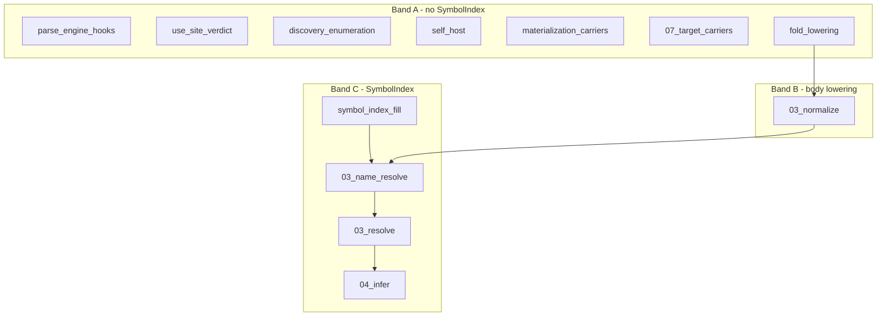

# Wave 2 prep — module-flip census, FLAG E row-fold, SymbolIndex dependency map

**Status:** design/scoping only (no load-bearing pipeline edits). Session: still-deer-582.
**Authority chain:** [v2-self-hosting.md](v2-self-hosting.md) (wave sequencer) ·
[general-body-producer-design.md](general-body-producer-design.md) (FLAG E / body producer) ·
[namespace-resolution-design.md](namespace-resolution-design.md) ·
[type-env-single-authority-design.md](type-env-single-authority-design.md) (SymbolIndex index half) ·
carrier: `src/v2/compiler/self_host/frontier.dag`.

Reasoned serially: §1 fixes the census from the carrier; §2 orders the first Wave 2 flips; §3
designs FLAG E completion (dissolve the interim hand-walker); §4 maps SymbolIndex dependencies for
the first ~11 modules.

---

## 1. Module-flip census (carrier-grounded)

**Firm (execution-measured on carrier):**

| fact | value | witness |
|---|---|---|
| roster size | 27 | `compiler_frontier_module_count_expected` |
| self-emitted | 0 | `compiler_frontier_self_emitted_baseline = 0` |
| seed-retained | 27 | `compiler_frontier_seed_retained_count()` |
| census wave label | `^wave2_post_resolver_6451_body_stage_a_6443` | `compiler_frontier_census_attribution` |
| sweep order complete | yes (27 paths) | `compiler_frontier_sweep_order_complete_holds` |
| sweep order monotonic by tractability | yes | `compiler_frontier_sweep_order_matches_tractability_rank_holds` |

**Blocker-class distribution (knowledge-attributed rows — per-module probe execution still deferred
via `^migrate_when_frontier_per_module_probe_receipt_binds`):**

| class | count | modules |
|---|---|---|
| `NameResolutionGap` | 3 | `00_compile`, `01_tokenize`, `03_body_producer` |
| `EmitSurfaceGap` | 24 | all others on roster |

**Interpretation:** emit-surface completeness is the dominant blocker for Wave 2; the three
`NameResolutionGap` rows sit at the *back* of the sweep (large closure, compile/tokenize/body-producer
poles). The first ~11 modules in sweep order are all `EmitSurfaceGap` with low `closure_reads` — the
intended Wave 2 tractability frontier.

### First ~11 modules (sweep order prefix)

Ordered by `compiler_frontier_sweep_order` (tractability rank nondecreasing). `closure_reads` =
import-closure size proxy on the roster row.

| # | module | closure_reads | tractability_rank | migration_trigger | flip gate |
|---|---|---:|---:|---|---|
| 1 | `parse_engine_hooks.dag` | 2 | 2002 | `^migrate_when_parse_cursor_grounded` | emit surface |
| 2 | `use_site_verdict.dag` | 9 | 2009 | `^migrate_when_ownership_defork_lands` | ownership de-fork |
| 3 | `discovery_enumeration.dag` | 12 | 2012 | `^migrate_when_closure_self_emits_cargo_green` | closure cargo-green |
| 4 | `self_host.dag` | 28 | 2028 | `^migrate_when_frontier_harness_repurposed` | harness repurposed |
| 5 | `materialization_carriers.dag` | 35 | 2035 | `^migrate_when_materialize_spine_lane_lands` | materialization spine |
| 6 | `07_target_carriers.dag` | 36 | 2036 | `^migrate_when_rust_body_emit_track_b_completes` | Rust body emit (B-track) |
| 7 | `fold_lowering.dag` | 36 | 2036 | `^migrate_when_body_lowering_generalizes` | general body producer |
| 8 | `03_normalize.dag` | 37 | 2037 | `^migrate_when_closure_self_emits_cargo_green` | body lowering + closure |
| 9 | `03_resolve.dag` | 39 | 2039 | `^migrate_when_namespace_only_resolution_lands` | **SymbolIndex / namespace** |
| 10 | `03_name_resolve.dag` | 44 | 2044 | `^migrate_when_namespace_only_resolution_lands` | **SymbolIndex fill** |
| 11 | `04_infer.dag` | 44 | 2044 | `^migrate_when_closure_self_emits_cargo_green` | resolved-tree fidelity |

Rows 12+ (not Wave 2 prefix): `03_name_resolve` is last of the low-closure band before emit/translate
heavyweights (`06_translate`, `05_emit`, …) and the `NameResolutionGap` poles.

---

## 2. Flip order and Wave 1 exit gates

### Wave 1 exit (must be green before Wave 2 opens)

From [v2-self-hosting.md](v2-self-hosting.md) §1:

1. **General body producer** — real ingested fn bodies via forward grammar rows (Stage A FACT layer
   landed #6443; Stages A remainder / B / C / D in flight).
2. **Namespace `SymbolIndex`** — B1 merged + containment fill (`symbol_index_fill.dag` scaffold;
   `03_resolve` lexical lookup wired).
3. **FLAG D** — `EnvironmentBindingKey` identity re-grounding (required before feature closes).
4. **Weak self-host behavioral receipt** — e.g. `std/logic` emit → compile → run ≡ seed
   ([s2-v2-self-emit-direction.md](s2-v2-self-emit-direction.md) §11).

**No v1 deletion in Wave 1.**

### Wave 2 flip sequencing (recommended)

Three **bands** within the first-11 prefix, not a flat serial list:

**Band A — leaf emit modules (can parallelize after Wave 1 gate 4):**
`parse_engine_hooks`, `use_site_verdict`, `discovery_enumeration`, `self_host`,
`materialization_carriers`, `07_target_carriers`.

- **Pre-req:** Rust decl/body emit tracks sufficient for each module's constructs (Track A/B per
  [s2-v2-self-emit-direction.md](s2-v2-self-emit-direction.md)).
- **Receipt per flip:** emitted module cargo-green + behavioral-equivalence vs v1 seed on
  discriminating corpus (NOT byte-identity).
- **Special:** `use_site_verdict` additionally waits on ownership de-fork
  (`^migrate_when_ownership_defork_lands`).

**Band B — body-lowering seam (serial, gates normalize + fold_lowering):**
`fold_lowering` → `03_normalize`.

- **Pre-req:** FLAG E row-fold dissolution design (§3) implemented — `body_lowering_fold.dag`
  deleted, forward rows own within-body lowering.
- **Pre-req:** Stage A fn_decl → Arrow rows land (gated on SymbolIndex for decl-name binding per
  [general-body-producer-design.md](general-body-producer-design.md) Stage A note).
- **Receipt:** existing body-lowering witnesses green; wrapper-retained count monotonic down;
  `^body_lowering_reason_wrapper_retained_emitted` RED controls still fire on honest residue.

**Band C — resolution-dependent pipeline (serial, gates infer):**
`03_name_resolve` → `03_resolve` → `04_infer`.

- **Pre-req:** Wave 1 gate 2 (SymbolIndex / namespace) — hard gate on migration triggers.
- **Order:** fill (`name_resolve`) before lookup consumer (`resolve`) before inference consumer
  (`infer`).
- **Receipt:** `symbol_index/containment_test.dag` equivalence witnesses green; resolve no longer
  depends on `scope_with_fn_decl_params` scaffold once Arrow pre-exists.

### Census ratchet discipline

Each flip updates `compiler_frontier_roster` row: `SeedRetained` → `SelfEmitted` with a
**measured** `FrontierProbeReceipt` (dissolves `KnowledgeAttributed` census when
`^migrate_when_frontier_per_module_probe_receipt_binds` lands). Until then, flips update
disposition only with a linked behavioral receipt path — do not hand-edit blocker classes without
probe execution.

---

## 3. FLAG E — row-fold design (dissolve `body_lowering_fold.dag`)

### 3.1 What landed vs what remains

**LANDED (#6443) — FLAG E "one table" for sugar:**

- `SugarKey = SurfaceAtomKey | ProductionIdentityKey` (`sugar.dag:45-47`).
- `type_alias_rhs` migrated as proof row (`sugar_rule_type_alias_rhs`).
- Normalize pipeline: child-fold → `body_lower_finish` → `normalize_sugar_finish`
  (`03_normalize.dag:116-126`).

**INTERIM — the hand-walker (`body_lowering_fold.dag`, ~1.5k LOC):**

- Production-identity dispatch in `body_lower_production_emitted` / `body_lower_finish`.
- Hand-authored families: unwrap chains, infix/postfix/call parsers, fn_decl→Arrow interim lowering.
- Explicit dissolution contract: **do NOT port these arms into `SugarRule` rows** — they dissolve
  into **GrammarRelationRow forward fold** (general-body-producer-design §3).

**Clarification (resolves an ambiguous note in `body_lowering_fold_note`):** FLAG E has two
layers:

| layer | mechanism | owns |
|---|---|---|
| Sugar | `SugarKey` → `SugarRule` table | surface connective sugar, coproduct pipe chains |
| Body producer | `GrammarRelationRow` forward selection + slot map | fn bodies → `Behavior` substrate |

The hand-walker dissolves into the **body-producer layer**, not into `SugarRule` extensions.

### 3.2 Target architecture

One `fold_node` over the production-stamped tree. At each node carrying
`^grammar_production_identity_node_projection`:

1. **Select** exactly one `GrammarRelationRow` by emitted production identity (mirror
   `grammar_relation_row_reverse_parse_selection` discipline: `None` / `One` / `Many` → typed
   refusals).
2. **Apply** the row's forward slot map: captured/bound slots → core `NodeKind` + edges (Arrow
   domain, Bind triple, Branch triple, Transform callee+args, etc.).
3. **Delegate** semantic desugars outside the row table:
   - fold-family **calls** → `fold_lowering.dag` (`fold_call_to_loop`) — unchanged authority.
   - pass-through expr wrappers → no core node (unwrap only).
   - metadata wrappers → preserve shell untouched.

**Placement:** stays in normalize, after child-fold, before sugar — same seam as today
(`body_lower_finish` hook point). Implementation replaces the call target: forward row fold instead
of `body_lower_*` dispatch.

### 3.3 Forward selection machinery (Slice 0 — gating)

`GrammarInterpretationDirection` + `ObligationForwardDeterminism` exist (`grammar.dag:1669-1676`) with
**zero consumers**. Slice 0 adds:

```
grammar_relation_row_forward_selection(rules, emitted_identity, captured_slots)
  -> ForwardSelectionVerdict  // None | One{row} | Many{rows}
```

- Predicate: `grammar_production_selection_predicate(GrammarInterpretForward)` (already declared).
- Obligations: consume `ObligationForwardDeterminism` + `ObligationSlotBijection` — no
  re-minted direction vocabulary.
- **Receipt:** mirror of backward selection tests — identity row round-trip on a fixed-arity
  fixture; RED = duplicate row / missing row / slot mismatch.

### 3.4 Row inventory (maps hand-walker arms → rows)

Priority order matches Stage A→B dependency in general-body-producer-design §6.

| Slice | productions (emitted identity) | core target | dissolves hand-walker arm |
|---|---|---|---|
| 1 | `^dag_surface_fn_decl`, `^dag_surface_fn_literal` | `TypeNode{Arrow}` + domain + `^arrow_body_edge` | `body_lower_fn_decl_to_arrow`, param collectors |
| 1b | pass-through identities (`^dag_surface_expr`, binary, unary, block, stmt, …) | unwrap only | `body_lower_is_pass_through_emitted`, `body_lower_unwrap_*` |
| 2 | `^dag_surface_let_expr` | `ComputationNode{Bind}` | (not in hand-walker today — new row) |
| 2 | `^dag_surface_if_expr` | `ComputationNode{Branch}` | (new row) |
| 2 | `^dag_surface_match_expr` | `ComputationNode{Match}` | (new row; arm patterns = honest residue §3) |
| 3 | `^dag_surface_primary_expr` / call shape | `ComputationNode{Transform}` | `body_lower_primary_expr`, call arg collectors |
| 3 | infix via operator tail | `ComputationNode{Transform}` via `lower_binary_infix` | `body_lower_try_infix_*` |
| 3 | `^dag_surface_postfix_expr` | Transform (method call) or **refusal** (field access) | `body_lower_postfix_*` — field access stays refused row until namespace `.` lands |
| — | `^dag_surface_fn_body` | deferred (parent fn_decl lowers) | `body_lower_is_deferred_lower_emitted` |
| — | metadata identities | preserve | `body_lower_is_metadata_preserved_emitted` |
| — | unmapped identities | `wrapper-retained` diagnostic | `body_lower_wrapper_retained_shell` → typed refusal row |

**Fold-call path:** keep delegation to `fold_call_to_loop` inside Transform/primary slice — not a
grammar row (callee-head keyed semantic desugar per `fold_lowering.dag:35`).

### 3.5 `SugarRule` vs forward row — decision rule

| question | SugarRule | Forward GrammarRelationRow |
|---|---|---|
| changes connective tag? | yes (`SugarRewriteConnective`) | yes (to Arrow/Bind/…) |
| keyed on | surface atom OR one production identity | production identity |
| slot map source | fixed `SugarLowering` variant | row-derived slot bijection |
| examples | `service`/`fn`/`type` sugar, `type_alias_rhs` pipe | fn_decl, let, if, call |

**Rule:** if the lowering needs per-production captured-slot bijection from the grammar relation,
it is a **forward row**, not a `SugarRule` arm. Prevents re-widening the sugar fork.

### 3.6 Implementation slices and acceptance

| slice | PR scope | accept (green + RED) |
|---|---|---|
| 0 | forward selection in `grammar.dag` + witness | `None`/`Many` refuse; `One` selects; key reorder invariant |
| 1 | fn_decl/fn_literal rows in `extdeps/languages/dag/` + hook normalize | MVP `produce_*` parity for arrow shapes; param ref synthetic atoms (FLAG D conform); RED: wrapper-retained on unlowered decl |
| 2 | let/if/match rows | branch/match witnesses; RED: stmt-seq refuses (honest residue) |
| 3 | call/infix/postfix rows | binop + call witnesses; RED: postfix field access refuses |
| 4 | **delete** `body_lowering_fold.dag`; `03_normalize` imports forward fold only | file absent; corpus green; wrapper-retained count ≤ declared residue frontier |

**Fail-closed:** row `Many` and `None` are distinct diagnostics (mirror backward). No silent
pass-through. Wrapper-retained transitions to typed refusal rows, never absorption.

### 3.7 Dependencies blocking Slice 1

- **SymbolIndex / namespace (Wave 1 gate 2):** fn_decl param + decl-name binding via module-root
  edges — Stage A explicitly gated in general-body-producer-design §6 ("near-zero-coverage slice
  would land dual authority").
- **FLAG D:** param ref atoms must be occurrence-normalized until binding-key re-grounding lands;
  witness `bind_eval_occurrence_identity_defect_note` documents the flip trigger.

---

## 4. SymbolIndex dependency map (first ~11 modules)

### 4.1 Substrate facts

| artifact | role | location |
|---|---|---|
| `SymbolIndex` | `Map<QualifiedName, Node>` — containment tree materialized | `v2.std.symbol_index` |
| fill | DFS over module roots, containment edges, variant aliases | `v2.compiler.symbol_index_fill` (scaffold) |
| lookup | lexical up ancestor chain from position | `symbol_index_lexical_lookup` |
| consumer | resolve atom identities | `03_resolve.dag` (`try_symbol_index_atom_identity`) |
| orchestrator | per-module fill + cross-module resolve fold | `03_name_resolve.dag` |

**One-index invariant** (type-env-single-authority §7.5 + namespace §7.5): fill is
policy-agnostic; `ResolutionPolicy` gates lookup only. No second index.

### 4.2 Per-module dependency tiers

| module | SymbolIndex tier | direct imports | transitive / behavioral | blocked on namespace? |
|---|---|---|---|---|
| `parse_engine_hooks` | **none** | — | — | no |
| `use_site_verdict` | **none** | — | — | no |
| `discovery_enumeration` | **none** | — | — | no |
| `self_host` | **none** | — | frontier bookkeeping only | no |
| `materialization_carriers` | **none** | — | — | no |
| `07_target_carriers` | **none** | — | — | no |
| `fold_lowering` | **none** | — | loop desugar; no name lookup | no |
| `03_normalize` | **indirect** | `body_lowering_fold` | fn_decl lowering will bind decl names via module-root edges once rows land | **yes** for Slice 1 rows |
| `03_resolve` | **direct consumer** | `SymbolIndex`, `symbol_index_lexical_lookup` | every atom ref in resolved tree | **yes** (`migration_trigger`) |
| `03_name_resolve` | **direct fill** | `symbol_index_fill_module_roots` | builds index for all modules before resolve | **yes** (`migration_trigger`) |
| `04_infer` | **transitive** | `ResolvedTree` from resolve | types names in resolved tree; no direct index import | **yes** (needs faithful resolve) |

### 4.3 Dependency DAG (first 11 only)



### 4.4 What must land before each Band C flip

| gate | deliverable | unblocks |
|---|---|---|
| B1 fill complete | `symbol_index_fill_containment_node` promoted scaffold → authority; variant-alias witnesses green | `03_name_resolve` index construction |
| B1 lookup wired | `symbol_index_lexical_lookup` replaces import-DAG walk for atom refs (import-scoped policy first) | `03_resolve` |
| namespace Stage A | containment tree = naming authority for decl edges; `scope_with_fn_decl_params` dissolved | `03_normalize` fn_decl rows + `03_resolve` |
| FLAG D | binding-key identity re-grounding | param ref env lookup (eval parity) |
| resolve scaffold removal | `dag_fn_decl_param_binding_atoms` deleted per dissolution trigger | `03_resolve` emit flip |

### 4.5 Modules 1–7: SymbolIndex stance

**No direct SymbolIndex work** for Band A modules. They can proceed under Wave 1 gate 4 (weak
self-host receipt) independently of namespace — subject only to their own `migration_trigger` emit
dependencies.

**`fold_lowering`:** no SymbolIndex coupling; flip blocked on `^migrate_when_body_lowering_generalizes`
(row-fold + Stage A), not namespace.

---

## 5. Risks and escalation triggers

| risk | signal | action |
|---|---|---|
| Porting hand-walker arms into `SugarRule` | new `SugarLowering` variants mirroring `body_lower_*` | **hard reject** — violates dissolution contract |
| Dual index | separate fill per `ResolutionPolicy` | escalate — Rule 1 violation (namespace §7.5) |
| Flip before Wave 1 gates | `03_resolve`/`03_name_resolve` self-emit while `migration_trigger` namespace debt open | defer flip; seed-retained row must stay honest |
| Wrapper-retained silently accepted | wrapper-retained count drops without row coverage | fail-closed — RED control must still fire |
| Per-module probe debt | blocker class edited without `frontier_probe` execution | keep `KnowledgeAttributed` until #6464 binds |

**No escalation required today** for design/scoping — dependencies are named and sequenced. Escalate
if Wave 1 gate 2 (SymbolIndex) scope expands to require `namespace-only-Y` before the first 11
flips (current staging: import-scoped ships first per type-env-single-authority §3.1).

---

## Dissolution trigger

This doc dissolves when Wave 2 Band A–C flips are underway and either: (a) `body_lowering_fold.dag`
is deleted per §3 slice 4, or (b) the frontier carrier holds execution-measured per-module probes
(replacing knowledge-attributed census). Surviving content migrates into
[v2-self-hosting.md](v2-self-hosting.md) wave checklist rows — then delete this file.
