# Documentation Authority — the doc map and the single-authority rule

> **Mode:** `LIVE` — describes the current contract; its own references resolve
> (enforced by [`scripts/check_doc_refs.py`](../../scripts/check_doc_refs.py)).

## Why this exists

The codebase enforces single authority on its *code* — every fact in exactly one
place (`INVARIANTS.md` P2 / `MODELING.md` M2). Its *prose* drifted the other way:
the same claim restated across several docs, and the doc map duplicated in three
places — this file, `THESIS.md` "How the docs connect", and `ROADMAP.md` "How to
read the tree". The prior version of *this very file* cited a `ROADMAP.md` structure
(a "Release R1 Program" section, a lane table, a tracked-debt ledger at fixed line
numbers) that no longer exists `[live]` — spec-without-execution in prose, the same
disease the code-side CI catches.

This file is now the **single home for the doc map and the rule that keeps prose
single-authority**, scoped to the whole tree (not just `docs/thesis/`). The two
duplicate maps are dissolved to one-line links here.

**Consumer:** design-vetting (the `DIRECTION-CHECKLIST.md` scan, reviews) is only
reliable when the docs underneath have unambiguous authority. **Bound:** the goal is
*no fact has two homes* — not doc perfection. Scope there and stop.

## The rule

**Every fact has exactly one canonical home. Every other mention is a one-line
summary that links to that home and must not restate the fact.** `[live]`

This is P2/M2 applied to prose; it makes cost-of-change → 1 for docs (when a fact
changes, one file changes, not six in lockstep).

## Adding a gunbc doc is a heavy action

A doc in gunbc is **durable, load-bearing reference** — it earns its place like code
and is review-gated the same way. Scratch, planning, throwaway, and work-in-flight
docs do **not** belong here; they live in **ctrl** (`gunb-ai/ctrl`, `gunbc-planning/`).
**Default to ctrl;** promote into gunbc only when a doc is the durable home of a fact
with a real consumer. A gunbc doc with no durable fact and no inbound reference is a
scratch doc in the wrong repo — it goes to ctrl, or it goes away.

## The authority DAG — where facts live

**Tier 0 — this file:** the doc map + the rule. Supersedes the inline maps formerly
in `THESIS.md` and `ROADMAP.md`, which now carry a one-line "see doc-authority" `[live]`.

**Tier 1 — root docs summarize + link, never restate:**

| Doc | Owns |
|-----|------|
| [`THESIS.md`](../../THESIS.md) | why gunbc exists + the canonical *claims index* (each claim's argument lives in one `docs/thesis/` essay) |
| [`INVARIANTS.md`](../../INVARIANTS.md) | the must-not-violate rules (P1–P5 + the C/E/L/DB ID index) |
| [`MODELING.md`](../../MODELING.md) | how to extend the language (M1–M11) |
| [`ROADMAP.md`](../../ROADMAP.md) | current **state / plan** (what works, what's landing, lanes, deferrals) — *not* claims |
| [`CODING.md`](../../CODING.md) / [`TESTING.md`](../../TESTING.md) | implementation / test discipline |
| [`DIRECTION-CHECKLIST.md`](../../DIRECTION-CHECKLIST.md) `[live]` | the derived design-scan; **owns zero facts** — every item names its `→` authority home |

**Tier 2 — `docs/` is the fact home:**

- `docs/thesis/*` — one essay per thesis claim = the canonical *argument* for it.
- `docs/design-*` — design decisions (the home for things like the coercion-mismatch
  taxonomy, which currently over-states in `ROADMAP.md` `[live]` — re-home pending,
  touch-driven).
- `docs/audit/*` — dated `LIVE`-mode current-state audits.
- `docs/architecture.md`, `docs/algebraic-type-spec.md` — substrate / type-system specs.

**Not in gunbc:** planning docs live in **ctrl** (`gunb-ai/ctrl`, `gunbc-planning/`).
gunbc keeps **zero** planning snapshots; `docs/planning/*` is a pre-move residual being
dissolved `[target]`.

**Frozen:** `src/v2/*.md`, `src/v3/*.md` carry a historical banner and read as frozen,
not live (v3 is frozen; v2 is the reference compiler). Marked in place — not moved,
because moving manufactures the dangling-reference rot this contract exists to prevent.

## The doc chain as it actually is (generated)

The DAG above is the *intent*. The diagram below is the chain as it **actually is** —
generated from the real Markdown links by `scripts/check_doc_refs.py --graph`, not
hand-drawn, so the map can be checked against reality instead of trusted. An edge
`A --> B` means *A links to B* (A defers to / cites B); scope is root-level `.md` +
`docs/**`. Refresh with `scripts/check_doc_refs.py --write-graph`; `--check-graph`
gates it in CI so it can't silently go stale.

```mermaid
flowchart LR
  subgraph area__root_["(root)"]
    d_BOOTSTRAP_md["BOOTSTRAP.md"]
    d_CLAUDE_md["CLAUDE.md"]
    d_CODING_md["CODING.md"]
    d_DIRECTION_CHECKLIST_md["DIRECTION-CHECKLIST.md"]
    d_INVARIANTS_md["INVARIANTS.md"]
    d_MODELING_md["MODELING.md"]
    d_README_md["README.md"]
    d_ROADMAP_md["ROADMAP.md"]
    d_TESTING_md["TESTING.md"]
    d_THESIS_md["THESIS.md"]
  end
  subgraph area_docs["docs"]
    d_docs_algebraic_type_spec_md["docs/algebraic-type-spec.md"]
    d_docs_architecture_md["docs/architecture.md"]
    d_docs_coercion_design_md["docs/coercion-design.md"]
    d_docs_design_bidirectional_coercion_md["docs/design-bidirectional-coercion.md"]
    d_docs_design_computation_representation_md["docs/design-computation-representation.md"]
    d_docs_design_map_unification_md["docs/design-map-unification.md"]
    d_docs_design_node_identity_channels_md["docs/design-node-identity-channels.md"]
    d_docs_design_provenance_span_md["docs/design-provenance-span.md"]
    d_docs_design_pure_bootstrap_zero_md["docs/design-pure-bootstrap-zero.md"]
    d_docs_design_pure_bootstrap_md["docs/design-pure-bootstrap.md"]
    d_docs_design_self_host_fixed_point_md["docs/design-self-host-fixed-point.md"]
    d_docs_error_examples_md["docs/error-examples.md"]
    d_docs_modeling_discipline_md["docs/modeling-discipline.md"]
    d_docs_single_emitter_design_md["docs/single-emitter-design.md"]
    d_docs_v4_compiler_migration_md["docs/v4-compiler-migration.md"]
  end
  subgraph area_docs_audit["docs/audit"]
    d_docs_audit_v4_encapsulation_touch_once_contract_2026_06_05_md["docs/audit/v4-encapsulation-touch-once-contract-2026-06-05.md"]
  end
  subgraph area_docs_briefs["docs/briefs"]
    d_docs_briefs_t_impossiblebugs_unenumerated_effects_design_md["docs/briefs/t-impossiblebugs-unenumerated-effects-design.md"]
  end
  subgraph area_docs_modeling["docs/modeling"]
    d_docs_modeling_grounding_worked_examples_md["docs/modeling/grounding-worked-examples.md"]
  end
  subgraph area_docs_perf["docs/perf"]
    d_docs_perf_clone_elimination_md["docs/perf/clone-elimination.md"]
  end
  subgraph area_docs_planning["docs/planning"]
    d_docs_planning_recompute_pure_of_content_transparent_memoization_design_2026_06_14_md["docs/planning/recompute-pure-of-content-transparent-memoization-design-2026-06-14.md"]
  end
  subgraph area_docs_thesis["docs/thesis"]
    d_docs_thesis_compiler_std_consolidation_md["docs/thesis/compiler-std-consolidation.md"]
    d_docs_thesis_compositional_layering_md["docs/thesis/compositional-layering.md"]
    d_docs_thesis_concept_unification_md["docs/thesis/concept-unification.md"]
    d_docs_thesis_correctness_dimensions_md["docs/thesis/correctness-dimensions.md"]
    d_docs_thesis_doc_authority_md["docs/thesis/doc-authority.md"]
    d_docs_thesis_epistemic_stacking_md["docs/thesis/epistemic-stacking.md"]
    d_docs_thesis_self_inspection_md["docs/thesis/self-inspection.md"]
    d_docs_thesis_structural_decompression_md["docs/thesis/structural-decompression.md"]
    d_docs_thesis_target_grounding_proposal_md["docs/thesis/target-grounding-proposal.md"]
    d_docs_thesis_target_realization_efficiency_md["docs/thesis/target-realization-efficiency.md"]
    d_docs_thesis_the_derived_homomorphism_md["docs/thesis/the-derived-homomorphism.md"]
    d_docs_thesis_the_substrate_two_coordinated_shapes_md["docs/thesis/the-substrate-two-coordinated-shapes.md"]
    d_docs_thesis_two_groundings_static_validation_vs_efficient_realization_md["docs/thesis/two-groundings-static-validation-vs-efficient-realization.md"]
    d_docs_thesis_what_dag_catches_that_normal_compilers_dont_md["docs/thesis/what-dag-catches-that-normal-compilers-dont.md"]
    d_docs_thesis_what_else_falls_out_md["docs/thesis/what-else-falls-out.md"]
    d_docs_thesis_what_falls_out_md["docs/thesis/what-falls-out.md"]
  end
  d_BOOTSTRAP_md --> d_THESIS_md
  d_DIRECTION_CHECKLIST_md --> d_THESIS_md
  d_DIRECTION_CHECKLIST_md --> d_docs_thesis_doc_authority_md
  d_INVARIANTS_md --> d_THESIS_md
  d_INVARIANTS_md --> d_docs_thesis_epistemic_stacking_md
  d_INVARIANTS_md --> d_docs_thesis_structural_decompression_md
  d_INVARIANTS_md --> d_docs_v4_compiler_migration_md
  d_MODELING_md --> d_INVARIANTS_md
  d_MODELING_md --> d_THESIS_md
  d_MODELING_md --> d_docs_modeling_discipline_md
  d_MODELING_md --> d_docs_thesis_the_derived_homomorphism_md
  d_README_md --> d_INVARIANTS_md
  d_README_md --> d_MODELING_md
  d_README_md --> d_ROADMAP_md
  d_README_md --> d_THESIS_md
  d_ROADMAP_md --> d_INVARIANTS_md
  d_ROADMAP_md --> d_MODELING_md
  d_ROADMAP_md --> d_THESIS_md
  d_ROADMAP_md --> d_docs_architecture_md
  d_ROADMAP_md --> d_docs_audit_v4_encapsulation_touch_once_contract_2026_06_05_md
  d_ROADMAP_md --> d_docs_design_pure_bootstrap_zero_md
  d_ROADMAP_md --> d_docs_planning_recompute_pure_of_content_transparent_memoization_design_2026_06_14_md
  d_ROADMAP_md --> d_docs_thesis_doc_authority_md
  d_ROADMAP_md --> d_docs_thesis_the_derived_homomorphism_md
  d_THESIS_md --> d_docs_audit_v4_encapsulation_touch_once_contract_2026_06_05_md
  d_THESIS_md --> d_docs_briefs_t_impossiblebugs_unenumerated_effects_design_md
  d_THESIS_md --> d_docs_design_pure_bootstrap_zero_md
  d_THESIS_md --> d_docs_thesis_compiler_std_consolidation_md
  d_THESIS_md --> d_docs_thesis_compositional_layering_md
  d_THESIS_md --> d_docs_thesis_concept_unification_md
  d_THESIS_md --> d_docs_thesis_correctness_dimensions_md
  d_THESIS_md --> d_docs_thesis_doc_authority_md
  d_THESIS_md --> d_docs_thesis_epistemic_stacking_md
  d_THESIS_md --> d_docs_thesis_self_inspection_md
  d_THESIS_md --> d_docs_thesis_structural_decompression_md
  d_THESIS_md --> d_docs_thesis_target_realization_efficiency_md
  d_THESIS_md --> d_docs_thesis_the_derived_homomorphism_md
  d_THESIS_md --> d_docs_thesis_the_substrate_two_coordinated_shapes_md
  d_THESIS_md --> d_docs_thesis_two_groundings_static_validation_vs_efficient_realization_md
  d_THESIS_md --> d_docs_thesis_what_dag_catches_that_normal_compilers_dont_md
  d_THESIS_md --> d_docs_thesis_what_else_falls_out_md
  d_THESIS_md --> d_docs_thesis_what_falls_out_md
  d_docs_algebraic_type_spec_md --> d_THESIS_md
  d_docs_algebraic_type_spec_md --> d_docs_architecture_md
  d_docs_architecture_md --> d_ROADMAP_md
  d_docs_architecture_md --> d_THESIS_md
  d_docs_architecture_md --> d_docs_algebraic_type_spec_md
  d_docs_coercion_design_md --> d_MODELING_md
  d_docs_coercion_design_md --> d_ROADMAP_md
  d_docs_coercion_design_md --> d_THESIS_md
  d_docs_design_computation_representation_md --> d_docs_design_node_identity_channels_md
  d_docs_design_map_unification_md --> d_docs_design_self_host_fixed_point_md
  d_docs_design_provenance_span_md --> d_docs_design_node_identity_channels_md
  d_docs_design_pure_bootstrap_zero_md --> d_docs_design_pure_bootstrap_md
  d_docs_design_pure_bootstrap_zero_md --> d_docs_thesis_self_inspection_md
  d_docs_design_pure_bootstrap_md --> d_docs_design_pure_bootstrap_zero_md
  d_docs_design_self_host_fixed_point_md --> d_docs_design_bidirectional_coercion_md
  d_docs_design_self_host_fixed_point_md --> d_docs_design_pure_bootstrap_zero_md
  d_docs_error_examples_md --> d_ROADMAP_md
  d_docs_error_examples_md --> d_THESIS_md
  d_docs_modeling_discipline_md --> d_CLAUDE_md
  d_docs_modeling_discipline_md --> d_INVARIANTS_md
  d_docs_modeling_discipline_md --> d_MODELING_md
  d_docs_modeling_discipline_md --> d_THESIS_md
  d_docs_modeling_discipline_md --> d_docs_modeling_grounding_worked_examples_md
  d_docs_modeling_discipline_md --> d_docs_thesis_the_derived_homomorphism_md
  d_docs_modeling_grounding_worked_examples_md --> d_docs_modeling_discipline_md
  d_docs_modeling_grounding_worked_examples_md --> d_docs_thesis_the_derived_homomorphism_md
  d_docs_perf_clone_elimination_md --> d_INVARIANTS_md
  d_docs_perf_clone_elimination_md --> d_ROADMAP_md
  d_docs_perf_clone_elimination_md --> d_THESIS_md
  d_docs_planning_recompute_pure_of_content_transparent_memoization_design_2026_06_14_md --> d_ROADMAP_md
  d_docs_single_emitter_design_md --> d_INVARIANTS_md
  d_docs_single_emitter_design_md --> d_ROADMAP_md
  d_docs_single_emitter_design_md --> d_THESIS_md
  d_docs_single_emitter_design_md --> d_docs_coercion_design_md
  d_docs_thesis_compiler_std_consolidation_md --> d_INVARIANTS_md
  d_docs_thesis_compiler_std_consolidation_md --> d_ROADMAP_md
  d_docs_thesis_compiler_std_consolidation_md --> d_THESIS_md
  d_docs_thesis_compiler_std_consolidation_md --> d_docs_thesis_epistemic_stacking_md
  d_docs_thesis_compiler_std_consolidation_md --> d_docs_thesis_self_inspection_md
  d_docs_thesis_compiler_std_consolidation_md --> d_docs_thesis_structural_decompression_md
  d_docs_thesis_compiler_std_consolidation_md --> d_docs_thesis_what_else_falls_out_md
  d_docs_thesis_compositional_layering_md --> d_INVARIANTS_md
  d_docs_thesis_doc_authority_md --> d_CODING_md
  d_docs_thesis_doc_authority_md --> d_DIRECTION_CHECKLIST_md
  d_docs_thesis_doc_authority_md --> d_INVARIANTS_md
  d_docs_thesis_doc_authority_md --> d_MODELING_md
  d_docs_thesis_doc_authority_md --> d_ROADMAP_md
  d_docs_thesis_doc_authority_md --> d_TESTING_md
  d_docs_thesis_doc_authority_md --> d_THESIS_md
  d_docs_thesis_self_inspection_md --> d_docs_thesis_compiler_std_consolidation_md
  d_docs_thesis_self_inspection_md --> d_docs_thesis_epistemic_stacking_md
  d_docs_thesis_self_inspection_md --> d_docs_thesis_the_substrate_two_coordinated_shapes_md
  d_docs_thesis_self_inspection_md --> d_docs_thesis_two_groundings_static_validation_vs_efficient_realization_md
  d_docs_thesis_structural_decompression_md --> d_docs_architecture_md
  d_docs_thesis_target_grounding_proposal_md --> d_INVARIANTS_md
  d_docs_thesis_target_grounding_proposal_md --> d_docs_coercion_design_md
  d_docs_thesis_target_grounding_proposal_md --> d_docs_single_emitter_design_md
  d_docs_thesis_target_grounding_proposal_md --> d_docs_thesis_concept_unification_md
  d_docs_thesis_target_grounding_proposal_md --> d_docs_thesis_correctness_dimensions_md
  d_docs_thesis_target_grounding_proposal_md --> d_docs_thesis_target_realization_efficiency_md
  d_docs_thesis_target_grounding_proposal_md --> d_docs_thesis_two_groundings_static_validation_vs_efficient_realization_md
  d_docs_thesis_target_grounding_proposal_md --> d_docs_thesis_what_falls_out_md
  d_docs_thesis_the_derived_homomorphism_md --> d_MODELING_md
  d_docs_thesis_the_derived_homomorphism_md --> d_THESIS_md
  d_docs_thesis_two_groundings_static_validation_vs_efficient_realization_md --> d_INVARIANTS_md
  d_docs_thesis_what_dag_catches_that_normal_compilers_dont_md --> d_docs_error_examples_md
  d_docs_thesis_what_else_falls_out_md --> d_docs_perf_clone_elimination_md
```

<!-- BEGIN doc-chain (generated by `scripts/check_doc_refs.py --write-graph`; do not hand-edit) -->

<!-- END doc-chain -->

## Enforcement (construction-tier, not convention)

- Applies to every **new or touched** doc immediately — touch-driven; no big-bang
  rewrite (the same converge-on-touch move used elsewhere in the codebase).
- **Standing detection:** [`scripts/check_doc_refs.py`](../../scripts/check_doc_refs.py)
  — every Markdown reference must resolve. `--all` produces the full census;
  CI runs `--changed origin/main` so a touched doc with a dangling reference fails
  review `[live]` — gate-3 (`scripts/v4-affected-tests-gate.sh` via `run_ci_pipeline`)
  enforces this fail-closed. Diff-scoped by design: no repo-wide sweep, no ratchet baseline —
  you fix a doc's references when you touch it.
- A new or touched doc that **restates** a fact owned elsewhere, instead of linking,
  fails review.

## Mode tagging

Every doc under `docs/thesis/` declares one mode between title and body; structural
claims carry a per-paragraph tag. (This part of the prior contract was sound; only its
stale `ROADMAP.md` citations were rot.)

- **`LIVE`** — audits current tree state. Claims cite `file:line`, test, or commit SHA.
- **`PROPOSAL`** — proposes a commitment to `THESIS.md` / `ROADMAP.md`; promotion
  requires a follow-up PR amending the authoring authority.
- **`TARGET`** — worked example of the destination; every claim pairs with a live-state
  gap pointer.
- **`MIXED`** — narrative spanning live + proposed + target; permitted only with
  per-claim tags **and** a claim-status summary table near the top.

Structural-guarantee words ("complete", "structurally enforced", "impossible",
"prevented by construction", "proves X") carry `[live]` / `[proposed]` / `[target]`
in the same paragraph. A bare structural claim without a tag fails review by rule.

**Self-application:** this file is `LIVE` about itself; its structural claims carry
`[live]` (citing the relevant section here) or, where about another doc, cite that doc.

## Scope / status authority

Scope and status live in **two homes only**: `THESIS.md` (the canonical claims index)
and `ROADMAP.md` (current state, lanes, deferrals). No other doc maintains parallel
scope/status authority `[live]`. Other docs may **propose** changes (`PROPOSAL` mode +
follow-up PR), **reference** current scope by link, or **audit against** it (`LIVE`
mode). A table titled "lanes" / "gates" / "scope" outside the two authorities is a
violation.

## Single-ledger rule

A doc that flags a gap links to **one** follow-up artifact (a `ROADMAP.md` tracked
row, or a ctrl `gunbc-planning/` item) — docs do not recreate planning state, proposal
queues, or sub-ledgers `[live]`. Numbered items (bug classes, lane IDs, debt rows) live
in one authoritative doc; others cite by number, never renumber. Cross-reference drift
is a violation.

## Relationship to INVARIANTS

This contract is the doc-tree's application of two existing invariants `[live]`
(see [`INVARIANTS.md`](../../INVARIANTS.md)):

- **P1 Modeling Faithfulness** — "documentation describes live state." Mode declaration
  + per-claim tags make the live-state claim explicit at paragraph granularity, and the
  reference-resolver gate makes "describes live state" mechanically checkable.
- **P2 Boundary Discipline** — "single authority." The one-fact-one-home rule + the
  scope/status and single-ledger rules make authority boundaries concrete for the
  categories that drift most.

Not a new principle; a specific discipline that satisfies existing ones for documents
that repeatedly drift the same way.

## Applying it

**New docs land compliant** — contract-compliance is a PR-review line item.

**Existing docs** — at next non-trivial edit: fix the doc's references (the gate
enforces this), convert any restated fact to a link, add the mode tag. Not a
bulk-amend-the-tree obligation; touch-driven `[live]`.

## Maintenance

`LIVE` about itself: the rules above describe the current contract. To change the
contract (new mode, different tagging, scope change), file a `PROPOSAL` doc and merge
it here in a follow-up PR.
